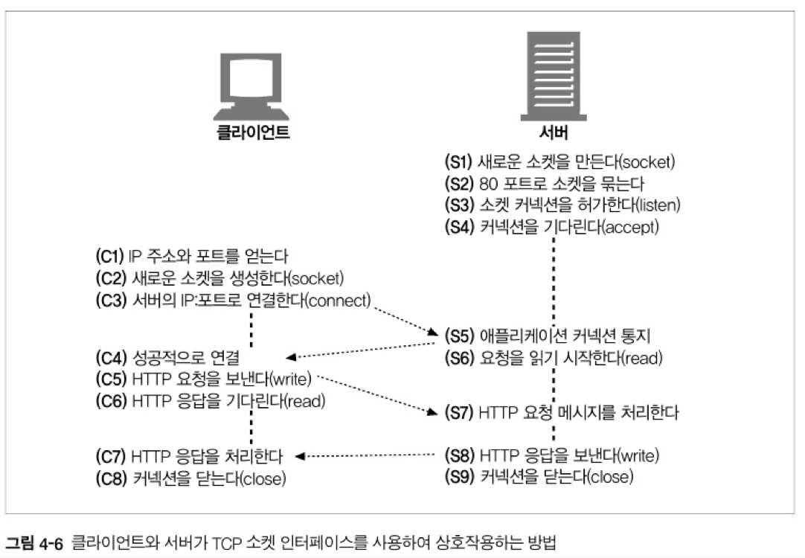

<!-- TOC -->

- ["1장" HTTP 개관](#1%EC%9E%A5-http-%EA%B0%9C%EA%B4%80)
    - [HTTP: 인터넷의 멀티미디어 배달부](#http-%EC%9D%B8%ED%84%B0%EB%84%B7%EC%9D%98-%EB%A9%80%ED%8B%B0%EB%AF%B8%EB%94%94%EC%96%B4-%EB%B0%B0%EB%8B%AC%EB%B6%80)
    - [~~1.2 웹 클라이언트와 서버~~](#12-%EC%9B%B9-%ED%81%B4%EB%9D%BC%EC%9D%B4%EC%96%B8%ED%8A%B8%EC%99%80-%EC%84%9C%EB%B2%84)
    - [리소스](#%EB%A6%AC%EC%86%8C%EC%8A%A4)
        - [미디어 타입](#%EB%AF%B8%EB%94%94%EC%96%B4-%ED%83%80%EC%9E%85)
        - [URI Uniform Resource Identifier](#uri-uniform-resource-identifier)
    - [트랜잭션](#%ED%8A%B8%EB%9E%9C%EC%9E%AD%EC%85%98)
        - [메서드](#%EB%A9%94%EC%84%9C%EB%93%9C)
        - [상태 코드](#%EC%83%81%ED%83%9C-%EC%BD%94%EB%93%9C)
    - [~~1.5 메시지~~](#15-%EB%A9%94%EC%8B%9C%EC%A7%80)
    - [TCP 커넥션](#tcp-%EC%BB%A4%EB%84%A5%EC%85%98)
        - [TCP/IP](#tcpip)
        - [접속, IP 주소 그리고 포트번호](#%EC%A0%91%EC%86%8D-ip-%EC%A3%BC%EC%86%8C-%EA%B7%B8%EB%A6%AC%EA%B3%A0-%ED%8F%AC%ED%8A%B8%EB%B2%88%ED%98%B8)
        - [~~1.6.3 Telnet을 이용한 실제 예제~~](#163-telnet%EC%9D%84-%EC%9D%B4%EC%9A%A9%ED%95%9C-%EC%8B%A4%EC%A0%9C-%EC%98%88%EC%A0%9C)
    - [프로토콜 버전](#%ED%94%84%EB%A1%9C%ED%86%A0%EC%BD%9C-%EB%B2%84%EC%A0%84)
    - [웹의 구성요소](#%EC%9B%B9%EC%9D%98-%EA%B5%AC%EC%84%B1%EC%9A%94%EC%86%8C)
        - [프록시](#%ED%94%84%EB%A1%9D%EC%8B%9C)
        - [캐시](#%EC%BA%90%EC%8B%9C)
        - [게이트웨이](#%EA%B2%8C%EC%9D%B4%ED%8A%B8%EC%9B%A8%EC%9D%B4)
        - [터널 ❓](#%ED%84%B0%EB%84%90-)
        - [에이전트](#%EC%97%90%EC%9D%B4%EC%A0%84%ED%8A%B8)
    - [~~1.9 시작의 끝~~](#19-%EC%8B%9C%EC%9E%91%EC%9D%98-%EB%81%9D)
- ["2장" URL과 리소스](#2%EC%9E%A5-url%EA%B3%BC-%EB%A6%AC%EC%86%8C%EC%8A%A4)
    - [인터넷의 리소스 탐색하기](#%EC%9D%B8%ED%84%B0%EB%84%B7%EC%9D%98-%EB%A6%AC%EC%86%8C%EC%8A%A4-%ED%83%90%EC%83%89%ED%95%98%EA%B8%B0)
    - [URL 문법](#url-%EB%AC%B8%EB%B2%95)
    - [단축 URL](#%EB%8B%A8%EC%B6%95-url)
        - [상대 URL](#%EC%83%81%EB%8C%80-url)
        - [URL 확장](#url-%ED%99%95%EC%9E%A5)
    - [안전하지 않은 문자](#%EC%95%88%EC%A0%84%ED%95%98%EC%A7%80-%EC%95%8A%EC%9D%80-%EB%AC%B8%EC%9E%90)
        - [URL 문자 집합](#url-%EB%AC%B8%EC%9E%90-%EC%A7%91%ED%95%A9)
        - [인코딩 체계](#%EC%9D%B8%EC%BD%94%EB%94%A9-%EC%B2%B4%EA%B3%84)
        - [문자 제한](#%EB%AC%B8%EC%9E%90-%EC%A0%9C%ED%95%9C)
    - [~~2.5 스킴의 바다~~](#25-%EC%8A%A4%ED%82%B4%EC%9D%98-%EB%B0%94%EB%8B%A4)
    - [~~2.6 미래~~](#26-%EB%AF%B8%EB%9E%98)
- ["3장" HTTP 메시지](#3%EC%9E%A5-http-%EB%A9%94%EC%8B%9C%EC%A7%80)
    - [헤더 분류](#%ED%97%A4%EB%8D%94-%EB%B6%84%EB%A5%98)
    - [안전한 네트워크 메소드](#%EC%95%88%EC%A0%84%ED%95%9C-%EB%84%A4%ED%8A%B8%EC%9B%8C%ED%81%AC-%EB%A9%94%EC%86%8C%EB%93%9C)
    - [확장 메서드](#%ED%99%95%EC%9E%A5-%EB%A9%94%EC%84%9C%EB%93%9C)
    - [상태코드](#%EC%83%81%ED%83%9C%EC%BD%94%EB%93%9C)
        - [300 - 399 리다이렉션 상태 코드](#300---399-%EB%A6%AC%EB%8B%A4%EC%9D%B4%EB%A0%89%EC%85%98-%EC%83%81%ED%83%9C-%EC%BD%94%EB%93%9C)
    - [헤더](#%ED%97%A4%EB%8D%94)
        - [일반 헤더 General Headers](#%EC%9D%BC%EB%B0%98-%ED%97%A4%EB%8D%94-general-headers)
            - [일반 캐시 헤더](#%EC%9D%BC%EB%B0%98-%EC%BA%90%EC%8B%9C-%ED%97%A4%EB%8D%94)
        - [요청 헤더 Request Headers](#%EC%9A%94%EC%B2%AD-%ED%97%A4%EB%8D%94-request-headers)
            - [Accept 관련 헤더](#accept-%EA%B4%80%EB%A0%A8-%ED%97%A4%EB%8D%94)
            - [조건부 요청 헤더](#%EC%A1%B0%EA%B1%B4%EB%B6%80-%EC%9A%94%EC%B2%AD-%ED%97%A4%EB%8D%94)
            - [요청 보안 헤더](#%EC%9A%94%EC%B2%AD-%EB%B3%B4%EC%95%88-%ED%97%A4%EB%8D%94)
        - [응답 헤더 Response Headers](#%EC%9D%91%EB%8B%B5-%ED%97%A4%EB%8D%94-response-headers)
            - [협상 헤더](#%ED%98%91%EC%83%81-%ED%97%A4%EB%8D%94)
        - [엔티티 헤더 Entity Headers](#%EC%97%94%ED%8B%B0%ED%8B%B0-%ED%97%A4%EB%8D%94-entity-headers)
            - [엔티티 캐싱 헤더](#%EC%97%94%ED%8B%B0%ED%8B%B0-%EC%BA%90%EC%8B%B1-%ED%97%A4%EB%8D%94)
        - [확장 헤더 Extension Hedaers](#%ED%99%95%EC%9E%A5-%ED%97%A4%EB%8D%94-extension-hedaers)
- ["4장" 커넥션 관리](#4%EC%9E%A5-%EC%BB%A4%EB%84%A5%EC%85%98-%EA%B4%80%EB%A6%AC)
    - [TCP 커넥션](#tcp-%EC%BB%A4%EB%84%A5%EC%85%98)
        - [TCP 소켓 프로그래밍](#tcp-%EC%86%8C%EC%BC%93-%ED%94%84%EB%A1%9C%EA%B7%B8%EB%9E%98%EB%B0%8D)
        - [TCP의 성능에 대한 고려](#tcp%EC%9D%98-%EC%84%B1%EB%8A%A5%EC%97%90-%EB%8C%80%ED%95%9C-%EA%B3%A0%EB%A0%A4)
            - [**TCP 커넥션의 핸드셰이크 설정**](#tcp-%EC%BB%A4%EB%84%A5%EC%85%98%EC%9D%98-%ED%95%B8%EB%93%9C%EC%85%B0%EC%9D%B4%ED%81%AC-%EC%84%A4%EC%A0%95)
            - [인터넷의 혼잡을 제어하기 위한 TCP의 느린 시작 slow-start](#%EC%9D%B8%ED%84%B0%EB%84%B7%EC%9D%98-%ED%98%BC%EC%9E%A1%EC%9D%84-%EC%A0%9C%EC%96%B4%ED%95%98%EA%B8%B0-%EC%9C%84%ED%95%9C-tcp%EC%9D%98-%EB%8A%90%EB%A6%B0-%EC%8B%9C%EC%9E%91-slow-start)
            - [데이터를 한데 모아 한 번에 전송하기 위한 nagle 알고리즘](#%EB%8D%B0%EC%9D%B4%ED%84%B0%EB%A5%BC-%ED%95%9C%EB%8D%B0-%EB%AA%A8%EC%95%84-%ED%95%9C-%EB%B2%88%EC%97%90-%EC%A0%84%EC%86%A1%ED%95%98%EA%B8%B0-%EC%9C%84%ED%95%9C-nagle-%EC%95%8C%EA%B3%A0%EB%A6%AC%EC%A6%98)
            - [TCP의 편승piggyback 확인응답acknowledgment을 위한 **확인응답 지연 알고리즘**](#tcp%EC%9D%98-%ED%8E%B8%EC%8A%B9piggyback-%ED%99%95%EC%9D%B8%EC%9D%91%EB%8B%B5acknowledgment%EC%9D%84-%EC%9C%84%ED%95%9C-%ED%99%95%EC%9D%B8%EC%9D%91%EB%8B%B5-%EC%A7%80%EC%97%B0-%EC%95%8C%EA%B3%A0%EB%A6%AC%EC%A6%98)
            - [TIME_WAIT 지연과 포트 고갈](#time_wait-%EC%A7%80%EC%97%B0%EA%B3%BC-%ED%8F%AC%ED%8A%B8-%EA%B3%A0%EA%B0%88)

<!-- /TOC -->
# "1장" HTTP 개관  

## 1.1 HTTP: 인터넷의 멀티미디어 배달부

HTTP는 **신뢰성 있는 데이터 전송 프로토콜**을 사용하기 때문에 전송 중 손상되거나 꼬이지 않음을 보장한다.  

> HTTP는 신뢰할 수 있거나 메세지 손실이 없는 연결을 요구할 뿐이다.  
> 인터넷 상의 가장 일반적인 두 개의 전송 프로토콜 중에서 TCP는 신뢰할 수 있으며 UDP는 그렇지 않다.  
> 그러므로 HTTP는 연결이 필수는 아니지만 연결 기반인 **TCP 표준에 의존**한다.

- [`mozilla` HTTP와 연결](https://developer.mozilla.org/ko/docs/Web/HTTP/Overview#http%EC%99%80_%EC%97%B0%EA%B2%B0)

## ~~1.2 웹 클라이언트와 서버~~

## 1.3 리소스

웹 서버는 웹 리소스를 관리하고 제공한다.  
- 웹 서버 파일 시스템의 정적파일 : 텍스트 파일, HTML파일, 이미지, 동영상 ...
- 요청에 따라 콘테츠를 생성하는 동적 콘텐츠 리소스
- **어떤 종류의 콘텐츠 소스도 리소스가 될 수 있다.**

### 1.3.1 미디어 타입

인터넷은 수천 가지 데이터 타입을 다루기 때문에, HTTP는 웹에서 전송되는 객체 각각에 `MIME (Multipurpose Internet Mail Extensions)` 타입이라는 **데이터 포멧 라벨**을 붙인다.  
- **{주 타입} `/` {부 타입}**
- `Mail`이라는 단어가 있는 이유는 설계된 이유가 메일 시스템에서 메시지가 오갈 때 겪는 문제점을 해결하기 위해 설계되었기 때문이다.
- HTTP에서도 멀티미디어 콘텐츠를 기술하고 라벨을 붙이기 위해 채택되었다.
- [`mozilla` MIME 타입의 전체 목록](https://developer.mozilla.org/ko/docs/Web/HTTP/Basics_of_HTTP/MIME_types/Common_types)
  
웹 서버는 모든  HTTP 객체 데이터(데이터 콘텐츠)와 함께 `MIME`타입을 보내준다.  
웹 브라우저는 서버로 부터 객체를 돌려 받을 때, **다룰 수 있는 객체인지 MIME 타입을 통해 확인한다.**  
  
### 1.3.2 URI (Uniform Resource Identifier)

**통합 자원 식별자**는 리소스를 지목하는 것이다.  
정보 리소스를 고유하게 식별하고 위치를 지정할 수 있다.  
  
[`footprint` URI,URL,URN](https://github.com/jdalma/footprints/blob/main/%EC%A0%95%EB%A6%AC/URI.md)
[`RFC3986` Uniform Resource Identifier (URI): Generic Syntax](https://www.ietf.org/rfc/rfc3986.txt)
  
A URI can be further classified as `a locator`, `a name`, or both.  
- **URL (Uniform Resource Locator)**
  - **통합 자원 지시자**는 리소스 식별자의 가장 흔한 형태이다.  
  - 특정 서버의 한 리소스에 대한 구체적인 위치를 서술한다.  
  - 리소스가 정확히 어디에 있고 어떻게 접근할 수 있는지 분명히 알려준다.  
- **URN (Uniform Resource Name)**
  - 콘텐츠를 이루는 한 리소스에 대해, 그 리소스의 위치에 영향 받지 않는 유일무이한 이름 역할을 한다.  
  - 리소스를 다른 곳으로 옮기더라도 문제 없이 동작한다.  

## 1.4 트랜잭션

**HTTP 트랜잭션**은 `요청 명령`과 `응답 결과`로 구성되어 있고, `HTTP 메시지`라고 불리는 정형화된 데이터 구조로 이루어져있다.  

### 1.4.1 메서드

**리소스와 행위를 분리**  
- **URI는 리소스만 식별**
- **리소스**와 해당 리소스를 대상으로 하는 **행위**를 분리
  - 리소스 : 회원
  - 행위 : 조회 , 등록 , 삭제 , 변경
- **GET** : 리소스 조회
- **POST** : 요청 데이터 처리 , 주로 등록에 사용
- **PUT** : 리소스를 대체 , 해당 리소스가 없으면 생성
- **PATCH** : 리소스 부분 변경
- **DELETE** : 리소스 삭제
- **HEAD** : GET과 동일하지만 메시지 부분을 제외하고 , 상태 줄과 헤더만 반환
- **OPTIONS** : 대상 리소스에 대한 통신 가능 옵션(메서드)을 설명 (주로 CORS에서 사용)
- **CONNECT** : 대상 자원으로 식별되는 서버에 대한 터널을 설정
- **TRACE** : 대상 리소스에 대한 경로를 따라 메시지 루프백 테스트를 수행

### 1.4.2 상태 코드

[`mozilla` HTTP response status codes](https://developer.mozilla.org/en-US/docs/Web/HTTP/Status)

## ~~1.5 메시지~~

## 1.6 TCP 커넥션

메시지가 어떻게 TCP 커넥션을 통해 한 곳에서 다른 곳으로 옮겨갈까?  

### 1.6.1 TCP/IP

HTTP는 애플리케이션 계층 프토콜이며, TCP/IP는 전송 계층 프로토콜이다.    
HTTP는 자신의 **메시지 데이터를 전송하기 위해 TCP를 사용한다.**  

### 1.6.2 접속, IP 주소 그리고 포트번호

인터넷 프로토콜 + 호스트 주소 + 포트 번호를 사용해 `TCP/IP` 커넥션을 맺어야 한다.  
  
1. 클라이언트는 서버의 URL에서 호스트 추출
2. 클라이언트는 서버의 호스트 명을 DNS를 통해 IP로 변환
3. 클라이언트는 서버의 URL에서 포트번호가 있으면 추출, 없으면 기본값 `80`
4. 클라이언트는 서버와 TCP 커넥션을 맺는다.
5. 클라이언트와 서버가 통신한다.

### ~~1.6.3 Telnet을 이용한 실제 예제~~

## 1.7 프로토콜 버전

1. `HTTP/0.9`
   - GET 메소드만 지원
   - MIME 타입 미지원
   - HTTP 헤더, 버전 번호 미지원
   - 간단한 HTML 객체를 받아오기 위해 만들어졌지만, 금방 HTTP/1.0으로 대체되었다.
2. `HTTP/1.0`
   - 버전 번호, HTTP 헤더, 추가 메서드, 멀티미디어 객체 처리 추가
   - 급성장하던 시기에 만들어진, 잘 동작하는 용례들의 모음에 가깝다.
3. `HTTP/1.0+`
   - (공식적이진 않지만) `keep-alive` 커넥션, 가상 호스팅 지원, 프락시 연결 지원 등등
4. `HTTP/1.1`
   - HTTP 설계의 구조적 결함 교정, 성능 최적화, 잘못된 기능 제거에 집중
5. `HTTP/2.0`
   - [HTTP/2 더 스마트한 규모](https://www.cncf.io/blog/2018/07/03/http-2-smarter-at-scale/)
   - [HTTP/2 소개](https://web.dev/performance-http2/)
   - [`RFC7540` HTTP/2](https://httpwg.org/specs/rfc7540.html#top)
   - [`RFC7540` HTTP/2 WINDOW_UPDATE](https://httpwg.org/specs/rfc7540.html#WINDOW_UPDATE)

  
> **1대로 멀티 도메인을 가능하게 하는 `가상 호스트`**  
> HTTP/1.1 에서는 하나의 HTTP 서버에 여러 개의 웹 사이트를 실행할 수 있다  
> - 1대의 서버에 여러 고객의 웹 사이트를 넣을 수 있다
> - HTTP 리퀘스트를 보내는 경우에는 호스트 명과 도메인 명을 완전하게 포함한 URI를 지정하거나, 반드시 Host 헤더 필드에서 지정해야 한다  
> [그림으로 배우는 HTTP & Network](http://www.yes24.com/Product/Goods/15894097)

## 1.8 웹의 구성요소

### 1.8.1 프록시 

클라이언트와 서버 사이에 위치한 HTTP 중개자, 클라이언트의 모든 HTTP 요청을 받아 서버에 전달(대개 요청을 수정한 뒤에)한다.  
사용자를 대신해서 서버에 접근하며, 주로 보안을 위해 사용한다.  
  
> 서버와 클라이언트의 양쪽 역할을 하는 중계 프로그램으로 , 클라이언트로 부터의 리퀘스트를 서버에 전송하고 , 서버로 부터의 리스폰스를 클라이언트로 전달  
> 리소스 본체를 가진 서버를 `origin server`라고 부른다  
> 프록시 서버를 경유해서 요청과 응답이 릴레이 될 때마다 **Via**헤더 필드에 경유한 호스트 정보를 추가해야 한다  
> 프록시 서버를 사용하는 이유는 **캐시를 사용해서 네트워크 대역등을 호율적으로 사용하는 것과 조직 내에 특정 웹사이트에 대한 엑세스 제한 등등**  
> 프록시와 게이트웨이의 차이는 프록시로 보낸다기 보다는 `origin server`를 보냈지만 중간에 프록시가 끼게 되는 것  

### 1.8.2 캐시

자신을 거쳐가는 문서들 중 자주 찾는 것의 사본을 저장해 두는, **특별한 종류의 HTTP 프록시 서버**다.  
통신량과 통신시간을 절약하고 캐시에 저장된 사본을 동기화하기 위한 많은 기술들이 적용된다.  

### 1.8.3 게이트웨이

다른 서버들의 중개자로 동작하는 특별한 서버다.  
주로 **HTTP 트래픽을 다른 프로토콜로 변환하기 위해 사용된다.**  
스스로가 리소스를 갖고 있는 진짜 서버인 것 처럼 요청을 다룬다.  

### 1.8.4 터널 ❓

두 커넥션 사이에서 `raw` 데이터를 열어보지 않고 그대로 전달해주는 HTTP 애플리케이션이다.  
대표적인 예로, 암호화된 SSL 트래픽을 HTTP 커넥션으로 전송함으로써 웹 트래픽만 허용하는 사내 방화벽을 통과시키는 것이다.  
  
### 1.8.5 에이전트

사용자를 위해 HTTP 요청을 만들어주는 클라이언트 프로그램  
**웹 요청을 만드는 애플리케이션은 뭐든 HTTP 에이전트다.**  
지금까지는 웹브라우저에 대한 HTTP 에이전트를 얘기한 것이므로 이 외에도 여러가지 종류가 더 있다.  
  
예를 들어, 사람의 통제 없이 스스로 웹을 돌아다니며 HTTP 트랜잭션을 일으키고 콘텐츠를 받아오는 자동화된 사용자 에이전트가 있다.  
- 스파이더, 웹로봇


## ~~1.9 시작의 끝~~

***

# "2장" URL과 리소스

> **리소스?**  
> 이 장에서 아용되는 **리소스**는 텍스트,이미지,동영상 같이 웹에서 사용되는 식별을 할 수 있는 모든 자원을 가리킨다.  
> [`RFC2396` Resource](https://www.rfc-editor.org/rfc/rfc2396#section-1.1)

**리소스를 분류하기 위해서 모든 것은 그만의 표준화된 이름을 가지고 있다.**  

## 2.1 인터넷의 리소스 탐색하기

`URL`은 브라우저가 정보를 찾는데 필요한 리소스의 위치 가리키고, `URL`을 통해 HTTP 및 다른 프로토콜을 통해 접근할 수 있다.  
- 브라우저가 화면 뒤에서 사용자가 원하는 리소스를 얻기 위해서 적절한 프로토콜을 사용하여 메시지를 전송한다.
  
> `URL`은 `URI`의 부분 집합이다. 대부분의 `URL`은 **스킴://서버위치/경로** 구조로 이루어져있다. (단일 방식의 작명 규칙)  
> `URI` = `URL` + `URN`


- [출처](https://programming119.tistory.com/194)

많은 사용자는 브라우저가 요청하는 리소스를 가져오는데 사용되는 프로토콜과 접근 방식이 무엇인지 모른다.  
`URL`은 브라우저가 정보를 찾을 때 필요한 정보를 모두 제공하며, **원하는 리소스가 어디에 위치하고 어떻게 가져오는지 정의하는 것**이다.  

## 2.2 URL 문법

리소스들은 여러 스킴을 사용하며 (`HTTP`, `FTP`, `SMTP`), 대부분의 URL은 일반 URL문법을 따르며, 서로 다른 URL 스킴도 형태와 문법 면에서 매우 유사하다.  
  
**`<스킴>://<사용자이름>:<비밀번호>@<호스트>:<포트>/<경로>;<파라미터>?<질의>#<프래그먼트>`**

## 2.3 단축 URL

### 2.3.1 상대 URL

URL은 **상대 URL**과 **절대 URL** 두 가지로 나뉜다.  

**절대 URL**  
- 리소스에 접근하는데 필요한 모든 정보를 가지고 있다.
  
**상대 URL**  
URL을 짧게 표기하는 방식  
리소스에 접근하는데 필요한 모든 정보를 얻기 위해서는 `기저(base)`라고 하는 다른 `URL`을 사용해야 한다.  
특정 `HTML`파일에 `<a>`링크로 작성되어있는 URL은 **문서의 URL을 기준으로 상대 경로로 해석할 수 있다.**  
컴포넌트가 포함된 리소스의 `기저 URL`에서 알아낼 수 있다.  
  
**기저 URL**  
1. **리소스에서 명시적으로 제공**
   1. HTML 문서에서는 그 안에 있는 모든 상대 URL를 변경하기 위해서 기저 URL을 가리키는 `<BASE>` HTML 태그를 기술할 수 있다
2. **리소스를 포함하고 있는 기저 URL**
   1. 기저 URL이 명시되지 않은 리소스에 포함된 경우, 해당 리소스의 URL을 기저 URL로 사용할 수 있다
3. **기저 URL이 없는 경우**
   1. 절대 URL만으로 이루어져 있거나, URL이 잘못 기재되어있을 수 있다
  
**상대 참조 해석하기**  

상대 URL을 절대 URL로 변환하기 위해서는 **상대 URL과 기저 URL을 각각의 컴포넌트 조각으로 나누어야 한다.**  
아래의 알고리즘은 `RFC1808`에 최초로 기술되었고, 그 이후 `RFC 2396`에 포함되었다.  


- [출처](https://feel5ny.github.io/2019/08/09/HTTP_002/)

### 2.3.2 URL 확장

**어떤 브라우저들은 URL을 입력한 다음이나 입력하고 있는 동안 자동으로 URL을 확장한다.**  
이러한 확장 기능은 두 가지로 나뉘는데 (해당 내용은 6장에서 자세하게 다룬다.)
  
1. **호스트 명 확장**
   1. 호스트 명 확장 기능을 지원하는 브라우저는 **단순한 휴리스틱만을 사용해서 전체 호스트명으로 확장할 수 있다.**
   2. 하지만 해당 확장 기능은 프락시와 같은 다른 HTTP 어플리케이션에 문제를 발생 시킬 수 있다.
2. **히스토리 확장**
   1. 과거에 사용자가 방문했던 URL 기준으로 확장한다.

## 2.4 안전하지 않은 문자

"안전한 전송"이란, **정보가 유실될 위험 없이 URL을 전송할 수 있다**는 것을 의미한다.  
SMTP같은 프로토콜은 특정 문자를 제거할 수도 있는 전송 방식을 사용한다.  
- 메시지에 대해 7비트 인코딩을 사용하기 떄문에, 소스가 8비트 이상으로 인코딩되어 있으면 정보가 소실될 수 있다.
- 출력이 되지 않거나 보이지 않는 다른 프로그램에서 사용할 수 있더라도 URL에서는 금지되었다.
- [`RFC 2396` Recommendations for Delimiting URI in Context](https://www.rfc-editor.org/rfc/rfc2396#appendix-E)
- [`RFC 2396` 1.6. Syntax Notation and Common Elements](https://www.rfc-editor.org/rfc/rfc2396#section-1.6)
  
**문자가 제거되는 일을 피하고자 URL은 상대적으로 작고 안전한 알파벳 문자만 포함하도록 허락한다.**  
사용할 수 있는 알파벳과 URL의 인코딩 규칙을 알아보자

### 2.4.1 URL 문자 집합

많은 컴퓨터 애플리케이션이 `US-ASCII` 문자 집합을 사용해왔다.  
- 문자를 서식화하고 하드웨어상에서 신호를 주고받기 위해, 7비트를 사용하여 영문 자판에 있는 키 대부분과 몇몇 출력되지 않는 제어 문자를 표현한다.
- 수많은 언어들에 존재하는 모든 경우를 지원하지는 않는다.
- URL이 특정 **이진 데이터**를 포함하게 되는 경우가 있어, 이것을 지원하기 위해 **이스케이프 문자열**을 작성할 수 있게 설계하였다.
- 특정 문자나 데이터를 인코딩할 수 있게 한다.
  
### 2.4.2 인코딩 체계

문자 집합 표현의 한계를 넘기 위해, `URL`에 있는 **안전하지 않은 문자들을 퍼센티지 기호`%`로 시작해, `ASCII`코드로 표현되는 두 개의 16진수 숫자로 이루어진 "이스케이프"문자로 바꾼다.**  
  
**헤더** : 알고리즘.md의 **균형 vs 비균형 (레드-블랙 트리 , AVL트리 ->고급 주제에서 다룰 예정)** 헤더  
**URL 표현** : 알고리즘#균형-vs-비균형-레드-블랙-트리--avl트리--고급-주제에서-다룰-예정  
**URL** : %EC%95%8C%EA%B3%A0%EB%A6%AC%EC%A6%98#%EA%B7%A0%ED%98%95-vs-%EB%B9%84%EA%B7%A0%ED%98%95-%EB%A0%88%EB%93%9C-%EB%B8%94%EB%9E%99-%ED%8A%B8%EB%A6%AC--avl%ED%8A%B8%EB%A6%AC--%EA%B3%A0%EA%B8%89-%EC%A3%BC%EC%A0%9C%EC%97%90%EC%84%9C-%EB%8B%A4%EB%A3%B0-%EC%98%88%EC%A0%95
  

### 2.4.3 문자 제한

몇몇 문자는 URL 내에서 특별한 의미로 예약되어 있다.  
`US-ASCII`에 출력 가능한 문자 집합에 포함되어 있지 않거나, 몇몇 인터넷 게이트웨이와 프로토콜에서 혼동되는 것으로 알려져 있어서 사용이 꺼려지기도 했다.  
아래의 문자들은 **본래의 목적이 아닌 다른 용도로 사용하려면, 그전에 반드시 인코딩해야 하는 문자들을 나열해 놓았다.**  
- 인코딩은 전송하기에 안전하지 않은 문자에만 적용해야 한다.

  
|문자|선점 및 제한|
|---|---|
|`%`|인코딩된 문자에 사용할 이스케이프 토큰으로 선점|
|`/`|경로 컴포넌트에 있는 경로 세그먼트를 나누는 용도로 선점|
|`.`, `..`|경로 컴포넌트에서 선점|
|`#`|프래그먼트의 구획 문자로 선점|
|`?`|질의 문자열의 구획 문자로 선점|
|`;`|파라미터의 구획 문자로 선점|
|`:`|스킴, 사용자 이름/비밀번호, 호스트/포트의 구획 문자로 선점|
|`$`, `+`|선점|
|`@`, `&`, `=`|특정 스킴에서 특별한 의미가 있기 때문에 선점|
|**{} \| \ ~ [ ] `**|게이트웨이와 같은 여러 전송 에이전트에서 불안전하게 다루기 때문에 제한됨|
|`<`, `>`, `"`|안전하지 않지만, URL 범위 밖에서 역할이 있는 문자이기 때문에 반드시 인코딩 해야 한다.|
  
안전하지 않은 문자를 애플리케이션 개발자들이 인코딩 하지 않는 것은 큰 실수다.  
**안전하지 않은 모든 문자를 인코딩하기만 한다면, 애플리케이션 간에 공유할 수 있는 URL의 원형을 유지할 수 있다.**  

## ~~2.5 스킴의 바다~~

## ~~2.6 미래~~

***

- HTTP/1.1 준수를 위해서는 HEAD 메서드가 반드시 구현되어 있어야 한다. 62p
  - HEAD 메서드가 꼭 필요한 이유가 뭘까
  - [`RFC7231` 4.3.2 HEAD](https://www.rfc-editor.org/rfc/rfc7231#section-4.3.2)에서도 꼭 지원해야한다는 말은 없고 하이퍼링크를 테스트할 때 사용하기도 한다고만 나와있다.
- Accept 헤더 관련해서 스프링의 consumes, produces를 어디까지 활용하시는지??
  - 대부분의 API가 JSON을 반환하는데 모두 명시해줘야 하나?
  - 같은 경로의 API가 consumes가 겹치면 안되지만, produces는 같은 API 경로로 등록해서 클라이언트가 호출하고 싶은 API를 Accept로 선택해서 호출이 가능하던데, 이럴때 활용할 수 있을까?

# "3장" HTTP 메시지

HTTP 메시지는 HTTP 애플리케이션 간에 주고 받은 데이터의 블록들이며, 클라이언트,서버,프록시 사이를 흐른다.  
HTTP는 **인바운드**와 **아웃바운드**라는 용어를 트랜잭션 방향을 표현하기 위해 사용한다.  
  
**메시지는 원 서버 방향으로 `인바운드`로 이동하고 클라이언트로 `아웃바운드`로 복귀한다.**  
- 서버 기준으로 생각하면 쉽다.
  
**요청 메시지, 응답 메시지에 관계없이 모든 메시지는 `다운 스트림`으로 흐른다.**  

## 헤더 분류

각 HTTP 헤더는 간단한 문법을 가진다.  
이름, 쉼표, 공백(필수 아님), 필드 값, CRLF가 순서대로 온다.  
**헤더를 여러 줄로 나누기 위해서는 추가 줄 앞에 `최소 하나의 스페이스` 또는 `탭 문자`가 와야한다.  
  
1. 일반 헤더
2. 요청 헤더
3. 응답 헤더
4. Entity 헤더
   1. 본문 크기와 컨텐츠, 혹은 리소스 그 자체를 서술
5. 확장 헤더
   1. 명세에 정의되어 있지 않은 헤더

## 안전한 네트워크 메소드

HTTP는 안전한 메서드라 불리는 **메서드의 집합**을 정의한다.  
`GET`과 `HEAD`메서드는 안전하다고 할 수 있는데, 이는 요청 결과로 인해 서버에서 아무 일도 일어나지 않는다는 것이다.  

`HEAD`메서드는 정확히 `GET`처럼 해동하지만, 서버는 응답으로 헤더만을 돌려준다.  
1. 리소스를 가져오지 않고도 그에 대한 타입이나 크기를 알아낼 수 있다.
2. 응답의 상태코드를 통해, 개체가 존재하는지 확인할 수 있다.
3. 헤더를 확인하여 리소스가 변경되었는지 검사할 수 있다.
4. 서버 개발자는 `GET`으로 얻는 것과 정확히 일치함을 보장해야 한다.
5. **HTTP/1.1 준수를 위해서는 HEAD 메서드가 반드시 구현되어 있어야 한다.**

## 확장 메서드

HTTP는 필요에 따라 확장해도 문제가 없도록 설계되어 있으며 **확장 메서드는 HTTP/1.1 명세에 정의되어 있지 않은 메서드다.**  

|메소드|설명|
|------|---|
|`LOCK`|사용자가 리소스를 잠글 수 있게 해준다.|
|`MKCOL`|사용자가 문서를 생성할 수 있게 해준다.|
|`COPY`|서버에 있는 리소스를 복사한다.|
|`MOVE`|서버에 있는 리소스를 옮긴다.|

> "엄격하게 보내고 관대하게 받아들여라"

## 상태코드

### `300 - 399` 리다이렉션 상태 코드 

`302`와 `303`, `307` 상태 코드는 중복되는 의미를 가지고 있는데,  
`HTTP/1.0` 클라이언트가 요청을 보내고 `302 상태 코드`가 담긴 응답을 받으면, 클라이언트는 **Location 헤더**에 들어있는 리다이렉트 URL을 GET 요청으로 따라갈 것이다.  
하지만 `HTTP/1.1`은 위와 같은 리다이렉션을 위해 `303 상태 코드`를 사용한다.  
  
이 혼란을 막기위해 `HTTP/1.1` 명세는 일시적인 리다이렉트를 위해 `302`대신 `307`을 사용하라고 한다.  
결국 서버는 **리다이렉트 응답에 들어갈 가장 적절한 리다이렉트 상태 코드를 선택하기 위해 클라이언트의 HTTP 버전을 검사할 필요가 있다.**  
  
> Note: For historical reasons, a user agent MAY change the request method from POST to GET for the subsequent request.  
> If thisbehavior is undesired, the 307 (Temporary Redirect) status code can be used instead.  
> [`RFC 7231` 302 Found](https://www.rfc-editor.org/rfc/rfc7231#section-6.4.3)
  

## 헤더

헤더는 크게 다섯 가지로 분류된다.

### 일반 헤더 (General Headers)

일반 헤더는 클라이언트와 서버 양쪽 모두가 사용한다.  
- `Connection`
- `Date`
- `MIME-Version`
- `Trailer chunked transfer`
- `Transfer-Encoding`
- `Upgarde`
- `Via`

#### 일반 캐시 헤더

`HTTP/1.0`은 HTTP 애플리케이션에게 매번 원 서버로부터 객체를 가져오는 대신 **로컬 복사본으로 캐시할 수 있도록 해주는 최초의 헤더를 도입**했다.  
- `Cache-Control` : 메시지와 함께 캐시 지시자를 전달하기 위해 사용
- `Pragma` : 메시지와 함께 지시자를 전달하는 또 다른 방법, 캐시에 국한되지 않는다.

### 요청 헤더 (Request Headers)

요청 헤더는 요청 메시지에서만 의미를 갖는 헤더다.  
**요청이 최초 발생한 곳에서 누가 혹은 무엇이 그 요청을 보냈는지에 대한 정보나 클라이언트의 선호나 능력에 대한 정보를 준다.**  
서버에게 클라이언트가 받고자 하는 데이터의 타입이 무엇인지와 같은 부가정보를 제공한다.  

#### Accept 관련 헤더

클라이언트가 서버에게 **자신의 선호와 능력을 알려줄 수 있다.**  
서버는 이 추가 정보를 활용해서 무엇을 보낼것인가에 대해 똑똑한 결정을 할 수 있다.  
이 헤더는 **서버와 클라이언트 양쪽 모두에게 유익하다.**  

```
   +-------------------+---------------+
   | Header Field Name | Defined in... |
   +-------------------+---------------+
   | Accept            | Section 5.3.2 |
   | Accept-Charset    | Section 5.3.3 |
   | Accept-Encoding   | Section 5.3.4 |
   | Accept-Language   | Section 5.3.5 |
   +-------------------+---------------+
```

[`RFC7231` Content Negotiation](https://www.rfc-editor.org/rfc/rfc7231#section-5.3)

#### 조건부 요청 헤더

클라이언트는 요청에 몇몇 제약을 넣기도 한다.  
클라이언트는 서버에게 요청에 응답하기 전에 먼저 조건이 참인지 확인하게 하는 제약을 포함시킬 수 있다.  

```
   +---------------------+--------------------------+
   | Header Field Name   | Defined in...            |
   +---------------------+--------------------------+
   | If-Match            | Section 3.1 of [RFC7232] |
   | If-None-Match       | Section 3.2 of [RFC7232] |
   | If-Modified-Since   | Section 3.3 of [RFC7232] |
   | If-Unmodified-Since | Section 3.4 of [RFC7232] |
   | If-Range            | Section 3.2 of [RFC7233] |
   +---------------------+--------------------------+
```

[`RFC7231` Conditionals](https://www.rfc-editor.org/rfc/rfc7231#section-5.2)
  
#### 요청 보안 헤더

**HTTP는 자체적으로 요청을 위한 간단한 `인증요구/응답`체계를 갖고 있다.**  

```
   +---------------------+--------------------------+
   | Header Field Name   | Defined in...            |
   +---------------------+--------------------------+
   | Authorization       | Section 4.2 of [RFC7235] |
   | Proxy-Authorization | Section 4.4 of [RFC7235] |
   +---------------------+--------------------------+
```

### 응답 헤더 (Response Headers)

응답 메시지는 클라이언트에게 정보를 제공하기 위한 헤더이다.
- `Server` 헤더

```
   +-------------------+--------------------------+
   | Header Field Name | Defined in...            |
   +-------------------+--------------------------+
   | Age               | Section 5.1 of [RFC7234] |
   | Cache-Control     | Section 5.2 of [RFC7234] |
   | Expires           | Section 5.3 of [RFC7234] |
   | Date              | Section 7.1.1.2          |
   | Location          | Section 7.1.2            |
   | Retry-After       | Section 7.1.3            |
   | Vary              | Section 7.1.4            |
   | Warning           | Section 5.5 of [RFC7234] |
   +-------------------+--------------------------+
```

- [RFC7231](https://www.rfc-editor.org/rfc/rfc7231)
- [RFC7234](https://www.rfc-editor.org/rfc/rfc7234)

#### 협상 헤더

서버에 HTML 문서가 다국어 지원을 하는 것과 같이 여러가지 표현이 가능한 상황이라면, 어떤 표현을 택할 것인가에 대한 협상을 할 수 있도록 지원한다.  
- `Accept-Ranges` : 서버가 자원에 대해 받아들일 수 있는 범위의 형태
- `Vary` : 응답에 영향을 줄 수 있는 헤더들의 목록, **서버가 클라이언트에게 보내줄 리소스의 가장 적절한 버전을 선택하기 위해 살펴보아야하는 헤더들의 목록**

### 엔티티 헤더 (Entity Headers)

엔티티 본문에 대한 헤더를 말하며, 엔티티 본문에 들어있는 데이터의 타입이 무엇인지 말해줄 수 있다.  
- `Content-Type`
- `charset`
- `Allow` : 이 엔티티에 대해 수행될 수 있는 요청 메서드들을 나열
- `Location` : 자원의 위치 URL (리다이렉트)

#### 엔티티 캐싱 헤더

엔티티 캐싱에 대한 정보를 제공한다.  
리소스에 대해 캐시된 사본이 아직 유요한지에 대한 정보와, 캐시된 리소스가 더 이상 유효하지 않게 되는 시점을 추정하기 위한 단서 같은 것이다.  

```
   +-------------------+--------------------------+
   | Header Field Name | Defined in...            |
   +-------------------+--------------------------+
   | ETag              | Section 2.3 of [RFC7232] |
   | Last-Modified     | Section 2.2 of [RFC7232] |
   +-------------------+--------------------------+
```

- [RFC7232](https://www.rfc-editor.org/rfc/rfc7232)

### 확장 헤더 (Extension Hedaers)

서버 개발자들에 의해 만들어진 비표준 헤더다.  


# "4장" 커넥션 관리

HTTP 애플리케이션을 개발하고 있다면 HTTP 커넥션과 그것이 어떻게 사용되는지에 대해 잘 이해하고 있어야한다.  

## 4.1 TCP 커넥션

세계 어디서든 클라이언트 애플리케이션은 서버 애플리케이션으로 `TCP/IP` 커넥션을 맺을 수 있다.  
커넥션이 맺어지면 **주고받는 메시지들은 손실 혹은 손상되거나 순서가 바뀌지 않고 안전하게 전달된다.**  
- [`footprints` TCP/UDP](https://github.com/jdalma/footprints/blob/main/%EC%A0%95%EB%A6%AC/TCP%EC%99%80UDP.md)
  
HTTP 커넥션은 몇몇 사용 규칙을 제외하고는 TCP 커넥션에 불과하다.  
1. TCP는 신뢰할 수 있는데 데이터 전송 통로
   1. TCP 커넥션의 한쪽에 있는 바이트들은 반대편쪽으로 순서에 맞게 정확히 전달된다.
2. TCP 스트림은 `세그먼트`로 나뉘어 IP 패킷을 통해 전송된다.
   1. TCP는 IP 패킷 (혹은 IP 데이터그램)이라고 불리는 작은 조각을 통해 데이터를 전송한다.
   2. TCP는 `세그먼트`라는 단위로 데이터 스트림을 잘게 나누고, 세그먼트를 `IP 패킷`이라고 불리는 봉투에 담아 인터넷을 통해 데이터를 전달한다.


> IP 패킷  
> - IP 패킷 헤더 (보통 20바이트)
> - TCP 세그먼트 헤더 (보통 20바이트)
> - TCP 데이터 조각 (0 혹은 그 이상의 바이트)

  
**TCP는 포트 번호를 통해서 여러 개의 TCP 커넥션을 여러 개 가지고 있고 이를 유지한다.**  
TCP 커넥션은 `<발신지 IP 주소, 발신지 포트, 수신지 IP 주소, 수신지 포트>` 4가지 값으로 식별한다.  

### TCP 소켓 프로그래밍

소켓 API는 HTTP 프로그래머에게 TCP와 IP의 세부사항을 숨기기 위해, 추상화되어 있다.  
- 네트워크 프로토콜의 핸드셰이킹
- TCP 데이터 스트림과 IP 패킷 간의 분할 및 재조립에 대한 모든 세부사항

지금은 다양한 구현체들 덕분에 대부분의 운영체제와 프로그램 언어에서 이를 사용할 수 있게 되었다.  
  


### TCP의 성능에 대한 고려

HTTP는 TCP 바로 위에 있는 계층이기 때문에, HTTP 트랜잭션의 성능은 TCP 계층의 영향을 받는다.  
**대부분의 HTTP 지연은 TCP 네트워크 지연에 의해 발생한다.**  
  
#### **TCP 커넥션의 핸드셰이크 설정**
- 핸드셰이크 단계는 `SYN`과 `SYN/ACK`를 의미하며, 클라이언트는 `ACK`와 동시에 실제 요청을 전송한다.  
- 크기가 작은 HTTP 트랜잭션은 50% 이상의 시간을 TCP를 구성하는 데 쓴다.

#### 인터넷의 혼잡을 제어하기 위한 TCP의 느린 시작 (`slow-start`)

#### 데이터를 한데 모아 한 번에 전송하기 위한 `nagle` 알고리즘


#### TCP의 편승(`piggyback`) 확인응답(`acknowledgment`)을 위한 **확인응답 지연 알고리즘**
- 인터넷 자체가 패킷 전송을 완벽히 보장하지 않기 떄문에(인터넷 라우터는 과부하가 걸렸을 때 패킷을 마음대로 패기할 수 있다.), **TCP는 성공적인 데이터 전송을 보장하기 위해서 자체적인 확인 체계를 가진다.**
- 각 TCP 세그먼트는 **순번**과 **데이터 무경설 체크섬**을 가진다.
- 각 세그먼트의 수신자는 세그먼트를 온전히 받으면 작은 확인응답 패킷을 송신자에게 반환하며, 특정 시간안에 송신자가 확인응답 패킷을 받지 못하면 데이터를 다시 전송한다.
  - 확인응답 패킷은 작기 때문에 **송출 데이터 패킷에 확인응답을 편승(`piggyback`) 시킨다.**
  - 송출할 확인응답을 특정 시간 동안(보통 0.1~0.2)초 버퍼에 저장해두고 편승시킬 송출 데이터 패킷을 찾는다.
  - 일정시간안에 찾지 못한다면 별도 패킷으로 만들어 전송한다.

#### `TIME_WAIT` 지연과 포트 고갈


