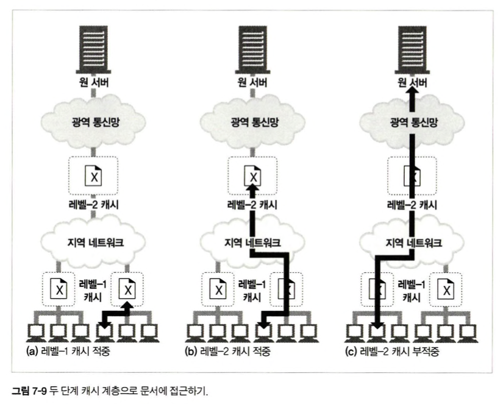

# "5장" 웹 서버

## 5.1 다채로운 웹 서버

기능은 달라도, **모든 웹 서버는 리소스에 대한 HTTP 요청을 받아서 콘텐츠를 클라이언트에게 돌려준다.**  
**웹 서버는 HTTP 및 그와 관련된 TCP처리를 구현한 것이다.**  
- TCP 커넥션 관리에 대한 책임을 운영체제와 나눠 갖는다.

1. **커넥션을 맺는다.**
2. **요청을 받는다.** : HTTP 요청 메시지를 네트워크로부터 읽어들인다.
3. **요청을 처리한다.** : 요청 메시지를 해석하고 행동을 취한다.
4. **리소스에 접근한다.** : 메시지에서 지정한 리소스에 접근한다.
5. **응답을 만든다.** : 올바른 헤더를 포함한 HTTP 응답 메시지를 생성한다.
6. **응답을 보낸다.** : 응답을 클라이언트에게 돌려준다.
7.  **트랜잭션을 로그로 남긴다.** : 로그파일에 트랜잭션 완료에 대한 기록을 남긴다.
  
### **단계 1 : 클라이언트 커넥션 수락**

1. **새 커넥션 다루기**
   - 클라이언트가 웹 서버에 TCP 커넥션을 요청하면, **웹서버는 커넥션을 맺고 TCP 커넥션에서 IP 주소를 추출하여 커넥션 맞은편에 어떤 클라이언트가 있는지 확인한다.**  
   - 동일한 커넥션이 생성되지 않도록 새 커넥션을 커넥션 목록에 추가한다.  
2. **클라이언트 호스트 명 식별**
   - 대부분의 웹 서버는 `reverse DNS`를 사용해서 클라이언트의 IP 주소를 클라이언트의 호스트 명으로 반환하도록 설정되어 있다.
   - 아파치에서는 `HostnameLookups` 설정 지시자로 호스트 명 룩업을 켤 수 있다.
3. **`ident`를 통해 클라이언트 사용자 알아내기**
   - [`RFC1413` Identification Protocol](https://www.rfc-editor.org/rfc/rfc1413)
   - 몇몇 웹서버는 `IETF ident 프로토콜`을 지원한다. 서버에게 어떤 사용자 이름이 HTTP 커넥션을 초기화했는지 찾아낼 수 있게 해준다.
   - 여러 이유로 인해 보통 `ident 로그 필드`를 `-`으로 채우며, 잘 사용되지 않는다.

### **단계 2 : 요청 메시지 수신**

커넥션에 데이터가 도착하면, 수신자는 네트워크 커넥션에서 데이터를 읽어들이고 파싱하여 요청 메시지를 구성한다.  

1. 요청줄을 파싱하여 `요청 메서드`, `지정된 리소스의 식별자(URI)`, `버전 번호`를 찾는다.
   1. 각 값은 스페이스 한 개로 분리되어 있고, 요청줄은 캐리지 줄바꿈 문자열(CRLF)로 끝난다.
2. 메시지 헤더들을 읽는다. 각 메시지 헤더도 CRLF로 끝난다.
3. 헤더의 끝을 의미하는 CRLF로 끝나는 빈 줄을 찾아낸다 (존재한다면)
4. 요청 본문이 있다면 길이는 `Content-Length` 헤더로 정의하며, 본문을 읽어들인다.
  
#### 메시지의 내부 표현

몇몇 웹 서버는 요청 메시지를 쉽게 다룰 수 있도록 내부의 자료 구조에 저장한다.  


#### 커넥션 I/O 아키텍처 📌

고성능 웹 서버는 수천 개의 커넥션을 동시에 열 수 있도록 지원한다.  
**웹 서버 아키텍처의 차이에 따라 요청을 처리하는 방식도 달라진다.**  


- **단일 스레드 웹 서버**
  - **한 번에 하나씩 요청을 처리한다.**
  - 하나의 트랜잭션이 완료되면 다음 커넥션이 처리된다.
  - 처리 도중에 다른 커넥션은 무시되어 심각한 성능 문제를 만들어낸다.
- **멀티프로세스와 멀티스레드 웹 서버**
  - 멀티프로세스와 멀티스레드 웹 서버는 **여러 요청을 동시에 처리하기 위해 `여러 개의 프로세스 혹은 고효율 스레드를 할당한다.`**
  - 스레드/프로세스는 필요할 때 마다 만들어질 수도 있고 미리 만들어질 수 있다.
  - 많은 멀티 웹 스레드 서비스는 스레드/프로세스의 개수에 최대 제한을 건다.
- **다중 I/O 서버**
  - 대량의 커넥션을 지원하기 위해, 많은 웹 서버가 채택한 방식이다.
  - **모든 커넥션은 동시에 그 활동을 감시당한다.**
  - 커넥션의 상태가 바뀌면 처리가 수행되고, 완료되면 커넥션은 다음 번 상태 변경을 위해 열린 커넥션 목록으로 돌아간다.
  - 어떤 커넥션에 대해 작업을 수행하는 것은 그 커넥션에 실제로 해야 할 일이 있을 때뿐이다.
  - 유휴 상태의 커넥션을 기다리지 않는다.
- **다중 멀티스레드 웹 서버**
  - 몇몇 시스템은 자신이 가지고 있는 여러 개의 CPU 시스템을 효율적이게 활용하기 위해 **멀티스레딩**과 **다중화**를 결합한다.
  - 여러 개의 스레드는 각각 열려있는 커넥션을 감시하고 각 커넥션에 대해 조금씩 작업을 수행한다.

### ~~단계 3 : 요청 처리~~

### **단계 4 : 리소스의 매핑과 접근**

웹 서버가 클라이언트에 콘텐츠를 전달하려면, 그전에 요청 메시지의 `URI`에 대응하는 알맞은 콘텐츠나 콘텐츠 생성기를 웹 서버에서 찾아서 그 콘텐츠의 원천을 식별해야 한다.  

#### Docroot

일반적으로 **웹 서버 파일 시스템의 특별한 폴더를 웹 콘텐츠를 위해 예약**해 둔다.  
- `httpd.conf` 설정 파일에 `DocumentRoot`줄을 추가하여 아파치 웹 서버의 문서 루트를 설정할 수 있다.
  - `DocumentRoot /usr/local/httpd/files`

  
**가상 호스팅된 docroot**  *18장에서 자세히..*
- 각 사이트에 그들만의 분리된 문서 루트를 주는 방법으로 한 웹 서버에서 여러 개의 웹 사이트를 호스팅한다.
- 가상 호스팅 웹 서버는 `URI`, `Host Header`, `IP`, `호스트명`을 이용해 문서 루트를 식별한다.
- 하나의 웹 서버위 에서 두 개의 사이트가 완전히 분리된 콘텐츠를 갖고 호스팅 되도록 할 수 있다.
  
#### 디렉터리 목록

웹 서버는, **경로가 파일이 아닌 디렉터리를 가리키는, 디렉터리 URL에 대한 요청을 받을 수 있다.**  
클라이언트가 디렉터리 URL을 요청했을 때 다음과 같이 몇 가지 행동을 취할 수 있다.  
1. 에러를 반환
2. 디렉터리 대신 특별한 `색인 파일`을 반환
3. 디렉터리를 탐색해서 그 내용을 담은 `HTML 페이지`를 반환
  
기본 색인 파일과 디렉터리 색인 기능이 없다면, 많은 웹 서버는 자동으로 파일들을 나열하는 HTML 파일을 반환한다.

#### 서버사이드 인클루드

JSP 처럼 서버사이드 렌더링을 의미하는 것 같다.

#### 접근 제어

웹 서버는 클라이언트의 `IP`주소에 근거하여 접근을 제어할 수 있고, 리소스의 비밀번호를 물어볼 수도 있다.  

### **단계 5 : 응답 만들기**

#### 응답 엔티티

- 응답 본문의 `MIME` 타입을 서술하는 `Content-Type`헤더
- 응답 본문의 길이를 서술하는 `Content-Length`헤더
- 실제 응답 본문의 내용

#### MIME 타입 결정하기

웹 서버는 **응답 본문의 MIME 타입을 결정해야하는 책임이 있다.**  
MIME 타입과 리소스를 연결하는 여러가지 방법이다.
  
1. `mime.types`
   - 파일 이름의 확장자를 사용
   - 웹 서버는 각 리소스의 MIME 타입을 계산하기 위해 **확장자별 MIME 타입이 담겨있는 파일을 탐색**한다. (서버 MIME 타입 테이블)
   - **확장자 기반 타입 연계**가 가장 흔한 방법이다.
2. `매직 타이핑`
   - 아파치 웹 서버는 각 파일의 MIME 타입을 알아내기 위해 파일의 내용을 검사해서 알려진 패턴에 대한 테이블(매직 파일이라 불린다.)에 해당하는 패턴이 있는지 찾아볼 수 있다.
   - 느리긴 하지만, 파일이 표준 확장자 없이 작성되어 있을 경우 유용하다
3. `유형 명시 (Explicit typing)`
   - 특정 파일이나 디렉터리 안의 파일들이 파일 확장자나 내용에 상관없이 어떤 MIME 타입을 갖도록 웹 서버를 설정할 수 있다.
4. `유형 협상 (Type negotiation)`
   - 어떤 웹 서버는 한 리소스가 여러 종류의 문서 형식에 속하도록 설정할 수 있다.

#### 리다이렉션 📌

`Location` 응답 헤더는 콘텐츠의 위치에 대한 URI를 포함한다.  

- **영구히 리소스가 옮겨진 경우**
  - 클라이언트는 북마크를 갱신할 수 있다.
  - `301 Moved Permanently`
- **임시로 리소스가 옮겨진 경우**
  - 임시적인 변경이기 때문에 서버는 클라이언트가 나중에는 원래 URL로 찾아오게 하고, 북마크도 갱신하지 않기를 원한다.
  - `303 See Other`, `307 Temporary Redirect`
- **URL 증강**
  - 서버는 종종 문맥 정보를 포함시키기 위해 재작성된 URL로 리다이렉트 한다. `fat URL`
  - 서버는 상태 정보를 내포한 새 URL을 생성하고 사용자를 이 새 URL로 리다이렉트 한다.
  - **트랜잭션 간 상태를 유지하는 유용한 방법**
  - `303 See Other`, `307 Temporary Redirect`
- **부하 균형**
  - 만약 과부하된 서버가 요청을 받으면, 서버는 클라이언트를 다른 서버로 리다이렉트 할 수 있다.
  - `303 See Other`, `307 Temporary Redirect`
- **친밀한 다른 서버가 있을 때**
  - 서버는 클라이언트를 그 클라이언트에 대한 정보를 갖고 있는 다른 서버로 리다이렉트 할 수 있다.
  - `303 See Other`, `307 Temporary Redirect`
- **디렉터리 이름 정규화**
  - 클라이언트가 디렉터리 이름에 대한 URI에서 `/`을 빠뜨렸다면, 대부분의 웹 서버는 슬래시를 추가한 URI로 리다이렉트한다.


### **단계 6 : 응답 보내기**

서버는 여러 클라이언트에 대한 많은 커넥션을 가질 수 있다.  
**서버는 커넥션 상태를 추적해야 하며 지속적인 커넥션은 특별히 주의해서 다루어야 한다.**  

### **단계 7 : 로깅**

트랜잭션이 완료되었을 때 웹 서버는 트랜잭션이 어떻게 수행되었는지에 대한 로그를 로그파일에 기록한다. (21장 에서)

***

# "6장" 프록시

## 웹 중개자

프록시는 **클라이언트와 서버 사이에 위치하여 그들 사이의 HTTP 메시지를 정리하는 중개인처럼 동작한다.**  
HTTP 프록시 서버는 웹 서버이기도 하고 웹 클라이언트 이기도 하다.  

```
          요청 →       요청 →
클라이언트         프록시        서버
          ← 응답       ← 응답
```

### 개인 프록시와 공유 프록시

프록시 서버는 하나의 클라이언트가 독점적으로 사용할 수도 있고, 여러 클라이언트가 공유할 수도 있다.  

**공유 프록시**  
- 대부분의 프록시는 공용이며, 중앙 집중형 프록시를 관리하는게 더 비용효율이 높고 쉽다.
- **캐시 프록시 서버**와 같은 몇몇 프록시 애플리케이션은 프록시를 이용하는 사용자가 많을수록 유리하다.

  
**개인 프록시**  
- 클라이언트 컴퓨터에서 직접 실행되는 형태로 흔하진 않지만 꾸준히 사용되고 있다.  
- 여러 브라우저 보조 제품들 또는 ISP 서비스에서 브라우저의 기능을 확장하거나 성능을 개선하거나 광고를 운영하기 위해 **작은 프록시를 사용자의 컴퓨터에서 직접 실행하기도 한다.**

### 프록시 vs 게이트웨이

- **프록시** : **같은 프로토콜을 사용하는 둘 이상의 애플리케이션을 연결**  
- **게이트웨이** : **클라이언트와 서버가 서로 다른 프로토콜로 말하더라도 서로 간의 트랜잭션을 완료할 수 있도록 해주는 `프로토콜 변환기`처럼 동작한다.**

하지만 둘의 차이점은 모호하다.  
브라우저와 서버는 다른 버전의 HTTP를 구현하기 때문에, 프록시는 때때로 **약간의 프로토콜 변환을 하기도 한다.**  
그리고 `상용 프록시 서버`는 **SSL 보안 프로토콜**, **SOCKS 방화벽**, **FTP 접근**, 그리고 **웹 기반 애플리케이션을 지원하기 위해 게이트웨이 기능을 구현**한다.  

## 프록시를 왜 사용하고 종류는 뭐가 있나?

프록시 서버는 **보안을 개선**하고, **성능을 높여주며**, **비용을 절약**한다.  
프록시 서버는 `모든 HTTP 트래픽을 들여다보고 건드릴 수 있기 때문에, 부가적인 가치를 주는 유용한 웹 서비스를 구현하기 위해 트래픽을 감시하고 수정할 수 있다.`  

**사용 예시**  
1. **어린이 필터**
2. **문서 접근 제어자**
   - 중앙 프록시 서버에서 접근 제어를 설정
3. **보안 방화벽**
   - 보안을 강화하기 위해 조직안에 들어오거나 나가는 **응용 레벨 프로토콜**의 흐름을 통제
4. **웹 캐시**
5. **대리 프록시**
   - 웹 서버인 것처럼 위장하며, **대리 혹은 리버스 프록시**라 불리는 이들은 **진짜 웹 서버 요청을 받지만 요청 받은 콘텐츠의 위치를 찾아내기 위해 다른 서버와 커뮤니케이션을 시작한다.**
   - 공용 콘텐츠에 대한 느린 웹 서버의 성능을 개선하기 위해 사용될 수 있다.
   - 콘텐츠 라우팅 기능과 결합되어 주문형 복제 컨텐츠의 분산 네트워크를 만들기 위해 사용될 수 있다.
6. **콘텐츠 라우터**
   - 프록시 서버는 **인터넷 트래픽 조건과 콘텐츠의 종류에 따라 요청을 특정 웹 서버로 유도하는 콘텐츠 라우터로 동작할 수 있다.**
   - VIP고객의 요청은 가까운 캐시 프록시에게 보내는 행위
7. **트랜스코더**
   - 프록시 서버는 콘텐츠를 클라이언트에게 전달하기 전에 본문 포맷을 수정할 수 있다.
   - 크기를 줄이기위해 `GIF`를 `JPF` 이미지로 변환하거나, 색 강도를 줄일 수 있다.
   - 텍스트 파일을 압축하거나, 외국어 문서로 변환하는 것 또한 가능하다.
8. **익명화 프록시**
   - HTTP 메시지에서 신원을 식별할 수 있는 특성들(클라이언트 IP 주소, Form 헤더, Referer 헤더, 쿠키, URI 세션 아이디)을 적극적으로 제거함으로써 **개인정보보호와 익명성 보장**에 기여한다.

## 프록시는 어디에 있는가?

어떻게 사용할지에 따라서 프록시는 어디에든 배치할 수 있다.  

### 프록시 서버 배치


1. **출구(Egress) 프록시**
   - 로컬 네트워크와 인터넷 사이를 오가는 트래픽을 제어하기 위해 프록시를 로컬 네트워크의 출구에 놓을 수 있다.
   - 회사 밖의 해커들을 막는 방화벽을 제공하거나, 부적절한 콘텐츠를 막고 인터넷 트래픽의 성능을 개선하기 위해 사용할 수 있다.
2. **접근(입구) 프록시**
   - 외부로부터의 모든 요청을 종합적으로 처리하기 위해 프록시는 ISP 접근 지점에 위치하기도 한다.
   - 인터넷 대역폭 비용을 줄이기 위해 캐시 프록시를 사용해 많이 찾는 문서들의 사본을 저장한다.
3. **대리 프록시**
   - **네트워크의 가장 끝에 있는 웹 서버들의 바로 앞에 위치하여 웹 서버로 향하는 모든 요청을 처리하고 필요할 때만 웹 서버에게 자원을 요청할 수 있다.**
   - 또한 보안 기능을 추가하거나 캐시를 웹 서버 앞에 놓아 성능을 개선할 수도 있다.
   - **일반적으로 웹 서버의 이름과 IP 주소로 스스로를 가장하기 때문에, 모든 요청은 서버가 아닌 이 프록시로 가게 된다.**
4. **네트워크 교환 프록시**
   - 캐시를 이용해 인터넷 교차로의 혼잡을 완화하고 트래픽 흐름을 감시하기 위해, 네트워크 사이의 인터넷 피어링 교환 지점들에 놓일 수 있다.

### 프록시 계층

**프록시 들은 `프록시 계층`이라고 불리는 연쇄를 구성할 수 있다.**  
- 부모와 자식의 관계를 갖는다
- 부모 : 다음번 인바운드 프록시(서버에 가까운 쪽)
- 자식 : 다음번 아웃바운드 프록시(클라이언트 가까운 쪽)

**프록시 계층 콘텐츠 라우팅**
- 프록시 계층의 구성이 정적이어야 하는 것은 아니다.
- **여러가지 판단 근거에 의해 `메시지를 다양하고 유동적인` 프록시 서버와 원 서버들의 집합에게 보낼 수 있다.**
  - **부하 균형** : 자식 프록시는 부하를 분산하기 위해 부모들의 작업량 수준에 근거하여 부모 프록시를 고른다.
  - **지리적 인접성에 근거한 라우팅** : 자식 프록시는 원 서버의 지역을 담당하는 부모를 선택할 수 있다.
  - **프로토콜/타입 라우팅**
  - **유료 서비스 가입자를 위한 라우팅**

### 어떻게 프록시가 트래픽을 처리하는가

> HTTP 트래픽이 어떻게 프록시로 향하는 길을 찾아내지?
  
**클라이언트 트래픽이 프록시로 가도록 만드는 방법**  
1. **클라이언트를 수정한다.**
   - 많은 웹 클라이언트들은 **수동 혹은 자동 프록시 설정을 지원한다.**
2. **네트워크를 수정한다.**
   - 클라이언트는 알지도 못하게, **스위칭 장치와 라우팅 장치**를 통해 네트워크 인프라를 가로채서 웹 트래픽을 프록시로 가도록 조정할 수 있다. (**인터셉트 프록시**)
3. **DNS 이름공간을 수정한다.**
   - DNS 이름 테이블을 수동으로 편집하거나 사용할 적절한 프록시나 서버를 계산해주는 특별한 동적 DNS 서버를 이용해서 조정할 수 있다.
4. **웹 서버를 수정한다**
   - 몇몇 웹 서버는 HTTP 리다이렉션 명령(응답 코드305)을 통해 프록시에게 요청하도록 할 수 있다.

### 클라이언트 프록시 설정

모든 현대적인 브라우저는 프록시를 사용할 수 있도록 설정할 수 있다.  

1. **수동 설정**
   - 명시적으로 설정
2. **브라우저 기본 설정**
3. **프록시 자동 설정** Proxy Auto-Configuration
   - 자바스크립트 프록시 자동 설정 파일에 대한 URI를 제공할 수 있다. (PAC파일을 직접 자바스크립트로 작성하는 것)
   - 클라이언트는 어떤 프록시 서버를 써야하는지 판단하기 위해 자바스크립트 파일을 가져와서 실행한다.
4. **WPAD 프록시 발견**
   - 대부분의 브라우저는 **웹 프록시 자동발견 프로토콜 (Web Proxy Autodiscovery Protocol)**을 통해 자동설정 파일을 다운 받을 수 있는 설정 서버를 자동으로 찾는다.
   - 브라우저에게 알맞은 PAC 파일을 자동으로 찾아주는 알고리즘

## ~~6.5 프록시 요청의 미묘한 특징들~~

## 메시지 추적

### Via 헤더

메시지가 지나는 각 중간노드 (프록시나 게이트웨이)의 정보를 나열한다.  
**메시지의 전달을 추적**하고, **메시지 루프를 진단**하고, **요청을 보내고 그에 대한 응답을 돌려주는 과정에 관여하는 모든 메시지 발송자들의 프로토콜을 다루는 능력**을 알아보기 위헤 사용된다. (프로토콜 변환도 기록한다.)  
  
각 `Via waypoint`는 최대 4개의 구성요소를 담을 수 있다.
1. 프로토콜 이름
2. 프로토콜 버전
3. 노드 이름
4. 코멘트

**요청 메시지와 응답 메시지 모두 프록시를 지나므로 둘 모두 `Via 헤더`를 가진다.**  

### TRACE 메서드

HTTP 프록시 네트워크를 통해 홉에서 홉으로 전달될 때 마다 메시지의 내용이 어떻게 변하는지 관찰하기 위해 `TRACE`메소드를 사용한다.  
- 프록시 흐름을 디버깅하는데 매우 유용하지만, 널리 구현되진 않았다

`Max-Forwards` 헤더를 통해 거치는 프록시 홉 개수를 제한할 수 있다.  


***

# "7장" 캐시

웹 캐시는 **자주 쓰이는 문서의 사본을 자동으로 보관하는 `HTTP 장치`다.**  
어떻개 캐시가 성능을 개선하고 비용을 줄이늕, 어떻게 그 효과를 측정하는지, 그리고 효과를 극대화하기 위해 캐시를 어디에 위치시켜야하는지, HTTP 캐시된 사본을 어떻게 동기화하는지 알아보자.  
  
여러 클라이언트가 자원을 한 서버에게 요청한다면, 서버는 각각 한 번씩 응답하게 될 것이다.  
똑같은 바이트들이 네트워크를 통해 계속 반복해서 이동하는 것이다.  
이런 **불필요한 데이터 전송**은 `네트워크 대역폭`을 잡아먹고, `전송을 느리게`만들며, `웹 서버에 부하`를 준다.  
  
캐시를 적용하게 되면 **병목을 줄여주며**, 많은 네트워크가 원격 서버보다 로컬 네트워크 클라이언트에 더 넓은 대역폭을 제공한다.  
- 클라이언트들이 서버에 접근할 떄의 속도는 **그 경로에 있는 가장 느린 네트워크의 속도와 같다.**
  
갑작스럽게 요청이 많이 몰리거나 거리로 인한 지연으로 인해 네트워크와 웹 서버의 심각한 장애를 야기할 수 있다.  

> 모든 네트워크 라우터는 제각각 인터넷 트래픽을 지연시킨다.  
> 신호는 빛의 속도보다 약간 느리게 이동하므로 거리로 인한 지연은 더 클 것이다.  

## 적중과 부적중

HTTP는 서버로 부터 전체 객체를 가져오지 않고도 `신선도 검사`를 빠르게 확인할 수 있는 특별한 요청을 정의했다. (뒷 장에서 알아보자)
캐시는 유용하지만, **캐시가 세상 모든 문서의 사본을 저장하지는 않는다.**  
이로인해 `cache hit`가 될수도, `cache miss`가 일어날 수도 있다.  

### 재검사 `Revalidation`

원 서버 콘텐츠는 변경될 수 있기 때문에, **캐싱되어 있는 사본이 최신인지 서버를 통해 때때로 확인을 해야 한다.**  
이러한 `신선도 검사`를 **HTTP 재검사**라 부른다.  

> 캐시는 스스로 원한다면 언제든지 사본을 재검사할 수 있다.  
> 하지만, 캐시가 문서를 수백만 개씩 갖고 있는 경우가 흔하여  
> **대부분의 캐시는 클라이언트가 사본을 요청하였을 때 그 사본이 검사가 필요할 만큼 오래되었을 경우를 확인하고 재검사를 한다.**  
> 콘텐츠가 변경되지 않았다면 `304 Not Modified` 응답을 보낸다.
    
HTTP는 캐시된 객체를 재확인하기 위한 몇 가지 도구를 제공하는데, 그중에서 가장 많이 쓰이는 것은 `If-Modified-Since`헤더다.  
`GET` 요청에 이 헤더를 추가하면 캐시된 시간 이후에 변경된 경우에만 사본을 보내달라는 의미가 된다.  
이때 서버는

1. **재검사 적중** : `304 Not Modified`로 응답
2. **재검사 부적중** : 만약 서버 객체가 캐시된 사본과 다르다면, **서버는 콘텐츠 전체와 함께 200 OK로 응답한다.**
3. **객체 삭제** : 콘텐츠가 존재하지 않는다면 `404 Not Found`로 응답하며, 클라이언트 캐시는 사본을 삭제한다.

### 적중률

캐시가 요청을 처리하는 비율을 **캐시 적중률 (캐시 적중비)**, **문서 적중률 (문서 적중비)**라고 부른다.  

> 적중률이 **40%** 정도라면 웹 캐시로 괜찮은 편이다.

**얼마나 많은 웹 트랜잭션을 외부로 내보내지 않았는지 보여준다.**  
트랜잭션은 고정된 소요 시간을 포함하기 때문에, 해당 적중률을 개선하면 전체 대기시간이 줄어든다.

### 바이트 적중률

문서들이 모두 같은 크기인 것은 아니기 때문에 적중률만으로는 정확한 확인을 할 수 없다.  
**바이트 단위 적중률**은 캐시를 통해 제공된 모든 바이트의 비율을 표현한다.  
- 트래픽이 절감된 정도를 포착해낸다.
- **대역폭 절약을 최적화한다.**

### 적중과 부적중의 구별

**HTTP는 클라이언트에게 응답이 캐시 적중이었는지, 원 서버 접근이었는지 확인할 수 있는 방법을 제공하지 않는다.**  
- 두 경우 모두 응답 코드는 `200 OK`가 될 것이다.
  
**클라이언트가 응답이 캐시에서 왔는지 알아내는 한 가지 방법은 응답의 `Date 헤더`를 이용하여 현재 시각보다 응답의 생성일이 더 오래 되었다면 클라이언트는 응답이 캐시된 것임을 알아낼 수 있다.**  
또는 `Age 헤더`를 확인하여 응답이 얼마나 오래 되었는지 확인할 수 있다.  

## 캐시 토폴로지

캐시는 한 명의 사용자에게만 할당될 수도 있고, 반대로 수천 명의 사용자들 간에 공유될 수도 있다.  

### 개인 전용 캐시 (private cache)

**웹 브라우저는 개인 전용 캐시를 내장하고 있다.**  
자주 쓰이는 문서를 개인용 컴퓨터의 디스크와 메모리에 캐시해 놓고, 사용자가 캐시 사이즈와 설정을 수정할 수 있도록 허용한다.  

### 공용 프록시 캐시 (public cache)

**캐시 프록시 서버**라고 불리는 **특별한 종류의 공유된 프록시 서버다.**  
로컬 캐시에서 문서를 제공하거나, 혹은 사용자의 입장에서 서버에 접근한다.  

### 프록시 캐시 계층들

**작은 캐시에서 캐시 부적중이 발생했을 때 더 큰 부모 캐시가 그 `남겨진 트래픽`을 처리하도록 계층을 만드는 방식이 합리적인 경우가 많다.**  



하지만 **캐시 계층이 깊다면 요청은 캐시의 긴 연쇄를 따라가게 되어, 각 중간 프록시는 성능 저하가 발생**하기 떄문에 스스로 제한한다.  

### 캐시망, 컨텐츠 라우팅, 피어링