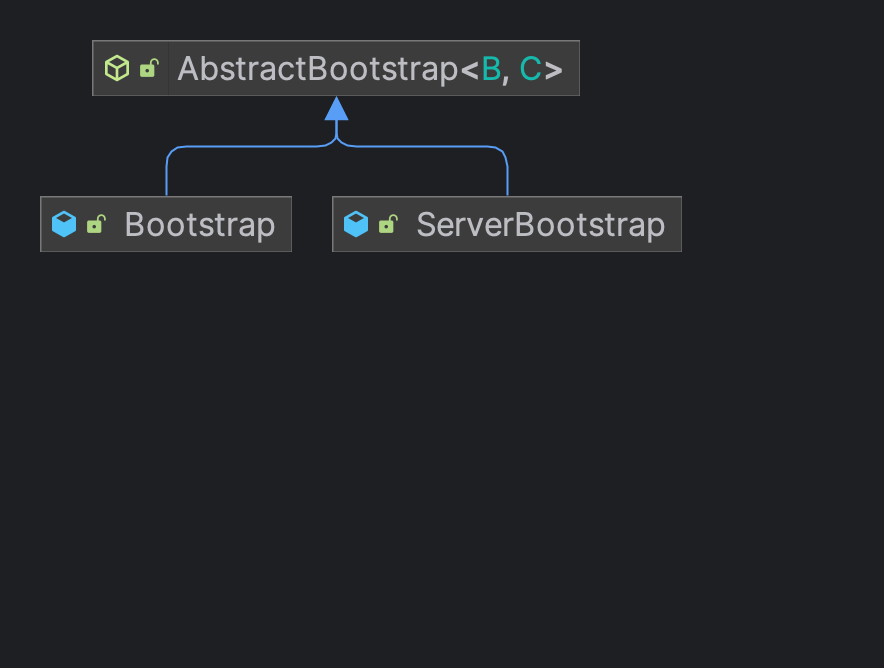
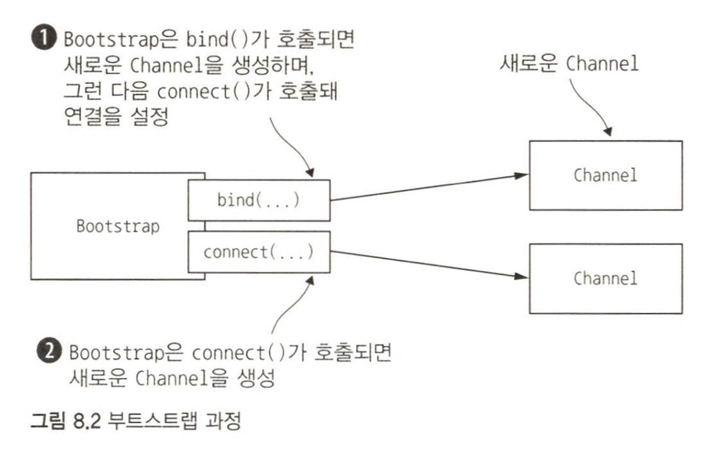
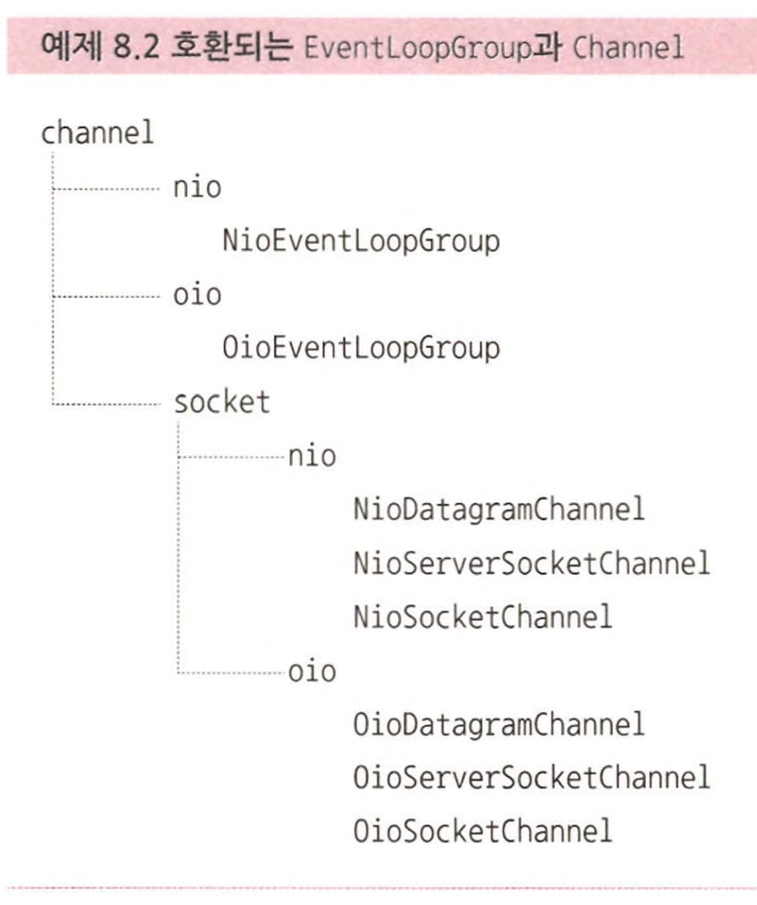
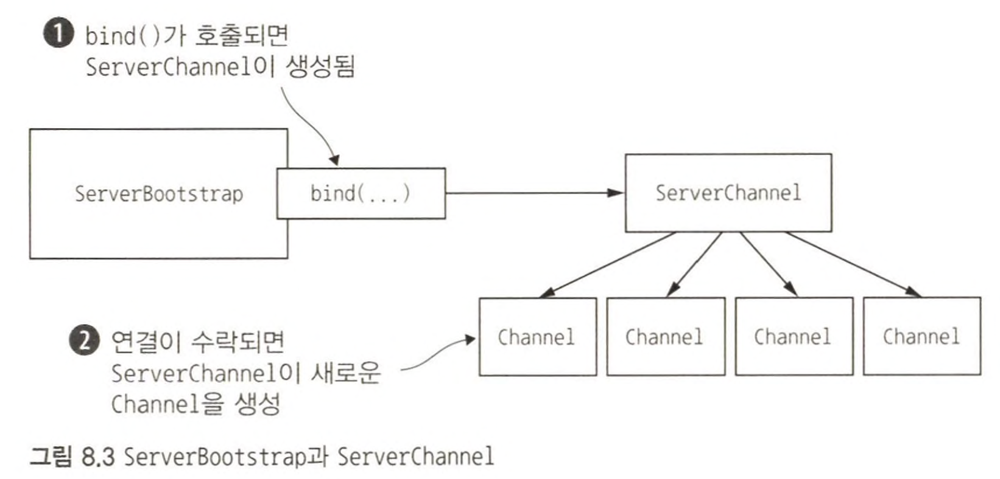
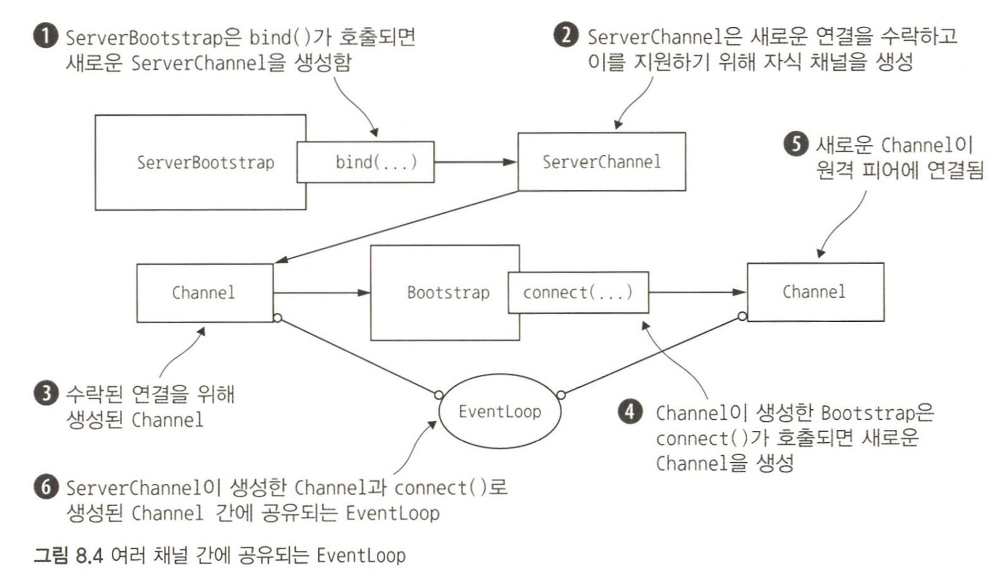

부트스트랩이란 **애플리케이션을 실행하도록 구성하는 과정으로서, 특히 네트워크 애플리케이션의 경우 이 정의처럼 단순하지 않은 단계를 거칠 수 있다.**  
모든 프레임워크 컴포넌트는 백그라운드에서 연결되고 활성화된다.  



# 부트스트랩 클래스

추상 부모 클래스 하나와 구상 부트스트랩 하위 클래스 두 개로 구성된다.  
이 두 구현 클래스를 각각 서버와 클라이언트 부트스트랩으로 생각하기보다는 이러한 클래스가 지원하려는 고유한 애플리케이션의 기능을 이해하는 것이 좋다.  
  
- 서버는 **부모 채널을 위해 클라이언트로 연결을 수락하고 통신하기 위해 채널을 생성한다.**
- 클라이언트는 **모든 네트워크 상호작용을 위해 부모가 아닌 단일 채널을 필요로 하는 경우가 많다.** (UDP는 채널을 필요로 하지 않는 비연결 전송이다.)
- 두 애플리케이션 유형의 공통된 부트스트랩 단계는 부모 추상 클래스인 AbstractBootstrap에 의해 처리된다.

> **부트스트랩 클래스가 Cloneable인 이유**  
> 여러 채널을 비슷하거나 동일한 설정으로 생성해야 하는 경우가 있다.  
> 채널별로 부트스트랩 인스턴스를 새로 만들지 않고도 이러한 패턴을 지원하기 위해 AbstractBootstrap은 Cloneable 인터페이스를 구현한다.  
> 이미 구성된 부트스트랩의 Cloneable을 호출하면 즉시 이용 가능한 다른 부트스트랩 인스턴스가 반환된다.  
> 이 방법을 이용하면 부트스트랩 EventLoopGroup의 간소한 복사본이 생성되며 나머지 부분은 복제된 모든 채널에서 공유된다.  

```java
public abstract class AbstractBootstrap<B extends AbstractBootstrap<B, C>, C extends Channel> implements Cloneable {
    ...
}

public class ServerBootstrap extends AbstractBootstrap<ServerBootstrap, ServerChannel> {
    ...
}
```

위의 시그니처에서 **하위 클래스 B는 상위 클래스에 대한 형식 매개변수이며, 런타임 인스턴스의 참조를 반환해(유창한 구문이라고도 하는) 메서드 체인을 지원하기 위한 것이다.**  

# 비연결 프로토콜과 클라이언트 부트스트랩

[Bootstrap](https://netty.io/4.0/api/io/netty/bootstrap/Bootstrap.html)은 비연결 프로토콜을 이용하는 애플리케이션이나 클라이언트에서 이용된다.  

## 클라이언트 부트스트랩



```java
public class BootstrapClient {
    public static void main(String args[]) {
        BootstrapClient client = new BootstrapClient();
        client.bootstrap();
    }

    public void bootstrap() {
        EventLoopGroup group = new NioEventLoopGroup();
        Bootstrap bootstrap = new Bootstrap();
        bootstrap.group(group)      // EventLoopGroup 설정
                .channel(NioSocketChannel.class)    // 이용할 Channel 구현 지정
                .handler(
                    new SimpleChannelInboundHandler<ByteBuf>() {
                        @Override
                        protected void channelRead0(ChannelHandlerContext channelHandlerContext, ByteBuf byteBuf) {
                            System.out.println("Received data");
                            byteBuf.clear();
                        }
                    }
                );

        // 원격 호스트에 연결
        ChannelFuture future = bootstrap.connect(new InetSocketAddress("www.manning.com", 80));
        future.addListener((ChannelFutureListener) channelFuture -> {
            if (channelFuture.isSuccess()) {
                System.out.println("Connection established");
            } else {
                System.err.println("Connection attempt failed");
                channelFuture.cause().printStackTrace();
            }
        });
    }
}
```

Bootstrap을 구성하는 `group()`, `channel()`, `handler()` 처럼 각 메서드가 반환하는 Bootstrap의 인스턴스 참조를 통해 체인으로 연결되는 것이 유창한 구문을 이용한 것이다.  

## Channel과 EventLoopGroup 호환성



Nio와 Oio가 서로 다른 접두사를 가진 컴포넌트를 혼합할 수 없다.  

```java
public class InvalidBootstrapClient {

    public static void main(String args[]) {
        InvalidBootstrapClient client = new InvalidBootstrapClient();
        client.bootstrap();
    }

    public void bootstrap() {
        EventLoopGroup group = new NioEventLoopGroup();
        Bootstrap bootstrap = new Bootstrap();
        bootstrap.group(group).channel(OioSocketChannel.class)
                .handler(new SimpleChannelInboundHandler<ByteBuf>() {
                         @Override
                         protected void channelRead0(ChannelHandlerContext channelHandlerContext, ByteBuf byteBuf) {
                             System.out.println("Received data");
                             byteBuf.clear();
                         }
                     }
                );
        ChannelFuture future = bootstrap.connect(new InetSocketAddress("www.manning.com", 80));
        future.syncUninterruptibly();
    }
}
```

위의 코드를 실행하면 아래와 같은 예외가 발생한다.  

```
Exception in thread "main" java.lang.IllegalStateException: incompatible event loop type: io.netty.channel.nio.NioEventLoop
	at io.netty.channel.AbstractChannel$AbstractUnsafe.register(AbstractChannel.java:469)
	at io.netty.channel.SingleThreadEventLoop.register(SingleThreadEventLoop.java:80)
	at io.netty.channel.SingleThreadEventLoop.register(SingleThreadEventLoop.java:74)
	at io.netty.channel.MultithreadEventLoopGroup.register(MultithreadEventLoopGroup.java:86)
	at io.netty.bootstrap.AbstractBootstrap.initAndRegister(AbstractBootstrap.java:333)
	at io.netty.bootstrap.Bootstrap.doResolveAndConnect(Bootstrap.java:163)
	at io.netty.bootstrap.Bootstrap.connect(Bootstrap.java:145)
	at chapter08.InvalidBootstrapClient.bootstrap(InvalidBootstrapClient.java:33)
```

# 서버 부트스트랩



ServerChannel 구현은 수락된 연결을 나타내는 **자식 Channel을 생성하는 역할을 한다.**  
즉, ServerChannel을 부트스트랩하는 ServerBootstrap은 수락된 Channel의 ChannelConfig 멤버에 설정을 적용하는 과정을 간소화하는 `bind()` 메서드를 제공한다.  

```java
public class BootstrapServer {
    public void bootstrap() {
        NioEventLoopGroup group = new NioEventLoopGroup();
        ServerBootstrap bootstrap = new ServerBootstrap();
        bootstrap.group(group)
                .channel(NioServerSocketChannel.class)
                .childHandler(new SimpleChannelInboundHandler<ByteBuf>() {
                    @Override
                    protected void channelRead0(ChannelHandlerContext channelHandlerContext, ByteBuf byteBuf) {
                        System.out.println("Received data");
                        byteBuf.clear();
                    }
                });
        // 구성된 부트스트랩을 이용해 채널을 바인딩
        ChannelFuture future = bootstrap.bind(new InetSocketAddress(8080));
        future.addListener((ChannelFutureListener) channelFuture -> {
            if (channelFuture.isSuccess()) {
                System.out.println("Server bound");
            } else {
                System.err.println("Bind attempt failed");
                channelFuture.cause().printStackTrace();
            }
        });
    }
}
```

# 채널에서 클라이언트 부트스트랩

서버가 추가되는 클라이언트 요청을 처리해야 할때는 ServerChannel에서 클라이언트 Channel을 부트스트랩해야 한다.  
새로운 Bootstrap을 만드는 방법도 있지만, 이 경우 새로운 클라이언트 Channel에 대한 EventLoop를 정의해야 하므로 그리 호율적인 방법은 아니다.  
즉, **추가 스레드가 생성되며, 수락된 Channel과 클라이언트 Channel 간에 데이터를 교환할 때 컨텍스트 전환이 필요하다.**  
  
이보다는 수락된 Channel의 EventLoop를 Boostrap의 `group()` 메서드로 전달해 이를 공유하는 것이 나은 방법이다.  
하나의 EventLoop에 할당된 모든 Channel은 동일한 스레드를 이용하므로 추가 스레드 생성과 앞서 언급한 컨텍스트 전환을 방지할 수 있다.  



```java
public class BootstrapSharingEventLoopGroup {

    public void bootstrap() {
        ServerBootstrap bootstrap = new ServerBootstrap();
        bootstrap.group(new NioEventLoopGroup(), new NioEventLoopGroup())
                .channel(NioServerSocketChannel.class)
                .childHandler(
                        new SimpleChannelInboundHandler<ByteBuf>() {
                            ChannelFuture connectFuture;

                            @Override
                            public void channelActive(ChannelHandlerContext ctx) {
                                // 원격 호스트에 연결할 Bootstrap 생성
                                Bootstrap bootstrap = new Bootstrap();
                                // Channel 구현 지정
                                bootstrap.channel(NioSocketChannel.class).handler(
                                    new SimpleChannelInboundHandler<ByteBuf>() {
                                        @Override
                                        protected void channelRead0(ChannelHandlerContext ctx, ByteBuf in) {
                                            System.out.println("Received data");
                                        }
                                    }
                                );
                                // 수락된 채널에 할당된 것과 동일한 EventLoop를 이용
                                bootstrap.group(ctx.channel().eventLoop());
                                connectFuture = bootstrap.connect(new InetSocketAddress("www.manning.com", 80));
                            }

                            @Override
                            protected void channelRead0(ChannelHandlerContext channelHandlerContext, ByteBuf byteBuf) {
                                if (connectFuture.isDone()) {
                                    // do something with the data
                                }
                            }
                        });

        // 구성된 Bootstrap을 통해 채널을 바인딩
        ChannelFuture future = bootstrap.bind(new InetSocketAddress(8080));
        future.addListener((ChannelFutureListener) channelFuture -> {
            if (channelFuture.isSuccess()) {
                System.out.println("Server bound");
            } else {
                System.err.println("Bind attempt failed");
                channelFuture.cause().printStackTrace();
            }
        });

    }
}
```

EventLoop를 최대한 재사용하여 스레드 생성 비용을 줄이는 네티 애플리케이션 코딩의 일반 가이드라인을 적용한 것이다.  

# 부트스트랩 중 여러 ChannelHandler 추가

부트스트랩 과정에서 여러 ChannelHandler를 추가하기 위해 ChannelInitializer가 제공된다.  
자신의 ChannelInitializer를 부트스트랩에 제공하면 Channel을 EventLoop에 등록할 때 자신의 `initChannel()`이 호출된다.  
그리고 메서드가 반환되면 ChannelInitializer 인스턴스가 ChannelPipeline에서 자신을 제거한다.  
  
```java
public class BootstrapWithInitializer {

    public void bootstrap() {
        ServerBootstrap bootstrap = new ServerBootstrap();
        bootstrap.group(new NioEventLoopGroup(), new NioEventLoopGroup())
                .channel(NioServerSocketChannel.class)
                .childHandler(new ChannelInitializerImpl());

        ChannelFuture future = bootstrap.bind(new InetSocketAddress(8080));
        future.addListener((ChannelFutureListener) channelFuture -> {
            if (channelFuture.isSuccess()) {
                System.out.println("Server bound");
            } else {
                System.err.println("Bind attempt failed");
                channelFuture.cause().printStackTrace();
            }
        });
    }

    public final class ChannelInitializerImpl extends ChannelInitializer<Channel> {
        @Override
        protected void initChannel(Channel ch) {
            ChannelPipeline pipeline = ch.pipeline();
            pipeline.addLast(new HttpClientCodec());
            pipeline.addLast(new HttpObjectAggregator(Integer.MAX_VALUE));
        }
    }
}
```

# 네티 ChannelOption과 특성 이용

채널을 생성할 때마다 수동으로 구성하는 과정보다는 `option()`을 이용해 ChannelOption을 부트스트랩에 적용하는 방법이 있다.  
이용할 수 있는 ChannelOption에는 `keep-alive` 또는 시간 만료 속성과 버퍼 설정 등과 같은 저수준 연결 세부 사항이 포함된다.  
  
일반적인 속성과 데이터 중 일부를 이용할 수 없는 경우를 위해 부트스트랩 클래스의 지원을 받는 컬렉션인 `AttributeMap` 추상화, 그리고 특성 값을 삽입하고 가져오기 위한 제네릭 클래스인 `AttributeKey<T>`를 제공한다.  

```java
public class BootstrapClientWithOptionsAndAttrs {

    public static void main(String[] args) {
        new BootstrapClientWithOptionsAndAttrs().bootstrap();
    }

    public void bootstrap() {
        final AttributeKey<Integer> id = AttributeKey.valueOf("ID");
        Bootstrap bootstrap = new Bootstrap();
        bootstrap.group(new NioEventLoopGroup())
                .channel(NioSocketChannel.class)
                .handler(
                    new SimpleChannelInboundHandler<ByteBuf>() {
                        @Override
                        public void channelRegistered(ChannelHandlerContext ctx) {
                            Integer idValue = ctx.channel().attr(id).get();
                            System.out.println("channelRegistered : " + idValue);
                            // do something with the idValue
                        }

                        @Override
                        protected void channelRead0(ChannelHandlerContext channelHandlerContext, ByteBuf byteBuf) {
                            System.out.println("Received data");
                        }
                    }
                );

        bootstrap.option(ChannelOption.SO_KEEPALIVE, true)
                .option(ChannelOption.CONNECT_TIMEOUT_MILLIS, 5000);
        bootstrap.attr(id, 10);
        bootstrap.attr(id, 20);

        ChannelFuture future = bootstrap.connect(new InetSocketAddress("www.manning.com", 80));
        future.syncUninterruptibly();
    }
}
```

# 종료

EventLoopGroup을 종료해 대기 중인 이벤트와 작업을 모두 처리한 다음 모든 활성 스레드를 해제해야 한다.  
이를 위해서는 `EventLoopGroup.shutdownGracefully()`를 호출해야 하며, 이 메서드는 종료가 완료되면 알림을 받을 Future를 반환한다.  
shutdownGracefully()는 비동기식으로 작업하므로 완료될 때까지 진행을 블로킹하거나 반환된 Future로 완료 알림을 받을 리스너를 등록해야 한다.  
  
