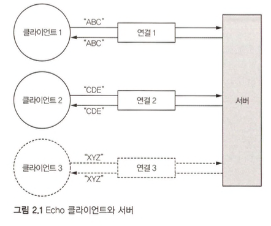

다수의 클라이언트가 동시에 서버로 연결되는 간단한 Echo 클라이언트/서버를 만들것이다.  

1. **하나 이상의 ChannelHandler** : 이 컴포넌트는 클라이언트로부터 받은 데이터를 서버 측에서 처리하는 비즈니스 논리를 구현한다.
2. **부트스트랩** : 서버를 구성하는 시동 코드를 의미하며, 최소한 서버가 연결 요청을 수신하는 포트를 서버와 바인딩하는 코드가 있어야 한다.

# ChannelHandler와 비즈니스 논리

Echo 서버는 들어오는 메시지에 반응하기 위해 인바운드 이벤트에 반응하는 메서드가 정의된 ChannelInboundHandler를 구현해야 한다.  
ChannelInboundHandler의 기본 구현을 제공하는 ChannelInboundHandlerAdapter의 하위 클래스를 만드는 것으로 충분하다.  

```java
@Sharable
public class EchoServerHandler extends ChannelInboundHandlerAdapter {

    /**
     * 메시지가 들어올 때마다 호출된다.
     * @param ctx
     * @param msg
     */
    @Override
    public void channelRead(ChannelHandlerContext ctx, Object msg) {
        ByteBuf in = (ByteBuf) msg;
        byte[] b = new byte[in.readableBytes()];
        in.getBytes(0, b, 0, in.readableBytes());
        String s = new String(b);

        //System.out.println("Server received: " + ByteBufUtil.hexDump(in));
        System.out.println("Server received: " + s);
        ctx.write(in); // 아웃바운드 메시지를 플러시하지 않은 채로 받은 메시지를 발신자로 출력함
    }

    /**
     * channelRead의 마지막 호출에서 현재 일괄 처리의 마지막 메시지를 처리했음을 핸들러에 통보한다.
     * @param ctx
     * @throws Exception
     */
    @Override
    public void channelReadComplete(ChannelHandlerContext ctx) throws Exception {
        // 대기 중인 메시지를 원격 피어로 플러시하고 채널을 닫음
        ctx.writeAndFlush(Unpooled.EMPTY_BUFFER)
                .addListener(ChannelFutureListener.CLOSE);
    }

    /**
     * 읽기 작업 중 예외가 발생하면 호출된다.
     * 이 메서드를 재정의하면 모든 Throwable 하위 형식에 반응할 수 있다.
     * @param ctx
     * @param cause
     */
    @Override
    public void exceptionCaught(ChannelHandlerContext ctx, Throwable cause) {
        cause.printStackTrace();
        ctx.close();
    }
}
```

> **예외를 포착하지 않으면 어떻게 될까?**  
> 모든 Channel에는 ChannelHandler 인스턴스의 체인을 포함하는 ChannelPipeline이 연결돼 있다.  
> 기본적으로 핸들러는 체인 상의 다음 항목으로 핸들러 메서드의 호출을 전달한다.  
> 즉, 체인의 어디서도 `exceptionCaught()`이 구현되지 않은 경우 수신된 예외가 ChannelPipeline의 끝까지 이동한 후 로깅된다.  

1. ChannelHandler는 네 가지 이벤트 유형에 의해 호출된다.
2. 애플리케이션은 ChannelHandler를 구현하거나 확장해 이벤트 수명주기를 후크하고 커스텀 애플리케이션 논리를 제공한다.
3. 아키텍처 관점에서 ChannelHandler는 비즈니스 논리를 네트워킹 코드로부터 분리하도록 도와준다.

# 서버 부트스트랩

아래의 과정을 포함하는 서버의 부트스트랩을 작성해보자.

1. 서버가 수신할 포트를 바인딩하고 들어오는 연결 요청을 수락한다.
2. EchoServerHandler 인스턴스에 인바운드 메시지에 대해 알리도록 Channel을 구성한다.

```java
public class EchoServer {
    private final int port;

    public EchoServer(int port) {
        this.port = port;
    }

    public static void main(String[] args) throws Exception {
        if (args.length != 1) {
            System.err.println("Usage: " + EchoServer.class.getSimpleName() +
                " <port>"
            );
            return;
        }
        int port = Integer.parseInt(args[0]);
        new EchoServer(port).start();
    }

    public void start() throws Exception {
        final EchoServerHandler serverHandler = new EchoServerHandler();
        // 1. EventLoopGroup을 생성
        EventLoopGroup group = new NioEventLoopGroup();
        try {
            // 2. ServerBootStrap을 생성
            ServerBootstrap serverBootstrap = new ServerBootstrap();
            serverBootstrap.group(group)
                // 3. Nio 전송 채널을 사용하도록 지정
                .channel(NioServerSocketChannel.class)
                // 4. 지정된 포트를 이용해 소켓 주소를 설정
                .localAddress(new InetSocketAddress(port))
                // 5. EchoServerHandler 하나를 채널의 ChannelPipeline으로 추가
                // 새로운 연결을 수락한 후, 새로운 자식 Channel을 생성하며, ChannelInitializer가 EchoServerHandler의 인스턴스 하나를 Channel의 ChannelPipeline으로 추가한다.
                .childHandler(new ChannelInitializer<SocketChannel>() {
                    @Override
                    public void initChannel(SocketChannel ch) {
                        // serverHandler는 @Shared 이기 때문에 재사용 가능하다.
                        ch.pipeline().addLast(serverHandler);
                    }
                });

            // 6. 서버를 비동기식으로 바인딩, sync()는 바인딩이 완료되기를 대기한다.
            ChannelFuture channelFuture = serverBootstrap.bind().sync();
            System.out.println(EchoServer.class.getName() +
                " started and listening for connections on " + channelFuture.channel().localAddress());

            // 7. 채널의 CloseFuture를 얻고 완료될 때까지 현재 스레드를 블로킹
            channelFuture.channel().closeFuture().sync();
        } finally {
            // 8. EventLoopGroup을 종료하고 모든 리소스를 해제
            group.shutdownGracefully().sync();
        }
    }
}
```

부트스트랩에는 아래와 같은 단계가 필요하다.
1. 서버를 부트스트랩하고 바인딩하는데 이용한 ServerBootstrap 인스턴스를 생성한다.
2. 새로운 연결 수락 및 데이터 읽기/쓰기와 같은 이벤트 처리를 수행할 NioEventLoopGroup 인스턴스를 생성하고 할당한다.
3. 서버가 바인딩하는 로컬 InetSocketAddress를 지정한다.
4. EchoServerHandler 인스턴스를 이용해 새로운 각 Channel을 초기화한다.
5. ServerBootstrap.bind()를 호출해 서버를 바인딩한다.

# ChannelrHandler를 이용한 클라이언트 논리 구현

1. 서버로 연결한다.
2. 메시지를 하나 이상 전송한다.
3. 메시지마다 대기하고 서버로부터 동일한 메시지를 수신한다.
4. 연결을 닫는다.

```java
@Sharable
public class EchoClientHandler extends SimpleChannelInboundHandler<ByteBuf> {

    /**
     * 채널 활성화 알림을 받으면 메시지를 전송
     */
    @Override
    public void channelActive(ChannelHandlerContext ctx) {
        ctx.writeAndFlush(Unpooled.copiedBuffer("Netty rocks!", CharsetUtil.UTF_8));
    }

    /**
     * 수신한 메시지의 덤프를 로깅
     */
    @Override
    public void channelRead0(ChannelHandlerContext ctx, ByteBuf in) {
        byte[] b = new byte[in.readableBytes()];
        in.getBytes(0, b, 0, in.readableBytes());
        String s = new String(b);
        //System.out.println("Client received: " + ByteBufUtil.hexDump(in) + ":" + s);
        System.out.println("Client received: " + s);
    }

    @Override
    public void exceptionCaught(ChannelHandlerContext ctx, Throwable cause) {
        cause.printStackTrace();
        ctx.close();
    }
}
```

연결이 만들어지면 호출되는 `channelActive`를 재정의하여 서버로 최대한 빨리 무언가를 전송하기 위해 문자열을 인코딩한 바이트 버퍼를 전송한다.  
그런 다음 데이터를 수신할 때 마다 호출된 `channelRead0`을 재정의하여 로깅한다.  
이때 데이터가 청킹되어 여러 번 전송될 수 있지만 TCP는 스트림 기반 프로토콜이므로 서버가 보낸 순서대로 바이트를 수신할 수 있게 보장된다.  

> **SimpleChannelInboundHandler와 ChannelInboundHandler 비교**  
> 비즈니스 논리가 메시지를 처리하는 방법, 그리고 네티가 리소스를 관리하는 방법의 두 요소 간 상호작용과 관계가 있다.  
> 클라이언트에서 `channelRead0`이 완료되는 시점에는 들어오는 메시지가 이미 확보됐고 이용도 끝난 상태다.  
> 따라서 메서드가 반환될 때 SimpleChannelInboundHandler는 메시지가 들어있는 ByteBuf에 대한 메모리 참조를 해제한다.  
> 반면 EchoServerHandler에서는 아직 들어오는 메시지를 발신자에게 반향 출력해야 하며, `channelRead`가 반환될 때까지 비동기식인 `write` 작업이 완료되지 않았을 수 있다.  
> 따라서 EchoServerHandler는 이 시점까지 메시지를 해제하지 않는 ChannelInboundHandlerAdapter를 확장한다.  
> 메시지는 EchoServerHandler의 `channelReadComplete`에서 `writeAndFlush`가 호출될 때 해제된다.

# 클라이언트 부트스트랩

```java
public class EchoClient {
    private final String host;

    private final int port;

    public EchoClient(String host, int port) {
        this.host = host;
        this.port = port;
    }

    public static void main(String[] args) throws Exception {
        if (args.length != 2) {
            System.err.println("Usage: " + EchoClient.class.getSimpleName() +
                " <host> <port>"
            );
            return;
        }

        final String host = args[0];
        final int port = Integer.parseInt(args[1]);
        new EchoClient(host, port).start();
    }

    public void start()
        throws Exception {
        EventLoopGroup group = new NioEventLoopGroup();
        try {
            Bootstrap bootstrap = new Bootstrap();
            bootstrap.group(group)
                .channel(NioSocketChannel.class)
                .remoteAddress(new InetSocketAddress(host, port))
                .handler(new ChannelInitializer<SocketChannel>() {
                    @Override
                    public void initChannel(SocketChannel ch)
                        throws Exception {
                        ch.pipeline().addLast(new EchoClientHandler());
                    }
                });

            ChannelFuture channelFuture = bootstrap.connect().sync();
            // 채널이 닫힐 때 까지 블로킹한다.
            channelFuture.channel().closeFuture().sync();
        } finally {
            group.shutdownGracefully().sync();
        }
    }
}
```