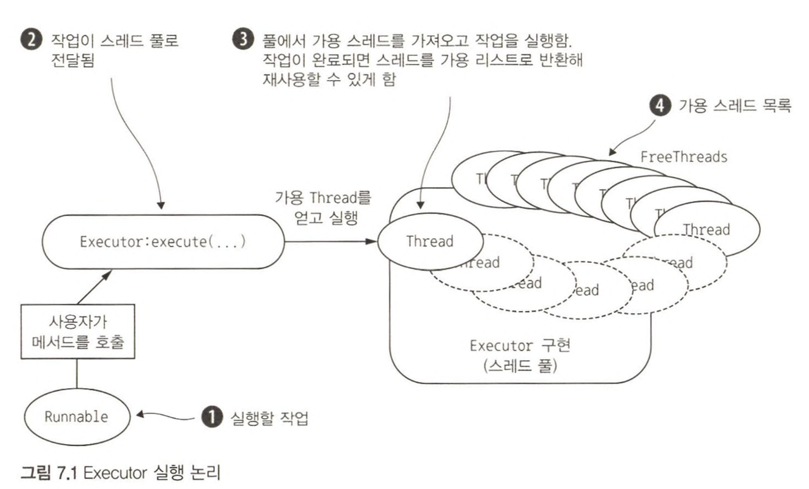
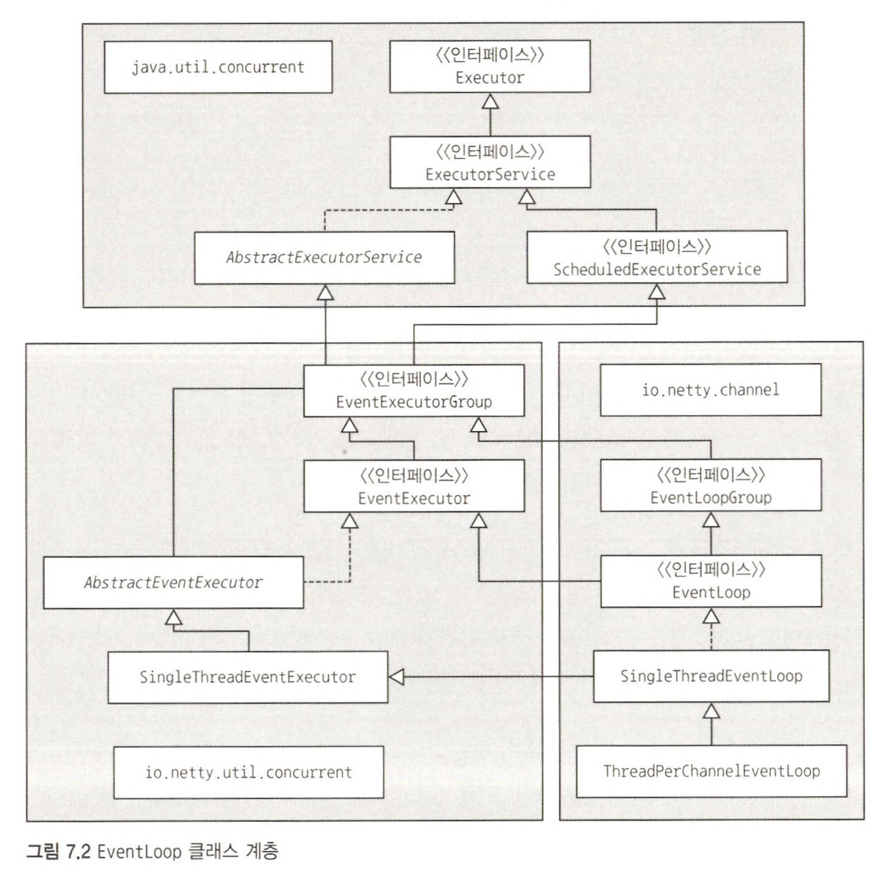
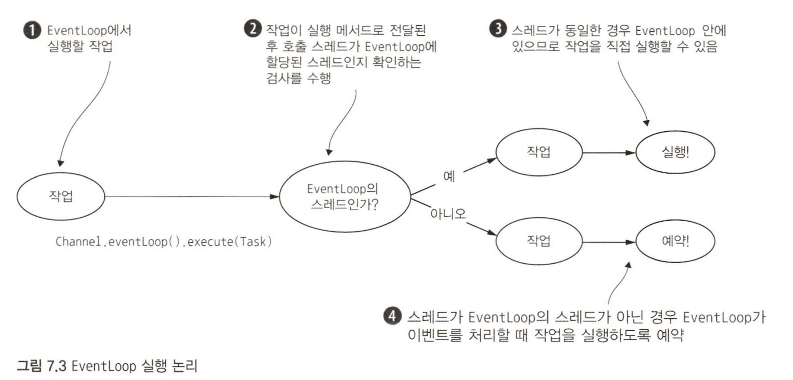
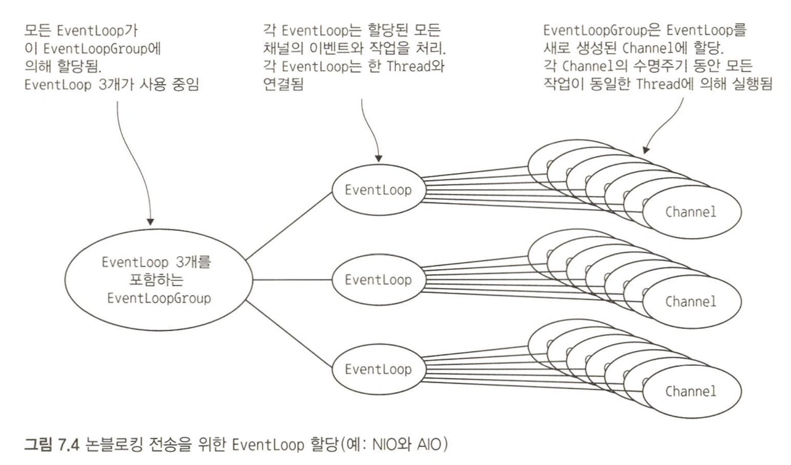

# 네티의 스레딩 모델

스레딩 모델은 **코드가 실행되는 방법을 지정하는 것이다.**  
동시 실행의 부작용에 대해 항상 주의해야 하므로 적용되는 모델의 영향을 이해하는 것이 중요하다.  
  
자바 5에 Thread 캐싱과 재사용을 통해 성능을 크게 개선한 스레드 풀을 지원하는 Executor API가 도입되었다.  
기본 스레드 풀링 패턴은 아래와 같다.

1. **요청된 작업(Runnable의 구현)을 실행하기 위해 풀의 가용 리스트에서 Thread 하나를 선택해 할당한다.**
2. **작업이 완료되면 Thread가 리스트로 반환되고 재사용할 수 있게 된다.**



스레드를 풀링하고 재사용하는 방식은 필요할 때마다 새로 생성하는 방법에 비해 분명히 개선된것은 맞지만 컨텍스트 전환 비용이 아예 사라진 것은 아니기 때문에, **스레드의 수가 증가하면 비용은 명백하게 증가한다.**  

# EventLoop 인터페이스

네티의 EventLoop는 **동시성과 네트워킹의 두 가지 기본 API를 공동으로 활용해 설계됐다.**  

1. `io.netty.util.concurrent` 패키지는 JDK 패키지인 `java.util.concurrent`에 기반을 두는 **스레드 실행자**를 제공한다.
2. `io.netty.channel` 패키지의 클래스는 Channel 이벤트와 인터페이스를 수행하기 위해 이러한 API를 확장한다.  

이 모델에서 EventLoop는 **변경되지 않는 Thread 하나로 움직이며, 작업(Runnable 또는 Callable)을 EventLoop 구현으로 직접 제출해 즉시 또는 예약 실행할 수 있다.**  
구성과 사용 가능한 코어에 따라서는 리소스 활용을 최적화하기 위해 여러 EventLoop가 생성되고, 여러 Channel에 서비스를 제공하기 위해 단일 EventLoop가 할당되는 경우도 있다.  
  
네티의 EventLoop는 `ScheduledExecutorService`를 확장하며, `parent()`라는 메서드 하나만 정의한다.  
이 메서드는 현재 EventLoop 구현 인스턴스가 속한 EventLoopGroup의 참조를 반환한다.  

```java
/**
 * 일단 등록되면 Channel 에 대한 모든 I/O 작업을 처리합니다. 
 * 하나의 EventLoop 인스턴스는 일반적으로 둘 이상의 Channel 처리하지만 구현 세부 사항 및 내부에 따라 달라질 수 있습니다.
 */
public interface EventLoop extends OrderedEventExecutor, EventLoopGroup {
    @Override
    EventLoopGroup parent();
}
```



입출력 작업에 의해 발생한 이벤트는 하나 이상의 ChannelHandler가 설치된 ChannelPipeline을 통과하며 FIFO순으로 처리된다.  
즉, **네티4 의 모든 입출력 작업과 이벤트는 EventLoop에 할당된 Thread에 의해 처리된다.**  
  
> **네티3의 입출력 작업**  
> 인바운드（이전에는 업스트림이라고 했음） 이벤트만 입출력 스레드 （네티4의 EventLoop에 해당）에서 실행됐고, 모든 아웃바운드（다운스트림）이벤트는 입출력 스레드이거나 다른 스레드일 수 있는 호출 스레드에 의해 처리됐다.  
> 하지만 **ChannelHandler에서 아웃바운드 이벤트를 세심하게 동기화해야 하는 문제가 드러났다.**  
> 여러 다른 스레드에서 `Channel.write()`를 호출해 동일한 Channel에 대한 다운스트림 이벤트를 동시에 생성하면 여러 스레드가 동시에 이벤트에 접근하려는 상황이 발생할 수 있다  
> 아웃바운드 이벤트의 결과로 인바운드 이벤트가 생성되는 경우에도 부작용이 있었다. `Channel.write()`에서 예외가 발생하면 `exceptionCaught` 이벤트를 생성하고 실행해야 한다.  
> 그런데 이 이벤트는 네티3 모델에서 인바운드 이벤트이므로 호출 스레드에서 코드가 실행되며, 이벤트를 실행하기 위해 입출력 스레드로 전달해야 하므로 추가 컨텍스트 전환이 필요하다.

# EventLoop를 이용한 작업 스케줄링

`ScheduledExecutorService` 구현은 풀 관리 작업의 일부로 스레드가 추가로 생성되는 등의 한계점을 가지고 있으며, 많은 작업을 예약할 경우 병목 현상이 발생할 수 있다.  
네티는 채널의 EventLoop를 이용하는 방법으로 이 문제를 해결한다.  
  
```java
channel.eventLoop().schedule(
    (Runnable) () -> System.out.println("60 seconds later"),
    60,
    TimeUnit.SECONDS
);

channel.eventLoop().scheduleAtFixedRate(
    (Runnable) () -> System.out.println("Run every 60 seconds"),
    60,
    60,
    TimeUnit.SECONDS
);
```

# 스레드 관리

네티 스레딩 모델이 탁월한 성능을 내는 데는 현재 실행 중인 Thread의 ID를 확인하는 기능, 즉 Thread가 현재 Channel과 해당 EventLoop에 할당된 것인지 확인하는 기능이 중요한 역할을 한다.  
(**EventLoop는 수명 주기 동안 Channel 하나의 모든 이벤트를 처리한다.**)  
  


호출 Thread가 EventLoop에 속하는 경우 해당 코드 블록이 실행되며, 그렇지 않으면 나중에 실행하기 위해 작업을 예약하고 내부 큐에 넣는다.  
EventLoop는 해당 다음 이벤트를 처리할 때 큐에 있는 항목을 실행한다.  
Thread가 ChannelHandler를 동기화하지 않고도 Channel과 직접 상호작용할 수 있는 것은 이런 작동 방식 덕분이다.  
  
**각 EventLoop에는 다른 EventLoop로부터 분리된 자체 작업 큐가 들어있다.**  
(위의 이미지가 네티 스레딩 모델의 가장 핵심적인 부분이다.)  
  
즉, **장기 실행 작업은 실행 큐에 넣지 않아야 하며, 그렇지 않으면 동일한 스레드에서 다른 작업을 실행할 수 없게 된다.**  
블로킹 호출을 해야 하거나 장기 실행 작업을 실행해야 하는 경우 전용 EventExecutor를 이용하는 것이 좋다.  
  
# EventLoop와 스레드 할당

Channel에 이벤트와 입출력을 지원하는 EventLoop는 EventLoopGroup에 포함되며, EventLoop가 생성 및 할당되는 방법은 전송의 구현에 따라 다르다.  
  
<h3>비동기 전송</h3>

**비동기 구현은 적은 수의 EventLoop(및 이와 연결된 Thread)를 이용하며, 현재 모델에서는 이를 여러 Channel에서 공유할 수 있다.**  
덕분에 Channel마다 Thread를 할당하지 않고 최소한의 Thread로 다수의 Channel을 지원할 수 있다.  
  


EventLoop(및 해당 Thread)는 필요할 때 이용할 수 있도록 EventLoopGroup이 생성될 때 직접 할당된다.  
EventLoopGroup은 새로 생성된 각 Channel에 EventLoop를 할당하며, 균형된 배포를 위해 라운드 로빈 방식을 이용하며 동일한 EventLoop가 여러 Channel에 할당될 수 있다.  
  
Channel은 EventLoop가 할당되면 할당된 EventLoop(및 연결된 Thread)를 수명주기 동안 이용한다.  
덕분에 ChannelHandler 구현에서 동기화와 스레드 안정성에 대해 걱정할 필요가 없다.  
  
또한 **ThreadLocal 이용을 위한 EventLoop 할당의 영향도 알아둬야 한다.**  
일반적으로 EventLoop 하나가 둘 이상의 Channel에 이용되므로 ThreadLocal은 연결된 모든 Channel에서 동일하다.  
즉, **상태 추적과 같은 기능을 구현하는데는 적합하지 않지만 상태 비저장 환경에서는 여러 Channel에서 대규모 객체 또는 고비용 객체나 이벤트를 공유하는데 유용할 수 있다.**  

<h3>블로킹 전송</h3>


여기서는 각 Channel에 한 EventLoop(및 해당 Thread)가 할당됐다.  
비동기 전송과 마찬가지로, 각 Channel의 입출력 이벤트는 (Channel의 EventLoop를 지원하는) 한 Thread에 의해 처리된다.  