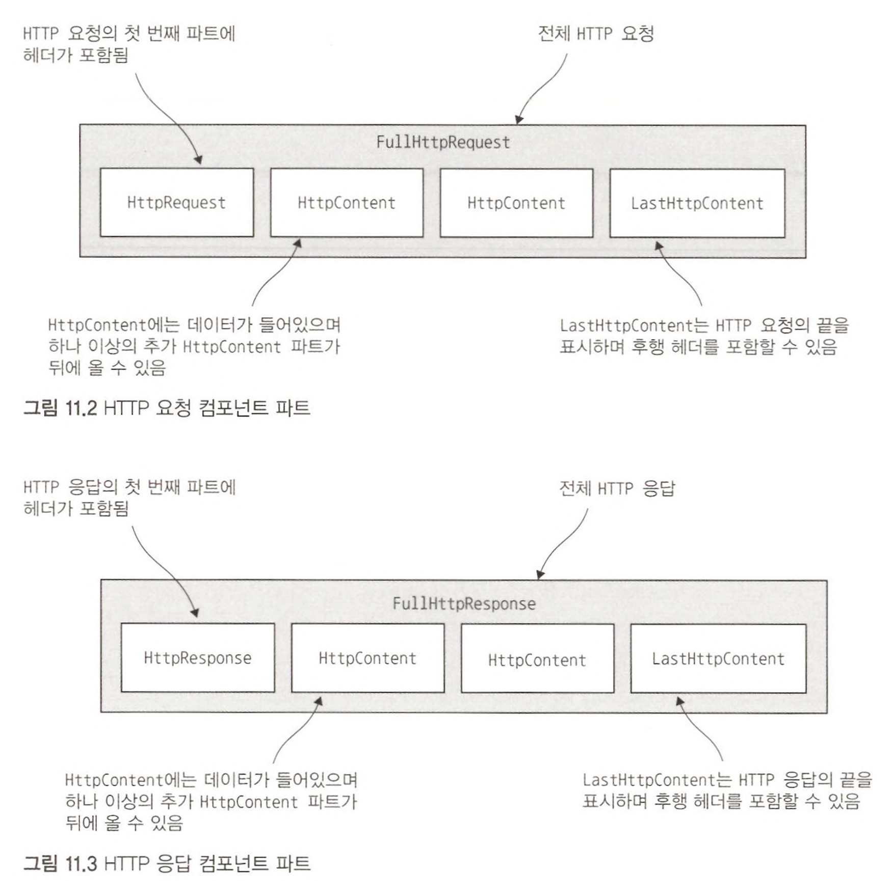
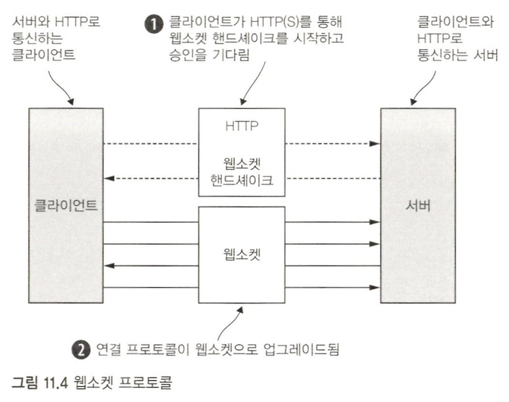

네티는 HTTP 프로토콜을 이용하는 작업을 간소화할 수 있는 다양한 인코더와 디코더를 제공한다.  

## HTTP 요청 또는 응답의 인코더와 디코더



HTTP 요청/응답은 둘 이상의 데이터 파트로 구성될 수 있으며, **항상 LastHttpContent 파트로 끝난다.**  
`FullHttpRequest`와 `FullHttpResponse` 메시지는 각각 완성된 요청과 응답을 나타내는 특수한 하위 형식이다.  
  
```java
public class HttpPipelineInitializer extends ChannelInitializer<Channel> {
    private final boolean client;

    public HttpPipelineInitializer(boolean client) {
        this.client = client;
    }

    @Override
    protected void initChannel(Channel ch) throws Exception {
        ChannelPipeline pipeline = ch.pipeline();
        // 클라이언트와 서버인 경우를 각각 구분해서 인코더와 디코더를 설정한다.
        if (client) {
            pipeline.addLast("decoder", new HttpResponseDecoder());
            pipeline.addLast("encoder", new HttpRequestEncoder());
        } else {
            pipeline.addLast("decoder", new HttpRequestDecoder());
            pipeline.addLast("encoder", new HttpResponseEncoder());
        }
    }
}
```

## 집계자

이니셜라이저를 설치한 후에는 ChannelPipeline의 핸들러가 여러 HttpObject 메시지를 대상으로 작업할 수 있다.  
HTTP 요청과 응답은 여러 파트로 구성될 수 있으므로 이런 파트를 연결해야 완성할 수 있는데 이런 반복적인 작업을 줄이기 위해 메시지 파트를 FullHttpRequest와 FullHttpResponse 메시지로 병합하는 **집계자 (aggregator)**를 제공한다.  
  
```java
public class HttpAggregatorInitializer extends ChannelInitializer<Channel> {

    private final boolean client;

    public HttpAggregatorInitializer(boolean client) {
        this.client = client;
    }

    @Override
    protected void initChannel(Channel ch) throws Exception {
        ChannelPipeline pipeline = ch.pipeline();
        if (client) {
            pipeline.addLast("codec", new HttpClientCodec());
        } else {
            pipeline.addLast("codec", new HttpServerCodec());
        }
        // 최대 메시지 크기를 512KB로 지정하고 HttpObjectAggregator를 파이프라인에 추가
        pipeline.addLast("aggegator", new HttpObjectAggregator(512 * 1024));
    }
}
```

## HTTP 압축

압축을 적용하면 CPU 사용률이 증가하는 단점이 있지만 일반적으로는 이익이며 특히 텍스트 데이터의 경우 효과가 크다.  
네티는 gzip과 deflate 인코딩을 지원하는 압축과 압축 해제를 위한 ChannelHandler 구현을 제공한다.  
  
```java
public class HttpCompressionInitializer extends ChannelInitializer<Channel> {
    private final boolean client;

    public HttpCompressionInitializer(boolean client) {
        this.client = client;
    }

    @Override
    protected void initChannel(Channel ch) throws Exception {
        ChannelPipeline pipeline = ch.pipeline();
        if (client) {
            pipeline.addLast("codec", new HttpClientCodec());
            pipeline.addLast("decompressor", new HttpContentDecompressor());
        } else {
            pipeline.addLast("codec", new HttpServerCodec());
            pipeline.addLast("compressor", new HttpContentCompressor());
        }
    }
}
```

## 웹소켓



## 대용량 파일 전송

파일의 내용을 파일 시스템에서 네트워크 스택으로 이동하는 복사 단계를 생략할 수 있는 **NIO의 제로 카피** 기능에 대해 알아봤다  
실제 작업은 네티의 코어에서 수행되므로 애플리케이션에서는 네티 API 설명서에 `"제로 카피 파일 전송을 지원하는 Channel을 통해 전송되는 파일의 영역"` 이라고 정의된 FileRegion 인터페이스의 구현을 이용하기만 하면 된다  
  
데이터를 파일 시스템에서 사용자 메모리로 복사해야 하는 경우 메모리 소비를 최소화하면서 대용량 데이터 스트림을 비동기식으로 기록하도록 지원하는 `ChunkedWriteHandler`를 이용할 수 있다  
  
`ChunkedInput<B>` 인터페이스는 대용량 파일 전송에 가장 중요한 역할을 하며, 여기서 매개변수 `B`는 `readChunk()` 메서드에서 반환하는 형식이다.  
  
```java
public class ChunkedWriteHandlerInitializer extends ChannelInitializer<Channel> {
    private final File file;

    public ChunkedWriteHandlerInitializer(File file) {
        this.file = file;
    }

    @Override
    protected void initChannel(Channel ch) throws Exception {
        ChannelPipeline pipeline = ch.pipeline();
        pipeline.addLast(new ChunkedWriteHandler());
        pipeline.addLast(new WriteStreamHandler());
    }

    public final class WriteStreamHandler extends ChannelInboundHandlerAdapter {

        @Override
        public void channelActive(ChannelHandlerContext ctx) throws Exception {
            super.channelActive(ctx);
            ctx.writeAndFlush(new ChunkedStream(new FileInputStream(file)));
        }
    }
}
```

## 프로토콜 버퍼를 통한 직렬화

프로토콜 버퍼는 구조화된 데이터를 작고 효율적으로 인코딩/디코딩하며, 여러 프로그래밍 언어를 위한 바인딩을 제공하므로 다중 언어 프로젝트에 적합하다.  

```java
public class ProtoBufInitializer extends ChannelInitializer<Channel> {
    private final MessageLite lite;

    public ProtoBufInitializer(MessageLite lite) {
        this.lite = lite;
    }

    @Override
    protected void initChannel(Channel ch)
            throws Exception {
        ChannelPipeline pipeline = ch.pipeline();

        // 프레임을 분할하기 위함
        pipeline.addLast(new ProtobufVarint32FrameDecoder());
        pipeline.addLast(new ProtobufEncoder());
        pipeline.addLast(new ProtobufDecoder(lite));
        pipeline.addLast(new ObjectHandler());
    }

    public static final class ObjectHandler extends SimpleChannelInboundHandler<Object> {
        @Override
        public void channelRead0(ChannelHandlerContext ctx, Object msg) throws Exception {
            // Do something with the object
        }
    }
}
```