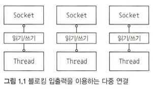
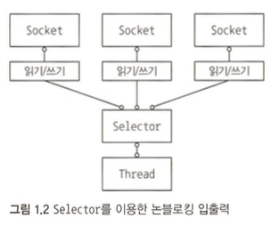

우리가 다뤄야 하는 기능 변경의 양과 속도가 날로 증가하면서 기존의 3계층 아키텍처로 감당할 수 없는 수준이 됨에 따라 이제는 애플리케이션을 여러 조각으로 나눠서 다수의 시스템으로 구성된 대규모 클러스터로 분산해야 하는 상황에 이르렀다.  
  
이러한 대규모 분산 시스템을 운영하려면 운영 비용과 대기 시간이라는 문제를 고려해야 한다.  
단일 노드의 성능을 30% 또는 100% 이상으로 개선하면 얼마나 많은 시스템을 줄일 수 있을까?  
  
"네티 인 액션"을 통해 고성능 저대기 시간 네트워크 애플리케이션을 구축하는 방법을 학습할 수 있다.  
네티의 특징으로는

1. 동적으로 구성 가능한 인코더와 디코더를 이용한다.
2. 네트워크 프로그래밍의 복잡한 측면을 캡슐화함으로써 네트워킹과 웹 분야의 최신 기술을 부담없이 활용할 수 있게 돕는다.
3. 아키텍처 모델과 풍부한 디자인 패턴의 집합을 정의한다.
4. 풍부한 네트워킹 툴킷을 제공하며, 궁극적으로 하나의 프레임워크이다.

자바 네트워킹의 발전사를 확인하고 비동기 통신과 이벤트 기반 처리에 대한 기본 개념을 검토한 후, 네티의 핵심 컴포넌트를 살펴보자.  
  
# 자바의 전통적인 방법

복잡한 클라이언트/서버 프로토콜을 제작하려면 여전히 많은 양의 보일러플레이트 코드를 작성해야 했고, 모든 사항이 매끄럽게 작동하게 하려면 틈틈이 내부를 들춰봐야 했다.  
최초의 자바 API인 `java.net`은 네이티브 시스템 소켓 라이브러리가 제공하는 **블로킹 함수만 지원했다.**  
  
아래의 코드는 한 번에 한 연결만 처리한다. 

```java
// 1. 새로운 Server Socket이 지정된 포트에서 연결 요청을 수신한다.
ServerSocket serverSocket = new ServerSocket(portNumber);
// 2. accept호출은 연결될 때까지 진행을 블로킹한다.
Socket clientSocket = serverSocket.accept();

// 3. 연결 되어 생성된 소켓을 통해 스트림 객체를 생성한다.
BufferedReader in = new BufferedReader(new InputStreamReader(clientSocket.getInputStream()));
PrintWriter out = new PrintWriter(clientSocket.getOutputStream(), true);

String request;
String response;

while ((request = in.readLine()) != null) {
    if ("Done".equals(request)) {
        break;
    }
    response = processRequest(request);
    System.out.println(response);
}
```
  
다수의 동시 클라이언트를 관리하려면 **각 새로운 클라이언트 Socket마다 새로운 Thread를 할당해야 한다.**  



이 방식에 아래와 같은 문제점이 있다.
1. 여러 스레드가 입력이나 출력 데이터가 들어오기를 기다리며 **무한정 대기 상태** 로 유지될 수 있기 때문에 리소스 낭비로 이어질 가능성이 높다.
2. 스레드가 늘어나게 되면 각 스레드의 스택 메모리에 대한 부담도 커진다. (스택의 기본 크기는 64KB에서 1MB까지 차지한다.)
3. JVM이 물리적으로 아주 많은 수의 스레드를 지원할 수 있지만, 컨텍스트 전환에 따른 오버헤드가 발생할 수 있다.

이러한 동시성 처리 방식도 어느정도는 처리가 가능하지만 10만 이상의 동시 연결을 지원해야 할 때는 문제가 발생할 수 있다.

# 자바 NIO

오래전부터 네이티브 소켓 라이브러리에는 네트워크 리소스 사용률을 세부적으로 제어할 수 있는 논블로킹 호출이 포함돼 있었다.  

- `setsockopt()`를 이용하면 데이터가 없을 때, 즉 블로킹 호출이라면 진행을 블로킹할 상황에서 읽기/쓰기 호출이 즉시 반환하도록 소켓을 구성할 수 있다.
- 시스템의 이벤트 통지 API(멀티플렉싱)를 이용해 논블로킹 소켓의 집합을 등록하면 읽거나 기록할 데이터가 준비됐는지 여부를 알 수 있다.
  
논블로킹 입출력을 위한 자바 지원 기능은 2002년 JDK 1.4 패키지인 `java.nio`와 함께 도입됐다.  

## 셀렉터



이전에 설명한 블로킹 방식의 단점이 사실상 완전히 해결된 것을 위의 이미지를 통해 알 수 있다.  
`java.nio.channels.Selector` 클래스는 **자바의 논블로킹 입출력 구현의 핵심으로서, 논블로킹 Socket의 집합에서 입출력이 가능한 항목을 지정하기 위해 이벤트 통지 API를 이용한다.**  
언제든지 읽기나 쓰기 작업의 완료 상태를 확인할 수 있으므로 **한 개의 스레드로 여러 동시 연결을 처리할 수 있다.**  [I/O Multiplexing (select vs. poll vs. epoll/kqueue) 참고](https://nima101.github.io/io_multiplexing)  
  
1. 적은 수의 스레드로 더 많은 연결을 처리할 수 있으므로 메모리 관리와 컨텍스트 전환에 따르는 오버헤드가 감소한다.
2. 입출력을 처리하지 않을 때는 스레드를 다른 작업에 활용할 수 있다.

하지만 직접 자바 NIO API를 이용해 입출력을 안정적이고 효율적으로 처리하기에는 까다롭고 문제 발생 위험이 높기에 네티와 같은 고성능 프레임워크의 힘을 빌리는 것이 좋다.


# 네티

네티는 네트워킹 도메인에서 가장 유명한 자바용 프레임워크 이며, **사용하기 쉬운 API를 전면에 내세우고 자바의 고급 API로 내부를 무장함으로써 개발자에게 중요한 각 애플리케이션의 고유 영역에 집중하게 도와준다.**  
  
네티의 특징을 확인할 수 있다.  

1. **설계** : 단일 API로 블로킹과 논블로킹 방식의 여러 전송 유형을 지원, 단순하지만 강력한 스레딩 모델, 진정한 비연결 데이터그램 소켓 지원
2. **성능** : 코어 자바 API보다 높은 처리량과 짧은 지연 시간, 풀링과 재사용을 통한 리소스 소비 감소, 메모리 복사 최소화
3. **견고성** : 저속,고속 또는 과부하 연결로 인한 OOM이 발생하지 않음, 고송 네트워크 상의 NIO 애플리케이션에서 일반적인 읽기/쓰기 비율 불균형이 발생하지 않음

네티는 많은 프로젝트에 투입되면서 FTP, SMTP, HTTP, 웹 소켓과 이진 및 텍스트 기반의 다양한 프로토콜 구현을 통해 네티의 범위와 유연성이 향상되는 긍정적 결과를 얻었다.  

# 비동기식 이벤트 기반 네트워킹

비동기, 즉 동기화되지 않은 이벤트는 사실 우리에게 아주 익숙하다.  
이메일처럼 보낸 메시지의 답장이 올 수도 있지만 답장이 없는 경우도 있고, 메시지를 보내는 동안 예기치 않은 메시지를 받을 수도 있다.  
또한 답변을 기다리는 동안 다른 일을 할 수도 있다.  
  
일상 생활에서의 비동기는 아주 당연한 것이지만 **컴퓨터 프로그램을 완전히 비동기식으로 작동하게 만들려면 몇 가지 아주 특수한 문제를 고려해야 한다.**  
본질적으로 비동기식과 이벤트 기반 특징을 모두 갖는 시스템은 **발생하는 이벤트에 대해 언제든지, 그리고 순서에 관계없이 응답할 수 있다.**  
  
1. 논블로킹 네트워크 연결은 작업 완료를 기다릴 필요가 없게 해준다. 완전 비동기 입출력은 이 특징을 바탕으로 한 단계 더 나아간다. 비동기 메서드는 즉시 반환하며 작업이 완료되면 직접 또는 나중에 이를 통지한다.  
2. 셀렉터는 적은 수의 스레드로 여러 연결에서 이벤트를 모니터링 할 수 있게 해준다.

> 논블로킹 입출력을 이용하면 블로킹 입출력 방식을 이용할 때 보다 더 많은 이벤트를 훨씬 빠르고 경제적으로 처리할 수 있다.  
