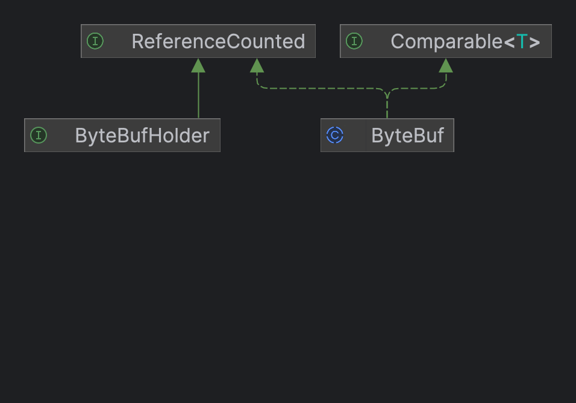
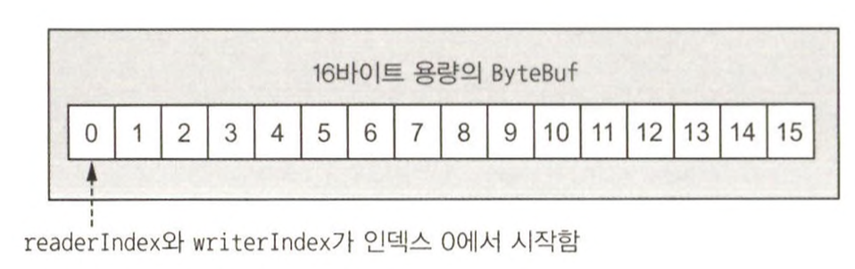

네트워크 데이터의 기본 단위는 항상 바이트다.  
자바 NIO는 ByteBuffer라는 자체 바이트 컨테이너를 제공하지만 이 클래스는 사용법이 너무 복잡해 사용하기 부담스럽다.  
네티는 ByteBuf를 제공하는데 네티의 데이터 처리 기법을 더 잘 이해하려면 이해해야할 부분이다.  
  


ByteBufHolder 인터페이스와 ByteBuf 추상 클래스, 이 두 컴포넌트를 통해 노출한다.  

# ByteBuf 클래스 : 네티의 데이터 컨테이너

(ChannelHandler에서 ByteBuf를 아주 많이 이용한다.)

**ByteBuf API의 장점**  
1. 내장 복합 버퍼 형식을 통해 투명한 제로 카피를 달성할 수 있음
2. 용량을 필요에 따라 확장할 수 있음
3. 리더와 라이터 모드를 전환할 수 있음
4. 읽기와 쓰기에 고유 인덱스를 지원함
5. ...
 
모든 네트워크 통신은 직접 다루기 까다로운 바이트의 시퀀스를 주고받는 방식으로 이뤄지므로 효율적이고 사용하기 쉬운 데이터 구조가 반드시 필요하다.  
  
ByteBuf에서 데이터를 읽으면 readerIndex가 읽은 바이트 수만큼 증가하며, 반대로 데이터를 기록하면 writerIndex가 증가한다.  



1. **힙 버퍼**
   - 보조 배열이라고 하는 가장 자주 이용되는 ByteBuf 패턴이며, JVM의 힙 공간에 데이터를 저장한다.  
   - 이 패턴은 **풀링이 사용되지 않는 경우 빠른 할당과 해제 속도를 보여준다.**  
   - 데이터가 힙 할당 버퍼에 있는 경우 JVM은 소켓을 통해 전송하기 전에 내부적으로 버퍼를 다이렉트 버퍼로 복사해야 한다.
2. **다이렉트 버퍼**
   - 객체용으로 할당하는 메모리는 힙에서만 가져올 수 있다고 생각하기 쉽지만, JDK 1.4에서 NIO와 함께 도입된 ByteBuffer 클래스는 JVM 구현이 네이티브 호출을 통해 메모리를 할당하도록 허용한다.
   - **네이티브 입출력 작업을 호출하기 전(또는 후)에 버퍼의 내용을 중간 버퍼로(또는 반대로) 복사하지 않게 하기 위한 것이다.**
   - 일반적인 GC가 적용되는 힙 바깥에 위치하며 주요 단점은 힙 기반 버퍼보다 할당과 해제의 비용 부담이 약간 더 크다는 것
   - 데이터가 힙에 있지 않기 때문에 아래의 예제 처럼 복사본을 만들어야 한다.
    -   ```java
        public void directBuffer(ByteBuf directBuf) {
            if(!directBuf.hasArray()) {
                int length = directBuf.readableBytes(); // 읽을 수 있는 바이트 수
                byte[] array = new byte[length];
                directBuf.getBytes(directBuf.readerIndex(), array);
                // ...
            }
        }
        ```
3. **복합 버퍼**
   - JDK의 ByteBuffer에는 이와 비슷한 기능은 없다.
   - 이 패턴에서는 ByteBuf 인스턴스를 필요에 따라 추가 및 삭제할 수 있다.
   - 네티는 여러 버퍼가 병합된 가상의 단일 버퍼를 제공하는 ByteBuf의 하위 클래스인 CompositeByteBuf를 이용해 이 패턴을 구현한다.
   
# ByteBufHolder 인터페이스

실제 데이터 페이로드와 함께 다양한 속성 값을 저장해야 하는 경우가 많다.  
예를 들어, HTTP 응답의 경우 바이트로 나타낼 수 있는 실제 콘텐츠와 함께 상태 코드, 쿠기 등도 저장해야 한다.  
이것을 지원하는 ByteBufHodler를 제공한다. ByteBufHolder는 ByteBuf를 풀에서 가져오고 필요할 때 자동으로 해제할 수 있는 버퍼 풀링과 같은 네티의 고급 기능도 지원한다.  
**ByteBufHolder는 ByteBuf안에 페이로드를 저장하는 메시지 객체를 구현하려고 할 때 좋은 선택이다.**  
