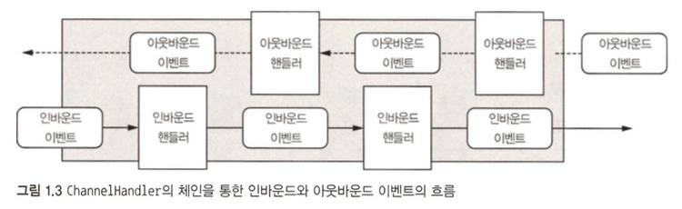

# Channel

Channel은 자바 NIO의 기본 구조이며, 다음과 같이 정의된다.

> 하나 이상의 입출력 작업(읽기 또는 쓰기)을 수행할 수 있는 하드웨어 장치, 파일, 네트워크 소켓, 프로그램 컴포넌트와 같은 엔티티에 대한 열린 연결

일단 Channel을 들어오는(`인바운드`) 데이터와 나가는(`아웃바운드`) 데이터를 위한 **운송 수단** 이라고 생각하자.  
Channel을 열거나 닫고, 연결하거나 끊을 수 있다.  

# 콜백

다른 메서드로 자신에 대한 참조를 제공할 수 있는 메서드다. 다른 메서드에서는 이 참조가 가리키는 메서드를 필요할 때 호출할 수 있다.  
(관심 대상에게 작업 완료를 알리는 가장 일반적인 방법 중 하나다.)  
  
네티는 이벤트를 처리할 때 내부적으로 콜백을 이용한다.  
콜백이 트리거되면 [ChannelHandler 인터페이스](https://netty.io/4.1/api/io/netty/channel/ChannelHandler.html)의 구현을 통해 이벤트를 처리할 수 있다.  
예를 들어, 아래와 같이 새로운 연결이 이뤄지면 ChannelHandler 콜백인 channelActive가 호출된다.  

```java
public class ChannelHandler extends ChannelInboundHandlerAdapter {

    // 새로운 연결이 이뤄지면 해당 메서드가 호출된다.
    @Override
    public void channelActive(ChannelHandlerContext ctx) throws Exception {
        System.out.println("Client " + ctx.channel().remoteAddress() + " connected");
        super.channelActive(ctx);
    }
}
```

# Future

작업이 완료되면 이를 애플리케이션에 알리는 한 방법으로 사용되며, 이 객체는 비동기 작업의 결과를 담는 자리표시자 역항를 하며, 미래의 어떤 시점에 작업이 완료되면 그 결과에 접근할 수 있게 해준다.  
  
JDK는 `java.util.concurrent.Future` 인터페이스를 제공하지만, 제공되는 구현에는 수동으로 작업 완료 여부를 확인하거나 완료되기 전까지 블로킹하는 기능만 있다.  
**그래서 네티는 비동기 작업이 실행됐을 때 이용할 수 있는 자체 구현 [ChannelFuture](https://netty.io/4.0/api/io/netty/channel/ChannelFuture.html)를 제공한다.**  
  
ChannelFuture에는 ChannelFutureListener 인스턴스를 하나 이상 등록할 수 있는 추가 메서드가 있다.  
작업이 완료되면 리스너의 콜백 메서드인 `operationComplete()`가 호출되며, 이 시점에 리스너는 작업이 정상적으로 완료됐는지, 아니면 오류가 발생했는지 확인할 수 있다.  
  
네티의 모든 아웃바운드 입출력 작업은 ChannelFuture를 반환하며 진행을 블로킹하는 작업은 없다.  
**네티는 기본적으로 비동기식이며 이벤트 기반이다.**  

```java
ChannelFutureListener callback = (ChannelFutureListener) future -> {
    if (future.isSuccess()) {
        // 3. 작업이 성공적인 경우 데이터를 저장할 ByteBuf를 생성
        ByteBuf buffer = Unpooled.copiedBuffer("Hello", Charset.defaultCharset());

        // 4. 데이터를 비동기식으로 원격 피어로 전송하고 ChannelFuture를 반환
        ChannelFuture wf = future.channel().writeAndFlush(buffer);
        // ...
    } else {
        // 3. 작업이 성공적이지 않다면 Future에서 예외를 꺼낸다.
        Throwable cause = future.cause();
        cause.printStackTrace();
    }
};

System.out.println("Client " + ctx.channel().remoteAddress() + " connected");

Channel channel = null;

// 1. 원격 피어로 비동기 연결을 만듦
ChannelFuture future = channel.connect(new InetSocketAddress("192.68.0.01", 25));

// 2. 작업이 완료되면 알림을 받음
future.addListener(callback);
```

콜백과 Future는 상호 보완적 메커니즘이며 둘의 조합을 통해 네티의 핵심 구성요소 중 하나를 형성한다.  

# 이벤트와 핸들러

네티는 작업 상태의 변화를 알리기 위해 고유한 이벤트를 이용하며, 발생한 이벤트를 기준으로 적절한 동작을 트리거할 수 있다.  
다음과 같은 동작이 포함된다.  

1. 로깅
2. 데이터 변환
3. 흐름 제어
4. 애플리케이션 논리

네티는 네트워크 프레임워크이므로 이벤트 역시 인바운드 또는 아웃바운드 데이터 흐름에 대한 연관성을 기준으로 분류된다.  

1. **인바운드 이벤트**
   1. 연결 활성화 또는 비활성화
   2. 데이터 읽기
   3. 사용자 이벤트
   4. 오류 이벤트
2. **아웃바운드 이벤트**
   1. 원격 피어로 연결 열기 또는 닫기
   2. 소켓으로 데이터 쓰기 또는 플러시



위의 이미지는 이벤트 핸들러의 체인을 통해 이벤트가 처리되는 방법을 표현한다.  
네티의 `ChannelHandler`는 위의 핸들러와 같이 핸들러의 기본 추상화를 제공한다.  
**지금은 각 핸들러 인스턴스가 특정 이벤트에 반응해 실행되는 일종의 콜백이라고 이해하자.**  
  
**모든 이벤트는 핸들러 클래스의 사용자 구현 메서드로 전달할 수 있으며, 이것은 이벤트 기반 패러다임이 직접적으로 애플리케이션 구성 요소로 변환되는 좋은 사례다.**  
네티는 HTTP 및 SSL/TLS와 같은 프로토콜용 핸들러를 비롯해 곧바로 이용할 수 있는 미리 정의된 핸들러를 광범위하게 제공한다.  
