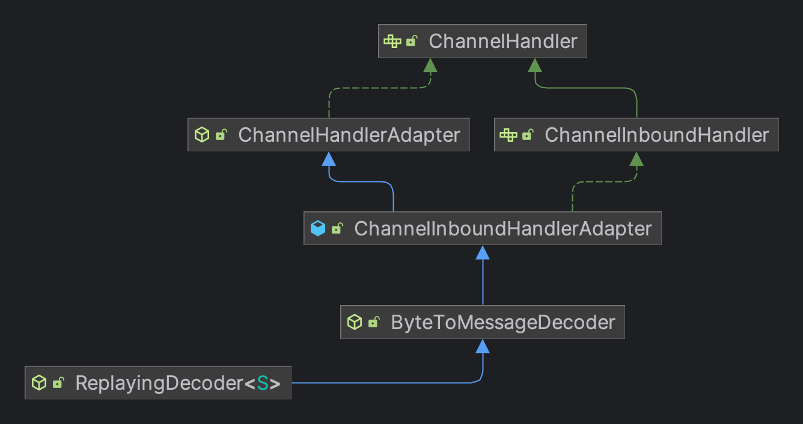
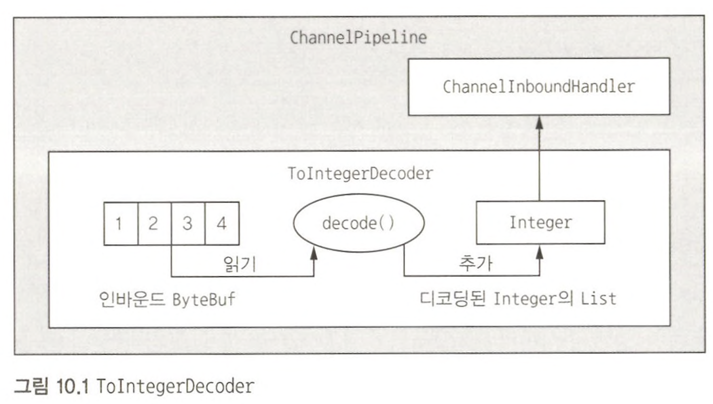
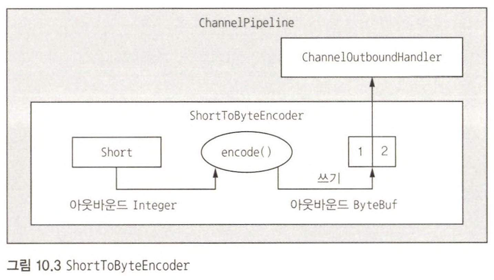

> 네트워크에서는 데이터를 단순한 원시 바이트의 연속으로 취급하지만 애플리케이션에서는 이러한 바이트를 의미가 있는 정보 구조로 만들어야 한다.  
> 애플리케이션 데이터와 네트워크 포맷 간의 변환을 수행하는 컴포넌트를 **인코더** 와 **디코더** 라고 하며, **두 기능을 모두 가진 단일 컴포넌트를 코덱이라고 한다.**  
> 네티는 HTTP 및 base64 같은 잘 알려진 프로토콜을 위해 사전 제작된 클래스는 물론, 특정 요구에 따라 커스터마이즈할 수 있는 범용 메시지 변환 코덱까지 다양한 도구를 제공한다.  
> 예를 들어, 네티 기반 메일 서버를 개발하는 경우 POP3, IMAP, SMTP 프로토콜을 구현하기 위한 네티의 코덱 지원을 활용할 수 있다.

# 무지 목록

1. 컴포넌트라고 일컫는 대상들은 무슨 특징이 있나?
2. 디코더는 Channel이 닫힌 후 마지막 메시지를 생성해야 하는 일이 자주 있기 때문에 (`decodeLast()` 메서드) 디코더에는 메서드 두 개가 있었지만 인코더 추상 클래스에는 메서드가 하나 뿐이다. 

# 코덱이란?

피어 간에 전송되는 원시 바이트를 대상 프로그램의 데이터 포맷으로 구문 분석하고 변환하는 방법을 정의한 컴포넌트이다.  
특정 애플리케이션에서 의미가 있는 바이트의 시퀀스 구조를 **메시지** 라고 한다.  
이 메시지를 전송하기에 적합한 형식(대부분 바이트 스트림)으로 변환하는 것을 **인코더** 라고 하며, 네트워크 스트림을 다시 프로그램의 메시지 포맷으로 변환하는 것을 **디코더** 라고 한다.  
또한 인코더는 아웃 바운드 데이터를 처리하며 디코더는 인바운드 데이터를 처리한다.  
  
# 디코더

- 바이트 스트림을 메시지로 디코딩 : `ByteToMessageDecoder`, `ReplayingDecoder` ...
- 메시지를 다른 메시지 유형으로 디코딩 : `MessageToMessageDecoder`

디코더는 인바운드 데이터를 다른 포맷으로 변환하는 일을 하므로 **자연스럽게 ChannelInboundHandler를 구현한다.**  





```java
public class ToIntegerDecoder extends ByteToMessageDecoder {

    @Override
    protected void decode(ChannelHandlerContext ctx, ByteBuf in, List<Object> out) {
        if (in.readableBytes() >= 4) {
            int i = in.readInt();
            System.out.println("[ToIntegerDecoder] decode : " + i);
            out.add(i);
        }
    }
}

public class ToIntegerDecoder2 extends ReplayingDecoder<Void> {

    @Override
    protected void decode(ChannelHandlerContext ctx, ByteBuf in, List<Object> out) throws Exception {
        int i = in.readInt();
        System.out.println("[ToIntegerDecoder] decode : " + i);
        out.add(i);
    }
}
```

ReplayingDecoderBuffer는 모든 ByteBuf 작업이 지원되는 것은 아니며, ByteToMessageDecoder보다 약간 느리다.  

# TooLongFrameException 클래스

네티는 비동기 프레임워크이므로 **디코딩할 수 있을 때까지 바이트를 메모리 버퍼에 저장해야 한다.**  
또한 디코더가 메모리를 소진할 만큼 많은 데이터를 저장하지 않게 해야 한다.  
  
최대 바이트 수의 임계값을 설정하고, 이를 초과하면 발생하는 예외를 `ChannelHandler.exceptionCaught()`로 포착할 수 있다.  
예외를 처리하는 방법은 디코더의 이용자가 결정하며, HTTP 같은 특정 프로토콜을 이용할 때는 특수한 응답을 반환할 수 있지만 그 밖의 경우에는 연결을 닫는 것이 유일한 선택 사항이다.  
  
```java
public class SafeByteToMessageDecoder extends ByteToMessageDecoder {
    private static final int MAX_FRAME_SIZE = 8;

    @Override
    public void decode(ChannelHandlerContext ctx, ByteBuf in, List<Object> out) throws Exception {
        int readable = in.readableBytes();
        System.out.println("[ToIntegerDecoder] decode readable : " + readable);
        if (readable > MAX_FRAME_SIZE) {
            in.skipBytes(readable);
            throw new TooLongFrameException("Frame too big!");
        }
        int i = in.readInt();
        System.out.println("[ToIntegerDecoder] decode readInt : " + i);
        out.add(i);
    }
}
```

# 인코더

인코더는 `ChannelOutboundHandler`를 구현하고 아웃바운드 데이터를 한 포맷에서 다른 포맷으로 변환하며, 앞서 살펴본 디코더의 기능을 반대로 수행한다.  

1. 메시지를 바이트로 인코딩
2. 메시지를 다른 메시지로 인코딩



```java
public class ShortToByteEncoder extends MessageToByteEncoder<Short> {

    @Override
    protected void encode(ChannelHandlerContext ctx, Short msg, ByteBuf out) throws Exception {
        out.writeShort(msg * 10);
    }
}
```

# 추상 코덱 클래스

인바운드/아웃바운드 데이터와 메시지 변환을 한 클래스에서 관리하는 것이 편리한 경우가 있다.  

```java
@ChannelHandler.Sharable
public class WebSocketConvertHandler extends MessageToMessageCodec<WebSocketFrame, WebSocketConvertHandler.WebSocketFrame> {
    public static final WebSocketConvertHandler INSTANCE = new WebSocketConvertHandler();

    /**
     * OUTBOUND_IN 형식의 각 메시지를 처리할 때마다 호출한다.
     * 처리된 메시지는 INBOUND_IN 형식의 메시지로 인코딩된 후 파이프라인 내의 다음 ChannelOutboundHandler로 전달된다.
     */
    @Override
    protected void encode(ChannelHandlerContext ctx, WebSocketFrame msg, List<Object> out) {
        ByteBuf payload = msg.getData().duplicate().retain();
        switch (msg.getType()) {
            case BINARY:
                out.add(new BinaryWebSocketFrame(payload));
                return;
            case TEXT:
                out.add(new TextWebSocketFrame(payload));
                return;
            case CLOSE:
                out.add(new CloseWebSocketFrame(true, 0, payload));
                return;
            case CONTINUATION:
                out.add(new ContinuationWebSocketFrame(payload));
                return;
            case PONG:
                out.add(new PongWebSocketFrame(payload));
                return;
            case PING:
                out.add(new PingWebSocketFrame(payload));
            default:
                throw new IllegalStateException("Unsupported websocket msg " + msg);
        }
    }

    /**
     * INBOUND_IN 형식의 메시지를 받으면 이를 OUTBOUND_IN 형식의 메시지로 디코딩한다.
     */
    @Override
    protected void decode(ChannelHandlerContext ctx, io.netty.handler.codec.http.websocketx.WebSocketFrame msg, List<Object> out) {
        if (msg instanceof BinaryWebSocketFrame) {
            out.add(new WebSocketFrame(WebSocketFrame.FrameType.BINARY, msg.content().copy()));
            return;
        }
        if (msg instanceof CloseWebSocketFrame) {
            out.add(new WebSocketFrame(WebSocketFrame.FrameType.CLOSE, msg.content().copy()));
            return;
        }
        if (msg instanceof PingWebSocketFrame) {
            out.add(new WebSocketFrame(WebSocketFrame.FrameType.PING, msg.content().copy()));
            return;
        }
        if (msg instanceof PongWebSocketFrame) {
            out.add(new WebSocketFrame(WebSocketFrame.FrameType.PONG, msg.content().copy()));
            return;
        }
        if (msg instanceof TextWebSocketFrame) {
            out.add(new WebSocketFrame(WebSocketFrame.FrameType.TEXT, msg.content().copy()));
            return;
        }
        if (msg instanceof ContinuationWebSocketFrame) {
            out.add(new WebSocketFrame(WebSocketFrame.FrameType.CONTINUATION, msg.content().copy()));
            return;
        }
        throw new IllegalStateException("Unsupported websocket msg " + msg);
    }

    public static final class WebSocketFrame {
        private final FrameType type;
        private final ByteBuf data;

        public WebSocketFrame(FrameType type, ByteBuf data) {
            this.type = type;
            this.data = data;
        }

        public FrameType getType() {
            return type;
        }

        public ByteBuf getData() {
            return data;
        }

        public enum FrameType {
            BINARY,
            CLOSE,
            PING,
            PONG,
            TEXT,
            CONTINUATION
        }
    }
}
```