# 👣

```mermaid
mindmap
  root((TO DO))
    (Programming)
      (Java)
        (Stream)
          📚 모던 자바 인 액션
        🎞️ MultiThread
        📚 이펙티브 자바
      (Spring)
        📝 요청이 Controller에 도달하기까지 
      (Kotlin)
        📚 코틀린 인 액션
        📚 핵심 코틀린 프로그래밍
        📚 이펙티브 코틀린
      (OOP)
        📚 오브젝트
      (DDD)
        📚 도메인 주도 개발 시작하기
    (Virtualization)
      (Docker)
      (LXC)
    (Test)
      📚 단위 테스트
    (Algorithm)
      📚 알고리즘 개정 4판
```

- [MultiThread](https://www.udemy.com/course/java-multi-threading/?utm_medium=udemyads&utm_source=wj-facebook&utm_campaign=bat_conversion_individual&utm_content=all_detargeting_dev_etc02&utm_term=da_multithread_hours_1080x1080_230711&fbclid=IwAR0Ga0wLG2ciRk2-1evGHWhHy7oAnDFSTevcPYRz4X9DCyeGJJS4dqO3Kt4#instructor-1)
