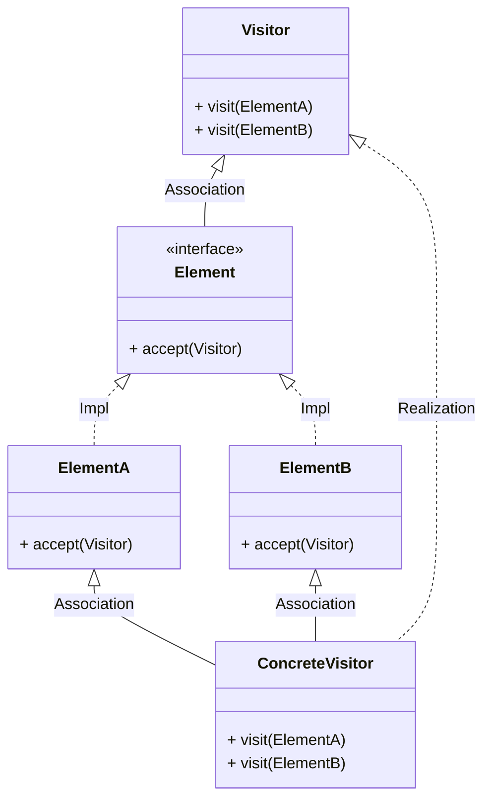
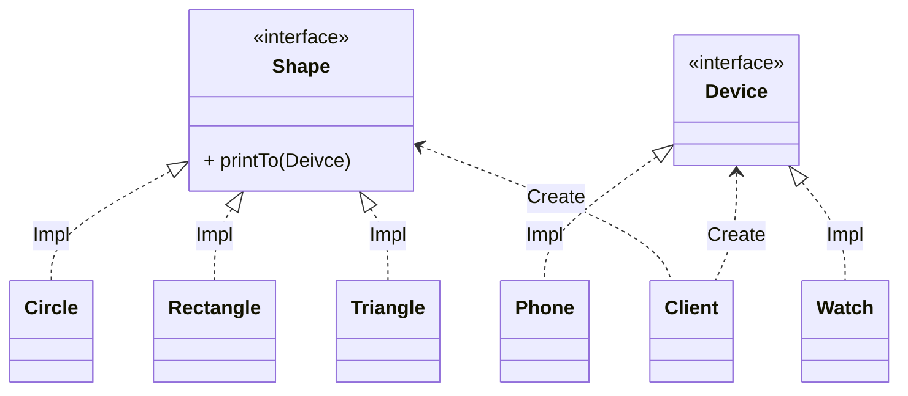
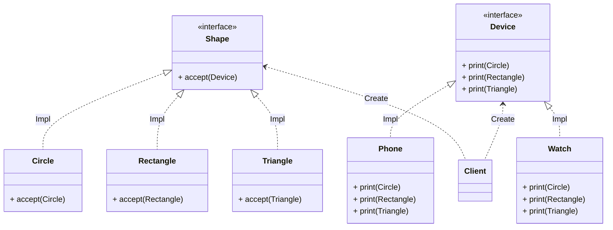

<!-- TOC -->

- [**Visitor Pattern**](#visitor-pattern)
  - [Before](#before)
  - [After](#after)
  - [장점과 단점](#장점과-단점)
  - [적용 예시](#적용-예시)

<!-- /TOC -->

# **[Visitor Pattern](https://github.com/jdalma/design-patterns/tree/master/src/main/java/me/whiteship/designpatterns/_03_behavioral_patterns/_23_visitor)**

**기존 코드를 변경하지 않고 새로운 기능을 추가하는 방법**  
- `더블 디스패치 (Double Dispatch)`를 활용할 수 있다.
- 디스패치란? **요청이 들어오면 다형성을 적용하여 구체적인 클레스나 메소드를 런타임에 위임하는 과정이다**
- `Visitor`는 `Element`를 알고있고, `Visitor`의 구현체인 `ConcreteVisitor`가 `ElementA`와 `ElementB`를 선택하여 호출하는 것



**여러 디바이스의 출력 기능을 구현하기**  
- 디바이스별로 출력 기능을 구분하려한다면 `Rectangle`안에서 `Watch`면 **작게** `Phone`이면 **크게** 분기로 해야할 것이다.

## Before



```java
public void printTo(Device device) {
    if (device instanceof Phone) {
        System.out.println("print Circle to phone");
    } else if (device instanceof Watch) {
        System.out.println("print Circle to watch");
    }
}
```

이런 식의 **분기문이 추가될 것이 뻔하다.**  

## After



1. `Shape`의 구현체들 `Circle`,`Rectangle`,`Triangle`이 **Element**
2. `Device` 인터페이스가 **Visitor**
3. `if-else` 분기문들이 사라지고 **실제 Device 구현체들이 어떤 작업을 처리할지 정한다.**
4. **Dispatch가 두 번 일어난다**
   1. `Shape`에 있는 `accept()`를 호출하기 위해 어디 구현체의 `accept()` 인지 확인하고
   2. 어떤 `Device`의 `print()`인지 확인한다.

```java
public static void main(String[] args) {
    Shape rectangle = new Rectangle();
    Device device = new Phone();
    rectangle.accept(device);
}
```

## 장점과 단점

1. 기존 코드를 수정하지 않고 확장이 가능하다 `OCP`
   1. 추가되는 `Device`들은 각 `print`만 구현하면 된다
2. 구조가 복잡하여 **더블 디스패치를 이해하기가 힘들다.**
3. `Element`가 추가되거나 사라지면 각 `Deivce` 구현체들의 코드가 다 수정되어야 한다.

## 적용 예시

1. 자바
   1. FileVisitor, SimpleFileVisitor
      1. `FileVisitResult`를 반환한다.
   2. AnnotationValueVisitor
   3. ElementVisitor
2. 스프링
   1. **BeanDefinitionVisitor**