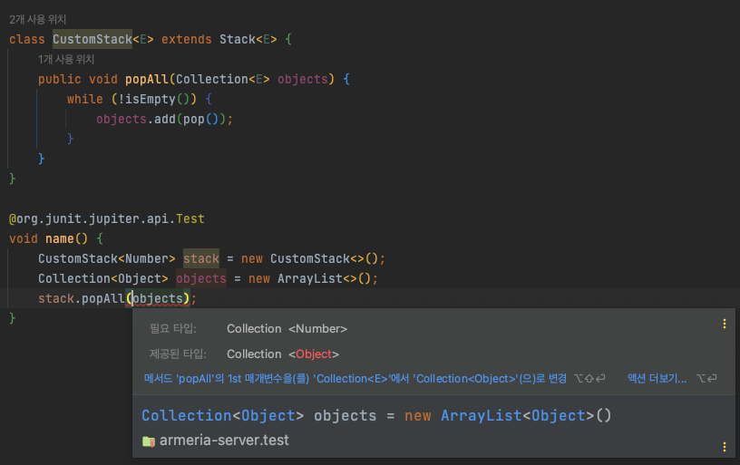
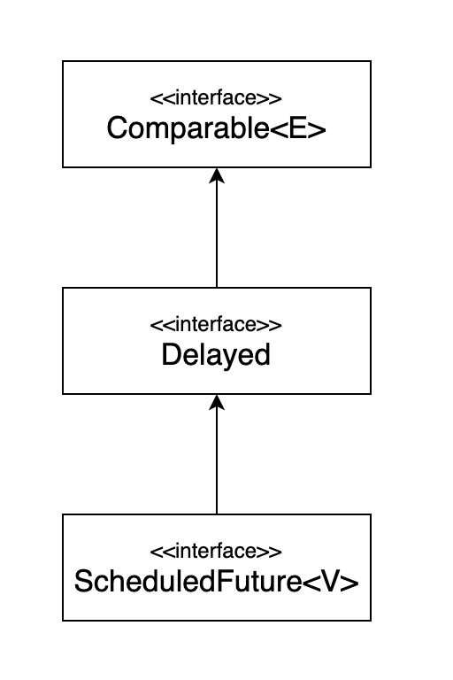
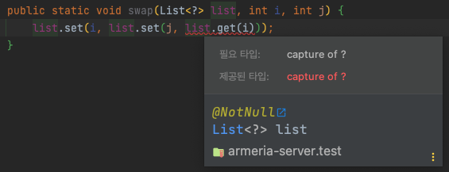

**연관 아이템**
1. 아이템 28 : 배열보다는 리스트를 사용하라
2. 아이템 29 : 이왕이면 제네릭 타입으로 만들라
3. 아이템 30 : 이왕이면 제네릭 메서드로 만들라


# 한정적 와일드카드를 사용해 API 유연성을 높이라

아이템 28에서 확인했듯이 제네릭은 불공변이며 `List<String>`은 `List<Object>`의 하위 타입도 상위 타입도 아니다.  
하지만 **때론 불공변 방식보다 유연한 무언가가 필요하다.**  
  
아래의 예제를 보자.

```java
public class Stack<E> {
    public Stack();
    public void push(E e);
    public E pop();
    public boolean isEmpty();

    public void pushAll(Iterable<E> src) {
        for (E e : src) {
            push(e);
        }
    }
}
```

`pushAll()`은 Stack의 원소 타입과 일치하면 잘 작동한다.  
하지만 `Stack<Number>`로 선언한 후 `pushAll(intValue)`를 호출하면 어떻게 될까?  
`Integer`는 `Number`의 하위 타입이니 잘 작동할 것 같지만, **실제로는 매개변수화 타입이 불공변이기 때문에 예외가 발생한다.**  
  
자바는 이런 상황에 대처할 수 있는 **한정적 와일드카드 타입**이라는 특별한 매개변수 타입을 지원한다.  
`pushAll()`의 매개변수 타입은 `E의 하위 타입의 Iterable`이어야 하며, `Iterable<? extends E>`가 정확히 이런 뜻이다.  
- 사실 `extends`라는 키워드는 이 상황에 딱 어울리지 않는다.
- 하위 타입이란 자기 자신도 포함하지만, 현재 자기 자신을 확장한 상황은 아니기 때문이다. (아이템 29 참조)
  
```java
public void pushAll(Iterable<? extends E> src) {
    for (E e : src) {
        push(e);
    }
}
```

위와 같이 작성하면 `pushAll()`은 해결된다.  
`popAll()`은 어떻게 작성해야할까?  
  
```java
public void popAll(Collection<E> dst) {
    while (!isEmpty()) {
        dst.add(pop());
    }
}
```

*사이드 이펙트로만 이루어진 메소드라 좋은 예시같지는 않다.*  
`Stack<Number>`의 원소를 `Object`용 컬렉션으로 옮기려 한다면 어떻게 될까?  

```java
Stack<Number> stack = new Stack<>();
Collection<Object> objects = new ArrayList<>();
stack.popAll(objects);
```


  
이번에는 `popAll()`의 입력 매개변수의 타입이 `E의 상위 타입의 Collection`이어야 한다.  
`Collection<? super E>`가 정확히 이런 의미이다.  
그래서 아래와 같이 `Number`의 하위 타입으로 받으려면 컴파일되지 않는다.  


**유연성을 극대화하려면 원소의 생산자나 소비자용 입력 매개변수에 와일드카드 타입을 사용하라.**  
- 입력 매개변수가 생산자와 소비자 역할을 동시에 한다면 와일드카드 타입을 써도 좋을게 없다.  

## **PECS : producer-extends, consumer-super**  

이 공식을 외워두면 어떤 와일드카드 타입을 써야하는지 기억하는데 도움이 된다.  
즉, 매개변수화 타입 `T`가 생산이라면 `<? extends T>`를 사용하고, 소비자라면 `<? super T>`를 사용하라.  
- 반환 타입에는 한정적 와일드카드 타입을 사용하면 안된다.
- 유연성을 높혀주기는 커녕 클라이언트 코드에서도 와일드카드 타입을 써야하기 때문이다.
  
**클래스 사용자가 와일드카드 타입을 신경써야 한다면 설계에 문제가 있을 가능성이 크다.**  
컴파일러가 올바른 타입을 추론하지 못할 때면 언제든 <a href="https://docs.oracle.com/javase/specs/jls/se8/html/jls-15.html#jls-15.12" target="_blank">명시적 타입 인수</a>를 사용해서 타입을 알려주면 된다.  
목표 타이핑은 자바 8부터 지원하기 시작했다.  
  
```java
Set<Number> numbers = Union.<Number>union(integers, doubles);
```
Union.`<Number>`union(integers, doubles); 이렇게 명시적 타입 인수를 사용할 수 있다.  
  
와일드카드 타입을 사용한다면 아래와 같이 다듬을 수 있다.

```java
public static <E extends Comparable<E>> E max(List<E> list) // 전
public static <E extends Comparable<? super E>> E max(List<? extends E> list) // 후
```

1. `max(List<E> list)` → `max(List<? extends E> list)`
   - 입력 매개변수에서는 `E 인스턴스`를 생산하므로 수정했다
2. `<E extends Comparable<E>>` → `<E extends Comparable<? super E>>` 
   - 타입 매개변수 `E`가 `Comparable<E>`를 확장한다고 정의했지만, 이때 `Comparable<E>`는 `E 인스턴스`를 소비한다. 그래서 한정적 와일드 카드 타입을 적용했다.
  
`Comparable<E>`는 언제나 소비자 이므로 `Comparable<? super E>`를 사용하는 편이 낫다.  
- `Comparator`도 마찬가지다.  

이렇게 복잡한 코드를 작성해야 할 상황은 **`Comparable`혹은 `Comparator`를 직접 구현하지 않고, 직접 구현한 다른 타입을 확장한 타입을 지원하기 위해 와일드카드가 필요하다.**  
  


```java
public interface Comparable<E>
public interface Delayed extends Comparable<Delayed>
public interface ScheduledFuture<V> extends Delayed, Future<V>
```

## 비한정적 타입 매개변수와 비한정적 와일드카드

```java
public static <E> void swap(List<E> list, int i, int j);
public static void swap(List<?> list, int i, int j);
```

기본 규칙은 **메서드 선언에 타입 매개변수가 한 번만 나오면 와일드카드로 대체하라**  
이때 비한정적 타입 매개변수라면 비한정적 와일드카드로 바꾸고, 한정적 타입 매개변수라면 한정적 와일드카드로 바꾸면 된다.  



하지만 위 이미지처럼 방금 꺼낸 원소를 리스트에 다시 넣을 수 없다. 왜 그럴까?  
**원인은 리스트의 타입이 `List<?>`인데, `List<?>`에는 null외에는 어떤 값도 넣을 수 없기 때문이다.**  
이때 **와일드카드 타입의 실제 타입을 알려주는 메서드를 `private helper method`로 따로 작성하여 활용하여 해결할 수 있다.**  
  
```java
public static void swap(List<?> list, int i, int j) {
    swapHelper(list, i, j);
}

// 와일드카드 타입을 실제 타입으로 바꿔주는 private 도우미 메서드
private static <E> void swapHelper(List<E> list, int i, int j) {
    list.set(i, list.set(j , list.get(i)));
}
```
  
`swapHelper()`에서는 값을 꺼낸 타입은 항상 `E`이고, `E` 타입의 값이라면 이 리스트에 넣어도 안전함을 알 수 있다.  


## 매개변수(parameter) 와 인수(argument)의 차이

매개변수는 메서드 선언에 정의한 변수이고, 인수는 메서드 호출시 넘기는 **실젯값**이다.  
제네릭으로 비교하자면 

```java
class Set<T> {...}
Set<Integer> = ...;
```

`T`는 **타입 매개변수**가 되고, `Integer`는 **타입 인수**가 된다.  