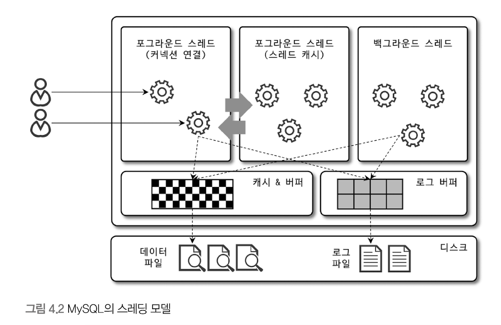
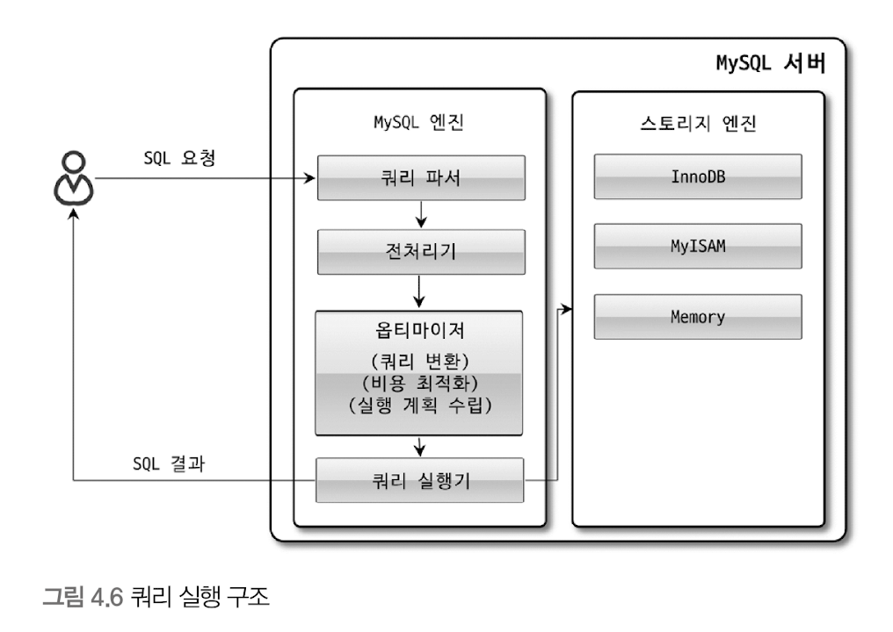
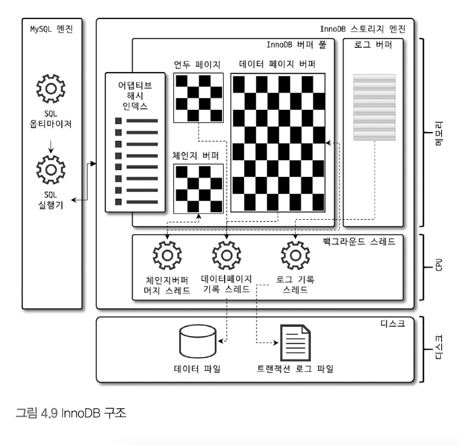
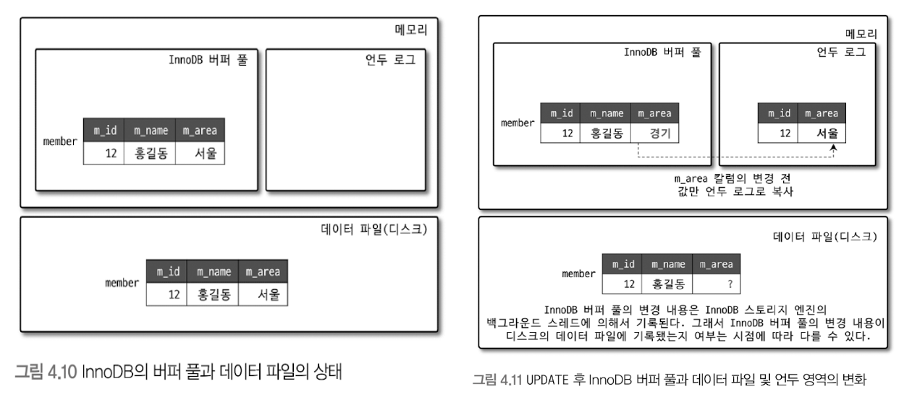
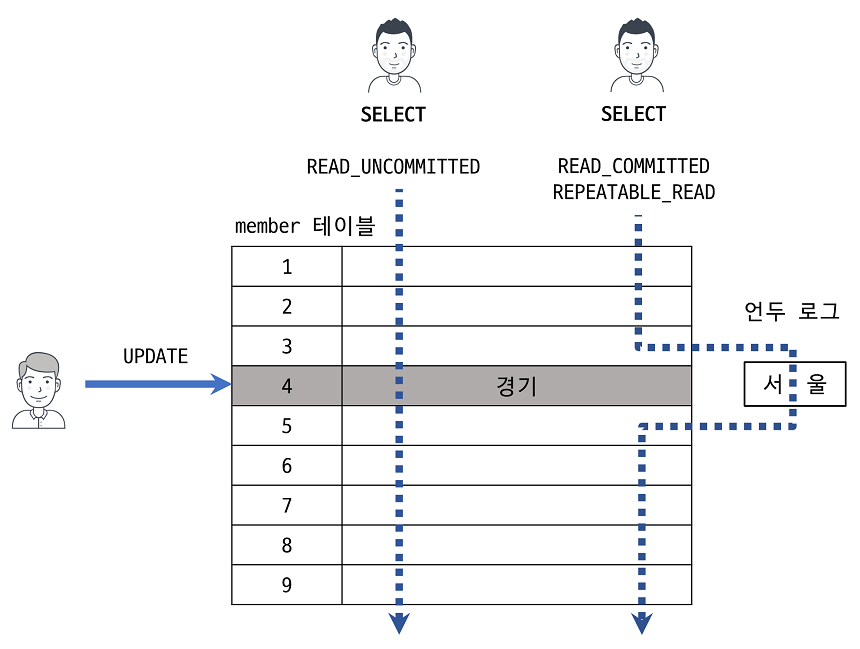
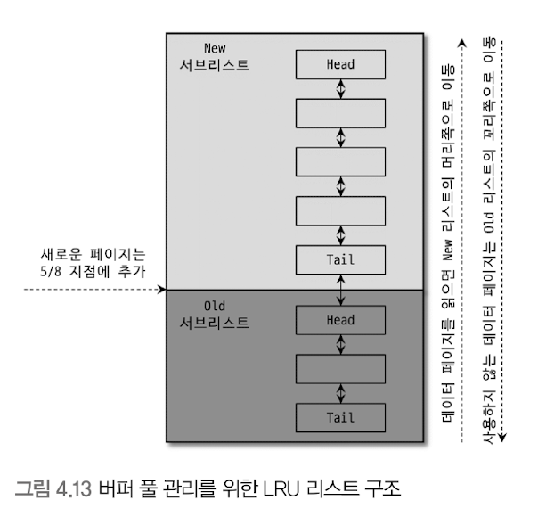
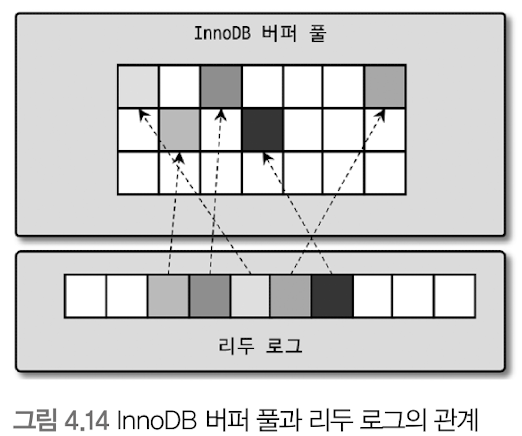
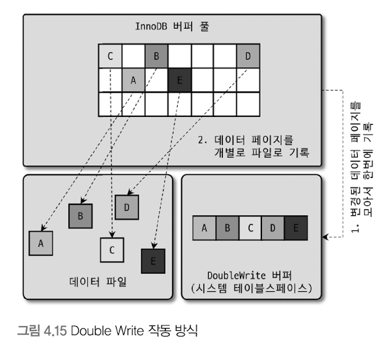
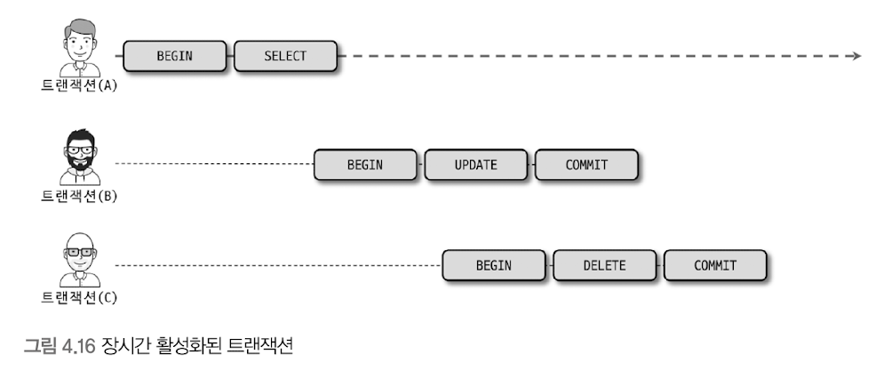

# 메모

1. InnoDB 버퍼 풀은 내부적으로 128MB 청크 단위로 쪼개어 관리되는데, 이는 버퍼 풀의 크기를 줄이거나 늘리기 위한 단위 크기로 사용된다.
2. [버퍼 풀](https://dev.mysql.com/doc/refman/8.0/en/innodb-buffer-pool.html)
3. [페이지](https://dev.mysql.com/doc/refman/8.0/en/glossary.html#glos_page)
4. [InnoDB Checkpoints](https://dev.mysql.com/doc/refman/8.0/en/innodb-checkpoints.html)
5. [DELETE statement](https://dev.mysql.com/doc/refman/8.0/en/delete.html)

***

# MySQL 개괄적인 구조

```
               |---------------- MySQL 서버 ---------------|
               |------ MySQL 엔진 -------|    | 스토리지 엔진 |
프로그래밍 API →  커넥션 핸들러  →  SQL 인터페이스 →  스토리지 엔진 API  →  운영체제 하드웨어
                              SQL 파서        (InnoDB,MyISAM)   (데이터 파일, 로그 파일)
                              SQL 옵티마이저
                              캐시 & 버퍼
```

> "하나의 쿼리 작업은 여러 하위 작업으로 나뉘는데, 각 하위 작업이 MySQL 엔진 영역에서 처리되는지 아니면 스토리지 엔진 영역에서 처리되는지 구분할 줄 알아야 한다."

<h3>MySQL 엔진</h3>

1. 클라이언트로부터의 접속 및 쿼리 요청을 처리하는 **커넥션 핸들러**
2. SQL 파서 및 전처리기
3. 쿼리의 최적화된 실행을 위한 **옵티마이저**

실질적인 GROUP BY나 ORDER BY 등 복잡한 처리는 스토리지 엔진 영역이 아니라 MySQL 엔진의 처리 영역인 **쿼리 실행기** 에서 처리된다.  

<h3>스토리지 엔진</h3>

요청된 SQL 문장을 분석하거나 최적화하는 등 **DBMS의 두뇌** 에 해당하는 처리를 수행하고, 실제 데이터를 디스크 스토리지에 저장하거나 디스크 스토리지로부터 데이터를 읽어오는 부분은 스토리지 엔진이 전담한다.  
대부분의 작업은 MySQL 엔진에서 처리되며 **데이터 읽기/쓰기 작업만 스토리지 엔진에 의해 처리된다.**  
  
<h3>핸들러 API</h3>

MySQL 엔진의 쿼리 실행기에서 데이터를 쓰거나 읽어야 할 때는 각 스토리지 엔진에 쓰기 또는 읽기를 요청하는데, 이러한 요청을 **핸들러 요청** 이라 하고, 여기서 사용되는 API를 핸들러 API라고 한다.  
이 핸들러 API를 통해 얼마나 많은 데이터 작업이 있었는지 확인이 가능하다. `SHOW GLOBAL STATUS LIKE 'Handler%'`  
**MySQL 엔진이 스토리지 엔진에 데이터 읽기/쓰기 요청을 명령하려면 핸들러를 통해야 한다.**  
  
# MySQL 스레딩 구조



MySQL 서버는 프로세스 기반이 아니라 스레드 기반으로 동작하며, 크게 **포그라운드 스레드** 와 **백그라운드 스레드** 로 구분할 수 있다.  

```
mysql> select thread_id, name, type, processlist_user, processlist_host from performance_schema.threads order by type, thread_id;
+-----------+---------------------------------------------+------------+------------------+------------------+
| thread_id | name                                        | type       | processlist_user | processlist_host |
+-----------+---------------------------------------------+------------+------------------+------------------+
|         1 | thread/sql/main                             | BACKGROUND | NULL             | NULL             |
|        ...                                                                                                 |
|        46 | thread/mysqlx/acceptor_network              | BACKGROUND | NULL             | NULL             |
|        47 | thread/mysqlx/acceptor_network              | BACKGROUND | NULL             | NULL             |
|        44 | thread/sql/event_scheduler                  | FOREGROUND | event_scheduler  | localhost        |
|        48 | thread/sql/compress_gtid_table              | FOREGROUND | NULL             | NULL             |
|        50 | thread/sql/one_connection                   | FOREGROUND | root             | localhost        |
+-----------+---------------------------------------------+------------+------------------+------------------+
```

마지막 `thread/sql/one_connection` 스레드가 실제 사용자의 요청을 처리하는 포그라운드 스레드다.  

<h3>포그라운드 스레드</h3>

최소환 MySQL에 접속된 클라이언트의 수만큼 존재하며, 주로 각 클라이언트 사용자가 요청하는 쿼리 문장을 처리한다.  
커넥션이 종료되면 해당 커넥션을 담당하던 스레드는 다시 **스레드 캐시** 로 되돌아간다.  
  
**포그라운드 스레드는 데이터를 MySQL의 데이터 버퍼나 캐시로부터 가져오며, 버퍼나 캐시에 없는 경우에는 직접 디스크의 데이터나 인덱스 파일로부터 데이터를 읽어와서 작업을 처리한다.**  
**InnoDB 테이블은 데이터 버퍼나 캐시까지만 포그라운드 스레드가 처리하고, 나머지 버퍼로부터 디스크까지 기록하는 작업은 백그라운드 스레드가 처리한다.**  

<h3>백그라운드 스레드</h3>

1. **인서트 버퍼를 병합하는 스레드**
2. **로그를 디스크로 기록하는 스레드**
3. **InnoDB 버퍼 풀의 데이터를 디스크에 기록하는 스레드**
4. **데이터를 버퍼로 읽어 오는 스레드**
5. **잠금이나 데드락을 모니터링하는 스레드**

**사용자의 요청을 처리하는 도중 데이터의 쓰기 작업은 지연(버퍼링)되어 처리될 수 있지만 데이터의 읽기 작업은 절대 지연될 수 없다.**  
그래서 대부분 쓰기 작업을 버퍼링해서 일괄 처리하는 기능이 탑재되어 있다.  

# 메모리 할당 및 사용 구조

- **글로벌 메모리 영역**
  - MySQL 서버가 시작되면서 운영체제로부터 할당된다.
  - 생성된 글로벌 메모리 영역이 2개 이상이라 하더라도 모든 스레드에 의해 공유된다.
  - **테이블 캐시** , **InnoDB 버퍼풀** , **InnoDB 어댑티브 해시 인덱스** , **InnoDB 리두 로그 버퍼**
- **로컬 메모리 영역** (세션 메모리 영역)
  - MySQL 서버상에 존재하는 클라이언트 스레드가 쿼리를 처리하는 데 사용하는 메모리 영역
  - 사용자가 연결 시 생성되는 MySQL 서버 클라이언트 커넥션으로 부터의 요청을 처리하기 위해 스레드를 하나씩 할당하게 되는데, 이 클라이언트 스레드가 사용하는 메모리 영역
  - **중요한 특징은 각 쿼리의 용도별로 필요할 때만 공간이 할당되고 필요하지 않은 경우에는 MySQL이 메모리 공간을 할당조차도 하지 않을 수도 있다는 것** (소트 버퍼, 조인 버퍼와 같은 공간이 그러하다)
  - 로컬 메모리 공간은 커넥션이 열려 있는 동안 계속 할당된 상태로 남아 있는 **커넥션 버퍼** , **결과 버퍼** 가 있고 쿼리를 실행하는 순간에만 할당했다가 다시 해제하는 **소트 버퍼** , **조인 버퍼** 가 있다.
  - **소트 버퍼** , **조인 버퍼** , **바이너리 로그 캐시** , **네트워크 버퍼**

# 쿼리 실행 구조



1. **쿼리 파서**
   - 사용자 요청으로 들어온 쿼리 문장을 토큰(MySQL이 인식할 수 있는 최소 단위의 어휘나 기호)으로 분리해 **트리 형태의 구조로 만들어 내는 작업** 을 의미한다.
   - 기본 문법 오류는 이 과정에서 발견된다.
2. **전처리기**
   - 쿼리 파서 단계에서 만들어진 파서 트리를 기반으로 쿼리 문장에 구조적인 문제점이 있는지 확인한다.
   - 토큰을 테이블 이름이나 칼럼 이름, 또는 내장 함수와 같은 개체를 매핑해 해당 **객체의 존재 여부와 객체의 접근 권한 등을 확인하는 과정** 이 여기서 수행된다.
3. **옵티마이저**
   - 사용자의 요청으로 들어온 **쿼리 문장을 저렴한 비용으로 가장 빠르게 처리할지를 결정하는 역할**
4. **실행 엔진** (쿼리 실행기)
   - 옵티마이저가 경연진, 실행 엔진은 중간 관리자, 핸들러는 각 업무의 실무자로 비유할 수 있다.
   - 옵티마이저가 GROUP BY를 처리하기 위해 임시 테이블을 사용하기로 결정했다고 보자.
      1. 실행 엔진이 핸들러에게 임시 테이블을 만들라고 요청
      2. 다시 실행 엔진은 WHERE 절에 일치하는 레코드를 읽어오라고 핸들러에게 요청
      3. 읽어온 레코드들을 1번에서 준비한 임시 테이블로 저장하라고 다시 핸들러에게 요청
      4. 데이터가 준비된 임시 테이블에서 필요한 방식으로 데이터를 읽어 오라고 핸들러에게 다시 요청
      5. 최종적으로 실행 엔진은 결과를 사용자나 다른 모듈로 넘김
   - **만들어진 계획대로 각 핸들러에게 요청해서 받은 결과를 또 다른 핸들러 요청의 입력으로 연결하는 역할을 수행한다.**
5. **핸들러** (스토리지 엔진)
   - 실행 엔진의 요청에 따라 데이터를 디스크로 저장하고 읽어오는 역할을 담당한다.


# InnoDB 스토리지 엔진 아키텍처



InnoDB의 모든 테이블은 기본적으로 프라이머리 키를 기준으로 **클러스터링** 되어 저장된다.  
즉, **프라이머리 키 값의 순서대로 디스크에 저장된다는 뜻이며, 모든 세컨더리 인덱스는 레코드의 주소 대신 프라이머리 키의 값을 논리적인 주소로 사용한다.**  
프라이머리 키를 이용한 레인지 스캔이 다른 보조 인덱스에 비해 빠르기 때문에 실행 계획에서 선택될 확률이 높다.  
  
InnoDB에서 외래 키는 부모 테이블과 자식 테이블 모두 해당 칼럼에 인덱스 생성이 필요하고, 변경 시에는 반드시 부모 테이블이나 자식 테이블에 데이터가 있는지 체크하는 작업이 필요하므로 잠금이 여러 테이블로 전파되고, 그로 인해 **데드락이 발생할 때가 많으므로 개발할 때도 외래 키의 존재에 주의하는 것이 좋다.**  
  
## Multi Version Concurrency Control

일반적으로 레코드 레벨의 트랜잭션을 지원하는 DBMS가 제공하는 기능이며 **잠금을 사용하지 않는 일관된 읽기를 제공 하는 것이 목적** 이다.  
여기서 멀티 버전이라 함은 **하나의 레코드에 대해 여러 개의 버전이 동시에 관리된다는 의미** 다.  
InnoDB는 언두 로그를 이용해 이 기능을 구현한다.  



InnoDB의 버퍼 풀은 새로운 값으로 업데이트 되지만 디스크의 데이터 파일에는 체크포인트나 InnoDB의 Write 스레드에 의해 새로운 값으로 업데이트돼 있을 수도 있고 아닐 수도 있다.  
(InnoDB가 ACID를 보장하기 때문에 일반적으로 데이터는 동일한 상태라고 가정해도 무방하다.)  
  
**ROLLBACK이나 COMMIT이 되지 않은 상황에 같은 레코드를 조회하면 설정된 격리 수준에 따라 결과가 다르다.**  
- `READ_UNCOMMITTED`는 버퍼 풀의 데이터를 반환한다. 커밋이 되었던 안되었던 변경된 상태의 데이터를 반환하는 것이다.
- `READ_COMMITTED`나 그 이상의 격리 수준에서는 아직 커밋되지 않았기 때문에 변경되기 이전의 언두 로그가 보관하고 있는 내용을 반환한다.

위와 같은 한 개의 레코드가 2개의 버전이 유지되고 필요에 따라 어떤 데이터가 보여지는지 여러 가지 상황에 따라 달라지는 과정을 MVCC라고 한다.  
  
ROLLBACK이 되면 언두 영역의 데이터를 버퍼 풀로 다시 복구하지만,  
COMMIT,ROLLBACK 된다고 해도 언두 영역의 백업 데이터가 항상 바로 삭제되는 것은 아니며 **이 언두 영역을 필요로 하는 트랜잭션이 더는 없을 때 비로소 삭제된다.**  
  
<h3>잠금 없는 일관된 읽기 (Non-Locking Consistent Read)</h3>
  
InnoDB 스토리지 엔진은 **MVCC 기술을 이용해 잠금을 걸지 않고 읽기 작업을 수행한다.**  
격리 수준이 SERIALIZABLE이 아닌 READ_UNCOMMITTED나 READ_COMMITTED, REPETABLE_READ 수준인 경우 그리고 INSERT와 연결되지 않은 순수한 SELECT 작업은 다른 트랜잭션의 변경 작업과 관계없이 항상 잠금을 대기하지 않고 바로 실행된다.  



## 버퍼 풀

**디스크의 데이터 파일이나 인덱스 정보를 메모리에 캐시해두는 공간, 쓰기 작업을 지연시켜 일괄 작업으로 처리할 수 있게 해주는 버퍼 역할도 같이한다.**  
쓰기 작업은 파일의 이곳저곳에 위치한 레코드를 변경하기 때문에 랜덤한 디스크 작업을 발생시킨다. 하지만 버퍼 풀이 이러한 변경된 데이터를 모아서 처리하면 랜덤한 디스크 작업의 횟수를 줄일 수 있다.  
  
버퍼 풀 전체를 관리하는 내부 잠금(세마포어) 경합을 줄이기 위해 버퍼 풀을 여러 개로 쪼개어 관리할 수 있게 개선됐다.  

<h3>버퍼 풀의 구조</h3>

InnoDB 스토리지 엔진은 버퍼 풀이라는 거대한 메모리 공간을 페이지 크기(innodb_page_size 변수)의 조각으로 쪼개어 InnoDB 스토리지 엔진이 데이터를 필요로 할 때 해당 데이터 페이지를 읽어서 각 조각에 저장한다.  
버퍼 풀의 페이지 조각을 관리하기 위해 InnoDB 스토리지 엔진은 크게 `LRU 리스트`와 `Flush 리스트` 그리고 `Free 리스트`라는 3개의 자료구조를 관리한다.

1. `LRU 리스트` : 엄밀하게 `MRU (Most Recently Used)`리스트가 결합된 형태이다.
   - **Old 서브리스트**영역은 `LRU`에 해당하며, **New 서브리스트**영역은 `MRU`에 해당된다.
2. `Flush 리스트` : 디스크로 동기화되지 않은 데이터를 가진 데이터 페이지(`더티 페이지`)의 변경 시점 기준의 페이지 목록을 관리한다.
   - **한 번이라도 데이터가 변경된 데이터 페이지는 플러시 리스트에 관리되고, 특정 시점이 되면 디스크로 기록돼야 한다.**
   - 데이터가 변경되면 InnoDB는 변경 내용을 **리두 로그**에 기록하고 버퍼 풀의 데이터 페이지에도 변경 내용을 반영한다.
   - **리두 로그의 각 엔트리는 특정 데이터 페이지와 연결된다.**
3. `Free 리스트` : InnoDB 버퍼 풀에서 실제 사용자 데이터로 채워지지 않은 비어 있는 페이지들의 목록이며, 사용자의 쿼리가 새롭게 디스크의 데이터 페이지를 읽어와야 하는 경우 사용된다

<h3>LRU 리스트</h3>



위의 그림과 같이 **LRU 리스트를 관리하는 목적은 디스크로부터 한 번 읽어온 페이지를 최대한 오랫동안 InnoDB 버퍼 풀의 메모리에 유지해서 디스크 읽기를 최소화하는 것이다.**  
InnoDB 스토리지 엔진에서 데이터를 찾는 과정은 대략 다음과 같다.  
  
1. 필요한 레코드가 저장된 데이터 페이지가 버퍼 풀에 있는지 검사
   1. InnoDB 어댑티브 해시 인덱스를 이용해 페이지를 검색
   2. 해당 테이블의 인덱스(B-Tree)를 이용해 버퍼 풀에서 페이지를 검색
   3. 버퍼 풀에 이미 데이터 페이지가 있다면 해당 페이지의 포인터를 MRU 방향으로 승급
2. 디스크에서 필요한 데이터 페이지를 버퍼 풀에 적재하고, 적재된 페이지에 대한 포인터를 LRU 헤더 부분에 추가
3. 버퍼 풀의 LRU 헤더 부분에 적재된 데이터 페이지가 실제로 읽히면 MRU 헤더 부분으로 이동
4. 버퍼 풀에 상주하는 데이터 페이지는 사용자 쿼리가 얼마나 최근에 접근했었는지에 따라 나이(age)가 부여되며, 버퍼 풀에 상주하는 동안 사용되지 않으면 나이가 오래되어(aging) 결국 해당 페이지는 버퍼 풀에서 제거된다.
   - 만약 버퍼 풀의 데이터 페이지가 쿼리에 의해 사용되면 나이가 초기화되어 다시 젊어지고 MRU의 헤더 부분으로 옮겨진다.
5. **필요한 데이터가 자주 접근됐다면 해당 페이지의 인덱스 키를 어댑티브 해시 인덱스에 추가**

> 버퍼 풀 내부에서 최근 접근 여부에 따라서 데이터 페이지는 서로 `LRU`또는 `MRU`로 이동하는 것이다.  
> 그리고 InnoDB 스토리지 엔진은 `LRU`의 끝으로 밀려난 데이터 페이지들을 버퍼 풀에서 제거해서 새로운 데이터 페이지를 적재할 수 있는 빈 공간을 준비한다.  
> 새로운 페이지는 `New`,`Old` 서브 리스트의 `5/8지점`에 추가되며, 만약 캐시 히트가 된다면 `New`의 머리로 이동한다.  
> 결국 자주 쓰이지 않는 데이터 페이지는 `MRU`의 꼬리로 이동하게 되며, 결국 삭제된다

## 버퍼 풀과 리두 로그

InnoDB 버퍼 풀의 사이즈가 크기만 하면 성능 향상이 클 것이라고 생각할 수 있지만, **InnoDB 버퍼 풀은 데이터베이스 서버의 성능 향상을 위해 `데이터 캐시`와 `쓰기 버퍼링`이라는 두 가지 용도가 있는데, 버퍼 풀의 메모리 공간만 단순히 늘리는 것은 `데이터 캐시 기능만 향상` 시키는 것이다.**  
쓰기 버퍼링 기능에 대한 이해를 하려면 버퍼 풀과 리두 로그와의 관계를 먼저 이해해야 한다.  



버퍼 풀은 (디스크에서 읽은 상태로 전혀 변경되지 않은) **클린 페이지** 와 (쓰기 쿼리 명령으로 변경된 데이터를 가진) **더티 페이지** 를 함께 가지고 있다.  
(더티 페이지는 버퍼 풀에 무한정 머무를 수 있는 것은 아니다.)  
  
InnoDB 스토리지 엔진에서 **리두 로그는 1개 이상의 고정 크기 파일을 연결해서 순환 고리처럼 사용한다.**  
즉, 데이터 변경이 계속 발생하면 리두 로그 파일에 기록됐던 로그 엔트리는 어느 순간 다시 새로운 로그 엔트리로 덮어 쓰인다.  
위의 그림과 같이 화살표로 연결된 리두 로그의 공간이 **재사용 불가능한 공간인 활성 리두 로그** 라고 한다.  
  
InnoDB 스토리지 엔진은 **주기적으로 체크포인트 이벤트를 발생시켜 리두 로그와 버퍼 풀의 더티 페이지를 디스크로 동기화한다.**  
더티 페이지는 특정 리두 로그 엔트리와 관계를 가지고, 체크포인트가 발생하면 체크포인트 LSN보다 작은 리두 로그 엔트리와 관련된 더티 페이지는 모두 디스크로 동기화돼야 한다.  
  
> 일반적으로 리두 로그는 변경분만 가지고 버퍼 풀은 데이터 페이지를 통째로 가지기 때문에 데이터 변경이 발생해도 리두 로그는 훨씬 작은 공간만 있으면 된다.

## 버퍼 풀 플러시

InnoDB 버퍼 풀은 더티 페이지를 많이 가지고 있을수록 디스크 쓰기 작업을 버퍼링함으로써 여러 번의 디스크 쓰기를 한 번으로 줄이는 효과를 극대화할 수 있다.  
하지만 더티 페이지가 많으면 많을수록 디스크 쓰기 폭발 현상이 발생할 가능성이 높아진다.  
  
더티 페이지들을 성능에 문제없이 디스크에 동기화하기 위해 2개의 플러시 기능인 **Flush 리스트 플러시**와 **LRU 리스트 플러시**를 백그라운드로 실행한다.  
추가적으로 InnoDB 스토리지 엔진은 리두 로그의 증가 속도를 분석해서 적절한 수준의 더티 페이지가 버퍼 풀에서 유지될 수 있도록 디스크 쓰기를 실행하는 **어댑티브 플러시 기능**이 있다.  

<h3>Flush 리스트 플러시</h3>

InnoDB 스토리지 엔진은 리두 로그 공간의 재활용을 위해 주기적으로 오래된 리두 로그 엔트리가 사용하는 공간을 비워야 한다.  
이때 **오래된 리두 로그 공간이 지워지려면 반드시 더티 페이지가 먼저 디스크로 동기화 돼야 한다.**  
이를 위해 **주기적으로 Flusht list 플러시 함수를 호출해서 플러시 리스트에서 오래전에 변경된 데이터 페이지 순서대로 디스크에 동기화하는 작업을 수행한다.**  
이 더티 페이지를 디스크로 동기화하는 스레드를 **클리너 스레드** 라고 한다.  
  
<h3>LRU 리스트 플러시</h3>

LRU 리스트에서 사용 빈도가 낮은 데이터 페이지들을 제거해서 **새로운 페이지들을 읽어올 공간을 만들기 위해 LRU list 플러시 함수를 사용한다.**  
LRU 리스트의 끝부분부터 시작해서 최대 innodb_lru_scan_depth 시스템 변수에 설정된 개수만큼의 페이지들을 스캔하며 더티 페이지는 디스크에 동기화하게 한다.  
이때 **클린 페이지는 즉시 프리 리스트로 페이지를 옮긴다.**  
  
## Double Write Buffer

InnoDB 스토리지 엔진의 리두 로그는 리두 로그 공간의 낭비를 막기위해 **페이지의 변경된 내용만 기록한다.**  
이로인해 더티 페이지를 디스크 파일로 플러시할 때 일부만 기록되는 **Partial Page**또는 **Torn Page** 현상이 발생할 수 있는데 이 현상을 대비하여 **Double-Write기법** 을 이용한다.  
  


위의 이미지에서 A ~ E의 더티 페이지를 플러시한다고 가정하면, 실제 데이터 파일에 변경 내용을 기록하기 전에 더티 페이지를 우선 묶어서 한 번의 디스크 쓰기로 **시스템 테이블스페이스의 `Double Write Buffer`** 에 기록한다.  
그리고 각 더티 페이지를 파일의 적당한 위치에 하나씩 랜덤으로 쓰기를 실행한다.  
  
Double Write Buffer는 실제 데이터 파일의 쓰기가 중간에 실패할 때만 원래의 목적으로 사용되며 정상적으로 기록되면 더이상 필요가 없어진다.  

## 언두 로그

**트랜잭션과 격리 수준을 보장하기 위해 DML로 변경되기 이전 버전의 데이터를 별도로 백업하며 이렇게 백업된 데이터를 언두 로그라고 한다.**  
  
- **트랜잭션 보장** : 롤백 대비용
- **격리 수준 보장** : 높은 동시성 제공 (트랜잭션 격리 수준에 맞게 변경중인 레코드를 읽지 않고 언두 로그의 데이터를 읽기도 한다.)
  
하지만 대용량의 데이터를 처리하거나(100GB 테이블을 삭제 등) 트랜잭션이 오랜 시간 동안 실행될 때도 언두 로그의 양은 급격히 증가할 수 있다.  
트랜잭션이 완료됐다고 해서 해당 트랜잭션이 생성한 언두 로그를 즉시 삭제할 수 있는 것은 아니다.  



위의 그림과 같이 B,C 트랜잭션으로 인해 UPDATE와 DELETE 작업이 완료됐지만 가장 먼저 시작한 A 트랜잭션은 아직 완료되지 않은 상태다.  
B,C 트랜잭션에 의한 변경 이전의 데이터를 언두 로그에 백업했을 것이다. **하지만 먼저 시작된 A 트랜잭션이 아직 활성 상태이기 때문에 B와 C 트랜잭션의 완료 여부와 관계없이 B와 C 트랜잭션이 만들어낸 언두 로그는 삭제되지 않는다.**  
  
MySQL 서버에서 `INSERT` 문장으로 인한 언두 로그와 `UPDATE`,`DELETE` 문장으로 인한 언두 로그는 별도로 관리된다.  
`UPDATE`와 `DELETE` 문장으로 인한 언두 로그는 **MVCC와 데아터 복구(롤백 포함)에 모두 사용**되지만,  
`INSERT`문장으로 인한 언두 로그는 **MVCC를 위해서는 사용되지 않고, 롤백이나 데이터 복구만을 위해서 사용**되기 때문이다.  
언두 로그의 건수에는 `UPDATE`와 `DELETE` 문장으로 인한 언두 로그 개수만 표시된다.  
  
> **최대 동시 트랜잭션 수** : (InnoDB 페이지 크기) / 16 * (롤백 세그먼트 개수) * (언두 테이블스페이스 개수)

## 체인지 버퍼

레코드가 INSERT 되거나 UPDATE 될 때는 **데이터 파일을 변경하는 작업 뿐 아니라 해당 테이블에 포함된 인덱스를 업데이트하는 작업도 필요하다.**  
그런데 인덱스를 업데이트하는 작업은 랜덤하게 디스크를 읽는 작업이 필요하므로 테이블에 인덱스가 많다면 이 작업은 상당히 많은 자원을 소모하게 된다.  
InnoDB는 변경해야 할 인덱스 페이지가 버퍼 풀에 있으면은 바로 업데이트를 수행하지만, 버퍼 풀에 존재하지 않으면 디스크에서 읽어와서 업데이트 해야한다면 이를 즉시 실행하지 않고 임시 공간에 저장해 두고 바로 사용자에게 결과를 반환하게 된다.  
이 때 사용하는 임시 메모리를 **체인지 버퍼**라고 한다.  
  
사용자에게 결과를 전달하기 전에 반드시 중복 여부를 체크해야 하는 **유니크 인덱스는 체인지 버퍼를 사용할 수 없다.**  
체인지 버퍼에 임시로 저장된 레코드 조각은 이후 백그라운드 스레드에 의해 병합되는데, 이 스레드를 **체인지 버퍼 머지 스레드**라고 한다.  
InnoDB 버퍼 풀로 설정된 메모리 공간의 `25%`까지 사용할 수 있게 설정되어 있다. 필요하다면 `50%`까지 설정 가능하다.  

## 리두 로그

리두 로그는 트랜잭션의 4가지 요소인 `ACID` 중에서 `D (Durable)`에 해당하는 영속성과 가장 밀접하게 연관돼 있다.  
리두로그는 서버가 비정상적으로 종료됐을 때 데이터 파일에 기록되지 못한 데이터를 잃지 않게 해주는 안전장치다.  
1. **커밋됐지만 데이터 파일에 기록되지 않은 데이터**
2. **롤백됐지만 데이터 파일에 이미 기록된 데이터** : 이 경우에는 리두 로그로만 해결할 수 없고, 변경되기 전 데이터를 가진 언두 로그의 내용을 가져와 데이터 파일에 복사하면 된다.
  
**데이터베이스 서버에서 리두 로그는 트랜잭션이 커밋되면 즉시 디스크로 기록되도록 시스템 변수를 설정하는 것을 권장한다.**  
하지만 많은 부하를 유발하기 때문에 리두 로그를 어느 주기로 디스크에 동기화할지를 결정하는 변수를 제공한다.  
  
**리두 로그 파일의 전체 크기가 InnoDB 버퍼 풀의 크기에 맞게 적절히 선택돼야 InnoDB 스토리지 엔진이 적절히 변경된 내용을 버퍼풀에 모았다가 한 번에 디스크에 기록할 수 있다.**
  
InnoDB 스토리지 엔진의 리두 로그는 하드웨어나 소프트웨어 등 여러 가지 문제점으로 MySQL 서버가 비정상적으로 종료됐을 때 데이터 파일에 기록되지 못한 트랜잭션을 복구하기 위해 항상 활성화되어 있다.  

> MySQL 서버에서 트랜잭션이 커밋돼도 데이터 파일은 즉시 디스크로 동기화되지 않는 반면, 리두 로그(트랜잭션 로그)는 항상 디스크로 기록된다.

## 어댑티브 해시 인덱스

여기서 언급하는 **어댑티브 해시 인덱스**는 사용자가 수동으로 생성하는 인덱스가 아니라 **InnoDB 스토리지 엔진에서 사용자가 자주 요청하는 데이터에 대해 자동으로 생성하는 인덱스** 이며, 사용자는 이 기능을 활성화하거나 비활성화 할 수 있다.  
  
B-Tree 인덱스에서 특정 값을 찾는 과정이 빠르냐 느리냐의 기준은 상대적인 것이며, 데이터베이스 서버가 얼마나 많은 일을 하느냐에 따라 B-Tree 인덱스에서 값을 찾는 과정이 느려질수도 있고 빨라질 수도 있다.  
B-Tree 인덱스에서 특정 값을 찾기 위해서는 **루트 노드를 거쳐 브랜치 노드, 최종적으로 리프 노드까지 도달해야 원하는 레코드를 읽을 수 있다.**  
  
어댑티브 해시 인데스는 B-Tree 검색 시간을 줄여주기 위해 도입되었으며, **자주 읽히는 데이터 페이지의 키 값을 이용해 해시 인덱스를 만들고, 필요할 때 마다 어댑티브 해시 인덱스를 검색해 레코드가 저장된 데이터 페이지를 즉시 찾아갈 수 있다.**  
  
- `인덱스 키 값` : `데이터 페이지 주소`
- `인덱스 키 값`이란 **B-Tree 인덱스의 고유 번호** 와 **B-Tree 인덱스의 실제 키 값**조합으로 생성된다.
- `데이터 페이지 주소`란 **InnoDB 버퍼 풀에 로딩된 페이지의 주소**를 의미한다. 버퍼 풀에 올려진 페이지에 대해서만 관리되고 버퍼 풀에 해당 페이지가 없어지면 어댑티브 해시 인덱스에서도 해당 페이지의 정보는 사라진다.
  
InnoDB 스토리지 엔진에서 어댑티브 해시 인덱스는 하나만 존재한다.  
즉, **모든 B-Tree 인덱스에 대한 어댑티브 해시 인덱스가 하나의 해시 인덱스에 저장되며, 특정 키-값이 어느 인덱스에 속한 것인지도 구분 해야하기 때문에 키를 생성할 때 B-Tree 인덱스의 고유 번호가 포함된다.**  
  
**어댑티브 해시 인덱스가 도움이 되지 않는 경우**  
1. 디스크 읽기가 많은 경우
2. 특정 패턴의 쿼리가 많은 경우 (JOIN이나 LIKE 패턴 검색)
3. 매우 큰 데이터를 가진 테이블의 레코드를 폭넓게 읽는 경우
  
**어댑티브 해시 인덱스가 도움이 되는 경우**  
1. 디스크의 데이터가 InnoDB 버퍼 풀 크기와 비슷한 경우 (디스크 읽기가 많지 않은 경우)
2. 동등 조건 검색 (동등 비교와 IN 연산자)이 많은 경우
3. 쿼리가 데이터 중에서 일부 데이터에만 집중되는 경우
  
**어댑티브 해시 인덱스**는 데이터 페이지를 메모리(버퍼 풀)내에서 접근하는 것을 더 빠르게 만드는 기능이기 때문에 데이터 페이지를 디스크에서 읽어오는 경우가 빈번한 데이터베이스에서는 아무런 도움도 되지 않는다.  
또한 저장 공간인 메모리를 사용하며, 때로는 상당히 큰 공간을 차지할 수도 있다.  
  
테이블을 삭제하거나 변경하려 할 때 InnoDB 스토리지 엔진은 이 테이블이 가진 모든 데이터 페이지의 내용을 어댑티브 해시 인덱스에서 제거해야 하기 때문에 테이블이 삭제되거나 스키마가 변경되는 동안 상당히 많은 CPU 자원을 사용한다.  
**어댑티브 해시 인덱스의 도움을 많이 받을수록 테이블 삭제 또는 변경 작업은 더 치명적인 작업이 되는 것이다.**  


```mysql
SHOW ENGINE INNODB STATUS \G

-------------------------------------
INSERT BUFFER AND ADAPTIVE HASH INDEX
-------------------------------------
Ibuf: size 1, free list len 0, seg size 2, 0 merges
merged operations:
 insert 0, delete mark 0, delete 0
discarded operations:
 insert 0, delete mark 0, delete 0
Hash table size 34679, node heap has 0 buffer(s)
Hash table size 34679, node heap has 0 buffer(s)
Hash table size 34679, node heap has 4 buffer(s)
Hash table size 34679, node heap has 0 buffer(s)
Hash table size 34679, node heap has 0 buffer(s)
Hash table size 34679, node heap has 0 buffer(s)
Hash table size 34679, node heap has 1 buffer(s)
Hash table size 34679, node heap has 1 buffer(s)
1.03 hash searches/s, 2.64 non-hash searches/s
```

초당 `3.67`의 검색이 실행됐는데, 그중 `1.03`번은 어댑티브 해시 인덱스를 사용했으며, `2.64`번은 사용하지 못 했다는 뜻이다.  
`searches`는 쿼리가 처리되기 위해 내부적으러 키 값의 검색이 몇 번 실행됐는지를 의미한다.  
  
## MyISAM

MySQL 8.0에서는 MyISAM은 현재 도태되고 있는 상황이며, MyISAM이나 MEMORY 스토리지 엔진에 대한 성능상 장점을 비교하는 것은 무의미하다고 보인다.  
사용자의 쿼리를 처리하기 위해 내부적으로 임시 테이블을 사용할 때에 MEMORY 스토리지 엔진이 내부 임시 테이블의 용도로 사용되었지만 가변 길이 타입의 컬럼을 지원하지 않는다는 문제점 때문에 MySQL 8.0부터는 `TempTable` 스토리지 엔진이 사용되고 있다.  

<h3>데이터 파일과 프라이머리 키(인덱스) 구조</h3>

InnoDB 스토리지 엔진을 사용하는 테이블은 프라이머리 키에 의해서 클러스터링되어 저장되는 반면,  
MyISAM 테이블은 프라이머리 키에 의한 클러스터링 없이 데이터 파일이 힙 공간처럼 활용된다.  
- MyISAM 테이블에 레코드는 프라이머리 키 값과 무관하게 INSERT 되는 순서대로 데이터 파일에 저장된다.
- 그리고 저장되는 레코드는 모두 **ROWID 라는 물리적인 주솟값**을 가지게 된다.
  
프라이머리 키와 세컨더리 인덱스는 모두 데이터 파일에 저장된 레코드의 ROWID값을 포인터로 가진다.

***

# MySQL 로그 파일

## 에러 로그 파일

MySQL 설정 파일 (my.cnf)에서 `log_error`라는 이름의 파라미터로 정의된 경로에 생성된다.  
별도로 정의되지 않은 경우에는 데이터 디렉터리(datadir 파라미터에 설정된 디렉터리)에 `.err`라는 확장자가 붙은 파일로 생성된다.  
    
**메시지 내용**
1. MySQL이 시작하는 과정과 관련된 정보성 및 에러 메시지
   - MySQL 서버가 정상적으로 기동됐는지 `mysqld: ready for connections` 메시지 확인
2. 마지막으로 종료할 때 비정상적으로 종료된 경우 나타나는 InnoDB의 트랜잭션 복구 메시지
   - 디스크에 기록되지 못한 데이터가 있다면 다시 기록하는 재처리 작업을 하게 된다.
3. 쿼리 처리 도중에 발생하는 문제에 대한 에러 메시지
4. 비정상적으로 종료된 커넥션 메시지
   - Aborted Connection
5. InnoDB의 모니터링 또는 상태 조회 명령 (SHOW ENGINE INNODB STATUS \G 같은) 결과 메시지
   - InnoDB의 테이블 모니터링이나 락 모니터링, 또는 InnoDB의 엔진 상태를 조회하는 명령은 큰 메시지를 에러 로그 파일에 기록하기 때문에 모니터링을 사용한 이후에는 다시 비활성화 해야한다.
6. MySQL의 종료 메시지
   - 비정상적으로 종료됐을 경우 확인할 수 있는 유일한 방법이다.
   - 누군가가 종료시켰다면 `Received SHUTDOWN from user ...`이라는 메시지를 확인할 수 있다.
   - 아무런 종료 관련 메시지가 없거나 스택 트레이스 (대표적으로 16진수의 주솟값이 잔뜩 출력되는) 내용이 출력되는 경우에는 `Segmentation fault`로 비정상적으로 종료된 것으로 판단할 수 있다.

에러 로그에 대한 상세 내용은 MySQL 메뉴얼의 `The Error Log`절을 확인하자  

## 제너럴 쿼리 로그 파일

쿼리 로그를 활성화해서 쿼리를 쿼리 로그 파일로 기록한 다음 파일을 검토할 수 있다.  
**쿼리 요청을 받으면 실행되기 전에 바로 기록하기 때문에 에러가 발생해도 일단 기록된다.**  
상세한 내용은 MySQL 메뉴얼의 `log_output 설정 파라미터`와 `The General Query Log`절을 참조하자.  
추가로 [Selecting General Query and Slow Query Log Output Destinations](https://dev.mysql.com/doc/refman/8.0/en/log-destinations.html)를 참고하자.

## 슬로우 쿼리 로그

정상적으로 실행이 완료되고 `long_query_time` 변수에 설정한 시간 이상이 소요된 쿼리가 모두 기록된다. 기본 값 10초  
로그 파일을 읽을 때 Percona Toolkit의 `pt-query-digest` 스크립트를 이용하면 쉽게 빈도나 처리 성능별로 쿼리를 정렬해서 살펴볼 수 있다.  
1. 슬로우 쿼리 통계
2. 실행 빈도 및 누적 실행 시간순 랭킹
3. 쿼리별 실행 횟수 및 누적 실행 시간 상세 정보
등을 볼 수 있다.  

> `Rows_examined`는 이 쿼리가 처리되기 위해 몇 건의 레코드에 접근했는지를 의미하며, `Rows_sent`는 실제 몇 건의 처리 결과를 클라이언트로 보냈는지를 의미한다.  
> 접근한 레코드의 수가 높고 클라이언트에 반환된 수가 작은 경우 튜닝해 볼 가치가 있다.  
> 단, GROUP BY, COUNT(), MIN(), MAX(), AVG() 등 과 같은 집합 함수가 아닌 쿼리인 경우에만 해당한다.  

