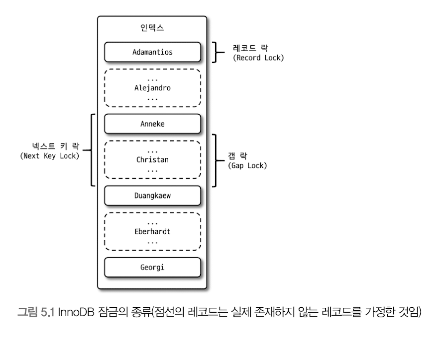

<!-- TOC -->

- [트랜잭션](#%ED%8A%B8%EB%9E%9C%EC%9E%AD%EC%85%98)
- [MySQL 엔진의 잠금](#mysql-%EC%97%94%EC%A7%84%EC%9D%98-%EC%9E%A0%EA%B8%88)
    - [글로벌 락](#%EA%B8%80%EB%A1%9C%EB%B2%8C-%EB%9D%BD)
    - [테이블 락](#%ED%85%8C%EC%9D%B4%EB%B8%94-%EB%9D%BD)
    - [네임드 락](#%EB%84%A4%EC%9E%84%EB%93%9C-%EB%9D%BD)
    - [메타데이터 락](#%EB%A9%94%ED%83%80%EB%8D%B0%EC%9D%B4%ED%84%B0-%EB%9D%BD)
- [InnoDB 스토리지 엔진의 잠금](#innodb-%EC%8A%A4%ED%86%A0%EB%A6%AC%EC%A7%80-%EC%97%94%EC%A7%84%EC%9D%98-%EC%9E%A0%EA%B8%88)
    - [레코드 락](#%EB%A0%88%EC%BD%94%EB%93%9C-%EB%9D%BD)
    - [갭 락과 넥스트 키 락](#%EA%B0%AD-%EB%9D%BD%EA%B3%BC-%EB%84%A5%EC%8A%A4%ED%8A%B8-%ED%82%A4-%EB%9D%BD)

<!-- /TOC -->

> **격리 수준**이라는 것은 하나의 트랜잭션 내에서 또는 여러 트랜잭션 간의 작업 내용을 어떻게 공유하고 차단할 것인지를 결정하는 레벨을 의미한다.

# 트랜잭션

MyISAM에서는 트랜잭션 기능이 지원되지 않아 만약 5건의 데이터를 `INSERT`중 4번째에서 기본키 값 중복이 일어나서 작업이 끝난다면 1,2,3번째 데이터는 `INSERT`가 되어있다.  
이러한 현상을 **부분 업데이트**라고 표현하며 **테이블 데이터의 정합성을 맞추는데 상당히 어렵다.**  
  
**트랜잭션이란 그만큼 애플리케이션 개발에서 고민해야 할 문제를 줄여주는 아주 필수적인 DBMS의 기능이라는 점을 기억해야 한다.**  
트랜잭션 또한 DBMS의 커넥션과 동일하게 꼭 필요한 최소의 코드에만 적용하는 것이 좋다.  
**프로그램의 코드가 데이터베이스 커넥션을 가지고 있는 범위와 트랜잭션이 활성화돼 있는 프로그램의 범위를 최소화 해야한다.**  
  
# MySQL 엔진의 잠금

MySQL의 잠금 처리는 **MySQL 엔진 레벨**과 **스토리지 엔진 레벨**의 두 가지 레이어로 처리된다.  
- MySQL 엔진은 스토리지 엔진을 제외한 나머지 부분으로 이해하면 된다.

MySQL 엔진 레벨의 잠금은 모든 스토리지 엔진에 영향을 미치지만, 
- 테이블 데이터 동기화를 위한 테이블 락 이외에도 테이블의 구조를 잠그는 **메타데이터 락**그리고 사용자의 필요에 맞게 사용할 수 있는 **네임드 락**이라는 잠금 기능도 제공한다.

스토리지 엔진 레벨의 잠금은 스토리지 엔진간 상호 영향을 미치지 않는다.  

## 글로벌 락

`FLUSH TABLES WITH READ LOCK` 명령으로 **MySQL에서 제공하는 가장 범위가 큰 글로벌 락**을 획득할 수 있다.  
한 세션에서 글로벌 락을 획득하면 다른 세션에서 `SELECT`를 제외한 **대부분의 DDL 문장**이나 **DML 문장**을 실행하는 경우 락이 해제될 때까지 대기 상태로 남는다.  
`FLUSH TABLES WITH READ LOCK` 명령 실행과 동시에 MySQL 서버에 존재하는 모든 테이블을 닫고 잠금을 건다.
- 작업 대상 테이블이나 데이터베이스가 다르더라도 MySQL 서버 전체에 영향을 미친다.
- DDL이나 DML을 수행하고 있는 트랜잭션이 있다면 트랜잭션이 끝날 때 까지 기다린다.
  
MySQL 8.0 부터는 조금 더 가벼운 글로벌 락인 **백업 락**이 도입됐다.  
백업 툴들이 실행되는 도중에 스키마가 변경되면 백업이 실패되었지만, 이 실패를 막기 위해 DDL 명령이 실행되면 복제를 일시 중지하는 역할도 한다.  

```sql
LOCK INSTANCE FOR BACKUP;
// 백업 실행
UNLOCK INSTANCE;
```

위와 같이 **백업 락**을 획득하면 모든 세션에서 아래의 명령은 실행할 수 없다.  
1. 데이터베이스 및 테이블 등 모든 객체 생성 및 변경, 삭제
2. [REPAIR TABLE](https://dev.mysql.com/doc/refman/8.0/en/repair-table.html)과 [OPTIMIZE TABLE](https://dev.mysql.com/doc/refman/8.0/en/optimize-table.html) 명령
3. 사용자 관리 및 비밀번호 변경

일반적인 **테이블의 데이터 변경은 허용**된다.  
MySQL 서버의 구성은 **소스 서버**와 **레플리카 서버**로 구성되는데, 주로 백업은 레플리카 서버에서 실행된다.  

## 테이블 락

`명시적` 또는 `묵시적`으로 **테이블 개별 단위로 설정되는 잠금**이다.  
- 명시적 : `LOCK TABLES table_name {READ | WRITE}`, `UNLOCAK TABLES table_name`
- 묵시적
  - MyISAM이나 MEMORY는 데이터를 변경하는 쿼리를 실행하면 발생한다. 데이터가 변경되는 테이블 잠금 설정 → 데이터 변경 → 잠금 해제
  - InnoDB 테이블의 경우 스토리지 엔진 차원에서 **레코드 기반의 잠금을 제공하기 때문에 단순 데이터 변경으로 인해 락이 설정되지는 않는다.** 스키마를 변경하는(DDL)의 경우에만 설정된다.

## 네임드 락

`GET_LOCK()`함수를 이용해 **임의의 문자열에 대해 잠금을 설정**할 수 있다.(뮤텍스가 떠오르는데?)  
이 잠금의 특징은 대상이 테이블이나 레코드 또는 `AUTO_INCREMENT`와 같은 데이터베이스 객체가 아니다.  
네임드 락을 중첩하거나 현재 세션에서 획득한 네임드 락을 한 번에 모두 해제할 수도 있다.  
  
- `SELECT GET_LOCK()` (이미 잠금을 사용중이면 2초만 대기)
- `SELECT IS_FREE_LOCK()`
- `SELECT RELEASE_LOCK()`
- `SELECT RELEASE_ALL_LOCKS()`
  
여러 클라이언트가 상호 동기화를 처리해야할 때 네임드 락을 이용할 수 있다.  
많은 레코드를 변경하는 배치 프로그램은 데드락의 원인이 자주 되는데, 이때 사용할 수 있다.  

## 메타데이터 락

**데이터베이스 객체(테이블이나 뷰 등)의 이름이나 구조를 변경하는 경우에 획득하는 잠금**이다.  
명시적으로 획득하거나 해제할 수 있는 것은 아니고 `RENAME TABLE table_a TO table_b`와 같이 테이블의 이름을 변경할 때 자동으로 획득한다.  
- `RENAME TABLE`의 경우 변경될 이름 두 개 모두 한꺼번에 잠금을 설정한다.  
  
`RENAME TABLE table_a TO table_b, table_c TO table_a`와 같이 두 개의 작업을 한꺼번에 실행할 수 있다.  
따로 작성하게 되면 `table_a`가 존재하지 않는 순간이 생긴다.   
  
로그 테이블의 구조를 변경해야 할 때 MySQL의 [Online DDL](https://dev.mysql.com/doc/refman/5.7/en/innodb-online-ddl.html)을 사용할 수도 있지만, (MySQL의 DDL은 단일 스레드이기 때문에)시간이 너무 오래 걸리는 경우 언두 로그의 증가와 Online DDL이 실행되는 동안 누적되는 Online DDL 버퍼의 크기 등 고민해야 할 문제가 많다.  
- Online DDL 기능은 DDL과 DML을 동시에 지원한다.
- [`당근마켓` MySQL Online-DDL](https://medium.com/daangn/mysql-online-ddl-faf47439084c)
  
1. 새로운 구조의 테이블을 생성하고 먼저 최근의 데이터까지는 프라이머리 키인 `id`값을 범위별로 나눠서 여러 개의 스레드로 빠르게 복사한다.  
   - `id`값을 범위별로 나누어 `INSERT ... SELECE`를 n개로 진행하여 여러 개의 스레드를 사용
   - 압축된 페이지 크기 설정 `KEY_BLOCK_SIZE` ❓
2. autocommit 끄기
3. 작업 대상 테이블 2개에 대해 **테이블 쓰기 락 획득**
   - 다른 세션에서는 이전 로그 테이블과 새로운 테이블은 쓰기를 실행할 수 없다
4. 남은 데이터를 복사하고 커밋한다
   - 다른 세션에서 복사하고 있는 와중 (메타 데이터 락을 소유하고 있을 때)에는 해당 테이블의 수정 요청들은 대기 상태로 전환될 것이다.
5. `RENAME` 명령으로 새로운 테이블을 기존 테이블로 이름을 변경한다
6. 불필요한 테이블 삭제


***

# InnoDB 스토리지 엔진의 잠금

MySQL 엔진에서 제공하는 잠금과는 별개로 **스토리지 엔진 내부에서 레코드 기반의 잠금 방식을 탐재하고 있다.**  
하지만 `이원화된 잠금 처리` 탓에 InnoDB 스토리지 엔진에 사용되는 잠금에 대한 정보는 MySQL 명령을 이용해 접근하기가 상당히 까다롭다.  
- 이원화된 잠금 처리란? **테이블 단위**와 **레코드 단위**의 두 가지 레벨의 잠금을 사용하여 동시성을 향상시키는 방식
  
InnoDB 엔진에서는 **잠금 정보가 상당히 작은 공간으로 관리되기 때문에 `락 에스컬레이션`이 되는 경우는 없다.**  



## 레코드 락

레코드 자체만을 잠그는 것을 의미하며, InnoDB 스토리지 엔진은 **레코드 자체가 아니라 인덱스의 레코드를 잠근다는 점이다.**  
프라이머리 키 또는 유니크 인덱스에 의한 변경 작업은 **갭 (Gap)**에 대해서는 잠그지 않고 **레코드 자체에 대해서만 락을 건다.**  
  
📌 **레코드 자체를 잠그냐와 인덱스를 잠그냐는 상당히 크고 중요한 차이를 만들어낸다.**  

## 갭 락과 넥스트 키 락

InnoDB에서는 대부분 보조 인덱스를 이용한 변경 작업은 **넥스트 키 락** 또는 **갭 락**을 사용한다.  
  
**갭 락**은 레코드 자체가 아니라 **레코드와 바로 인접한 레코드 사이의 간격만을 잠궈 새로운 레코드가 `INSERT` 되는것을 제어하기 위한 락이다.**  
**넥스트 키 락**은 `레코드 키 락` + `갭 락`을 합쳐 놓은 형태의 잠금이다.  
 

