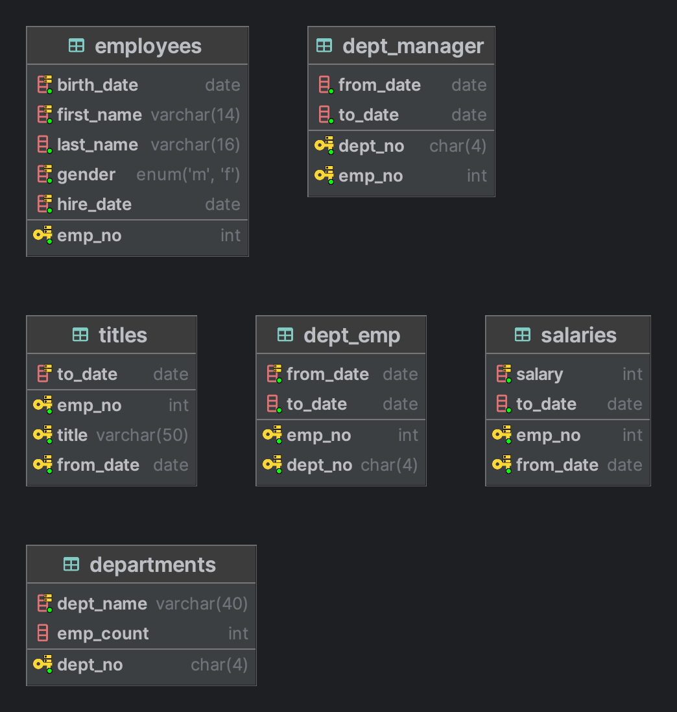

# 실험

1. [Locks Set by Different SQL Statements in InnoDB](https://dev.mysql.com/doc/refman/8.0/en/innodb-locks-set.html)  
2. [Clustered and Secondary Indexes](https://dev.mysql.com/doc/refman/5.7/en/innodb-index-types.html)  
3. [보조 인덱스의 경우 InnoDB가 더 많은 레코드를 차단하는 이유는 무엇입니까?](https://stackoverflow.com/questions/60007863/why-does-innodb-block-more-records-in-case-of-a-secondary-index)  

update시 where 절에 index 컬럼으로 특정 지으면 해당 index에 해당하는 레코드들이 락이 걸리고 update에 해당하는 레코드와 동일한 보조 인덱스의 값들을 가지는 로우들도 모두 락이 걸린다.  
테이블에 인덱스가 없으면 모든 행들이 락이 걸린다.  
where 절에 포함된 최소한의 범위로 락을 잡으려고 한다.  
- 클러스터 인덱스와 보조 인덱스를 같이 where 절에 추가한다면 클러스터 인덱스 기준으로 락을 건다.  

***

```sql
select count(A.ID)
from A_TABLE A
inner join (select *
            from B_TABLE
            where FOLDER_ID = 'bFolder') B
ON A.ID = B.ID
where A.folder_id = 'aFolder'
```

위의 SQL에서 B_TABLE 서브 쿼리는 `*`로 모두 조회하는 것과 원하는 `ID` 컬럼만 조회하는 것의 차이가 있지 않을까?  
모두 조회하면 메모리에 모든 컬럼의 정보들을 올리고 조인을 하는걸까??

# 스키마



```sql
CREATE TABLE `employees` (
  `emp_no` int NOT NULL,
  `birth_date` date NOT NULL,
  `first_name` varchar(14) CHARACTER SET utf8mb4 COLLATE utf8mb4_general_ci NOT NULL,
  `last_name` varchar(16) CHARACTER SET utf8mb4 COLLATE utf8mb4_general_ci NOT NULL,
  `gender` enum('M','F') CHARACTER SET utf8mb4 COLLATE utf8mb4_general_ci NOT NULL,
  `hire_date` date NOT NULL,
  PRIMARY KEY (`emp_no`),
  KEY `ix_hiredate` (`hire_date`),
  KEY `ix_gender_birthdate` (`gender`,`birth_date`),
  KEY `ix_firstname` (`first_name`)
) ENGINE=InnoDB DEFAULT CHARSET=utf8mb4 COLLATE=utf8mb4_general_ci STATS_PERSISTENT=0

CREATE TABLE `dept_emp` (
  `emp_no` int NOT NULL,
  `dept_no` char(4) CHARACTER SET utf8mb4 COLLATE utf8mb4_general_ci NOT NULL,
  `from_date` date NOT NULL,
  `to_date` date NOT NULL,
  PRIMARY KEY (`dept_no`,`emp_no`),
  KEY `ix_fromdate` (`from_date`),
  KEY `ix_empno_fromdate` (`emp_no`,`from_date`)
) ENGINE=InnoDB DEFAULT CHARSET=utf8mb4 COLLATE=utf8mb4_general_ci

CREATE TABLE `departments` (
  `dept_no` char(4) CHARACTER SET utf8mb4 COLLATE utf8mb4_general_ci NOT NULL,
  `dept_name` varchar(40) CHARACTER SET utf8mb4 COLLATE utf8mb4_general_ci NOT NULL,
  `emp_count` int DEFAULT NULL,
  PRIMARY KEY (`dept_no`),
  KEY `ux_deptname` (`dept_name`)
) ENGINE=InnoDB DEFAULT CHARSET=utf8mb4 COLLATE=utf8mb4_general_ci

CREATE TABLE `dept_manager` (
  `dept_no` char(4) CHARACTER SET utf8mb4 COLLATE utf8mb4_general_ci NOT NULL,
  `emp_no` int NOT NULL,
  `from_date` date NOT NULL,
  `to_date` date NOT NULL,
  PRIMARY KEY (`dept_no`,`emp_no`)
) ENGINE=InnoDB DEFAULT CHARSET=utf8mb4 COLLATE=utf8mb4_general_ci

CREATE TABLE `salaries` (
  `emp_no` int NOT NULL,
  `salary` int NOT NULL,
  `from_date` date NOT NULL,
  `to_date` date NOT NULL,
  PRIMARY KEY (`emp_no`,`from_date`),
  KEY `ix_salary` (`salary`)
) ENGINE=InnoDB DEFAULT CHARSET=utf8mb4 COLLATE=utf8mb4_general_ci

CREATE TABLE `titles` (
  `emp_no` int NOT NULL,
  `title` varchar(50) CHARACTER SET utf8mb4 COLLATE utf8mb4_general_ci NOT NULL,
  `from_date` date NOT NULL,
  `to_date` date DEFAULT NULL,
  PRIMARY KEY (`emp_no`,`from_date`,`title`),
  KEY `ix_todate` (`to_date`)
) ENGINE=InnoDB DEFAULT CHARSET=utf8mb4 COLLATE=utf8mb4_general_ci
```