# 메모

1. InnoDB 인덱스를 통해 레코드를 읽을 때는 데이터 파일을 바로 찾아가지 못하고 인덱스에 저장돼 있는 프라이머리 키 값을 이용해 프라이머리 키 인덱스를 한 번 더 검색한 후, 프라이머리 키 인덱스의 리프 페이지에 저장돼 있는 레코드를 읽는다.  
2. 함수나 연산을 수행한 결과로 정렬한다거나 검색하는 작업은 B-Tree의 장점을 이용할 수 없으므로 주의해야 한다.
3. 일반적으로 옵티마이저는 인덱스를 통해 레코드 1건을 읽는 것이 테이블에서 직접 레코드 1건을 읽는 것보다 4~5배 정도 비용이 더 많이 드는 작업인 것으로 예측한다. 리프 노드의 레코드 주소를 통해 레코드를 읽을 때 각 레코드 마다 랜덤 I/O가 필요하기 때문이다.
4. 인덱스 레인지 스캔에서 만약 스캔하다가 리프 노드의 끝까지 읽으면 리프 노드 간의 링크를 이용해 다음 리프 노드를 찾아서 다시 스캔한다.
5. 인덱스 풀 스캔은 인덱스에 포함된 칼럼만으로 쿼리를 처리할 수 있는 경우 테이블의 레코드를 읽을 필요가 없기 때문에 인덱스 레인지 스캔보다는 빠르지 않지만 테이블 풀 스캔 보다는 효율적이다. 인덱스뿐만 아니라 데이터 레코드까지 모두 읽어야 한다면 절대 이 방식으로 처리되지 않는다.
6. 일반적으로 "인덱스를 사용한다" 라는 것은 인덱스 레인지 스캔, 루스 인덱스 스캔을 의미하며 인덱스 풀 스캔 방식으로 인덱스를 사용하는 경우는 "인덱스를 사용하지 못한다", "인덱스를 효율적으로 사용하지 못한다" 라고 한다.
7. 다중 칼럼 인덱스의 정렬 방식은 인덱스의 N번째 키 값은 N-1번째 키값에 대해서 다시 정렬된다.

# 디스크 읽기 방식

SSD 드라이브가 많이 활용되고 있지만, 여전히 데이터 저장 매체는 컴퓨터에서 가장 느린 부분이라는 사실에는 변함이 없다.  
데이터베이스의 성능 튜닝은 **어떻게 디스크 I/O를 줄이느냐**가 관건일 때가 상당히 많다.  

<h3>Random I/O 와 Sequence I/O</h3>

디스크의 헤더를 움직이지 않고 **한 번에 많은 데이터를 읽는 Sequence I/O** 에서는 SSD가 HDD보다 조금 빠르거나 비슷한 성능을 보이기도 한다.  
하지만 SSD의 장점은 **기존 HDD보다 Random I/O가 훨씬 빠르다는 것이다.**  
데이터베이스 서버에서 Sequence I/O 작업은 그다지 비중이 크지 않고 **Random I/O를 통해 작은 데이터를 읽고 쓰는 작업이 대부분** 이므로 SSD는 DBMS용 스토리지에 최적이라고 볼 수 있다.  
  
HDD의 플래터(원판)을 돌려서 읽어야 할 데이터가 저장된 위치로 디스크 헤더를 이동시킨 다음 데이터를 읽는 것을 **Random I/O**라고 한다.  
**Random I/O**는 3개의 페이지를 디스크에 기록하기 위해 `시스템 콜을 세 번 요청`한다. (헤드를 세 번 움직인다.)  
**Sequence I/O** 또한 이 작업과정은 같지만 **Sequence I/O**는 3개의 페이지를 디스크에 기록하기 위해 `시스템 콜을 한 번 요청`하지만, (헤드를 한 번 움직인다.)  
  
디스크의 성능은 디스크 헤더의 위치 이동 없이 얼마나 많은 데이터를 한 번에 기록하느냐에 의해 결정된다고 볼 수 있다.  
그래서 Sequence I/O 작업이 작업 부하가 훨씬 더 크다.  
  
SSD는 Sequence I/O와 Random I/O의 성능 차이가 없을 것으로 예상할 수 있지만 실제로는 Random I/O는 여전히 Sequence I/O 보다 전체 스루풋이 떨어진다.  
  
쿼리를 튜닝해서 Random I/O를 Sequence I/O로 바꿔서 실행할 방법은 그다지 많지 않고, **쿼리 튜닝이란 꼭 필요한 데이터만 읽도록 쿼리를 개선하여 `Random I/O 자체를 줄여주는것이 목적`이다.**  
**인덱스 레인지 스캔**은 데이터를 읽기 위해 주로 `Random I/O`를 사용, **풀 테이블 스캔**은 `Sequence I/O`를 사용하기 때문에,  
Sequence I/O가 Random I/O 보다 훨씬 빨리 많은 레코드를 읽을 수 있기 때문에 **큰 테이블의 레코드 대부분을 읽는 작업에서는 인덱스를 사용하지 않고 풀 테이블 스캔을 사용하도록 유도할 때도 있다.**  
(웹 서비스보다는 데이터 웨어하우스나 통계 작업에서 자주 사용된다.)

> 데이터베이스 대부분의 작업은 이러한 작은 데이터를 빈번히 읽고 쓰기 때문에 MySQL 서버에는 **그룹 커밋**이나 **바이너리 로그 버퍼** 또는 **InnoDB 로그 버퍼** 등의 기능이 내장되어 있다.

# 인덱스란?

데이터베이스 테이블의 모든 데이터를 검색해서 원하는 결과를 가져오려면 시간이 오래 걸린다.  
그래서 **컬럼(또는 컬럼들)의 값과 해당 레코드가 저장된 주소**를 키와 값의 쌍 (key-value pair)으로 삼아 인덱스를 만들어 두는 것이다.  
책의 목차가 `ㄱ,ㄴ,ㄷ..`순으로 되듯이, 인덱스도 마찬가지로 **컬럼의 값을 주어진 순서로 미리 정렬해서 보관한다.**  
  
DBMS의 인덱스도 항상 정렬된 상태를 유지한다.  
자료구조에 비교하자면 저장되는 값을 항상 정렬된 상태로 유지하는 자료 구조인 `SortedList`가 **DBMS의 인덱스과 같은 자료구조 이다.**  
이미 정렬이 되어 있어 원하는 값을 아주 빨리 찾아오지만, **저장될때마다 항상 값을 정렬해야 하므로 과정이 복잡하고 느리다.**  
  
> DBMS에서 인덱스는 데이터의 저장 (INSERT, UPDATE, DELETE) 성능을 희생하고 **데이터의 읽기 속도를 높이는 기능**이다.  
> 테이블에서 인덱스를 하나 더 추가할지 말지는 데이터의 저장 속도를 어디까지 희생할 수 있는지, 읽기 속도를 얼마나 더 빠르게 만들어야 하느냐에 따라 결정해야 한다.  
  
인덱스는 **데이터를 관리하는 방식(알고리즘)** 과 **중복 값의 허용 여부** 등에 따라 여러 가지로 나눠볼 수 있다.  
프라이머리 키를 제외한 나머지 모든 인덱스는 **세컨더리 인덱스**로 분류한다.  
유니크 인덱스는 프라이머리 키와 성격이 비슷하고 프라이머리 키를 대체해서 사용할 수도 있다고 해서 `대체 키`라고도 하고 세컨더리 인덱스로 분류하기도 한다.  
  
여기서 중복 값의 허용 여부 (유니크 인덱스)는 단순히 같은 값이 1개만 존재하는지, 1개 이상 존재할 수 있는지를 의미하지만, **실제 DBMS의 쿼리를 실행해야 하는 옵티마이저에게는 상당히 중요한 문제다.**  
유니크 인덱스로 인한 MySQL 처리 방식의 변화나 차이점이 상당히 많다. 대표적으로 **B-Tree 인덱스**와 **Hash 인덱스**로 구분할 수 있다.  
(이러한 부분은 **인덱스** 와 **쿼리의 실행 계획** 을 학습하면서 유념해야 한다.)  
  
최근에는 **Fractal-Tree 인덱스**나 로그 기반의 **Merge-Tree 인덱스**와 같은 알고리즘을 사용하는 DBMS도 개발되고 있다.
  
## B-Tree 인덱스

> `B-Tree 알고리즘`은 가장 일반적으로 사용되는 인덱스 알고리즘으로서, 오래된 만큼 성숙해진 상태다.  
> **컬럼의 값을 변형하지 않고 원래의 값을 이용해 인덱싱하는 알고리즘**이다.  
> 일반적으로 DBMS에서는 주로 `B+-Tree` 또는 `B*-Tree`가 사용된다.  
> `B-Tree`의 B는 binary가 아니라 balanced를 의미한다.

`B-Tree`는 컬럼의 원래 값을 변형시키지 않고 (물론 값의 앞부분만 잘라서 관리하기는 하지만) 인덱스 구조체 내에서는 **항상 정렬된 상태로 유지**한다.  
기본적인 구조는 **트리 구조의 최상위에 하나의 "루트 노드"가 존재하고 그 하위에 자식 노드가 붙어 있는 형태다**.  
  
데이터베이스에서 인덱스와 실제 데이터가 저장된 데이터는 따로 관리되는데, **인덱스의 리프노드는 항상 실제 데이터 레코드를 찾아가기위한 주솟값을 가지고 있다.**  
리프 노드는 테이블의 키 컬럼만 가지고 있으므로 나머지 컬럼을 읽으려면 데이터 파일에서 해당 레코드를 찾아야한다. 노드들은 페이지 단위이다.  

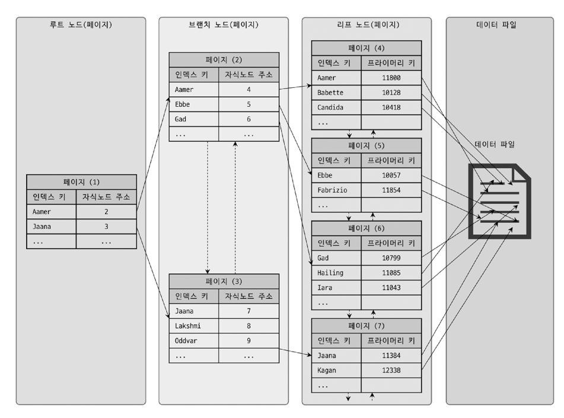

InnoDB 스토리지 엔진을 사용하는 테이블에서는 **프라이머리 키가 ROWID의 역할을 한다.**  
인덱스의 키 값은 모두 정렬돼 있지만 데이터 파일의 레코드는 정렬돼 있지 않고 임의의 순서로 저장돼 있다.  

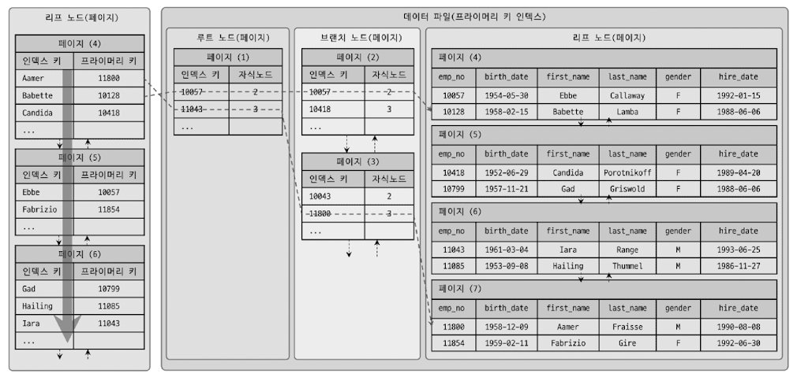

InnoDB 테이블에서는 인덱스를 통해 레코드를 읽을 때는 실제 데이터를 바로 찾아가지 못 한다. (MyISAM은 세컨더리 인덱스가 물리적인 주소를 가진다.)  
**인덱스에 저장돼 있는 프라이머리 키 값을 이용하여 검색한 후 프라이머리 키 인덱스의 리프 페이지에 저장돼 있는 레코드를 읽는다.**  
프라이머리 키가 ROWID의 역할을 하기 때문에 InnoDB 테이블에서 인덱스를 통해 레코드를 읽을 때는 데이터 파일을 바로 찾아가지 못한다.  
InnoDB 인덱스를 통해 레코드를 읽을 때는 데이터 파일을 바로 찾아가지 못하고 **인덱스에 저장돼 있는 프라이머리 키 값을 이용해 프라이머리 키 인덱스를 한 번 더 검색한 후, 프라이머리 키 인덱스의 리프 페이지에 저장돼 있는 레코드를 읽는다.**  
  
즉, 모든 세컨더리 인덱스 검색에서 데이터 레코드를 읽기 위해서는 반드시 프라이머리 키를 저장하고 있는 B-Tree를 다시 한번 검색해야 한다.  

<h3>인덱스 키 추가</h3>

테이블의 레코드를 저장하거나 변경하는 경우 인덱스 키 추가나 삭제 작업이 발생한다.  
B-Tree에 저장될 때는 저장될 키 값을 이용해 B-Tree상의 적절한 위치를 검색해야 한다.  
저장될 위치가 결정되면 레코드의 키 값과 대상 레코드의 주소 정보를 B-Tree의 리프 노드에 저장한다.  
리프 노드가 꽉 차서 더는 저장할 수 없을 때는 리프노드가 분리돼야 한다. **이때 상위 브랜치 노드까지 처리의 범위가 넓어져 상대적으로 쓰기 작업(새로운 키를 추가하는 작업)에 비용이 많이 드는 것으로 알려져 있다.**  
  
그래서 변경해야 할 인덱스 페이지가 버퍼 풀에 존재하지 않고 디스크에서 읽어와서 업데이트 해야한다면 이를 모아놓고 나중에 처리하도록 "체인지 버퍼"를 사용하기도 한다.  
하지만 사용자에게 결과를 전달하기 전에 반드시 중복 여부를 체크해야하는 프라이머리 키나 유니크 인덱스의 경우 즉시 B-Tree에 추가하거나 삭제한다.  

<h3>인덱스 키 삭제</h3>

키 값이 삭제되는 경우는 간단하다.  
해당 키 값이 저장된 B-Tree의 리프 노드를 찾아서 그냥 삭제 마크만 하면 작업이 완료된다.  
이렇게 삭제 마킹된 인덱스 키 공간은 계속 그대로 방치하거나 재활용할 수 있다.  
하지만 삭제 마킹을 하는 작업도 디스크 I/O 작업이 필요하기 때문에 버퍼링되어 지연처리 될 수 있다.  

<h3>인덱스 키 변경</h3>

인덱스의 키 값은 그 값에 따라 저장될 리프 노드의 위치가 결정되므로 B-Tree의 키 값이 변경되는 경우에는 단순히 인덱스 상의 키 값만 변경하는 것은 불가능하다.  
**B-Tree의 키 값 변경 작업은 먼저 키 값을 삭제한 후, 다시 새로운 키 값을 추가하는 형태로 처리된다.**  

<h3>인덱스 키 검색</h3>

INSERT, UPDATE, DELETE 작업을 할 때 인덱스 관리에 따르는 추가 비용을 감당하면서 인덱스를 구축하는 이유는 바로 빠른 검색을 위해서다.  
인덱스를 검색하는 작업은 B-Tree의 루트 노드부터 시작해 브랜치 노드를 거쳐 최종 리프 노드까지 이동하면서 비교 작업을 수행하는데, 이 과정을 **"트리 탐색"** 이라고 한다.  
  
**B-Tree 인덱스를 이용한 검색은 100%일치 또는 값의 앞부분(Left-most part)만 일치하는 경우에 사용할 수 있다.**  
부등호 비교 조건에서도 인덱스를 활용할 수 있지만, 인덱스를 구성하는 키 값의 뒷부분만 검색하는 용도로는 인덱스를 사용할 수 없다.  
또한 **인덱스의 키 값에 변형이 가해진 후 비교되는 경우에는 절대 B-Tree의 빠른 검색 기능을 사용할 수 없다는 것이다.**  
이미 변형된 값은 B-Tree에 존재하는 값이 아니므로, **함수나 연산을 수행한 결과로 정렬한다거나 검색하는 작업은 B-Tree의 장점을 이용할 수 없으므로 주의해야 한다.**  

```sql
# 인덱스를 탄다.
SELECT * FROM tbl_name WHERE key_col LIKE 'Patrick%';
SELECT * FROM tbl_name WHERE key_col LIKE 'Pat%_ck%';

# 인덱스를 안탄다.
SELECT * FROM tbl_name WHERE key_col LIKE '%Patrick%';
SELECT * FROM tbl_name WHERE key_col LIKE other_col;
```

[Comparison of B-Tree and Hash Indexes](https://dev.mysql.com/doc/refman/8.0/en/index-btree-hash.html#btree-index-characteristics)  
  
> **InnoDB 스토리지 엔진에서 인덱스는 더 특별한 의미가 있다.**  
> 레코드 잠금이나 넥스트 키 락(갭 락)이 검색을 수행한 인덱스를 잠근 후 테이블의 레코드를 잠그는 방식으로 구현돼 있다.  
> 따라서 UPDATE나 DELETE 문장이 실행될 때 테이블에 적절히 사용될 수 있는 인덱스가 없으면 불필요하게 많은 레코드를 잠군다.  
> 심지어 테이블의 모든 레코드를 잠글 수도 있기 때문에 인덱스의 설계가 중요하고 많은 부분에 영향을 미친다.

## B-Tree 인덱스 사용에 영향을 미치는 요소

B-Tree 인덱스는 인덱스를 구성하는 컬럼의 크기와 레코드의 건수, 그리고 유니크한 인덱스 키 값의 개수 등에 의해 검색이나 변경 작엉의 성능이 영향을 받는다.  

<h3>인덱스 키 값의 크기</h3>

디스크에 데이터를 저장하는 가장 기본 단위를 페이지 또는 블록이라고 하며, 디스크의 모든 읽기 및 쓰기 작업의 최소 작업 단위가 된다.  
또한 페이지는 버퍼 풀에서 데이터를 버퍼링하는 기본 단위이기도 하다. **인덱스도 결국은 페이지 단위로 관리된다.**  
  
B-Tree 인덱스의 자식 노드 개수는 인덱스의 페이지 크기와 키 값의 크기에 따라 결정된다.  
인덱스의 키가 16바이트 라고 가정하고, 자식 노드 주소는 12바이트로 구성된다고 가정하면 아래와 같다.  

```
        인덱스 페이지
+-------------+-------------+
| 123__ABCD__ | 자식 노드 주소 |
+-------------+-------------+
| 123__ABCE__ | 자식 노드 주소 |
+-------------+-------------+
| 123__ABCF__ | 자식 노드 주소 |
+-------------+-------------+
<-------------><------------>
  16(8+8) 바이트    12 바이트
```

하나의 인덱스 페이지가 16KB라면 몇 개의 키를 저장할 수 있을까? 계산해 보면 (16 * 1024 / (16 + 12)) = 585개를 저장할 수 있다.  
최종적으로 이 경우는 자식 노드를 585개를 가질 수 있는 B-Tree가 되는 것이다.  
이 경우에서 키 값의 크기가 32바이트로 늘어났다고 가정하면 한 페이지에 인덱스 키를 (32 * 1024 / (32 + 12)) = 372개 저장할 수 있다.  
  
SELECT 쿼리가 레코드 500개를 읽어야 한다면 전자는 인덱스 페이지 한 번으로 해결될 수도 있지만, 후자는 최소 2번 이상 디스크로부터 읽어야 한다.  
결국 **인덱스를 구성하는 키 값의 크기가 커지면 디스크로부터 읽어야 하는 횟수가 늘어나고, 그만큼 느려진다는 것을 의미한다.**  
  
인덱스를 캐시해두는 InnoDB의 버퍼 풀의 캐시 영역은 크기가 제한적이기 때문에 하나의 레코드를 위한 인덱스 크기가 커지면 커질수록 메모리에 캐시 해둘 수 있는 레코드 수는 줄어든다.  
그렇게 되면 자연히 메모리의 효율이 떨어지는 결과를 가져온다.  

<h3>B-Tree 깊이</h3>

B-Tree 인덱스의 깊이는 상당히 중요하지만 직접 제어할 방법은 없다.  
만약 B-Tree의 깊이가 3이고 키 값이 16바이트인 경우에는 최대 2억 (585 * 585 * 585)개 정도의 키 값을 담을 수 있지만,  
키 값이 32바이트로 늘어나면 5천만 (372 * 372 * 372)개로 줄어든다.  
  
**B-Tree의 깊이는 MySQL에서 값을 검색할 때 몇 번이나 랜덤하게 디스크를 읽어야 하는지와 직결되는 문제다.**  

> 결론적으로 인덱스 키 값의 크기가 커지면 커질수록 하나의 인덱스 페이지가 담을 수 있는 인덱스 키 값의 개수가 적어지고,  
> 그 때문에 같은 레코드 건수라 하더라도 B-Tree의 깊이가 깊어져서 디스크 읽기가 더 많이 필요하다.  

<h3>선택도(기수성)</h3>

인덱스에서 선택도(Selectivity) 또는 기수성(Cardinality)은 거의 같은 의미로 사용되며, **모든 인덱스 키 값 가운데 유니크한 값의 수를 의미한다.**  
전체 인덱스 키 값은 100개인데, 그중에서 유니크한 값의 수는 10개라면 기수성은 10이다.  
**인덱스는 선택도가 높을수록 검색 대상이 줄어들기 때문에 그만큼 빠르게 처리된다.**  
  
> 선택도가 좋지 않다고 하더라도 정렬이나 그루핑과 같은 작업을 위해 인덱스를 만드는 것이 훨씬 나은 경우도 많다.  
> **인덱스가 항상 검색에만 사용되는 것은 아니므로 여러 가지 용도를 고려해 적절히 인덱스를 설계할 필요가 있다.**

```sql
-- 총 1만건의 레코드
-- country 컬럼은 INDEX로 지정

select * 
from tb_test
where country='KOREA' AND city='SEOUL';
```

- **country 컬럼의 유니크 값이 10개일 때**
  - 대략 KOREA에 해당하는 레코드는 1000건으로 볼 수 있다.
  - 그리고 SEOUL에 해당하는 레코드는 1건이다. 그렇다면 이 1건을 읽기 위해 999건을 불필요하게 읽은 것으로 볼 수 있다.
- **country 컬럼의 유니크 값이 1000개일 때**
  - 대략 KOREA에 해당하는 레코드는 10건으로 볼 수 있다.
  - 그리고 SEOUL에 해당하는 레코드는 1건이다. 그렇다면 이 1건을 읽기 위해 9건을 불필요하게 읽은 것으로 볼 수 있다.

두 가지 경우에 발생하는 차이는 크다는 것을 알 수 있다. **이처럼 인덱스에 유니크한 값의 개수는 인덱스나 쿼리의 효율성에 큰 영향을 미친다.**  

<h3>읽어야 하는 레코드의 건수</h3>

인덱스를 통해 테이블의 레코드를 읽는 것은 인덱스를 거치지 않고 바로 테이블의 레코드를 읽는 것보다 높은 비용이 드는 작업이다.  
테이블에 레코드가 100만건이 저장되어 있을 때 50만 건을 읽어야 한다고 가정해보자.  

1. 전체 테이블을 모두 읽어서 필요하는 50만 건을 버릴지
2. 인덱스를 통해 필요한 50만 건만 읽을지

중요한 점은 **인덱스를 이용한 읽기의 손익 분기점이 얼마인지 판단하는 것이다.**  
일반적으로 옵티마이저는 인덱스를 통해 레코드 1건을 읽는 것이 테이블에서 직접 레코드 1건을 읽는 것보다 4~5배 정도 비용이 더 많이 드는 작업인 것으로 예측한다.  
즉, **인덱스를 통해 읽어야 할 레코드의 건수(옵티마이저가 판단한 예상 건수)가 전체 테이블 레코드의 20~25%를 넘어서면 인덱스를 이용하지 않고 테이블을 모두 직접 읽어서 필요한 레코드만 가려내는 방식(필터링)으로 처리하는 것이 효율적이다.**  
  
물론 이러한 작업은 MySQL의 옵티마이저가 기본적으로 힌트를 무시하고 테이블을 직접 읽는 방식으로 처리하겠지만 기본으로 알고 있어야 할 사항이다.  

## B-Tree 인덱스를 통한 데이터 읽기

어떤 경우에 인덱스를 사용하게 유도할지, 또는 사용하지 못하게 할지 판단하려면 **어떻게 인덱스를 경유해서 실제 레코드를 읽어 내는지 알아야 한다.**  

### 인덱스 레인지 스캔

인덱스의 접근 방법 가운데 대표적인 접근 방식으로, 뒤에서 설명할 나머지 두 가지 접근 방식보다는 빠른 방법이다.  
인덱스 레인지 스캔은 **검색해야 할 인덱스의 범위가 결정됐을 때 사용하는 방식이다.**  
(검색하려는 값의 수나 검색 결과 레코드 건수와 관계없이 레인지 스캔이라고 표현한다.)  


```sql
select * from employees where first_name between 'Ebbe' and 'Gad';
```

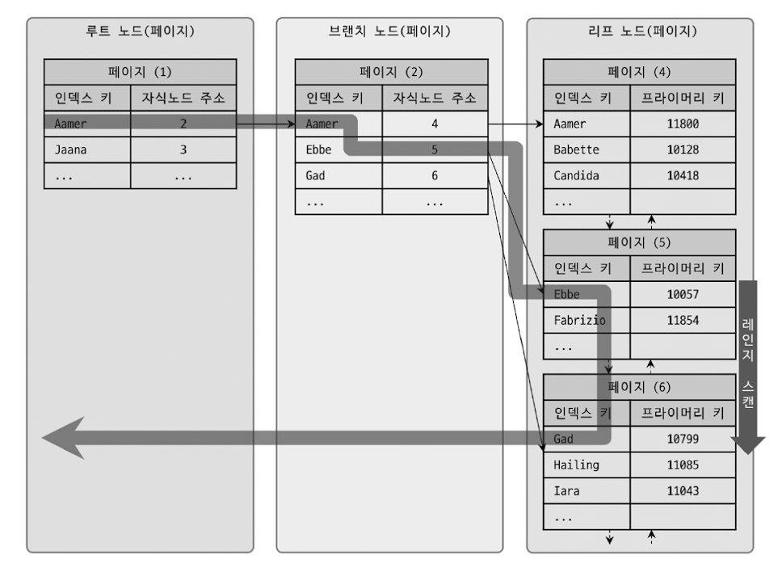

인덱스 B-Tree의 필요한 영역을 스캔하기 위해 루트 노드에서부터 비교를 시작해 브랜치 노드를 거치고 최종적으로 리프노드까지 찾아 들어가야만 필요한 레코드의 시작 지점을 찾을 수 있다.  
**시작해야 할 위치를 찾으면 그때부터는 리프 노드의 레코드만 순서대로 읽으면 된다.**  
만약 스캔하다가 리프 노드의 끝까지 읽으면 리프 노드 간의 링크를 이용해 다음 리프 노드를 찾아서 다시 스캔한다.  
  
하지만 B-Tree 인덱스의 리프 노드를 스캔하면서 실제 데이터 파일의 레코드를 읽어와야 하는 경우도 있다.  

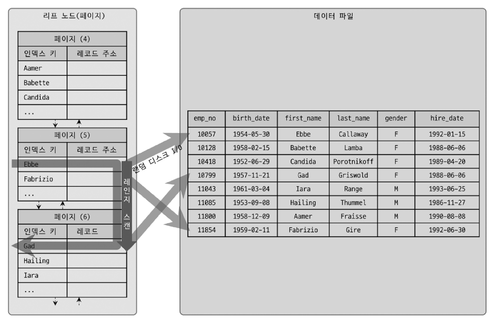

루트와 브랜치 노드를 이용해 스캔 시작 위치를 검색하고, 그 지점부터 필요한 방향(오름차순 또는 내림차순)으로 인덱스를 읽어 나가는 과정을 위의 이미지에서 확인할 수 있다.  
중요한것은 **어떤 방식으로 스캔하든 해당 인덱스를 구성하는 컬럼의 정순 또는 역순으로 정렬된 상태로 레코드를 가져온다는 것이다.**  
이는 별도의 정렬 과정이 수반되는 것이 아니라 인덱스 자체의 정렬 특성 때문에 자동으로 그렇게 된다.  
또 중요한 점은 리프 노드에 저장된 레코드 주소로 데이터 파일의 레코드를 읽어올 때, 각 레코드마다 랜덤 I/O가 필요한 것이다.  
그래서 **인덱스를 통해 레코드를 읽는 작업은 비용이 많이 드는 작업으로 분류된다.**  

> **처리 흐름**  
> 1. 인덱스에서 조건을 만족하는 값이 저장된 위치를 찾는다. 이 과정을 **인덱스 탐색 (index seek)** 이라고 한다.
> 2. 1번에서 탐색된 위치부터 필요한 만큼 인덱스를 차례대로 쭉 읽는다. 이 과정을 **인덱스 스캔 (index scan)** 이라고 한다. (1,2번 합쳐서 인덱스 스캔이라고도 한다.)
> 3. 2번에서 읽어 들인 인덱스 키와 레코드 주소를 이용해 레코드가 저장된 페이지를 가져오고, 최종 레코드를 읽어온다.
  
쿼리가 필요로 하는 데이터에 따라 3번 과정은 필요하지 않을 수도 있는데, 이를 **커버링 인덱스** 라고 한다.  
**커버링 인덱스로 처리되는 쿼리는 디스크의 레코드를 읽지 않아도 되기 때문에 랜덤 읽기가 상당히 줄어들고 성능은 그만큼 빨라진다.**  
1번과 2번이 실행된 횟수를 확인할 수도 있다. [Server Status Variables `Handler_%`](https://dev.mysql.com/doc/refman/8.0/en/server-status-variables.html)

> 쿼리에서 검색한 모든 열을 포함하는 인덱스입니다. 쿼리는 인덱스 값을 포인터로 사용하여 전체 테이블 행을 찾는 대신 인덱스 구조에서 값을 반환하므로 디스크 I/O를 절약할 수 있습니다.  
> InnoDB 보조 인덱스에는 기본 키 열도 포함되므로 InnoDB는 이 최적화 기법을 MyISAM보다 더 많은 인덱스에 적용할 수 있습니다.  
> InnoDB는 트랜잭션에 의해 수정된 테이블에 대한 쿼리에는 해당 트랜잭션이 종료될 때까지 이 기술을 적용할 수 없습니다.  
> 올바른 쿼리가 주어지면 모든 열 인덱스 또는 복합 인덱스가 커버링 인덱스 역할을 할 수 있습니다. 가능한 경우 이 최적화 기법을 활용할 수 있도록 인덱스와 쿼리를 설계하세요.  
> [Covering Index](https://dev.mysql.com/doc/refman/8.0/en/glossary.html#glos_covering_index)

### 인덱스 풀 스캔

인덱스를 사용하지만 인덱스 레인지 스캔과는 달리 **인덱스의 처음부터 끝까지 모두 읽는 방식을 인덱스 풀 스캔이라고 한다.**  
대표적으로 쿼리의 조건절에 사용된 칼럼이 인덱스의 첫 번째 칼럼이 아닌 경우 인덱스 풀 스캔 방식이 사용된다.  
예를 들어, 인덱스는 `(A , B , C)` 칼럼의 순서로 만들어져 있지만 쿼리의 조건절은 B 또는 C가 사용된 경우다.  
  
일반적으로 인덱스의 크기는 테이블의 크기보다 작으므로 직접 테이블을 처음부터 끝까지 읽는 것보다는 인덱스만 읽는 것이 효율적이다.  
**쿼리가 인덱스에 명시된 컬럼만으로 조건을 처리할 수 있는 경우 주로 이 방식이 사용된다.**  
(인덱스뿐만 아니라 데이터 레코드까지 모두 읽어야 한다면 절대 이 방식으로 처리되지 않는다.)  

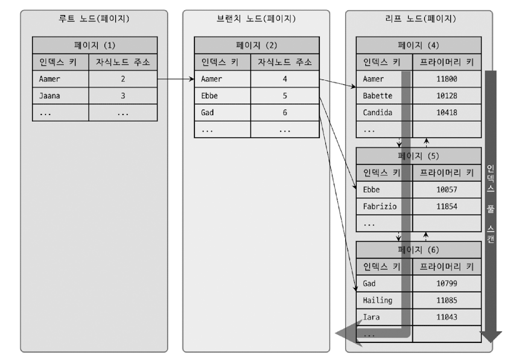

먼저 인덱스 리프 노드의 제일 앞 또는 제일 뒤로 이동한 후, 인덱스의 리프 노드를 연결하는 링크드 리스트를 따라서 처음부터 끝까지 스캔하는 방식을 인덱스 풀 스캔이라고 한다.  
**인덱스에 포함된 칼럼만으로 쿼리를 처리할 수 있는 경우 테이블의 레코드를 읽을 필요가 없기 때문에 인덱스 레인지 스캔보다는 빠르지 않지만 테이블 풀 스캔 보다는 효율적이다.**  

### 루스 인덱스 스캔

앞에서 소개한 두 가지 접근 방법은 루스 인덱스 스캔과 상반된 의미에서 타이트 인덱스 스캔(Tight Index Scan)으로 분류한다.  
**루스 인덱스 스캔이란 말 그대로 느슨하게 또는 듬성듬성하게 인덱스를 읽는 것을 의미한다.**  
  
인덱스 레인지 스캔과 비슷하게 작동하지만 **중간에 필요치 않은 인덱스 키 값은 무시(SKIP)하고 다음으로 넘어가는 형태로 처리한다.**  
일반적으로 `GROUP BY` 또는 집합 함수 가운데 `MAX()`,`MIN()` 함수에 대해 최적화를 하는 경우에 사용된다.  

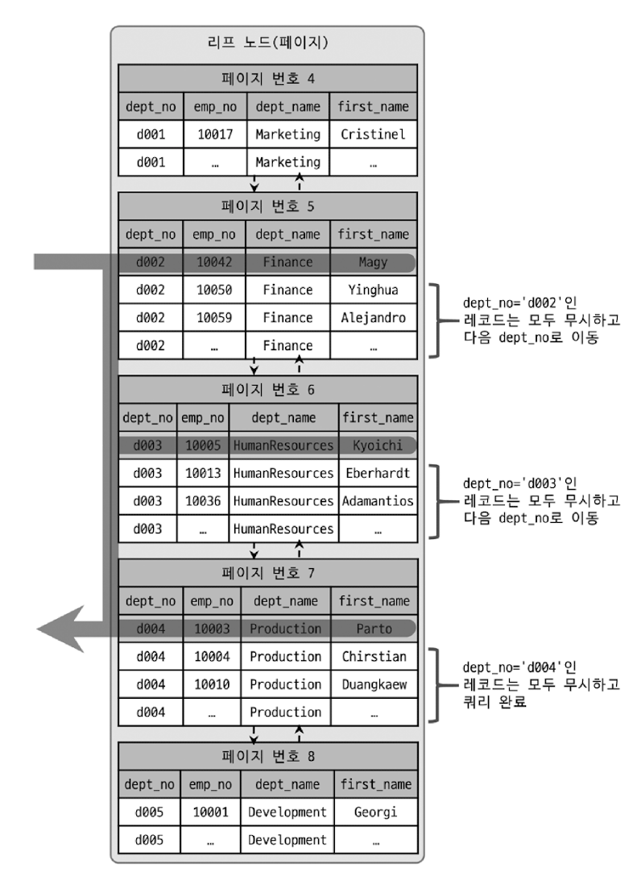

```sql
-- dept_no, emp_no로 인덱스가 존재하는 상태
select dept_no, min(emp_no)   
from dept_emp
where dept_no between 'd002' and 'd004'
group by dept_no;
```

`(dept_no , emp_no)`로 인덱스가 존재하기 때문에 정렬도 이미 되어있기 때문에 dept_no 그룹 별로 첫 번째 레코드의 emp_no 값만 읽으면 된다.  
즉, 인덱스에서 WHERE 조건을 만족하는 범위 전체를 다 스캔할 필요가 없다는 것을 옵티마이저는 알고 있기 때문에 조건에 만족하지 않은 레코드는 무시하고 다음 레코드로 이동한다.  
- 루스 인덱스 스캔을 사용하려면 여러 가지 조건을 만족해야 한다. 조건은 10장에서 언급된다.

### 인덱스 스킵 스캔

인덱스의 핵심은 값이 정렬돼 있다는 것이며, 이로 인해 **인덱스를 구성하는 컬럼의 순서가 매우 중요하다.**  

```sql
ALTER TABLE employees ADD INDEX ix_gender_birthdate (gender, birth_date);
```

위와 같은 인덱스를 사용하려면 WHERE 조건절에 gender 칼럼에 대한 비교 조건이 필수다.  
```sql
-- 인덱스를 사용하지 못하는 쿼리
-- 이 경우에는 birth_date 컬럼부터 시작하는 인덱스를 새로 생성해야만 했다.
select gender, birth_date from employees where birth_date >= '1965-02-01';

-- 인덱스를 사용할 수 있는 쿼리 
select gender, birth_date from employees where gender='M' and birth_date >= '1965-02-01';
```

MySQL 8.0 버전부터는 옵티마이저가 gender컬럼을 건너뛰어서 birth_date 컬럼만으로도 인덱스 검색이 가능하게 해주는 **인덱스 스킵 스캔** 최적화 기능이 도입됐다.  
(루스 인덱스 스캔은 GROUP BY와 같은 작업을 처리하기 위한 인덱스를 사용하는 경우에만 적용할 수 있었다.)  
**인덱스 스킵 스캔은 WHERE 조건절의 검색을 위해 사용 가능하도록 용도가 훨씬 넓어진 것이다.**  

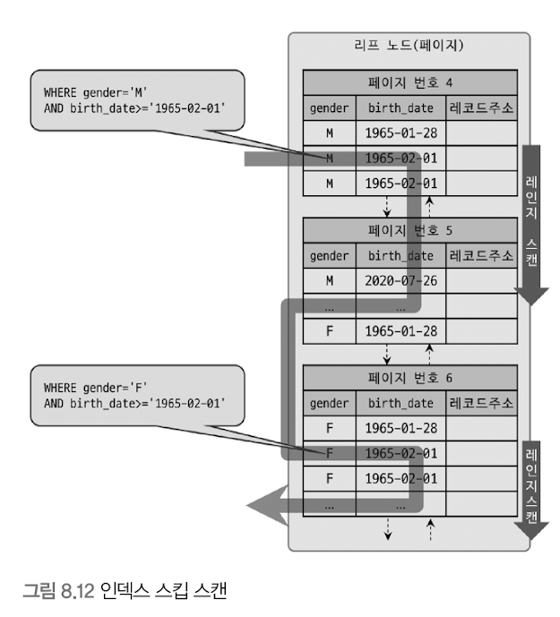

gender가 조건절에 작성되어 있지 않아도 **옵티마이저는 gender 컬럼에서 유니크한 값을 모두 조회해서 주어진 쿼리에 gender 컬럼의 조건을 추가해서 쿼리를 다시 실행하는 형태로 처리한다.**  
인덱스 스킵 스캔이 활성화되어 있다면 실행 계획에서 `type : range`, `Extra : Using index for skip scan`를 확인할 수 있다.  
  
하지만 단점도 있다.
1. WHERE 조건절에 조건이 없는 인덱스의 선행 칼럼의 유니크한 값의 개수가 적어야 한다.
2. 쿼리가 인덱스에 존재하는 칼럼만으로 처리 가능해야 함(커버링 인덱스)

유니크한 값의 개수가 많으면 옵티마이저가 인덱스에서 스캔해야 할 시작 지점을 검색하는 작업이 많이 필요해진다.

### 다중 칼럼 인덱스

실무에서 2개 이상의 컬럼을 포함하는 인덱스가 더 많이 사용된다.  
두 개 이상의 컬럼으로 구성된 인덱스를 **다중 칼럼 인덱스** 또는 **복합 칼럼 인덱스** 라고 하며, 또한 2개 이상의 칼럼이 연결됐다고 해서 **Concatenated Index** 라고도 한다.  

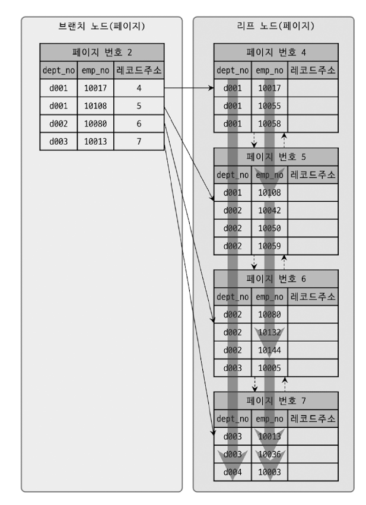

위의 이미지를 보면 인덱스의 두 번째 컬럼은 첫 번째 컬럼에 의존해서 정렬돼 있다.  
즉, **두 번째 컬럼의 정렬은 첫 번째 컬럼이 똑같은 레코드에서만 의미가 있다는 것이다.**  
맨 마지막 레코드의 emp_no는 10003이지만, dept_no가 d004이기 때문에 마지막에 위치하는 것을 보면 알 수 있다.  
  
> **다중 컬럼 인덱스에서는 인덱스 내에서 각 컬럼의 위치(순서)가 상당히 중요하며, 그것을 아주 신중히 결정해야 하는 이유가 바로 그것이다.**

### B-Tree 인덱스의 정렬 및 스캔 방향

인덱스를 생성할 때 설정한 정렬 규칙에 따라서 인덱스의 키 값은 항상 오름차순이거나 내림차순으로 정렬되어 저장된다.  
그렇다고 인덱스가 생성될 때 정해진 정렬 방법으로만 읽을 수 있는 것은 아니다.  
**인덱스를 어느 방향으로 읽을지는 쿼리에 따라 옵티마이저가 실시간으로 만들어내는 실행 계획에 따라 결정된다.**  
  
<h3>인덱스의 정렬</h3>

인덱스를 생성하는 시점에 인덱스를 구성하는 각 컬럼의 정렬을 오름차순 또는 내림차순으로 설정할 수 있다.  

```sql
CREATE INDEX ix_teamname_userscore ON employees (team_name ASC, user_score DESC);
```

<h3>인덱스 스캔 방향</h3>

```sql
SELECT *
FROM employees
ORDER BY first_name DESC
LIMIT 1;
```

first_name의 오름차순 인덱스가 있는 상황에서 위의 쿼리는 인덱스를 처음부터 오름차순으로 끝까지 읽어서 마지막 레코드 하나를 가져오지 않는다.  
**옵티마이저는 인덱스를 역순으로 접근해 첫 번째 레코드만 읽으면 된다는 것을 이미 알고있다.**  

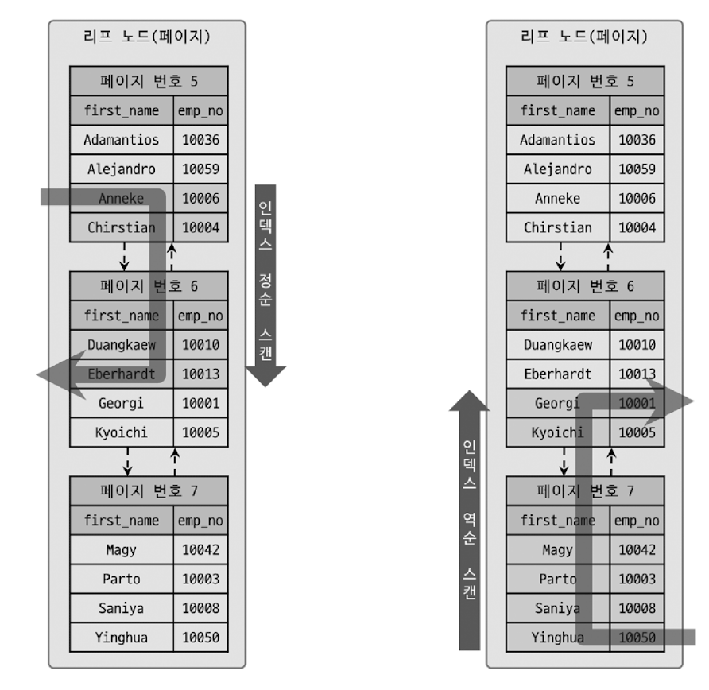

**인덱스 생성 시점에 인덱스의 정렬이 결정되지만 그 인덱스를 사용하는 시점에 인덱스를 읽는 방향에 따라 정렬 효과를 얻을 수 있다.**  

<h3>내림차순 인덱스</h3>

만약 first_name 컬럼을 역순으로 정렬하는 요건만 있다면 다음 2개 인덱스 중에서 어떤 것을 선택하는 것이 좋을까?  

```sql
CREATE INDEX ix_firstname_asc  ON employees (first_name ASC);
CREATE INDEX ix_firstname_desc ON employees (first_name DESC);
```

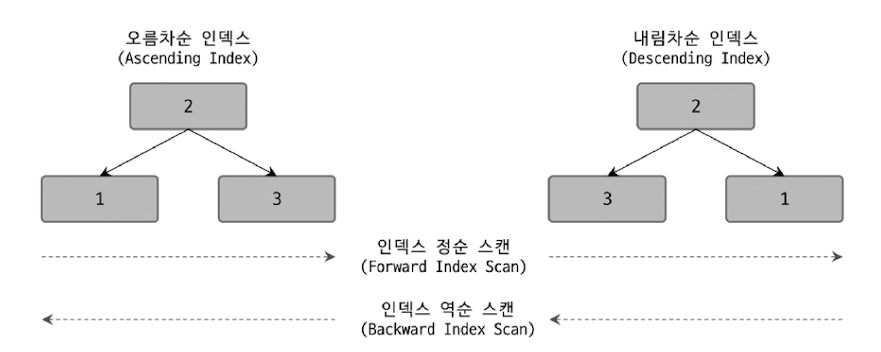

- 오름차순 인덱스 (Ascending Index) : 작은 값의 인덱스 키가 B-Tree의 왼쪽으로 정렬된 인덱스
- 내림차순 인덱스 (Descending Index) : 큰 값의 인덱스 키가 B-Tree의 왼쪽으로 정렬된 인덱스
- 인덱스 정순 스캔 (Forward Index Scan) : 인덱스 키의 크고 작음에 관계없이 인덱스 리프 노드의 왼쪽 페이지부터 오른쪽으로 스캔
- 인덱스 역순 스캔 (Backward Index Scan) : 인덱스 키의 크고 작음에 관계없이 인덱스 리프 노드의 오른쪽 페이지부터 왼쪽으로 스캔

```sql
select count(*) from t1;
+----------+
| count(*) |
+----------+
| 21811200 |
+----------+
-- 오름차순 기본 키인 tid 기준
-- 정순 스캔으로 tid 컬럼의 값이 가장 큰 레코드 1건 반환 
mysql> SELECT * FROM t1 ORDER BY tid ASC limit 21811199, 1;
1 row in set (4.42 sec)

-- 역순 스캔으로 tid 컬럼의 값이 가장 작은 레코드 1건 반환
mysql> SELECT * FROM t1 ORDER BY tid DESC limit 21811199, 1;
1 row in set (5.47 sec)
```

InnoDB 스토리지 엔진에서 정순 스캔과 역순 스캔의 차이는 **페이지간의 양방향 연결 고리를 통해 전진(Forward)하느냐 후진(Backward)하느냐의 차이만 있지만** , 내부적으로는 인덱스 역순 스캔이 정순 스캔에 비해 느릴 수 밖에 없는 이유가 있다.  

1. **페이지 잠금이 인덱스 정순 스캔에 적합한 구조**
2. **페이지 내에서 인덱스 레코드가 단방향으로만 연결된 구조 (아래의 이미지)**

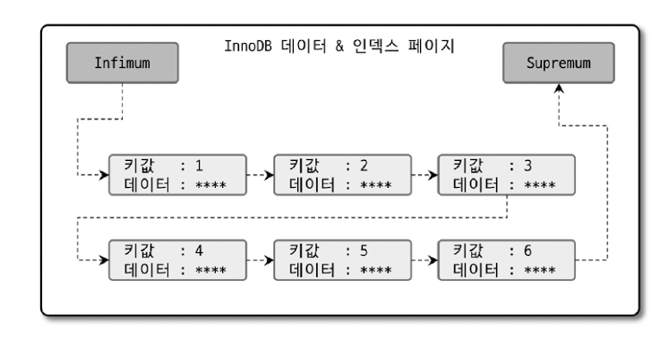


> 페이지 내부의 레코드들이 정렬 순서대로 저장돼 있는 것처럼 보이지만 실제로 InnoDB 페이지는 힙처럼 사용되기 때문에 물리적으로 저장이 순서대로 배치되지는 않는다.  
> 각 데이터 페이지 (InnoDB 스토리지 엔진에서 데이터 페이지는 프라이머리 키 인덱스 자체)나 인덱스 페이지의 엔트리 (데이터 레코드 또는 인덱스 키)는 키 값과 데이터를 가지는데,  
> 인덱스 (프라이머리 키 인덱스와 세컨더리 인덱스 모두)의 루트 노드 또는 브랜치 노드라면 자식의 주소를 가진다.  
> 프라이머리 키에서 리프 노드의 "데이터"는 실제 레코드의 컬럼 값들이며, 세컨더리 인덱스 페이지에서는 프라이머리 키 값을 가진다.

만약 아래와 같은 쿼리가 필요할때는 어떻게 해야할까?

```sql
SELECT *
FROM tab
WHERE userid = ?
ORDER BY score DESC
LIMIT 10;

-- 오름차순 인덱스 : INDEX (userid ASC , score ASC)
-- 내림차순 인덱스 : INDEX (userid DESC , score DESC)
```

두 가지 인덱스 모두 적절하지만 해당 쿼리가 빈번하게 실행되면 내림차순 인덱스가 더 적절할 것이다.  

## B-Tree 인덱스의 가용성과 효율성

쿼리의 WHERE 조건이나 GROUP BY, 또는 ORDER BY 절이 어떤 경우에 인덱스를 사용할 수 있고 어떤 방식으로 사용할 수 있는지 식별할 수 있어야 한다.  

### 비교 조건의 종류와 효율성

다중 칼럼 인덱스에서 각 컬럼의 순서와 그 컬럼에 사용된 조건이 동등 비교인지, 크다 또는 작다와 같은 범위 조건인지에 따라 각 인덱스 컬럼의 활용 형태가 달라지며, 그 효율 또한 달라진다.  
**인덱스를 통해 읽은 레코드가 나머지 조건에 맞는지 비교하면서 취사선택하는 작업을 "필터링"이라고도 한다.**  

```sql
SELECT * FROM dept_emp WHERE dept_no = 'd002' and emp_no >= 1014;
```

<h3>CASE A: INDEX (dept_no, emp_no)</h3>

`dept_no = 'd002' and emp_no >= 10144;` 인 레코드를 찾고, 그 이후에는 `dept_no`가 `d002`가 아닐 때까지 인덱스를 그냥 쭉 읽기만 하면 된다.  
`emp_no`가 비교 작업의 범위를 좁히는데 도움을 주기 때문에 **읽은 레코드가 모두 사용자가 원하는 결과임을 알 수 있다.**  
즉, 원하는 레코드를 찾는데 꼭 필요한 비교만 수행하므로 상당히 효율적으로 인덱스를 이용한 것이다.  

> 작업의 범위를 결정하는 조건을 **작업 범위 결정 조건** 이라 한다.

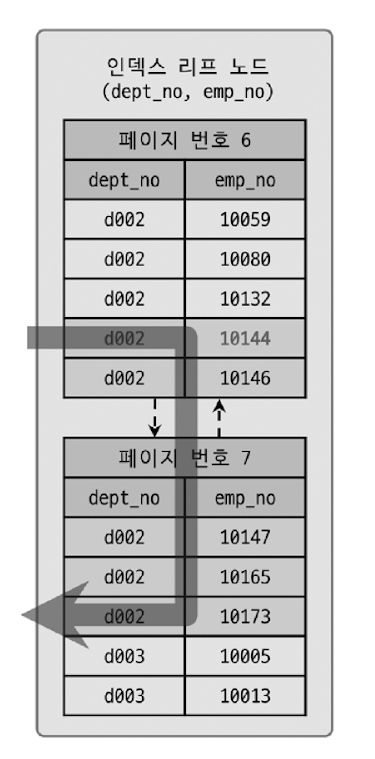

<h3>CASE B: INDEX (emp_no, dept_no)</h3>
 
먼저 `emp_no >= 10144` 인 레코드를 찾고, 그 이후 모든 레코드에 대해 `dept_no`가 'd002'인지 비교하는 과정을 거쳐야 한다.  
'd001'의 레코드를 버려야하는 불필요한 비교 작업을 볼 수 있다.  
`dept_no`가 범위를 좁히는데 아무 도움도 주지 못하고 단지 쿼리의 조건에 맞는지 검사하는 용도로만 사용된 것이다.  

> 작업 범위를 줄이지 못하고 단순히 거름종이 역할만 하는 조건을 **필터링 조건** 또는 **체크 조건** 이라고 한다.  
> 이런 체크 조건은 많다고 해서 처리 성능을 높이지 못하며 쿼리 실행을 더 느리게 만들때가 많다.


### 인덱스의 가용성

B-Tree 인덱스의 특징은 왼쪽 값에 기준해서 (Left-Most) 오른쪽 값이 정렬돼 있다는 것이다.  
**여기서 왼쪽이란 하나의 컬럼 내에서 뿐만 아니라 다중 칼럼 인덱스의 컬럼에 대해서도 함께 적용된다.**  

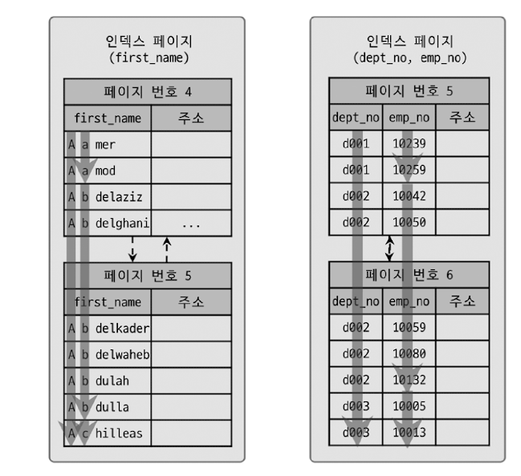

<h3>CASE A: INDEX (first_name)</h3>

```sql
SELECT * FROM employees WHERE first_name LIKE '%mer';
```

인덱스 값의 왼쪽부터 한 글자씩 비교해 가면서 일치하는 레코드를 찾아야 하는데, 주어진 조건에는 왼쪽 부분이 고정되지 않았기 때문에 인덱스 레인지 스캔 방식으로 인덱스를 이용할 수 없다.  
**정렬 우선순위가 낮은 뒷부분의 값만으로는 왼쪽 기준 정렬 기반의 인덱스인 B-Tree에서는 인덱스의 효과를 얻을 수 없다.**  

<h3>CASE B: INDEX (dept_no, emp_no)</h3>
 
```sql
SELECT * FROM dept_emp WHERE emp_no >= 10144;
```

인덱스가 (dept_no, emp_no) 순서로 다중 컬럼으로 구성돼 있기 때문에 `dept_no` 컬럼에 대해 먼저 정렬한 후, 다시 `emp_no` 컬럼 값으로 정렬된다.  
`dept_no` 조건 없이 `emp_no` 값만으로는 인덱스를 효율적으로 사용할 수 없다.  

### 가용성과 효율성 판단

기본적으로 **B-Tree 인덱스의 특성상 다음 조건에서는 작업 범위 결정 조건으로 사용할 수 없으며 경우에 따라서는 체크 조건으로 인덱스를 사용할 수는 있다.**  

1. `NOT-EQUAL`로 비교된 경우 (<>, NOT IN, NOT BETWEEN, IS NOT NULL)
2. `LIKE %??` 앞부분이 아닌 **뒷부분 일치 형태로 문자열 패턴이 비교된 경우**
   - WHERE COLUMN LIKE '%승환'
   - WHERE COLUMN LIKE '_승환'
   - WHERE COLUMN LIKE '%승%'
3. 스토어드 함수나 **다른 연산자로 인덱스 컬럼이 변형된 후 비교된 경우**
   - WHERE SUBSTRING(column, 1, 1) = 'X'
4. `NOT-DETERMINISTIC` 속성의 스토어드 함수가 비교 조건에 사용된 경우
5. **데이터 타입이 서로 다른 비교** (인덱스 컬럼의 타입을 변환해야 비교가 가능한 경우, 15장 데이터 타입 참조) 
6. **문자열 데이터 타입의 콜레이션이 다른 경우** (15.1.4절 콜레이션 참조)

MySQL에는 NULL값도 인덱스에 저장되기 때문에 아래와 같은 쿼리도 작업 범위 결정 조건으로 사용할 수 있다.  

```sql
... WHERE column IS NULL
```

다중 컬럼으로 만들어진 인덱스는 어떤 경우에 사용할 수 없을까?  
아래와 같은 인덱스가 있다고 가정해보자.  

```sql
INDEX ix_test (column_1, column_2, column_3, ... , column_n,)
```

- **작업 범위 결정 조건으로 인덱스를 사용하지 못하는 경우**
  - `column_1` 컬럼에 대한 조건이 없는 경우
  - `column_1` 컬럼의 비교 조건이 위의 인덱스 사용 불가 조건 중 하나인 경우
- **작업 범위 결정 조건으로 인덱스를 사용하는 경우**
  - `column_1 ~ column_i` 컬럼까지 동등 비교 형태로 비교 (`=`, `IN`)
  - `column_i`에 대해 동등 비교, `>`, `<`, LIKE로 좌측 일치 패턴

```sql
-- //다음 쿼리는 인덱스를 사용할 수 없음
mysql> ..WHERE column_1 <> 2

-- // 다음 쿼리는 column 1과 column 2까지 범위 결정 조건으로 사용됨
mysql>..WHERE cOlumn_1 = 1 AND column_2 > 10

-- // 다음 쿼리는 column_1, colum_2, column_3까지 범위 결정 조건으로 사용됨
mysql>..WHERE column_1 IN (1,2) AND column_2 = 2 AND column_3 <= 10

-- //다음 쿼리는 colum_1, colum_2, column_3까지 범위 결정 조건으로,
-- //column_4는 체크 조건으로 사용됨
mysql>..WHERE column_1= 1 AND colum_2 = 2 AND column_3 IN (10,20,30) AND colum_4 <> 100

-- // 다음 쿼리는 colum_1, colum_ 2, column_3, column_4까지 범위 결정 조건으로 사용됨
-- // 좌측 패턴 일치 LIKE 비교는 크다 또는 작다 비교와 동급으로 생각하면 됨
mysql>.. WHERE column_1 = 1 AND column_2 IN (2,4) AND column_3 = 30 AND column_4 LIKE '김승%'

-- // 다음 쿼리는 colum_1, column_2, column_3, column_4, column_5 칼럼까지
-- // 모두 범위 결정 조건으로 사용됨
mysql>..WHERE column_1 = 1 AND column_2 = 2 AND column_3= 30
AND column 4 = ' 김승환' AND column 5 =' 서울'
```

## Hash 인덱스

> `Hash 인덱스 알고리즘`은 **컬럼의 값으로 해시값을 계산해서 인덱싱 하는 알고리즘**으로, **매우 빠른 검색을 지원한다.**  
> 하지만 값을 변형해서 인덱싱하므로 **전방(prefix) 일치와 같이 값의 일부만 검색하거나 범위를 검색할 때는 해시 인덱스를 사용할 수 없다.**  
> 주로 **메모리 기반의 데이터베이스에서 많이 사용한다.**