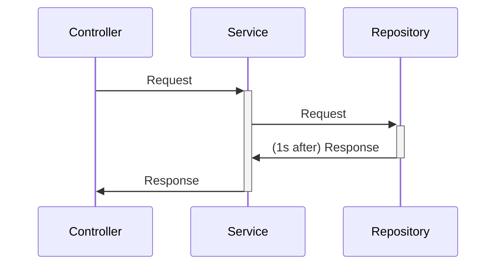
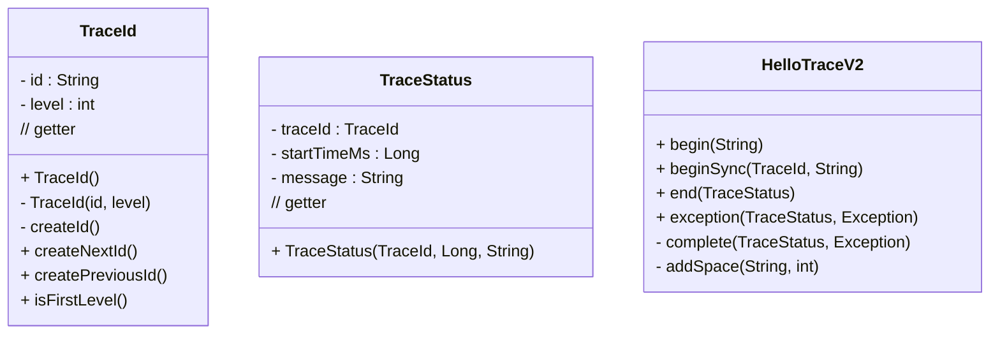
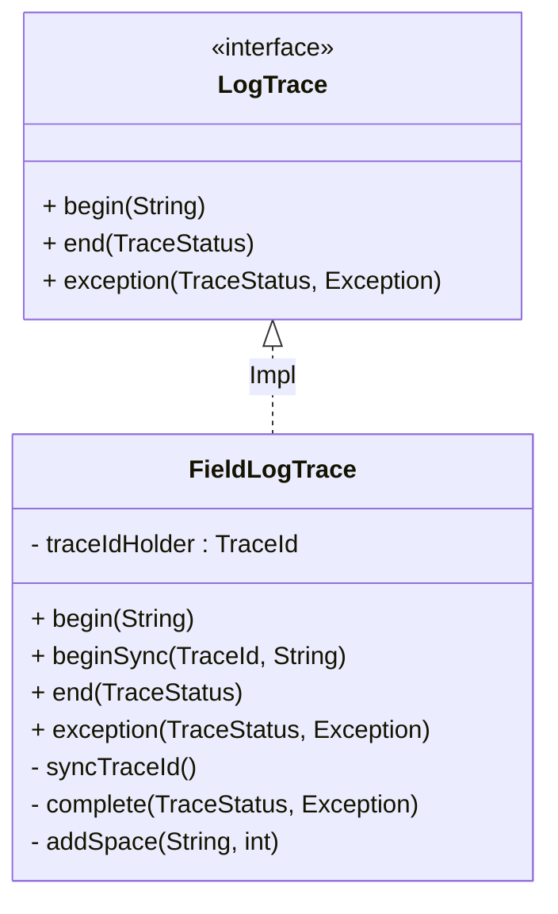

# 로그 추적기 개발




## **요구사항**  

1. 모든 `public` 메서드의 호출과 응답 정보를 로그로 출력 
2. 애플리케이션의 흐름을 변경하면 안됨
3. 로그를 남긴다고 해서 비즈니스 로직의 동작에 영향을 주면 안됨 
4. 메서드 호출에 걸린 시간
5. 정상 흐름과 예외 흐름 구분
6. 예외 발생시 예외 정보가 남아야 함 메서드 호출의 깊이 표현
7. HTTP 요청을 구분
8. HTTP 요청 단위로 `특정 ID`를 남겨서 어떤 HTTP 요청에서 시작된 것인지 명확하게 구분이 가능해야 함
9. 트랜잭션 ID
10. 여기서는 하나의 HTTP 요청이 시작해서 끝날 때 까지를 **하나의 트랜잭션**이라 함

```
정상 요청
  [796bccd9] OrderController.request()
  [796bccd9] |-->OrderService.orderItem()
  [796bccd9] |   |-->OrderRepository.save()
  [796bccd9] |   |<--OrderRepository.save() time=1004ms
  [796bccd9] |<--OrderService.orderItem() time=1014ms
  [796bccd9] OrderController.request() time=1016ms

예외 발생
  [b7119f27] OrderController.request()
  [b7119f27] |-->OrderService.orderItem()
  [b7119f27] | |-->OrderRepository.save() [b7119f27] | |<X-OrderRepository.save() time=0ms ex=java.lang.IllegalStateException: 예외 발생! [b7119f27] |<X-OrderService.orderItem() time=10ms ex=java.lang.IllegalStateException: 예외 발생! [b7119f27] OrderController.request() time=11ms ex=java.lang.IllegalStateException: 예외 발생!
```

## 구현




`beginSync()`를 통해**로그에 대한 문맥 `Context`정보를 공유해야한다.**  
- `TraceId`의 정보들이 공유되어야 한다.  
첫 시점에서 사용한 `TraceId`를 다음 호출에 넘겨주어야 한다.  

```
[f4a8dddf] OrderControllerV2.request()
[f4a8dddf] |-->OrderServiceV2.request()
[f4a8dddf] |   |-->OrderRepositoryV2.request()
[f4a8dddf] |   |<--OrderRepositoryV2.request() time=1005ms
[f4a8dddf] |<--OrderServiceV2.request() time=1006ms
[f4a8dddf] OrderControllerV2.request() time=1007ms
```

**모든 요구사항은 만족하였지만 `TraceId`동기화가 필요하기 때문에 호출되는 메소드들은 메소드 시그니처들이 모두 변경되어야 한다는 단점이 존재한다.**  

***

# **ThreadLocal**

위의 문제를 해결하는 목적으로 사용된다.  



`FieldLogTrace`의 `traceIdHolder`의 필드를 통해 해당 `TraceId`를 공유하게 했다.  
하지만 **`FileLogTrace`는 싱글톤 빈으로 관리되기 때문에 동시에 여러 요청이 온다면 내부 필드인 `TraceIdHolder`에 대해 동시성 문제가 생긴다.**  
  
이 문제를 해결하기 위해 **ThreadLocal**을 사용한다.  
- **각 Thread마다 별도의 내부 저장소를 제공한다.**
- 따라서 같은 인스턴스의 Thread Local 필드에 접근해도 문제 없다.
- 자바는 ThreadLocal을 지원하기 위한 `java.lang.ThreadLocal`을 제공한다.
- 해당 Thread가 ThreadLocal을 모두 사용하고나면 `ThreadLocal.remove()`를 호출해서 지정된 값을 제거해줘야 한다.

```
이 클래스는 스레드 로컬 변수를 제공합니다. 이러한 변수는 (get 또는 set 메서드를 통해) 하나에 액세스하는 각 스레드가 고유하고 독립적으로 초기화된 변수 복사본을 갖는다는 점에서 일반 대응 변수와 다릅니다. 
ThreadLocal 인스턴스는 일반적으로 상태를 스레드와 연결하려는 클래스의 전용 정적 필드입니다(예: 사용자 ID 또는 트랜잭션 ID).
예를 들어 아래 클래스는 각 스레드에 고유한 식별자를 생성합니다. 스레드의 ID는 ThreadId.get() 을 처음 호출할 때 할당되며 후속 호출에서 변경되지 않습니다.
```

- [`baeldung` Java ThreadLocal](https://www.baeldung.com/java-threadlocal)
- [`baeldung` Java Thread Safety](https://www.baeldung.com/java-thread-safety)

  
1. `Thread` 클래스의 내부 필드인 `ThreadLocalMap`에 저장되며, `TerminatingThreadLocal<T> extends ThreadLocal<T>` 클래스가 `set()`과 `remove()`를 한다.  
2. WAS처럼 Thread Pool을 사용하는 경우에는 사용한 `ThreadLocal`은 꼭 삭제해야한다.  
3. `Thread Local`을 삭제하지 않은 `Thread`가 Pool에 돌아가게 되어, `Thread Local`이 계속 유지되기 때문에 꼭 삭제해야한다.