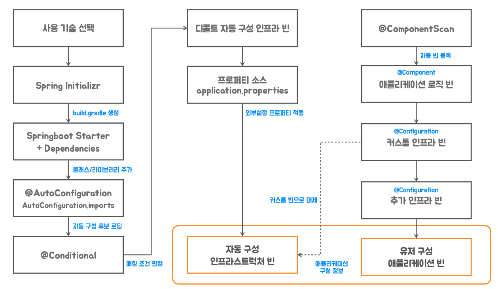
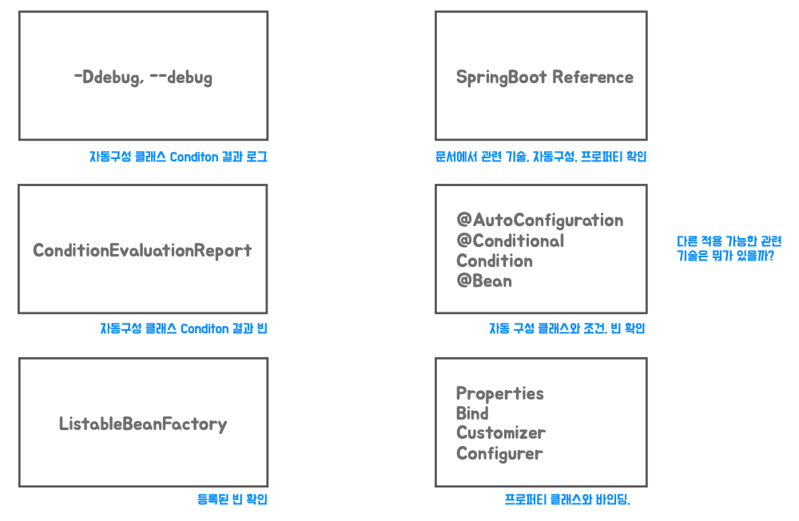
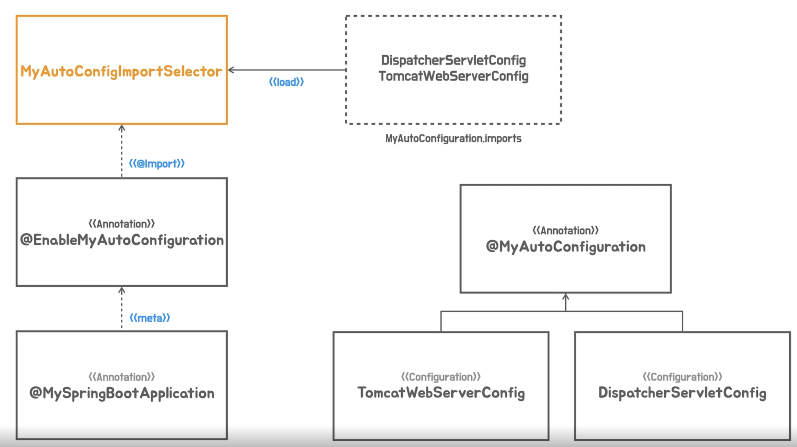
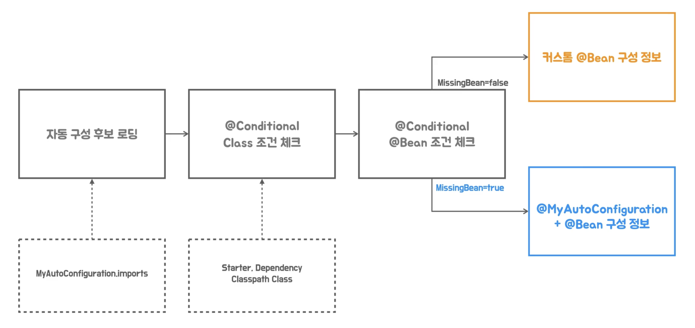
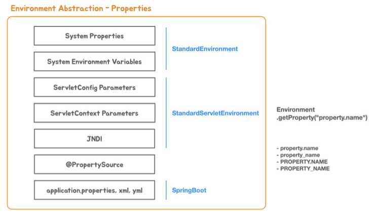
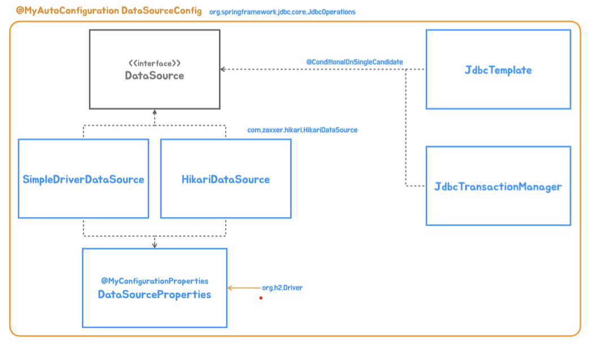

<!-- TOC -->

- [**컨테이너리스 웹 애플리케이션 아키텍처란?**](#컨테이너리스-웹-애플리케이션-아키텍처란)
- [**Case 1. 스프링 컨테이너를 제외하고 서블릿 컨테이너만 실행하기**](#case-1-스프링-컨테이너를-제외하고-서블릿-컨테이너만-실행하기)
- [**Case 2. 서블릿 컨테이너에 DispatcherServlet 등록해보기**](#case-2-서블릿-컨테이너에-dispatcherservlet-등록해보기)
- [**Case 3. 서블릿 생성,초기화 작업을 스프링 컨테이너 초기화 중에 실행하기**](#case-3-서블릿-생성초기화-작업을-스프링-컨테이너-초기화-중에-실행하기)
- [**Case 4. @Configuration 설정 정보를 이용하여 ApplicationContext 구성해보기**](#case-4-configuration-설정-정보를-이용하여-applicationcontext-구성해보기)
	- [**DispatcherServlet에 ApplicationContext를 주입해주지 않으면?**](#dispatcherservlet에-applicationcontext를-주입해주지-않으면)
- [**Case 5. SpringApplication.run(HellobootApplication.class, args)**](#case-5-springapplicationrunhellobootapplicationclass-args)
- [**메타 어노테이션**](#메타-어노테이션)
- [**애플리케이션 빈 vs 컨테이너 인프라스트럭처 빈**](#애플리케이션-빈-vs-컨테이너-인프라스트럭처-빈)
- [`@Configuration(proxyBeanMethods = false)`는 뭘까](#configurationproxybeanmethods--false는-뭘까)
- [**조건부 자동구성** `@Conditional`과 `Condition interface`](#조건부-자동구성-conditional과-condition-interface)
	- [스프링 부트의 `@Conditional`](#스프링-부트의-conditional)
- [**스프링의 `Environment` 추상화**](#스프링의-environment-추상화)
	- [`Environment`를 활용하여 `Tomcat`의 ContextPath 설정](#environment를-활용하여-tomcat의-contextpath-설정)
- [**Spring JDBC 자동 구성 개발** `DataSource`와 `JdbcTemplate`](#spring-jdbc-자동-구성-개발-datasource와-jdbctemplate)
- [**스프링 부트의 자동 구성 정보**](#스프링-부트의-자동-구성-정보)
	- [Core](#core)
	- [Web](#web)
	- [JDBC](#jdbc)

<!-- /TOC -->

[Containerless 웹 개발 아키텍처의 지원](https://github.com/spring-projects/spring-framework/issues/14521)요청에서 논의와 개발이 시작되었다.  

# **컨테이너리스 웹 애플리케이션 아키텍처란?**

**Servlet Container (Web Container)**  
여러 개의 `Servlet (Web component)`를 관리한다.  
각 요청에 대해 어떤 Servlet에 요청을 위임할지 결정(라우팅 또는 매핑)한다.  
해당 컨테이너는 완전히 독립적인 서버 프로그램이다.  
해당 Servlet Container를 실행시키기 위해서는 너무 번거로우니, 이 Container를 더 이상 신경쓰지 않고 **Spring Container만 실행하면 가능하도록 하는 것이다.**  
  
# **Case 1. 스프링 컨테이너를 제외하고 서블릿 컨테이너만 실행하기**

1. 서블릿 컨테이너를 프론트 컨트롤러 역할 부여하기
2. URL,컨트롤러 매핑하기
3. 요청을 가공하고 응답 반환하기

```java
public class HellobootApplication {

	public static void main(String[] args) {
		ServletWebServerFactory webServerFactory = new TomcatServletWebServerFactory();

		WebServer webServer = webServerFactory.getWebServer(servletContext ->
				servletContext
						.addServlet("hello", makeHttpServlet())
						.addMapping("/*")
		);

		webServer.start();
	}

	public static HttpServlet makeHttpServlet() {
		HelloController helloController = new HelloController();

		return new HttpServlet() {
			@Override
			protected void service(HttpServletRequest req, HttpServletResponse resp) throws IOException {
				String uri = req.getRequestURI();
				String method = req.getMethod();
				if (uri.equals("/hello") && method.equals(HttpMethod.GET.name())) {
					String name = req.getParameter("name");
					String result = helloController.hello(name);

					resp.setContentType(MediaType.TEXT_PLAIN_VALUE);
					resp.getWriter().println(result);
				} else {
					resp.setStatus(HttpStatus.NOT_FOUND.value());
				}
			}
		};
	}
}
```

# **Case 2. 서블릿 컨테이너에 DispatcherServlet 등록해보기**

```java
public static void main(String[] args) {
	// 1. 스프링 컨테이너 생성, 빈 등록 후 초기화 작업
	GenericWebApplicationContext applicationContext = new GenericWebApplicationContext();
	applicationContext.registerBean(HelloController.class);
	applicationContext.registerBean(SimpleHelloService.class);
	applicationContext.refresh(); // 스프링 컨테이너의 초기화 담당 (템플릿 메소드 패턴)

	// 2. 서블릿 컨테이너를 생성하고, DispatcherServlet 을 서블릿 컨테이너에 등록
	ServletWebServerFactory webServerFactory = new TomcatServletWebServerFactory();
	WebServer webServer = webServerFactory.getWebServer(servletContext ->
			servletContext
					.addServlet("dispatcherServlet", new DispatcherServlet(applicationContext))
					.addMapping("/*")
	);

	webServer.start();
}
```

# **Case 3. 서블릿 생성,초기화 작업을 스프링 컨테이너 초기화 중에 실행하기**

```java
public static void main(String[] args) {
	GenericWebApplicationContext applicationContext = new GenericWebApplicationContext() {
		@Override
		protected void onRefresh() {
			super.onRefresh();

			ServletWebServerFactory webServerFactory = new TomcatServletWebServerFactory();
			WebServer webServer = webServerFactory.getWebServer(servletContext ->
					servletContext
							.addServlet("dispatcherServlet", new DispatcherServlet(this))
							.addMapping("/*")
			);

			webServer.start();
		}
	};
	applicationContext.registerBean(HelloController.class);
	applicationContext.registerBean(SimpleHelloService.class);
	applicationContext.refresh(); // 스프링 컨테이너의 초기화 담당 (템플릿 메소드 패턴)
}
```

# **Case 4. @Configuration 설정 정보를 이용하여 ApplicationContext 구성해보기**


```java
@Configuration
public class HellobootApplication {

	@Bean
	public HelloController helloController(HelloService helloService) {
		return new HelloController(helloService);
	}

	@Bean
	public HelloService helloService() {
		return new SimpleHelloService();
	}

	public static void main(String[] args) {

		// @Configuration 이 붙은 설정 정보를 이용하여 ApplicationContext를 구성하는 클래스
		AnnotationConfigWebApplicationContext applicationContext = new AnnotationConfigWebApplicationContext() {
			@Override
			protected void onRefresh() {
				super.onRefresh();

				ServletWebServerFactory webServerFactory = new TomcatServletWebServerFactory();
				WebServer webServer = webServerFactory.getWebServer(servletContext ->
						servletContext
								.addServlet("dispatcherServlet", new DispatcherServlet(this))
								.addMapping("/*")
				);

				webServer.start();
			}
		};
		applicationContext.register(HellobootApplication.class);
		applicationContext.refresh(); // 스프링 컨테이너의 초기화 담당 (템플릿 메소드 패턴)
	}
}
```

## **DispatcherServlet에 ApplicationContext를 주입해주지 않으면?**


`DispatcherServlet`은 `ApplicationContextAware`을 구현하고 있다.  
**빈 후처리기를 통해 자동으로 ApplicationContext를 주입하여 준다.**  

> **하지만 ApplicationContext는 `Aware`를 통해 빈 후처리기로 주입받기 보다는.. 생성자로 주입받자**

```java
class ApplicationContextAwareProcessor implements BeanPostProcessor {

	private final ConfigurableApplicationContext applicationContext;

	private final StringValueResolver embeddedValueResolver;


	/**
	 * Create a new ApplicationContextAwareProcessor for the given context.
	 */
	public ApplicationContextAwareProcessor(ConfigurableApplicationContext applicationContext) {
		this.applicationContext = applicationContext;
		this.embeddedValueResolver = new EmbeddedValueResolver(applicationContext.getBeanFactory());
	}


	@Override
	@Nullable
	public Object postProcessBeforeInitialization(Object bean, String beanName) throws BeansException {
		if (!(bean instanceof EnvironmentAware || 
				bean instanceof EmbeddedValueResolverAware ||
				bean instanceof ResourceLoaderAware || 
				bean instanceof ApplicationEventPublisherAware ||
				bean instanceof MessageSourceAware || 
				bean instanceof ApplicationContextAware ||
				bean instanceof ApplicationStartupAware)) {
			return bean;
		}

		invokeAwareInterfaces(bean);
		return bean;
	}

	private void invokeAwareInterfaces(Object bean) {
		if (bean instanceof Aware) {
			if (bean instanceof EnvironmentAware environmentAware) {
				environmentAware.setEnvironment(this.applicationContext.getEnvironment());
			}
			if (bean instanceof EmbeddedValueResolverAware embeddedValueResolverAware) {
				embeddedValueResolverAware.setEmbeddedValueResolver(this.embeddedValueResolver);
			}
			if (bean instanceof ResourceLoaderAware resourceLoaderAware) {
				resourceLoaderAware.setResourceLoader(this.applicationContext);
			}
			if (bean instanceof ApplicationEventPublisherAware applicationEventPublisherAware) {
				applicationEventPublisherAware.setApplicationEventPublisher(this.applicationContext);
			}
			if (bean instanceof MessageSourceAware messageSourceAware) {
				messageSourceAware.setMessageSource(this.applicationContext);
			}
			if (bean instanceof ApplicationStartupAware applicationStartupAware) {
				applicationStartupAware.setApplicationStartup(this.applicationContext.getApplicationStartup());
			}
			if (bean instanceof ApplicationContextAware applicationContextAware) {
				applicationContextAware.setApplicationContext(this.applicationContext);
			}
		}
	}

}

```

이 `Aware` 인터페이스를 구현하거나 확장하는 모든 타입들은 빈 후처리기를 통해 주입하여 준다.

```java
@Component
public class AwareTest implements
        ApplicationContextAware,
        ApplicationEventPublisherAware,
        ServletContextAware,
        MessageSourceAware,
        ResourceLoaderAware,
        ApplicationStartupAware,
        NotificationPublisherAware,
        EnvironmentAware,
        BeanFactoryAware,
        EmbeddedValueResolverAware,
        ImportAware,
        ServletConfigAware,
        LoadTimeWeaverAware,
        BeanNameAware,
        BeanClassLoaderAware {
	
	// Method Override ...
}
```

# **Case 5. SpringApplication.run(HellobootApplication.class, args)**

지금까지 서블릿 컨테이너, 스프링 컨테이너, DispatcherServlet, WebServer를 이용하여 스프링 어플리케이션을 실행시켜 보았다.  
이 작업이 기존에 스프링 부트를 생성하면 `main` 클래스에서 실행하던 `SpringApplication.run(HellobootApplication.class, args)`와 원리는 동일하다.  

```java
public class MySpringApplication {

    public static void run(Class<?> applicationClass, String[] args) {
        AnnotationConfigWebApplicationContext applicationContext = new AnnotationConfigWebApplicationContext() {
            @Override
            protected void onRefresh() {
                super.onRefresh();

                ServletWebServerFactory webServerFactory = this.getBean(ServletWebServerFactory.class);
                DispatcherServlet dispatcherServlet = this.getBean(DispatcherServlet.class);

                WebServer webServer = webServerFactory.getWebServer(servletContext ->
                        servletContext
                                .addServlet("dispatcherServlet", dispatcherServlet)
                                .addMapping("/*")
                );

                webServer.start();
            }
        };
        applicationContext.register(applicationClass);
        applicationContext.refresh(); // 스프링 컨테이너의 초기화 담당 (템플릿 메소드 패턴)
    }
}
```

# **메타 어노테이션**

```java
@Retention(RetentionPolicy.RUNTIME)
@Target(ElementType.ANNOTATION_TYPE)
@Test
@interface UnitTest {
}
```
  
메타 어노테이션은 아무 어노테이션이나 될 수 있는 것은 아니다.
  
```java
@Target({ ElementType.ANNOTATION_TYPE, ElementType.METHOD })
@Retention(RetentionPolicy.RUNTIME)
@Documented
@API(status = STABLE, since = "5.0")
@Testable
public @interface Test {
}
```
  
`@Target(ElementType.ANNOTATION_TYPE)` 이 존재해야한다.  

# **애플리케이션 빈 vs 컨테이너 인프라스트럭처 빈**





**애플리케이션 로직 빈**  
- 개발자가 직접 등록한 빈들
  
**애플리케이션 인프라스트럭처 빈**  
- 빈 구성정보를 명시해줘서 사용하는 것
- DataSource
- JpaEntityManagerFactory
- JdbcTransactionManager
  
**컨테이너 인프라스트럭처 빈**  
- 스프링 컨테이너 자신이거나 스프링 컨테이너가 기능을 확장하면서 추가해온 새로운 빈들
- 빈으로 등록해달라고 명시하지 않고 스스로 빈으로 등록해서 실행하는 빈
- ApplicationContext
- BeanFactory
- Environment
- BeanPostProcessor
- BeanFactoryPostProcessor
- DefaultAdvisorAutoProxyCreator

  
위에서 직접 정의해줘야만 했던 이 두개의 빈 (`TomcatServerWebServerFactory`와 `DispatcherServlet`)은 **애플리케이션 인프라스트럭처 빈**에 포함되어야 할 것이다.  
**애플리케이션 빈**을 로직과 인프라스트럭처 빈을 구분할 때 `사용자 구성정보 (@ComponentScan)`와 `자동 구성정보 (@AutoConfiguration)`으로 구분할 수 있다.  
  


자동으로 등록할 `DispatcherServlet`과 `TomcatWebServer`는 `.imports`파일에 명시를 해놓았는데 `@MyAutoConfiguration`의 역할이 이해가 안갔다.  

> 💡 `@MyAutoConfiguration`의 역할에 대한 토비님의 답변  
> @AutoConfiguration을 따라서 만들어본 것입니다.   
> 이 애노테이션의 **첫 번째 목적은 imports 파일의 이름을 정할 때, 자동 구성용 클래스라는 마커 역할을 하는 것**입니다.  
> 여기까지는 동작하는 기능은 아니겠죠.  
> 강의를 어디까지 보셨는지 모르겠지만 결국 @MyAutoConfiguration은 결국 메타 애노테이션으로 @Configuration을 가지게 됩니다.  
> 따라서 @MyAutoConfiguration이 붙은 클래스는 그 자체로 일반 @Configuration 클래스의 모든 기능을 다 적용할 수 있게 됩니다.  
> 그러면서 proxyBeanMethods=false 설정이 기본적으로 적용됩니다. 그래서 일반 @Configuration과는 조금 다른 특성을 가집니다.  
> 이 부분도 강의 후반부에 설명합니다.

imports 파일에 의해서 등록되는 클래스도 빈으로 자동으로 등록되는 것이 효과이긴하지만, 이게 특별히 스프링 부트의 자동 구성을 담기 위한 목적이라는 사실을 분명하게 하는 주석(annotation)을 달아주는 것만으로도 의미가 있다고 보여집니다.


# `@Configuration(proxyBeanMethods = false)`는 뭘까

> 스프링 5 이후에는 일반 빈, 즉 @Component가 달려있는 빈에도 @Bean 지원이 됩니다.  
> 이걸 lite-mode @Bean이라고 하는데, 이 때문에 약간 혼동이 있을 수 있습니다만, 분명 @Component와 @Configuration의 목적은 다릅니다.  
> lite-mode는 클래스 레벨의 빈의 정보를 내부 오브젝트로 접근해서 사용하는 특별한 용도에만 사용이 됩니다.  
> **자바 코드를 이용해서 어떤 기능을 제공하는 빈을 직접 정의할 때는 @Configuration/@Bean을 사용해야 합니다.**
  
> `proxyBeanMethods = false`를 사용해야 하는 [이유](https://github.com/spring-projects/spring-boot/issues/9068)

```java
public class ConfigurationTest {

    @Test
    void configuration() {
        MyConfig myConfig = new MyConfig();
        Bean1 bean1 = myConfig.bean1();
        Bean2 bean2 = myConfig.bean2();

        assertThat(bean1.common).isNotEqualTo(bean2.common);

        /*
        @Configuration 와 @Bean 을 통해 빈들을 등록한다고 가정했을 때
        두 개의 빈이 다른 한 개의 빈을 참조한다면 이 두 개의 빈은 똑같은 빈을 참조할까?
        @Configuration 의 기본값은 proxyBeanMethods = true 로 설정되어 있기 때문에 만약 빈이 이미 등록되어 있다면 새로 생성하지 않고 똑같은 빈을 준다.
        */
        AnnotationConfigApplicationContext ac = new AnnotationConfigApplicationContext();
        ac.register(MyConfig.class);
        ac.refresh();

        Bean1 springBean1 = ac.getBean(Bean1.class);
        Bean2 springBean2 = ac.getBean(Bean2.class);

        assertThat(springBean1.common).isEqualTo(springBean2.common);
    }

    @Test
    void proxyCommonMethod() {
        MyConfigProxy myConfigProxy = new MyConfigProxy();

        Bean1 bean1 = myConfigProxy.bean1();
        Bean2 bean2 = myConfigProxy.bean2();

        assertThat(bean1.common).isEqualTo(bean2.common);
    }

    @Test
    void proxyOffConfig() {
        AnnotationConfigApplicationContext ac = new AnnotationConfigApplicationContext();
        ac.register(MyProxyOffConfig.class);
        ac.refresh();

        Bean1 springBean1 = ac.getBean(Bean1.class);
        Bean2 springBean2 = ac.getBean(Bean2.class);

        assertThat(springBean1.common).isNotEqualTo(springBean2.common);
    }

    static class MyConfigProxy extends MyConfig {
        private Common common;
        @Override
        Common common() {
            if (this.common == null) {
                this.common = super.common();
            }
            return this.common;
        }
    }

    @Configuration(proxyBeanMethods = false)
    static class MyProxyOffConfig {
        @Bean
        Common common() { return new Common(); }

        @Bean
        Bean1 bean1() { return new Bean1(common()); }

        @Bean
        Bean2 bean2() { return new Bean2(common()); }
    }

    @Configuration
    static class MyConfig {
        @Bean
        Common common() { return new Common(); }

        @Bean
        Bean1 bean1() { return new Bean1(common()); }

        @Bean
        Bean2 bean2() { return new Bean2(common()); }
    }
    static class Bean1 {
        final Common common;

        Bean1(Common common) {
            this.common = common;
        }
    }

    static class Bean2 {
        final Common common;

        Bean2(Common common) {
            this.common = common;
        }
    }

    static class Common {}
}
```

# **조건부 자동구성** `@Conditional`과 `Condition interface`



> 스프링 부트의 자동 구성에서 대표적으로 쓰이는 구성 방법에는 **어떤 라이브러리가 포함되어 있는지 확인하여 구성한다.**

1. **`@Conditional` 학습 테스트** [예제 코드](https://github.com/jdalma/helloboot/commit/ebf90ec7964977fab928ebc323f83cecb92f63ea#diff-fee0276ebb9de0564cffe8535be8b373293a1ef65d3aac0a167e193e5de878e3)
2. **`@Conditional` 적용** [예제 코드](https://github.com/jdalma/helloboot/commit/4fe0d2a421b67b4cb14804b7a0908360421d6e9d#diff-5b4f797eefe1a57aecbda1e4a05913c8bd76e8855d123224ceafb6456426f68c)
   - Condtion을 구현할 때 특정 라이브러리가 포함되었으면 빈으로 등록하게 작성
   - `Tomcat` 라이브러리를 제거하고 `Netty`가 사용되도록 변경
3. **9090포트의 `CustomWebServer`를 사용하고 싶을 때 기존 `Tomcat Server`가 사용자 구성정보가 존재하는지 확인하게 하기** [예제 코드](https://github.com/jdalma/helloboot/commit/9a51181262ecc984da0e52fbc8d258e6f2e18ce4#diff-fc5baa8cac8f110ab739dca90ef9717f3a31e2b24b600781b42d5ef08c507178)
   - 사용자의 구성정보가 먼저 로딩된 후에 자동 구성정보가 로딩되어야 하기 때문에 `ImportSelector`를 활용해야 한다.

## 스프링 부트의 `@Conditional`

스프링 프레임워크의 `@Profile`도 `@Conditional` 어노테이션이다.  

```java
@Target({ElementType.TYPE, ElementType.METHOD})
@Retention(RetentionPolicy.RUNTIME)
@Documented
@Conditional(ProfileCondition.class)
public @interface Profile {

	/**
	 * The set of profiles for which the annotated component should be registered.
	 */
	String[] value();

}
```
  
**Class Conditions**  
1. `@ConditionalOnClass`
2. `@ConditionalOnMissingClass`
  
지정한 클래스의 프로젝트내 존재를 확인해서 포함 여부를 걸정  
  
**Bean Conditions**  
1. `@ConditionalOnBean`
2. `@ConditionalOnMissingBean` (커스텀 빈 구성 정보에 사용하지 않는 것이 안전하다.)
  
빈의 존재 여부를 기준으로 포함여부를 결정  
빈의 타입 또는 이름을 지정할 수 있으며, 지정된 빈 정보가 없으면 메소드의 리턴 타입을 기준으로 빈의 존재여부를 체크한다.  
컨테이너에 등록된 빈 정보를 기준으로 체크하기 때문에 자동 구성 사이에 적용하려면 `@Configuration` 클래스의 적용 순서가 중요하다.  
  
**Property Conditions**  
1. `@ConditionalOnProperty`

스프링의 환경 프로퍼티 정보를 이용  
지정된 프로퍼티가 존재하고 값이 `false`가 아니면 포함 대상이 된다.  
프로퍼티의 존재를 확인해서 빈 오브젝트를 추가하고, 해당 빈 오브젝트에서 프로퍼티 값을 이용해서 세밀하게 빈 구성을 할 수 있다.  
  
**Resource Conditions**  
1. `@ConditionalOnResource`
  
지정된 리소스(파일)의 존재를 확인하는 조건
  
**Web Application Conditions**  
1. `@ConditionalOnWebApplication`
2. `@ConditionalOnNotWebApplication`
  
웹 어플리케이션 여부를 확인

# **스프링의 `Environment` 추상화**



애플리케이션의 두 가지 환경 정보 모델인 `profile`과 `properties`를 제공한다.  
**자동 구성 정보의 일부 내용을 변경하거나 설정해야 할 때 `Environment`를 통해서 프로퍼티 값을 가져와서 활용할 수 있다.**  
스프링 부트는 기본적으로 `application.properties`, `application.yml`, `application.xml` 등의 파일에서 프로퍼티를 읽어오는 기능이 존재한다.  

```java
/**
 * ApplicationRunner 를 구현하여 빈으로 등록하면 모든 스프링 실행과 로딩이 끝나고 해당 구현체가 실행됨이 보장된다.
 */
@Bean
ApplicationRunner applicationRunner(Environment env) {
	return args -> {
		String property = env.getProperty("my.name");
		System.out.println("my.name " + property);
	};
}
```

## `Environment`를 활용하여 `Tomcat`의 ContextPath 설정

> yml 등에 정의된 프로퍼티 값들이 결국 하나의 프로퍼티 클래스의 오브젝트로 변환되고, 이를 자동 구성 클래스가 받아서 사용한다는 것이 핵심이다.  
> **@Enable..**로 시작하는 어노테이션들은 **@Import를 작성하여 기능을 가진 Configuration 클래스 또는 ImportSelector를 가져오게 하는것이 목적**이다.

  
1. **`Environment`에서 Property를 직접 조회하기** [예제](https://github.com/jdalma/helloboot/commit/c0d228ad784ee215a4a47ebbf578b73246a1b67b#diff-fc5baa8cac8f110ab739dca90ef9717f3a31e2b24b600781b42d5ef08c507178)
2. **`@Value`를 통해 내부 필드로 Property를 할당해서 사용하기** [예제](https://github.com/jdalma/helloboot/commit/2b7a80cd4510a6e1478ac5d3a593815ae513ab30)
  - `PropertySourcesPlaceholderConfigurer`를 자동으로 등록하지 않으면 `@Value`의 기능을 사용할 수 없다.
3. **Property 클래스 분리** [예제](https://github.com/jdalma/helloboot/commit/52ed84ca625e45f52a09c6b2117793bc6138f543#diff-2af8a8a5dfec35fe353ec875a54ce8e92772ee6a04814738907e8f398de84876)
   - Property가 많아지면 `@Value`로 직접 할당하기 번거러우니, 클래스를 따로 정의하여 자동으로 Bind 하기
4. **빈 후처리기를 등록하여 `@MyConfigurationProperties`이 작성된 빈들을 찾아 Property들 자동으로 Bind 시키기** [예제](https://github.com/jdalma/helloboot/commit/89f1ca54fc572832a86f982f2be07603de53a46a#diff-717b7d12ab0fce6132bec6eb6483b5deaa111bc99b66ae2f823d53e16262c511)
   - `prefix = server` 추가
   - Environment의 Property를 사용하는 클라이언트 쪽에서 필요한 Property 클래스를 명시하도록 작성 
     - `@EnableMyConfigurationProperties(ServerProperties.class)`

# **Spring JDBC 자동 구성 개발** `DataSource`와 `JdbcTemplate`



1. **SimpleDriverDataSource와 HikariDataSource 구성 정보 추가** [예제](https://github.com/jdalma/helloboot/commit/752c3b070a6273ebe3a8943a41e869a1cc746310#diff-b5f54ebdbbe3ee83a0ec46da347084de8de736dc946b7c9a6e7bd95ede36a856)
2. **JdbcTemplate과 JdbcTransactionManager 구성 정보 추가** [예제](https://github.com/jdalma/helloboot/commit/9f9421ff767ae1f362b4af34cdca5f76422e80ee#diff-b5f54ebdbbe3ee83a0ec46da347084de8de736dc946b7c9a6e7bd95ede36a856)
  
- [@SpringBootTest와 @ExtendWith + @ContextConfiguration의 차이점](https://www.inflearn.com/questions/834733/springboottest%EC%99%80-extendwith-contextconfiguration-%EC%B0%A8%EC%9D%B4%EA%B0%80-%EA%B6%81%EA%B8%88%ED%95%A9%EB%8B%88%EB%8B%A4)

# **스프링 부트의 자동 구성 정보**

```java
@Bean
ApplicationRunner run(ConditionEvaluationReport report) {
	return args -> {
		report.getConditionAndOutcomesBySource()
				.entrySet()
				.stream()
				.filter(co -> co.getValue().isFullMatch())
				.filter(co -> !co.getKey().contains("Jmx"))
				.forEach(co -> {
					System.out.println(co.getKey());
					co.getValue().forEach(c -> {
						System.out.println("\t" + c.getOutcome());
					});
					System.out.println();
				});
	};
}
```

## Core

```
org.springframework.boot.autoconfigure.aop.AopAutoConfiguration
	@ConditionalOnProperty (spring.aop.auto=true) matched

org.springframework.boot.autoconfigure.aop.AopAutoConfiguration$ClassProxyingConfiguration
	@ConditionalOnMissingClass did not find unwanted class 'org.aspectj.weaver.Advice'
	@ConditionalOnProperty (spring.aop.proxy-target-class=true) matched

org.springframework.boot.autoconfigure.availability.ApplicationAvailabilityAutoConfiguration#applicationAvailability
	@ConditionalOnMissingBean (types: org.springframework.boot.availability.ApplicationAvailability; SearchStrategy: all) did not find any beans

org.springframework.boot.autoconfigure.cache.GenericCacheConfiguration
	Cache org.springframework.boot.autoconfigure.cache.GenericCacheConfiguration automatic cache type

org.springframework.boot.autoconfigure.cache.NoOpCacheConfiguration
	Cache org.springframework.boot.autoconfigure.cache.NoOpCacheConfiguration automatic cache type

org.springframework.boot.autoconfigure.cache.SimpleCacheConfiguration
	Cache org.springframework.boot.autoconfigure.cache.SimpleCacheConfiguration automatic cache type

org.springframework.boot.autoconfigure.context.LifecycleAutoConfiguration#defaultLifecycleProcessor
	@ConditionalOnMissingBean (names: lifecycleProcessor; SearchStrategy: current) did not find any beans

org.springframework.boot.autoconfigure.context.PropertyPlaceholderAutoConfiguration#propertySourcesPlaceholderConfigurer
	@ConditionalOnMissingBean (types: org.springframework.context.support.PropertySourcesPlaceholderConfigurer; SearchStrategy: current) did not find any beans

org.springframework.boot.autoconfigure.sql.init.SqlInitializationAutoConfiguration
	@ConditionalOnProperty (spring.sql.init.enabled) matched
	NoneNestedConditions 0 matched 1 did not; NestedCondition on SqlInitializationAutoConfiguration.SqlInitializationModeCondition.ModeIsNever @ConditionalOnProperty (spring.sql.init.mode=never) did not find property 'mode'

org.springframework.boot.autoconfigure.ssl.SslAutoConfiguration#sslBundleRegistry
	@ConditionalOnMissingBean (types: org.springframework.boot.ssl.SslBundleRegistry,org.springframework.boot.ssl.SslBundles; SearchStrategy: all) did not find any beans

org.springframework.boot.autoconfigure.task.TaskExecutionAutoConfiguration
	@ConditionalOnClass found required class 'org.springframework.scheduling.concurrent.ThreadPoolTaskExecutor'

org.springframework.boot.autoconfigure.task.TaskExecutionAutoConfiguration#applicationTaskExecutor
	@ConditionalOnMissingBean (types: java.util.concurrent.Executor; SearchStrategy: all) did not find any beans

org.springframework.boot.autoconfigure.task.TaskExecutionAutoConfiguration#taskExecutorBuilder
	@ConditionalOnMissingBean (types: org.springframework.boot.task.TaskExecutorBuilder; SearchStrategy: all) did not find any beans

org.springframework.boot.autoconfigure.task.TaskSchedulingAutoConfiguration
	@ConditionalOnClass found required class 'org.springframework.scheduling.concurrent.ThreadPoolTaskScheduler'

org.springframework.boot.autoconfigure.task.TaskSchedulingAutoConfiguration#taskSchedulerBuilder
	@ConditionalOnMissingBean (types: org.springframework.boot.task.TaskSchedulerBuilder; SearchStrategy: all) did not find any beans
```

## Web

```
org.springframework.boot.autoconfigure.http.HttpMessageConvertersAutoConfiguration
	@ConditionalOnClass found required class 'org.springframework.http.converter.HttpMessageConverter'
	NoneNestedConditions 0 matched 1 did not; NestedCondition on HttpMessageConvertersAutoConfiguration.NotReactiveWebApplicationCondition.ReactiveWebApplication did not find reactive web application classes

org.springframework.boot.autoconfigure.http.HttpMessageConvertersAutoConfiguration#messageConverters
	@ConditionalOnMissingBean (types: org.springframework.boot.autoconfigure.http.HttpMessageConverters; SearchStrategy: all) did not find any beans

org.springframework.boot.autoconfigure.http.HttpMessageConvertersAutoConfiguration$StringHttpMessageConverterConfiguration
	@ConditionalOnClass found required class 'org.springframework.http.converter.StringHttpMessageConverter'

org.springframework.boot.autoconfigure.http.HttpMessageConvertersAutoConfiguration$StringHttpMessageConverterConfiguration#stringHttpMessageConverter
	@ConditionalOnMissingBean (types: org.springframework.http.converter.StringHttpMessageConverter; SearchStrategy: all) did not find any beans

org.springframework.boot.autoconfigure.http.JacksonHttpMessageConvertersConfiguration$MappingJackson2HttpMessageConverterConfiguration
	@ConditionalOnClass found required class 'com.fasterxml.jackson.databind.ObjectMapper'
	@ConditionalOnProperty (spring.mvc.converters.preferred-json-mapper=jackson) matched
	@ConditionalOnBean (types: com.fasterxml.jackson.databind.ObjectMapper; SearchStrategy: all) found bean 'jacksonObjectMapper'

org.springframework.boot.autoconfigure.http.JacksonHttpMessageConvertersConfiguration$MappingJackson2HttpMessageConverterConfiguration#mappingJackson2HttpMessageConverter
	@ConditionalOnMissingBean (types: org.springframework.http.converter.json.MappingJackson2HttpMessageConverter ignored: org.springframework.hateoas.server.mvc.TypeConstrainedMappingJackson2HttpMessageConverter,org.springframework.data.rest.webmvc.alps.AlpsJsonHttpMessageConverter; SearchStrategy: all) did not find any beans

org.springframework.boot.autoconfigure.jackson.JacksonAutoConfiguration
	@ConditionalOnClass found required class 'com.fasterxml.jackson.databind.ObjectMapper'

org.springframework.boot.autoconfigure.jackson.JacksonAutoConfiguration$Jackson2ObjectMapperBuilderCustomizerConfiguration
	@ConditionalOnClass found required class 'org.springframework.http.converter.json.Jackson2ObjectMapperBuilder'

org.springframework.boot.autoconfigure.jackson.JacksonAutoConfiguration$JacksonObjectMapperBuilderConfiguration
	@ConditionalOnClass found required class 'org.springframework.http.converter.json.Jackson2ObjectMapperBuilder'

org.springframework.boot.autoconfigure.jackson.JacksonAutoConfiguration$JacksonObjectMapperBuilderConfiguration#jacksonObjectMapperBuilder
	@ConditionalOnMissingBean (types: org.springframework.http.converter.json.Jackson2ObjectMapperBuilder; SearchStrategy: all) did not find any beans

org.springframework.boot.autoconfigure.jackson.JacksonAutoConfiguration$JacksonObjectMapperConfiguration
	@ConditionalOnClass found required class 'org.springframework.http.converter.json.Jackson2ObjectMapperBuilder'

org.springframework.boot.autoconfigure.jackson.JacksonAutoConfiguration$JacksonObjectMapperConfiguration#jacksonObjectMapper
	@ConditionalOnMissingBean (types: com.fasterxml.jackson.databind.ObjectMapper; SearchStrategy: all) did not find any beans

org.springframework.boot.autoconfigure.jackson.JacksonAutoConfiguration$ParameterNamesModuleConfiguration
	@ConditionalOnClass found required class 'com.fasterxml.jackson.module.paramnames.ParameterNamesModule'

org.springframework.boot.autoconfigure.jackson.JacksonAutoConfiguration$ParameterNamesModuleConfiguration#parameterNamesModule
	@ConditionalOnMissingBean (types: com.fasterxml.jackson.module.paramnames.ParameterNamesModule; SearchStrategy: all) did not find any beans

org.springframework.boot.autoconfigure.web.servlet.HttpEncodingAutoConfiguration
	@ConditionalOnClass found required class 'org.springframework.web.filter.CharacterEncodingFilter'
	found 'session' scope
	@ConditionalOnProperty (server.servlet.encoding.enabled) matched

org.springframework.boot.autoconfigure.web.servlet.HttpEncodingAutoConfiguration#characterEncodingFilter
	@ConditionalOnMissingBean (types: org.springframework.web.filter.CharacterEncodingFilter; SearchStrategy: all) did not find any beans

org.springframework.boot.autoconfigure.web.servlet.MultipartAutoConfiguration
	@ConditionalOnClass found required classes 'jakarta.servlet.Servlet', 'org.springframework.web.multipart.support.StandardServletMultipartResolver', 'jakarta.servlet.MultipartConfigElement'
	found 'session' scope
	@ConditionalOnProperty (spring.servlet.multipart.enabled) matched

org.springframework.boot.autoconfigure.web.servlet.MultipartAutoConfiguration#multipartConfigElement
	@ConditionalOnMissingBean (types: jakarta.servlet.MultipartConfigElement; SearchStrategy: all) did not find any beans

org.springframework.boot.autoconfigure.web.servlet.MultipartAutoConfiguration#multipartResolver
	@ConditionalOnMissingBean (types: org.springframework.web.multipart.MultipartResolver; SearchStrategy: all) did not find any beans

org.springframework.boot.autoconfigure.web.servlet.ServletWebServerFactoryAutoConfiguration
	@ConditionalOnClass found required class 'jakarta.servlet.ServletRequest'
	found 'session' scope

org.springframework.boot.autoconfigure.web.servlet.ServletWebServerFactoryAutoConfiguration#tomcatServletWebServerFactoryCustomizer
	@ConditionalOnClass found required class 'org.apache.catalina.startup.Tomcat'

org.springframework.boot.autoconfigure.web.servlet.ServletWebServerFactoryConfiguration$EmbeddedTomcat
	@ConditionalOnClass found required classes 'jakarta.servlet.Servlet', 'org.apache.catalina.startup.Tomcat', 'org.apache.coyote.UpgradeProtocol'
	@ConditionalOnMissingBean (types: org.springframework.boot.web.servlet.server.ServletWebServerFactory; SearchStrategy: current) did not find any beans

org.springframework.boot.autoconfigure.web.servlet.WebMvcAutoConfiguration
	@ConditionalOnClass found required classes 'jakarta.servlet.Servlet', 'org.springframework.web.servlet.DispatcherServlet', 'org.springframework.web.servlet.config.annotation.WebMvcConfigurer'
	found 'session' scope
	@ConditionalOnMissingBean (types: org.springframework.web.servlet.config.annotation.WebMvcConfigurationSupport; SearchStrategy: all) did not find any beans

org.springframework.boot.autoconfigure.web.servlet.WebMvcAutoConfiguration#formContentFilter
	@ConditionalOnProperty (spring.mvc.formcontent.filter.enabled) matched
	@ConditionalOnMissingBean (types: org.springframework.web.filter.FormContentFilter; SearchStrategy: all) did not find any beans

org.springframework.boot.autoconfigure.web.servlet.WebMvcAutoConfiguration$EnableWebMvcConfiguration#flashMapManager
	@ConditionalOnMissingBean (names: flashMapManager; SearchStrategy: all) did not find any beans

org.springframework.boot.autoconfigure.web.servlet.WebMvcAutoConfiguration$EnableWebMvcConfiguration#localeResolver
	@ConditionalOnMissingBean (names: localeResolver; SearchStrategy: all) did not find any beans

org.springframework.boot.autoconfigure.web.servlet.WebMvcAutoConfiguration$EnableWebMvcConfiguration#themeResolver
	@ConditionalOnMissingBean (names: themeResolver; SearchStrategy: all) did not find any beans

org.springframework.boot.autoconfigure.web.servlet.WebMvcAutoConfiguration$WebMvcAutoConfigurationAdapter#defaultViewResolver
	@ConditionalOnMissingBean (types: org.springframework.web.servlet.view.InternalResourceViewResolver; SearchStrategy: all) did not find any beans

org.springframework.boot.autoconfigure.web.servlet.WebMvcAutoConfiguration$WebMvcAutoConfigurationAdapter#requestContextFilter
	@ConditionalOnMissingBean (types: org.springframework.web.context.request.RequestContextListener,org.springframework.web.filter.RequestContextFilter; SearchStrategy: all) did not find any beans

org.springframework.boot.autoconfigure.web.servlet.WebMvcAutoConfiguration$WebMvcAutoConfigurationAdapter#viewResolver
	@ConditionalOnBean (types: org.springframework.web.servlet.ViewResolver; SearchStrategy: all) found beans 'defaultViewResolver', 'beanNameViewResolver', 'mvcViewResolver'; @ConditionalOnMissingBean (names: viewResolver types: org.springframework.web.servlet.view.ContentNegotiatingViewResolver; SearchStrategy: all) did not find any beans

org.springframework.boot.autoconfigure.web.servlet.error.ErrorMvcAutoConfiguration
	@ConditionalOnClass found required classes 'jakarta.servlet.Servlet', 'org.springframework.web.servlet.DispatcherServlet'
	found 'session' scope

org.springframework.boot.autoconfigure.web.servlet.error.ErrorMvcAutoConfiguration#basicErrorController
	@ConditionalOnMissingBean (types: org.springframework.boot.web.servlet.error.ErrorController; SearchStrategy: current) did not find any beans

org.springframework.boot.autoconfigure.web.servlet.error.ErrorMvcAutoConfiguration#errorAttributes
	@ConditionalOnMissingBean (types: org.springframework.boot.web.servlet.error.ErrorAttributes; SearchStrategy: current) did not find any beans

org.springframework.boot.autoconfigure.web.servlet.error.ErrorMvcAutoConfiguration$DefaultErrorViewResolverConfiguration#conventionErrorViewResolver
	@ConditionalOnBean (types: org.springframework.web.servlet.DispatcherServlet; SearchStrategy: all) found bean 'dispatcherServlet'; @ConditionalOnMissingBean (types: org.springframework.boot.autoconfigure.web.servlet.error.ErrorViewResolver; SearchStrategy: all) did not find any beans

org.springframework.boot.autoconfigure.web.servlet.error.ErrorMvcAutoConfiguration$WhitelabelErrorViewConfiguration
	@ConditionalOnProperty (server.error.whitelabel.enabled) matched
	ErrorTemplate Missing did not find error template view

org.springframework.boot.autoconfigure.web.servlet.error.ErrorMvcAutoConfiguration$WhitelabelErrorViewConfiguration#beanNameViewResolver
	@ConditionalOnMissingBean (types: org.springframework.web.servlet.view.BeanNameViewResolver; SearchStrategy: all) did not find any beans

org.springframework.boot.autoconfigure.web.servlet.error.ErrorMvcAutoConfiguration$WhitelabelErrorViewConfiguration#defaultErrorView
	@ConditionalOnMissingBean (names: error; SearchStrategy: all) did not find any beans

org.springframework.boot.autoconfigure.websocket.servlet.WebSocketServletAutoConfiguration
	@ConditionalOnClass found required classes 'jakarta.servlet.Servlet', 'jakarta.websocket.server.ServerContainer'
	found 'session' scope

org.springframework.boot.autoconfigure.websocket.servlet.WebSocketServletAutoConfiguration$TomcatWebSocketConfiguration
	@ConditionalOnClass found required classes 'org.apache.catalina.startup.Tomcat', 'org.apache.tomcat.websocket.server.WsSci'
	
org.springframework.boot.autoconfigure.websocket.servlet.WebSocketServletAutoConfiguration$TomcatWebSocketConfiguration#websocketServletWebServerCustomizer
	@ConditionalOnMissingBean (names: websocketServletWebServerCustomizer; SearchStrategy: all) did not find any beans
```

## JDBC

```
org.springframework.boot.autoconfigure.aop.AopAutoConfiguration
	@ConditionalOnProperty (spring.aop.auto=true) matched

org.springframework.boot.autoconfigure.aop.AopAutoConfiguration$ClassProxyingConfiguration
	@ConditionalOnMissingClass did not find unwanted class 'org.aspectj.weaver.Advice'
	@ConditionalOnProperty (spring.aop.proxy-target-class=true) matched

org.springframework.boot.autoconfigure.availability.ApplicationAvailabilityAutoConfiguration#applicationAvailability
	@ConditionalOnMissingBean (types: org.springframework.boot.availability.ApplicationAvailability; SearchStrategy: all) did not find any beans

org.springframework.boot.autoconfigure.cache.GenericCacheConfiguration
	Cache org.springframework.boot.autoconfigure.cache.GenericCacheConfiguration automatic cache type

org.springframework.boot.autoconfigure.cache.NoOpCacheConfiguration
	Cache org.springframework.boot.autoconfigure.cache.NoOpCacheConfiguration automatic cache type

org.springframework.boot.autoconfigure.cache.SimpleCacheConfiguration
	Cache org.springframework.boot.autoconfigure.cache.SimpleCacheConfiguration automatic cache type

org.springframework.boot.autoconfigure.context.LifecycleAutoConfiguration#defaultLifecycleProcessor
	@ConditionalOnMissingBean (names: lifecycleProcessor; SearchStrategy: current) did not find any beans

org.springframework.boot.autoconfigure.context.PropertyPlaceholderAutoConfiguration#propertySourcesPlaceholderConfigurer
	@ConditionalOnMissingBean (types: org.springframework.context.support.PropertySourcesPlaceholderConfigurer; SearchStrategy: current) did not find any beans

org.springframework.boot.autoconfigure.dao.PersistenceExceptionTranslationAutoConfiguration
	@ConditionalOnClass found required class 'org.springframework.dao.annotation.PersistenceExceptionTranslationPostProcessor'

org.springframework.boot.autoconfigure.dao.PersistenceExceptionTranslationAutoConfiguration#persistenceExceptionTranslationPostProcessor
	@ConditionalOnProperty (spring.dao.exceptiontranslation.enabled) matched
	@ConditionalOnMissingBean (types: org.springframework.dao.annotation.PersistenceExceptionTranslationPostProcessor; SearchStrategy: all) did not find any beans

org.springframework.boot.autoconfigure.jdbc.DataSourceAutoConfiguration
	@ConditionalOnClass found required classes 'javax.sql.DataSource', 'org.springframework.jdbc.datasource.embedded.EmbeddedDatabaseType'
	@ConditionalOnMissingBean (types: io.r2dbc.spi.ConnectionFactory; SearchStrategy: all) did not find any beans

org.springframework.boot.autoconfigure.jdbc.DataSourceAutoConfiguration$PooledDataSourceConfiguration
	AnyNestedCondition 1 matched 1 did not; NestedCondition on DataSourceAutoConfiguration.PooledDataSourceCondition.PooledDataSourceAvailable PooledDataSource found supported DataSource; NestedCondition on DataSourceAutoConfiguration.PooledDataSourceCondition.ExplicitType @ConditionalOnProperty (spring.datasource.type) did not find property 'type'
	@ConditionalOnMissingBean (types: javax.sql.DataSource,javax.sql.XADataSource; SearchStrategy: all) did not find any beans

org.springframework.boot.autoconfigure.jdbc.DataSourceAutoConfiguration$PooledDataSourceConfiguration#jdbcConnectionDetails
	@ConditionalOnMissingBean (types: org.springframework.boot.autoconfigure.jdbc.JdbcConnectionDetails; SearchStrategy: all) did not find any beans

org.springframework.boot.autoconfigure.jdbc.DataSourceConfiguration$Hikari
	@ConditionalOnClass found required class 'com.zaxxer.hikari.HikariDataSource'
	@ConditionalOnProperty (spring.datasource.type=com.zaxxer.hikari.HikariDataSource) matched
	@ConditionalOnMissingBean (types: javax.sql.DataSource; SearchStrategy: all) did not find any beans

org.springframework.boot.autoconfigure.jdbc.DataSourceTransactionManagerAutoConfiguration
	@ConditionalOnClass found required classes 'org.springframework.jdbc.core.JdbcTemplate', 'org.springframework.transaction.TransactionManager'

org.springframework.boot.autoconfigure.jdbc.DataSourceTransactionManagerAutoConfiguration$JdbcTransactionManagerConfiguration
	@ConditionalOnSingleCandidate (types: javax.sql.DataSource; SearchStrategy: all) found a single bean 'dataSource'

org.springframework.boot.autoconfigure.jdbc.DataSourceTransactionManagerAutoConfiguration$JdbcTransactionManagerConfiguration#transactionManager
	@ConditionalOnMissingBean (types: org.springframework.transaction.TransactionManager; SearchStrategy: all) did not find any beans

org.springframework.boot.autoconfigure.jdbc.JdbcTemplateAutoConfiguration
	@ConditionalOnClass found required classes 'javax.sql.DataSource', 'org.springframework.jdbc.core.JdbcTemplate'
	@ConditionalOnSingleCandidate (types: javax.sql.DataSource; SearchStrategy: all) found a single bean 'dataSource'

org.springframework.boot.autoconfigure.jdbc.JdbcTemplateConfiguration
	@ConditionalOnMissingBean (types: org.springframework.jdbc.core.JdbcOperations; SearchStrategy: all) did not find any beans

org.springframework.boot.autoconfigure.jdbc.NamedParameterJdbcTemplateConfiguration
	@ConditionalOnSingleCandidate (types: org.springframework.jdbc.core.JdbcTemplate; SearchStrategy: all) found a single bean 'jdbcTemplate'; @ConditionalOnMissingBean (types: org.springframework.jdbc.core.namedparam.NamedParameterJdbcOperations; SearchStrategy: all) did not find any beans

org.springframework.boot.autoconfigure.jdbc.metadata.DataSourcePoolMetadataProvidersConfiguration$HikariPoolDataSourceMetadataProviderConfiguration
	@ConditionalOnClass found required class 'com.zaxxer.hikari.HikariDataSource'

org.springframework.boot.autoconfigure.sql.init.DataSourceInitializationConfiguration
	@ConditionalOnClass found required class 'org.springframework.jdbc.datasource.init.DatabasePopulator'
	@ConditionalOnSingleCandidate (types: javax.sql.DataSource; SearchStrategy: all) found a single bean 'dataSource'; @ConditionalOnMissingBean (types: org.springframework.boot.autoconfigure.sql.init.SqlDataSourceScriptDatabaseInitializer,org.springframework.boot.autoconfigure.sql.init.SqlR2dbcScriptDatabaseInitializer; SearchStrategy: all) did not find any beans

org.springframework.boot.autoconfigure.sql.init.SqlInitializationAutoConfiguration
	@ConditionalOnProperty (spring.sql.init.enabled) matched
	NoneNestedConditions 0 matched 1 did not; NestedCondition on SqlInitializationAutoConfiguration.SqlInitializationModeCondition.ModeIsNever @ConditionalOnProperty (spring.sql.init.mode=never) did not find property 'mode'

org.springframework.boot.autoconfigure.ssl.SslAutoConfiguration#sslBundleRegistry
	@ConditionalOnMissingBean (types: org.springframework.boot.ssl.SslBundleRegistry,org.springframework.boot.ssl.SslBundles; SearchStrategy: all) did not find any beans

org.springframework.boot.autoconfigure.task.TaskExecutionAutoConfiguration
	@ConditionalOnClass found required class 'org.springframework.scheduling.concurrent.ThreadPoolTaskExecutor'

org.springframework.boot.autoconfigure.task.TaskExecutionAutoConfiguration#applicationTaskExecutor
	@ConditionalOnMissingBean (types: java.util.concurrent.Executor; SearchStrategy: all) did not find any beans

org.springframework.boot.autoconfigure.task.TaskExecutionAutoConfiguration#taskExecutorBuilder
	@ConditionalOnMissingBean (types: org.springframework.boot.task.TaskExecutorBuilder; SearchStrategy: all) did not find any beans

org.springframework.boot.autoconfigure.task.TaskSchedulingAutoConfiguration
	@ConditionalOnClass found required class 'org.springframework.scheduling.concurrent.ThreadPoolTaskScheduler'

org.springframework.boot.autoconfigure.task.TaskSchedulingAutoConfiguration#taskSchedulerBuilder
	@ConditionalOnMissingBean (types: org.springframework.boot.task.TaskSchedulerBuilder; SearchStrategy: all) did not find any beans

org.springframework.boot.autoconfigure.transaction.TransactionAutoConfiguration
	@ConditionalOnClass found required class 'org.springframework.transaction.PlatformTransactionManager'

org.springframework.boot.autoconfigure.transaction.TransactionAutoConfiguration#platformTransactionManagerCustomizers
	@ConditionalOnMissingBean (types: org.springframework.boot.autoconfigure.transaction.TransactionManagerCustomizers; SearchStrategy: all) did not find any beans

org.springframework.boot.autoconfigure.transaction.TransactionAutoConfiguration$EnableTransactionManagementConfiguration
	@ConditionalOnBean (types: org.springframework.transaction.TransactionManager; SearchStrategy: all) found bean 'transactionManager'; @ConditionalOnMissingBean (types: org.springframework.transaction.annotation.AbstractTransactionManagementConfiguration; SearchStrategy: all) did not find any beans

org.springframework.boot.autoconfigure.transaction.TransactionAutoConfiguration$EnableTransactionManagementConfiguration$CglibAutoProxyConfiguration
	@ConditionalOnProperty (spring.aop.proxy-target-class=true) matched

org.springframework.boot.autoconfigure.transaction.TransactionAutoConfiguration$TransactionTemplateConfiguration
	@ConditionalOnSingleCandidate (types: org.springframework.transaction.PlatformTransactionManager; SearchStrategy: all) found a single bean 'transactionManager'

org.springframework.boot.autoconfigure.transaction.TransactionAutoConfiguration$TransactionTemplateConfiguration#transactionTemplate
	@ConditionalOnMissingBean (types: org.springframework.transaction.support.TransactionOperations; SearchStrategy: all) did not find any beans
```