```mermaid
classDiagram

    Client --|> OrderControllerV1
    OrderControllerV1Impl --|> OrderControllerV1
    Proxy1 --|> OrderControllerV1
    Proxy1 --|> InvocationHandler
    OrderControllerV1Impl --|> OrderServiceV1
    Proxy2 --|> OrderServiceV1
    Proxy2 --|> InvocationHandler


    class OrderControllerV1 {
        <<Proxy>>
    }
    class OrderServiceV1 {
        <<Proxy>>
    }
    class Proxy1 {
        <<JDK ë™ì  프ë¡ì‹œ>>
    }
    class Proxy2 {
        <<JDK ë™ì  프ë¡ì‹œ>>
    }
    class InvocationHandler {
        <<Handler>>
        - target: Object
    }
```

```mermaid
classDiagram

    Advice --|> Target
    adviceInvocationHandler --|> Advice : Advice 호출
    adviceMethodInterceptor --|> Advice : Advice 호출

    class Advice {
        <<부가기능>>
    }
    class Target {
        <<Service>>
    }

    class adviceInvocationHandler {
        <<handler>>
        JdkDynamicAopProxy - Advice 호출 위ì„
    }

    class adviceMethodInterceptor {
        <<handler>>
        CglibAopProxy - Advice 호출 위ì„
    }
```

<!-- TOC -->

- [**무지 목록**](#%EB%AC%B4%EC%A7%80-%EB%AA%A9%EB%A1%9D)
- [**베이스**](#%EB%B2%A0%EC%9D%B4%EC%8A%A4)
- [**요구사항**](#%EC%9A%94%EA%B5%AC%EC%82%AC%ED%95%AD)
- [**프록시**](#%ED%94%84%EB%A1%9D%EC%8B%9C)
    - [**프록시 패턴 예제**](#%ED%94%84%EB%A1%9D%EC%8B%9C-%ED%8C%A8%ED%84%B4-%EC%98%88%EC%A0%9C)
    - [**데코레이터 패턴 예제**](#%EB%8D%B0%EC%BD%94%EB%A0%88%EC%9D%B4%ED%84%B0-%ED%8C%A8%ED%84%B4-%EC%98%88%EC%A0%9C)
- [**프록시 적용**](#%ED%94%84%EB%A1%9D%EC%8B%9C-%EC%A0%81%EC%9A%A9)
    - [v1 인터페이스와 구현 클래스에 프록시 적용 예제](#v1-%EC%9D%B8%ED%84%B0%ED%8E%98%EC%9D%B4%EC%8A%A4%EC%99%80-%EA%B5%AC%ED%98%84-%ED%81%B4%EB%9E%98%EC%8A%A4%EC%97%90-%ED%94%84%EB%A1%9D%EC%8B%9C-%EC%A0%81%EC%9A%A9-%EC%98%88%EC%A0%9C)
    - [v2 구체 클래스에 프록시 적용 예제](#v2-%EA%B5%AC%EC%B2%B4-%ED%81%B4%EB%9E%98%EC%8A%A4%EC%97%90-%ED%94%84%EB%A1%9D%EC%8B%9C-%EC%A0%81%EC%9A%A9-%EC%98%88%EC%A0%9C)
- [**동적 프록시**](#%EB%8F%99%EC%A0%81-%ED%94%84%EB%A1%9D%EC%8B%9C)
    - [적용 예제](#%EC%A0%81%EC%9A%A9-%EC%98%88%EC%A0%9C)
    - [CGLIB](#cglib)
- [**프록시 팩토리** 예제](#%ED%94%84%EB%A1%9D%EC%8B%9C-%ED%8C%A9%ED%86%A0%EB%A6%AC-%EC%98%88%EC%A0%9C)
- [**Pointcut, Advice, Advisor** 예제](#pointcut-advice-advisor-%EC%98%88%EC%A0%9C)
    - [**한 개의프록시에 여러 어드바이저를 적용하고 싶을 때??** 예제](#%ED%95%9C-%EA%B0%9C%EC%9D%98%ED%94%84%EB%A1%9D%EC%8B%9C%EC%97%90-%EC%97%AC%EB%9F%AC-%EC%96%B4%EB%93%9C%EB%B0%94%EC%9D%B4%EC%A0%80%EB%A5%BC-%EC%A0%81%EC%9A%A9%ED%95%98%EA%B3%A0-%EC%8B%B6%EC%9D%84-%EB%95%8C-%EC%98%88%EC%A0%9C)
    - [**LogTrace ProxyFactory 적용** 예제](#logtrace-proxyfactory-%EC%A0%81%EC%9A%A9-%EC%98%88%EC%A0%9C)

<!-- /TOC -->

# **무지 목록**
1. `@RequestMapping`는 Component Scan의 대상이 안되기 때문에 **수동으로 빈을 등록할 때 사용할 수 있다.**
   - **컨트롤러 인터페이스(예: AOP 프록시용)**를 사용할 때 `@RequestMapping` 및 `@SessionAttributes` 와 같은 모든 매핑 주석을 구현 클래스가 아닌 컨트롤러 인터페이스 에 일관되게 배치해야 합니다.
   - `@ResponseBody`도 인터페이스에 사용해도 된다.
   - **컨트롤러 인터페이스(예: AOP 프록시용)** ❓❓❓

# **베이스**

1. [`v1` 예제](https://github.com/jdalma/spring-proxy/commit/46618c4ef8160e9b65459abd0a7e8ef624123622) : 인터페이스와 구현 클래스 - 스프링 빈으로 수동 등록
2. [`v2` 예제](https://github.com/jdalma/spring-proxy/commit/f55ddc5da463d71e70620baaf89c8f78e66db60f) : 인터페이스 없는 구체 클래스 - 스프링 빈으로 수동 등록
3. [`v3` 예제](https://github.com/jdalma/spring-proxy/commit/436a0bde3e2637195de84d9663c402127d27ce41) : 컴포넌트 스캔으로 스프링 빈 자동 등록

# **요구사항**  

1. 모든 `public` 메서드의 호출과 응답 정보를 로그로 출력 
2. 애플리케이션의 흐름을 변경하면 안됨
3. 로그를 남긴다고 해서 비즈니스 로직의 동작에 영향을 주면 안됨 
4. 메서드 호출에 걸린 시간
5. 정상 흐름과 예외 흐름 구분
6. 예외 발생시 예외 정보가 남아야 함 메서드 호출의 깊이 표현
7. HTTP 요청을 구분
8. HTTP 요청 단위로 `특정 ID`를 남겨서 어떤 HTTP 요청에서 시작된 것인지 명확하게 구분이 가능해야 함
9. 트랜잭션 ID
10. 여기서는 하나의 HTTP 요청이 시작해서 끝날 때 까지를 **하나의 트랜잭션**이라 함
11. 원본 코드를 전혀 수정하지 않고, 로그 추적기를 적용해야 한다
12. 특정 메서드는 로그를 출력하지 않는 기능
13. 위의 `v1`,`v2`,`v3` 다양한 케이스에 적용할 수 있어야 한다.

# **프록시**

- [토비의 스프링 6장. 프록시 패턴 참고](https://github.com/jdalma/tobyspringin5/wiki/6%EC%9E%A5.-AOP#%ED%94%84%EB%A1%9D%EC%8B%9C-%ED%8C%A8%ED%84%B4)


**Target과 Proxy가 같은 인터페이스를 사용**  

1. **접근 제어**
   - 권한에 따른 접근 차단
   - 캐싱
   - 지연 로딩
2. **부가 기능 추가**
   - 원래 `Target`이 제공하는 기능에 더해서 부가 기능을 수행
   - 중간에서 요청 값이나 응답 값을 변경하거나, 실행 시간을 측정하는 등등

> 프록시 패턴과 데코레이터 패턴은 비슷한 구조이다.  
> GOF 디자인 패턴에서는 **의도**에 따라서 프록시 패턴과 데코레이터 패턴으로 구분한다.  
> 프록시 패턴 : **접근 제어가 목적**  
> 데코레이터 패턴 : **새로운 기능 추가가 목적**  
> `둘 다 프록시를 사용하는 방법`이다.  
> 프록시라는 개념은 객체 관계에서 적용되어 있는가, 웹 서버에서 적용되어 있는가 **규모의 차이가 있을 뿐 근본적인 역할은 같다.**


## **프록시 패턴 [예제](https://github.com/jdalma/spring-proxy/commit/715545e8287047cd1e4f99e28cdb922629ad1b9a)**



`RealSubject.operation()`이 동일한 데이터를 반환할 때 **캐시**를 적용하여 **프록시를 추가해보자**  


`CacheProxy`는 내부 필드에 `Target (RealSubject)`를 주입받고 있고, data가 없을때만 `Target`을 호출한다.  
`Client`는 `Proxy`가 주입되었는지 `Target`이 주입되었는지 모른다.  
`Subject`로 다형성이 적용되었기 때문이다.  

## **데코레이터 패턴 [예제](https://github.com/jdalma/spring-proxy/commit/09488e9e62582f5c8f26b21e14fc830914d51ad7)**

- [`footprints` 데코레이터 패턴 참고](https://github.com/jdalma/footprints/blob/main/design-pattern/%EA%B5%AC%EC%A1%B0_%EA%B4%80%EB%A0%A8.md#decorator-pattern)



**부가기능**을 추가해보자.  



`Decorator`는 스스로 존재할 수 없다.  
항상 꾸며줄 대상이 있어야 한다. 따라서 다음 호출 대상인 `Component`를 가지고 있어야 하는데, 이런 중복을 제거하기 위해 `Decoratr` 추상 게층을 추가하여 **데코레이터인지, 컴포넌트 인지 구분**이 가능하게 할 수 있다.  

> 추가로 `MessageDecorator`와 `TimeDecorator`가 상속하는 `Decorator`는 매번 새로운 객체일까?  
> `Time Decorator 실행 [부모 클래스 해시코드 777238524]`  
> `Message Decorator 실행 [부모 클래스 해시코드 1003292107]`  
> **서로 다른 부모 클래스이다.**  
> [참고](https://lordofkangs.tistory.com/21)


# **프록시 적용**

## `v1` 인터페이스와 구현 클래스에 프록시 적용 [예제](https://github.com/jdalma/spring-proxy/commit/96624d66917b4967e7d37af70896aa261dc31df3)


스프링 빈을 등록할 때 실제 구현체를 등록하지 않고 `Proxy`를 등록하며 **등록할 때 실제 구현체를 주입받는다.**  


```java
@Configuration
public class InterfaceProxyConfig {

    @Bean
    public OrderControllerV1 orderController(LogTrace logTrace) {
        OrderControllerV1Impl controllerImpl = new OrderControllerV1Impl(orderService(logTrace));
        return new OrderControllerInterfaceProxy(controllerImpl, logTrace);
    }

    ...

}
```

## `v2` 구체 클래스에 프록시 적용 [예제](https://github.com/jdalma/spring-proxy/commit/f6b444cb9d287eb43f215f0135304aa270627413)

클래스 기반으로 상속을 받아서 **프록시를 적용하자**  
`v1`과 다르게 `Proxy`를 `extends`로 구현하여, 부모 클래스를 사용하지 않지만 부모 생성자를 매번 호출해야한다.  
클래스 또는 메서드에 `final`키워드가 있으면 상속 또는 오버라이딩이 불가능하다.  


```java
public class OrderControllerConcreteProxy extends OrderControllerV2 {

    private final OrderControllerV2 target;
    private final LogTrace trace;

    public OrderControllerConcreteProxy(OrderControllerV2 target, LogTrace trace) {
        super(null);
        this.target = target;
        this.trace = trace;
    }

    ...
}
```

# **동적 프록시**

- [`footprints` 리플렉션](https://github.com/jdalma/footprints/blob/main/%ED%95%99%EC%8A%B5/Reflection.md)
- [`tobyspringin5` 리플렉션](https://github.com/jdalma/tobyspringin5/wiki/6%EC%9E%A5.-AOP#%EB%A6%AC%ED%94%8C%EB%A0%89%EC%85%98)
- [`tobyspringin5` 동적 프록시 적용 예제](https://github.com/jdalma/tobyspringin5/wiki/6%EC%9E%A5.-AOP#%EB%8B%A4%EC%9D%B4%EB%82%98%EB%AF%B9-%ED%94%84%EB%A1%9D%EC%8B%9C-%EC%A0%81%EC%9A%A9-%EC%98%88%EC%A0%9C)

위의 예제에서는 프록시를 적용할 클래스에 해당하는 프록시 클래스를 매번 작성하였는데, 이번 [예제](https://github.com/jdalma/spring-proxy/commit/e405a011996171c38b25b734b309e32906652419)에서는 **`InvocationHandler`를 구현하여 한 개의 프록시 구현체로 두 개의 클래스에 적용해 보았다.**


## 적용 [예제](https://github.com/jdalma/spring-proxy/commit/7c5b68c36e5fe243a8ae370938d206a2a3907624)




하지만 `no-log` 엔드포인트도 로깅을 하는 문제가 있다.  

```java
String methodName = method.getName();
if (!PatternMatchUtils.simpleMatch(patterns, methodName)) {
    return method.invoke(target, args);
}
```

프록시에 위의 코드와 같이 `PATTERN`을 적용하였다. [예제](https://github.com/jdalma/spring-proxy/commit/e709002668a811f06b466a46b9697108736f747d)

## CGLIB

`CGLIB : Code Generator Library`  
- [예제](https://github.com/jdalma/spring-proxy/commit/b5706df6657f61e581e2ad783a554283e6089e43)
- 바이트코드를 조작해서 동적으로 클래스를 생성하는 기술을 제공하는 라이브러리
- 스프링의 `ProxyFactory`가 이 기술을 편리하게 사용하게 도와준다.
- JDK 동적 프록시에서 InvocationHandler를 제공했듯이, `CGLIB`는 **`MethodInterceptor`** 를 제공한다.
  1. `obj` : CGLIB가 적용될 객체
  2. `method` : 호출된 메서드
  3. `args` : 메서드를 호출하면서 전달된 인수
  4. `proxy` : 메서드 호출에 사용
  
**클래스 기반 프록시**는 상속을 사용하기 때문에 몇 가지 제약이 있다.
1. 부모 클래스의 기본 생성자가 필요하다.
2. 클래스에 `final`키워드가 붙으면 상속이 불가하여 CGLIB에서 예외가 발생
3. 메서드에 `final`키워드가 붙으면 오버라이딩이 불가하여 CGLIB에서 프록시 로직이 작동하지 않음


# **프록시 팩토리** [예제](https://github.com/jdalma/spring-proxy/commit/4b47ae3d354dcf790669356fff1427d6002d2d99)


- [`tobyspringin5` ProxyFactoryBean](https://github.com/jdalma/tobyspringin5/wiki/6%EC%9E%A5.-AOP#proxyfactorybean)

> 인터페이스가 있을 땐 `JDK 동적 프록시`를 적용하고, 그렇지 않은 경우에는 `CGLIB`을 적용하려면 어떻게 해야할까?  
> 스프링은 **추상화된 기술을 제공**한다.  
> 동적 프록시를 통합해서 편리하게 만들어주는 **프록시 팩토리 `ProxyFactory`** 기능을 제공한다.  
> 우리는 부가 기능을 적용할 때 `Advice`만 지정해주면된다. 
> `InvocationHandler`나 `MethodInterceptor`를 알 필요가 없다.
> **프록시 팩토리**가 내부에서 JDK 동적 프록시일 경우 `InvocationHandler`가 `Advice`를 호출하도록 하고, CGLIB인 경우 `MethodInterceptor`가 `Advice`를 호출하도록 기능을 개발해두었기 때문이다.



```java
@FunctionalInterface
public interface MethodInterceptor extends Interceptor {

	@Nullable
	Object invoke(@Nonnull MethodInvocation invocation) throws Throwable;

}
```

`MethodInvocation` 내부에는 다음 메서드를 호출하는 방법, 현재 프록시 객체 인스턴스, `args`, 메서드 정보등이 포함되어 있다.  
`Target`이 `MethodInvocation`안에 포함되어 있기 때문에 이전 방법과 다르게 프록시 내부에서 **Target을 신경쓰지 않아도 된다.**  
  
> 스프링 부트는 AOP를 적용할 때 기본적으로 `proxyTargetClass=true`로 설정해서 사용한다.  
> 따라서 인터페이스가 있어도 CGLIB을 사용해서 구체 클래스를 기반으로 프록시를 생성한다.  

# **Pointcut, Advice, Advisor** [예제](https://github.com/jdalma/spring-proxy/commit/4afe03536753e46b45c06b6ce0024afbad6c75a0)

1. `Pointcut` 필터 역할만 담당
   - **어디에 부가기능을 적용할지** 판단하는 필터링 로직이다.  
   - 주로 클래스와 메서드 이름으로 필터링한다.
   - `ClassFilter`와 `MethodMatcher`
   - 스프링에서 지원하는 
     1. `NameMatchMethodPointcut`
     2. `JdkRegexpMethodPointcut` : JDK 정규표현식을 기반으로 포인트컷을 매칭
     3. `TruePointcut` : 항상 참을 반환
     4. `AnnotationMatchingPointcut` : 어노테이션으로 매칭
     5. `AspectJExpressionPointcut` : aspectJ 표현식으로 매칭 📌
2. `Advice` 부가 기능 로직만 담당
   - **부가기능**
   - 프록시 로직
3. `Advisor`
   - 단순하게 하나의 포인트컷과 하나의 어드바이스를 가지고 있는 것
   - `Pointcut 1` + `Advice 1`
   - 한 개의 프록시에 여러 개의 Advisor를 적용할 수 있다

[`tobyspringin5` 포인트컷](https://github.com/jdalma/tobyspringin5/wiki/6%EC%9E%A5.-AOP#%ED%8F%AC%EC%9D%B8%ED%8A%B8%EC%BB%B7--%ED%94%84%EB%A1%9D%EC%8B%9C-%EC%A0%81%EC%9A%A9-%EB%8C%80%EC%83%81-%EB%A9%94%EC%86%8C%EB%93%9C-%EC%84%A0%EC%A0%95-%EB%B0%A9%EB%B2%95-%EC%98%88%EC%A0%9C)

> **쉽게 기억하기**  
> 조인(Advice)을 어디(Pointcut)에 할 것인가?  
> 조언자(Advisor)는 어디(Pointcut)에 조인(Advice)을 해야할지 알고있다.

```java
ServiceImpl target = new ServiceImpl();
ProxyFactory proxyFactory = new ProxyFactory(target);
TimeAdvice advice = new TimeAdvice();
DefaultPointcutAdvisor advisor = new DefaultPointcutAdvisor(Pointcut.TRUE, advice);
proxyFactory.addAdvisor(advisor);

ServiceInterface proxy = (ServiceInterface) proxyFactory.getProxy();

proxy.save();
proxy.find();
```



## **한 개의프록시에 여러 어드바이저를 적용하고 싶을 때??** [예제](https://github.com/jdalma/spring-proxy/commit/203fbde6b6aa68d5d59ef29ba56c556e6b2f5acb)  

## **LogTrace ProxyFactory 적용** [예제](https://github.com/jdalma/spring-proxy/commit/61140328190903b8a8b8820d10aa48351ea7cc59)

프록시 팩토리, 어드바이저를 통해 기존 원본 코드를 수정하지 않고 적용할 수 있었다.  
하지만 **설정 코드가 지나치게 많다..**  
그리고 **컴포넌트 스캔을 통해 자동으로 등록되는 빈들은 이전 방법으로는 프록시 적용이 불가능하다**  


