<!-- TOC -->

- [**무지 목록**](#%EB%AC%B4%EC%A7%80-%EB%AA%A9%EB%A1%9D)
- [**베이스**](#%EB%B2%A0%EC%9D%B4%EC%8A%A4)
- [**요구사항**](#%EC%9A%94%EA%B5%AC%EC%82%AC%ED%95%AD)
- [**프록시**](#%ED%94%84%EB%A1%9D%EC%8B%9C)
    - [**프록시 패턴 예제**](#%ED%94%84%EB%A1%9D%EC%8B%9C-%ED%8C%A8%ED%84%B4-%EC%98%88%EC%A0%9C)
    - [**데코레이터 패턴 예제**](#%EB%8D%B0%EC%BD%94%EB%A0%88%EC%9D%B4%ED%84%B0-%ED%8C%A8%ED%84%B4-%EC%98%88%EC%A0%9C)
- [**프록시 적용**](#%ED%94%84%EB%A1%9D%EC%8B%9C-%EC%A0%81%EC%9A%A9)
    - [v1 인터페이스와 구현 클래스에 프록시 적용 예제](#v1-%EC%9D%B8%ED%84%B0%ED%8E%98%EC%9D%B4%EC%8A%A4%EC%99%80-%EA%B5%AC%ED%98%84-%ED%81%B4%EB%9E%98%EC%8A%A4%EC%97%90-%ED%94%84%EB%A1%9D%EC%8B%9C-%EC%A0%81%EC%9A%A9-%EC%98%88%EC%A0%9C)
    - [v2 구체 클래스에 프록시 적용 예제](#v2-%EA%B5%AC%EC%B2%B4-%ED%81%B4%EB%9E%98%EC%8A%A4%EC%97%90-%ED%94%84%EB%A1%9D%EC%8B%9C-%EC%A0%81%EC%9A%A9-%EC%98%88%EC%A0%9C)
- [**동적 프록시**](#%EB%8F%99%EC%A0%81-%ED%94%84%EB%A1%9D%EC%8B%9C)
    - [적용 예제](#%EC%A0%81%EC%9A%A9-%EC%98%88%EC%A0%9C)
    - [CGLIB](#cglib)
- [**프록시 팩토리** 예제](#%ED%94%84%EB%A1%9D%EC%8B%9C-%ED%8C%A9%ED%86%A0%EB%A6%AC-%EC%98%88%EC%A0%9C)
- [**Pointcut, Advice, Advisor** 예제](#pointcut-advice-advisor-%EC%98%88%EC%A0%9C)
    - [**한 개의프록시에 여러 어드바이저를 적용하고 싶을 때??** 예제](#%ED%95%9C-%EA%B0%9C%EC%9D%98%ED%94%84%EB%A1%9D%EC%8B%9C%EC%97%90-%EC%97%AC%EB%9F%AC-%EC%96%B4%EB%93%9C%EB%B0%94%EC%9D%B4%EC%A0%80%EB%A5%BC-%EC%A0%81%EC%9A%A9%ED%95%98%EA%B3%A0-%EC%8B%B6%EC%9D%84-%EB%95%8C-%EC%98%88%EC%A0%9C)
    - [**LogTrace ProxyFactory 적용** 예제](#logtrace-proxyfactory-%EC%A0%81%EC%9A%A9-%EC%98%88%EC%A0%9C)
- [**빈 후처리기**](#%EB%B9%88-%ED%9B%84%EC%B2%98%EB%A6%AC%EA%B8%B0)
    - [**스프링이 제공하는 빈 후처리기** spring-boot-starter-aop 추가 예제](#%EC%8A%A4%ED%94%84%EB%A7%81%EC%9D%B4-%EC%A0%9C%EA%B3%B5%ED%95%98%EB%8A%94-%EB%B9%88-%ED%9B%84%EC%B2%98%EB%A6%AC%EA%B8%B0-spring-boot-starter-aop-%EC%B6%94%EA%B0%80-%EC%98%88%EC%A0%9C)
- [**@Aspect AOP** 예제](#aspect-aop-%EC%98%88%EC%A0%9C)
- [**스프링 AOP**](#%EC%8A%A4%ED%94%84%EB%A7%81-aop)
    - [AOP를 사용하면 부가 기능 로직은 어떻게 적용될까?](#aop%EB%A5%BC-%EC%82%AC%EC%9A%A9%ED%95%98%EB%A9%B4-%EB%B6%80%EA%B0%80-%EA%B8%B0%EB%8A%A5-%EB%A1%9C%EC%A7%81%EC%9D%80-%EC%96%B4%EB%96%BB%EA%B2%8C-%EC%A0%81%EC%9A%A9%EB%90%A0%EA%B9%8C)
    - [어드바이스 종류](#%EC%96%B4%EB%93%9C%EB%B0%94%EC%9D%B4%EC%8A%A4-%EC%A2%85%EB%A5%98)
    - [포인트컷 지시자 종류 예제](#%ED%8F%AC%EC%9D%B8%ED%8A%B8%EC%BB%B7-%EC%A7%80%EC%8B%9C%EC%9E%90-%EC%A2%85%EB%A5%98-%EC%98%88%EC%A0%9C)
        - [execution](#execution)

<!-- /TOC -->

# **무지 목록**
1. `@RequestMapping`는 Component Scan의 대상이 안되기 때문에 **수동으로 빈을 등록할 때 사용할 수 있다.**
   - **컨트롤러 인터페이스(예: AOP 프록시용)**를 사용할 때 `@RequestMapping` 및 `@SessionAttributes` 와 같은 모든 매핑 주석을 구현 클래스가 아닌 컨트롤러 인터페이스 에 일관되게 배치해야 합니다.
   - `@ResponseBody`도 인터페이스에 사용해도 된다.
   - **컨트롤러 인터페이스(예: AOP 프록시용)** ❓❓❓

# **베이스**

1. [`v1` 예제](https://github.com/jdalma/spring-proxy/commit/46618c4ef8160e9b65459abd0a7e8ef624123622) : 인터페이스와 구현 클래스 - 스프링 빈으로 수동 등록
2. [`v2` 예제](https://github.com/jdalma/spring-proxy/commit/f55ddc5da463d71e70620baaf89c8f78e66db60f) : 인터페이스 없는 구체 클래스 - 스프링 빈으로 수동 등록
3. [`v3` 예제](https://github.com/jdalma/spring-proxy/commit/436a0bde3e2637195de84d9663c402127d27ce41) : 컴포넌트 스캔으로 스프링 빈 자동 등록

# **요구사항**  

1. 모든 `public` 메서드의 호출과 응답 정보를 로그로 출력 
2. 애플리케이션의 흐름을 변경하면 안됨
3. 로그를 남긴다고 해서 비즈니스 로직의 동작에 영향을 주면 안됨 
4. 메서드 호출에 걸린 시간
5. 정상 흐름과 예외 흐름 구분
6. 예외 발생시 예외 정보가 남아야 함 메서드 호출의 깊이 표현
7. HTTP 요청을 구분
8. HTTP 요청 단위로 `특정 ID`를 남겨서 어떤 HTTP 요청에서 시작된 것인지 명확하게 구분이 가능해야 함
9. 트랜잭션 ID
10. 여기서는 하나의 HTTP 요청이 시작해서 끝날 때 까지를 **하나의 트랜잭션**이라 함
11. 원본 코드를 전혀 수정하지 않고, 로그 추적기를 적용해야 한다
12. 특정 메서드는 로그를 출력하지 않는 기능
13. 위의 `v1`,`v2`,`v3` 다양한 케이스에 적용할 수 있어야 한다.

# **프록시**

- [토비의 스프링 6장. 프록시 패턴 참고](https://github.com/jdalma/tobyspringin5/wiki/6%EC%9E%A5.-AOP#%ED%94%84%EB%A1%9D%EC%8B%9C-%ED%8C%A8%ED%84%B4)


**Target과 Proxy가 같은 인터페이스를 사용**  

1. **접근 제어**
   - 권한에 따른 접근 차단
   - 캐싱
   - 지연 로딩
2. **부가 기능 추가**
   - 원래 `Target`이 제공하는 기능에 더해서 부가 기능을 수행
   - 중간에서 요청 값이나 응답 값을 변경하거나, 실행 시간을 측정하는 등등

> 프록시 패턴과 데코레이터 패턴은 비슷한 구조이다.  
> GOF 디자인 패턴에서는 **의도**에 따라서 프록시 패턴과 데코레이터 패턴으로 구분한다.  
> 프록시 패턴 : **접근 제어가 목적**  
> 데코레이터 패턴 : **새로운 기능 추가가 목적**  
> `둘 다 프록시를 사용하는 방법`이다.  
> 프록시라는 개념은 객체 관계에서 적용되어 있는가, 웹 서버에서 적용되어 있는가 **규모의 차이가 있을 뿐 근본적인 역할은 같다.**


## **프록시 패턴 [예제](https://github.com/jdalma/spring-proxy/commit/715545e8287047cd1e4f99e28cdb922629ad1b9a)**

```mermaid
---
title : 프록시 패턴 적용 전 - 클래스 의존관계
---
classDiagram
    Client <.. Subject : Dependency
    Subject <|.. RealSubject : Realization
    class Subject {
      <<interface>>
      + operation()
    }
    class RealSubject {
      + operation()
    }
    class Client {
      - subject : Subject
      + execute()
    }
```



`RealSubject.operation()`이 동일한 데이터를 반환할 때 **캐시**를 적용하여 **프록시를 추가해보자**  

```mermaid
---
title : 프록시 패턴 적용 후 - 클래스 의존관계
---
classDiagram
    Client --> ProxyCache : Call 
    ProxyCache --> RealSubject : Call 
    Client <.. Subject : Dependency
    Subject <|.. ProxyCache : Realization
    Subject <|.. RealSubject : Realization

    class Subject {
      <<interface>>
      + operation()
    }
    class RealSubject {
      + operation()
    }
    class ProxyCache {
      - realSubject : Subject  
      + operation()
    }
    class Client {
      - subject : Subject
      + execute()
    }
```



`CacheProxy`는 내부 필드에 `Target (RealSubject)`를 주입받고 있고, data가 없을때만 `Target`을 호출한다.  
`Client`는 `Proxy`가 주입되었는지 `Target`이 주입되었는지 모른다.  
`Subject`로 다형성이 적용되었기 때문이다.  

## **데코레이터 패턴 [예제](https://github.com/jdalma/spring-proxy/commit/09488e9e62582f5c8f26b21e14fc830914d51ad7)**

- [`footprints` 데코레이터 패턴 참고](https://github.com/jdalma/footprints/blob/main/design-pattern/%EA%B5%AC%EC%A1%B0_%EA%B4%80%EB%A0%A8.md#decorator-pattern)

```mermaid
---
title : 데코레이터 패턴 적용 전 - 클래스 의존관계
---
classDiagram
    Client <.. Component : Dependency
    Component <|.. RealComponent : Realization
    class Component {
      <<interface>>
      + operation()
    }
    class RealComponent {
      + operation()
    }
    class Client {
      - subject : Subject
      + execute()
    }
```



**부가기능**을 추가해보자.  

```mermaid
---
title : 데코레이터 패턴 적용 후 - 클래스 의존관계
---
classDiagram
    Client <.. Component : Dependency
    Component <|.. RealComponent : Realization
    Component <|.. Decorator : Realization
    Decorator <|.. TimeDecorator : extends
    Decorator <|.. MessageDecorator : extends
    class Component {
      <<interface>>
      + operation()
    }
    class Decorator {
        <<abstract>>
        - component : Component
        + operation()
    }
    class MessageDecorator {
        + operation()
    }
    class TimeDecorator {
        + operation()
    }
    class RealComponent {
      + operation()
    }
    class Client {
      - subject : Subject
      + execute()
    }
```



`Decorator`는 스스로 존재할 수 없다.  
항상 꾸며줄 대상이 있어야 한다. 따라서 다음 호출 대상인 `Component`를 가지고 있어야 하는데, 이런 중복을 제거하기 위해 `Decoratr` 추상 게층을 추가하여 **데코레이터인지, 컴포넌트 인지 구분**이 가능하게 할 수 있다.  

> 추가로 `MessageDecorator`와 `TimeDecorator`가 상속하는 `Decorator`는 매번 새로운 객체일까?  
> `Time Decorator 실행 [부모 클래스 해시코드 777238524]`  
> `Message Decorator 실행 [부모 클래스 해시코드 1003292107]`  
> **서로 다른 부모 클래스이다.**  
> [참고](https://lordofkangs.tistory.com/21)


# **프록시 적용**

## `v1` 인터페이스와 구현 클래스에 프록시 적용 [예제](https://github.com/jdalma/spring-proxy/commit/96624d66917b4967e7d37af70896aa261dc31df3)


스프링 빈을 등록할 때 실제 구현체를 등록하지 않고 `Proxy`를 등록하며 **등록할 때 실제 구현체를 주입받는다.**  


```java
@Configuration
public class InterfaceProxyConfig {

    @Bean
    public OrderControllerV1 orderController(LogTrace logTrace) {
        OrderControllerV1Impl controllerImpl = new OrderControllerV1Impl(orderService(logTrace));
        return new OrderControllerInterfaceProxy(controllerImpl, logTrace);
    }

    ...

}
```

## `v2` 구체 클래스에 프록시 적용 [예제](https://github.com/jdalma/spring-proxy/commit/f6b444cb9d287eb43f215f0135304aa270627413)

클래스 기반으로 상속을 받아서 **프록시를 적용하자**  
`v1`과 다르게 `Proxy`를 `extends`로 구현하여, 부모 클래스를 사용하지 않지만 부모 생성자를 매번 호출해야한다.  
클래스 또는 메서드에 `final`키워드가 있으면 상속 또는 오버라이딩이 불가능하다.  


```java
public class OrderControllerConcreteProxy extends OrderControllerV2 {

    private final OrderControllerV2 target;
    private final LogTrace trace;

    public OrderControllerConcreteProxy(OrderControllerV2 target, LogTrace trace) {
        super(null);
        this.target = target;
        this.trace = trace;
    }

    ...
}
```

# **동적 프록시**

- [`footprints` 리플렉션](https://github.com/jdalma/footprints/blob/main/%ED%95%99%EC%8A%B5/Reflection.md)
- [`tobyspringin5` 리플렉션](https://github.com/jdalma/tobyspringin5/wiki/6%EC%9E%A5.-AOP#%EB%A6%AC%ED%94%8C%EB%A0%89%EC%85%98)
- [`tobyspringin5` 동적 프록시 적용 예제](https://github.com/jdalma/tobyspringin5/wiki/6%EC%9E%A5.-AOP#%EB%8B%A4%EC%9D%B4%EB%82%98%EB%AF%B9-%ED%94%84%EB%A1%9D%EC%8B%9C-%EC%A0%81%EC%9A%A9-%EC%98%88%EC%A0%9C)

위의 예제에서는 프록시를 적용할 클래스에 해당하는 프록시 클래스를 매번 작성하였는데, 이번 [예제](https://github.com/jdalma/spring-proxy/commit/e405a011996171c38b25b734b309e32906652419)에서는 **`InvocationHandler`를 구현하여 한 개의 프록시 구현체로 두 개의 클래스에 적용해 보았다.**


## 적용 [예제](https://github.com/jdalma/spring-proxy/commit/7c5b68c36e5fe243a8ae370938d206a2a3907624)

```mermaid
classDiagram

    Client --|> OrderControllerV1
    OrderControllerV1Impl --|> OrderControllerV1
    Proxy1 --|> OrderControllerV1
    Proxy1 --|> InvocationHandler
    OrderControllerV1Impl --|> OrderServiceV1
    Proxy2 --|> OrderServiceV1
    Proxy2 --|> InvocationHandler


    class OrderControllerV1 {
        <<Proxy>>
    }
    class OrderServiceV1 {
        <<Proxy>>
    }
    class Proxy1 {
        <<JDK 동적 프록시>>
    }
    class Proxy2 {
        <<JDK 동적 프록시>>
    }
    class InvocationHandler {
        <<Handler>>
        - target: Object
    }
```




하지만 `no-log` 엔드포인트도 로깅을 하는 문제가 있다.  

```java
String methodName = method.getName();
if (!PatternMatchUtils.simpleMatch(patterns, methodName)) {
    return method.invoke(target, args);
}
```

프록시에 위의 코드와 같이 `PATTERN`을 적용하였다. [예제](https://github.com/jdalma/spring-proxy/commit/e709002668a811f06b466a46b9697108736f747d)

## CGLIB

`CGLIB : Code Generator Library`  
- [예제](https://github.com/jdalma/spring-proxy/commit/b5706df6657f61e581e2ad783a554283e6089e43)
- 바이트코드를 조작해서 동적으로 클래스를 생성하는 기술을 제공하는 라이브러리
- 스프링의 `ProxyFactory`가 이 기술을 편리하게 사용하게 도와준다.
- JDK 동적 프록시에서 InvocationHandler를 제공했듯이, `CGLIB`는 **`MethodInterceptor`** 를 제공한다.
  1. `obj` : CGLIB가 적용될 객체
  2. `method` : 호출된 메서드
  3. `args` : 메서드를 호출하면서 전달된 인수
  4. `proxy` : 메서드 호출에 사용
  
**클래스 기반 프록시**는 상속을 사용하기 때문에 몇 가지 제약이 있다.
1. 부모 클래스의 기본 생성자가 필요하다.
2. 클래스에 `final`키워드가 붙으면 상속이 불가하여 CGLIB에서 예외가 발생
3. 메서드에 `final`키워드가 붙으면 오버라이딩이 불가하여 CGLIB에서 프록시 로직이 작동하지 않음


# **프록시 팩토리** [예제](https://github.com/jdalma/spring-proxy/commit/4b47ae3d354dcf790669356fff1427d6002d2d99)


- [`tobyspringin5` ProxyFactoryBean](https://github.com/jdalma/tobyspringin5/wiki/6%EC%9E%A5.-AOP#proxyfactorybean)

> 인터페이스가 있을 땐 `JDK 동적 프록시`를 적용하고, 그렇지 않은 경우에는 `CGLIB`을 적용하려면 어떻게 해야할까?  
> 스프링은 **추상화된 기술을 제공**한다.  
> 동적 프록시를 통합해서 편리하게 만들어주는 **프록시 팩토리 `ProxyFactory`** 기능을 제공한다.  
> 우리는 부가 기능을 적용할 때 `Advice`만 지정해주면된다. 
> `InvocationHandler`나 `MethodInterceptor`를 알 필요가 없다.
> **프록시 팩토리**가 내부에서 JDK 동적 프록시일 경우 `InvocationHandler`가 `Advice`를 호출하도록 하고, CGLIB인 경우 `MethodInterceptor`가 `Advice`를 호출하도록 기능을 개발해두었기 때문이다.


```java
@FunctionalInterface
public interface MethodInterceptor extends Interceptor {

	@Nullable
	Object invoke(@Nonnull MethodInvocation invocation) throws Throwable;

}
```

`MethodInvocation` 내부에는 다음 메서드를 호출하는 방법, 현재 프록시 객체 인스턴스, `args`, 메서드 정보등이 포함되어 있다.  
`Target`이 `MethodInvocation`안에 포함되어 있기 때문에 이전 방법과 다르게 프록시 내부에서 **Target을 신경쓰지 않아도 된다.**  
  
> 스프링 부트는 AOP를 적용할 때 기본적으로 `proxyTargetClass=true`로 설정해서 사용한다.  
> 따라서 인터페이스가 있어도 CGLIB을 사용해서 구체 클래스를 기반으로 프록시를 생성한다.  

# **Pointcut, Advice, Advisor** [예제](https://github.com/jdalma/spring-proxy/commit/4afe03536753e46b45c06b6ce0024afbad6c75a0)

1. `Pointcut` 필터 역할만 담당
   - **어디에 부가기능을 적용할지** 판단하는 필터링 로직이다.  
   - 주로 클래스와 메서드 이름으로 필터링한다.
   - `ClassFilter`와 `MethodMatcher`
   - 스프링에서 지원하는 
     1. `NameMatchMethodPointcut`
     2. `JdkRegexpMethodPointcut` : JDK 정규표현식을 기반으로 포인트컷을 매칭
     3. `TruePointcut` : 항상 참을 반환
     4. `AnnotationMatchingPointcut` : 어노테이션으로 매칭
     5. `AspectJExpressionPointcut` : aspectJ 표현식으로 매칭 📌
2. `Advice` 부가 기능 로직만 담당
   - **부가기능**
   - 프록시 로직
3. `Advisor`
   - 단순하게 하나의 포인트컷과 하나의 어드바이스를 가지고 있는 것
   - `Pointcut 1` + `Advice 1`
   - 한 개의 프록시에 여러 개의 Advisor를 적용할 수 있다

[`tobyspringin5` 포인트컷](https://github.com/jdalma/tobyspringin5/wiki/6%EC%9E%A5.-AOP#%ED%8F%AC%EC%9D%B8%ED%8A%B8%EC%BB%B7--%ED%94%84%EB%A1%9D%EC%8B%9C-%EC%A0%81%EC%9A%A9-%EB%8C%80%EC%83%81-%EB%A9%94%EC%86%8C%EB%93%9C-%EC%84%A0%EC%A0%95-%EB%B0%A9%EB%B2%95-%EC%98%88%EC%A0%9C)

> **쉽게 기억하기**  
> 조인(Advice)을 어디(Pointcut)에 할 것인가?  
> 조언자(Advisor)는 어디(Pointcut)에 조인(Advice)을 해야할지 알고있다.

```java
ServiceImpl target = new ServiceImpl();
ProxyFactory proxyFactory = new ProxyFactory(target);
TimeAdvice advice = new TimeAdvice();
DefaultPointcutAdvisor advisor = new DefaultPointcutAdvisor(Pointcut.TRUE, advice);
proxyFactory.addAdvisor(advisor);

ServiceInterface proxy = (ServiceInterface) proxyFactory.getProxy();

proxy.save();
proxy.find();
```



```mermaid
stateDiagram-v2
    Client --> Proxy : 1. 호출
    Proxy --> Pointcut : 2. 적용여부 확인
    Proxy --> Advice : 3. 적용
    Proxy --> save() : 4. 호출
    Proxy --> find() : 4. 호출


    state Advisor {
        Pointcut
        Advice
    }
    state TargetService인스턴스 {
        save()
        find()
    }
```

## **한 개의프록시에 여러 어드바이저를 적용하고 싶을 때??** [예제](https://github.com/jdalma/spring-proxy/commit/203fbde6b6aa68d5d59ef29ba56c556e6b2f5acb)  

## **LogTrace ProxyFactory 적용** [예제](https://github.com/jdalma/spring-proxy/commit/61140328190903b8a8b8820d10aa48351ea7cc59)

프록시 팩토리, 어드바이저를 통해 기존 원본 코드를 수정하지 않고 적용할 수 있었다.  
하지만 **설정 코드가 지나치게 많다..**  
그리고 **컴포넌트 스캔을 통해 자동으로 등록되는 빈들은 이전 방법으로는 프록시 적용이 불가능하다**  


# **빈 후처리기**

- [`tobyspringin5` 빈 후처리기를 이용한 자동 프록시 생성기](https://github.com/jdalma/tobyspringin5/wiki/6%EC%9E%A5.-AOP#%EB%B9%88-%ED%9B%84%EC%B2%98%EB%A6%AC%EA%B8%B0%EB%A5%BC-%EC%9D%B4%EC%9A%A9%ED%95%9C-%EC%9E%90%EB%8F%99-%ED%94%84%EB%A1%9D%EC%8B%9C-%EC%83%9D%EC%84%B1%EA%B8%B0)
- [빈 후처리기 예제](https://github.com/jdalma/spring-proxy/commit/6015409f63da86ba39da16b58e9448c9823078fe)
    
이전에 작성하던 **그 많던 프록시 설정 코드는 모두 PostProcessor가 처리한다.**  
컴포넌트 스캔의 대상이 되는 빈들을 **빈 저장소에 등록하기 직전에** 객체를 조작하여 완전히 다른 객체로 바꿔치기를 할 수 있다.  
`BeanPostProcessor`를 구현하고 스프링 빈으로 등록하면 된다.  
- 스프링은 `CommonAnnotationPostProcessor`라는 **빈 후처리기를 자동으로 등록**하여 `@PostConstruct`가 작성된 메소드를 찾아 호출한다.
  
여기서는 **프록시의 적용 대상 여부를 `bean.getClass().getPackageName()` 패키지 기준으로 작성했다.**  
하지만 `Pointcut`을 사용하여 적용 대상 여부를 체크하여 프록시를 생성하고, 어드바이스를 적용하는 책임을 적절하게 분리할 수 있을 것이다.  

## **스프링이 제공하는 빈 후처리기** `spring-boot-starter-aop 추가` [예제](https://github.com/jdalma/spring-proxy/commit/7a4dd897d300d9125fd85614c309b974b1814a16)

스프링 부트가 `@EnableAspectJAutoProxy`를 자동으러 처리해주며, AOP 관련 클래스를 자동으로 스프링 빈에 등록한다. `Advisor`를 빈으로 등록해주기만 하면 된다.  
- `AopAutoConfiguration`
- `AutoProxyCreator` : **AnnotationAwareAspectJAutoProxyCreator** (`@AspectJ`와 관련된 기능도 처리해준다)
  - 내부에 여러 `Advisor`를 포함할 수 있기 때문에 프록시 자동 생성기는 프록시를 하나만 생성한다.
  - 여러 `Advisor`의 `Pointcut`에 빈들이 해당하지 않으면 프록시 자체가 생성되지 않는다.
  
**자동 프록시 생성기의 작동 과정**  
1. **생성** : 스프링이 스프링 빈 대상이 되는 객체를 생성 (`@Bean`, 컴포넌트 스캔 모두 포함)
2. **전달** : 생성된 객체를 빈 저장소에 등록하기 전에 빈 후처리기에 전달한다.
3. **모든 Advisor 빈 조회** : `AutoProxyCreator`(빈 후처리기)가 스프링 컨테이너에서 모든 `Advisor`를 조회한다.
4. **프록시 적용 대상 체크** : 조회한 `Advisor`의 `Pointcut`을 사용하여 해당 객체가 프록시를 적용할 대상인지 판단한다. 
5. **프록시 생성**
6. **빈 등록**
  
**`프록시 적용 여부 판단 Pointcut`과 `어드바이스 적용 여부 판단 Pointcut`을 구분할 수 있어야한다.**  
- **프록시 적용 여부 판단**
  - `AutoProxyCreator`는 `Pointcut`을 사용해서 해당 빈의 프록시를 생성할 필요가 있는지 없는지 체크한다.
  - `클래스 + 메서드`조건을 모두 비교한다.
  - 클래스의 정보와 해당 클래스의 모든 메서드 정보를 포인트컷에 모두 비교한다.
  - 10개의 메서드 중에 하나만 포인트 컷 조건에 만족해도 프록시 적용 대상이 된다.
  - `orderControllerV1`은 `request`, `no-log`가 있다. `request` 조건에 만족하므로 프록시를 생성한다.
- **어드바이스 적용 여부 판단**
  - 프록시가 호출되었을 때 부가 기능인 `Advice`를 적용할지 판단한다.
  - `orderControllerV1`은 프록시가 이미 적용되었지만, `request`는 부가 기능을 실행하고 `no-log`는 부가 기능을 실행 하지 않고 Target을 바로 호출한다.
  
`AspectJExpressionPointcut`  
- AspectJ라는 AOP에 특화된 포인트컷 표현식 적용 가능


# **@Aspect AOP** [예제](https://github.com/jdalma/spring-proxy/commit/d40cf1cc520b6c36411e9a2830991c54d0fb0396)

포인트컷과 어드바이스로 구성되어있는 `Advisor`를 만들어서 스프링 빈으로 등록하면 **자동 프록시 생성기**가 모두 자동으로 처리해주는 기능도 있고, `@Aspect` 어노테이션이 작성된 클래스를 포인트컷과 어드바이스로 구성되어 있는 `Advisor` 생성 기능이 있다.  
  
`ProceedingJoinPoint`는 Advice에서 살펴본 `MethodInvocation`과 유사하다.  
  
**실행 순서**  
1. **실행** : 로딩 시점에 자동 프록시 생성기 호출
2. **모든 @Aspect 빈 조회** : 스프링 컨테이너에서 `@Aspect`이 붙은 스프링 빈을 모두 조회한다.
3. **어드바이저 생성** : `@Aspect` Advisor Builder를 통해 어노테이션 정보를 기반으로 어드바이저를 생성
4. **@Aspect 기반 어드바이저 저장** : `@Aspect` Advisor Builder 내부에 저장
  
**@Aspect Advisor Builder**  
`BeanFactoryAspectAdvisorBuilder`클래스는 `@Aspect`의 정보를 기반으로 포인트컷,어드바이스,어드바이저를 생성하고 보관하는 것을 담당한다.  
또한 어드바이저를 캐싱한다.

***

# **스프링 AOP**
  
**핵심 기능**과 **부가 기능**을 어디에 적용할지 선택하는 기능을 합해서 하나의 모듈로 만들었는게 이것이 바로 **애스펙트 `Aspect`**이다.  
- 개념상 `Advisor`도 `Aspect`이다.
    
이름 그대로 애플리케이션을 바라보는 관점을 하나하나의 기능에서 횡단 관심사 `crosscutting concerns` 관점으로 달리 보는 것이다.  
  
`AspectJ`는 스스로를 이렇게 정의한다.
- 자바 프로그래밍 언어에 대한 완벽한 관점 지향 확장
- 횡단 관심사의 깔끔한 모듈화
  - 오류 검사 및 처리
  - 동기화
  - 성능 최적화(캐싱)
  - 모니터링 및 로깅
  
**예제**  
1. [AspectV1 시작](https://github.com/jdalma/spring-aop/commit/01e024261d02e7617925e035bba7bbe8088cb068)
2. [AspectV2 포인트컷 분리](https://github.com/jdalma/spring-aop/commit/fc83c1114179d91d79b0f806ffbaff50ed8bc25d)
   - 포인트컷 재사용 가능
3. [AspectV3 포인트컷 조합](https://github.com/jdalma/spring-aop/commit/302082b067bdac9a07f52b673da8c9570eb07650)
   - `&&`, `||`, `!` 3가지 조합이 가능
4. [AspectV4 포인트컷 참조](https://github.com/jdalma/spring-aop/commit/ec0d68eea71d0ac042f97888fe7abc06e6b1426a)
5. [AspectV5 어드바이스 적용 순서 수정](https://github.com/jdalma/spring-aop/commit/4b7dd11879c288478cf53334c27576b7dcc1693f) 
   - 메소드 레벨에 `@Order`를 작성해도 적용되지 않는다.
6. [AspectV6 기능별 어노테이션](https://github.com/jdalma/spring-aop/commit/a0a8aad20e072fcfeb22870149750781a103b840)

## AOP를 사용하면 부가 기능 로직은 어떻게 적용될까?

1. **컴파일 시점 - 위빙**
   - `.java` 소스 코드를 `.class`로 변경되는 시점에 **AspectJ 컴파일러**를 통해 원복 로직에 부가 기능 로직이 추가된다.
   - **AspectJ 컴파일러**는 `Aspect`를 확인해서 해당 클래스가 적용 대상인지 먼저 확인하고, 대상인 경우에는 부가 기능 로직을 추가한다.
   - 특별한 컴파일러도 필요하고 복잡하다..
2. **클래스 로딩 시점 - 로드 타임 위빙 (바이트 코드 조작)**
   - `.class` 파일이 클래스 로더에 올라갈 때 중간에서 `.class` 파일을 조작한다.
   - [java instrumentation](https://www.baeldung.com/java-instrumentation)
   - 수 많은 모니터링 툴들이 이 방식을 사용한다.
   - 자바를 실행할 때 특별한 옵션 `java -javaagent`를 통해 클래스 로더 조작기를 지정해야 하는데 이 부분이 번거롭고 운영하기 어렵다.
3. **런타임 시점**에 프록시를 도입
   - 스프링과 같은 컨테이너의 도움을 받고 프록시와 DI, 빈 후처리기 같은 개념들을 모두 사용
  

  
**컴파일, 클래스 로딩 시점은 어디든 적용 가능 지점 (조인 포인트)을 설정할 수 있다.**  
- 생성자
- 필드 값 접근
- static 메서드 접근
- 메서드 실행
  
**하지만, 프록시는 메서드 오버라이딩 개념으로 동작하기 때문에 위에서 말한 조인 포인트는 적용할 수 없다.**  
- 스프링의 AOP 조인 포인트는 `메서드 실행으로 제한`된다.
- `스프링 빈에만 AOP를 적용`할 수 있다.
  
> 스프링이 제공하는 AOP는 프록시를 사용한다.  
> 따라서 프록시를 통해 메서드를 실행하는 시점에만 AOP가 적용된다.  
> AspectJ를 직접 사용하기에는 공부할 내용도 많고,  
> 자바 관련 설정(특별한 컴파일러, ApsectJ 전용 문법, 자바 실행 옵션)도 복잡하다.  

## 어드바이스 종류

1. `@Around` : 메소드 호출 전후에 수행
   - `@Around`와 그 외 기능들의 차이는 전달받는 매개변수가 다르다.
   - `ProceedingJoinPoint`는 타겟을 호출할 수 있다.
2. `@Before` : 조인 포인트 실행 이전에 실행
3. `@AfterReturning` : 조인 포인트가 정상 완료 후 실행
4. `@AfterThrowing` : 메서드가 예외를 던지는 경우 실행
5. `@After` : 조인 포인트가 정상 또는 예외에 관계없이 실행

각 어노테이션들의 전달받는 매개변수들의 타입들을 매칭이 잘 되지 않으면 실행조차되지 않을 수 있다.  
**`@Around`는 항상 타겟을 호출해야 한다!!!**  
`@Around` 이외의 어노테이션은 부가 기능을 작성하고 타겟을 꼭 호출해야하는 부담이 없다.  
  
```java
@Around("hello.aop.order.aop.Pointcuts.orderAndService()")
public Object doTransaction(ProceedingJoinPoint joinPoint) throws Throwable {
    try {
        // @Before
        log.info("[트랜잭션 시작] {}", joinPoint.getSignature());
        
        Object proceed = joinPoint.proceed();
        
        // @AfterReturning
        log.info("[트랜잭션 커밋] {}", joinPoint.getSignature());
        return proceed;
    } catch (Exception e) {
        // @AfterThrowing
        log.info("[트랜잭션 롤백] {}", joinPoint.getSignature());
        throw e;
    } finally {
        // @After
        log.info("[리소스 릴리즈] {}", joinPoint.getSignature());
    }
}
```
  
## 포인트컷 지시자 종류 [예제](https://github.com/jdalma/spring-aop/commit/c5ce3551f4cf54430683f9dad3be8020a2391242)

### `execution`
메소드 실행 조인 포인트를 매칭한다. 스프링 AOP에서 가장 많이 사용하고, 기능도 복잡하다.  

```
execution(접근제어자? 반환타입 선언타입? 메서드이름(파라미터) 예외?)
```
  
**`.`과 `..` 차이**  
`execution(* hello.aop.*.*(..))` : hello.aop 패키지에 정학화게 맞아야한다.  
`execution(* hello.aop..*.*(..))` : hello.aop 포함 하위까지 포함한다.  
  
**타입 매칭** : 다형성을 활용하여 포인트컷을 적용하는 것  
`execution(* hello.aop.member.MemberService.*(..))`  
- 부모 타입에 있는 메서드만 허용된다.
  
**파라미터 매칭**  
1. `(String)` : 정확하게 String 타입 파라미터
2. `()` : 파라미터가 없어야 한다.
3. `(*)` : 정확히 하나의 파라미터, 단 모든 타입을 허용한다.
4. `(*, *)` : 정확히 두 개의 파라미터, 단 모든 타입을 허용한다.
5. `(..`) : 숫자와 무관하게 모든 파라미터, 모든 타입을 허용한다. 참고로 파라미터가 없어도 된다. `0..*` 로
이해하면 된다.
6. `(String, ..)` : String 타입으로 시작해야 한다. 숫자와 무관하게 모든 파라미터, 모든 타입을 허용한다.
   - 예) (String) , (String, Xxx) , (String, Xxx, Xxx) 허용

***

1. `within`
   - 특정 타입 내의 조인 포인트를 매칭한다.
2. `args` : 인자가 주어진 타입의 인스턴스인 조인 포인트
3. `this` : 스0프링 빈 객체(스프링 AOP 프록시)를 대상으로 하는 조인 포인트
4. `target` : Target 객체(스프링 AOP 프록시가 가르키는 실제 대상)를 대상으로 하는 조인 포인트
5. `@target` : 실행 객체의 클래스에 주어진 타입의 애노테이션이 있는 조인 포인트
6. `@within` : 주어진 애노테이션이 있는 타입 내 조인 포인트
7. `@annotation` : 메서드가 주어진 애노테이션을 가지고 있는 조인 포인트를 매칭
8.  `@args` : 전달된 실제 인수의 런타임 타입이 주어진 타입의 애노테이션을 갖는 조인 포인트
9.  `bean` : 스프링 전용 포인트컷 지시자, 빈의 이름으로 포인트컷을 지정한다.

