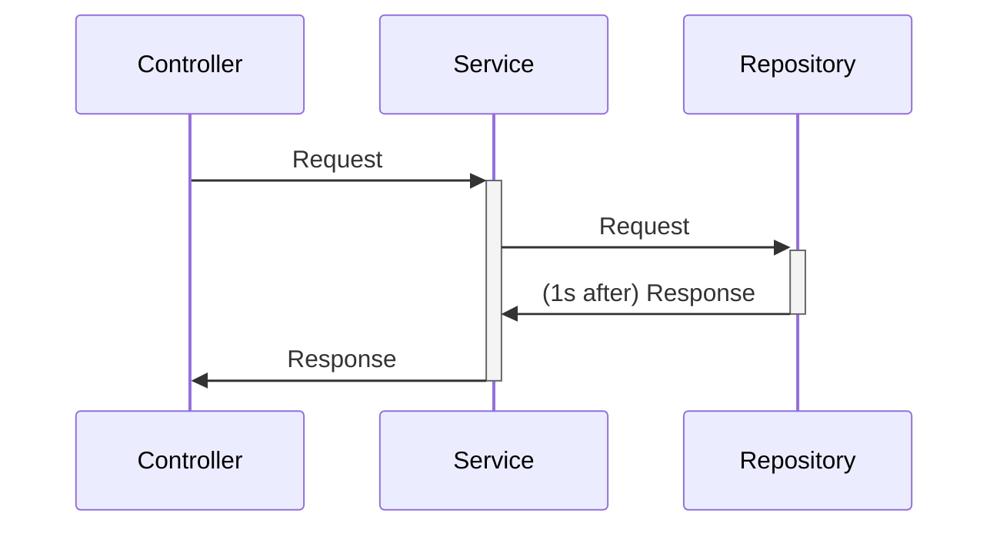
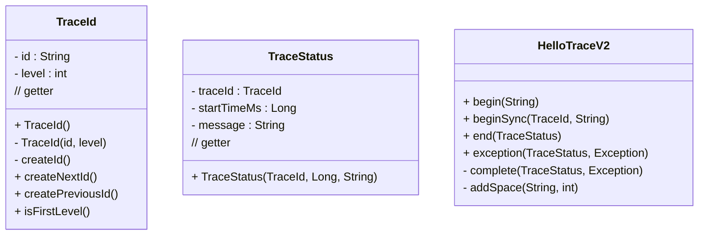
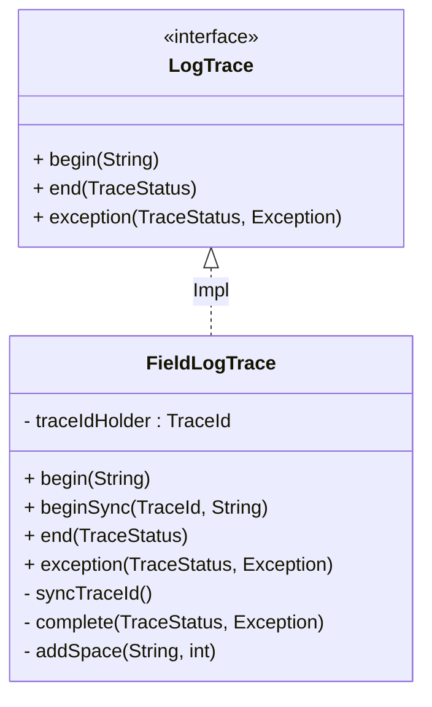
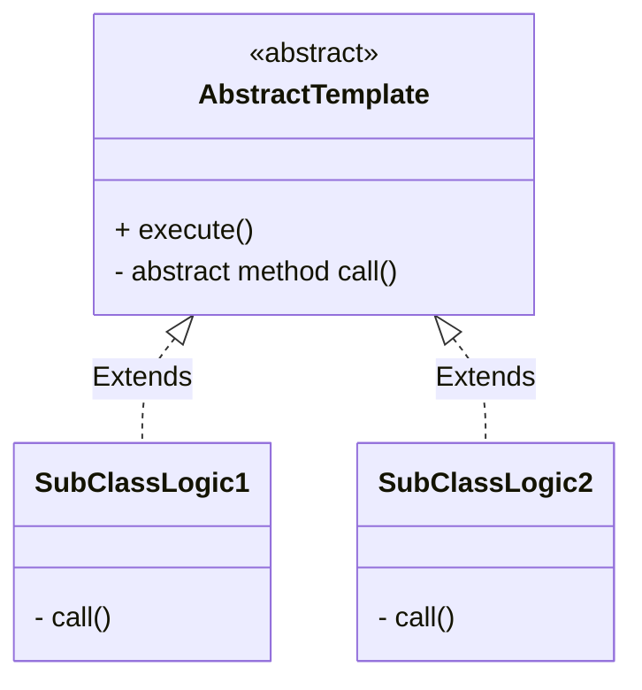
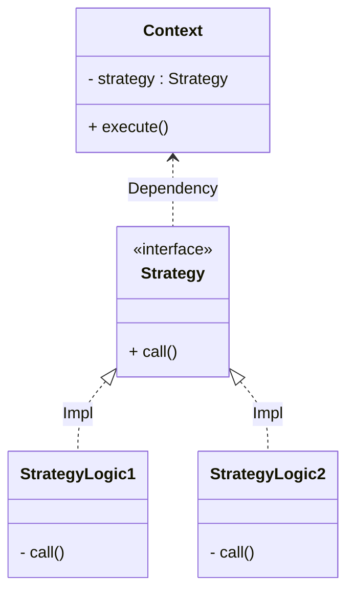
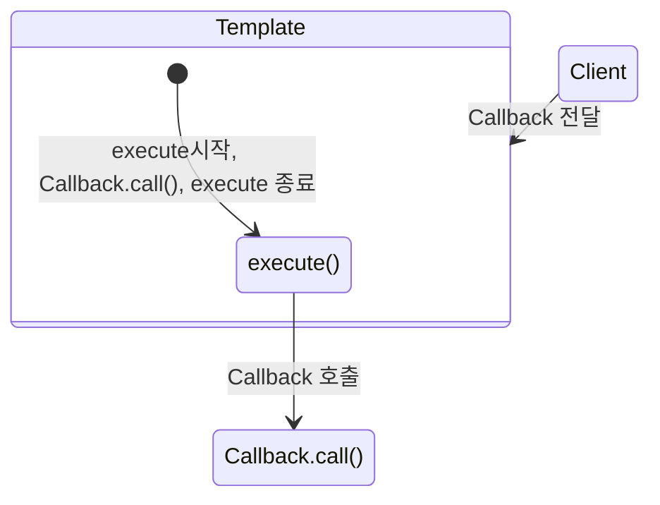

<!-- TOC -->

- [로그 추적기 개발](#%EB%A1%9C%EA%B7%B8-%EC%B6%94%EC%A0%81%EA%B8%B0-%EA%B0%9C%EB%B0%9C)
    - [**요구사항**](#%EC%9A%94%EA%B5%AC%EC%82%AC%ED%95%AD)
    - [구현](#%EA%B5%AC%ED%98%84)
- [**ThreadLocal**](#threadlocal)
- [**디자인 패턴을 통한 핵심기능과 부가기능 분리하기**](#%EB%94%94%EC%9E%90%EC%9D%B8-%ED%8C%A8%ED%84%B4%EC%9D%84-%ED%86%B5%ED%95%9C-%ED%95%B5%EC%8B%AC%EA%B8%B0%EB%8A%A5%EA%B3%BC-%EB%B6%80%EA%B0%80%EA%B8%B0%EB%8A%A5-%EB%B6%84%EB%A6%AC%ED%95%98%EA%B8%B0)
    - [템플릿 메소드 패턴 적용](#%ED%85%9C%ED%94%8C%EB%A6%BF-%EB%A9%94%EC%86%8C%EB%93%9C-%ED%8C%A8%ED%84%B4-%EC%A0%81%EC%9A%A9)
    - [전략 패턴 예제](#%EC%A0%84%EB%9E%B5-%ED%8C%A8%ED%84%B4-%EC%98%88%EC%A0%9C)
    - [템플릿 콜백 패턴 적용](#%ED%85%9C%ED%94%8C%EB%A6%BF-%EC%BD%9C%EB%B0%B1-%ED%8C%A8%ED%84%B4-%EC%A0%81%EC%9A%A9)

<!-- /TOC -->


# 로그 추적기 개발



## **요구사항**  

1. 모든 `public` 메서드의 호출과 응답 정보를 로그로 출력 
2. 애플리케이션의 흐름을 변경하면 안됨
3. 로그를 남긴다고 해서 비즈니스 로직의 동작에 영향을 주면 안됨 
4. 메서드 호출에 걸린 시간
5. 정상 흐름과 예외 흐름 구분
6. 예외 발생시 예외 정보가 남아야 함 메서드 호출의 깊이 표현
7. HTTP 요청을 구분
8. HTTP 요청 단위로 `특정 ID`를 남겨서 어떤 HTTP 요청에서 시작된 것인지 명확하게 구분이 가능해야 함
9. 트랜잭션 ID
10. 여기서는 하나의 HTTP 요청이 시작해서 끝날 때 까지를 **하나의 트랜잭션**이라 함

```
정상 요청
  [796bccd9] OrderController.request()
  [796bccd9] |-->OrderService.orderItem()
  [796bccd9] |   |-->OrderRepository.save()
  [796bccd9] |   |<--OrderRepository.save() time=1004ms
  [796bccd9] |<--OrderService.orderItem() time=1014ms
  [796bccd9] OrderController.request() time=1016ms

예외 발생
  [b7119f27] OrderController.request()
  [b7119f27] |-->OrderService.orderItem()
  [b7119f27] | |-->OrderRepository.save() [b7119f27] | |<X-OrderRepository.save() time=0ms ex=java.lang.IllegalStateException: 예외 발생! [b7119f27] |<X-OrderService.orderItem() time=10ms ex=java.lang.IllegalStateException: 예외 발생! [b7119f27] OrderController.request() time=11ms ex=java.lang.IllegalStateException: 예외 발생!
```

## 구현




`beginSync()`를 통해**로그에 대한 문맥 `Context`정보를 공유해야한다.**  
- `TraceId`의 정보들이 공유되어야 한다.  
첫 시점에서 사용한 `TraceId`를 다음 호출에 넘겨주어야 한다.  

```
[f4a8dddf] OrderControllerV2.request()
[f4a8dddf] |-->OrderServiceV2.request()
[f4a8dddf] |   |-->OrderRepositoryV2.request()
[f4a8dddf] |   |<--OrderRepositoryV2.request() time=1005ms
[f4a8dddf] |<--OrderServiceV2.request() time=1006ms
[f4a8dddf] OrderControllerV2.request() time=1007ms
```

**모든 요구사항은 만족하였지만 `TraceId`동기화가 필요하기 때문에 호출되는 메소드들은 메소드 시그니처들이 모두 변경되어야 한다는 단점이 존재한다.**  

***

# **ThreadLocal**

위의 문제를 해결하는 목적으로 사용된다.  



`FieldLogTrace`의 `traceIdHolder`의 필드를 통해 해당 `TraceId`를 공유하게 했다.  
하지만 **`FileLogTrace`는 싱글톤 빈으로 관리되기 때문에 동시에 여러 요청이 온다면 내부 필드인 `TraceIdHolder`에 대해 동시성 문제가 생긴다.**  
  
이 문제를 해결하기 위해 **ThreadLocal**을 사용한다.  
- **각 Thread마다 별도의 내부 저장소를 제공한다.**
- 따라서 같은 인스턴스의 Thread Local 필드에 접근해도 문제 없다.
- 자바는 ThreadLocal을 지원하기 위한 `java.lang.ThreadLocal`을 제공한다.
- 해당 Thread가 ThreadLocal을 모두 사용하고나면 `ThreadLocal.remove()`를 호출해서 지정된 값을 제거해줘야 한다.

```
이 클래스는 스레드 로컬 변수를 제공합니다. 이러한 변수는 (get 또는 set 메서드를 통해) 하나에 액세스하는 각 스레드가 고유하고 독립적으로 초기화된 변수 복사본을 갖는다는 점에서 일반 대응 변수와 다릅니다. 
ThreadLocal 인스턴스는 일반적으로 상태를 스레드와 연결하려는 클래스의 전용 정적 필드입니다(예: 사용자 ID 또는 트랜잭션 ID).
예를 들어 아래 클래스는 각 스레드에 고유한 식별자를 생성합니다. 스레드의 ID는 ThreadId.get() 을 처음 호출할 때 할당되며 후속 호출에서 변경되지 않습니다.
```

- [`baeldung` Java ThreadLocal](https://www.baeldung.com/java-threadlocal)
- [`baeldung` Java Thread Safety](https://www.baeldung.com/java-thread-safety)

  
1. `Thread` 클래스의 내부 필드인 `ThreadLocalMap`에 저장되며, `TerminatingThreadLocal<T> extends ThreadLocal<T>` 클래스가 `set()`과 `remove()`를 한다.  
2. WAS처럼 Thread Pool을 사용하는 경우에는 사용한 `ThreadLocal`은 꼭 삭제해야한다.  
3. `Thread Local`을 삭제하지 않은 `Thread`가 Pool에 돌아가게 되어, `Thread Local`이 계속 유지되기 때문에 꼭 삭제해야한다.

***

# **디자인 패턴을 통한 핵심기능과 부가기능 분리하기**

**핵심기능** - 비즈니스 로직, 변하는 부분  
**부가기능** - 시간 측정, 변하지 않는 부분  

## [템플릿 메소드 패턴 적용](https://github.com/jdalma/advanced/commit/7ccc4a142d3f5ea85a5e1c45d5d3f5395ffc7b16)

> 작업에서 알고리즘의 골격을 정의하고 일부 단계를 하위 클래스로 연기합니다  
> 템플릿 메서드를 사용하면 하위 클래스가 알고리즘의 구조를 변경하지 않고도 알고리즘의 특정 단계를 재정의 할 수 있습니다.

- [상속과 오버라이딩을 사용한 템플릿 메소드 패턴 테스트 코드](https://github.com/jdalma/advanced/commit/687d027c8b73ad3bb2b9aab5ec931eeb0d9ddaf2)
- 템플릿이라는 틀에 **변하지 않는 부분을 적용**
- 부모 클래스에 **변하지 않는 템플릿 코드를 두고**, 자식 클래스에 **변하는 부분을 두어** 상속과 오버라이딩을 사용한다.   



```java
AbstractTemplate template1 = new SubClassLogic1();
template1.execute();
```

`execute()`안에 자식 클래스들이 오버라이딩한 구현 메소드 `call()`이 호출된다.  
**변하지 않는 코드는 `AbstractTemplate.execute()`에 이미 작성되어 있다.**  
클래스가 계속 추가되어야 하는 단점이 있다..  
  

익명 내부 클래스를 사용하여 **인스턴스를 생성하면서 동시에 생성할 클래스를 상속 받은 자식 클래스를 정의할수도 있다.**  

```java
AbstractTemplate template1 = new AbstractTemplate() {
    @Override
    protected void call() {
        log.info("익명 내부 클래스 비즈니스 로직 1 실행");
    }
};
template1.execute();
```
  
템플릿 메소드 패턴은 **상속에서 오는 단점들을 그대로 안고간다.**  
자식 클래스는 부모 클래스와 컴파일 시점에 **강하게 결합되는 문제가 있다.**  
자식 클래스 입장에서는 부모 클래스의 기능을 전혀 사용하지 않는다.  
그럼에도 불구하고 `자식 클래스는 부모 클래스를 상속받아 의존하고 있다는 것이다.`  

## [전략 패턴 예제](https://github.com/jdalma/advanced/commit/c94747220a38dd9f0a9070e06ec09b762762eaa2)

> 알고리즘 제품군을 정의하고 각각을 캡슐화하며 상호 교환 가능하게 만든다.  
> 전략을 사용하면 알고리즘을 사용하는 클라이언트와 독립적으로 알고리즘을 변경할 수 있다.

템플릿 메서드 패턴과 비슷한 역할을 하면서 상속의 단점을 제거할 수 있는 디자인 패턴이 바로 **전략 패턴**이다.  
상속이 아니라 **위임**으로 해결한다.
- [토비의 스프링 `분리와 재사용을 위한 전략 패턴 적용` 참고](https://github.com/jdalma/tobyspringin5/wiki/3%EC%9E%A5.-%ED%85%9C%ED%94%8C%EB%A6%BF#322-%EB%B6%84%EB%A6%AC%EC%99%80-%EC%9E%AC%EC%82%AC%EC%9A%A9%EC%9D%84-%EC%9C%84%ED%95%9C-%EB%94%94%EC%9E%90%EC%9D%B8-%ED%8C%A8%ED%84%B4-%EC%A0%81%EC%9A%A9)
`Context`는 **변하지 않는 템플릿 역할**을 하고, `Strategy`는 **변하는 알고리즘 역할**을 한다.  



## [템플릿 콜백 패턴 적용](https://github.com/jdalma/advanced/commit/eb406eb06ae70fcaa65e752069c25c5d4b704c2b)

> **콜백 정의**  
> 프로그래밍에서 `콜백`또는 `콜 애프터 함수(call after function)`는 **다른 코드의 인수로서 넘겨주는 실행 가능한 코드를 말한다.**  
> 콜백을 넘겨받는 코드는 이 콜백을 필요에 따라 즉시 실행할 수도 있고, 아니면 나중에 실행할 수도 있다.

쉽게 보면 `Strategy`가 `Callback`이라고 보면 된다.  
스프링에서는 전략패턴 같은 방식을 **템플릿 콜백 패턴**이라고 한다. (GOF 패턴은 아니다.)  
템플릿과 콜백 부분이 강조된 패턴이라고 생각하면 된다.  

