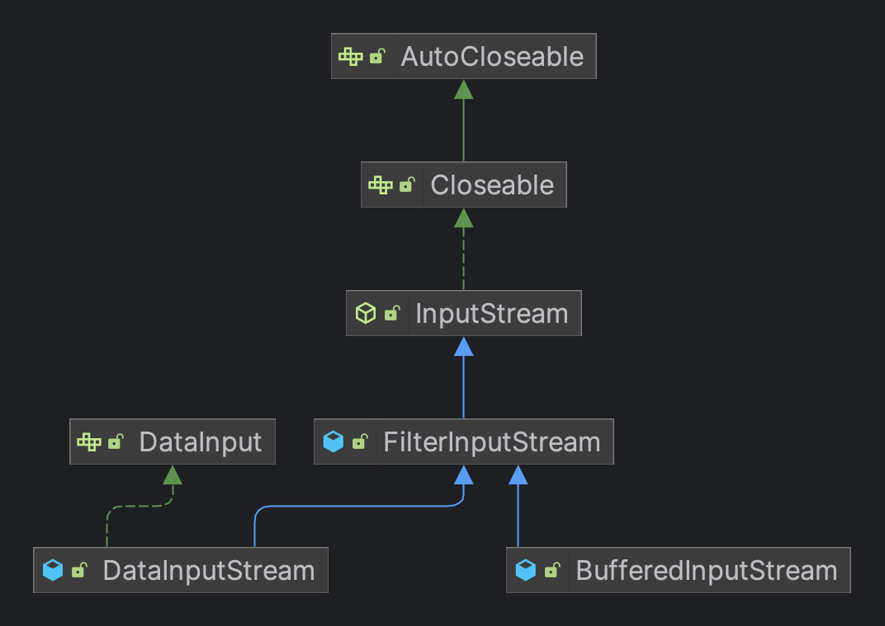

# **프록시 패턴**

프록시 패턴의 기본 기능은 **프록시 클래스를 생성하여 원본 클래스와 관련이 없는 기능을 추가하는 것** 이다.  
1. 주요 비즈니스와 관련 없는 요구 사항의 개발에 활용될 수 있다.
   - 모니터링, 통계, 인증, 트래픽 제한, 트랜잭션, 멱등성, 로깅과 같이 주요 비즈니스와 관련없는 요구 사항을 개발하는데 적합하다.
2. RPC에서 프록시 패턴을 적용할 수 있다.
   - RPC 프레임워크는 프록시 패턴의 응용 프로그램이다.
3. 캐시에 프록시 패턴을 적용할 수 있다.


## 인터페이스 기반의 프록시 패턴

프록시 패턴은 원본 클래스를 변경하지 않은 상태로 **프록시 클래스**를 도입하여 원본 클래스와 관련 없는 새로운 기능을 추가하는 것이다.  

```kotlin
class UserController(
  private val metricsCollector: MetricsCollector
) {
  
  fun login(tel: String, password: String) : UserVO {
    // 핵심 외 기능 : 실행 시작 시간 기록

    // 핵심 : 비즈니스 로직

    // 핵심 외 기능 : 실행 결과 시간 계산 및 Metric전달
  }
}
```

위의 예제를 보면 **성능 통계 코드가 비즈니스 코드를 침범해 밀접하게 결합되어 있다.**  
이후 `MetricsCollector`가 변경되어야 한다면 핵심 비즈니스 로직에도 수정이 일어날 확률이 높다.  
  
이때 비즈니스 코드에서 성능 통계 코드를 분리하기 위해 프록시 패턴이 유용하게 사용될 수 있다.  

```kotlin
interface IUserController {
    fun login(tel: String, password: String) : UserVO
}

class UserController: IUserController {
    override fun login(tel: String, password: String): UserVO {
        // 핵심 로직
    }
}

class UserControllerProxy (
    private val target: IUserController,
    private val metricsCollector: MetricsCollector
) : IUserController {
    override fun login(tel: String, password: String): UserVO {
        // 부가 기능
        target.login(tel, password)
        // 부가 기능
    }
}
```

위의 코드에서 클라이언트 코드는 `IUserController` 타입에 의존하지만 실제 구현체를 `UserControllerProxy`로 주입하게 되면 클라이언트 코드는 프록시의 기능 존재를 알아차릴 수 없다.  

## 상속 기반의 프록시 패턴

인터페이스 기반의 프록시 패턴에서는 원본 클래스와 프록시 클래스가 동일한 인터페이스를 구현했다.  
하지만 원본 클래스가 외부 라이브러리의 클래스일 뿐만 아니라 인터페이스를 정의하지 않고 있어서 클래스를 직접 수정할 수 없는 경우에 적합하다.  

```kotlin
open class UserController {
    open fun login(tel: String, password: String): UserVO {
        // 핵심 로직
    }
}

class UserControllerProxy (
    private val metricsCollector: MetricsCollector
) : UserController() {
    override fun login(tel: String, password: String): UserVO {
        // 부가 기능
        super.login(tel, password)
        // 부가 기능
    }
}
```

## 리플렉션 기반의 동적 프록시

앞의 예제는 프록시 클래스가 원본 클래스의 모든 메서드를 다시 구현해야하기 때문에 번거롭다.  
그리고 프록시 클래스가 늘어날수록 복잡도가 커진다.  
  
이 문제를 해결할 수 있는 방법은 **동적 프록시** 를 사용하여 각 원본 클래스에 대한 프록시 클래스를 미리 작성하는 대신, `코드를 실행하는 도중에 원본 클래스에 대한 프록시 클래스를 동적으로 생성하고, 코드 내의 원본 클래스를 프록시 클래스로 대체하는 것`을 말한다.  
통계적 성능이 필요한 클래스를 위해 프록시 클래스를 동적으로 생성해주는 `MetricsControllerProxy` 동적 프록시 클래스를 확인해보자.

```kotlin
fun main(args: Array<String>) {
    val proxy = MetricsControllerProxy()
    val controller: IUserController = proxy.createProxy(UserController()) as IUserController
    controller.hello("first")
    controller.bye("second")
}

interface IUserController {
    fun hello(name: String) : String
    fun bye(name: String) : String
}

class UserController : IUserController {
    override fun hello(name: String) = "hello $name"
    override fun bye(name: String) = "bye $name"
}

class MetricsControllerProxy {

    fun createProxy(proxiedObject: Any) : Any {
        val interfaces : Array<Class<*>> = proxiedObject.javaClass.interfaces
        val dynamicProxyHandler = DynamicProxyHandler(proxiedObject)
        return newProxyInstance(
            proxiedObject.javaClass.classLoader,
            interfaces,
            dynamicProxyHandler
        )
    }

    private class DynamicProxyHandler (
        private val proxiedObject: Any
    ) : InvocationHandler {
        override fun invoke(proxy: Any, method: Method, args: Array<out Any>): Any {
            val startTimeStamp = System.currentTimeMillis()

            val result = method.invoke(proxiedObject, args[0])

            val endTimeStamp = System.currentTimeMillis()
            val responseTime = endTimeStamp - startTimeStamp

            // responseTime Metric 기록
            println("response time : $responseTime, result : $result")

            return result
        }
    }
}
```

***

# **[데코레이터 패턴](https://github.com/jdalma/design-patterns/commit/9537c45bc4b9c53e0f9af0d4bd48c7503998fc2d)**

**기존 코드를 변경하지 않고 부가 기능을 추가하는 패턴**   
Java의 `IO 클래스 라이브러리`가 가지고 있는 기본 설계 사상을 분석하여 데코레이터 패턴을 설명할 수 있다.  

```java
InputStream bin = new BufferedInputStream(new FileInputStream("text.txt"))
```



이렇게 사용할 바에는 **FileInputStream** 클래스를 확장하여 캐싱을 지원하는 **BufferedFileInputStream** 클래스를 설계하는 것이 더 낫지 않을까?  
아래와 같이 말이다.

```java
InputStream bin = new BufferedFileInputStream("text.txt")
```

상속 구조가 비교적으로 간단하면 문제가 되지 않지만, InputStream 클래스에 수많은 하위 클래스가 존재하기 때문에, 모든 하위 클래스에 버퍼 기반의 읽기를 추가하게 되면 `Buffered`로 시작하는 수많은 하위의 하위 클래스를 파생시켜야 한다. [Hierarchy For Package java.io](https://docs.oracle.com/javase/8/docs/api/java/io/package-tree.html)  
추가로 기본 데이터 유형에 따라 데이터 캐싱과 읽기를 모두 지원하는 클래스가 필요하다면 다시 **BufferedData** 로 시작하는 수많은 하위 클래스를 만들어야 할 것이다.  
이러한 이유로 인해 **Java IO 클래스 라이브러리가 너무 커질 수 있기 때문에 상속이 아닌 `합성`을 사용했다.**  
  
그럼 데코레이터 패턴은 단순히 상속을 합성으로 대체하는 데 사용되는 패턴이라고 생각할 수도 있지만, 그렇지 않다.  
Java IO 클래스 라이브러리 설계에서 데커레이터 패턴이 사용된 이유는 합성 관계와 아래와 같은 차이점이 있다.  

<h3>데코레이터 클래스가 원본 클래스와 동일한 상위 클래스를 상속하기 때문에, 원본 클래스 내에 여러 개의 데코레이터 클래스를 중첩할 수 있다는 점</h3>

`FileInputStream`클래스에 대해 두 개의 데코레이터 클래스인 `Buffered`와 `Data` InputStream을 중첩하여 **기본 데이터 유형에 따라 버퍼 기반의 읽기와 데이터 읽기를 모두 지원하고 있다는 것을 알 수 있다.**  

```java
FileInputStream fileInputStream = new FileInputStream("test.txt");
BufferedInputStream bufferedInputStream = new BufferedInputStream(fileInputStream);
DataInputStream dataInputStream = new DataInputStream(bufferedInputStream);
```

<h3>데코레이터 클래스의 기능이 원본 클래스의 기능을 향상시키는 점</h3>

프록시 패턴과 데코레이터 패턴은 매우 유사하지만, **프록시 패턴의 프록시 클래스는 원본 클래스와 관련이 없는 기능을 추가하는 반면, 데코레이터 패턴의 데코레이터 클래스는 원본 클래스와 관련이 깊은 기능을 추가한다.**  

```java
public interface IA {
    void f();
}

public class A implements IA {
    public void f() { ... }
}

public class ADecorator implements IA {
    private IA a;
    public ADecorator(IA a) {
        this.a = a;
    }

    public void f() {
        // 기능 향상 코드
        a.f();
        // 기능 향상 코드
    }
}
```

**데코레이터 클래스는 개선해야 하는 메서드만 구현하고, 다른 메서드는 데코레이터 상위 클래스의 기본 구현을 상속한다.**  
핵심은 **원본 클래스에 `향샹된 기능을 추가`하는 것이며, 이는 데코레이터 패턴 사용 여부를 판단하는 중요한 기준이기도 하다.**  

## 코틀린 by 활용하기

```kotlin
fun main() {
    val starTrekRepository = DefaultStarTrekRepository()
    val withValidating = ValidatingAdd(starTrekRepository)
    val withLoggingAndValidating = LoggingGetCaptain(withValidating)
}

interface StarTrekRepository {
    operator fun get(starshipName: String): String
    operator fun set(starshipName: String, captainName: String)
}

class DefaultStarTrekRepository : StarTrekRepository {
    private val starshipCaptains = mutableMapOf("USS Enterprise" to "Jean-Luc Picard")

    override fun get(starshipName: String): String {
        return starshipCaptains[starshipName] ?: "Unknown"
    }

    override fun set(starshipName: String, captainName: String) {
        starshipCaptains[starshipName] = captainName
    }
}

class LoggingGetCaptain(private val repository: StarTrekRepository) : StarTrekRepository by repository {
    override fun get(starshipName: String): String {
        println("Getting captain for $starshipName")
        return repository[starshipName]
    }
}

class ValidatingAdd(private val repository: StarTrekRepository) : StarTrekRepository by repository {
    private val maxNameLength = 15
    override fun set(starshipName: String, captainName: String) {
        require(captainName.length < maxNameLength) {
            "$captainName name is longer than $maxNameLength characters!"
        }

        repository[starshipName] = captainName
    }
}
```

코틀린의 `by` 키워드를 활용하여 **인터페이스 구현을 다른 객체(주입받은 객체)에 위임한다.**  
그래서 인터페이스에 선언된 함수 중 원하는 것만 오버라이딩할 수 있다.

## 적용 예제

1. `InputStream`, `OutputStream`, `Reader`, `Writer`의 생성자를 활용한 랩퍼
2. `Collections`이 제공하는 데코레이터 메소드
   - `Collections.checkedXXX()`
   - `Collections.synchronizedXXX()`
   - `Collections.unmodifiableXXX()`
3. 웹플럭스 `ServerHttpRequestDecorator`, `ServerHttpResponseDecorator`
4. 빈 설정 데코레이터 `BeanDefinitionDecorator`

***

# **[어댑터 패턴](https://github.com/jdalma/design-patterns/tree/master/src/main/java/me/whiteship/designpatterns/_02_structural_patterns/_06_adapter)**
  
**조정에 따른 `적응 adaptation`에 사용되며, 호환되지 않는 인터페이스를 호환 가능한 인터페이스로 변환하여, 두 클래스를 함께 작동할 수 있게 한다.**  
**어댑터를 사용하는 큰 이유 중 하나는 클라이언트가 일관되게 사용하기 위함** 이므로 예를 들어 라이브러리 내부에 있는 메서드의 시그니처가 많은 파라미터를 받을 때 어댑터 패턴을 적용해서 파라미터를 클래스로 래핑해서 사용하도록 하는 것이다.  
`상속 관계`를 사용한 **클래스 어댑터** 와 `합성 관계`를 사용한 **객체 어댑터**에 대해 살펴보자.  
  
```kotlin
interface ITarget {
    fun f1()
    fun f2()
    fun fc()
}

open class Adaptee {
    fun fa() { TODO() }
    fun fb() { TODO() }
    fun fc() { TODO() }
}

class InheritanceAdaptor : Adaptee(), ITarget {
    override fun f1() {
        // do something
        super.fa()
        // do something
    }
    override fun f2() {
        // do something
        super.fb()
        // do something
    }
}

class CompositeAdaptor(
    private val adaptee: Adaptee
) : ITarget {
    override fun f1() {
        adaptee.fa()
    }
    override fun f2() {
        adaptee.fb()
    }
    override fun fc() {
        adaptee.fc()
    }
}
```

위의 예제처럼 **파라미터 자체가 없거나 파라미터가 동일한 경우에는 어댑터의 패턴이 큰 역할을 한다고 볼 수 없다.**  
**상속 기반 어댑터** 는 `fc`메소드를 추가적으로 구현해 줄 필요가 없는 것이 큰 차이점이다.  
  
그럼 어떤 것을 선택해야 할까?  
**`Adaptee` 수** 와 **`Adaptee` 와 `ITarget`인터페이스 간의 적합도** 를 비교해야 한다.  

1. Adaptee가 많지 않다면 두 방식 중 어느 것을 사용해도 무방하다.
2. Adaptee와 ITarget 인터페이스의 정의가 대부분 같다면 Adapter 클래스가 상위 클래스 Adaptee를 재사용할 수 있으므로 클래스 어댑터를 사용하는 것이 좋다. **실제로 객체 어댑터에 비해 클래스 어댑터의 코드가 더 작다.**
3. Adaptee와 ITarget 인터페이스의 정의가 대부분 다르다면, **상속 구조보다 유연한 합성 구조 기반의 객체 어댑터를 사용하는 것이 좋다.**

> "어댑터 패턴은 설계 결함을 **교정** 하는 **보상 패턴** 으로 볼 수 있다."  
> "이 패턴을 적용해야 한다는 것은 이미 **어쩔 수 없는 상황** 에 도달했다는 뜻이며, 설계 초기 단계에서 **인터페이스 비호환성 문제를 피할 수 있다면 이 패턴은 사용될 필요가 없다.**"

<h3>결함이 있는 인터페이스 설계가 캡슐화된 경우</h3>

외부 시스템의 인터페이스 설계가 많은 정적 메서드를 포함하는 것과 같은 결함이 있다면, 코드의 테스트 용이성에 영향을 미치게 된다.  
설계 결함을 분리하기 위해 **외부 시스템에서 제공하는 인터페이스를 다시 캡슐화해 높은 사용성과 테스트 용이성을 인터페이스로 재구축하고 싶다면 해당 패턴이 적절하다.**  

```kotlin
open class ExternalLibraryClass {
    companion object {
        fun staticFunction() { TODO() }
    }
    fun function1(param1 : String, param2 : Int) { TODO() }
    fun function2(param1 : Int) { TODO() }
}

interface ITarget {
    data class ParamsWrapper (
        val param1: String,
        val param2: Int
    )
    fun function1(wrapper: ParamsWrapper)
    fun function2(param1: Int)
    fun function3()
}

class Adaptor : ExternalLibraryClass(), ITarget {
    override fun function1(wrapper: ITarget.ParamsWrapper) {
        super.function1(wrapper.param1, wrapper.param2)
    }
    override fun function3() {
        staticFunction()
    }
}
```

<h3>여러 클래스의 인터페이스 설계를 통합한 경우</h3>

어댑터 패턴을 통해 인터페이스를 통합하고 조정한 다음, 다형성을 사용하여 코드 논리를 재사용할 수 있다.  
예를 들어, 사용자가 입력한 텍스트에서 민감한 단어를 필터링해야 한다고 생각해보자.  

```kotlin
class ASensitiveWordsFilter {
    fun filterObsceneWords(text: String): String {
        TODO("*** 문자로 필터링한 문자열을 반환")
    }

    fun filterPoliticalWords(text: String): String {
        TODO("*** 문자로 필터링한 문자열을 반환")
    }
}

class BSensitiveWordsFilter {
    fun filter(text: String) : String {
        TODO("*** 문자로 필터링한 문자열을 반환")
    }
}

class CSensitiveWordsFilter {
    fun filter(text: String, mask: String) : String {
        TODO("mask 문자로 필터링한 문자열을 반환")
    }
}
```

위와 같이 3개의 필터 클래스들의 메서드 이름과 파라미터가 다른 것을 알 수 있다.  
여기에 어댑터 패턴을 사용하여 통합 인터페이스 정의에 맞게 사용할 수 있다.  

```kotlin
interface ISensitiveWordsFilter {
    fun filter(text: String) : String
}

class ASensitiveWordsFilter: ISensitiveWordsFilter {
    private fun filterObsceneWords(text: String): String {
        TODO("*** 문자로 필터링한 문자열을 반환")
    }

    private fun filterPoliticalWords(text: String): String {
        TODO("*** 문자로 필터링한 문자열을 반환")
    }

    override fun filter(text: String): String {
        TODO("내부 메서드 호출")
    }
}

class RiskManagement {
    private val filters = mutableListOf<ISensitiveWordsFilter>()

    fun addSensitiveFilter(filter: ISensitiveWordsFilter) {
        this.filters.add(filter)
    }

    fun filterSensitiveWords(text: String): String {
        var filtered = text
        this.filters.forEach {
            filtered = it.filter(filtered)
        }
        return filtered
    }
}
```

<h3>이전 버전 인터페이스와 호환성이 필요한 경우</h3>

버전을 업그레이드 할 때 더 이상 사용되지 않는 인터페이스를 직접 삭제하는 대신, `deprecated`로 설정한 후 내부 동작을 새 인터페이스 구현에 위임할 수 있다.  
이렇게 할 경우 **여전히 이전 인터페이스를 사용하는 프로젝트가 새로운 인터페이스로 전환할 시간을 벌어준다는 장점이 있다.**  
  
JDK 1.0에는 컬렉션 컨테이너를 순회하는 `Enumeration` 클래스가 포함되어 있었지만, JDK 2.0에서는 이 클래스를 리팩토링하면서 `Iterator`로 이름을 변경했다.  
이때 JDK 2.0에서 `Enumeration` 곧바로 제거했다면 JDK 업그레이드를 하면 컴파일 조차 성공할 수 없을 것이다.  
따라서 JDK의 하위 버전을 사용하는 이전 코드와 호환되도록 하기 위해 **Enumeration 클래스는 JDK 2.0에서 일시적으로 유지되고, 해당 구현은 Iterator 클래스에 대한 직접 호출로 대체된다.**  

```java
/**
 * 지정된 컬렉션에 대한 열거형을 반환합니다. 이는 열거형을 입력으로 요구하는 레거시 API와의 상호 운용성을 제공합니다.
 * Enumeration.asIterator() 호출에서 반환된 반복자는 지정된 컬렉션에서 요소 제거를 지원하지 않습니다. 
 * 이는 반환된 열거형의 기능이 의도치 않게 증가하는 것을 방지하는 데 필요합니다.
 */
public static <T> Enumeration<T> enumeration(final Collection<T> c) {
    return new Enumeration<T>() {
        private final Iterator<T> i = c.iterator();

        public boolean hasMoreElements() {
            return i.hasNext();
        }

        public T nextElement() {
            return i.next();
        }
    };
}
```

<h3>다양한 형식의 데이터에 적응해야 할 경우</h3>

앞서 언급했듯이 어댑터 패턴은 주로 인터페이스 적응에 사용되며, **실제로 다른 형식의 데이터 사이에 적응이 필요할 때도 사용할 수 있다.**  

<h3>자바 로깅과 어댑터 패턴</h3>

Java에서는 Log4j, Logback, JDK의 JUL, Apache의 JCL과 같이 많은 로깅 프레임워크가 있고 debug, info, warn, error 같은 다양한 수준의 로그를 출력하는 유사한 기능을 제공하고 있지만 **인터페이스는 모두 제각각 통합되어 있지 않다.**  
  
실제로 SLF4J 로깅 프레임워크는 JDBC 사양과 동일하게 로그 출력을 위한 통합된 인터페이스 사양을 제공하고 있다.  
하지만 이 프레임워크는 구체적힌 구현 코드 없이 **인터페이스만 제공하고 있다.**  
때문에 Log4j, Logback과 같은 다른 로깅 프레임워크와 함께 사용해야 한다.  
JUL,JCL,Log4j 같은 오래된 로깅 프레임워크는 SLF4J보다 먼저 등장헀기 때문에, 버전 호환성을 희생하면서 SLF4J 인터페이스에 호환성을 맞추도록 요구할 수 없다.  
**SLF4J는 이를 미리 고려한 통합 인터페이스 정의를 제공할 뿐만 아니라 다양한 로깅 프레임워크에 대한 어댑터도 제공하고 있다.**  
**SLF4J는 서로 다른 로그 프레임워크의 인터페이스를 다시 캡슐화하고 통일된 SLF4J 인터페이스 정의에 적용한다.**  

Log4j 로깅 프레임워크의 어댑터 `Log4jLoggerAdapter`는 `LocationAwareLogger` 인터페이스를 구현하고, `LocationAwareLogger`는 `Logger` 인터페이스를 상속하며, `Log4jLoggerAdapter`는 [Logger 인터페이스](https://www.slf4j.org/api/org/slf4j/Logger.html) 인터페이스를 구현한다.  
  
**SLF4J 에서 제공하는 인터페이스를 사용하여 로그 출력 코드를 작성하며, 어떤 로깅 프레임워크를 사용할지는 Java의 [SPI 기술](https://objeto.tistory.com/30)을 사용하여 동적으로 지정할 수 있으며, 필요한 SDK를 프로젝트에 추가하면 된다.**  


- **UserDetail** , **UserDetailsService** 인터페이스가 `Target`에 해당한다
- **Account** 와 **AccountService**가 `Adaptee`에 해당한다
- 📌
  - 어떻게 **UserDetailsService**와 **AccountService**를 연결할 것 인가?
  - 어떻게 **Account**와 **UserDetails**를 연결할 것인가?

## 래퍼 패턴

프록시 패턴, 데코레이터 패턴, 어댑터 패턴의 구조는 매우 유사하지만, 실제로 패턴을 적용할 수 있는 시나리오가 다르다.  
프록시 패턴은 **원본 클래스의 인터페이스를 변경하는 대신, 원본 클래스에 대한 프록시를 정의한다. 주요 목적은 기능을 향상 시키는 것이 아니라 `클래스를 외부에서 제어`하는 것이다.** 이것이 데코레이터 패턴과의 큰 차이점이다.  
데코레이터 패턴은 원본 클래스의 인터페이스 변경 없이도 원본 클래스의 기능을 향상시키고 여러 데코레이터 클래스의 중첩 사용을 지원하는 사후 수정 전략에 해당한다.  
**어댑터 패턴은 원본 클래스와 다른 인터페이스를 제공하는 반면, 프록시 패턴과 데코레이터 패턴은 원본 클래스와 동일한 인터페이스를 제공한다.**  
  
코드 구조 측면에서는 이 세 가지 디자인 패턴을 **래퍼 패턴** 으로 구분한다.  
래퍼 패턴은 **원본 클래스를 래퍼 클래스를 통해 두 번 캡슐화 하는 패턴으로, 기본적인 구조는 아래와 같다.**  
  
```kotlin
interface Interface {
    fun f1()
    fun f2()
}

class OriginClass : Interface {
    override fun f1() { TODO("do something") }
    override fun f2() { TODO("do something") }
}

class WrapperClass (
    private val origin: OriginClass
) : Interface {
    override fun f1() {
        TODO("부가 기능")
        this.origin.f1()
        TODO("부가 기능")
    }

    override fun f2() {
        TODO("부가 기능")
        this.origin.f2()
        TODO("부가 기능")
    }
}
```

***

# **브릿지 패턴**

상속 대신 합성을 사용하는 방법을 알아보자.  
이는 일반적으로 사용될 뿐만 아니라 간단하여 이해하기 쉽고, **복잡한 상속 관게를 간단한 합성 관계로 단순화할 수 있다.**  

> **추상화와 구현을 디커플링해야만 두 가지가 서로 독립적으로 변화할 수 있다.**  
> 클래스에는 독립적으로 변하는 두 개 또는 그 이상의 차원이 존재하고, 합성 메서드를 통해 이 클래스를 두 개 또는 그 이상의 차원에서 확장할 수 있다.  

```kotlin
fun interface Weapon{
    fun attack():Int
}
val rifle = Weapon { 5 }
fun interface Leg{
    fun move():Int
}
class AthleticLeg(private val speed:Int, private val jump:Int):Leg{
    override fun move(): Int = speed * jump
}
class StormTrooper(weapon:Weapon, leg:Leg):Weapon by weapon, Leg by leg

val stormTrooper = StormTrooper(rifle, AthleticLeg(5, 2))
```

핵심은 **클래스 계층 구조를 얕게 만듦으로써 시스템에서 구체 클래스의 수를 줄이는 것이다.**  
뿐만 아니라 부모 클래스를 수정했을 때 자식 클래스에서 발견하기 어려운 버그가 발생하는 현상을 뜻하는 `깨지기 쉬운 기반 클래스 문제`를 예방하는 데에도 도움이 된다.  
  
서로 무관한 두 가지의 독립적인 속성 `무기 종류`와 `이동 속도`를 추상화하여 `Trooper`구현체에 의존성 주입을 통해 확장에 유연해졌다.  
만약 `StormTrooper`가 메서드를 오버라이딩해서 Weapon과 Leg가 서로 협력하게된다면 퍼사드라고 볼 수 있다.

# **합성 패턴**


