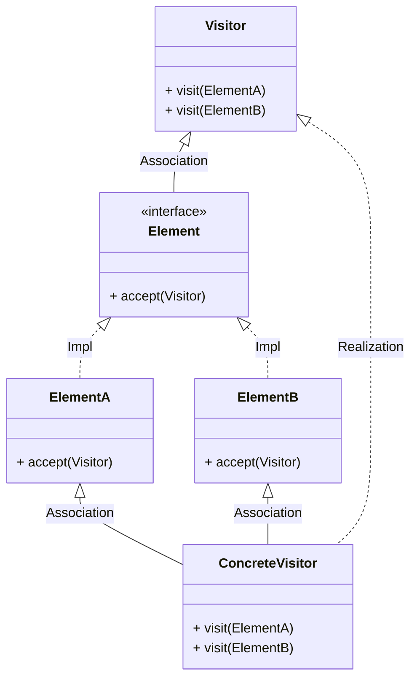
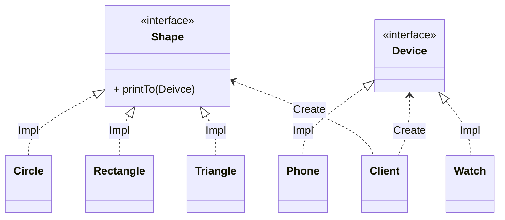
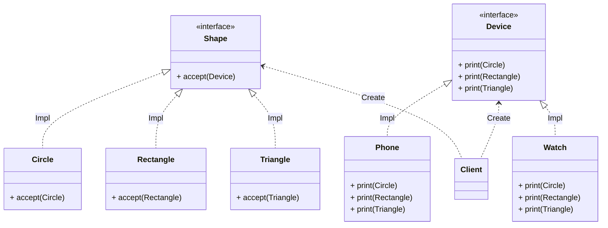
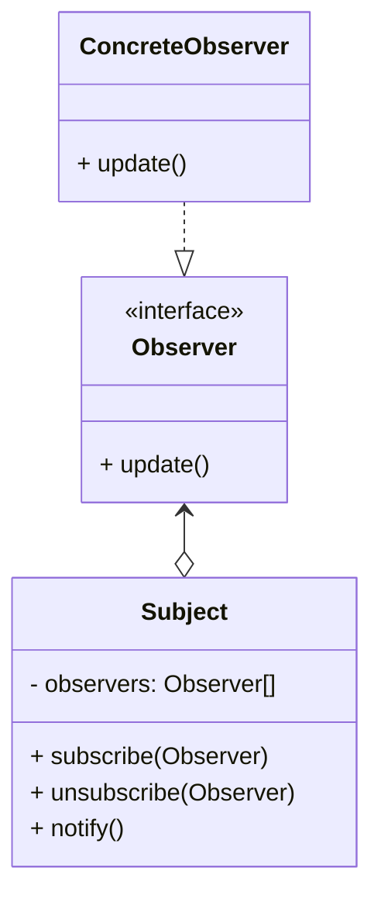
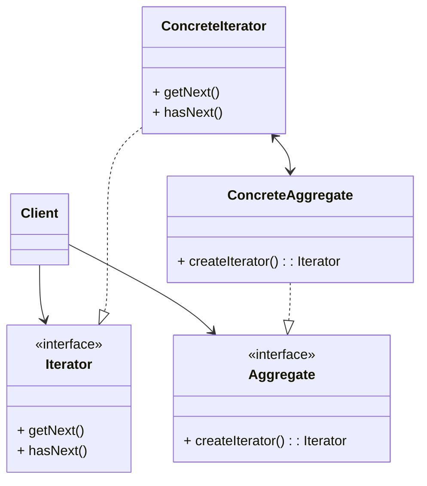
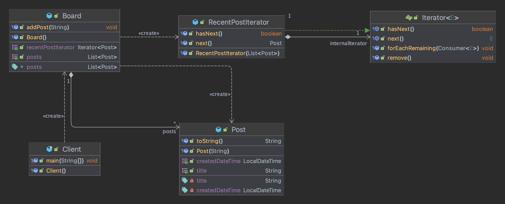
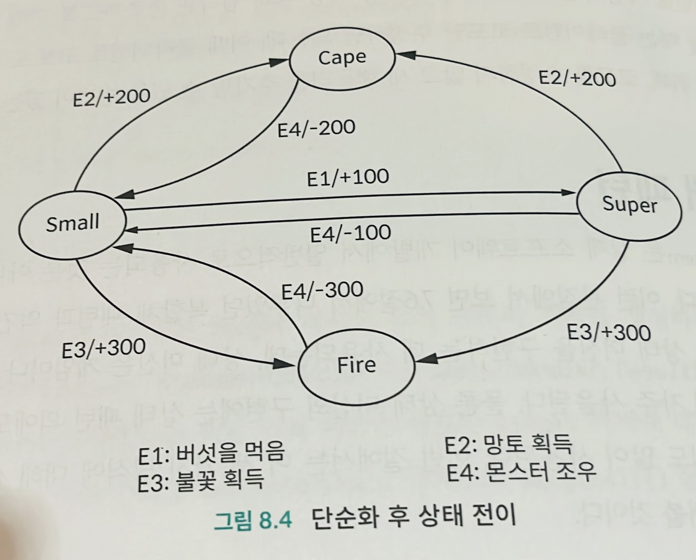

# [방문자 패턴](https://github.com/jdalma/design-patterns/tree/master/src/main/java/me/whiteship/designpatterns/_03_behavioral_patterns/_23_visitor)

**기존 코드를 변경하지 않고 새로운 기능을 추가하는 방법**  
- `더블 디스패치 (Double Dispatch)`를 활용할 수 있다.
- 디스패치란? **요청이 들어오면 다형성을 적용하여 구체적인 클레스나 메소드를 런타임에 위임하는 과정이다**
- `Visitor`는 `Element`를 알고있고, `Visitor`의 구현체인 `ConcreteVisitor`가 `ElementA`와 `ElementB`를 선택하여 호출하는 것



**여러 디바이스의 출력 기능을 구현하기**  
- 디바이스별로 출력 기능을 구분하려한다면 `Rectangle`안에서 `Watch`면 **작게** `Phone`이면 **크게** 분기로 해야할 것이다.

## Before



```java
public void printTo(Device device) {
    if (device instanceof Phone) {
        System.out.println("print Circle to phone");
    } else if (device instanceof Watch) {
        System.out.println("print Circle to watch");
    }
}
```

이런 식의 **분기문이 추가될 것이 뻔하다.**  

## After



1. `Shape`의 구현체들 `Circle`,`Rectangle`,`Triangle`이 **Element**
2. `Device` 인터페이스가 **Visitor**
3. `if-else` 분기문들이 사라지고 **실제 Device 구현체들이 어떤 작업을 처리할지 정한다.**
4. **Dispatch가 두 번 일어난다**
   1. `Shape`에 있는 `accept()`를 호출하기 위해 어디 구현체의 `accept()` 인지 확인하고
   2. 어떤 `Device`의 `print()`인지 확인한다.

```java
public static void main(String[] args) {
    Shape rectangle = new Rectangle();
    Device device = new Phone();
    rectangle.accept(device);
}
```

## 장점과 단점

1. 기존 코드를 수정하지 않고 확장이 가능하다 `OCP`
   1. 추가되는 `Device`들은 각 `print`만 구현하면 된다
2. 구조가 복잡하여 **더블 디스패치를 이해하기가 힘들다.**
3. `Element`가 추가되거나 사라지면 각 `Deivce` 구현체들의 코드가 다 수정되어야 한다.

## 적용 예시

1. 자바
   1. FileVisitor, SimpleFileVisitor
      1. `FileVisitResult`를 반환한다.
   2. AnnotationValueVisitor
   3. ElementVisitor
2. 스프링
   1. **BeanDefinitionVisitor**

***

# [옵저버 패턴](https://github.com/jdalma/design-patterns/commit/33aed09b07c54f1ba98e94a1113a8d7a6d30c918)

사용자1이 메세지를 등록하면 사용자2는 어떻게 메세지를 받아야할까?  
**폴링**보단 사용자1이 메세지를 등록하면 상태 변경을 받아 사용자2에게 전송을 해주는것이 더 합리적일 것이다.  
  
**다수의 객체가 특정 객체 상태 변화를 감지하고 알림을 받는 패턴**  
- `발행-구독 패턴`을 구현할 수 있다.

[UML Aggregation, Composition?](https://www.nextree.co.kr/p6753/)



`ChatServer`는 `Map`으로 주제에 해당하는 구독자들을 관리한다.  
클라이언트에서 `sendMessage()`를 호출한다면, 주제에 해당하는 구독자들을 순회하며 메세지를 전송한다.  
  
**장점**    
상태를 변경하는 객체`Publisher`와 변경을 감지하는 객체`Subscriber`의 관계를 느슨하게 유지할 수 있다.  
`Subject`의 상태 변경을 주기적으로 조회하지 않고 자동으로 감지할 수 있다.  
런타임에 구독자(Observer)를 추가하거나 제거할 수 있다.  
  
**단점**  
인메모리로 관리할 시 다수의 구독자(Observer)객체를 등록이후 해지하지 않는다면 메모리 누수가 발생한다.  
  
**자바에서 찾아보는 옵저버 패턴**  
`java.util.Observer`와 `java.util.Observable`은 자바 9이후 부터 권장되지 않는다.  
1. **`java.util.concurrent.Flow` 사용을 권장한다.** [예제](https://gist.github.com/jdalma/4cafecfe12609baf2db35180e5ee1297)
   - [Reactive Streams](http://www.reactive-streams.org/) 사양에 해당한다.  
   - 비동기 프로그래밍을 통해 백프레셔 조절도 가능하다.
2. **`java.beans.PropertyChangeListener`와 `java.beans.PropertyChangeSuppoer` 사용을 권장한다.** [예제](https://gist.github.com/jdalma/5d4f08dd779df841420cd03d0e1e8489)
  
**스프링에서 찾아보는 옵저버 패턴**  
1. SpringApplication [예제](https://gist.github.com/jdalma/bdd78ab34ea272f7811d8746d5a801b7)
   - `ApplicationEventPublisher`
   - `ApplicationEvent`
   - `ApplicationRunner`
     - 스프링 부트가 제공하는 인터페이스
     - [Spring Boot 애플리케이션에서 ApplicationRunner를 사용하는 방법은 무엇입니까?](https://jhooq.com/applicationrunner-spring-boot/)
     - [`spring docs` Application Availability](https://docs.spring.io/spring-boot/docs/current/reference/htmlsingle/#features.spring-application.application-availability)
     - [`spring docs` ApplicationRunner 또는 CommandLineRunner 사용](https://docs.spring.io/spring-boot/docs/current/reference/htmlsingle/#features.spring-application.command-line-runner)

***

# [반복자 패턴](https://github.com/jdalma/design-patterns/commit/7b2ba06f4ac178d833a034902e4dcde09a15f4e9)

많은 프로그래밍언어는 `Iterator`를 제공한다. 이때 기본 제공되는 반복자를 사용하는 것이 일반적이며, 반복자를 직접 구현하는 경우는 거의 없다.  
반복자의 기본 구현 원칙은 **반복자 패턴** 이며 사용되는 이유와 원칙을 이해하면 더 유용하게 활용할 수 있다.  
코틀린에서는 `operator`인 `iterator`를 구현하여 사용할 수 있다. [코틀린 예제](https://github.com/jdalma/kotlin-playground/blob/main/src/test/kotlin/_20_Operator/IterableTest.kt)  
  
반복자는 컬렉션을 정해진 순서대로 가져올 때 사용되며, **컬렉션** 은 배열, 링크드 리스트, 트리, 그래프 등 데이터를 포함하고 있는 컨테이너를 의미한다.  
반복자 패턴은 **컬렉션의 순회 작업을 컬렉션에서 분리한 후, 반복자에 넣어 컬렉션과 반복자의 책임이 단일하게 되도록 한다.**  

**집합 객체 내부 구조를 노출시키지 않고 순회하는 방법을 제공하는 패턴**  
- 집합 객체를 순회하는 클라이언트 코드를 변경하지 않고 다양한 순회 방법을 제공할 수 있다.
  




클라이언트는 `Board`안에 `Post`가 어떤 자료구조로 관리되고 있는지 모르게 하기 위해 `Iterator`를 구현한 `ConcreteIterator`를 추가하여 `Board`에서 해당 `Iterator`를 반환하여, 클라이언트는 해당 `Iterator`에만 의존하게 한다.  
  
- **장점**  
  - 집합 객체가 가지고 있는 객체들에 손쉽게 접근할 수 있다.  
  - 일관된 인터페이스를 사용해 여러 형태의 집합 구조를 순회할 수 있다.  
- **단점**  
  - 클래스가 늘어나고 복잡도가 증가하며 `Aggregate`인 `Board`가 수정되어야 할 것이다.  
- **자바에서 사용되는 이터레이터 패턴**  
  - `java.util.Enumeration`
  - 자바가 제공하는 `StAX`(Streaming Api For XML)라이브러리
    - 콘솔(커서) 기반의 API
      - 하나의 인스턴스만을 사용하여 내부의 내용만 변경됨
    - [이터레이터 기반의 API](https://github.com/jdalma/design-patterns/blob/master/src/main/java/me/whiteship/designpatterns/_03_behavioral_patterns/_16_iterator/_03_java/IteratorInJava.java)를 제공한다
      - 모든 요소당 새로운 인스턴스를 생성
- **스프링에서 사용되는 이터레이터 패턴**  
  - `org.springframework.util.CompositeIterator`
  
## 반복자를 사용하는 이유는 무엇일까?

배열이나 링크드 리스트와 같은 데이터 구조의 순회 방법은 간단하지만, 트리나 그래프처럼 복잡한 데이터 구조의 **전위 순회** , **중위 순회** , **후위 순회** , **깊이 우선 탐색** , **넓이 우선 탐색** 같은 여러 가지 복잡한 방법도 존재한다.  
자료 구조를 사용하는 클라이언트가 이러한 순회 알고리즘을 직접 구현한다는 것은 개발 비용도 비싸고 오류를 발생시키기 쉽다.  
구현한다고 해도 컬렉션에서 순회를 구현한다면 컬렉션 클래스 코드의 복잡도가 증가하기도 한다.  
  
이때, 위와 같은 순회 방법을 구현하는 책임을 다른 클래스로 분리하여 복잡도를 낮출 수 있다. 그리고 특정 자료구조에 두 개의 반복자 클래스를 할당할 수도 있다.  


***

# 책임 연쇄 패턴

아래의 예제는 모두 (GoF 디자인 패턴에서 정의된) 책임 연쇄 패턴은 체인 내 프로세서가 요청을 처리할 수 있으면 요청이 더 이상 다음으로 전달되지 않는 예제이다.  
여기서 다루지 않지만 모든 프로세서에서 처리되는 변형된 패턴도 존재한다.  
예를 들어, 민감한 단어가 포함된 콘텐츠를 처리한다고 생각해보자.  
민감한 단어가 포함되어 있을 때 게시 자체를 금지하는 방법은 아래의 예제와 같은 방식이지만, 민감한 단어들을 `***`로 변경시켜서 게시하는 방법은 모든 프로세서가 작동되는 방식으로 해결 가능하다.  

<h3>링크드리스트 구조</h3>

`MessageHandler` 클래스는 모든 핸들러 클래스의 추상 상위 클래스이다.  
구현 클래스들은 `MessageHandlerChain`을 통해 **체인 헤드** 와 **체인 테일** 을 기록하고 있는 링크드 리스트로 관리된다.  
핸들러가 요청을 처리할 수 있으면 전달이 중단되며, 해당 핸들러가 처리할 수 없으면 `handler.handle()`을 통해 다음으로 전달한다.  

```kotlin
abstract class MessageHandler {
    var nextHandler: MessageHandler? = null

    fun handle(message: String) {
        val handled = this.doHandle(message)
        if (nextHandler != null && !handled) {
            nextHandler?.handle(message)
        }
    }
    protected abstract fun doHandle(message: String) : Boolean
}

class NumberHandler : MessageHandler() {
    override fun doHandle(message: String): Boolean {
        println("NumberHandler doHandle 호출 - message[$message]")
        var handled = false
        if (isOnlyDigit(message)) {
            println("NumberHandler 가 처리")
            handled = true
        }
        return handled
    }

    private fun isOnlyDigit(message: String) = message.all { it.isDigit() }
}

class TextHandler : MessageHandler() {
    override fun doHandle(message: String): Boolean {
        println("TextHandler doHandle 호출 - message[$message]")
        var handled = false
        if (isOnlyChar(message)) {
            println("TextHandler 가 처리")
            handled = true
        }
        return handled
    }

    private fun isOnlyChar(message: String) = message.all { it.isLetter() }
}

class MessageHandlerChain {
    private var head: MessageHandler? = null
    private var tail: MessageHandler? = null

    fun addHandler(handler: MessageHandler) {
        handler.nextHandler = null
        if (head == null) {
            head = handler
            tail = handler
            return
        }
        tail?.nextHandler = handler
        tail = handler
    }

    fun handle(message: String) = head?.handle(message)
}

fun main(args: Array<String>) {
    val handlerChain = MessageHandlerChain()
    val number = "123456"
    val text = "text"
    handlerChain.addHandler(NumberHandler())
    handlerChain.addHandler(TextHandler())
    handlerChain.handle(number)
    handlerChain.handle(text)
}
```

```
NumberHandler doHandle 호출 - message[123456]
NumberHandler 가 처리
NumberHandler doHandle 호출 - message[text]
TextHandler doHandle 호출 - message[text]
TextHandler 가 처리
```

추가적으로 `MessageHandler`에 **템플릿 메서드 패턴** 을 적용하여 각 구현체 핸들러 클래스에서 `handler.doHandle()`을 직접 호출하지 않게 한것도 포인트이다.  
구현체 클래스에서 다음 `handler`의 호출 책임을 부모 클래스인 `MessageHandler`가 가지고 있게 하여 구현체 클래스는 자신이 처리할 비즈니스 로직에만 집중할 수 있다.

<h3>리스트 구조</h3>


```kotlin
interface IMessageHandler {
    fun handle(message: String) : Boolean
}

class NumberHandler : IMessageHandler {
    override fun handle(message: String): Boolean {
        println("NumberHandler doHandle 호출 - message[$message]")
        var handled = false
        if (isOnlyDigit(message)) {
            println("NumberHandler 가 처리")
            handled = true
        }
        return handled
    }

    private fun isOnlyDigit(message: String) = message.all { it.isDigit() }
}

class TextHandler : IMessageHandler {
    override fun handle(message: String): Boolean {
        println("TextHandler doHandle 호출 - message[$message]")
        var handled = false
        if (isOnlyChar(message)) {
            println("TextHandler 가 처리")
            handled = true
        }
        return handled
    }

    private fun isOnlyChar(message: String) = message.all { it.isLetter() }
}

class MessageHandlerChain {
    private val handlers = mutableListOf<IMessageHandler>()

    fun addHandler(handler: IMessageHandler) {
        this.handlers.add(handler)
    }

    fun handle(message: String) : Boolean {
        handlers.forEach {
            if (it.handle(message)) {
                return true
            }
        }
        return false
    }
}
```

<h3>MyBatis 플러그인</h3>

서블릿 필터와 스프링의 인터셉터와 유사하게, 원래의 코드를 수정하지 않고도 일부 메서드 호출을 가로채서 해당 메서드의 호출 전후에 몇 가지 추가 코드를 실행한다.  
이 세 가지의 유일한 차이는 **가로채는 대상이 다르다는 것이다.**  
서블릿 필터는 서블릿 요청을 가로채고, 스프링 인터셉터는 스프링이 관리하는 Controller 클래스 메서드와 같은 Bean 메서드를 가로채며, MyBatis 플러그인은 주로 MyBatis 프레임워크에 의한 SQL문 실행과 관련된 일부 메서드를 가로챈다. (디자인패턴의 아름다움 8.5.5 참고)

***

# 상태 패턴

상태 패턴은 일반적으로 **상태 머신을 구현하는데 사용되는데, 게임이나 워크플로 엔진과 같은 시스템 개발에 자주 사용된다.**  
물론 상태 머신의 구현에는 상태 패턴 외에도 **분기 판단 방식** 과 **테이블 조회 방식** 도 많이 사용된다.  

## 유한 상태 기계란 무엇인가

**유한 상태 기계** 는 상태 머신이라고 불리기도 하며, `상태`, `이벤트`, `동작`의 세 가지 구성 요소로 이루어져 있다.  
이때 `이벤트`는 **전환 조건** 이라고 부르기도 하며, **상태 전이와 동작 실행을 촉발시키는 역할을 한다.**  
그러나 동작은 필수가 아니기도 하여, 상태 전이만 발생하고 어떤 동작도 실행되지 않는 경우도 있다.  
  
<h3>슈퍼마리오</h3>

마리오는 꼬마 마리오, 슈퍼 마리오, 파이어 마리오, 망토 마리오 등 다양한 형태로 변신할 수 있다.  
스테이지와 조건에 따라 각각의 형태 사이를 이동하면서 점수를 획득하거나 잃는다.  
예를 들어, 꼬마 마리오에서 버섯을 먹으면 슈퍼 마리오가 되면서 점수 100점을 얻는다.  
  
마리오의 변신은 **상태 머신** 이라고 할 수 있으며
- 마리오의 변신 형태는 상태 머신의 **상태**
- 버섯을 먹는 등의 게임 내의 행동은 상태 머신의 **이벤트**
- 점수의 증감은 상태 머신의 **동작**



```kotlin
enum class State (
    val value: Int
) {
    SMALL(0),
    SUPER(1),
    FIRE(2),
    CAPE(3);
}

class MarioStateMachine (
    private val score: Int,
    private val currentState: State
) {
    fun obtainMushRoom() { TODO() }
    fun obtainCape() { TODO() }
    fun obtainFireFlower() { TODO() }
    fun meetMonster() { TODO() }
}
```

위와 같은 코드를 여러 방법으로 구현해보자.  
분기 판단 방법은 상태 전이도를 참조하여 `if-else`, `switch-case` 문으로 작성하는 것을 의미하며, 단순한 상태 머신이라면 사용해도 무방하지만 복잡한 상태 머신이라면 가독성과 유지 보수성이 떨어질 가능성이 높다.  

<h3>테이블 조회 방법으로 상태 머신 구현하기</h3>

2차원 상태 전이 테이블을 만들어서 **행은 현재 상태** , **열은 이벤트** 를 나타내며, **값은 상태가 전이된 후의 상태와 이벤트 후 수행하는 동작을 나타낸다.**  

||E1 (버섯 획득)|E2 (망토 획득)|E3 (불꽃 획득)|E4 (몬스터 조우)|
|---|---|---|---|---|
|Small|Super/+100|Cape/+200|Fire/+300|-|
|Super|-|Cape/+200|Fire/+300|Small/-100|
|Cape|-|-|-|Small/-200|
|Fire|-|-|-|Small/-300|

```kotlin
enum class State (
    val value: Int
) {
    SMALL(0),
    SUPER(1),
    FIRE(2),
    CAPE(3);
}

enum class Event (
    val value: Int
) {
    OBTAIN_MUSHROOM(0),
    OBTAIN_CAPE(1),
    OBTAIN_FIRE(2),
    MEET_MONSTER(3);
}

class MarioStateMachine (
    private var score: Int = 0,
    private var currentState: State = SMALL
) {

    companion object {
        val transitionTable = arrayOf(
            arrayOf(SUPER, CAPE, FIRE, SMALL),
            arrayOf(SUPER, CAPE, FIRE, SMALL),
            arrayOf(CAPE, CAPE, CAPE, SMALL),
            arrayOf(FIRE, FIRE, FIRE, SMALL),
        )

        val actionTable = arrayOf(
            arrayOf(100, 200, 300, 0),
            arrayOf(0, 200, 300, -100),
            arrayOf(0, 0, 0, -200),
            arrayOf(0, 0, 0, -300)
        )
    }

    fun obtainMushRoom() {
        executeEvent(Event.OBTAIN_MUSHROOM)
    }
    fun obtainCape() {
        executeEvent(Event.OBTAIN_CAPE)
    }
    fun obtainFireFlower() {
        executeEvent(Event.OBTAIN_FIRE)
    }
    fun meetMonster() {
        executeEvent(Event.MEET_MONSTER)
    }
    private fun executeEvent(event: Event) {
        val (row, col) = currentState.value to event.value
        this.currentState = transitionTable[row][col]
        this.score += actionTable[row][col]
    }
}
```

<h3>상태 패턴으로 상태 머신 구현하기</h3>

해당 예제의 이벤트에 의해 촉발되는 동작은 단순한 덧셈과 뺄셈이므로, 테이블 조회 방법을 사용할 때 `actionTable`을 통해 동작의 변화를 간단하게 표현할 수 있었다.  
그러나 **수행할 동작이 단순하지 않고 복잡한 논리 연산이 필요한 작업일 경우 이런 2차원 배열로 처리할 수 없다.**  
테이블 조회 방법은 제약이 많으며, 이런 문제를 해결할 때는 **상태 패턴이 유용하다.**  
  
**상태 패턴은 다른 이벤트에 의해 촉발된 상태 전이와 동작 실행을 `다른 상태 클래스로 분할`하여 분기 판단을 회피한다.**  
- `IMario`는 **모든 이벤트를 정의하는 상태 인터페이스**
- `Small`, `Super`, `Cape`, `Fire` 마리오는 상태 머신의 네 가지 **상태에 대응하는 구현 클래스**
  
이제는 상태별로 별도의 클래스로 나뉘어져 있다.  

```kotlin
enum class State (
    val value: Int
) {
    SMALL(0),
    SUPER(1),
    FIRE(2),
    CAPE(3);
}

interface IMario {
    fun getName(): State
    fun obtainMushRoom()
    fun obtainCape()
    fun obtainFireFlower()
    fun meetMonster()
}

class SmallMario (
    private val marioStateMachine: MarioStateMachine
) : IMario {
    override fun getName(): State = SMALL

    override fun obtainMushRoom() {
        marioStateMachine.score += 100
        marioStateMachine.currentState = SuperMario(marioStateMachine)
    }

    override fun obtainCape() {
        marioStateMachine.score += 200
        marioStateMachine.currentState = CapeMario(marioStateMachine)
    }

    override fun obtainFireFlower() {
        marioStateMachine.score += 300
        marioStateMachine.currentState = FireMario(marioStateMachine)
    }

    override fun meetMonster() {
        // nothing
    }
}

class MarioStateMachine (
    var score: Int = 0
) {
    var currentState: IMario = SmallMario(this)

    fun obtainMushRoom() {
        this.currentState.obtainMushRoom()
    }
    fun obtainCape() {
        this.currentState.obtainCape()
    }
    fun obtainFireFlower() {
        this.currentState.obtainFireFlower()
    }
    fun meetMonster() {
        this.currentState.meetMonster()
    }
}
```

나머지 세 개의 구현체도 `SmallMario`와 같이 구현하면 된다.  
하지만 각 상태의 구현 클래스인 `Mario`와 상태 머신인 `MarioStatusMachine`은 쌍방 의존성을 가지며, 상태 머신의 내부 속성들이 다 열려있다.  

```kotlin
interface IMario {
    fun getName(): State
    fun obtainMushRoom(stateMachine: MarioStateMachine)
    fun obtainCape(stateMachine: MarioStateMachine)
    fun obtainFireFlower(stateMachine: MarioStateMachine)
    fun meetMonster(stateMachine: MarioStateMachine)
}

object SmallMario: IMario {

    override fun getName(): State = SMALL
    override fun obtainMushRoom(stateMachine: MarioStateMachine) {
        stateMachine.score += 100
        stateMachine.currentState = SuperMario
    }

    override fun obtainCape(stateMachine: MarioStateMachine) {
        stateMachine.score += 200
        stateMachine.currentState = CapeMario
    }

    override fun obtainFireFlower(stateMachine: MarioStateMachine) {
        stateMachine.score += 300
        stateMachine.currentState = FireMario
    }

    override fun meetMonster(stateMachine: MarioStateMachine) {
        // nothing
    }
}

class MarioStateMachine (
    var score: Int = 0
) {
    var currentState: IMario = SmallMario
    fun obtainMushRoom() {
        this.currentState.obtainMushRoom(this)
    }
    fun obtainCape() {
        this.currentState.obtainCape(this)
    }
    fun obtainFireFlower() {
        this.currentState.obtainFireFlower(this)
    }
    fun meetMonster() {
        this.currentState.meetMonster(this)
    }
}
```

이와 같이 `MarioStateMachine` 클래스의 객체를 함수의 매개변수를 통해 상태 클래스로 전달하는 방법을 사용하여 각 상태 구현 클래스는 `MarioStateMachine`을 멤버 변수로 포함하지 않도록 할 수 있다.  
하지만 **상태 머신의 내부 필드를 각 구현체 클래스에서 직접 조작하는 단점은 여전하다.**  