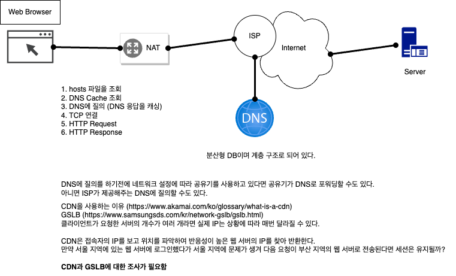
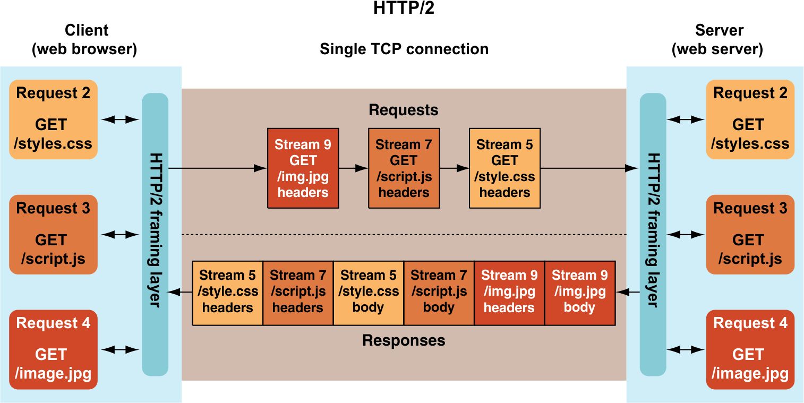
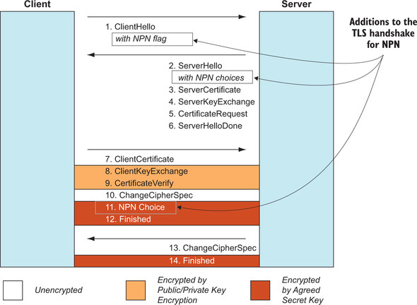
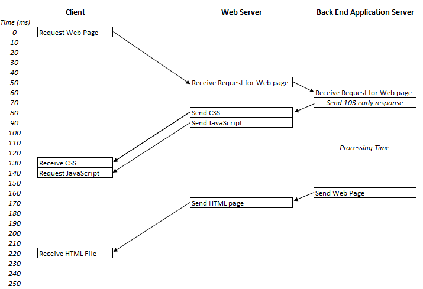
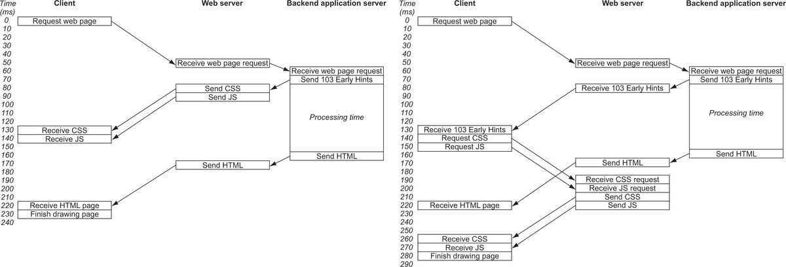
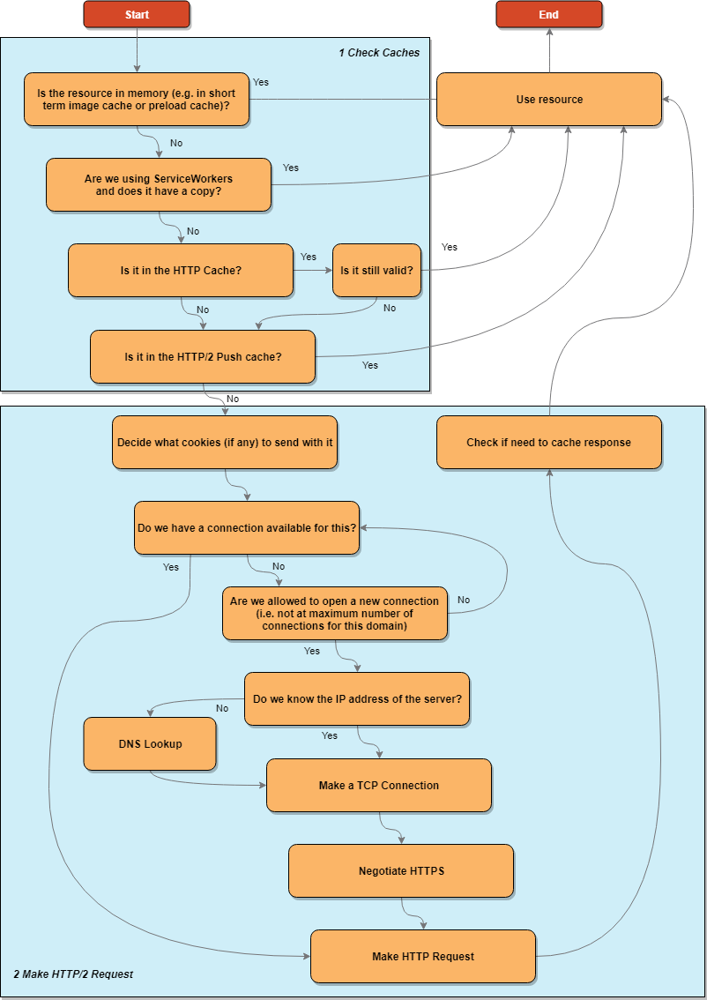
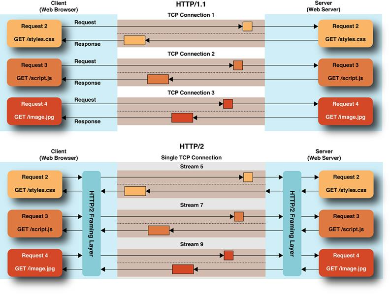
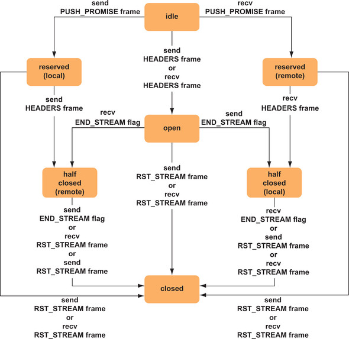

# 메모

1. 추가적인 리소스 요청을 더 효율적으로 만드는 것이 주목적인 HTTP/2의 핵심 근거 중 하나다.
2. HTTP/1.1이 파이프라이닝 개념을 추가했고 동일한 지속적인 연결을 통해 여러 요청을 보내고 응답을 순서대로 받을 수 있어야 한다.
   - 예를 들어, 두 개의 파일에 대한 요청을 함께 보내고 응답을 순서대로 받을 수 있어야 한다.
3. HTTPS의 큰 문제점 하나는 상대 서버에 연결 중임을 나타내는 것이지 그 서버를 신뢰할 수 있음을 나타내는 것이 아니라는 것이다.
4. (파이프라이닝 문제와 비슷한) TCP HOL 블로킹 문제
1. BBC 연구 개발 부서가 HTTP/2 푸시를 방송 방법으로 사용하는 것을 검토했다. [참고](https://www.bbc.co.uk/rd/publications/whitepaper336)
2. **HTTP/2 푸시가 리소스가 변경된 경우 브라우저 캐시를 업데이트하는데 사용할 수 있는가?**
   - 캐시와 [캐시 버스팅 기법](https://css-tricks.com/strategies-for-cache-busting-css/)은 복잡하다.
   - 현재는 아니지만 HTTP/2 푸시로 HTTP 캐시에 직접 리소스를 푸시할 수 있게 된다면 더 좋은 사용성을 제공할 수 있을 것이다.
3. **API에 사용될 수 있는가?**
   - 프로토콜에서 어떤 요청에 대한 응답에도 푸시가 사용될 수 있다.
   - 그러나 브라우저는 푸시된 리소스가 사용되지 못하게 하거나 페이지가 그 뒤에 리소스를 요청하지 않는 한 페이지에 알리지 않음으로써 푸시 이용을 여러모로 제한하고 있다.
   - **브라우저 기반이 아닌 HTTP/2 클라이언트는 그런 제한을 제거할 수 있다.**
4. **IETF는 HTTP/2 서버 푸시 사용 사례를 기록하는 [정보성 RFC](https://datatracker.ietf.org/doc/html/draft-bishop-httpbis-push-cases)를 시작했다.** 에서 좋은 인사이트를 얻을 수 있을 것이다.

# 1장. 웹 기술과 HTTP

## **브라우저에 www.google.com 이동한다고 가정해 봅시다. 우리가 웹페이지를 볼때까지 어떤 과정을 거쳐서 보이게 되는지 설명해 주세요**

1. 실제 주소의 이름을 DNS 서버로부터 요청한다. IP 주소를 DNS에 질의할 때 탐색을 빠르게 만들려고 가장 가까운 서버의 IP 주소를 제공한다.
2. 웹 브라우저가 전달받은 주소로 표준 웹 포트 `80` 또는 표준 보안 웹 포트 `443`에 IP를 통한 **TCP 연결** 을 요청한다.
   - **Internet Protocol** : 인터넷을 통해 트래픽을 보내는데 사용
   - **Transmission Control Protocol** : 연결을 안정적으로 만드는 안정성과 재전송을 더함
3. 브라우저가 웹 서버와 연결을 맺고 있으면 웹 사이트를 요청하기 시작할 수 있다.
   - 브라우저는 줄여 쓴 웹 주소를 구문적으로 더 올바른 URL 주소로 자동 수정한다.
4. 웹 서버는 요청에 응답한다. 웹 페이지를 만드는 필요한 다른 정보를 참조한다.
5. 웹 브라우저가 반환된 응답을 처리한다. HTML 코드 해석을 시작하고 메모리에 해당 페이지의 문서 객체 모델 DOM을 구축한다.
6. 웹 브라우저가 추가로 필요한 리소스를 요청한다. 각 리소스들은 이 1 ~ 6단계를 거친다.
7. 브라우저가 중요한 리소스를 충분히 얻으면 화면에 페이지를 렌더링하기 시작한다.
   - 언제부터 페이지를 렌더링하기 시작할지 정하는 것은 쉽지 않은 작업이다.
8. 페이지를 처음 표시한 후 웹 브라우저는 백그라운드에서 페이지에 필요한 다른 리소스를 계속 다운로드하고 리소스를 처리하는 대로 페이지를 업데이트 한다.
   - 결과적으로 처음에는 이미지 없이 표시된 웹 페이지를 자주 보게 되고, 더 다운로드 되면 이미지가 채워지는 것을 보게 된다.
9. 페이지가 완전히 로드되면 브라우저는 로딩 아이콘을 멈추고, 자바스크립트 코드에서 페이지가 어떤 동작을 수행할 준비가 됐다는 표시로 사용할 수 있는 `OnLoad` 자바스크립트 이벤트를 발생시킨다.

**이 책은 3번 ~ 8번 단계에 집중한다.** (2번 단계도 언급되긴 한다.)  



## **HTTP가 무엇이고 HTTP/1.1까지 어떻게 진화했는지 설명해 주세요**

하이퍼텍스트 전송 프로토콜을 의미하며, 처음에는 하이퍼텍스트 문서(다른 문서로의 링크를 담은 문서)를 전송할 의도로 만들어졌고, 첫 번째 버전은 이러한 문서만 지원했다.  
하지만 이 프로토콜이 다른 문서 유형(이미지 등)을 전송하는 데 사용될 수 있음을 깨달았다.  
  
**HTTP는 보통 TCP/IP가 제공하는 안정적인 네트워크 연결에 의존한다.**  
TCP/IP는 자체가 어떤 유형의 물리적 연결(이더넷, Wi-Fi 등) 위에 만들어진다.  
통신 프로토콜이 계층으로 나눠졌기 때문에 각 계층은 자신이 잘하는 일에 집중할 수 있다.  
  
**HTTP는 네트워크 연결이 설정되는 방법의 하부 수준 세부 사항을 다루지 않는다.**  
HTTP 어플리케이션이 네트워크 오류와 연결 종료를 어떻게 다룰지를 염두에 둬야 하지만 프로토콜 자체는 이러한 작업을 감안하지 않는다.  
  
**HTTP는 본질적으로 요청 및 응답 프로토콜이다.**  
HTTP의 성공 비결은 서비스 수준에서 비교적 HTTP를 구현하기 쉽게 만들어준 간결함이다.  

1. **HTTP의 첫 버전(0.9)** 은 간단한 문법만 허용했으며 GET 메서드 밖에 없었다.  
   - 캐리지 리턴과 라인피드로 구성된 ASCII 텍스트 한 줄이 전송돼야 한다.
   - 서버는 HTML 형식의 메시지로 응답해야 하며 사양에는 ASCII 문자로된 바이트 스트림으로 정의한다.
   - HTTP 헤더 필드 라는 개념이나 이미지와 같은 다른 미디어의 개념이 없었다.
2. **HTTP/1.0**
   - HEAD와 POST가 추가됐다.
   - 요청받은 리소스와 전송하는 응답에 대한 더 많은 정보를 HTTP 헤더로 제공한다.
   - 3자리 응답 코드가 추가되었다.
   - **본문 데이터의 콘텐츠 유형을 정의하는 데 HTTP 응답 헤더를 사용함으로써 처음으로 웹 피이지에 미디어를 추가할 수 있는 능력을 포함해 웹에 풍부한 새로운 기회를 열었다.**
   - **POST가 추가되면서 컨텐츠가 HTTP 요청의 요소로서 클라이언트에서 서버로 보내지게 하며, 처음으로 HTTP 요청이 HTTP 응답과 같이 본문을 가질 수 있게됐다.**
3. **HTP/1.1**
   - 지속적 연결, 필수 서버 헤더, 개선된 캐싱 옵션, 청크 인코딩 등을 개선하고 프록시 지원 기능, 인증 기능, 새로운 상태 코드, 후행 헤더를 도입했다.
   - PUT, OPTIONS, CONNECT, TRACE, DELETE 등이 추가됐다.
   - 서버가 리소스를 브라우저의 캐시에 저장해서 필요하면 나중에 재사용할 수 있도록 클라이언트에 지시할 수 있다.
   - HTTP가 상태 없는 프로토콜에서 상태를 가질 수 있게 하는 HTTP 쿠키를 도입했다.
   - 지속적인 연결이 TCP 연결을 여러 요청에서 재사용할 수 있게 했고 성능이 향상됐지만, 여전히 기본적으로 **요청-응답 프로토콜** 이다.
   - **HTTP 연결에서 요청 하나가 처리되는 동안 HTTP 연결은 다른 요청에 사용되지 않는다.**


## **HTTP/0.9에서는 줄 바꿈 문자를 하나만 사용해도 되는데 HTTP/1.0부터는 줄바꿈 문자를 2개 써야 합니다. 그 이유에 대해서 설명해 주세요.**

두 개의 캐리지 리턴/줄 바꿈 문자를 끝에 작성해야하는데, 2개를 작성하는 이유는 (두 번째 줄바꿈 문자) **빈 줄을 보내어 요청 헤더 섹션이 끝났다는 것을 표현하기 위해서 이다.**  

## **동일한 형식의 헤더를 여러개 보내면 어떻게 되나요?**

HTTP 헤더는 대소문자를 구분하지 않고, `[헤더 이름]: [헤더 내용]`으로 표시한다.  
동일한 형식의 헤더를 여러 개 보내면 쉼표로 구분한 값을 보내는 것과 의미상 동일하다.  
헤더를 확장할 수 있지만 "수신자가 이러한 필드를 인지할 수 있다고 가정할 수 없으며" 무시 될 수 있다.  
  
**표준 헤더는 HTTP/1.0 호환 서버에서 반드시 처리돼야한다고 명시적으로 서술했다.**  


## **HTTP 응답코드는 2xx(성공), 3xx(리다렉션), 4xx(클라이언트 오류), 5xx(서버 오류)로 분류되어 있습니다. 이렇게 분류되어 있는 이유는 무엇인가요?**

응답 코드가 확장 가능하기 때문에 프로토콜 변경 없이 필요한 만큼 새로운 코드를 추가할 수 있기 때문이다.  
응답 코드는 일반적인 분류로 설계됐고, 가장 적합한 상태 코드를 사용하는 것은 애플리케이션 각자에 달려 있다.  

## **HTTP/1.1에서 Host 헤더가 필수적으로 포함된 이유는 무엇인가요? 필수로 포함되어 생긴 문제는 무엇인가요?**

HTTP 요청 행에서 제공된 URL은 절대 URL (예를 들어, `http://www.example.com/section/page.html`)이 아니라 상대 URL (예를 들어, `/section/page.html`) 이다.  
HTTP가 생성됐을 때는 웹 서버가 하나의 웹 사이트만 호스팅한다고 가정했다. 따라서 URL의 호스트 부분은 사용자가 HTTP 요청을 하기 전에 웹 서버에 연결돼야 하기 떄문에 명확했다.  
하지만 오늘날 많은 웹 서버는 여러 사이트를 동일한 서버애서 호스팅되기 때문에 서버에게 어떤 사이트를 원하는지 구분하기 위해서 이다.  
  
HTTP/1.0에서는 `Host` 헤더가 선택적이지만 HTTP/1.1에서는 필수이다.  
필수로 만든 덕분에 서버가 가상 호스팅을 더 많이 사용할 수 있게 해서 사이트마다 개별 웹 서버를 추가하는 복잡한 작업 없이도 웹의 엄청난 성장을 가능하게 했다.  
HTTP 요청에 `Host` 헤더가 없거나 잘못된 경우 서버가 올바르게 응답할 수 없다는 단점이 있다.  
또한, `Host` 헤더를 조작하면 웹 사이트간의 트래픽을 변조하거나, 피싱 사이트로 리디렉션하는 등의 보안 문제를 일으킬 수 있다. 

## **Connection: Keep-Alive가 생긴 이유는 무엇인가요?**

처음의 HTTP는 단일 요청 및 응답 프로토콜이었다.  
클라이언트가 연결을 맺고, 리소스를 요청하고, 응답을 받으면 연결이 종료됐다.  
이로인해 연결을 항상 다시 맺어야 하므로 연결 종료는 낭비가 되고, 불필요한 지연이 발생했다.  
위의 문제를 해결하기 위해 등장했다.  
대신 응답 본문의 길이를 정의하고자 `Content-Length` HTTP 헤더를 사용해야 하며, 본문을 전부 수신하면 클라이언트는 자유롭게 다른 요청을 보낼 수 있다.  
  
헤더에 `Keep-Alive`를 지정함으로써 클라이언트는 서버에 추가적인 요청 전송을 허용하고자 연결을 맺은 채로 그대로 두라고 요청한다.  
만약 서버가 해당 기능을 지원하는 경우 응답에 헤더에 포함된다.  
HTTP/1.1은 이 기능을 기본값으로 변경했다. 어떤 HTTP/1.1 연결이든 `Connection: Keep-Alive` 헤더가 응답에 없더라도 지속적인 연결을 사용 중이라고 가정할 수 있다.  


## **HTTPS란 무엇이고 어떤 문제 때문에 나오게 되었나요?**

HTTP는 원래 일반 텍스트 프로토콜이기 때문에 HTTP 메시지는 인터넷을 통해 암호화되지 않은 상태로 전송되었기 때문에 메시지가 목적지로 라우팅될 때 모든 참여자가 읽을 수 있다.  
사용자가 보낸 메시지가 인터넷 서비스 제공자로부터 전송되며, **인터넷은 메시지가 라우팅되는 방법을 제어할 수 없으며, 인터넷 사용자는 얼마나 많은 참여자가 사용자의 메시지를 볼지 알 수 없다.**  
HTTP가 일반 텍스트이기 때문에 도중에 메시지를 가로채고, 읽고, 고쳐 쓰기까지 할 수 있다. 이 문제를 해결하기 위해 HTTPS가 등장했다.  
  
**HTTPS는 전송 중의 메시지를 전송 계층 보안 (TLS, Transport Layer Security) 프로토콜을 사용해 암호화하는 HTTP의 보안 버전이다.**  
이전 이름인 보안 소켓 계층 (SSL, Secure Sockets Layer)로도 알려져 있다.  
SSL은 TLS로 표준화 됐으며 TLS는 2018년에 표준으로 승인됐다.  
  
## **HTTPS는 HTTP 메시지에 암호화, 무결성, 인증을 추가했습니다. 각각에 대해 설명해 주세요.**

**암호화** : 메시지는 전송 중에 제 3자에게 읽힐 수 없다.  
**무결성** : 암호화된 메시지가 디지털 서명되고 서명이 복호화되기 전에 암호학적으로 검증되기 때문에 메시지는 전송 중에 변경되지 않는다.  
**인증** : 통신을 하는 주체인 서버와 클라이언트가 서로 믿을 수 있는 주체임이 보장된다.  

## **HTTPS의 키를 교환할 때 공개키 암호화를 통해서 교환하는 이유는 무엇일까요?**

**공유 비밀키를 미리 알고 있을 필요없이 안전하게 웹 사이트와 통신할 수 있도록 하기 위함이다.**  
사용자가 처음 연결할 때 서버가 디지털 인증서 형태의 공개키를 제공한다.  
브라우저는 이 공개키를 사용해 메시지를 암호화한다. 짝이 되는 개인키는 서버만이 가졌으므로 서버에서만 메시지를 복호화할 수 있다.  
  
HTTPS는 암호화,복호화를 제외하고는 기존의 HTTP와 동일하다. (HTTPS는 표준 HTTP 요청 및 응답을 다른 프로토콜로 대체하는 것이 아니라 감싼다.)  
클라이언트와 서버는 TLS 핸드 쉐이킹을 통해
1. 서버는 공개키를 제공
2. 서버와 클라이언트가 암호화 방식에 합의
3. 서버와 클라이언트가 미래에 사용할 공유 암호화 키를 협상

> 공개키 암호화는 느리기 때문에 공개 암호화키는 **공유 비밀키를 협상하는 데만 사용된다.**  
> 공유 비밀키는 더 나은 성능으로 향후의 메시지를 암호화하는 데 사용된다.

# 2장. HTTP/2를 향한 여정

## **HTTP/1.1의 근본적인 성능 문제란 무엇인가요?**

요청과 응답을 순차적으로 처리하는 방식이 근본적인 성능 문제이다.  
클라이언트가 요청을 보내고 서버가 해당 요청에 대한 응답을 전송할 때까지 다른 요청을 보낼 수 없다는 의미이다.  
따라서 하나의 요청이 완전히 처리되기 전까지 다른 요청을 보낼 수 없다.  

## **HTTP/1.1에서 파이프라이닝이 잘 쓰이지 않은 이유는 무엇인가요?**

위의 근본적인 성능 문제를 해결하기 위해 응답을 수신하기 전에 동시적인 요청을 보내 요청을 병렬적으로 보낼 수 있도록 파이프라이닝을 도입하려고 시도했다.  
최초의 HTML은 여전히 별도로 요청해야 하지만, 브라우저가 두 개의 이미지가 필요하다는 것을 알면 순서대로 요청을 할 수 있다.  
하지만 잘 알려진 웹 브라우저 중 어떤 것도 파이프라이닝을 사용하지 않는다.  
  
1. 많은 이유 때문에 구현하기 어려웠고, 문제를 일으키기 쉬웠으며 웹 브라우저와 서버에서 잘 지원되지 않는다.
2. 응답이 요청의 순서대로 반환되어야 하기 때문에 이미지2는 완료되었지만 이미지1을 기다려야하는 `HOL (Head-Of-Line) 블로킹` 문제가 발생한다. 

## **HTTP/1.1의 성능 문제를 우회해서 해결하는 2가지 방법에 대해 설명하세요.** 

각 해결책에 대해서 설명하고 한계점에 대해서도 설명해 주세요.  

1. **여러 HTTP 연결을 사용한다.**
   - 여러 개의 연결을 맺어 병렬로 여러 개의 HTTP 요청이 끊임없이 동작하게 하는 것이다.
   - 각 HTTP 연결이 다른 연결과 독립적으로 동작하기 때문에 HOL 블로킹이 일어나지 않는다.
   - 하지만 동시에 너무 많은 연결을 허용하면 서버의 부하가 증가하고 네트워크 혼잡도가 증가하여 다른 사용자에게도 피해를 줄 수 있기 때문에 **성능과 안정성을 균형있게 유지하기 위해 여섯 개의 연결로 제한한다.**
   - 이 제한을 더 늘리고자 **도메인 샤딩** 을 통해 정적 자산을 하위 도메인에서 제공하게 하기도 한다.
   - 하지만 이런 해결책은 클라이언트와 서버 모두에게 추가적인 부담이며 TCP 연결에는 추가 시간과 비용이 들고 연결을 유지하는 데에도 추가적인 메모리와 처리가 필요하다.
   - 그리고 하부 TCP 프로토콜에서의 비효율성도 있다. TCP는 고유 시퀀스 번호가 있는 패킷을 전송하고 누락된 시퀀스 번호를 검사해서 도중에 손실된 패킷을 다시 요청하는것이 보장된 프로토콜이다.
   - 3 way 핸드셰이크를 통해 시퀀스 번호를 서로 공유하는데 HTTP 요청 하나를 보내기도 전에 이 절차가 3개의 네트워크 이동을 추가한다.
   - 게다가 TCP는 확인 전에 적은 수의 패킷을 전송하면서 조심스럽게 시작하며 (윈도우 사이즈) 점차 증가한다.
   - 이 윈도우 사이즈는 TCP 느린 시작 알고리즘이 제어한다. TCP는 네트워크에 과부하를 주지 않으려고 하는 보장된 프로토콜이다.
   - 설명한 TCP 설정과 느린 시작 문제가 없다고 하더라도 여러 개의 독립된 연결은 대역폭 문제를 야기할 수 있다.
   - **여러 개의 연결을 맺는 것은 HTTP 수준에서 괜찮은 최적화이더라도 TCP와 HTTPS 수준에서는 비효율적이다.**
2. **적지만 잠재적으로 큰 HTTP 요청을 만든다.**
   - 불필요한 요청을 줄이거나 적은 수의 HTTP 요청을 통해 동일한 양의 데이터를 요청하는 것이다.
   - 예를 들어, 여러 개의 이미지를 한 개의 이미지로 묶어서 응답하는 것이다.
   - 자산을 결합된 파일로 묶는 이 번들링 기법을 **스프라이팅** 이라고 한다.
   - 작은 이미지들을 한 이미지로 표현하여 한 번에 다운로드 받을 수 있긴 하지만 그 중 딱 한 개만 필요하더라도 큰 이미지를 다운받아야한다.
   - 그리고 이것을 구현하기 위해서는 추가적인 비용과 관리가 필요하다.

## **HTTP/1.1은 텍스트 기반 프로토콜입니다. 그래서 요청과 헤더도 텍스트 기반인데요. 이로인해 생기는 문제는 무엇인가요?**

HTTP 메시지의 본문이 바이너리 데이터를 포함할 수 있지만 (예를 들어 클라이언트와 서버가 합의할 수 있는 아무 포맷의 이미지), 요청과 헤더 자체는 여전히 텍스트여야 한다.  
이 텍스트 형식은 기계에게 최적의 형식은 아니다.  
**HTTP 텍스트 메세지 처리는 복잡하고 오류에 취약할 수 있으며, 보안 문제를 가져온다.**  
예를 들어, HTTP에 대한 다수의 공격은 HTTP 헤더에 줄 바꿈 문자를 삽입하는 것을 기반으로 했다.  
  
그리고 **데이터를 효율적으로 인코딩하지 않기 때문에 HTTP 메세지가 필요 이상으로 크다는 것이다.**  
단일 요청을 사용하던 웹의 초기에는 큰 문제가 아니었지만, 늘어난 요청 수는 이 상황을 상당히 비효율적으로 만들었다.  
예를 들어, 메인 페이지 요청만 쿠키를 필요로 하더라도 도메인으로의 모든 HTTP 요청과 함께 쿠키가 전송된다.  
보통 이미지, CSS, 자바스크립트와 같은 정적 리소스는 쿠키를 필요로 하지 않는다.  
  
## **HTTP-NG는 실패하고 SPDY는 성공할 수 있었던 이유는 무엇인가요?**

HTTP-NG는 HTTP/1의 여러 문제를 해결하려고 한 반면, SPDY의 주된 목적은 HTTP/1.1의 성능 한계를 해결하는 것이였다.  
  
SPDY는 HTTP를 기반으로 구축됐지만 근본적인 용도를 변경하지 않고 HTTPS가 HTTP를 감싸는 것과 거의 비슷하게 프로토콜을 본격적으로 변경하지 않았다.  
HTTP 메서드와 HTTP 헤더의 개념은 SPDY에서 여전히 존재하며, SPDY는 저수준에서 동작했고, 웹 개발자, 서버 소유자, 사용자에게 SPDY 사용은 거의 투명했으며 SPDY는 HTTPS를 통해서만 구현됐다.  
SPDY는 본질적으로 이전 버전과 호환되며 변경과 위험성을 최소화하면서 도입될 수 있었기에 SPDY가 성공하고 HTTP-NG가 실패한 이유다.  
  

## **SPDY가 HTTP/1을 어떻게 개선했나요?**

1. **다중화된 스트림** : 요청 및 응답은 단일 TCP 연결을 통해 여러 개의 스트림을 동시 전송할 수 있기 때문에, 요청과 응답이 인터리브(교차)되어 전송될 수 있다.
2. **요청 우선순위 지정** : 모든 요청을 동시에 보내는 것으로 새로운 성능 문제를 발생시키지 않기 위해 요청의 우선순위 개념이 도입됐다.
3. **HTTP 헤더 압축** : HTTP 본문은 오랫동안 압축해 왔지만 이제 헤더도 압축할 수 있다.

텍스트 기반의 요청 및 응답 프로토콜이었던 HTTP로는 이러한 기능을 도입할 수 없었으므로 **SPDY는 바이너리 프로토콜이 됐다.**  
이 변경을 통해 작은 메시지를 처리하는 데 단일 연결을 사용할 수 있게 됐고, 여러 개의 HTTP 메시지가 동시에 하나의 연결에서 전송 상태에 있을 수 있도록 **HTTP 계층에서 TCP의 개념을 구현했다.**  
서버 푸시와 같은 추가적인 고급 기능은 **서버가 추가 리소스를 덧붙일 수 있도록 했다.**  
이 기능은 파일을 요청하는 **라운드 트립의 성능 지연과 필수 CSS를 인라이닝하는 문제로 인해 고통 받는 어려움에서 구해준다.**  

# 3장. HTTP/2로 업그레이드

## **HTTP/2의 사양은 HTTPS에서만 동작한다는 사양은 존재하지 않는다. 하지만 대부분의 브라우저는 HTTPS를 강제하고 있는데 그 이유에 대해서 설명해 주세요.**

HTTP와 HTTPS 둘 다 동작할 수 있다. 하지만, 현재 대부분의 웹 브라우저는 보안상의 이유로 HTTPS를 통한 HTTP/2 연결만을 지원하도록 설정되어 있다.  
이렇게 HTTPS를 강제하는 주된 이유는 두 가지이다.  
**첫째** , 보안으로 HTTP/2를 통해 데이터를 전송할 때 HTTPS를 사용하면, 데이터는 암호화되어 전송되므로 중간에서 데이터를 가로채는 것을 방지할 수 있다.  
**둘째** , 성능 개선으로 HTTP/2는 다중 연결, 헤더 압축, 서버 푸시 등의 기능을 제공하여 웹의 성능을 크게 향상시킬 수 있다.  
이러한 기능들은 암호화된 연결에서만 제대로 작동하므로, 실제로는 HTTPS를 사용할 때만 HTTP/2의 모든 이점을 볼 수 있다.  
따라서, 웹 브라우저 제조사들은 사용자의 보안과 웹의 전반적인 성능 향상을 위해 HTTP/2 연결에 HTTPS를 강제하고 있다.  

## **서버에 HTTP/2를 활성화 하는데 있어서 어려움은 어떤 것이 있을까요?**

서버는 HTTPS에 필요한 SSL/TLS의 복잡성을 별도의 라이브러리, 일반적으로 OpenSSL에 위임한다.  
이 암호화 라이브러리는 보통 운영체제의 일부이며 업그레이드하기 까다로울 수 있다.  
그리고 ALPN 확장을 통해서만 HTTP/2를 지원하기 때문에 운영체제가 OpenSSL 또는 웹 서버(아파치, 엔진엑스)의 ALPN을 지원하는지 확인해야 한다.  

## **어떤 이유로 인해 애플리케이션 서버가 HTTP/2를 활성화가 불가능하다고 가정해 봅시다. 이럴 때 HTTP/2를 활성화 하기 위해서 어떤 대안이 있나요?**

웹 서버 앞에 HTTP/2 통신을 위한 역방향 프록시를 두는 것이다.  
브라우저와 프록시가 HTTP/2로 통신하고 프록시가 HTTP/1.1로 변환하여 웹 서버와 통신하는 것이다.  
  
표준 프록시는 외부 세계로부터 네트워크를 보호하며 인터넷과 소통할 필요가 있는 외부로 나가는 트래픽용 경로를 제공한다.  
역방향 프록시는 인터넷으로 부터 내부로 들어오는 트래픽을 처리해 외부에서 직접 이용할 수 없는 서버에 접근할 수 있게 한다.  
**로드 밸런서가 필요하거나 HTTPS나 HTTP/2와 같은 기능을 오프로드** 할 때 역방향 프록시가 사용된다.  
  
또는 대부분의 CDN은 HTTP/2를 지원하므로 원본 서버를 HTTP/1.1로 두고 CDN을 사용해 HTTP/2로 전환할 수 있다.  

## **리버스 프록시와 애플리케이션 서버와의 통신은 HTTP/1.1로 해도 성능문제가 그렇게 심하지 않은데, 그 이유는 무엇일까요?**

> **처음부터 끝까지 HTTP/2로 통신해야 하는가?**  
> 역방향 프록시에 HTTP/2를 구현하면 HTTP/2 연결은 역방향 프록시에서 종료되며 거기부터 별도의 연결이 사용된다.  
> 이 구성은 진입점에서만 인증서가 설정되고 관리되면 되기 때문에 HTTPS 구성을 완화한다. (프록시 뒤의 나머지에서는 HTTP가 사용될 수 있다.)  
  
**그럼 백엔드 연결을 HTTP/1.1로 만들어서 잃는 것은 무엇인가?**  
HTTP/2의 주요 이득은 최종 사용자에서 말단 서버(이 경우 역방향 프록시)와 같이 높은 대기시간과 낮은 대역폭 연결에서의 속도 개선이다.  
역방향 프록시에서 나머지 인프라스트럭처로의 트래픽은 낮은 대기시간과 높은 대역폭 네트워크 링크를 통해 짧은 거리를 이동할 가능성이 크므로 HTTP/1.1의 성능 문제는 대부분 별 문제가 아니다.  
  
브라우저가 설정하는 여섯 개의 연결 제약이 없기 때문에 HTTP/2 트래픽에 대한 단일 연결 사용도 역방향 프록시에서 실제 서버로의 이득이 별로 안된다.  
하지만 역방향 프록시에 연결된 방식과 목적지 서버에서 구현된 방식에 따라 단일 연결을 사용하면 성능 문제를 일으킬 수 있다는 우려도 있다.  
엔진엑스는 부분적으로 이런 이유 때문에 프록시를 통과하는 연결에 대해 [HTTP/2를 구현하지 않을 것이라고 언명했다.](https://mailman.nginx.org/pipermail/nginx/2015-December/049445.html)  

# 4장. HTTP/2 프로토콜 기초

[HTTP/2](https://datatracker.ietf.org/doc/html/rfc7540)가 제공하는 모든 것에서 혜택을 보려면 바이너리 프로토콜과 동작 방식을 더 깊이 이해할 필요가 있다.  
클라이언트와 서버는 어떠한 HTTP 메시지를 전송하기 전에 HTTP/2를 사용하기로 합의해야만 한다.  
이 합의는 대개 HTTPS 연결 협상 과정에서 ALPN이라고 하는 새로운 확장을 사용해 이뤄진다.  


## **HTTP/2에서 새롭게 추가된 개념 여섯가지에 대해 설명해 주세요.**

1. 텍스트가 아니라 **바이너리 프로토콜**
   - HTTP/2는 **바이너리 패킷 기반 프로토콜** 인 반면 HTTP/1은 완전히 텍스트 기반이다.
   - HTTP/2는 메시지가 **분명하게 정의된 프레임으로 나눠지고 전송되는 완전한 바이너리 프로토콜** 로 옮겨간다.
   - 이 프레임은 대부분의 HTTP 연결 기저를 이루는 **TCP 패킷과 비슷하다.**
   - 바이너리 프레임으로 나누는 것은 보통 저수준 클라이언트 또는 라이브러리(웹 브라우저나 웹 서버)가 처리한다.
   - 고수준 애플리케이션에서는 메시지 전송 방식을 신경 쓸 필요가 없다.
2. 동기적이 아니라 **다중화(multiplexed)**
   - HTTP/1은 동기적이고 단일 요청 및 응답 프로토콜이었다. HTTP/2에서는 각각의 HTTP 요청이나 응답에 대해 다른 스트림을 사용해 단일 연결에서 동시에 여러 개의 요청을 진행할 수 있다.
   - **동시에 발생하는 여러 개의 독립적인 요청** 이라는 개념은 `프레임 각각이 스트림 식별자를 갖는 바이너리 프레임 계층으로 옮겨가면서 가능해졌다.`
   - 수신자는 그 스트림에 대한 모든 프레임을 수신했을 때 완전한 메시지를 재구축할 수 있다.
3. **흐름 제어**
4. **스트림 우선순위화**
5. **헤더 압축**
   - 헤더는 모든 리소스에 대해 동일하게 보내지는 경우가 많기에 낭비가 발생한다.
   - HTTP/1은 `Accept-Encoding`헤더로 HTTP 본문 압축을 허용했지만 HTTP 헤더 압축은 아니었다.
   - 자세한 내용은 8장에서 나온다.
6. **서버 푸시**
   - 서버가 하나 이상의 응답으로 요청에 답할 수 있는 서버 푸시의 개념을 추가했다.
   - HTTP/1에서 홈페이지가 반환될 때 브라우저는 반드시 그것을 읽고 페이지를 렌더링하기 전에 다른 리소스를 요청해야 했다.
   - HTTP/2 서버 푸시로 이러한 리소스는 첫 응답과 함께 전송될 수 있으며, 브라우저가 사용하려고 할 때 가용될 것이다.
   - **언제 그리고 어떻게 푸시할지 결정하는 것이 이 기능을 최대한 활용하는 비결이다.**

## **HTTP/2가 단일 연결에서 어떻게 동시에 여러 개의 요청이 어떻게 가능한지 작동 방식을 설명해 주세요.**

프레임 각각이 스트림 식별자를 갖는 바이너리 프레임 계층으로 옮겨가면서 가능해졌다.  
수신자는 그 스트림에 대한 모든 프레임을 수신했을 때 완전한 메시지를 재구축할 수 있다.



프레임은 여러 메시지가 동시에 송신될 수 있도록 하는 비결이다.  
**프레임 각각은 프레임이 어떤 메시지에 속해 있는지(스트림)를 나타내는 레이블이 붙어 있는데, 이는 대부분의 브라우저가 허용하는 여섯 개의 병렬적 HTTP/1 연결돠는 대조적으로 둘이나 셋, 어쩌면 백개의 메시지가 동시에 동일한 다중화된 연결에서 송신되거나 수신되게 한다.**  
  
요청이 동일한 연결에서 하나씩 차례로 전송되고(HTTP/1.1 파이프라이닝과 유사) 응답은 섞여서 돌아온다.  
결국 프레임 각각은 동일한 HTTP/TCP 연결에서 차레로 전송돼야 하기 때문에 요청이 정확히 동시에 전송되지 않는다.  
적어도 보통 하나의 네트워크 연결만 있으므로 요청 각각은 결국 네트워크 수준에서 큐잉된다.  
  
요즘 HTTP/2 연결은 HTTP/1.1에서 그랬던 것처럼 요청을 보낸 다음 응답을 받기까지 블록되지 않는다.  
**클라이언트가 우선순위를 표시할 수는 있지만, 응답을 전송하는 순서는 완전히 서버에 달렸다.**  
  
각 요청은 새롭고 증가하는 스트림 ID를 받으며 응답은 동일한 스트림 ID로 돌아오므로, 스트림은 HTTP 연결이 그랬던 것처럼 양방향이다.  
스트림 ID의 충돌을 피하고자 클라이언트가 시작하는 요청은 홀수 스트림 ID를 사용하며, 서버가 시작한 요청은 짝수 스트림 ID를 사용한다.  
스트림은 응답이 종룔되면 닫힌다. 스트림은 버려지고 재사용되지 않는 반면 HTTP/1.1은 연결을 열린 채로 유지하고 다른 요청을 보내는 데 재사용할 수 있다.  
  
> HTTP/2는 여러 개의 바이너리 프레임을 사용해서 단일 TCP 연결을 통해 HTTP 요청 및 응답을 보내는 데 **다중화된 스트림을 사용** 한다.  
> HTTP/2는 주로 메시지 전송 수준에서 다르고, 약간 높은 수준에서도 HTTP의 핵심 개념은 동일하게 남아 있다.  
> 메서드, 얻으려는 리소스, 헤더, 본문, 상태코드, 캐싱, 쿠키 등 동일한 것을 갖는다.  


## **스트림 우선순위화와 흐름제어에 대해서 설명해 주세요**

HTTP/1에서는 요청을 큐에 넣어 사용 가능한 HTTP/1 연결을 기다리고, 브라우저가 관리하는 큐가 우선순위를 결정한다.  
HTTP/2에서는 연결을 사용해 동시에 전송될 수 있는 요청의 최대 수 제한이 훨씬 크기 때문에 더 이상 브라우저가 많은 요청을 큐로 관리할 필요가 없이 바로 전송할 수 있다.  
이는 **낮은 우선순위 리소스로 대역폭이 낭비되는 경우가 발생한다.**  
  
**스트림 우선순위화는 가장 중요한 리소스가 높은 우선순위로 전송되도록 하고자 필요하다.**  
서버가 전송될 프레임의 큐가 기다리고 있는 경우 낮은 우선순위 요청보다 높은 우선순위 요청에 대해 더 많은 프레임을 전송하도록 구현된다.  
  
**HTTP/2의 흐름 제어는 동일한 연결에 여러 개의 스트림을 사용하는데 따른 또 다른 불가피한 구현이다.**  
수신자가 도착하는 메시지를 송신자가 보내는 만큼 빠르게 처리할 수 없다면 버퍼 처리돼야 하며, 결국 패킷이 버려지고 다시 전송되게 만드는 백로그가 존재한다.  
  
TCP는 이러한 시나리오에 대해 연결 수준에서 연결의 속도를 낮출 수 있지만, HTTP/2는 스트림 수준에서 할 수 있어야 한다.  
(HTTP/2가 TCP 흐름제어로 속도를 낮출 수 없는 이유는 7장에서 알아본다.)

## **HTTP/2는 HTTPS처럼 새로운 포트를 사용하거나 프로토콜을 변경하지 않기로 했습니다. 클라이언트와 서버가 HTTP/1.1 대신 HTTP/2로 연결하는 방법에 대해서 설명해 주세요.**

HTTPS가 적용될 때는 프로토콜이 변경되면서 (`https://`) 통신할 때 어떤 프로토콜을 사용할지 분명히 나타낼 수 있었다.  
하지만 HTTP/2는 기존 호환성을 위해 새로운 체계를 사용하지 않기로 결정했고 그 대신 HTTP/2 연결을 설정하기 위한 방법을 제공한다.  

1. **HTTPS 협상을 사용한다.**
   - HTTPS 연결은 연결할 당사자 사이에 연결이 설정되고 HTTP 메시지가 교환되기 전에 사용할 SSL/TLS 프로토콜, 암호화 방식, 그 외의 다양한 설정을 합의하는 프로토콜 협상 단계가 있다.
   - HTTP/2 지원은 이 HTTPS 핸드셰이크의 일부가 될 수 있어 첫 HTTP 메시지가 전송되기 전에, 그리고 연결 설정 시점에 완료돼야 하는 업그레이드 리디렉션을 줄인다.
2. **HTTP Upgrade 헤더를 사용한다.**
   - 클라이언트는 `Upgrade: h2c` 헤더를 보내 기존 HTTP/1.1 연결을 HTTP/2로 업그레이드 하도록 요청할 수 있다.
   - 이 헤더는 암호화되지 않은 HTTP(h2c)에 대해서만 사용돼야 한다.
3. **사전 지식을 사용한다.**

## **HTTPS의 핸드 쉐이크 과정에 대해서 설명해 주세요**

HTTPS를 사용하는 것은 HTTP/1이든 HTTP/2든 간에 표준 HTTP 연결을 암호화하는 데 SSL/TLS를 사용한다는 뜻이다.  
**공개-비공개키 암호화** 는 메시지를 암호화하고 복호화하는 데 다른 키를 사용하기 때문에 비대칭형 암호화라고 부른다.  
이러한 유형의 암호화는 이전에 한 번도 연결한 적이 없는 서버와 보안 통신을 하는 데 필요하지만 느리므로 나머지 연결을 암호화하는 데 사용할 **대칭형 암호화키** 를 합의하는 데 사용된다.  
이 합의는 **TLS 핸드셰이크 도중에 일어나며, 핸드셰이크는 연결의 시작에 일어난다.**  



하얀색은 **암호화되지 않음**  
주황색은 **공개키/개인키 암호화 방식으로 암호화됨**  
빨간색은 **합의된 비밀키로 암호화됨**  
  
1. 클라이언트는 지원하는 암호화 종류를 열거하는 `ClientHello` 메시지를 전송한다.
2. 서버는 비슷한 `ServerHello` 메세지를 응답하는데, 클라이언트가 무엇을 지원하는지에 근거해서 HTTPS 프로토콜을 선택하며 이 연결에 대해 사용할 암호화 방식도 보낸다.
3. 서버 HTTPS 인증서를 제공한다. `ServerCertificate`
4. 비밀키 세부 정보는 선택된 암호화 방식(`ServerKeyExchnage`)과 
5. 클라이언트 HTTPS 인증서가 필요한지(`CertificateRequest`, 대부분의 웹 사이트에서 불필요) 여부에 달려있다.
6. 마지막으로 서버는 완료됐다고 알린다. (`ServerHelloDone`)
7. 클라이언트는 서버 인증서를 검증하고 요청받은 경우 클라이언트 인증서를 보낸다. (`ClientCertificate`, 대부분의 웹 사이트에서 불필요)
8. 그런 다음 비밀키 세부 정보를 보낸다. (`ClientKeyExchange`) 이 세부 정보는 서버만 개인키로 메시지를 복호화할 수 있도록 서버 인증서의 공개키로 암호화돼 전송된다.
9. 클라이언트 인증서가 사용되고 있다면 개인키로 서명된 `CertificateVerify` 메시지가 전송돼 클라이언트 인증서의 소유권을 증명한다.
10. 클라이언트가 ServerKeyExchange와 ClientKeyExchange 세부 사항을 사용해서 암호화된 대칭키를 정의하고 `ChangeCipherSpec` 메시지를 보내 서버에게 암호화가 시작됨을 알린다.
11. (제외)
12. 암호화된 `Finished` 메시지를 서버에게 보낸다.
13. 서버도 암호화된 연결로 전환한다. `ChangeCipherSpec`
14. 암호화된 `Finished` 메시지를 클라이언트에게 보낸다.

서버의 숨겨진 개인키로 메시지를 서명하면 메시지를 인증서의 공개키로 풀어볼 수 있어 신원이 확인된다.  
또한 SSL/TLS 인증서 각각은 컴퓨터가 신뢰하는 알려진 인증기관이 암호화돼 서명한다.  
클라이언트 인증서가 사용된다면 유사한 절차가 반대 방향으로 동작한다.  
  
`curl -vso /dev/null --http2 https://www.facebook.com` 명령어로 ALPN이 사용된 HTTPS 핸드셰이크를 확인할 수 있다.  

## **HTTP/2 프레임에 대해서 설명해 주세요.**

**HTTP/2 프레임 헤더 형식**  
- `Length` 필드는 24비트, 프레임의 길이를 의미하며 SETTINGS_MAX_FRAME_SIZE에 의해 제한된다.
- `Type` 필드는 8비트, [현재 14개의 프레임 유형](https://www.iana.org/assignments/http2-parameters/http2-parameters.xhtml)이 있다.
- `Flags` 필드는 8비트, 프레임 특화 플래그 이다.
- `Reserved Bit` 필드는 1비트, 현재 사용되지 않으며 반드시 0으로 설정돼야 한다.
- `Stream Identifier` 필드는 31비트, 프레임을 식별하는 부호 없는 31비트 정수다.

```
nghttp -va https://www.facebook.com | more


[  0.028] Connected
The negotiated protocol: h2
[  0.038] send SETTINGS frame <length=12, flags=0x00, stream_id=0>
          (niv=2)
          [SETTINGS_MAX_CONCURRENT_STREAMS(0x03):100]
          [SETTINGS_INITIAL_WINDOW_SIZE(0x04):65535]
[  0.038] send PRIORITY frame <length=5, flags=0x00, stream_id=3>
          (dep_stream_id=0, weight=201, exclusive=0)
[  0.038] send PRIORITY frame <length=5, flags=0x00, stream_id=5>
          (dep_stream_id=0, weight=101, exclusive=0)
[  0.038] send PRIORITY frame <length=5, flags=0x00, stream_id=7>
          (dep_stream_id=0, weight=1, exclusive=0)
[  0.038] send PRIORITY frame <length=5, flags=0x00, stream_id=9>
          (dep_stream_id=7, weight=1, exclusive=0)
[  0.038] send PRIORITY frame <length=5, flags=0x00, stream_id=11>
          (dep_stream_id=3, weight=1, exclusive=0)
[  0.038] send HEADERS frame <length=40, flags=0x25, stream_id=13>
          ; END_STREAM | END_HEADERS | PRIORITY
          (padlen=0, dep_stream_id=11, weight=16, exclusive=0)
          ; Open new stream
          :method: GET
          :path: /
          :scheme: https
          :authority: www.facebook.com
          accept: */*
          accept-encoding: gzip, deflate
          user-agent: nghttp2/1.58.0
[  0.043] recv SETTINGS frame <length=30, flags=0x00, stream_id=0>
          (niv=5)
          [SETTINGS_HEADER_TABLE_SIZE(0x01):4096]
          [SETTINGS_MAX_FRAME_SIZE(0x05):16384]
          [SETTINGS_MAX_HEADER_LIST_SIZE(0x06):81920]
          [SETTINGS_MAX_CONCURRENT_STREAMS(0x03):100]
          [SETTINGS_INITIAL_WINDOW_SIZE(0x04):65536]
[  0.043] recv WINDOW_UPDATE frame <length=4, flags=0x00, stream_id=0>
          (window_size_increment=20905985)
[  0.043] recv SETTINGS frame <length=0, flags=0x01, stream_id=0>
          ; ACK
          (niv=0)
[  0.043] recv WINDOW_UPDATE frame <length=4, flags=0x00, stream_id=13>
          (window_size_increment=10420224)
[  0.043] send SETTINGS frame <length=0, flags=0x01, stream_id=0>
          ; ACK
          (niv=0)
[  0.378] recv (stream_id=13) :status: 200
[  0.378] recv (stream_id=13) vary: Accept-Encoding
[  0.378] recv (stream_id=13) content-encoding: gzip
[  0.378] recv (stream_id=13) set-cookie: fr=0nfYJ83FYbKbWWU3n..BlmUCE.8z.AAA.0.0.BlmUCE.AWXB9FlkMqs; expires=Fri, 05-Apr-2024 11:59:00 GMT; Max-Age=7776000; path=/; domain=.face
book.com; secure; httponly
[  0.378] recv (stream_id=13) set-cookie: sb=hECZZaBnookGbnMCXh3FyeMH; expires=Sun, 09-Feb-2025 11:59:00 GMT; Max-Age=34560000; path=/; domain=.facebook.com; secure; httponly
[  0.378] recv (stream_id=13) reporting-endpoints: default="https://www.facebook.com/ajax/browser_error_reports/?device_level=unknown"
[  0.378] recv (stream_id=13) report-to: {"max_age":259200,"endpoints":[{"url":"https:\/\/www.facebook.com\/ajax\/browser_error_reports\/?device_level=unknown"}]}
[  0.378] recv (stream_id=13) content-security-policy: default-src data: blob: 'self' https://*.fbsbx.com 'unsafe-inline' *.facebook.com *.fbcdn.net 'unsafe-eval';script-src *.fa
cebook.com *.fbcdn.net *.facebook.net *.google-analytics.com *.google.com 127.0.0.1:* 'unsafe-inline' blob: data: 'self' connect.facebook.net 'unsafe-eval';style-src fonts.google
apis.com *.fbcdn.net data: *.facebook.com 'unsafe-inline';connect-src *.facebook.com facebook.com *.fbcdn.net *.facebook.net wss://*.facebook.com:* wss://*.whatsapp.com:* wss://*
.fbcdn.net attachment.fbsbx.com ws://localhost:* blob: *.cdninstagram.com 'self' http://localhost:3103 wss://gateway.facebook.com wss://edge-chat.facebook.com wss://snaptu-d.face
book.com wss://kaios-d.facebook.com/ v.whatsapp.net *.fbsbx.com *.fb.com;font-src data: *.gstatic.com *.facebook.com *.fbcdn.net *.fbsbx.com;img-src *.fbcdn.net *.facebook.com da
ta: https://*.fbsbx.com *.tenor.co media.tenor.com facebook.com *.cdninstagram.com fbsbx.com fbcdn.net *.giphy.com connect.facebook.net *.carriersignal.info blob: android-webview
-video-poster: googleads.g.doubleclick.net www.googleadservices.com *.whatsapp.net *.fb.com *.oculuscdn.com;media-src *.cdninstagram.com blob: *.fbcdn.net *.fbsbx.com www.faceboo
k.com *.facebook.com https://*.giphy.com data:;frame-src *.doubleclick.net *.google.com *.facebook.com www.googleadservices.com *.fbsbx.com fbsbx.com data: www.instagram.com *.fb
cdn.net https://paywithmybank.com https://sandbox.paywithmybank.com;worker-src blob: *.facebook.com data:;block-all-mixed-content;upgrade-insecure-requests;
[  0.378] recv (stream_id=13) document-policy: force-load-at-top
[  0.378] recv (stream_id=13) permissions-policy-report-only: autoplay=(), clipboard-read=(), clipboard-write=(), encrypted-media=(), keyboard-map=()
[  0.378] recv (stream_id=13) permissions-policy: accelerometer=(), ambient-light-sensor=(), bluetooth=(), camera=(self), display-capture=(self), fullscreen=(self), gamepad=*, ge
olocation=(self), gyroscope=(), hid=(), idle-detection=(), local-fonts=(), magnetometer=(), microphone=(self), midi=(), otp-credentials=(), payment=(), picture-in-picture=(self),
 publickey-credentials-get=(self), screen-wake-lock=(), serial=(), usb=(), window-management=()
[  0.378] recv (stream_id=13) cross-origin-resource-policy: cross-origin
[  0.378] recv (stream_id=13) cross-origin-opener-policy: unsafe-none
[  0.378] recv (stream_id=13) pragma: no-cache
[  0.378] recv (stream_id=13) cache-control: private, no-cache, no-store, must-revalidate
[  0.378] recv (stream_id=13) expires: Sat, 01 Jan 2000 00:00:00 GMT
[  0.378] recv (stream_id=13) x-content-type-options: nosniff
[  0.378] recv (stream_id=13) x-xss-protection: 0
[  0.378] recv (stream_id=13) x-frame-options: DENY
[  0.378] recv (stream_id=13) strict-transport-security: max-age=15552000; preload
[  0.378] recv (stream_id=13) content-type: text/html; charset="utf-8"
[  0.378] recv (stream_id=13) x-fb-debug: PfKur3RDm4qRg7123/THgHJYqez64Bg9cSi4Bv9C1rTFqOdxVAQJCcU0y5xg1SJewJWhnEWRfR0gMeMyfGl1oA==
[  0.378] recv (stream_id=13) date: Sat, 06 Jan 2024 11:59:01 GMT
[  0.378] recv (stream_id=13) alt-svc: h3=":443"; ma=86400
[  0.379] recv HEADERS frame <length=2378, flags=0x04, stream_id=13>
          ; END_HEADERS
          (padlen=0)
          ; First response header
<!DOCTYPE html>
<html lang="ko" id="facebook" class="no_js">
<head><meta charset="utf-8" /><meta name="referrer" content="default" id="meta_referrer" /><script nonce="sNVEKIkh">
...
</script></body></html>
[6635.171] recv DATA frame <length=605, flags=0x01, stream_id=13>
          ; END_STREAM
[6635.172] recv GOAWAY frame <length=8, flags=0x00, stream_id=0>
          (last_stream_id=13, error_code=NO_ERROR(0x00), opaque_data(0)=[])
```

1. **SETTINGS 프레임**
   - 공통 프레임 헤더에서 설정할 수 있는 단 하나의 플래그 `ACK`를 정의하며 
   - ACK 플래그가 0으로 정의되면 설정을 알리는 경우이고 1로 정의되면 해당 요청의 응답이라는 의미이다.
   - 여러 개의 `필드/값` 쌍으로 구성된다. 예를 들어 `[SETTINGS_MAX_CONCURRENT_STREAMS(0x03):100]`로 설정되며 이 설정의 개수는 `niv`의 값으로 표시된다.
   - 프레임에 `Identifier`로 사용할 수 있는 필드는 8개 정도되고 더 추가될 수 있다.
2. **WINDOW_UPDATE 프레임**
   - 수신자를 압도하지 않도록 전송하는 데이터의 양을 제한하는 등 흐름 제어에 사용된다.
   - **HTTP/2에서 동일한 연결에 여러 스트림이 있으므로 TCP 흐름 제어에 의존할 수 없으며, 스트림별로 속도를 늦출 방식을 구현해야 한다.**
   - 초기 데이터 창 크기는 SETTINGS 프레임에 설정돼 전송이 될 수 있으며, WINDOW_UPDATE 프레임을 사용해 이 크기를 늘릴 수 있다.
   - 어떤 플래그도 없고 값이 하나 있는 간단한 프레임이며 그 값은 다음 WINDOW_UPDATE 프레임이 반드시 수신돼야 하기 전까지 전송될 수 있는 옥텟의 수를 표현하며 31비트 길이를 가지는 `Window Size Increment` 필드만 보유한다.
   - **HTTP/2 흐름제어는 DATA 프레임에만 적용된다.** 🚩 그렇기 때문에 중요한 제어 메세지 (WINDOW_UPDATE 메시지 같은)가 큰 DATA 프레임 때문에 블록되는 현상을 막는다. 자세한 것은 7장에서 알아본다.
3. **PRIORITY 프레임**
   - 고정 길이이며, 어떤 플래그도 정의하지 않는다.
   - `dep_stream_id`를 사용해 처음 설정한 스트림에서 다른 스트림을 끊는다.
   - 지금은 일부 요청(첫 HTML, 중요 CSS 또는 자바스크립트 등)이 덜 중요한 요청(이미지, 덜 중요한 비동기 자바스크립트 등)보다 우선순위가 높아질 수 있다는데 유의하라. 7장에서 자세히 설명한다.
   - `E`(Exclusive) 필드는 1비트, 스트림이 배타적인지를 나타낸다.
   - `Stream Dependency` 필드는 31비트, 이 헤더가 어떤 스트림에 의존하는지 나타내는 지표다.
   - `Weight` 필드는 8비트, 이 스트림의 가중치다.
4. **HEADERS 프레임**
   - 최종적으로 모든 설정 이후 HTTP/2 요청을 만들어 이 요청 하나를 HEADERS 프레임으로 전송한다.
   - 콜론(:)으로 시작하는 가상 헤더는 HTTP 요청 줄의 다양한 부분을 정의하고자 만들어졌다. `:authority` 가상 헤더가 HTTP/1.1 Host 헤더를 대체했다는데 유의하라.
   - 가상 헤더는 엄격하게 [정의](https://datatracker.ietf.org/doc/html/rfc7540#section-8.1.2.3) 됐으며 표준 HTTP 헤더와 달리 가상 헤더는 HTTP/2를 변경하지 않고 추가될 수 없다.
   - 또한 HTTP/2 헤더는 소문자로 강제한다.
   - 특정한 헤더에 대해서는 콜론으로 시작하지 않는 일반 HTTP 헤더를 계속 사용해야 한다.
   - PRIORITY 프레임이 가지는 3개의 필드를 HEADERS 프레임도 가지며 중요한 **Header Block Fragment** 필드도 가진다. 이 필드는 모든 헤더(가상 헤더 포함)가 전송되는 곳이다. 이 필드는 텍스트가 아니며 HPACK 헤더 압축 형식을 살펴보자.
   - Pad Length, Padding 필드는 보안상의 이유로 (선택적으로) 메시지의 실제 길이를 숨길 수 있게 하고자 추가됐다.
   - **공통 프레임 헤더에 설정될 수 있는 네 개의 플래그를 정의한다.**
       1. **END_STREAM** : HEADERS 프레임 다음에 어떤 프레임도 오지 않는 경우에 설정된다. CONTINUATION 프레임은 이 제약을 받지 않는다.
       2. **END_HEADRES** : 모든 HTTP 헤더가 이 프레임에 포함됐으며 추가 헤더가 있는 CONTINUATION 프레임이 따라오지 않음을 나타낸다.
       3. **PADDED** : 패딩이 사용되는 경우에 설정되며 HEADERS 프레임의 첫 8비트가 HEADERS 프레임의 마지막에 패딩이 얼마나 추가됐는지를 나타낸다.
       4. **PRIORITY** : E, Stream Dependency, Weight 필드가 이 프레임에 설정됨을 나타낸다.
   - **HTTP 헤더가 단일 프레임보다 큰 경우 추가 HEADERS 프레임보다는 CONTINUATION 프레임이 사용된다. (계속되는 HEADERS 프레임 직후에)**
   - 실제로는 CONTINUATION 프레임이 거의 사용되지 않으며, 대부분의 요청은 단일 HEADERS 프레임에 들어간다.
5. **DATA 프레임**
   - HTTP/1에서 메시지의 본문은 HTTP 헤더 다음에 이어지는 두 개의 줄바꿈(HTTP 헤더의 끝을 나타냄) 다음에 오는 응답으로 전송됐다.
   - HTTP/2에서 데이터는 메시지 본문을 보내는 데 사용되며 별도의 메시지 유형이다.
   - **HTTP/2 응답을 한 개 이상의 프레임으로 나눔으로써 동일한 연결에 대해 다중화된 스트림을 둘 수 있다.**
   - HEADERS 프레임과 같이 DATA 프레임은 보안상의 이유로 메시지의 크기를 불분명하게 하는 패딩의 사용을 허용하므로 처음에 길이를 명시하고자 Pad Length 필드를 둘 수 있다.
   - `Pad Length` 필드는 8비트(선택적), Padding 필드의 길이를 나타내는 선택적 필드다.
   - `Data` 필드는 프레임의 길이 - 패딩 필드, 데이터이다.
   - `Padding` 필드는 Pad Length 필드로 길이를 나타내며, 패딩 바이트에 대해 0으로 설정된다.
   - **DATA 프레임은 공통 프레임 헤더 에 설정될 수 있는 두 개의 플래그를 정의한다.**
       1. **END_STREAM** : 이 프레임이 스트림의 마지막 프레임일 때 설정된다.
       2. **PADDED** : 패딩이 사용되는 경우에 설정되며 DATA 프레임의 첫 8비트가 프레임의 마지막에 패딩이 얼마나 추가됐는지 나타내는 데 사용됐는지를 의미한다.
   - 클라이언트가 프레임을 처리함에 따라 WINDOW_UPDATE 프레임을 서버로 돌려보내 서버가 더 많은 데이터를 계속 보내게 한다.
   - 기본적으로 DATA 프레임은 여러 부분으로 나뉠 수 있기 때문에 청크 인코딩이 필요하지 않다. (사용해서는 안된다고도 말한다.)
6. **GOAWAY 프레임**
   - 더 이상 보낼 메시지가 없거나 심각한 오류가 발생한 경우 연결을 종료하는 데 사용된다.
   - `Last-Stream-ID` 31비트, 마지막으로 처리된 들어온 스트림 ID로, 클라이언트가 최근에 시작된 스트림을 놓쳤는지 알 수 있게 하기 위한 값이다.
   - `Error-Code` 32비트, GOAWAY 프레임이 오류 때문에 전송된 경우 상태를 설명하는 [오류 코드](https://datatracker.ietf.org/doc/html/rfc7540#section-7)다.
   - 위의 HTTP/2 프레임 예제에서 nghttp 클라이언트는 서버에서 GOAWAY 프레임을 받기보다는 서버로 보냈다. 홈페이지 HTML을 받고 나서 일반 브라우저가 요청했을 만한 모든 의존 리소스를 요청하지 않았다.
   - 응답이 처리되고 클라이언트가 더 이상의 데이터를 기다리지 않으면 클라이언트는 이 프레임을 보내 HTTP/2 연결을 종료한다.
   - 브라우저가 닫힐 때도 열린 연결에 대해 이와 동일한 작업을 할 것이다.
7. **CONTINUATION 프레임**
   - 크기가 큰 HTTP 헤더를 위해 사용되며, HEADERS 프레임이나 PUSH_PROMISE 프레임 바로 다음에 온다.
   - 요청을 처리하려면 온전한 HTTP 헤더가 필요하며, HPACK 딕셔너리를 계속 제어해야 하기 때문에 CONTINUATION 프레임은 반드시 자식이 계속 이어받을 HEADERS 프레임 다음에 바로 따라와야 한다.
   - **공통 프레임 헤더에 단 하나의 플래그만 정의한다.**
       1. **END_HEADERS** : 모든 HTTP 헤더가 이 프레임에서 종료되며 추가 헤더가 있는 또 다른 CONTINUATION 프레임이 따라오지 않음을 나타낸다.
8. **PUSH_PROMISE 프레임**
   - 서버가 클라이언트에게 명시적으로 요청하지 않은 자산을 푸시하려고 한다고 알려주는 경우 서버에 의해 사용된다.
   - 클라이언트에게 푸시될 자산의 정보를 제공해야 하므로, 일반적으로 HEADERS 프레임 요청에 포함될 모든 HTTP 헤더를 포함한다.
   - `Promise Stream ID` 31비트, 푸시 약속이 전송될 스트림을 나타낸다.
   - `Header Block Fragment` 프레임 길이 - 테이블의 기타 필드 길이, 푸시되는 리소스의 HTTP 헤더다.
   - **공통 프레임 헤더에 두 개의 플래그를 정의할 수 있다.**
       1. **END_HEADERS** : 모든 HTTP 헤더가 이 프레임에 포함됐으며, 추가 헤더가 있는 CONTINUATION 프레임이 따라오지 않음을 나타낸다.
       2. **PADDED** : DATA 프레임과 동일하다.
9. **RST_STREAM 프레임**
   - 스트림을 즉시 취소하는 데 사용한다. 오류 또는 더 이상 요청이 필요하지 않거나 클라이언트가 다른 곳으로 이동했거나, 로딩을 취소했거나, 서버가 푸시한 리소스를 필요로 하지 않았을 수 있다.
   - HTTP/1.1은 이 기능을 제공하지 않아 페이지에서 큰 리소스를 다운로드하기 시작했다면 연결을 종료하지 않는 한 페이지를 이동했더라도 리소스 다운로드를 벗어날 수 없다.
   - GOAWAY와 똑같은 `Error-Code`를 가지며 공통 프레임 헤더에 어떤 플래그도 정의하지 않는다.
10. **PING, ALTSVC, ORIGIN, CACHE_DIGEST 프레임들도 존재한다.**

> HTTP/2 GET 요청은 보통 HEADERS 프레임으로 전송되며, 응답은 보통 HEADERS 프레임과 그 다음에 따라오는 DATA 프레임으로 수신된다.

# 5장 HTTP/2 푸시의 구현

페이지 렌더링에 중요한 리소스가 다운로드 되기 전까지는 페이지 렌더링을 시도조차 하지 않는다.  
HTTP/2 푸시를 하지 않으면 브라우저는 첫 페이지를 다운로드한 다음 추가 요청을 해야만 한다.  
따라서 대부분의 웹 페이지 요청은 최선의 시나리오에서 적어도 두 번의 라운드 트립을 거친다.  

## **라운드 트립 지연을 해결하기 위한 방법으로 중요 리소스를 인라이닝 할 수 있습니다. 이 인라이닝에 대해서 설명하고 한계점에 대해서도 설명해 주세요.**
  
**라운드 트립이란**  
클라이언트에서 서버로의 요청과 서버에서 클라이언트로의 응답을 합친 하나의 완전한 통신 사이클을 의미한다.  
요청이 서버에 도달하는데 걸린 시간과 서버가 요청에 대한 응답을 클라이언트에게 반환하는데 걸리는 시간을 합친것을 라운드 트립 시간(RTT) 라고 한다.  
  
중요 리소스에 대한 연쇄적인 요청으로 인해 **라운드 트립 지연** 이 발생할 수 있다.  
  
라운드 트립 지연은 HTML 페이지에 스타일시트를 `<style>` 태그로 인라이닝하거나 `<script>` 태그를 사용해 자바 스크립트에도 비슷한 작업을 하는 등의 성능 최적화로 이루어진다.  
중요 리소스를 인라이닝함으로써 HTML 문서 내에 위치시켜 외부 파일 로드를 피하고 웹 페이지의 초기 로딩 속도를 향상 시킬 수 있다.  
  
그러나 리소스를 인라이닝하는 데는 몇 가지 단점이 있다.  
CSS에 대해 중요한 스타일링만 포함시켜 최소한의 코드만 인라이닝하고 페이지를 지나치게 크게 만들지 않고 사용한다.  
하지만 이 인라이닝된 CSS 정보는 페이지마다 중복될 뿐만 아니라 페이지 안에서도 중복된다.  
이미지도 인라이닝되긴 하지만 인라인으로 적용된 CSS나 JS는 별도의 파일로 존재하지 않기 때문에 브라우저가 이를 별도로 캐시할 수 없다.  

## **라운드 트립 지연 문제를 HTTP/2 푸시가 어떻게 해결할 수 있나요?**

HTTP/2 푸시를 사용하여 하나의 요청에 대해 추가 리소스를 응답하여 해결할 수 있다.  
하지만 클라이언트가 사용하지 않거나 이미 캐시하고 있는 리소스를 과다하게 푸시한다면 로드 시간을 저해할 수도 있다.  

## **HTTP/2 푸시 방식은 1. HTTP Link 헤더를 사용하여 웹 서버가 푸시 2. 애플리케이션에서 직접 푸시 방식이 있습니다.**

<h3>HTTP Link헤더를 사용해 웹 서버가 푸시를 하도록 할 경우 1. 웹 서버에 직접 설정 2. 링크 헤더를 사용 3. 103 Early Hints 사용 할 수 있습니다. 각 방법에 대해서 설명해 주세요.</h3>

많은 웹 서버(아파치, 엔진엑스 등)와 일부 CDN(Cloudflare, Fastly 등)은 **HTTP link 헤더** 를 사용해서 웹 서버에게 푸시하라고 알린다.  
웹 서버가 이 HTTP 헤더를 보면 헤더에 참조된 리소스를 푸시한다.  
푸시 링크 헤더는 종종 특정 경로나 파일 유형에 대해서만 푸시를 적용하고자 조건적 구문으로 감싸인다.  
예를 들어 아파치의 경우 모든 리소스가 아니라 index.html 파일에서만 CSS 스타일 시트를 푸시하고자 다음과 같은 구문을 사용한다.  


```html
<FilesMatch "index.html>
   Header add Link "</assets/css/common.css>;as=style;rel=preload"
</FilesMatch>
```

여러 개의 헤더로 리소스를 지정하거나 하나의 쉼표로 여러 헤더를 구분하여 작성할 수 있다.  
  
아파치와 같은 웹 서버를 다운스트림 애플리케이션으로 전면에 두고 있다면 이런 애플리케이션 서버가 **HTTP 링크 헤더** 를 사용해 HTTP/2 푸시를 지원하는 웹 서버를 통해 프록시되는 경우 HTTP 응답 헤더를 설정할 수 있는 애플리케이션 서버는 앞단에 있는 웹 서버에게 리소스를 푸시해달라고 요청할 수 있다.  
즉, 링크 헤더에서 참조된 리소스는 다운스트림 시스템에서의 푸시를 가능하게 한다.  
**HTTP 링크 헤더를 사용하면 애플리케이션이 웹 서버에게 푸시할 것이 무엇인지 알릴 수 있으므로, 웹 구성과 애플리케이션 코드를 매번 변경할 필요없이 모든 로직을 한곳에 둘 수 있다.**  
다른 도메인에 대한 리소스를 푸시할 수는 없다.  
  
하지만 HTTP 링크 헤더 방식보다 **직접 푸시** 하는 것이 갖는 이점은 서버가 링크된 헤더를 검사하고자 리소스가 돌아오기를 기다린 다음 리소스를 푸시할 필요가 없다는 것이다.  
그 대신 **서버가 원본 요청을 처리하는 동안 의존적인 리소스가 푸시될 수 있다.**  
이는 웹 서버가 디스크에서 직접 서빙하며, 따라서 빠르게 생성하는 간단하고 정적인 리소스는 그렇게 크게 문제가 되지 않지만, 생성이 느린 리소스에는 영향이 있을 수 있다.  
이런 **이른 푸시 명령** 은 애플리케이션이 푸시 여부를 결정하기에 최적의 위치이기 때문에 애플리케이션이 이러한 푸시를 개시하게 할 수 있도록 `103 Early Hint` 상태 코드를 사용해서 프리로드 HTTP 링크 헤더를 통한 리소스 요구 사항을 더 이르게 암시할 수 있다.  



<h3>HTTP/2 푸시를 애플리케이션 서버에서 직접 구현하는 것의 단점은 무엇인지 설명해 주세요.</h3>

웹 서버를 사용해야만 푸시가 가능한 것은 아니다. 개발자가 직접 프로그래밍 할 수 있다.  
하지만 이 방법은 HTTP/2가 끝에서 끝까지 준비되어 있어야 한다.  
HTTP/2 사양에서도 서버가 푸시를 전달하여도 프록시가 전달하지 않기로 할 수도 있다.  
푸시 방법은 프록시에게 달려 있으며 서버가 푸시하지 않아도 프록시가 푸시할 수도 있다.  
  
결국 **HTTP 링크 헤더를 사용하는 방법이 더 쉬우며 단순하다.**  

## **브라우저에서 HTTP/2 푸시로 받은 리소스를 어떻게 사용하는지 그 과정을 설명해 주세요.**

서버에서 `PUSH_PROMISE` 프레임으로 `promise_stream_id`를 가르쳐준다.  
가르쳐준 stream_id로 HEADERS와 DATA 프레임을 푸시한다.  
  
리소스는 웹 페이지에 직접 푸시되는 것이 아니라 캐시로 푸시된다.  
페이지가 필요한 리소스를 보면 서버에 요청하기 보다는 캐시를 확인해 캐시에서 찾은 다음 로드한다.[참고](https://jakearchibald.com/2017/h2-push-tougher-than-i-thought/)  
  
푸시된 리소스는 브라우저가 리소스를 요청하기를 기다리는 별도 메모리 (HTTP/2 푸시 캐시)에 보관되는데, 여기서 리소스가 페이지로 로드된다.  
  
페이지가 요청되고 반환될 때 모든 푸시된 리소스는 HTTP/2 푸시 캐시에 들어가고, 캐시는 웹 서버로의 요청이 일어나기 전에 적절히 검사된다.  
1. **이미지 캐시** : 수명이 짧은 메모리상의 캐시, 페이지에 대한 캐시, 동일한 이미지를 두 번 가져오지 않게 하기위해 사용된다.
2. **프리로드 캐시** : 또 하나의 수명이 짧은 메모리상의 캐시, 프리로드된 리소스를 저장하는데 사용, 페이지에 특정적이다.
3. **서비스 워커** : 웹 페이지와 별개로 실행되고 웹 페이지와 웹 사이트의 중개자 역할을 하는 상당히 새로운 백그라운드 애플리케이션
4. **HTTP 캐시** : 디스크 기반의 지속성 캐시로 브라우저에서 공유되고, 모든 도메인에 대해 사용되는 제한된 크기를 갖는다.
5. **HTTP/2 푸시 캐시** : 수명이 짧은 메모리상의 캐시, 연결에 매여 있으며 마지막으로 검사된다.

## **이미 브라우저가 리소스를 가지고 있는데, 서버에서 또 리소스를 푸시하는 낭비를 막는 방법에 대해 설명하세요.**
  
<h3>RST_STREAM 프레임을 사용해서 리소스를 거절</h3>

클라이언트는 `CANCEL`이나 `REFUSED_STREAM` 코드를 설정한 `RST_STREAM` 프레임을 푸시 스트림에 송신해서 푸시된 리소스를 거절할 수 있다.  
이 방법은 브라우저가 필요로하지 않는 리소스를 과다하게 푸시하는 것을 막는 좋은 방법처럼 들릴 수 있지만, RST_STREAM 프레임을 서버로 다시 보내는 데 시간이 걸리며, 그동안 서버는 계속 브라우저가 버릴 HEADERS와 DATA 프레임을 보낸다는 것이다.  
이 `RST_STREAM`은 제어 신호에 불과하며 연결을 끊는 것은 **HTTP/2에서 연결의 다른 스트림을 방해하지 않고서는 불가능하다.**  
`RST_STREAM` 프레임은 푸시된 리소스 스트림을 중단하기에 유용한 방법이지만, 이는 잘못 푸시된 리소스를 제어하는 방법이므로 여기 의존해서는 안되며 리소스를 낭비하지 않고 푸시된 자산을 중단하는데 비효율적이다.  

<h3>조건부로 푸시</h3>

HTTP/2 푸시를 사용하는데 큰 리스크 중 하나는 리소스를 불필요하게 푸시하는 것이다.  
일반적으로는 브라우저가 이미 갖고 있는 리소스를 푸시하는 것이 문제다.  

1. **서버측에서 푸시 추적**
   - 서버는 특정 클라이언트 연결에 푸시된 자산이 무엇인지를 기록할 수 있다.
   - 하지만 클라이언트 브라우저 캐시가 지워져도 서버는 여전히 리소스를 푸시하지 않을 것이다.
   - 또한 푸시된 리소스를 추적하는데 추가적인 비용이 발생하며, 부하 분산된 구조라면 항상 동일한 서버가 대응하지 않으므로 추가적인 인프라 조정이 필요하다.
2. **HTTP 조건적 요청 사용**
   - 클라이언트가 `if-modified-since` 또는 `HTTP etag` 헤더를 힌트로 사용할 수 있다.
3. **쿠키 기반 푸시 사용**
   - 자산이 푸시됐음을 클라이언트 측에 기록하는 것이다.
   - 쿠키 또는 LocalStorage나 SessionStorage도 사용될 수 있다.
   - 리소스를 푸시할 때 해당 세션에 유효한 쿠키를 설정하거나 푸시된 리소스와 동일한 기간에 유효한 쿠키를 설정한다는 발상이다.
   - 각각의 페이지 요청이 들어오면 쿠키의 존재를 확인하여 쿠키가 없으면 리소스는 브라우저 캐시에 존재하지 않을 가능성이 높으므로 리소스를 푸시하고 쿠키를 설정한다.
   - **어떤 것도 서버 측에 기록될 필요가 없으므로 로직은 훨씬 덜 복잡하며, 브라우저 상태에 기반은 두고 추적한다.**
   - 그러나 쿠키는 HTTP 캐시와 동일하지 않다. 즉 만료 시간을 동일하게 설정할 수 있지만, 쿠키는 독립적으로 재설정될 수 있다.
4. **캐시 다이제스트 사용**
   - 브라우저 캐시에 무엇이 있는지를 브라우저가 서버에게 알려줄 수 있게 하려는 제안이다.
   - 연결이 맺어지면 브라우저는 새로운 `CACHE_DIGEST` 프레임을 보내는데, 여기에는 현재 도메인에 따라 HTTP 캐시에 저장되어 있는 모든 리소스가 나열돼 있다.
   - 서버는 일종의 URL 버전을 얻기 위한 `etag` 헤더 값과 함께 URL에 따라 캐시의 내용을 가져온다.
   - 보안의 문제로 인해 표준화가 중단되었다.

## **HTTP/2 푸시는 규칙때문에 GET 요청만 푸시된다. 그 이유에 대해서 설명해 주세요.**

캐시 가능한 메서드여야 하고 멱등해야 한다. 그리고 요청 본문을 포함해서는 안되는 이유 때문에 GET 요청만 푸시된다.  

## **모든 리소스를 푸시하면 안되는 이유에 대해서 설명해 주세요.**

HTTP/2 푸시는 성능 최적화로 의도됐지만, 푸시를 지나치게 많이 하고 가용 리소스를 페이지가 사용할 자산을 다운로드 하는데 사용하는 대신 클라이언트가 사용하지 않을 자산을 푸시하고자 필수적인 대역폭을 낭비한다면 성능에 장애가 될 수 있으며 중요한 리소스의 전달을 늦출 것이다.  
**이상적으로는 페이지가 필요로 하는 핵심 자산만을 푸시해야 한다.**  
  
크롬 팀은 무엇을 푸시할지 상세한 [문서](https://docs.google.com/document/d/1K0NykTXBbbbTlv60t5MyJvXjqKGsCVNYHyLEXIxYMv0/edit#heading=h.ke8t5vjw3jh4)를 작성했으며, 주요 권고 사항 중 하나는 **유휴 네트워크 시간을 채우는 데 필요한 최소한의 자산만 푸시하라는 것이다.**

## **HTTP/2 푸시가 올바르게 동작하는지 확인하려고 봤더니 푸시된 리소스가 없다. 어떤 문제가 의심되고 어떻게 해결해야 하는지 설명해 주세요.**

1. HTTP/2를 사용중인가?
2. 서버가 HTTP/2 푸시를 지원하는가?
   - SETTINGS 프레임에 푸시 지원 여부를 선언했을 수 있다.
3. 서버가 다른 인프라스트럭처 뒤에 있는가?
   - 아파치는 백엔드 서버가 자체적으로 리소스를 푸시하지 못하게 하며, 반드시 HTTP 링크 헤더를 사용해 아파치가 리소스를 푸시하도록 만들어야 한다.
4. 자산이 서버에 의해 푸시되고 있는가?
5. 자산이 페이지에 필요한가?
6. 사용하는 서버에 대한 올바른 푸시 방법을 사용하는가?
7. 서버가 명시적으로 리소스를 푸시하지 않도록 결정했는가?

## **성능 개선을 위해 푸시를 사용하지만 느리게 만드는 위험성도 존재한다. 그 대안으로 프리로드를 사용할 수 있는데, 프리로드가 가진 장점에 대해서 설명해 주세요.**

HTTP/2 푸시를 효과적으로 사용하는 비결은 연결이 사용되지 않을 때 대역폭의 공백을 사용하는 것이다.  
서버 측에서 생성하는 데 오랜 시간이 걸리는 페이지에는 이득이 클 수 있다.  
하지만 대역폭을 낭비한다거나 웹 사이트의 속도를 빠르게 하는 대신 느리게 만드는 등의 위험성이 분명히 있다.  
  
주요 문제 중 하나는 서버가 브라우저의 HTTP 캐시에 무엇이 있는지 모른다는 것이며, 캐시 다이제스트가 표준화된다면 문제를 해결할 수도 있다.  
현재 HTTP/2 푸시를 주류로 사용해도 될지 고민이 많은 시점에 프리로드를 사용하는 대안도 존재한다.  
  
프리로드는 **브라우저가 페이지에 어떤 리소스가 필요하다는 것을 발견할 때 까지 기다리는 대신 브라우저에게 그 사실을 알려주는 방법이다.**  
**HTTP 링크 헤더를 사용해 프리로드할 수 있다.**  

```
Link: "</{path}.css>;rel=preload;as=style;nopush"

<link rel="preload" href="/{path}.css" as="style">
```

어떤 방법이 사용되는지 관계없이 브라우저는 이 줄을 높은 우선순위로 리소스를 가져오라는 신호로 받아들여야 한다.  
HTTP/2 푸시와의 큰 차이는 `as` 속성이 프리로드 리소스에서 더 중요하다는 것이다. 이를 제외하면 프리로드 힌트가 무시되거나 리소스가 두 번 다운로드 될 수 있다.  
  
HTTP/2 푸시만큼 빠르지 않지만, 브라우저가 시작하는 요청이므로 몇 가지 장점이 있다.  
1. **브라우저가 캐시에 무엇이 있는지 알고 요청을 보낼지 여부를 결정할 수 있다.**
   - HTTP/2 푸시와 달리 프리로드 힌트는 클라이언트가 이미 가진 리소스를 새롭게 다운로드하게 만들지는 않는다.
   - 브라우저에 리소스가 이미 있다면 프리로드 힌트를 무시한다.
2. **다운로드돼 HTTP 캐시로 들어가야만 하는 프리로드 힌트를 사용하는 경우 푸시 캐시에서 겪는 귀찮은 문제가 줄어든다.**
3. **자체 도메인의 리소스에 대해서만 HTTP/2 푸시를 사용할 수 있는 반면, 프리로드를 사용해 다른 도메인에서 리소스를 로드할 수도 있다.**



좌측 이미지는 `103 Early Hints` 응답을 사용해 웹 서버에게 **"요청받은 웹 페이지를 생성하기 위한 처리를 하는 동안 리소스를 푸시하라"** 고 지시한 것이다.  
우측 이미지는 **프리로드 HTTP 링크 헤더를 사용해 리소스를 프리로드 하는 방식이다.**  
브라우저가 여전히 리소스를 요청해야 하기 때문에 푸시만큼 빠르진 않지만, 브라우저가 웹 페이지에 이 리소스가 필요하다는 것을 깨달을때 까지 기다리는 것보다는 빠르다.  
그리고 브라우저가 이미 리소스를 갖고 있다면 요청하지 않기 때문에 대역폭 낭비를 줄일 수 있다.  
  
하지만 브라우저가 `103 Early Hints` 처리를 지원하는지, 프리로드 링크 헤더를 지원하는지 확인해야 한다.  

# 6장 HTTP/2 최적화



## **만약 HTTP/2를 도입하기로 결정되었다면, 자신의 개발하는 과정에 있어서 어떤 영향이 있을지 설명해 주세요.**

HTTP/2를 도입하는데 간단하지 않을 수 있다. 인프라스트럭처를 업그레이드하거나 웹 서버 전면에 역방향 프록시 또는 CDN을 두는 식으로 새로운 인프라스트럭처까지 고려해야 할 수 있다.  
  
프론트엔트 개발자는 어떤 HTTP 버전을 사용할지 지정할 수 없고 브라우저만 HTTP/2에 대해 알면된다.

## **HTTP/2는 HTTP/1.1에서 필요했던 만큼 번들링이 필요할까요? 어떻게 판단해야 할까요?**

모든 웹 리소스는 네트워크를 통해 전송되기 전에 압축돼야 한다.  
일부 형식에 대해 (이미지의 경우 JPEG, PNG, 폰트의 경우 WOFF, WOFF2 등) 압축은 형식에 내재돼 있으며, 웹 서버가 이 압축 위에 압축을 더 시도해서는 안 된다.  
웹 서버는 HTML, CSS, 자바스크립트처럼 기본적으로 텍스트 기반인 형식에 대해 gizp이나 더 새로운 brotli 형식과 같은 압축을 자주 즉각적으로 사용한다.  
  
대부분의 압축 알고리즘이 연속적인 데이터가 중복으로 출현하는 위치들을 찾아 해당 데이터의 단일 버전에 대한 참조로 대체하는 방식으로 동작한다고만 알아두자.  
**큰 파일에서는 더 많은 중복을 찾을 수 있기 때문에 압축 해제한 전체 데이터가 정확히 동일하더라도 언제나 100KB의 크기의 큰 파일 하나를 압축하는 편이 10KB 크기의 파일 10개를 별도로 압축하는 것보다 낫다는 것이다.**  
  
HTTP/2는 여러 개의 요청과 응답을 한 번에 처리하는 멀티플렉싱 기능을 제공하여 네트워크 성능을 향상시키기 때문에 이로 인해 여러 리소스를 번들링하여 한 번에 전송할 필요성이 상대적으로 줄어들게 된다.  
  
HTTP/1.1에서는 번들링이 필요한 이유가 주로 동시에 여러 리소스를 요청할 때의 오버헤드 때문이다.  
  

## **HTTP/2에서도 샤딩이 필요할까요?**

샤딩은 브라우저가 일반적으로 도메인에 강제하는 여섯 개의 연결 제한을 깨고자 사용했다.  
별개의 도메인에 호스팅함으로써 웹 사이트는 병렬적으로 다운로드를 더 많이 할 수 있었다.  
  
저자는 샤딩의 영향이 많은 수의 리소스를 제외하고는 과장됐을 수 있다고 본다.  
추가적인 연결을 설정하는 데 필요한 시간이 연결을 효율적으로 사용하는 데서 오는 어떤 성능상의 이점보다도 더 클 수 있다.  
  
HTTP/2에서 샤딩은 그다지 의미가 없으며, 별도의 인프라를 설정하고 관리하는 노력은 제한된 이익을 낸다.  
또한 HTTP/2의 푸시와 HPACK 헤더 압축은 단일 연결에서 더 잘 동작하므로 샤딩 때문에 성능이 저하될 수 있다.  

## **HTTP/2에서도 인라이닝이 필요할까요?**

중요한 CSS나 스크립트의 인라이닝은 언제나 임시방편적 해결책이었다.  
HTTP/2 푸시가 인라이닝의 필요성을 제거하기로 돼 있지만, 푸시를 효율적으로 사용하기에는 복잡하기 때문에 첫 페이지 로드에서 마지막 1그램까지 짜내고자 하는 웹 사이트에서는 사용할 수 있다.  

## **HTTP/2의 한계를 설명하세요.**

HTTP/1.1에서는 연결을 늘리기 위한 **샤딩** , 요청 수를 감소시키기 위해 여러 CSS와 자바스크립트를 HTML에 직접 삽입하는 **인라이닝** , 합친 이미지를 추출해서 사용하는 **스프라이트** , HOL Blocking 문제와 응답 순서의 문제로 인해 사용하진 않는 **파이프라이닝** 이 언급되었다.  
  
HTTP/2는 프로토콜 수준에서 이러한 문제를 고치려 시도한다.  
**바이너리 프레이밍 계층** 덕분에 프로토콜 수준에서는 요청의 비용이 거의 없다.(프로토콜 계층에서만!)  
  
HTTP/2의 주요 목표 중 하나는 HTTP/1.1의 요청 비용이 크다는 문제에 대응하는 것이었다.  
앞에서 설명한 HTTP/2는 상당한 개선을 이뤘지만, HTTP 요청에는 여전히 비용이 든다.  
예를 들어 **너무 많은 동시 요청은 중요 요청이 리소스를 얻지 못하면 속도 저하를 일으킬 수 있다.**  
  
- HTTP/2 푸시에 대해서 브라우저에 대한 지원이 잘 되고 있는지 확인을 해야한다.  
- 푸시를 적절히 사용한다고 해도 대역폭에 고려도 해야한다. 단일 연결로 여러 자원들을 받을 수 있다고 해도 중요한 자원을 후순위로 받게 되면 좋은 효과를 기대할 수 없다.  
- 동시 스트림에 대한 한계가 있다.

# 7장 고급 HTTP/2 개념

## **HTTP/2 스트림과 HTTP/1.1 연결을 비교해서 설명해 주세요**



HTTP/2를 처음 설명할 때 HTTP/1.1연결에 대응시키는 것이 쉬운 방법이지만 HTTP/2 스트림은 한 번의 다운로드를 위해 생성되며 재사용될 수 없다는 것 부터 대응된다.  
스트림이 리소스 전달을 마치고 나면 스트림은 닫힌다. 새 리소스가 요청되면 새 스트림이 시작된다.  
**스트림은 가상 개념이며 프레임 각각에 붙는 프레임 식별자라는 번호 이상의 것이 아니다.**  
  
스트림을 새로 만드는 것은 HTTP/1.1 연결을 여는 데 드는 요청 전송 전 TCP 3방향 핸드셰이크와 HTTPS 프로토콜 협상에 비해 상당히 적다.  
HTTP/2에서는 단일 요청을 보내려면 [magic preface 메시지](https://httpwg.org/specs/rfc7540.html#rfc.section.3.5)와 최소 하나의 SETTINGS 프레임을 추가로 보내야 한다.  
연결을 맺는 자체는 HTTP/2가 더 비싸지만 스트림 생성 비용은 훨씬 적다.  

## **HTTP/2 스트림의 수명주기에 대해서 설명해 주세요.**

**HTTP 요청을 시작한 클라이언트가 HEADERS 프레임을 보내고, 요청에 서버가 응답하며, 스트림이 닫힌다.**  
이 과정은 아래의 상태를 거친다.  

1. **Idle (유휴)**
   - 스트림이 생성되거나 참조된다.
   - 대부분의 스트림은 곧바로 사용되어 Open으로 진입하며 이 상태에 오래 머무르지 않는다.
2. **Open (열림)**
   - 스트림이 요청 HEADERS 프레임을 보내는 데 사용된 경우 스트림은 열린 것으로 가준되며, 양방향 소통에 사용될 수 있다.
   - **클라이언트가 계속 데이터를 보내는 동안 스트림은 이 상태를 유지한다.**
   - 대부분의 HTTP/2 요청이 단일 HEADERS 프레임으로 전송될 수 있기 때문에 HEADERS 프레임이 전송됐을 때 스트림이 다음 단계로 진입할 가능성이 높다.
3. **Half-closed (반닫힘)**
   - 클라이언트가 END_STREAM 플래그로 HEADERS 프레임이 요청에서 필요로 하는 모든 것을 담고 있음을 명시한 경우 스트림은 반닫힘 상태로 간주된다.
   - **클라이언트에 응답을 돌려주는 데만 사용돼야 한다.**
   - WINDOW_UPDATE 같은 제어 프레임을 제외하고는 클라이언트에서 더 이상 데이터를 보내는 데 사용돼서는 안된다.
4. **Closed (닫힘)**
   - 서버가 전송을 마치고 마지막 프레임에 END_STREAM 플래그를 사용하면 스트림이 닫혔다고 간주되고 더 이상 사용돼서는 안된다.

서버가 HTTP/2 푸시로 인해 새로운 스트림을 시작한 경우에도 아래와 같은 일이 일어난다.  

1. **Idle (유휴)**
   - 약속된 스트림이 다른 스트림에서 전송된 PUSH_PROMISE 프레임에서 처음 생성되거나 참조됐을 때이다.
2. **Reserved (예약됨)**
   - 서버가 리소스를 푸시할 준비가 될 때까지 푸시될 스트림이 곧바로 예약된 상태로 진입한 경우이다.
   - 이 상태는 푸시될 리소스를 위한 것이기 때문에 클라이언트가 이 스트림에서 데이터를 보내면 안되기 때문에 열린 상태로 있어서는 안된다.
   - **스트림은 예약된 상태에서 HEADERS 프레임이 전송됐을 때 (PUSH_PROMISE 프레임이 원래의 스트림에서 전송 됐을 때) 반닫힘 상태로 이행해야 한다.**
3. **Half-closed (반닫힘)**
   - 서버가 응답 푸시를 시작하면 약속된 스트림은 반닫힘 상태에 들어가고, 푸시되는 리소스에 대한 데이터를 전송하는 용도로 사용돼야 한다.
4. **Closed (닫힘)**
   - 서버가 전송을 마치고 마지막 DATA 프레임에 END_STREAM 플래그를 사용하면 스트림이 닫혔다고 간주되고 더 이상 사용돼서는 안된다.




위와 같은 각각의 흐름에서 클라이언트와 서버는 자신이 그 상태를 개시했는지 상대측의 메시지에 따라 그 상태로 이행했는지에 따라 스트림 상황에서 약간 다른 관점을 갖는다.  
**각자 스트림을 개시했는지 수신자인지 여부에 따라 `local` 또는 `remote` 지표를 가지고 상태 각각에서 `send`와 `recv` 전환이 있다.**  
- PRIORITY, SETTINGS, PING, WINDOW_UPDATE 등은 상태 전환을 전혀 일으키지 않는다.

**HTTP2가 허용하지 않는 상태 전환 시도는 `PROTOCOL_ERROR` 메시지로 끝나야 한다.**  

##  **TCP에서 이미 흐름 제어가 있는데, HTTP/2에서 따로 흐름 제어가 필요한 이유에 대해서 설명해 주세요.**

흐름 제어를 사용해 수신자는 자신이 더 이상 수신 데이터를 처리하게 너무 바쁘거나 준비되어 있지 않은 경우 송신자가 데이터를 보내지 못하게 막기위해 흐름 제어는 중요한 부분이다.  
  
서버가 데이터를 빠르게 전송해도 클라이언트가 제대로 수신하지 못 한다면 메모리 버퍼에 쌓이기 시작하고 꽉 차면 버려질 것이다.  
그럼 패킷을 다시 보내기를 요구할 것이며, 결과적으로 리소스가 낭비된다.  
  
HTTP/1.1에서는 단일 연결에 단일 요청이였으므로 TCP 흐름 제어가 연결 수준에서 사용될 수 있었다.  
수신자가 TCP 패킷 사용을 중단하면 더 이상 패킷 확인을 하지 않으며, 송신자는 TCP Congestion Window (CWND) 다 사용됐으므로 전송을 중단한다.  
  
**HTTP/2는 연결에 독립적인 스트림이 여럿 존재하며 다중화됐으므로 더 이상 연결 수준의 흐름 제어로는 충분하지 않다.**  
연결 수준과 스트림 수준의 제어가 필요하다.  


1. HTTP/2 흐름 제어가 어떻게 동작하는지 설명해 주세요.
2. 스트림 흐름 제어 window는 HTTP/2 연결마다 하나씩 있다 vs 각 스트림 마다 흐름 제어 window가 존재한다.
3. HTTP/2 우선순위는 두 가지 방식으로 정의됩니다. 이 방식은 무엇인가요?
4.  만약 second.js가 main.js에 의존하고 있다고 가정해 보겠습니다. 만약 main.js를 처리하느라 보낼 수 없는 경우 second.js는 main.js가 준비될때까지 기다릴까요?

# 8장 HPACK 헤더

1. 헤더 압축이 필요해진 이유는 무엇일까요?
2. 무손실 압축과 손실 압축의 차에 대해서 설명해 주세요. 그리고 헤더 압축은 어떤 압축을  사용해야 하는지 설명해 주세요.
3. 조회 테이블 압축 방법, 더 효율적인 인코딩 기법, 룩백 압축 방법에 대해서 설명해 주세요. 그리고 압축 방법들을 비교해서 언제 어떤 것을 사용해야 하는지 설명해 주세요.
4. 헤더를 통해서 브라우저와 서버가 압축 방법을 결정할 수 있습니다. 이 과정에 대해서 설명하고 왜 이렇게 만들어졌는지도 설명해 주세요.
5. Deflate 기반 압축은 보안 문제가 있다는 것이 밝혀졌습니다. Deflate의 어떤 속성 때문에 이러한 문제가 발생했나요?
6. HTTP/2가 자체적인 HTTP 헤더 압축 기법을 필요로 하는 이유는 무엇인가요?
7. HAPCK으로 헤더를 압축하는 방법을 설명해 주세요.
8. HPACK으로 압축된 헤더를 해제하는 방법을 설명해 주세요.

# 9장 TCP, QUIC, HTTP/3

1. TCP는 어떻게 무결성을 보장하나요?
2. TCP의 비효율성은 무엇이고 HTTP/2에 어떤 영향을 미치나요?
3. 혼잡 제어란 무엇인가요?
4. TCP의 혼잡 제어는 왜 비효율적인가요?
5. TCP의 느린 시작이 HTTP 프로토콜에 미치는 영향은 무엇인가요?
6. 패킷 손실 상황에는 HTTP/2가 오히려 HTTP/1.1보다 더 느릴 수 있습니다. 그 이유를 설명해 주세요.
7. HTTP/2에서 스트림을 전송하는 중에 패킷 손실이 일어난다면 어떤 일이 일어나는지 설명해 주세요.
8. TCP를 최적화하는 방법에는 무엇이 있나요?
9. QUIC은 TTP/2의 어떤  문제를 해결하려고 하나요?
10. 왜 QUIC은 TCP를 개선하지 않고 UDP위에서 구현했나요?

# 10장 HTTP가 나아가는 방향

1. HTTP/2가 해결하지 못한 문제에 대해서 설명해 주세요.
2. 쿠키란 무엇이고 어떤 문제가 있는지 설명해 주세요.
3. 앞으로 새로운 HTTP 메서드가 추가될까요?
4. 앞으로 새로운 HTTP 헤더는 더 많이 추가될까요?
5. 초기의 HTTP는 웹 페이지를 불려오려고 만들어졌지만, 지금은 다양한 방법으로 사용될 수 있습니다. 그 방법들에 대해서 설명해 주세요.