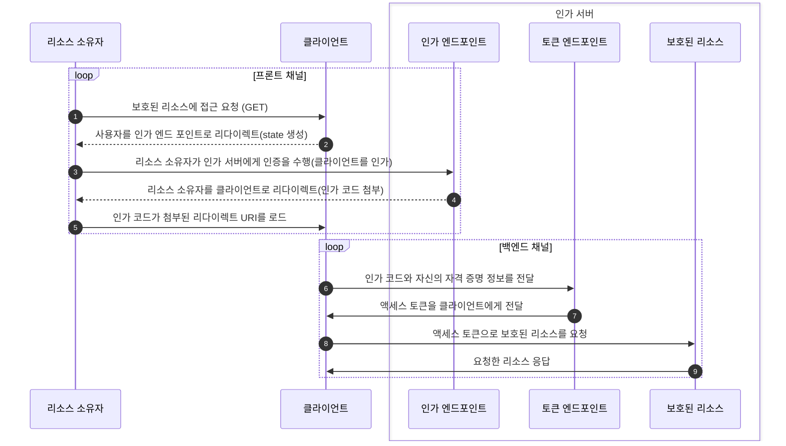
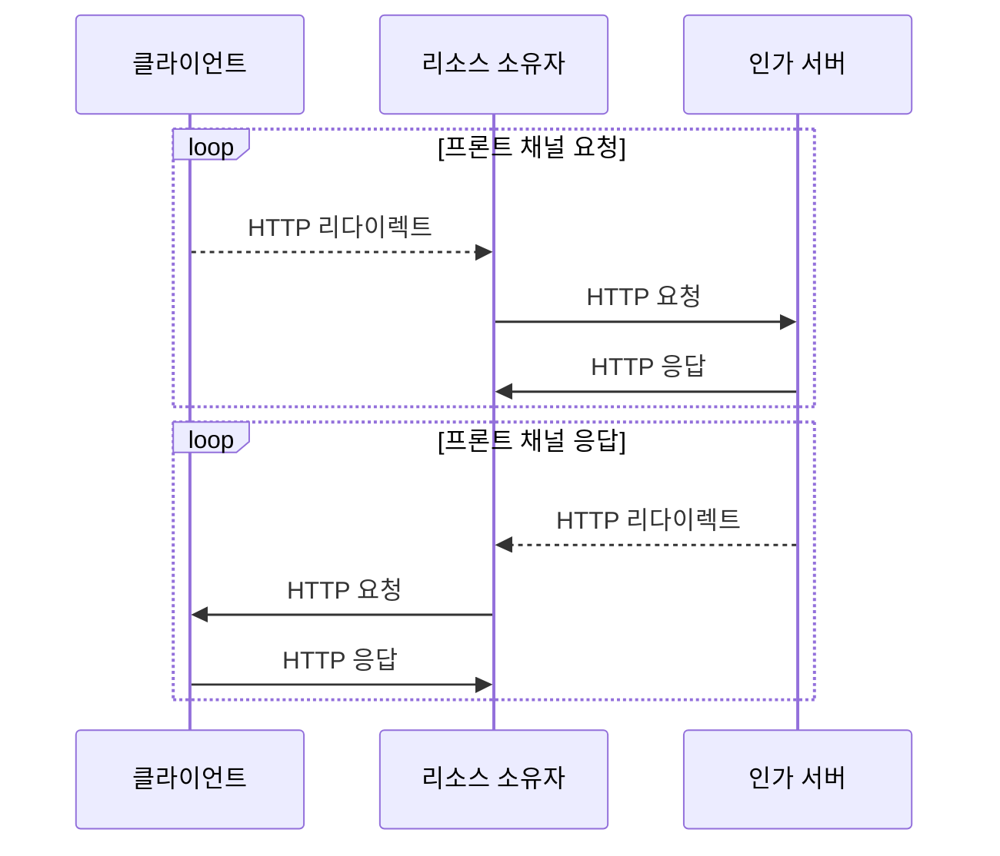
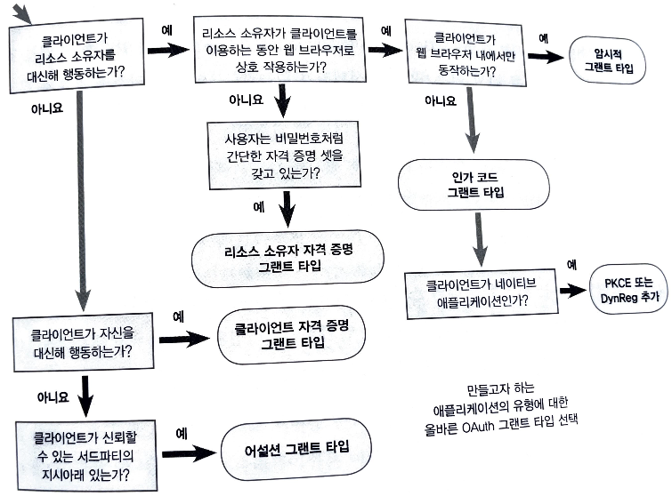
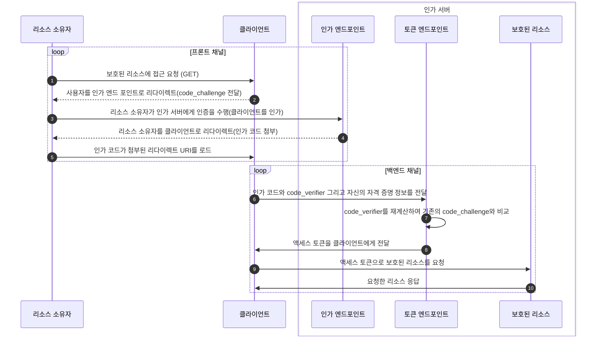
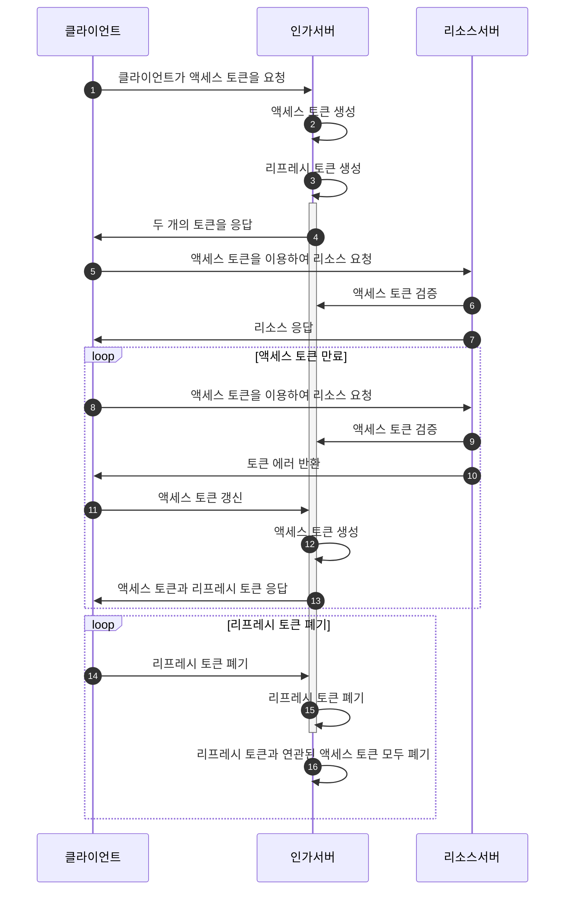

# 메모
1. 이 책에서의 OAuth는 액세스 토큰을 얻기 위한 몇 가지 방법을 자세히 설명하는 [OAuth 스펙](https://datatracker.ietf.org/doc/html/rfc6749)에 정의된 프로토콜을 OAuth라고 간주한다. 또한 Bearer 토큰의 사용 방법을 기술하고 있는 부가적인 스펙의 내용도 포함한다.
1. 액세스 토큰을 발급하는 방법 중에서 OAuth 2.0 인가 코드 그랜트 유형이 있다.
2. OAuth는 클라이언트가 사용자에게 사용자의 일부 권한을 위임해달라고 요청할 수 있는 수단을 제공하여 사용자는 클라이언트의 요청을 승인해 보호된 리소스에 접근할 수 있는 권한을 위임 과정을 시작하도록 한다.
   1. OAuth 프로토콜은 리소스 소유자를 대신해 동작하는 것이 전부라고 할 수 있다.
3. OAuth를 정의한 RFC에 인가 프로토콜로 기술돼 있다.
4. OAuth는 기본적으로 사용자가 소프트웨어에 권한을 위임하는 것이지만, **사용자간의 권한 위임 메커니증은 정의하지 않는다.**
   - OAuth에서 리소스 소유자는 클라이언트를 통제하는 사람이라고 가정한다.
   - 리소스 소유자가 다른 사람을 인가할 수 있게 하려면 OAuth만으로는 힘들다. UMA 프로토콜은 OAuth를 이용해 사용자 간의 권한 위임이 가능한 시스템을 만든다.
5. OAuth는 권한 위임이 이뤄졌다는 사실을 전달하기 위한 방법을 제공하지만, **권한 인가 자체의 내용을 정의하지는 않는다.**
   - 대신, 토큰 같은 OAuth의 구성 요소를 이용해 허용 가능한 작업이 어떤 것인지 서비스 API로 정의한다.
   - 즉, **인가 접근 시스템을 위한 권한 위임 프로토콜이다.** 
6. OAuth는 토큰의 포맷을 정의하지 않는다.
   - 토큰을 통해 어떤 정보를 전달하지는 전적으로 선택 사항이다.
7. **OAuth는 유연성을 최대한 유지하기 위해 실제 API 시스템의 많은 세부적인 내용까지 정의하지는 않는다.**
   - 특히, 클라이언트가 보호된 리소스와 어떻게 대화를 하는지 그리고 클라이언트가 보호된 리소스에 대한 인가 서버를 어떻게 찾는지, 사용자와 인가 서버에서 사용해야 하는 인증 기술에 대해 정의하지 않는다.
   - OpenID 커넥트와 UMA와 같이 OAuth 위에서 동작하는 몇몇 프로토콜은 그런 문제를 표준적인 방법으로 해결하며, 이에 대한 내용은 13장,14장에 등장한다.
8. **인증 과정에서 클라이언트를 분리시킴으로써 클라이언트가 사용자의 인증 방법을 변경하지 못하게 하며, 인가 서버에 적용되는 위험 기반의 휴리스틱 인증과 같은 새로운 인증 기술을 단순한 클라이언트 애플리케이션도 자연스럽에 이용할 수 있게 된다.**
9.  클라이언트는 자신이 호출할 API를 위해 어떤 권한이 필요한지를 파악해야 한다.
10. OAuth 프로토콜에서는 인가 서버가 클라이언트를 인증하는 단계는 있지만 리소스 소유자를 인증하는 방법에 대해서는 구체적으로 정의하지 않는다.
    - OpenID Connect와 같은 OAuth 기반의 인증 프로토콜을 사용해 리소스 소유자가 인가 서버에 로그인하게 만들 수도 있다.
11. HMAC 시그니처를 이용한 대칭 서명과 검증, RSA 시그니처를 이용한 비대칭 서명과 검증
12. 토큰 인트로스펙션 과정에서 보호된 리소스도 인가 서버에 클라이언트로 등록하고 진행해야하는 것인가?
13. 인가 서버와 클라이언트에서는 클라이언트 ID, 클라이언트 시크릿, 인가 코드, 액세스 토큰, 리프레시 토큰을 어떤 식으로 관리해야 할까?
    1.  만약 클라이언트가 리프레시 토큰을 받았을 때 직접 리프레시 토큰을 폐기하지 않는다면 TOFU에 의해 무한적으로 액세스 토큰을 발급받고 사용할 수 있는 것인가?
14. 인가 토큰 엔드 포인트에서 클라이언트 식별자로 리다이렉트 URI와 권한 범위, 사용자에게 어떤 정보를 출력해줘야 하는지 결정한다고 한다.
    1.  이때 사용자에게 보여주는 정보란 무슨 정보일까? 인가 서버가 인가 코드를 응답하면 바로 클라이언트에게 리다이렉트 될텐데 사용자가 볼 수 있는 정보란 무엇일까?
15. 시크릿을 공개해 클라이언트를 공개 클라이언트로 만들게 되면 인가 코드와 토큰 탈취 그리고 악의적인 소프트웨어에 의한 클라이언트 위조와 같은 모든 종류의 공격에 노출된다.

> 아래의 모든 설명에 적용되는 가정이 있다.  
> 사용자(리소스 소유자)는 사진 인화 서비스(클라이언트)를 사용 중이며 사진 인화 서비스를 통해 사진 저장 서비스(인가 서버, 리소스 서버)에 저장한 사진을 인화하려고 하는 것이다.  

# 1장 OAuth 2.0이 무엇이고, 왜 관심을 가져야 할까?

## 자격 증명 공유 방법의 위험성은 무엇인가요?

과거에 사용되던 자격 증명 공유 방법으로는 **사용자의 자격 증명을 복사해 연결하고자 하는 다른 서비스에 전달하는 것이다.**  
이 전제는 클라이언트와 인가 서버가 한 사용자에 대한 자격 증명이 서로 동일하다고 가정하는 것이다.  
클라이언트는 사용자 행세를 하는데 필요한 아이디와 비밀번호 또는 도메인 세션 쿠키와 같은 자격 증명을 전달받아 **마치 사용자가 직접 로그인한 것과 동일하게 보호된 리소스에 접근한다.**  
즉, **클라이언트와 보호된 리소스간의 직접적인 연결이 이뤄진 것이다.**  
  
또 다른 방법은 클라이언트가 사용자에게 보호된 리소스에 접근하기 위한 아이디와 비밀번호를 직접 요청하여 해당 정보를 인가 서버에 직접 전달한다.  
그리고 인가 서버에 대한 접근 권한을 유지하기 위해 클라이언트는 기존에 사용한 자격 증명을 저장해 필요할 때 다시 사용할 수 있도록 저장하다.  
  
하지만 위의 두 방법은 자격 증명 탈취에 대한 보안성이 제한된다.  
클라이언트는 사용자로 가장하기 때문에 **보호된 리소스 입장에서는 자신에게 접근하는 것이 실제 리소스 소유자인지 리소스 소유자를 가장한 클라이언트인지 구분할 수 없다.**  
그리고 **클라이언트가 침해되면 사용자의 계정 또한 같이 침해될 수 있다.**  
  
따라서 **사용자의 자격 증명을 저장해 이용하는 것은 매우 한정된 상황에서만 사용돼야 한다.**  

## 자격 증명 공유를 안전하게 할 수 있는 방법은 무엇인가요?

**개발자 키** 를 클라이언트에 발급하고, 클라이언트는 그것을 이용해 보호된 리소스를 직접 요청하는 것이다.  
사용자의 자격 증명이 클라이언트에 노출되지 않는다는 것이 장점이지만, 키가 탈취되면 정상적인 클라이언트가 접근하는지와 상관없이 사용자의 모든 데이터가 유출된다는 단점이 있다.   
  
또 다른 방법으로는 **단지 서드파티 서비스에 공유할 목적으로만 사용되는 특별한 비밀번호를 사용자에게 발급하는 것이다.**  
사용자는 발급받은 비밀번호를 로그인하는 용도로 사용하지 않고 자신이 이용하기 위한 애플리케이션(클라이언트)에 전달한다.  
사용자의 자격 증명이 클라이언트에 노출되지 않고, 보호된 리소스는 클라이언트가 사용자 대신 항상 올바로 동작할 것이라는 암묵적인 신뢰를 할 필요가 없다는 장점이 있다.  
하지만 사용자는 기존의 비밀번호뿐만 아니라 특별한 자격 증명을 만들고 배포하고 관리해야 한다.  
그리고 사용자가 자격 증명을 직접 관리하고 할당하기 때문에 클라이언트와 해당 자격 증명 자체와는 연관성이 없어 특정 애플리케이션의 접근 권한을 철회하는 것이 어렵다.  
  
## 접근 권한 위임 방법은 무엇이며, 접근 권한을 허용하는 절차에 대해서 설명해 주세요.?

자격 증명 공유의 단점을 보완하는 **OAuth는 사용자가 보호된 리소스에 대한 자신의 접근 권한 일부를 클라이언트 애플리케이션에세 위임하기 위해 설계된 프로토콜이다.**  
OAuth 프로토콜은 **클라이언트가 토큰을 요청하고 사용자는 해당 클라이언트를 인가하는 상대적으로 간단한 방법으로 클라이언트에게 접근 권한을 부여한다.**  
  
보호된 리소스는 인가 서버를 신뢰하며, 인가 서버는 특정 목적의 보안 자격 증명(OAuth 액세스 토큰)을 클라이언트에게 발급한다.  
클라이언트는 액세스 토큰을 획득하기 위해 리소스 소유자가 인가 서버에 해당 클라이언트에 대한 권한을 위임하도록 요청한다.  
그러면 일반적으로 리소스 소유자는 요청한 클라이언트를 인가할 것인지 여부를 인가 서버를 통해 선택한다.  
클라이언트는 접근할 수 있는 리소스 범위와 수행할 수 있는 기능을 지정해 요청할 수 있으며, 리소스 소유자는 요청된 권한을 축소할 수도 있다.  
일단 접근이 인가되면 클라이언트는 인가 서버에 액세스 토큰을 요청할 수 있다.  
발급받은 액세스 토큰을 이용해 클라이언트는 보호된 리소스에 접근하기 위한 API를 호출할 수 있다.  
  
접근 권한 위임 방법을 자격 증명 공유 방법에 비교하면
1. 리소스 소유자의 자격 증명이 노출되지 않는다.
2. 클라이언트가 강력한 개발자 키를 보유하지 않기 때문에 독자적으로 보호된 리소스에 접근하지 못한다.
3. 리소스 소유자가 인가 서버에 인증하는 것과는 별개로 클라이언트아 인가 서버와 통신한다.
4. 보호된 리소스에 접근하려면 먼저 유효한 리소스 소유자로 부터 접근을 인가받아야 한다. (OAuth 클라이언트가 스스로 인가 서버에 인증을 받을 수 있는 수단을 갖고 있다고 하더라도 필요한 절차다.)
5. 일반적으로 사용자는 액세스 토큰을 직접 보거나 처리할 필요가 없다.

## OAuth 2.0이 TOFU(Trust On First Use)원칙을 따르는 이유는 무엇인가요?

TOFU 모델은 사용자에게 보안 결정을 내리도록 요구하는 유연성과 그런 결정을 지속적으로 내리도록 요구하는 피로도 간에 적절한 균형을 유지하기 위함이다.  
사용자가 인식하지 못하는 상황에 권한이 위임되거나 사용자에게 너무 많은 권한 요청을 물어보는 균형을 지키는 것이다.  
  
**OAuth에서는 중요한 보안 의사 결정권 일부를 소프트웨어를 사용하는 사용자에게 넘겨주기 때문에 TOFU 원칙을 따른다.**  
TOFU 모델에서는 처음에 보안 결정을 위한 어떤 전후 사정이나 설정이 존재하지 않기 때문에 보안적인 결정이 런타임에 사용자에게 요구된다.  
그리고 시스템이 이후를 위해 사용자의 결정을 기억한다.  
  
TOFU 모델에 그레이 리스트를 적용할 수 있다.  

## OAuth 2.0이 HTTP 프로토콜과 독립적으로 정의되지 않는 이유는 무엇인가요?

**OAuth 2.0 Bearer 토큰은 메시지 시그니처를 제공하지 않기 때문에 HTTPS를 이용해야 한다.**  
따라서 민감한 정보를 전달하려면 OAuth는 TLS와 같은 안전한 전송 계층 매커니즘이 필요하다.  
미래에는 TLS를 이용하지 않고도 OAuth를 이용하기 위한 노력이 이뤄질 것이다.  
  
**메시지 시그니처란?**  
- HTTP 메시지 시그니처는 HTTP 메시지의 무결성과 인증을 보장하는 방법 중 하나로, 메시지의 일부 또는 전체를 암호화한 서명을 헤더에 포함시키는 방식입니다. 이를 통해 메시지가 전송 중에 변경되지 않았음을 확인할 수 있으며, 해당 메시지가 신뢰할 수 있는 소스에서 왔음을 인증할 수 있습니다.
- HTTP 메시지 시그니처는 다음과 같은 과정으로 이루어집니다.
  1. 서명자는 HTTP 메시지의 특정 부분(예: 헤더, 바디 등)을 선택합니다.
  2. 이 선택된 부분을 바탕으로 해시를 생성합니다.
  3. 생성된 해시를 서명자의 비공개 키로 암호화하여 디지털 서명을 만듭니다.
  4. 이 디지털 서명을 HTTP 메시지의 'Signature' 헤더에 포함시킵니다.
- 메시지를 받는 측은 다음과 같은 과정으로 메시지의 무결성과 인증을 확인할 수 있습니다.
  1. 'Signature' 헤더에서 디지털 서명을 추출합니다.
  2. 서명자의 공개 키를 사용하여 디지털 서명을 복호화하여 해시를 얻습니다.
  3. 동일한 방법으로 HTTP 메시지에서 해시를 생성합니다.
  4. 두 해시가 일치하면 메시지의 무결성이 보장되며, 서명자가 신뢰할 수 있는 소스임이 인증됩니다.
- 물론, 이 기능을 사용하기 위해서는 서버와 클라이언트 모두에서 해당 기능을 지원하는 소프트웨어나 라이브러리가 필요합니다.
- 이는 표준 HTTP 프로토콜에 포함되어 있지 않은 추가적인 기능으로, 보안이 중요한 상황에서 사용됩니다.

# 2장 OAuth 2.0의 기본

## OAuth 트랜잭션의 두 가지 중요한 단계는 무엇인가요?

토큰을 발급하고 발급된 토큰을 사용하는 것이다.  
**토큰은 클라이언트에게 위임된 접근 권한을 의미하며, OAuth 2.0의 모든 부분에서 중요한 역할을 담당한다.**  

## Authorization Grant절차에 대해서 설명해 주세요.

- 9000포트 : 클라이언트
- 9001포트 : 인가 서버
- 9002포트 : 보호된 리소스




- 클라이언트가 OAuth 액세스 토큰이 필요하다고 인지하면 리소스 소유자의 권한 일부를 자신에게 위임해달라고 요청하기 위해 리소스 소유자를 인가 서버의 인가 엔드 포인트로 리다이렉트 시킨다.
  - 302 코드와 Location 헤더를 통해 인가 서버의 인가 엔드 포인트를 응답으로 받아 웹 브라우저가 Location 헤더의 정보로 GET 요청을 보낸다.
  - 해당 Location 헤더에는 사용자가 인가 서버에게 클라이언트가 요청한 권한 위임을 수락하였을 때 인가 서버에서 클라이언트에게 인가 코드를 전달하기 위해 자신의 콜백 API 정보, scope 등을 쿼리 파라미터에 포함시킨다.
- 사용자는 인가 서버로 리다이렉트된 화면을 접하고 사용자가 권한 위임을 승인하면 인가 서버는 사용자를 다시 클라이언트로 (클라이언트가 첨부한 경로로)리다이렉트 시키며 Location 헤더에 인가 코드를 함께 전달한다.
- **클라이언트가 엑세스 토큰을 얻기 위한 인가 서버의 요청에는 헤더에 `Authorization: Basic {token}`이 담기며, 인가 서버의 엑세스 토큰 응답에는 토큰 타입이 `Bearer`이 담겨있다.**
  - 클라이언트가 액세스 토큰을 통해 보호된 리소스에 요청을 보낼 때에 `Authorization: Bearer {token}`으로 요청한다.
- `6번`에서 클라이언트가 인가 서버에게 요청하는 방법은 여러가지가 있다.
  - 클라이언트 ID와 클라이언트 시크릿을 HTTP Basic 인증으로 전달하는 방법
  - 폼의 파라미터로 전달하는 방법
  - 인가 서버는 HTTP의 Authrization을 먼저 확인하고 폼 파라미터를 확인한다. 클라이언트가 동시에 두 가지 방법 모두를 사용하면 에러를 반환한다.
- `2번`에서 클라이언트는 사용자에게 redirect_uri, scope, client_id, (CSRF를 막기 위한)state를 준다.
- `6번`에서 client_id, client_secret, code 를 전달한다. (code가 client_id)

## OAuth의 구성 요소 중 액세스 토큰에 대해서 설명해 주세요.

간단히 토큰이라고도 하며, **클라이언트에게 권한이 위임됐다는 것을 나타내기 위해 인가 서버가 클라이언트에게 발급한다.**  
OAuth에서는 토큰의 포맷이나 내용을 정의하지 않으며 **클라이언트가 요청한 접근 권한, 리소스 소유자의 클라이언트 인가, 그리고 인가 과정에서 클라이언트에 부여된 권한을 포함한다.**  
인가 서버는 토큰을 만들어 발급하고 보호된 리소스는 토큰을 검증하기 때문에 토큰 자체를 이해할 수 있어야 한다.  

## OAuth의 구성 요소 중 Scope에 대해서 설명해 주세요.

보호된 리소스에 대한 접근 권한을 나타내며, 공백으로 구분된 범위 문자열의 조합으로 표현된다.  
하지만 범위값의 포맷과 구조가 OAuth 스펙에 정의된 것은 아니다.  
  
**클라이언트에게 부여되는 접근 권한을 제한하기 위한 중요한 메커니즘이다.**  
클라이언트는 추가 권한이 필요하다면 추가 범위를 인가해달라고 요청해야 한다.  

## 클라이언트가 리프레시 토큰을 사용해야 하는 이유는 무엇인가요?

OAuth 1.0에서는 토큰이 명시적으로 폐기될 때까지 영원히 사용하는 경향이 있었다.  
해당 토큰이 탈취되면 탈취한 공격자도 영원히 사용할 수 있다는 문제가 있었다.  
  
OAuth 2.0에서는 토큰의 유효기간이 자동으로 설정되기 때문에 유효 기간이 만료되었을 때 사용자가 없어도 리소스에 접근할 수 있는 방법이 필요하다.  
**클라이언트가 기존에 사용하던 엑세스 토큰이 만료되거나 거부된다면 이 리프레시 토큰을 이용해 (리소스 소유자와는 관련없이) 새로운 엑세스 토큰을 요청할 수 있다.**  
  
리프레시 토큰은 엑세스 토큰을 재발급하는 용도로만 사용되며, 클라이언트의 접근 권한을 축소시킬 수도 있다.  
  
## 인가 그랜트란 무엇인가요?

OAuth 프로토콜을 이용해 OAuth 클라이언트에게 보호된 리소스에 대한 접근 권한을 위임해주기 위한 방법이며, 그것이 성공적으로 이뤄지면 클라이언트는 최종적으로 액세스 코드를 얻게 된다.  
인가 그랜트는 OAuth 2.0에서 **사용자가 권한을 위임하는 특정 메커니즘을 나타낼 때** 뿐만 아니라 **권한 위임 행위 자체** 를 나타낼 때도 사용되기 때문에 혼동을 주는 용어 중에 하나이다.  
  
인가 코드는 사용자의 권한 위임 결정을 의미하기는 하지만, 그것 자체가 인가 그랜트는 아니다. **인가 그랜트는 OAuth 전체 프로세스를 의미한다.**  
즉, **클라이언트가 사용자를 인가 엔드 포인트로 이동시키고, 인가 코드를 전달받고 마지막으로 인가 코드를 토큰과 교환하는 과정 자체가 인가 그랜트인 것이다.**  

## OAuth의 구성 요소는 서로 간의 통신을 위해 직접적, 간접적인 HTTP 통신을 수행합니다. 두 통신에 차이점에 대해서 설명해 주세요.

<h3>백 채널 통신</h3>

OAuth 프로세스의 많은 부분에서 일반적인 HTTP 요청과 응답으로 구성 요소간의 통신이 이뤄진다.  
일반적으로 **리소스 소유자와 사용자 에이전트 범위 밖에서 이뤄지기 때문에 백 채널 통신이라고 한다.**  
브라우저를 제외한 구성 요소 간의 직접적인 HTTP 연결이라고 볼 수 있다.  
  
<h3>프론틑 채널 통신</h3>

OAuth에서는 클라이언트와 인가 서버가 직접 HTTP 요청을 보내고 응답을 받지 않는 경우가 있다.  
즉, 클라이언트가 인가 서버의 인가 엔드 포인트와 상호 작용하는 것이 바로 그런 경우이다.  
**중간의 웹 브라우저를 통해 두 시스템이 간접적으로 리다이렉트를 통해 HTTP 통신을 하는 것을 프론트 채널 통신이라고 한다.**  
  
이 기술은 **웹 브라우저의 양쪽 세션을 분리하며, 그로 인해 서로 다른 보안 도메인 간의 작업을 가능하게 해준다.**  
프런트 채널 통신은 **웹 브라우저가 방문해야 하는 URL을 파라미터로 전달함으로써 이뤄진다. 그런 URL을 전달받는 쪽에서는 해당 URL을 파싱하고 함께 전달된 파라미터와 동일한 방법으로 웹 브라우저를 해당 URL로 리다이렉트 한다.**  
  


이런식으로 **클라이언트와 인가 서버는 서로 직접 대화하지 않고 중개인을 통해 서로 메시지를 전달한다.**  
프런트 채널을 통해 전달되는 모든 정보는 웹 브라우저가 접근 가능하다.  
따라서 그 내용을 읽거나 질의가 전송되기 전에 질의 내용이 조작될 잠재적인 가능성이 존재한다.  
이 점 때문에 OAuth 프로토콜은 프런트 채널을 통해 전달되는 정보의 종류를 제한하고 프런트 채널에서 사용된 어떤 정보도 단독으로 권한 위임 작업을 위해 사용될 수 없도록 한다.  

# 3장 간단한 OAuth 클라이언트

OAuth 클라이언트와 인가 서버가 통신하기 위해서는 서로 식별할 수 있어야 한다.  
하지만 OAuth 프로토콜 자체에서는 그것이 `어떻게` 이뤄지는지는 상관하지 않으며, 단지 `어떤식으로든 이뤄지면 된다`.  
실제로 클라이언트 식별자 할당은 개발자 포털이나 동적 클라이언트 등록(12장) 또는 기타 다른 절차를 통해 이뤄진다.  
  
3장에서는 서로 다른 OAuth 구성원을 모두 완벽하게 분리시키기 때문에 가장 기본적이고 핵심적인 그랜트 타입인 **인가 코드 그랜트 타입** 을 위주로 설명한다.  

## 인가 요청에 리다이렉트 URI가 포함되어 있었다면 토큰을 요청할때도 그것과 동일한 URI를 함께 전달해야 하는 이유는 무엇인가요?

클라이언트가 인가 프로세스를 시작하기 위해서는 인가 서버로 리다이렉트할 URL에 적당할 질의 파라미터를 포함시켜 사용자를 서버의 인가 엔드 포인트로 리다이렉트해야 한다.  
리다이렉트할 목적지 URL에 인가 코드를 전달받을 클라이언트 스스로의 URL(`redirect_uri`)을 첨부한다.  
그 다음 인가 코드를 사용하여 토큰을 얻기 위해 토큰 엔드 포인트로 POST 요청을 보낼 때 이전에 요청한 `redirect_uri`를 첨부해야 한다.  
하지만 인가 서버가 토큰을 전달할 때는 이 `redirect_uri`를 사용하지 않는다.  
  
사용하지 않는데 보내야하는 이유는 OAuth 스펙에 따르면, **인가 요청에 리다이렉트 URI가 포함되어 있었다면 토큰을 요청할 때도 그것과 동일한 URI를 함께 전달해야 한다. 그렇게 함으로써 공격자가 리다이렉트 URI와 세션에 인가 코드를 삽입하는 것을 방지할 수 있다.**  
(서버단에서의 리다이렉트 URI 검증 구현에 대해서는 9장에서 등장한다.)  
클라이언트는 또한 자신이 전달하는 요청이 HTTP 폼 인코딩됐다는 것을 나타내기 위한 헤더와 클라이언트 인증을 위한 HTTP Basic 인증 헤더를 함께 전달해야 한다.  
Basic 인증을 위한 Authorization 헤더는 사용자 이름과 비밀번호를 콜론(:) 문자로 연결해 Base64로 인코딩한 문자열이다.  

## state 파라미터를 추가해야 하는 이유는 무엇인가요?

인가 코드 요청과 토큰 요청에서 사용된 클라이언트의 `redirect_uri`에 누군가 방문할 때 마다 입력 값을 가져와 그것을 다시 인가 서버에 전달하려고 할 것이다. (`redirect_uri`를 콜백 API라고 칭하겠다.)  
**이 콜백 API를 찾아내서 공격자가 클라이언트를 이용해 유효한 인가 코드를 얻기 위한 공격을 수행할 수 있고, 그로 인해 클라이언트와 서버의 자원이 낭비되고 잠재적으로는 클라이언트가 실제로 요청하지도 않은 토큰을 가져오게 만들수도 있다.**  
  
이를 위해 `state`라는 선택적인 OAuth 파라미터를 이용할 수 있다.  
중요한 점은 **`state` 값은 `redirect_uri`이 호출됐을 때 `state` 값을 확인할 수 있도록 클라이언트 애플리케이션에 저장해야 한다는 것이다.**  
인가 엔드 포인트로 전달되는 파라미터에 `state` 파라미터를 추가해야 한다.  
그리고 현재 단계에서는 프런트 채널을 이용하기 때문에 일단 인가 엔드 포인트로 리다이렉트된 이후에는 클라이언트는 사용자의 웹 브라우저에서 리다이렉트를 통한 요청이 들어올 때 까지 OAuth 프로토콜에 대한 제어권이 없다는 점을 명심해야 한다.  
  
인가 서버는 인가 엔드포인트에서 받은 `state`를 그대로 클라이언트에게 전달해야 한다.  
즉, 클라이언트는 콜백 API가 정상적인 경로로 호출됐는지 아니면 다른 악의적인 사용자가 호출했는지, 이 인가 요청이 실제로 클라이언트에 의해 시작됏는지 구분할 수 있기 때문에 이 `state` 값이 동일하지 않으면 에러를 반환할 것이다.  

## OAuth 클라이언트는 언제든지 액세스 토큰이 작동을 멈출 수 있다고 예상하고, 그에 따른 올바른 대응을 할 수 있어야 하는 이유는 무엇인가요?

사용자가 권한을 위임한 이후에 더 이상 사용자에게 재위임을 요청할 수 없을 때 리프레시 토큰을 통해 액세스 토큰을 다시 얻을 수 있도록 클라이언트는 대비해야 한다.  
리소스 소유자는 토큰이 만료되기 전에 토큰을 폐기할 수 있으며, 클라이언트는 토큰의 만료 시간에 대한 정보만으로 토큰의 상태를 알기가 어렵기 때문에 잘 설계된 OAuth 클라이언트는 언제든지 액세스 토큰이 작동을 멈출 수 있다고 예상하고 그에 따른 올바른 대응을 할 수 있어야 한다.  

# 4장 간단한 OAuth 리소스 서버

## 클라이언트가 리소스 서버에게 Bearer 토큰을 보내는 3가지 방법은 무엇인가요?

1. **HTTP Authorization 헤더를 이용하는 방법**
   -  Bearer 키워드 다음에는 바로 공백 문자와 토큰 값이 이어져야 한다.
   -  Authorization 헤더와 Bearer 키워드는 대소문자를 구분하지 않는다. **토큰 자체는 대소문자를 구분한다.**
2. **폼 인코딩된 요청 파라미터로 전달하는 방법**
3. **URI 인코딩된 질의 파라미터로 전달하는 방법**

2번은 컨텐트 타입이 폼 인코딩으로 제한되고 POST 전송만 사용할 수 있다는 단점이 있다.  
3번 질의 파라미터로 전달하는 방법은 서버의 로깅 또는 Referer 헤더로 인해 유출될 수 있다.  

## 리소스 서버와 인가 서버는 데이터베이스를 공유해야 하는가요?

OAuth 구현에서 데이터베이스를 공유해 사용하는 것은 일반적인 패턴이지만, 꼭 사용해야하는 것은 아니다.  
**토큰 인트로스펙션** 이라는 표준화된 웹 프로토콜이 있는데, 이를 사용하면 리소스 서버는 토큰의 상태를 런타임으로 체크할 수 있다.  
  
토큰을 구별하기위한 식별자는 토큰 자체를 해시하여 사용하거나 아니면 토큰 내부에 식별자를 넣어놓는 방법이 있을 수 있다.  

# 5장 간단한 OAuth 인가 서버

## OAuth2.0이 만들어지면서 클라이언트나 보호된 리소스에 대한 복잡한 내용들이 최대한 인가서버로 포함된 이유는 무엇인가요?

각 구성 요소의 수 때문이다.  
즉, 보호된 리소스보다 클라이언트의 수가 더 많고, 인가 서버보다 보호된 리소스의 수가 더 많기 때문이다.

## 인가서버가 2개의 엔드포인트를 가져야 하는 이유는 무엇인가요?

프론트 채널을 위한 인가 엔드 포인트와 백 채널을 위한 토큰 엔드 포인트 2개가 필요하기 때문이다.  

## client_id는 프론트채널로 전달되어서 공개될 수 있습니다. 그래서 아무나 흉내낼 수 있는데, 이를 방지할 수 있는 방법은 무엇일까요?

인가 엔드 포인트에서는 인가를 요청한 클라이언트를 확인하기 위해 `client_id`를 통하여 등록된 클라이언트인지 확인한다.  
하지만 이 `client_id`는 공개된 정보라서 정상적으로 등록된 클라이언트를 흉내낼 수 있다.  
  
전달된 요청이 적법한 요청인지를 확인할 수 있는 대표적인 정보르는 `redirect_uri`를 활용할 수 있다.  
**등록된 클라이언트 정보의 `redirect_uri`와 전달된 값이 같이 않다면 에러가 반환된다.**  
OAuth 스펙에서는 하나의 등록된 클라이언트에 대해 여러 개의 `redirect_uri` 값 설정을 할 수 있다.  
  
전달받은 정보와 등록된 정보가 서로 다르면 에러를 반환한다고 하였는데 이 경우에는 악의적인 공격자가 접근한 것으로 판단되기 때문에 에러에 대한 자세한 정보를 반환하지 않는다.  

> 클라이언트에 대한 검증이 통과되면 사용자에게 권한을 위임할 것인지를 묻는 페이지를 응답한다.  
> 사용자는 해당 페이지에서 권한 위임을 승인하게 되고, 인가 서버에 HTTP 요청을 발생시킨다.  
> 인가 서버는 전달되는 요청의 파라미터를 사용자가 승인한 이후에 다시 참조할 수 있도록 임의의 키 값을 이용해 저장한다. `키(randomString) : 값(req.query)`  
> 이 `req.query`가 사용자가 클라이언트를 승인할 것인지 선택하는 화면에서 보여줄 클라이언트의 정보도 포함된다.  
> 이때 사용되는 임의의 키값은 다음 단계의 추가 처리를 위해 원래 전달된 요청 데이터를 찾는데 사용되므로 간단한 **CSRF** 공격 차단 효과를 제공한다.  
> 사용자가 클라이언트의 권한 위임 승인을 인가 서버에 전송하면 HTTP POST로 HTTP 폼 인코딩된 형태의 값으로 전달된다.  
> 이때 위에서 만든 `randomString`이 포함되어 있다. 이것을 `reqId`로 칭하자.  
> 인가 서버는 이 `reqId`로 지연된 인가 요청을 찾는다. 찾지 못한다면 CSRF 공격일 수 있기 때문에 에러 페이지를 보여준다.  
> 만약 사용자가 권한 위임을 거부했다면 `redirect_uri`에 특별한 질의 파라미터를 추가해 전송하면 된다.  

## 클라이언트의 인가 코드가 확인되면 저장 정보를 즉시 삭제해야 하는 이유는 무엇인가요?
  
악의적인 클라이언트가 탈취된 인가 코드를 사용할 수 있기 때문에 한 번 사용된 인가 코드는 더 이상 사용할 수 없게 만들기 위해 즉시 삭제해야 한다.  
올바른 클라이언트라고 하더라도 인가 코드를 재사용하면 인가 서버는 그것이 이미 침해된 것이라고 간주해 클라이언트가 원하는 동작을 수행하지 않도록 하기 위함도 있다.  

## 인가 서버가 클라이언트를 인가하여 토큰을 발급하는 과정을 설명해 주세요.

이 토큰을 발급하는 과정을 **인가 그랜트 요청 처리** 라고 한다.  
  
인가 서버는 `grant_type` 파라미터의 값을 확인해 처리할 수 있는 그랜트 타입인지를 확인한다.  
이 책에서는 인가 코드 그랜트 타입만 지원할 것이기 때문에 `grant_type : authorization_code`일 것이다.  
만약 지원하지 않는 그랜트 타입이면 에러를 반환한다.  
  
1. 인가 코드를 추출하여 해당 코드가 존재하는지 확인하며 없다면 에러를 반환한다.
2. 인가 서버는 인가 엔드 포인트에 전달된 클라이언트의 인가 요청 내용도 저장했기에 `client_id`도 동일한지 비교하며 다르다면 에러를 반환한다.
3. 액세스 토큰과 리프레시 토큰을 만들고 따로 저장공간에 저장한다.
   - 토큰이 발급된 이후에 인가 서버에서는 리프레시 토큰만 사용할 것이고, 보호된 리소스에서는 액세스 토큰만 사용하게 되기 때문에 키를 다르게 해 저장하는 것이 중요하다.
4. 클라이언트에게 JSON 객체로 리프레시 토큰, 엑세스 토큰과 토큰이 어떤 종류인지, 토큰을 어떻게 사용해야 하는지 알 수 있도록 `token_type`이 포함된다. (여기서는 Bearer 토큰을 사용한다.)
   - 종류와 `token_type`같은 파라미터는 모두 액세스 토큰에 대한 내용이다.

## 리프레시 토큰을 사용하여 새로운 인증 토큰을 발급하는 과정을 설명해 주세요.

리프레시 토큰은 토큰 엔드 포인트에서 특별항 종류의 인가 그랜트로서 사용된다.  
액세스 토큰 갱신 요청 시의 `grant_type` 값은 `refresh_token`이다.  
  
1. 토큰 저장소에 전달된 리프레시 토큰이 유효한지 확인한다.
2. 해당 리프레시 토큰이 토큰 엔드 포인트에서 인가한 클라이언트에게 발급한 토큰인지 확인해야 한다.
   - 악의적인 클라이언트가 리프레시 토큰을 탈취해 액세스 토큰 발급이 가능하므로 확인 결과가 이상하다면 리프레시 토큰을 삭제해야 한다.
3. 리프레시 토큰을 기반으로 새로운 액세스 토큰을 만들어 그것을 저장하고 클라이언트에게 전달한다.
   - 방금 사용된 리프레시 토큰을 다시 클라이언트에게 전달하며 클라이언트도 추후에 재사용할 수 있다.
   - 인가 서버는 리프레시 토큰을 다시 만들어 응답해도 무방하며, 해당 리프레시 토큰이 사용될 때까지 클라이언트에게 발급된 모든 액세스 토큰을 폐기하기로 결정할 수도 있다.

## 권한 범위를 통해서 권한을 제한하는 과정을 설명해 주세요.

각 클라이언트가 서버에서 액세스 할 수 있는 범위를 제한하는 것이 일반적이다.  
이를 위해 정보를 저장하는 구조체에 `scope`라는 정보가 추가된다.  
`scope`에 할당되는 각각의 문자열은 공백 문자로 구분되고 각 문자열은 하나의 OAuth 권한 범위값을 나타낸다.  
클라이언트가 인가 서버에게 `scope` 정보를 전달받았다고 해서 보호된 리소스에 접근할 수 없으며, 여전히 리소스 소유자에게 인가받아야 한다.  
  
클라이언트는 권한 범위 파라미터(공백 문자로 구분된 권한 범위 리스트 문자열)를 이용해 인가를 요청하는 동안 해당 범위의 하위 집합을 요구할 수 있다.  
인가 엔드 포인트에서는 권한 범위 처리를 쉽게하기 위해 전달된 권한 범위 문자열을 파싱해 배열로 변환하고 `rscope`라는 변수에 저장할 것이다.  
서버에 설정된 클라이언트의 권한 범위값도 마찬가지로 파싱해 `cscope`라는 변수에 저장한다.  
  
인가 서버는 요청된 권한 범위와 해당 클라이언트에 등록된 권한 범위를 비교하여 할당된 것 이상의 권한을 요구하는지 확인한다.  
그리고 사용자 승인 페이지를 위한 템플릿을 호출할 때 `rscope` 값을 전달하여 사용자는 클라이언트에게 정확히 어떤 권한 범위를 승인할 것인지 선택한다.  
(사용자가 선택한 권한 범위도 클라이언트에게 허용된 범위를 벗어나는지 확인해야 한다.)  
인가 서버는 이후의 토큰 엔드 포인트에서 권한 정보를 꺼내 확인해야 하기 때문에 사용자가 인가한 권한 범위를 서버가 생성한 인가 코드와 함께 저장한다.  
  
마지막으로 클라이언트에게 발급되는 토큰의 권한 범위 정보를 JSON으로 응답한다.  

> 클라이언트는 리프레시 토큰을 사용해 일부 권한 범위만 가진 새로운 액세스 토큰을 요청할 수도 있다.  
> 이를 위해 토큰 엔드 포인트에서 `refresh_token` 그랜트 타입을 처리하는 부분에 축소된 권한 범위 요청을 처리하는 코드를 작성해야 할 것이다.  
> 인가 엔드 포인트에서는 권한 범위 정보를 올바로 파싱하고 검증하는 부분을 추가해야 한다.

# 6장 현실 세계의 OAuth 2.0

이때까지는 가정을 단순화해서 예제를 확인해보았다. 실제로 현실 세계에서 구축하는 애플리케이션들은 모두 변형된 형태로서 존재하고 동작한다.  
OAuth 2.0은 주요 지점에서 프로토콜의 유연성을 허용함으로써 여러 가지 방법으로 개선할 수 있다.  
OAuth 2.0이 달라질 수 있는 주요 영역 중 하나는 **OAuth 플로라고하는 `인가 그랜트` 영역이다.**  
이 장에서는 인가 코드 그랜트를 제외한 다른 그랜트 타입에 대해 알아본다.  
  
클라이언트가 웹 브라우저 애플리케이션에서 개발되면 웹 브라우저 애플리케이션은 크로스-도메인 공격을 막기 위한 동일한 출처 정책과 그와 관련된 보안 요구 사항에 의해 제한을 받기 때문에 백 채널 통신은 좀 더 복잡하다.  

## 임시적 그랜트 타입은 언제 사용하나요?

인가 코드 플로의 중요한 특징은 서로 다른 구성 요소 간에 정보를 별도로 유지한다는 것이다.  
따라서 **웹 브라우저는 클라이언트만 알아야 하는 사항을 알지 못하며, 클라이언트는 웹 브라우저의 상태 정보를 얻을 수 없다.**  
하지만 클라이언트가 웹 브라우저 내부에 있는 경우는 어떻게 될까?  
  
OAuth 2.0의 임시적 그랜트(Implicit Grant) 타입은 주로 브라우저 기반의 클라이언트나 모바일 애플리케이션과 같이 클라이언트 시크릿을 안전하게 저장할 수 없는 환경을 대상으로 설계되었다.  
이런 경우 클라이언트는 웹 브라우저로부터 중요한 정보를 보호할 수 없고, 웹 브라우저는 클라이언트의 실행에 관련된 모든 것을 알 수 있다.  
**클라이언트가 브라우저 내부에서 동작하기 때문에 인가 서버와의 통신을 위해 프론트 채널만을 사용한다.**  
이 플로는 웹 사이트에 삽입돼 어느정도 제한되고, 보안 도메인 간에 공유되는 세션에 대한 인가를 수행해야 하는 자바스크립트 애플리케이션에게 상당히 유용하다고 할 수 있다.  
   
## 임시적 그랜트 타입을 사용하기 전에 고려해야 하는 제한 사항은 무엇인가요?

1. 클라이언트 시크릿을 포함한 모든 것이 웹 브라우저에게 노출되기 때문에 클라이언트는 자신의 중요한 정보를 보호할 방법이 없다.  
   - 임시적 그랜트 플로에서는 토큰 엔드 포인트는 사용하지 않고 인가 엔드 포인트만 사용하며, 클라이언트는 인가 엔드 포인트에서 인증을 받지 않는다.
   - 리프레시 토큰 또한 발급받을 수 없다.
2. 토큰이 URL 프래그먼트에 포함되어 브라우저의 리디렉션을 통해 전달되므로, 브라우저의 기록이나 로그 등에 토큰이 노출될 수 있다.
   - 임시적 그랜트 대신 PKCE를 사용한 인가 코드 그랜트 타입의 사용을 권장하고 있다.

## 임시적 그랜트 타입을 사용해 토큰을 얻는 과정에 대해서 설명해 주세요.

임시적 그랜트 흐름에서는 클라이언트가 인가 서버의 인가 엔드포인트로 사용자를 리디렉션하고, 사용자가 인증 후, 인가 서버는 리디렉션 URI를 통해 클라이언트에게 액세스 토큰을 직접 반환한다. 토큰 엔드포인트는 이 과정에 사용되지 않는다.

1. 클라이언트가 사용자를 인가 서버의 인가 엔드포인트로 리디렉션하며 이 요청에는 리디렉션 URI, 클라이언트 ID, 필요한 스코프, 그리고 `response_type`으로 `token`이 포함된다.  
2. 사용자가 인가 서버에서 인증을 하고 클라이언트에게 필요한 권한을 부여한다.
3. 인증 및 권한 부여가 성공하면, 인가 서버는 사용자의 브라우저를 클라이언트의 리디렉션 URI로 리디렉션하면서 액세스 토큰을 프래그먼트(#) 부분에 추가하여 반환한다.

## 클라이언트 자격 증명 그랜트 타입은 언제 사용하나요?

명시적인 리소스 소유자가 없거나 리소스 소유자와 클라이언트 소프트웨어를 구별하기 힘들 때 **클라이언트에게 권한을 인가해줄 사용자가 없는 경우에도 클라이언트 자체의 자격 증명을 사용하여 액세스 토큰을 요청할 때 사용된다.**  
  
결과적으로 클라이언트는 백 채널을 사용하게 되고, 토큰 엔드 포인트에서 액세스 토큰을 얻기 위해 리소스 소유자의 역할을 한다.  
즉, 이 방식은 클라이언트가 자신을 위한 액세스 토큰을 얻어, 자신의 리소스나 소유하고 있는 리소스에 접근할 필요가 있을 때 적합하다.  
서버 간 통신, 애플리케이션 API 접근, 마이크로서비스 아키텍처에 사용된다.  
  
각 서비스들은 OAuth 2.0을 지원하는 인증 서버에 클라이언트로 등록되며, 이 과정에서 고유한 클라이언트 ID와 클라이언트 시크릿을 받는다.  


## 클라이언트 자격 증명 그랜트 타입은 왜 리프레시 토큰이 필요 없나요?

해당 그랜트 타입에서 클라이언트는 별도의 리소스 소유자 없이 언제든지 자기자신을 위해 새로운 토큰을 요청할 수 있다고 가정하기 때문에 리프레시 토큰이 필요 없다.  

## 클라이언트 자격 증명을 사용해 토큰을 얻는 과정에 대해서 설명해 주세요.

클라이언트는 인가 코드 그랜트 타입의 경우처럼 토큰 엔드 포인트에 토큰을 요청한다.  
`grant_type`파라미터의 값으로 `client_credentials`를 사용하며, `scope` 권한 요청까지 가능하다.  
HTTP Basic 인증까지 포함시켜 HTTP POST로 요청하며 토큰과 교환하기 위해 인가 코드나 임시적인 자격 증명을 사용하지 않는다.  
인가 서버는 클라이언트를 등록할 때 생성하는 클라이언트 ID와 클라이언트 시크릿을 통해 정상적인 클라이언트인지 구분한다.  
(클라이언트는 클라이언트 ID와 클라이언트 시크릿을 안전하게 저장해야 한다.)  
구분한 후 인가 서버는 토큰을 반환한다.  

## 리소스 소유자 자격 증명은 언제 사용하나요?

리소스 소유자가 인가 서버에 암호화되지 않은 사용자 이름과 비밀번호를 갖고 있다면 클라이언트는 사용자에게 해당 자격 증명 정보를 요구한 후, 그것을 액세스 토큰과 교환할 수 있다. (비밀번호 플로라고도 하며, `grant_type`으로 password가 지정된다.)  
이 그랜트 타입은 토큰 엔드 포인트만 사용하며, 백 채널만 사용한다.  
일반적으로 좋지 않은 방법이다.  

## 리소스 소유자 자격 증명을 사용해 토큰을 얻는 과정에 대해서 설명해 주세요.

1. 사용자는 클라이언트에 자신의 자격 증명 정보를 제공한다.
2. 클라이언트는 제공받은 정보로 인가 서버에 직접 액세스 토큰을 요청한다.  
3. 인가 서버는 요청받은 사용자의 자격 증명 정보로 액세스 토큰(선택적으로 리프레시 토큰)을 발급한다.

## 어설션 그랜트 타입 증명을 사용해 토큰을 얻는 과정에 대해서 설명해 주세요.

OAuth 워킹 그룹이 공식적으로 확장한 첫 번째 그랜트 타입이다.  
어설션 그랜트 타입은 클라이언트가 토큰과 교환하는 과정에 **어설션이라는 구조화되고 암호로 보호된 항목을 사용한다.**  
백 채널만 사용하며, 리소스 소유자가 관여하지 않는다.  
두 가지의 표준 포맷 **SAML** 또는 **JWT** 를 사용한다.  
  
발급받은 토큰과 관련된 권한은 클라이언트에 의해만 결정되지 않고 전달된 어설션에 의해 결정된다.  
어설션은 일반적으로 외부의 서드파티로부터 클라이언트로 전달되기 때문에 클라이언트는 어설션 자체에 대한 내용은 알지 못할 수 있다.  
  
`grant_type`은 JWT Bearer Token을 사용함을 나타내는 `urn:ietf:params:oauth:grant-type:jwt-bearer`이다.  
`assertion` 파라미터는 클라이언트가 제공하는 JWT로, 인가 서버에서 이 JWT를 검증하여 클라이언트의 요청을 인증한다.  
  
## 올바른 그랜트 타입을 선택하기 위해서 고려해야 하는 것들은 무엇인가요?

`클라이언트가 리소스 소유자를 대신해 행동하는가?` 그리고 `사용자를 웹 브라우저 내의 웹 페이지로 이동시킬 수 있는가?`  
그렇다면 **리다이렉트 기반의 플로인 인가 코드 그랜트나 암시적 그랜트 타입 중 하나를 선택할 수 있다.**  
  
`클라이언트가 웹 브라우저 내에서만 동작하는가?` 서버에서 실행되는 애플리케이션과 웹 브라우저를 통해 사용자 인터페이스에 액세스하는 애플리케이션은 포함되지 않으며, 전적으로 웹 브라우저 자체 내부에서만 동작하는 애플리케이션만 해당된다.  



## 클라이언트 시크릿 관리는 어떻게 하나요?

인가 서버에서 클라이언트를 인증하는 수단으로 사용되는 것이다.  
웹 브라우저와 네이티브 애플리케이션으로 클라이언트를 구현하게 되면 클라이언트 시크릿을 안전하게 보관할 수 없다.  
  
문제는 클라이언트와 인가 서버 모두에 동일하게 설정되는 **설정 시간 시크릿(클라이언트 시크릿)** 과 각각의 클라이언트 인스턴스마다 다르게 갖는 **런타임 시크릿** 을 구별해야 한다.  
액세스 토큰, 리프레시 토큰, 인가 토큰은 실행 시에 배포되기 때문에 런타임 시크릿이라고 하며 이 토큰들은 폐기가 쉽고 자주 순환되도록 설계되어 있다.  
반면에 설정 시간 시크릿은 자주 변경되지 않는다.  
OAuth 2.0 에서는 클라이언트는 클라이언트 시크릿을 가져야 한다는 제약 사항을 없앴으며, 클라이언트 시크릿 보유 여부에 따라 **공개 클라이언트** 와 **기밀 클라이언트** 로 구분한다.  
  
**공개 클라이언트**  
- 공개 클라이언트는 클라이언트 시크릿을 가질 수 없다.
- 하지만 모든 공개 클라이언트들이 동일한 클라이언트 ID를 가져도 문제가 되진 않는다. 악의적인 클라이언트가 ID를 탈취해 정상 클라이언트 행세를 하더라도 redirect_uri를 이용해야 한다.
- **잠재적인 공격 대응 방안은 PKCE 형태의 인가 코드 플로를 이용하는 것이다.**
**기밀 클라이언트**
- 기밀 클라이언트의 인스턴스는 각기 다른 클라이언트 ID나 시크릿을 가질 수 있다.  
- 클라이언트 시크릿은 백 채널로만 전달되며 절대로 직접 노출되지 않는다.
  
이 문제들을 해결하기 위해서는 동적인 클라이언트 등록을 이용하는 것이다.  
클라이언트를 실행 시에 등록하여 설정 시간 시크릿에 대한 요구 사항을 효과적으로 런타임 시크릿으로 전환 시킬 수 있기 때문에 더 높은 수준의 보안과 기능을 제공한다.  

# 7장 일반적인 클라이언트 보안 취약점

OAuth 클라이언트는 액세스 토큰과 리프레시 토큰과 마찬가지로 클라이언트 시크릿도 안전한 곳에 저장해야 하는 책임이 있다.  
또한 리소스 소유자의 인가 코드도 허술하게 관리해서는 안된다.  
  
## CSRF 공격을 피하기 위해 왜 state 파라미터를 사용해야 하나요?

CSRF는 인터넷 상의 가장 보편적인 공격 방법 중 하나이다.  
악의적인 애플리케이션이 현재 사용자가 인증된 웹 사이트로 사용자의 웹 브라우저가 요청을 보내게 함으로써 원하지 않는 작업이 이뤄지도록 만드는 것이다.  
**CSRF 공격을 막기 위한 가장 일반적이고 효과적인 방법은 각각의 HTTP 요청에 예측할 수 없는 값을 추가하는 것이다.**    

1. 공격자는 사용자가 OAuth를 통해 인증해야 하는 서비스로의 리디렉션을 포함하고 있는 유혹적인 링크를 생성한다.
2. 사용자가 링크를 클릭하면, 공격자가 준비한 OAuth 인증 요청으로 리디렉션되며, 이 요청은 공격자가 제어하는 클라이언트 ID를 사용하여 만들어진다.
3. 사용자가 이미 해당 서비스에 로그인해 있거나 로그인 과정을 거치면, 서비스는 인증 프로세스를 완료하고 인증 코드를 콜백 URL(공격자가 제어할 수 있는)로 리디렉션한다.
4. 이 리디렉션을 통해, 공격자는 인증 코드를 취득할 수 있다. 이제 공격자는 이 인증 코드를 사용해 액세스 토큰을 요청할 수 있고, 결국 사용자의 데이터에 접근할 수 있게 된다.
  
> **state 파라미터란?**  
> 클라이언트가 인가 요청과 콜백 사이의 상태를 유지하기 위해 사용하는 구조가 정해지지 않은 값으로써 인가 서버는 유저 에이전트를 클라이언트로 다시 리다이렉트 시킬 때, 이 값을 함께 전달한다.  
> CSRF 공격을 방지하기 위해서는 이 값을 사용해야 한다.  

클라이언트는 리디렉션 URI에 대해 CSRF 보호를 구현해야 하며 state파라미터로 클라이언트는 자신을 통해 발생한 요청인지 확인할 수 있으며 공격자의 인가 코드를 클라이언트에 삽입하는 것을 방지할 수 있다.  

## state 파라미터를 올바르게 사용하는 방법은 무엇인가요?

OAuth 스펙에는 모호하게 정의되어 있다.  
자바를 이용한다면 `new BigInteger(130, new SecureRandom()).toString(32)`을 사용하라.  
생성된 상태값은 쿠키나 세션에 저장할 수 있으며, 저장한 값은 계속해 상태값 확인 작업에 사용된다.  

## 인가 서버에 rediect_uri를 등록할 때 최대한 구체적으로 작성해야 하는 이유는 무엇인가요?

토큰 탈취 공격이 생각보다 매우 쉬워지기 때문에 도메인을 일부만 등록하거나 일부 경로만 등록해서는 안된다.  
인가 서버가 사용할 수 있는 검증 방법은 정규표현식을 이용하거나 등록된 `redirect_uri`의 하위 디렉터리를 허용하는 것이지만 차선책이며 위험할 수 있다.  
**OAuth 제공자가 `redirect_uri`에 대한 하위 디렉터리를 허용하면 유연성이 생기기 때문이다.**  
  
이 `redirect_uri`를 유추할 수 있는 방법 중 하나가 `referer` 헤더를 통해 유추할 수 있다.  
게다가 하위 디렉터리에 대한 유연성까지 열려있다면 다양한 피싱 기법을 이용해 **OAuth의 플로를 변경시킬 수 있게 된다.**  
  
대부분의 경우 리소스 소유자는 OAuth 클라이언트에게 한 번만 인가하면(TOFU) 되기 때문에 더 이상의 사용자 동의 화면은 보이지 않는다.  
사용자는 악의적으로 만들어진 링크를 클릭해 공공연하게 알려진 OAuth에 인가가 되어있다면 인가 엔드 포인트로 요청을 전달하여 `redirect_uri`를 공격자의 서버로 변경시킬 수 있다.  
**공격자가 삽입한 `redirect_uri`를 사용자가 인가 코드를 전달받은 후에 로드한다면 화면에 삽입되어 있는 img나 script를 로드하면서 레퍼러 헤더에 인가 코드가 전달되기 때문에 인가 코드를 추출하기가 굉장히 쉽다.**  

> **레퍼러 전송 정책**  
> 레퍼러 페이지가 보안 프로토콜로 전달됐다면 클라이언트는 (보안되지 않은) HTTP 요청으로는 Referer 헤더 필드를 포함시키면 안된다.  
> HTTP -> HTTP, HTTPS -> HTTPS, HTTP -> HTTPS 모두 가능하지만 HTTPS -> HTTP 는 불가능하다.  
> [RFC2616의 15.1.3절](https://datatracker.ietf.org/doc/html/rfc2616#section-15.1.3)

# 8장 일반적인 보호된 리소스 보안 취약점

## 보호된 리소스에 대해서 어떤 보안 취약점이 있고 리소스 서버가 해결할 수 있는 방법은 무엇인가요?

리소스 서버가 액세스 토큰을 URI 파라미터로 사용할 수 있도록 지원한다면 엔드 포인트가 XSS에 취약할 수 있다  
  
1. 어떤 엔드 포인트는 허용하지 않는 파라미터가 들어온다면 해당 파라미터를 그대로 응답에 에러 정보를 반환하다는 가정이다.
2. `localhost:8080/country=test` 국가 파라미터에 test라는 잘못된 정보를 보냈을 때 서버는 친절하게 `Error, Invalid Country : test` 라고 반환한다.  
3. 전달된 페이로드가 그대로 다시 전달되기 때문에 `localhost:8080/country=<script>alert('XSS')</script>` 이런식으로 악의적인 스크립트를 실행하는 URI를 만들 수 있다.

그렇기 때문에 **URL 인코딩을 사용하거나 Content-Type을 정확하게 명시해야 한다.**  
그리고 헤더 `X-Content-Type-Options: nosniff`, `X-XSS-Protection: 1; mode=block` 를 추가하여 보안을 적용할 수 있다.  
**액세스 토큰을 요청 파라미터로 전달하는 것을 지원하지 않는 것이 좋다.**  

## 암시적 그랜트에서 Same Origin Policy로 인해 요청이 거부될 경우 어떻게 해야하나요?

`127.0.0.1:8080`에서 실행되는 암시적 그랜트 타입의 클라이언트가 `127.0.0.1:8081`로 AJAX 요청을 시도하면 동일 근원 원칙을 위배하는 CORS 문제가 발생한다.  
**한 페이지 내의 자바스크립트가 다른 도메인의 악의적인 콘텐츠를 로드하지 못하게 설정하는 것이 동일 근원 정책이다.**  

## 액세스 토큰의 유효 기간을 상대적으로 짧게 가져가는 것이 중요한 이유는 무엇인가요?

탈취된 토큰 재전송에 따른 위험을 최소화하기 위해 공격자가 토큰을 탈취하여도 만료되었거나 만료될 예정이라면 심각성이 줄어들기 떄문이다.  

# 9장 일반적인 인가 서버 보안 취약점

## 인가 코드를 한 번 초과 사용하면 안되는 이유는 무엇인가요?

인가 코드는 인가 서버를 떠나서 사용자의 에이전트를 통과하기 때문에 히스토리에 계속 유지되므로 노출될 수 밖에 없는 정보이다.  
공격자가 다른 사용자의 인가 코드를 습득하면 공격자는 정상적인 인가 코드 발급 과정을 거치고 액세스 토큰을 얻기 위한 리다이렉트 요청에 습득한 인가 코드를 삽입하여 액세스 토큰을 받게 되면다른 사용자의 리소스에 접근할 수 있다,  
  
인가 서버는 인가 코드를 절대로 한 번 이상 사용할 수 없도록 구현해야 한다. 그 인가 코드를 기반으로 이전에 발급된 토큰은 모두 폐기해아한다.  
(인가 코드를 삭제할 때 쓰기 잠금을 걸면 되지않을까?)  

## 인가 코드가 인증된 클라이언트에 발급됐는지 확인해야 하는 이유는 무엇인가요?

클라이언트 ID를 체크하지 않으면 다른 클라이언트에서 발급한 인가 코드를 이용해 액세스 토큰을 얻을 수 있기 때문에 인가 코드가 인증된 기밀 클라이언트에 의해 발급됐는지 확인해야 한다. 

## 리다이렉트 URI가 완전히 일치하는지 검증해야 하는 이유는 무엇인가요? 하위 도메인이나 하위 디렉토리까지 허용할 경우 어떤 위험에 노출되나요?

OAuth 핵심 스펙 내용 그대로 인가 서버를 구현했을 때 인가 서버는 오픈 리아디렉터로 동작할 수 있기 때문에 위협이 될 수 있다.  
악의적인 공격자가 `redirect_uri`를 조작할 수 있기 때문에 인가 코드가 공격자에게 넘어갈 수 있다.  
공격자는 기존 `redirect_uri`에서 사이트의 루트 경로까지 이동(`../`)하여 공격자가 생성한 페이지 경로로 이동하게끔 **경로 조작 기법** 을 사용할 수 있다.  
공격자는 레퍼러 헤더와 URI 프레그먼트를 통해 리다이렉트 기반의 프로토콜 메시지를 가로채기 위해 리다이렉트 **에러 리다이렉션을 이용할 수 있다.**  
  
> 인가 서버로 전달되는 리다이렉트 URI가 누락됐거나 유효하지 않거나 틀린 것이 있다면, 또는 인가 서버로 전달되는 클라이언트 식별자가 유효하지 않거나 누락됐다면,  
> 인가 서버는 리소스 소유자에게 해당 에러를 알려줘야 하며 전달된 잘못된 redirect_uri로 사용자 에이전트를 자동으로 리다이렉트 시키면 안된다.  
> 리소스 소유자가 접근 요청을 거부했거나 요청 실패 이유가 유효하지 않은 리아디렉트 URI이거나 누락이 아니라면, 인가 서버는 리다이렉트 URI의 파라미터로 요청 실패 이유를 알려줘야 한다.  
> **에러가 전달될 때 레퍼러나 프레그먼트에 의해 정보가 유출될 수 있다는 점을 염두에 둬야 한다.**  
> [Error Response 참고](https://www.rfc-editor.org/rfc/rfc6749#section-5.2)
  

`redirect_uri`가 **완전히 일치하는지 검증하는 것은 굉장히 중요하다.** 이 간단한 확인 작업을 통해 인가 코드 그랜트 타입에 대해 많은 공격을 무력화 시킬 수 있다.  
[How I hacked Github again.](https://homakov.blogspot.com/2014/02/how-i-hacked-github-again.html)    
[오픈 리다이렉트 문제](https://www.bugbountyclub.com/pentestgym/view/49)  

# 10장 일반적인  OAuth 토큰 보안 취약점

OAuth는 비밀번호 기반으로 돌아가는 세계와 비교해 보다 안전하고 유연한 모델을 제공하기 위해 고안됐다.  

## Bearer 토큰과 관련된 보안 위험은 어떤 것이 있나요?

OAuth 스펙에서는 Bearer 토큰은 보안 장치로 정의하며, 그 사람이 누구든 자신이 가진 토큰을 사용할 수 있으며, 누구인지는 상관하지 않는다.  
아래와 같은 보안 위협이 있으며 쿠키와 비슷한 성질이다.  

1. 평문으로 된 문자열 사용
2. 시크릿이나 시그니처를 포함하지 않음
3. 보안 모델에 있어서 TLS는 기본이다.

## 클라이언트에서 토큰 탈취에 대한 대응책은 무엇인가요?

클라이언트는 작업에 필요한 최소한의 권한 범위만 토큰에 부여하는 것이다.  
그리고 클라이언트에서 관리돼는 토큰들은 메모리에 일시적으로만 유지하는 것도 좋은 방법이다.  

## 인가서버에서 토큰 탈취에 대한 예방책은 무엇인가요?

일반적으로 인가 서버는 발급한 액세스 토큰을 데이터베이스에 저장하며, 여러 클라이언트들을 통하여 사용자 별로 생성되는 토큰들을 관리하기 때문에 공격 대상이 될 수 있다.  
SQL 인젝션 공격을 통해 공격자가 데이터베이스를 침해한다면 토큰들이 노출될 우려가 있다.  
이에 대한 예방책들 아래와 같다.
1. **액세스 토큰 자체의 텍스트 대신 액세스 토큰의 해시 값을 저장한다.**  
2. **토큰의 유효 기간을 짧게 유지한다.**
   1. 리프레시 토큰을 통해 재발급할 수 있기 때문에 짧게 설정할 수 있다.
   2. 리프레시 토큰은 백 채널을 통해 직접 전달되므로 보다 안전하다.
  
궁극적으로는 토큰이 발급되고 소비되고 폐기될 때마다 그것의 세부 내용(클라이언트, 리소스소유자, 권한 범위, 리소스, 시간 등)에 대한 로그가 유지돼야 하며 모니터링이 필요하다.  
리소스 서버나 인가 서버는 로그를 저장할 때 토큰 값들이 같이 로깅되지 않도록 주의해야 한다.  
특히 리소스 서버는 다른 리소스 서버를 호출할 때도 토큰을 전달하기 때문에 더 주의해야 한다.  

## PKCE는 어떤 문제를 해결하기 위해 만들어졌나요? 그리고 그것을 어떻게 해결하나요?

Proof Key for Code Exchange는 **인가 요청과 그에 따른 토큰 요청을 안전하게 바인딩함으로써 인가 코드 탈취 공격을 방어하도록 만들어졌다.**  



1. `2번` 단계에서 클라이언트는 `code_verifier`를 만들어 기록하고 이것을 기반으로 `code_challenge`를 계산한다.  
   - (code_verifier의 SAH-256 해시 값을 사용하는 경우가 대부분이다.)  
2. `code_challenge`와 선택적으로 `code_challenge_method (평문이나 SHA-256 해시의 키워드)`를 인가 요청 파라미터와 함께 인가 서버에 전달한다.
3. 인가 서버는 다른 경우와 동일하게 응답하지만 `code_challenge`가 존재한다면 기록해둔다. (이것은 인가 서버가 발급하는 인가 코드와 관련이 있다.)
4. 클라이언트가 인가 코드를 받으면 앞서 만들어둔 `code_verifier`를 포함해 토큰 요청을 전달한다.
5. 인가 서버는 전달받은 `code_verifier`로 `code_challenge`를 계산해 앞서 받은 `code_challenge`와 일치하는지 확인한다.

> PKCE 스펙에서 권고하는 code_verifier의 길이는 최소 43문자, 최대 128문자이다.

# 11장 OAuth 토큰

> **토큰의 상태**  
> OAuth 클라이언트는 언제든지 새로운 토큰을 가져올 준비가 돼야 하기 때문에 클라이언트에게는 토큰이 누군가에 의해 폐기됐는지 여부는 중요하지 않다.  
> 에러 응답의 내용이 토큰 폐기든, 토큰 만료든, 유효하지 않은 토큰이든 클라이언트의 응답은 항상 동일하기 때문에 OAuth 프로토콜은 에러 응답을 따로 구별하지 않는다.  
> 하지만 **보호된 리소스에게는 토큰이 폐기된 것인지, 아닌지를 아는 것이 매우 중요하다.**  
> 그렇기 때문에 실시간으로 인가 서버에 질의하는 인트로스펙션은 효과적이다.  

보호된 리소스가(캐시를 적용하지 않았다면) 인가 서버에 실시간으로 토큰의 유효성을 질의하기 때문에 토큰을 폐기할 수 있다.  
만약 한 사용자가 특정 클라이언트에 대한 토큰을 발급하면 유효기간이 아직 남아있는 이전에 발급받은 토큰을 모두 폐기하여 조금 더 안전하게 운영할 수 있다.  

## OAuth 스펙에서 토큰에 대해 구체적으로 정의하지 않은 이유는 무엇인가요?

토큰은 OAuth에서 중요한 요소이며, 그만큼 영향력이 크다.  
그렇기 때문에 토큰에 대해 구체적으로 정의하게 되면 특성이나 위험 환경 그리고 요구 사항이 각기 다른 다양한 곳에 적용하기 힘들 수 있다.  
에를들어, OAuth 토큰의 유효기간을 짧게 설정하거나 무기한으로 설정할 수 있으며, 시스템의 특정 사용자나 모든 사용자를 나타내거나 아무런 사용자도 나타내지 않을 수 있다.  
  
일반적으로는 인가 서버와 리소스 서버가 토큰이 저장돤 데이터베이스를 공유한다. 하지만 실용적인 것은 아니기 때문에 **구조화된 토큰 JWT** 와 **토큰 인트로스펙션** 을 사용하는 것이 대표적이다.

## JWT를 쓰면 좋은점은 무엇인가요?

인가 서버와 리소스 서버는 추가적인 네트워크 API 호출없이도 토큰 자체만으로 통신할 수 있다.  
즉, 토큰의 유효 기간이나 발급받은 사용자 정보와 같이 보호된 리소스가 필요로 하는 어떤 정보든 인가 서버가 토큰에 담으면 된다.  
  
JWT에서 Base64로 인코딩 하는 이유는 **어떤 경우에서든 추가 인코딩 없이 JWT를 안전하게 이용할 수 있기 때문이다.**  
Base64로 JSON 객체를 인코딩하면 미들웨어에서의 추가 처리나 재직렬화가 대부분 필요없어지기 때문이다.  

```
HEADER:ALGORITHM & TOKEN TYPE
{
  "alg": "HS256",
  "typ": "JWT"
}

PAYLOAD:DATA
{
  "sub": "1234567890",
  "name": "John Doe",
  "iat": 1516239022
}

VERIFY SIGNATURE
HMACSHA256(
  base64UrlEncode(header) + "." +
  base64UrlEncode(payload),
  {your-256-bit-secret}
)
```

[JWT Claims](https://datatracker.ietf.org/doc/html/rfc7519#section-4) 셋이 제공되며, 특정 서비스에서는 자체적인 요구 사항으로 특정 클레임을 사용하도록 정의할 수도 있다.  
- iss(Issuer): 토큰 발행자
- sub(Subject): 토큰의 주제
- aud(Audience): 토큰의 대상 수신자
- exp(Expiration Time): 토큰의 만료 시간
- nbf(Not Before): 토큰이 활성화되는 시간
- iat(Issued At): 토큰이 발행된 시간
- jti(JWT ID): 토큰의 고유 식별자

## 토큰 인트로스펙션은 JWT의 어떤 단점을 보완하기 위해 만들어졌나요?

토큰 자체에 토큰에 관한 정보를 포함시키면 토큰을 보호하기 위해 필요한 암호화 구조를 포함시켜야하기 때문에 토큰 자체가 상당히 커질 수 있다.  
더욱이 보호된 리소스가 토큰 자체에 포함된 정보만 의지한다면 일단 생성되고 발급돼 사용하고 있는 토큰을 폐기시키는 것에 어려움이 있다.  

1. 토큰 취소의 어려움: JWT는 발급된 후에는 유효 기간이 만료될 때까지 계속 유효합니다. 이는 토큰이 탈취되었거나 사용자의 권한이 변경되었을 때 즉시 토큰을 무효화하기 어렵다는 것을 의미합니다.
2. 상태 비저장(statelessness)으로 인한 제한: JWT는 상태를 서버 측에 저장하지 않는 자가 수용적 특성 때문에, 토큰이 노출되었을 때 이를 적극적으로 관리하거나 추적하기 어렵습니다.
3. 유효성 검증의 복잡성: JWT는 자체적으로 유효성을 검증할 수 있는 정보(예: 서명)를 포함하지만, 토큰의 상태나 사용자 권한의 변경 사항을 실시간으로 반영하기 위해서는 추가적인 메커니즘이 필요합니다.

토큰 인트로스펙션을 사용함으로써 이러한 단점들을 다음과 같이 보완할 수 있습니다  

1. 토큰의 실시간 상태 확인: 인트로스펙션을 통해 리소스 서버는 토큰의 현재 상태(유효, 만료, 무효 등)를 인증 서버로부터 실시간으로 확인할 수 있습니다. 이를 통해 토큰이 탈취되었거나 사용자 권한이 변경된 경우 즉시 반응할 수 있습니다.
2. 중앙 집중식 토큰 관리: 인증 서버는 모든 토큰의 상태를 중앙에서 관리할 수 있어, 토큰의 무효화나 권한 변경 등을 보다 효과적으로 처리할 수 있습니다.
3. 보안 강화: 리소스 서버는 인트로스펙션 요청을 통해 토큰의 유효성을 검증할 뿐만 아니라, 토큰이 부여한 권한과 리소스 접근 권한을 더 세밀하게 조정할 수 있습니다.

## 토큰 인트로스펙션 프로토콜의 동작 과정에 대해서 설명해 주세요.

토큰 인트로스펙션 프로토콜은 **보호된 리소스가 인가 서버에 토큰의 상태에 대한 질의를 적극적으로 수행하기 위한 메커니즘을 정의하고 있다.**  
즉, 인가 서버는 클라이언트에게 토큰을 발급하고 클라이언트는 그 토큰을 보호된 리소스에 전달하고 보호된 리소스는 전달된 토큰을 인가 서버를 통해 조회한다.  
이 요청은 **인가 서버의 인트로스펙션 엔드 포인트로 전달되는 인코딩 폼 기반의 HTTP 요청이다.**  
  
인트로스펙션 스펙은 보호된 리소스가 자기자신에 대한 인증을 어떻게 수행하는지에 대해서는 기술하지 않는다.  

1. 보호된 리소스는 인가 서버에 HTTP Basic으로 ID와 시크릿을 헤더로 담고 클라이언트의 토큰 바디로 전달하여 인증을 수행한다.
2. 인가 서버는 토큰을 설명하는 JSON을 응답한다.
   1. 응답 내용은 JWT의 페이로드와 유사하며 가장 중요한 active 클레임이 존재한다.
   2. 이 active 클레임을 통해 현재의 토큰이 유효한 것인지 판단한다.
   3. 그리고 공백 문자로 분리된 권한 범위 목록 문자열도 포함될 수 있다.
3. 만약 해당 토큰이 유효하지 않을 때는 그 이유를 알려주지 않는 것이 중요하다.

## 토큰 인트로스펙션을 사용하면 네트워크 트래픽이 증가할 수 있습니다. 이에 대한 대응책은 무엇인가요?

리소스 서버가 클라이언트에게서 전달받은 토큰을 인가 서버에 다시 물어보기 때문에 트래픽이 증가할 수 있다.  
그렇기 때문에 리소스 서버는 토큰에 대한 인트로스펙션 결과를 캐시해 놓을 수 있다.  
토큰이 캐시되는 동안 토큰이 폐기될 가능성을 제한하기 위해 캐시 유지 기간을 토큰의 유효기간보다 짧게 설정하는 것이 좋다.  

## 토큰 폐기 프로토콜에 대해 설명해 주세요.

[토큰 폐기 스펙](https://datatracker.ietf.org/doc/html/rfc7009)에서는 발생하는 이벤트에 대한 응답으로서 클라이언트가 능동적으로 토큰의 라이프사이클을 관리할 수 있는 방법을 제시한다.  
  
클라이언트가 직접 인가 서버에게 토큰을 폐기해달라고 요청한다.  
인가 서버의 토큰 엔드 포인트에 요청할 때와 동일한 자격 증명 정보를 이용해 인증을 수행한다.  
정상적으로 토큰이 삭제되었거나 존재하지 않는 액세스 토큰이라도 에러 응답을 주지않고 200으로 응답한다.  
(리프레시 토큰이 폐기되면 그것과 관련된 모든 액세스 토큰 또한 동시에 폐기돼야 한다.)  
클라이언트가 에러 응답을 받아도 처리할 수 없기 때문이기도 하고 악의적인 클라이언트에게 어떤 정보도 노출하지 않으려고 하는 의도이기도 하다.  
  
클라이언트는 어떤 응답을 받아도 안전을 위해 해당 엑세스 토큰을 버리는 것이 좋다.  
  
## 토큰 라이프사이클



# 12장 클라이언트 동적 등록

OAuth에서 인가 서버는 클라이언트를 **클라이언트 식별자**로 식별한다.  
인가 엔드 포인트에서 클라이언트 식별자를 기반으로 redirect_uri를 허용할 것인지, 허용할 권한 범위는 무엇인지, 사용자에게 어떤 클라이언트 정보를 출력해줘야 하는지를 결정할 수 있다.  
**클라이언트 식별자는 토큰 엔드 포인트에도 전달되기도 하며, 클라이언트 시크릿과 결합해 OAuth의 권한 위임 프로세스 수행 기간 동안 클라이언트를 인증하는데 사용된다.**  
  
이전까지는 인가 서버와 클라이언트 사이의 클라이언트 ID가 정적으로 설정됐다.  
이 방식의 단점은 보호된 리소스에 접근하기 위한 API를 이용하는 클라이언트의 모든 인스턴스는 해당 API를 보호하는 인가 서버의 인스턴스에 연결돼야 한다는 것이다.  
양쪽의 서비스들이 여러 인스턴스를 가지고 있다면 서로 어떻게 식별할 것인지 문제가 생긴다.  
  
수동으로 클라이언트를 인가 서버에 등록하는 것이 아니라 클라이언트의 인스턴스가 여러 개 생성될 때 인가 서버에 등록할 수는 없을까?  
그리고 클라이언트는 어떻게 식별자를 얻고 서버는 어떻게 해당 식별자를 유효한 리다이렉트 URI이나 권한 범위와 같은 메타데이터와 연관짓는 것일까?  

## 실시간으로 클라이언트 등록

OAuth Dynamic Client Registration 프로토콜은 클라이언트가 스스로 인가 서버에 자기자신과 관련된 정보를 알릴 수 있는 방법을 제공한다.  
그러면 인가 서버는 클라이언트가 이후의 모든 OAuth 트랜잭션에서 사용할 수 있고, 클라이언트 시크릿과 연결해 사용할 수 있는 고유한 클라이언트 ID를 클라이언트에게 전달한다.  
  
**동적 클라이언트 등록 프로토콜은 인가 서버의 클라이언트 등록 엔드 포인트에 대한 간단한 HTTP 요청과 그에 대한 응답으로 수행된다.**  
클라이언트의 정보 메타 데이터를 담고 있는 JSON 데이터를 HTTP POST로 전달하는 것이다.  
인가 서버는 이 메타데이터를 검증한다. 예를들어, `grant_types`나 `response_type`값이 제대로 설정됐는지, 요청된 권한 범위가 동적으로 등록된 클라이언트의 권한 범위에 있는 것인지를 체크한다.  
  
그리고 인가 서버가 클라이언트 ID와 클라이언트 시크릿을 생성하고 관리함과 동시에 이 값을 클라이언트에게 응답한다.


# 13장 OAuth2.0에서의 사용자 인증

## OAuth 2.0이 인증 프로토콜이 아닌 이유는 무엇인가요?

많은 사람들이 OAuth 2.0이 사용자를 안전하게 로그인시키는데 사용될 수 있는 인증 프로토콜이라고 생각하지만, 사용자와의 상호 작용을 이용하는 보안 프로토콜임에도 불구하고 **OAuth 2.0은 인증 프로토콜이 아니다.**  
OAuth 2.0이 인증 포로토콜 내에서 흔히 사용되며, 통상적인 OAuth 2.0 처리 절차에 여러 개의 인증 이벤트를 포함시킨다는 점 때문에 그런 혼동이 주로 야기된다.  
대부분 OAuth 2.0 프로세스가 사용자 인증을 수행한다고 가정하지만 사실이 아니다.  
OAuth 2.0은 자체적으로 사용자에 대해 어떤 것도 알려주지 않을 뿐만 아니라 클라이언트는 토큰을 요청해 토큰을 획득하고, 결국 그 토큰을 이용해 API 접근한다. 하지만 누가 해당 클라이언트를 인가했는지 또는 인가되는 과정에 사용자가 있었는지에 대해서는 전혀 알지 못한다.  
  
OAuth 2.0 스펙은 웹 기반의 애플리케이션과 API 네트워크 간의 **인가 결정** 을 전달하는 데 유용한 **권한 위임 프로토콜** 이다.  

## 인가 프로토콜 위에 인증 프로토콜을 구축하여 얻는 이점은 무엇인가요?

리소스 소유자는 인가 서버의 인가 엔드 포인트에 대해 인증하고, 클라이언트는 토큰 엔드 포인트에 인증하고, 설정에 따라 그 외 다른 형태의 인증이 있을 수 있다.  
이렇게 인가 프로토콜 위에 인증 프로토콜을 구축하면 인가 프로토콜 자체는 인증 프로토콜에 의존하게 되어 다소 복잡하다고 생각할 수 있다.  
  
하지만 사용자가 인가 서버에서 인증한다는 사실과 OAuth 2.0 프로토콜을 통해 사용자의 자격 증명이 클라이언트 애플리케이션에 전달되는 지점이 없다는 것을 활용하여 여러 이점이 있다.  

1. 사용자 동의가 실시간으로 수행될 수 있다.
2. 사용자가 자신들의 정보를 어느 애플리케이션에서 공개할지를 결정하게 함으로써 OAuth 2.0 기반의 신원 확인 프로토콜은 보안 도메인을 인터넷으로 확장할 수 있다.
3. 모든 사용자가 시스템에 로그인할 수 있는지 여부를 미리 결정하는 방식이 아닌 각 개별 사용자가 자신들이 선택한 곳에 로그인할 것인지를 결정한다.
4. 사용자는 자신들의 신원 정보와 함께 다른 보호된 API에 대한 권한을 위임할 수 있다.

## 보호된 리소스의 엑세스 토큰을 받았다고 하더라도 그것을 인증의 증거로 간주하면 안되는 이유는 무엇인가요?

리소스 소유자는 일반적으로 액세스 토큰이 발급되기에 앞서 인가 엔드 포인트에 인증을 해야 하기 때문에 액세스 토큰이 있으면 그것이 인증을 수행한 증거로 간주하기도 한다.  
하지만 **토큰 자체는 인증과 관련된 어떤 정보도 전달하지 않으며, 실제로 인증이 수행됐는지 여부를 나타내지 않는다. 그리고 토큰이 유효 기간이 긴 세션(그래서 탈취될 가능성이 있는)에서 발행된 것일 수도 있고, 개인과 상관없는 권한 범위를 위해 자동으로 발급된 것일 수도 있다.**  
즉, 토큰을 어떻게 얻었든 클라이언트는 액세스 토큰으로서 사용자나 그들의 인증 상태에 대해 어떤 것도 말할 수 없다.  
  
그렇다고 액세스 토큰에 이런 인증 정보를 삽입하여 클라이언트가 읽고 검증할 수 있는 사용자 관련 정보와 인증 관련 정보를 포함시키기에는 OAuth 2.0의 액세스 토큰을 위한 특정한 포맷이나 구조를 정의하지 않고 있기 때문에 클라이언트가 액세스 토큰에 의존하는 것 자체가 문제가 될 수 있다.  
  
이러한 한계를 극복하기 위해 OpenID 커넥트와 페이스 북 커넥트의 Signed Response와 같은 프로토콜에서는 클라이언트에게 인증 정보를 직접 전달하기 위해 액세스 토큰과 더불어 또 하나의 토큰을 추가로 제공한다.  
즉, **액세스 토큰은 기존의 OAuth와 동일하게 클라이언트에게 불투명하게 만들고, 인증 토큰은 클라이언트가 제대로 해석할 수 있도록 정의해 만든다.**  

## 액세스 토큰에 사용자의 식별자를 삽입해놓고 사용하면 안되나? 클라이언트가 사용자를 식별해야 할 필요가 왜 있을까?

액세스 토큰은 사용자 없이 리프레시 토큰을 이용해 다시 얻을 수 있고, 경우에 따라서는 사용자 인증 없이 접근 권한을 얻을 수 있다.  
일반적으로 사용자가 로그아웃한 이후에도 사용되기 때문에 보호된 리소스는 사용자가 있는지를 토큰만으로 알 수 없다.  
많은 대규모 OAuth 2.0 생태계에서 사용자는 보호된 리소스에 인증할 수 있는 수단을 절대 갖지 않는다.  
(어떤 사용자가 토큰을 인가했는지는 알 수 있겠지만 사용자의 현재 상태에 대해서는 알지 못한다.)  
  
**인증 프로토콜의 대부분이 사용자가 있는지 여부를 확인하기 위한 것이기 때문에 클라이언트는 기능 중인 액세스 토큰의 존재 여부에 의존해 사용자가 있는지를 결정할 수 없다.**  
토큰이 상대적으로 최신의 것이라는 것을 알 때만 사용자 정보를 확인함으로써 문제를 해결할 수 있겠다.  


## OpenID 커넥트란 무엇인가요?

OpenID 재단에서 공개한 OAuth 2.0으로 사용자 인증을 수행하기 위한 상호 운용 방식을 정의한 것이다.  
**프로토콜이 상호 운용되게 설계됐기 때문에 OpenID 클라이언트 애플리케이션은 각각의 식별 제공자를 위해 각기 다른 포토콜로 구현하지 않고 하나의 프로토콜로 많은 식별 제공자와 대화할 수 있다.**  
[ID Token and Access Token: What's the Difference?](https://auth0.com/blog/id-token-access-token-what-is-the-difference/)  
  
OpenID 커넥트의 ID 토큰은 서명된 JWT로서 일반적인 OAuth 액세스 토큰과 함께 클라이언트 애플리케이션에게 전달된다.  
액세스 토큰과 달리 ID 토큰은 RP(신뢰 당사자, Relying Party)로 보내져 내용이 파싱된다.  
  
ID 토큰에도 인증 세션에 대한 클레임이 포함된다. 즉, 사용자 식별자(sub)와 토큰을 발급한 이슈 제공자를 위한 식별자(iss) 등등이 포함된다.  
필수적인 클레임은 iss, sub, aud, exp, iat이다. [JSON Web Token Claims](https://auth0.com/docs/secure/tokens/json-web-tokens/json-web-token-claims)  
  
ID 토큰이 추가되면서 기능이 확장되는 것이기 때문에 액세스 토큰은 기존 OAuth와 동일하게 클라이언트에게 불투명한 구조로 남을 수 있고, 반면 ID 토큰은 그 내용을 해석할 수 있다.  
또한 두 토큰은 각기다른 라이프사이클을 가지며, ID 토큰 유효 기간이 보다 빨리 만료된다.  
ID 토큰은 하나의 인증 이벤트만 나타내며, 다른 외부 서비스로는 절대 전달되지 않는다.  
[OpenID Connect UserInfo endpoint](https://connect2id.com/products/server/docs/api/userinfo)
