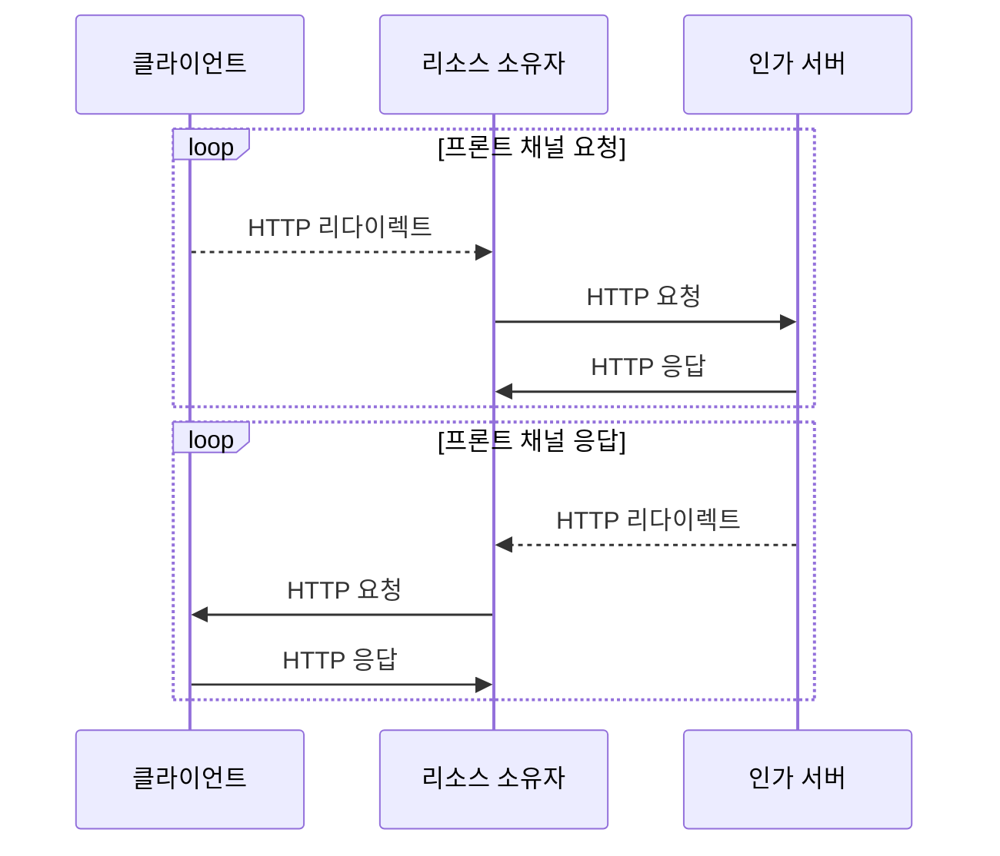

# 메모
1. 이 책에서의 OAuth는 액세스 토큰을 얻기 위한 몇 가지 방법을 자세히 설명하는 [OAuth 스펙](https://datatracker.ietf.org/doc/html/rfc6749)에 정의된 프로토콜을 OAuth라고 간주한다. 또한 Bearer 토큰의 사용 방법을 기술하고 있는 부가적인 스펙의 내용도 포함한다.
1. 액세스 토큰을 발급하는 방법 중에서 OAuth 2.0 인가 코드 그랜트 유형이 있다.
2. OAuth는 클라이언트가 사용자에게 사용자의 일부 권한을 위임해달라고 요청할 수 있는 수단을 제공하여 사용자는 클라이언트의 요청을 승인해 보호된 리소스에 접근할 수 있는 권한을 위임 과정을 시작하도록 한다.
3. OAuth를 정의한 RFC에 인가 프로토콜로 기술돼 있다.
4. OAuth는 기본적으로 사용자가 소프트웨어에 권한을 위임하는 것이지만, **사용자간의 권한 위임 메커니증은 정의하지 않는다.**
   - OAuth에서 리소스 소유자는 클라이언트를 통제하는 사람이라고 가정한다.
   - 리소스 소유자가 다른 사람을 인가할 수 있게 하려면 OAuth만으로는 힘들다. UMA 프로토콜은 OAuth를 이용해 사용자 간의 권한 위임이 가능한 시스템을 만든다.
5. OAuth는 권한 위임이 이뤄졌다는 사실을 전달하기 위한 방법을 제공하지만, **권한 인가 자체의 내용을 정의하지는 않는다.**
   - 대신, 토큰 같은 OAuth의 구성 요소를 이용해 허용 가능한 작업이 어떤 것인지 서비스 API로 정의한다.
   - 즉, **인가 접근 시스템을 위한 권한 위임 프로토콜이다.** 
6. OAuth는 토큰의 포맷을 정의하지 않는다.
7. **OAuth는 유연성을 최대한 유지하기 위해 실제 API 시스템의 많은 세부적인 내용까지 정의하지는 않는다.**
   - 특히, 클라이언트가 보호된 리소스와 어떻게 대화를 하는지 그리고 클라이언트가 보호된 리소스에 대한 인가 서버를 어떻게 찾는지, 사용자와 인가 서버에서 사용해야 하는 인증 기술에 대해 정의하지 않는다.
   - OpenID 커넥트와 UMA와 같이 OAuth 위에서 동작하는 몇몇 프로토콜은 그런 문제를 표준적인 방법으로 해결하며, 이에 대한 내용은 13장,14장에 등장한다.
8. **인증 과정에서 클라이언트를 분리시킴으로써 클라이언트가 사용자의 인증 방법을 변경하지 못하게 하며, 인가 서버에 적용되는 위험 기반의 휴리스틱 인증과 같은 새로운 인증 기술을 단순한 클라이언트 애플리케이션도 자연스럽에 이용할 수 있게 된다.**
9. 클라이언트는 자신이 호출할 API를 위해 어떤 권한이 필요한지를 파악해야 한다.

아래의 모든 설명에 적용되는 가정이 있다.

사용자(리소스 소유자)는 사진 인화 서비스(클라이언트)를 사용 중이며 사진 인화 서비스를 통해 사진 저장 서비스(인가 서버, 리소스 서버)에 저장한 사진을 인화하려고 하는 것이다.  

# 1장 OAuth 2.0이 무엇이고, 왜 관심을 가져야 할까?

## 자격 증명 공유 방법의 위험성은 무엇인가요?

과거에 사용되던 자격 증명 공유 방법으로는 **사용자의 자격 증명을 복사해 연결하고자 하는 다른 서비스에 전달하는 것이다.**  
이 전제는 클라이언트와 인가 서버가 한 사용자에 대한 자격 증명이 서로 동일하다고 가정하는 것이다.  
클라이언트는 사용자 행세를 하는데 필요한 아이디와 비밀번호 또는 도메인 세션 쿠키와 같은 자격 증명을 전달받아 **마치 사용자가 직접 로그인한 것과 동일하게 보호된 리소스에 접근한다.**  
즉, **클라이언트와 보호된 리소스간의 직접적인 연결이 이뤄진 것이다.**  
  
또 다른 방법은 클라이언트가 사용자에게 보호된 리소스에 접근하기 위한 아이디와 비밀번호를 직접 요청하여 해당 정보를 인가 서버에 직접 전달한다.  
그리고 인가 서버에 대한 접근 권한을 유지하기 위해 클라이언트는 기존에 사용한 자격 증명을 저장해 필요할 때 다시 사용할 수 있도록 저장하다.  
  
하지만 위의 두 방법은 자격 증명 탈취에 대한 보안성이 제한된다.  
클라이언트는 사용자로 가장하기 때문에 **보호된 리소스 입장에서는 자신에게 접근하는 것이 실제 리소스 소유자인지 리소스 소유자를 가장한 클라이언트인지 구분할 수 없다.**  
그리고 **클라이언트가 침해되면 사용자의 계정 또한 같이 침해될 수 있다.**  
  
따라서 **사용자의 자격 증명을 저장해 이용하는 것은 매우 한정된 상황에서만 사용돼야 한다.**  

## 자격 증명 공유를 안전하게 할 수 있는 방법은 무엇인가요?

**개발자 키** 를 클라이언트에 발급하고, 클라이언트는 그것을 이용해 보호된 리소스를 직접 요청하는 것이다.  
사용자의 자격 증명이 클라이언트에 노출되지 않는다는 것이 장점이지만, 키가 탈취되면 정상적인 클라이언트가 접근하는지와 상관없이 사용자의 모든 데이터가 유출된다는 단점이 있다.   
  
또 다른 방법으로는 **단지 서드파티 서비스에 공유할 목적으로만 사용되는 특별한 비밀번호를 사용자에게 발급하는 것이다.**  
사용자는 발급받은 비밀번호를 로그인하는 용도로 사용하지 않고 자신이 이용하기 위한 애플리케이션(클라이언트)에 전달한다.  
사용자의 자격 증명이 클라이언트에 노출되지 않고, 보호된 리소스는 클라이언트가 사용자 대신 항상 올바로 동작할 것이라는 암묵적인 신뢰를 할 필요가 없다는 장점이 있다.  
하지만 사용자는 기존의 비밀번호뿐만 아니라 특별한 자격 증명을 만들고 배포하고 관리해야 한다.  
그리고 사용자가 자격 증명을 직접 관리하고 할당하기 때문에 클라이언트와 해당 자격 증명 자체와는 연관성이 없어 특정 애플리케이션의 접근 권한을 철회하는 것이 어렵다.  
  
## 접근 권한 위임 방법은 무엇이며, 접근 권한을 허용하는 절차에 대해서 설명해 주세요.?

자격 증명 공유의 단점을 보완하는 **OAuth는 사용자가 보호된 리소스에 대한 자신의 접근 권한 일부를 클라이언트 애플리케이션에세 위임하기 위해 설계된 프로토콜이다.**  
OAuth 프로토콜은 **클라이언트가 토큰을 요청하고 사용자는 해당 클라이언트를 인가하는 상대적으로 간단한 방법으로 클라이언트에게 접근 권한을 부여한다.**  
  
보호된 리소스는 인가 서버를 신뢰하며, 인가 서버는 특정 목적의 보안 자격 증명(OAuth 액세스 토큰)을 클라이언트에게 발급한다.  
클라이언트는 액세스 토큰을 획득하기 위해 리소스 소유자가 인가 서버에 해당 클라이언트에 대한 권한을 위임하도록 요청한다.  
그러면 일반적으로 리소스 소유자는 요청한 클라이언트를 인가할 것인지 여부를 인가 서버를 통해 선택한다.  
클라이언트는 접근할 수 있는 리소스 범위와 수행할 수 있는 기능을 지정해 요청할 수 있으며, 리소스 소유자는 요청된 권한을 축소할 수도 있다.  
일단 접근이 인가되면 클라이언트는 인가 서버에 액세스 토큰을 요청할 수 있다.  
발급받은 액세스 토큰을 이용해 클라이언트는 보호된 리소스에 접근하기 위한 API를 호출할 수 있다.  
  
접근 권한 위임 방법을 자격 증명 공유 방법에 비교하면
1. 리소스 소유자의 자격 증명이 노출되지 않는다.
2. 클라이언트가 강력한 개발자 키를 보유하지 않기 때문에 독자적으로 보호된 리소스에 접근하지 못한다.
3. 리소스 소유자가 인가 서버에 인증하는 것과는 별개로 클라이언트아 인가 서버와 통신한다.
4. 보호된 리소스에 접근하려면 먼저 유효한 리소스 소유자로 부터 접근을 인가받아야 한다. (OAuth 클라이언트가 스스로 인가 서버에 인증을 받을 수 있는 수단을 갖고 있다고 하더라도 필요한 절차다.)
5. 일반적으로 사용자는 액세스 토큰을 직접 보거나 처리할 필요가 없다.

## OAuth 2.0이 TOFU(Trust On First Use)원칙을 따르는 이유는 무엇인가요?

TOFU 모델은 사용자에게 보안 결정을 내리도록 요구하는 유연성과 그런 결정을 지속적으로 내리도록 요구하는 피로도 간에 적절한 균형을 유지하기 위함이다.  
사용자가 인식하지 못하는 상황에 권한이 위임되거나 사용자에게 너무 많은 권한 요청을 물어보는 균형을 지키는 것이다.  
  
**OAuth에서는 중요한 보안 의사 결정권 일부를 소프트웨어를 사용하는 사용자에게 넘겨주기 때문에 TOFU 원칙을 따른다.**  
TOFU 모델에서는 처음에 보안 결정을 위한 어떤 전후 사정이나 설정이 존재하지 않기 때문에 보안적인 결정이 런타임에 사용자에게 요구된다.  
그리고 시스템이 이후를 위해 사용자의 결정을 기억한다.  
  
TOFU 모델에 그레이 리스트를 적용할 수 있다.  

## OAuth 2.0이 HTTP 프로토콜과 독립적으로 정의되지 않는 이유는 무엇인가요?

**OAuth 2.0 Bearer 토큰은 메시지 시그니처를 제공하지 않기 때문에 HTTPS를 이용해야 한다.**  
따라서 민감한 정보를 전달하려면 OAuth는 TLS와 같은 안전한 전송 계층 매커니즘이 필요하다.  
미래에는 TLS를 이용하지 않고도 OAuth를 이용하기 위한 노력이 이뤄질 것이다.  
  
**메시지 시그니처란?**  
- HTTP 메시지 시그니처는 HTTP 메시지의 무결성과 인증을 보장하는 방법 중 하나로, 메시지의 일부 또는 전체를 암호화한 서명을 헤더에 포함시키는 방식입니다. 이를 통해 메시지가 전송 중에 변경되지 않았음을 확인할 수 있으며, 해당 메시지가 신뢰할 수 있는 소스에서 왔음을 인증할 수 있습니다.
- HTTP 메시지 시그니처는 다음과 같은 과정으로 이루어집니다.
  1. 서명자는 HTTP 메시지의 특정 부분(예: 헤더, 바디 등)을 선택합니다.
  2. 이 선택된 부분을 바탕으로 해시를 생성합니다.
  3. 생성된 해시를 서명자의 비공개 키로 암호화하여 디지털 서명을 만듭니다.
  4. 이 디지털 서명을 HTTP 메시지의 'Signature' 헤더에 포함시킵니다.
- 메시지를 받는 측은 다음과 같은 과정으로 메시지의 무결성과 인증을 확인할 수 있습니다.
  1. 'Signature' 헤더에서 디지털 서명을 추출합니다.
  2. 서명자의 공개 키를 사용하여 디지털 서명을 복호화하여 해시를 얻습니다.
  3. 동일한 방법으로 HTTP 메시지에서 해시를 생성합니다.
  4. 두 해시가 일치하면 메시지의 무결성이 보장되며, 서명자가 신뢰할 수 있는 소스임이 인증됩니다.
- 물론, 이 기능을 사용하기 위해서는 서버와 클라이언트 모두에서 해당 기능을 지원하는 소프트웨어나 라이브러리가 필요합니다.
- 이는 표준 HTTP 프로토콜에 포함되어 있지 않은 추가적인 기능으로, 보안이 중요한 상황에서 사용됩니다.

# 2장 OAuth 2.0의 기본

## OAuth 트랜잭션의 두 가지 중요한 단계는 무엇인가요?

토큰을 발급하고 발급된 토큰을 사용하는 것이다.  
**토큰은 클라이언트에게 위임된 접근 권한을 의미하며, OAuth 2.0의 모든 부분에서 중요한 역할을 담당한다.**  

## Authorization Grant절차에 대해서 설명해 주세요.

- 9000포트 : 클라이언트
- 9001포트 : 인가 서버
- 9002포트 : 보호된 리소스

// 다이어그램으로 대체

- 클라이언트가 OAuth 액세스 토큰이 필요하다고 인지하면 리소스 소유자의 권한 일부를 자신에게 위임해달라고 요청하기 위해 리소스 소유자를 인가 서버의 인가 엔드 포인트로 리다이렉트 시킨다.
  - 302 코드와 Location 헤더를 통해 인가 서버의 인가 엔드 포인트를 응답으로 받아 웹 브라우저가 Location 헤더의 정보로 GET 요청을 보낸다.
  - 해당 Location 헤더에는 사용자가 인가 서버에게 클라이언트가 요청한 권한 위임을 수락하였을 때 인가 서버에서 클라이언트에게 인가 코드를 전달하기 위해 자신의 콜백 API 정보, scope 등을 쿼리 파라미터에 포함시킨다.
- 사용자는 인가 서버로 리다이렉트된 화면을 접하고 사용자가 권한 위임을 승인하면 인가 서버는 사용자를 다시 클라이언트로 (클라이언트가 첨부한 경로로)리다이렉트 시키며 Location 헤더에 인가 코드를 함께 전달한다.
- **클라이언트가 엑세스 토큰을 얻기 위한 인가 서버의 요청에는 헤더에 `Authorization: Basic {token}`이 담기며, 인가 서버의 엑세스 토큰 응답에는 토큰 타입이 `Bearer`이 담겨있다.**
  - 클라이언트가 액세스 토큰을 통해 보호된 리소스에 요청을 보낼 때에 `Authorization: Bearer {token}`으로 요청한다.

## OAuth의 구성 요소 중 액세스 토큰에 대해서 설명해 주세요.

간단히 토큰이라고도 하며, **클라이언트에게 권한이 위임됐다는 것을 나타내기 위해 인가 서버가 클라이언트에게 발급한다.**  
OAuth에서는 토큰의 포맷이나 내용을 정의하지 않으며 **클라이언트가 요청한 접근 권한, 리소스 소유자의 클라이언트 인가, 그리고 인가 과정에서 클라이언트에 부여된 권한을 포함한다.**  
인가 서버는 토큰을 만들어 발급하고 보호된 리소스는 토큰을 검증하기 때문에 토큰 자체를 이해할 수 있어야 한다.  

## OAuth의 구성 요소 중 Scope에 대해서 설명해 주세요.

보호된 리소스에 대한 접근 권한을 나타내며, 공백으로 구분된 범위 문자열의 조합으로 표현된다.  
하지만 범위값의 포맷과 구조가 OAuth 스펙에 정의된 것은 아니다.  
  
**클라이언트에게 부여되는 접근 권한을 제한하기 위한 중요한 메커니즘이다.**  
클라이언트는 추가 권한이 필요하다면 추가 범위를 인가해달라고 요청해야 한다.  

## 클라이언트가 리프레시 토큰을 사용해야 하는 이유는 무엇인가요?

OAuth 1.0에서는 토큰이 명시적으로 폐기될 때까지 영원히 사용하는 경향이 있었다.  
해당 토큰이 탈취되면 탈취한 공격자도 영원히 사용할 수 있다는 문제가 있었다.  
  
OAuth 2.0에서는 토큰의 유효기간이 자동으로 설정되기 때문에 유효 기간이 만료되었을 때 사용자가 없어도 리소스에 접근할 수 있는 방법이 필요하다.  
**클라이언트가 기존에 사용하던 엑세스 토큰이 만료되거나 거부된다면 이 리프레시 토큰을 이용해 (리소스 소유자와는 관련없이) 새로운 엑세스 토큰을 요청할 수 있다.**  
  
리프레시 토큰은 엑세스 토큰을 재발급하는 용도로만 사용되며, 클라이언트의 접근 권한을 축소시킬 수도 있다.  
  
## 인가 그랜트란 무엇인가요?

OAuth 프로토콜을 이용해 OAuth 클라이언트에게 보호된 리소스에 대한 접근 권한을 위임해주기 위한 방법이며, 그것이 성공적으로 이뤄지면 클라이언트는 최종적으로 액세스 코드를 얻게 된다.  
인가 그랜트는 OAuth 2.0에서 **사용자가 권한을 위임하는 특정 메커니즘을 나타낼 때** 뿐만 아니라 **권한 위임 행위 자체** 를 나타낼 때도 사용되기 때문에 혼동을 주는 용어 중에 하나이다.  
  
인가 코드는 사용자의 권한 위임 결정을 의미하기는 하지만, 그것 자체가 인가 그랜트는 아니다. **인가 그랜트는 OAuth 전체 프로세스를 의미한다.**  
즉, **클라이언트가 사용자를 인가 엔드 포인트로 이동시키고, 인가 코드를 전달받고 마지막으로 인가 코드를 토큰과 교환하는 과정 자체가 인가 그랜트인 것이다.**  

## OAuth의 구성 요소는 서로 간의 통신을 위해 직접적, 간접적인 HTTP 통신을 수행합니다. 두 통신에 차이점에 대해서 설명해 주세요.

<h3>백 채널 통신</h3>

OAuth 프로세스의 많은 부분에서 일반적인 HTTP 요청과 응답으로 구성 요소간의 통신이 이뤄진다.  
일반적으로 **리소스 소유자와 사용자 에이전트 범위 밖에서 이뤄지기 때문에 백 채널 통신이라고 한다.**  
브라우저를 제외한 구성 요소 간의 직접적인 HTTP 연결이라고 볼 수 있다.  
  
<h3>프론틑 채널 통신</h3>

OAuth에서는 클라이언트와 인가 서버가 직접 HTTP 요청을 보내고 응답을 받지 않는 경우가 있다.  
즉, 클라이언트가 인가 서버의 인가 엔드 포인트와 상호 작용하는 것이 바로 그런 경우이다.  
**중간의 웹 브라우저를 통해 두 시스템이 간접적으로 리다이렉트를 통해 HTTP 통신을 하는 것을 프론트 채널 통신이라고 한다.**  
  
이 기술은 **웹 브라우저의 양쪽 세션을 분리하며, 그로 인해 서로 다른 보안 도메인 간의 작업을 가능하게 해준다.**  
프런트 채널 통신은 **웹 브라우저가 방문해야 하는 URL을 파라미터로 전달함으로써 이뤄진다. 그런 URL을 전달받는 쪽에서는 해당 URL을 파싱하고 함께 전달된 파라미터와 동일한 방법으로 웹 브라우저를 해당 URL로 리다이렉트 한다.**  
  

이런식으로 **클라이언트와 인가 서버는 서로 직접 대화하지 않고 중개인을 통해 서로 메시지를 전달한다.**  
프런트 채널을 통해 전달되는 모든 정보는 웹 브라우저가 접근 가능하다.  
따라서 그 내용을 읽거나 질의가 전송되기 전에 질의 내용이 조작될 잠재적인 가능성이 존재한다.  
이 점 때문에 OAuth 프로토콜은 프런트 채널을 통해 전달되는 정보의 종류를 제한하고 프런트 채널에서 사용된 어떤 정보도 단독으로 권한 위임 작업을 위해 사용될 수 없도록 한다.  

# 3장 간단한 OAuth 클라이언트

OAuth 클라이언트와 인가 서버가 통신하기 위해서는 서로 식별할 수 있어야 한다.  
하지만 OAuth 프로토콜 자체에서는 그것이 `어떻게` 이뤄지는지는 상관하지 않으며, 단지 `어떤식으로든 이뤄지면 된다`.  
실제로 클라이언트 식별자 할당은 개발자 포털이나 동적 클라이언트 등록(12장) 또는 기타 다른 절차를 통해 이뤄진다.  
  
3장에서는 서로 다른 OAuth 구성원을 모두 완벽하게 분리시키기 때문에 가장 기본적이고 핵심적인 그랜트 타입인 **인가 코드 그랜트 타입** 을 위주로 설명한다.  

## 인가 요청에 리다이렉트 URI가 포함되어 있었다면 토큰을 요청할때도 그것과 동일한 URI를 함께 전달해야 하는 이유는 무엇인가요?

클라이언트가 인가 프로세스를 시작하기 위해서는 인가 서버로 리다이렉트할 URL에 적당할 질의 파라미터를 포함시켜 사용자를 서버의 인가 엔드 포인트로 리다이렉트해야 한다.  
리다이렉트할 목적지 URL에 인가 코드를 전달받을 클라이언트 스스로의 URL(`redirect_uri`)을 첨부한다.  
그 다음 인가 코드를 사용하여 토큰을 얻기 위해 토큰 엔드 포인트로 POST 요청을 보낼 때 이전에 요청한 `redirect_uri`를 첨부해야 한다.  
하지만 인가 서버가 토큰을 전달할 때는 이 `redirect_uri`를 사용하지 않는다.  
  
사용하지 않는데 보내야하는 이유는 OAuth 스펙에 따르면, **인가 요청에 리다이렉트 URI가 포함되어 있었다면 토큰을 요청할 때도 그것과 동일한 URI를 함께 전달해야 한다. 그렇게 함으로써 공격자가 리다이렉트 URI와 세션에 인가 코드를 삽입하는 것을 방지할 수 있다.**  
(서버단에서의 리다이렉트 URI 검증 구현에 대해서는 9장에서 등장한다.)  
클라이언트는 또한 자신이 전달하는 요청이 HTTP 폼 인코딩됐다는 것을 나타내기 위한 헤더와 클라이언트 인증을 위한 HTTP Basic 인증 헤더를 함께 전달해야 한다.  
Basic 인증을 위한 Authorization 헤더는 사용자 이름과 비밀번호를 콜론(:) 문자로 연결해 Base64로 인코딩한 문자열이다.  

## state 파라미터를 추가해야 하는 이유는 무엇인가요?

인가 코드 요청과 토큰 요청에서 사용된 클라이언트의 `redirect_uri`에 누군가 방문할 때 마다 입력 값을 가져와 그것을 다시 인가 서버에 전달하려고 할 것이다. (`redirect_uri`를 콜백 API라고 칭하겠다.)  
**이 콜백 API를 찾아내서 공격자가 클라이언트를 이용해 유효한 인가 코드를 얻기 위한 공격을 수행할 수 있고, 그로 인해 클라이언트와 서버의 자원이 낭비되고 잠재적으로는 클라이언트가 실제로 요청하지도 않은 토큰을 가져오게 만들수도 있다.**  
  
이를 위해 `state`라는 선택적인 OAuth 파라미터를 이용할 수 있다.  
중요한 점은 **`state` 값은 `redirect_uri`이 호출됐을 때 `state` 값을 확인할 수 있도록 클라이언트 애플리케이션에 저장해야 한다는 것이다.**  
인가 엔드 포인트로 전달되는 파라미터에 `state` 파라미터를 추가해야 한다.  
그리고 현재 단계에서는 프런트 채널을 이용하기 때문에 일단 인가 엔드 포인트로 리다이렉트된 이후에는 클라이언트는 사용자의 웹 브라우저에서 리다이렉트를 통한 요청이 들어올 때 까지 OAuth 프로토콜에 대한 제어권이 없다는 점을 명심해야 한다.  
  
인가 서버는 인가 엔드포인트에서 받은 `state`를 그대로 클라이언트에게 전달해야 한다.  
즉, 클라이언트는 콜백 API가 정상적인 경로로 호출됐는지 아니면 다른 악의적인 사용자가 호출했는지, 이 인가 요청이 실제로 클라이언트에 의해 시작됏는지 구분할 수 있기 때문에 이 `state` 값이 동일하지 않으면 에러를 반환할 것이다.  

## OAuth 클라이언트는 언제든지 액세스 토큰이 작동을 멈출 수 있다고 예상하고, 그에 따른 올바른 대응을 할 수 있어야 하는 이유는 무엇인가요?

사용자가 권한을 위임한 이후에 더 이상 사용자에게 재위임을 요청할 수 없을 때 리프레시 토큰을 통해 액세스 토큰을 다시 얻을 수 있도록 클라이언트는 대비해야 한다.  
리소스 소유자는 토큰이 만료되기 전에 토큰을 폐기할 수 있으며, 클라이언트는 토큰의 만료 시간에 대한 정보만으로 토큰의 상태를 알기가 어렵기 때문에 잘 설계된 OAuth 클라이언트는 언제든지 액세스 토큰이 작동을 멈출 수 있다고 예상하고 그에 따른 올바른 대응을 할 수 있어야 한다.  

# 4장 간단한 OAuth 리소스 서버

## 클라이언트가 리소스 서버에게 Bearer 토큰을 보내는 3가지 방법은 무엇인가요?

1. **HTTP Authorization 헤더를 이용하는 방법**
   -  Bearer 키워드 다음에는 바로 공백 문자와 토큰 값이 이어져야 한다.
   -  Authorization 헤더와 Bearer 키워드는 대소문자를 구분하지 않는다. **토큰 자체는 대소문자를 구분한다.**
2. **폼 인코딩된 요청 파라미터로 전달하는 방법**
3. **URI 인코딩된 질의 파라미터로 전달하는 방법**

2번은 컨텐트 타입이 폼 인코딩으로 제한되고 POST 전송만 사용할 수 있다는 단점이 있다.  
3번 질의 파라미터로 전달하는 방법은 서버의 로깅 또는 Referer 헤더로 인해 유출될 수 있다.  

## 리소스 서버와 인가 서버는 데이터베이스를 공유해야 하는가요?

OAuth 구현에서 데이터베이스를 공유해 사용하는 것은 일반적인 패턴이지만, 꼭 사용해야하는 것은 아니다.  
**토큰 인트로스펙션** 이라는 표준화된 웹 프로토콜이 있는데, 이를 사용하면 리소스 서버는 토큰의 상태를 런타임으로 체크할 수 있다.  
  
토큰을 구별하기위한 식별자는 토큰 자체를 해시하여 사용하거나 아니면 토큰 내부에 식별자를 넣어놓는 방법이 있을 수 있다.  

# 5장 간단한 OAuth 인가 서버

## OAuth2.0이 만들어 지면서 클라이언트나 보호된 리소스에 대한 복잡한 내용들이 최대한 인가서버로 포함된 이유는 무엇인가요?
## 인가서버가 2개의 엔드포인트를 가져야 하는 이유는 무엇인가요?
## client_id는 프론트채널로 전달되어서 공개될 수 있습니다. 그래서 아무나 흉내낼 수 있는데, 이를 방지할 수 있는 방법은 무엇일까요?
## 클라이언트의 인가 코드가 확인되면 저장 정보를 즉시 삭제해야 하는 이유는 무엇인가요?
## 인가 서버가 클라이언트를 인가하여 토큰을 발급하는 과정을 설명해 주세요.
## 리프레시 토큰을 사용하여 새로운 인증 토큰을 발급하는 과정을 설명해 주세요.
## 권한 범위를 통해서 권한을 제한하는 과정을 설명해 주세요.

# 6장 현실 세계의 OAuth 2.0

## 암시적 그랜트 타입은 언제 사용하나요?
## 암시적 그랜트 타입을 사용하기 전에 고려해야 하는 제한 사항은 무엇인가요?
## 암시적 그랜트 타입을 사용해 토큰을 얻는 과정에 대해서 설명해 주세요.
## 클라이언트 자격 증명 그랜트 타입은 언제 사용하나요?
## 클라이언트 자격 증명 그랜트 타입은 왜 리프레시 토큰이 필요 없나요?
## 클라이언트 자격 증명을 사용해 토큰을 얻는 과정에 대해서 설명해 주세요.
## 리소스 소유자 자격 증명은 언제 사용하나요?
## 리소스 소유자 자격 증명을 사용해 토큰을 얻는 과정에 대해서 설명해 주세요.
## 어설션 그랜트 타입 증명을 사용해 토큰을 얻는 과정에 대해서 설명해 주세요.
## 올바른 그랜트 타입을 선택하기 위해서 고려해야 하는 것들은 무엇인가요?

# 7장 일반적인 클라이언트 보안 취약점

## CSRF 공격을 피하기 위해 왜 state 파라미터를 사용해야 하나요?
## state 파라미터를 올바르게 사용하는 방법은 무엇인가요?
## 인가 서버에 rediect_uri를 등록할 때 최대한 구체적으로 작성해야 하는 이유는 무엇인가요?