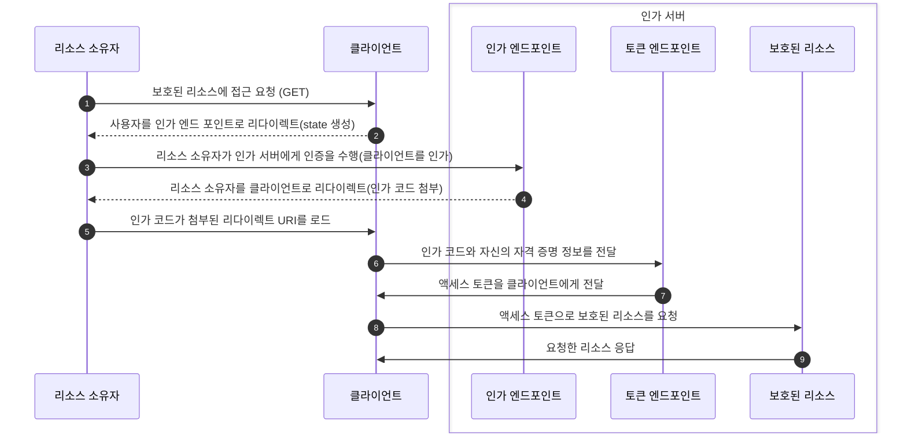

# 1장 OAuth 2.0이 무엇이고, 왜 관심을 가져야 할까?

## 자격 증명 공유 방법의 위험성은 무엇인가요?
## 자격 증명 공유를 안전하게 할 수 있는 방법은 무엇인가요?
## 접근 권한 위임 방법은 무엇인가요?
## 접근 권한 위임에서 접근 권한을 허용하는 절차에 대해서 설명해 주세요.
## OAuth 2.0이 TOFU(Trust On First Use)원칙을 따르는 이유는 무엇인가요?
## OAuth 2.0이 HTTP 프로토콜과 독립적으로 정의되지 않는 이유는 무엇인가요?

# 2장 OAuth 2.0의 기본

## OAuth 트랜잭션의 두 가지 중요한 단계는 무엇인가요?
## Authorization Grant절차에 대해서 설명해 주세요.
## OAuth는 4개의 구성원이 함께 동작합니다. 각 구성원에 대해서 설명해 주세요.
## OAuth의 구성 요소 중 액세스 토큰에 대해서 설명해 주세요.
## OAuth의 구성 요소 중 Scope에 대해서 설명해 주세요.
## 클라이언트가 리프레시 토큰을 사용해야 하는 이유는 무엇인가요?
## 인가 그랜트란 무엇인가요?
## OAuth의 구성 요소는 서로 간의 통신을 위해 직접적, 간접적인 HTTP 통신을 수행합니다. 두 통신에 차이점에 대해서 설명해 주세요.

# 3장 간단한 OAuth 클라이언트

## 인가 요청에 리다이렉트 URI가 포함되어 있었다면 토큰을 요청할때도 그것과 동일한 URI를 함께 전달해야 하는 이유는 무엇인가요?
## state 파라미터를 추가해야 하는 이유는 무엇인가요?
## OAuth 클라이언트는 언제든지 액세스 토큰이 작동을 멈출 수 있다고 예상하고, 그에 따른 올바른 대응을 할 수 있어야 하는 이유는 무엇인가요?

# 4장 간단한 OAuth 리소스 서버

## Bearer 토큰을 보내는 3가지 방법은 무엇인가요?
