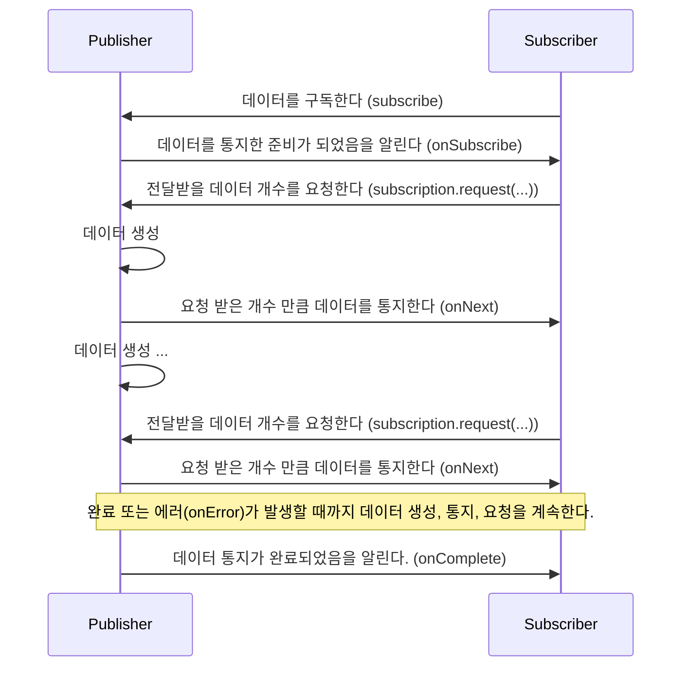

# 1주차 : 워커 스레드 패턴

1. 동시에 처리할 작업만큼 스레드를 생성하며, 이 한정된 스레드가 쌓여진 작업을 해소한다.
2. 리액티브 프로그래밍, Webflux, 코틀린 코루틴 등 이 워커 스레드 패턴의 확장이라고 볼 수 있다.
3. **쌓여진 작업**
   1. 작업 생성 - 일반적으로 함수 객체 (Runnable)
   2. 쌓아두기 - 동기화 큐에 넣기 (동기화에 대한 부하가 존재하긴 함)
   3. 작업 해소 - 무한 루프를 돌면서 큐에서 꺼내서 처리
   4. **스레드가 한 번 생성되면 끝까지 작업이 존재하지는지 확인하고 작업이 존재한다면 작업을 처리한다.**
4. **순서가 있는 작업을 동시성으로 처리하려면?**
   1. 동시성은 순서를 보장하지 않는다.
   2. 앞에 작업이 끝날 때 큐에 새로운 작업을 추가하면 가능하다.
   3. 긴 작업을 얼마나 짧은 작업으로 쪼갤 수 있는지가 전체 동시성의 핵심이다.
5. **리스트를 워커 쓰레드로 처리하기** (Flux.just) [gist](https://gist.github.com/hikaMaeng/7f30f8497478fd15a81118aac4d44650)
6. **워커 스레드 패턴 심화 #1**
   1. 하나의 연결된 작업은 순차적으로 실행된다.
      1. 동시성 관리가 필요없고 단일 스레드에서 순차적으로 실행된다.
      2. 멀티쓰레딩은 하나의 연결된 작업이 아닌 이런거 여러 개를 동시에한다.
   2. 개별 작업은 동기적으로 스레드를 블로킹한다.
      1. 따라서 최대한 작업을 짤게 분리해야 한다.
      2. 그 작업이 다시 다른 스레드를 쓰기도 한다. 이 경우 다른 스레드의 종료를 수신하여 현재 작업 스레드를 종료해야 한다. (sink = continuation resume)
   3. 컨텍스트 스위칭이 일어나지 않는다.
      1. 스레드가 한 번 실행하면 영원히 실행된다.
      2. 큐의 동기화는 순간적이며, 큐 넣고 빼는 동기 비용은 개별 작업 실행 비용에 비하면 무시할만하기 때문에 작업 실행데 동기화 비용이 없다고 볼 수 있다.
   4. 쪼개진 작업이 끝날 때마다 리스너에게 보고를 하는게 장점이다.
7. **워커 스레드 패턴의 장점을 제거하는 예**
   1. 레코드셋 전체를 모아서 보내기 - 레코드 하나씩 SSE로 쏘기
   2. 긴 트랜잭션 구간을 사용하기 - 결과적 일관성으로 옮기기
   3. 응답 JSON의 구조가 `{ data : [리스트...]}`와 비슷하다 - 리스트의 원소를 각각 `{}`로 묶어서 SSE 해야한다.
   4. 디비 질의가 큰 레코드셋을 반환하게 한다.
   5. 여러 파일의 업로드가 다 끝나면 처리한다. - 하나 올 때마다 처리해야 한다.

# 2주차 : Spring WebFlux

1. `Mono<X>` - 하나 X를 응답으로 보냄
2. `Flux<X>` - SSE로 여러 개의 X를 응답으로 보냄 (Server Side Event: 네트워크 사정에 따라 자동으로 이벤트를 보낸다.)
   1. `Flux.just`의 태스트 크기 만큼 네티의 바이트스트림에 작성하고 해당 스레드는 풀리고 다시 태스크가 시작된다.
3. `Mono<Void>` - 스프링이 자동으로 응답을 보내지 않는다.
   1. 1,2번은 스프링이 일반적인 경우에 대해 기본 처리를 해준다.
   2. 하지만 보다 정밀한 청크 처리나 SSE가 아닌 형식의 스트림을 쓰고 싶다면 직접 스트림을 통제해야 한다.
   3. **SSE를 왜 안쓸까?**
      1. 보통 브라우저에서 SSE를 구현하는 방법은 EventSource라는 객체를 사용하는 것이다
      2. 근데 이 브라우저 객체를 사용해 통신하면 요청에 헤더 값을 넣을 수 없다. (fetch를 복잡하게 커스터마이징 해야 한다.)
4. `Mono<Void>` 사용하기
   1. ServerHttpRequest의 body가 Flux로 들어오며, ServerHttpResponse의 writeAndFlushWith를 사용하면 응답을 Flux로 할 수 있다.
   2. 가장 낮은 레벨의 HTTP 통신은 전부 DataBuffer(byteArray) 수준으로 주고 받는다.
   3. HTTP 1.1은 심플렉스 : 모든 Request 공정이 끝나야 Response가 가능하다.
   4. HTTP 2.는 멀티플렉스 : Request 스트림과 Response 스트림이 동시에 가능하다.
5. **jdbc와 mysql은 리액티브 스트림즈를 제공하지 않는데 지금은 어떻게 처리하고 있는 걸까?**
   1. 실제로는 한 번에 인메모리로 올리고 스트림으로 반환할 뿐이다. 그렇기에 레코드셋을 작게 가져와야 한다.
6. 스프링은 어노테이션 프로세스를 코드 재생성에 대해서만 쓰지 않고 yml이나 properties 파일을 생성할 때도 사용한다.

***

1. Hot, Cold Sequence 이해 필수 
2. **WebFlux의 핵심 기능은 Flux의 flatMap, concat, merge 기능이다.**

# 리액티브 프로그래밍 코드 구성

1. **Publisher**
2. **Subscriber**
3. **Data Source** : 공급자의 입력으로 들어오는 데이터를 대표하는 용어이다. 원천 데이터를 뜻한다.
4. **Operator** : 공급자와 소비자의 사이에서 적절한 가공 처리를 담당한다. (필터링, 데이터 변환 등)

# 리액티브 스트림즈

리액티브 코드 구성을 용이하게 해주는 리액티브 라이브러리가 필요한데, 이 리액티브 라이브러리 구현 스펙, 표준 사양을 **리액티브 스트림즈** 라고 한다.
즉, 리액티브 스트림즈는 한마디로 **'데이터 스트림을 Non-Blocking이면서 비동기적인 방식으로 처리하기 위한 리액티브 라이브러리의 표준 사양'** 이라고 표현할 수 있다.
(구현체로 RxJava, Reactor, Akka Streams 등이 존재하며 그 중 Spring과 잘 맞는 Reactor에 대해 학습한다.)  
  
리액티브 스트림즈를 통해 구현해야 되는 API 컴포넌트는
1. **Publisher**
2. **Subscriber**
3. **Subscription** : 공급자에 요청할 데이터의 개수를 지정하고, 데이터의 구독을 취소하는 역할을 한다.
4. **Processor** : Publisher와 Subscriber 기능을 모두 가지고 있다.

(컴포넌트별 구현 규칙은 '2.5 리액티브 스트림즈의 구현 규칙', 52p를 참고하자)

> Publisher와 Subscriber는 각각 다른 스레드에서 비동기적으로 상호작용하는 경우가 대부분이다.  
> Publisher가 통지하는 속도가 Subscriber가 처리하는 속도보다 더 빨라 데이터가 쌓여 시스템 부하가 커지는 사태를 막기위해 `subscription.request(...)`를 통해 데이터 개수를 제어하는 것이다.

## 관련 용어

1. **Signal** : Publisher와 Subscriber 간에 주고받는 상호작용, 인터페이스에서 제공하는 메서드들을 Signal이라고 한다.
   1. 예를 들어, Subscriber 인터페이스가 제공하는 onSubscribe, onNext, onComplete, onError 메서드들을 Publisher가 Subscirber에게 보내는 Signal이라고 볼 수 있다.
2. **Demand** : Subscriber가 Publisher에게 요청하는 데이터를 의미한다. (Subscriber가 아직 전달받지 않은 데이터들)
3. **Emit** : 데이터를 통지, 방출한다는 뜻이다. Publisher가 emit하는 Signal 중에서 데이터를 전달하기 위한 onNext Signal을 줄여서 '데이터를 emit한다'라고 표현한다.
4. **Upstream/Downstream** : 데이터가 위로 흐르다/아래로 흐르다의 의미이다. **현재 호출한 메서드에서 반환된 Flux의 위치에서 자신보다 더 상위에 있는 Flux는 Upstream, 하위에 있는 Flux는 Downstream이 된다.**
5. **Sequence** : Publisher가 emit하는 데이터의 연속적인 흐름을 정의해 놓은 것 자체를 의미한다. Flux를 통해서 데이터를 생성,emit하고 filtering 한 후, map 메서드를 통해 변환하는 이러한 과정 자체를 바로 Sequence라고 부른다. **데이터의 연속적인 흐름을 정의한 것이라고 생각하자.**
6. **Operator** : just, filter, map 같은 메서드들을 연산자라고 부른다.
7. **Source** : Data Source, Source Publihser, Source Flux 등을 꼽을 수 있으며 대부분 '최초의'라는 의미로 사용된다.

# **Blocking I/O**

파일 I/O, DB I/O, 네트워크 I/O 와 같은 I/O가 발생하였을 때 처리를 담당하는 스레드가 I/O에 의해서 차단되어 대기하는 것을 Blocking I/O 라고한다.  
이 문제를 보완하기 위해 멀티스레딩 기법으로 추가 스레드를 할당하여 차단된 그 시간을 효율적으로 사용할 수는 있다.  
하지만 CPU 대비 많은 수의 스레드를 할당하는 멀티 스레딩 기법은 몇 가지 문제점이 존재한다.  

1. **컨텍스트 스위칭으로 인한 스레드 전환 비용 발생한다.** : PCB에 프로세스 상태를 저장하고 리로딩하는 시간 동안에는 CPU가 다른 작업을 하지 못하고 대기하게 된다.
   1. 현재 실행되고 있는 프로세스 정보는 CPU의 레지스터에 저장되는데 프로세스들이 번갈아 가며 실행되는 과정에서 PCB에 저장된 프로세스 정보가 레지스터에 지속적으로 저장되어 그 값이 변경되는 것을 `컨텍스트 스위칭`이라고 한다. (Thread는 TCB)
2. **과다한 메모리 사용으로 오버헤드가 발생할 수 있다.** : 스레드 전용 메모리인 스택과 프레임에 대한 메모리 비용
3. **스레드 풀에서 응답 지연이 발생할 수 있다.** : 유휴 스레드가 없을 경우 사용 가능한 스레드가 확보되기까지 응답 지연 발생

# **Non-Blocking I/O**

Blocking I/O와 다르게 I/O를 처리하는 작업 종료 여부와 관계없이 스레드는 차단되지 않는다.  
그렇기에 **하나의 스레드로 많은 수의 요청을 처리할 수 있다.**  
  
즉, Blocking I/O 방식 보다 더 적은 수의 스레드를 사용하기 때문에 Blocking I/O에서 멀티스레딩 기법을 사용할 때 발생한 문제점들이 생기지 않는다.  
따라서 CPU 대기 시간 및 사용량에 있어서도 효율적이다.  
  
하지만 단점도 존재한다.
1. **스레드 내부에 CPU를 많이 사용하는 작업이 포함된 경우에는 성능에 악영향을 준다.**
2. **사용자의 요청에서 응답까지의 전체 과정에 Blocking I/O 요소가 포함된 경우에는 Non-Blocking의 이점을 발휘하기 힘들다.**

> **완전한 Non-Blocking I/O**  
> 만약 DB 조회 1회, 외부 서비스 2회 네트워크 통신이 존재할 때 이 3회의 I/O가 모두 Non-Blocking I/O여야지만 제대로된 Non-Blocking의 이점을 발휘할 수 있다.  
> 어느 하나라도 Blocking I/O 요소가 존재한다면 스레드가 차단되면서 병목 구간이 발생할 수 밖에 없다.  

# Spring WebFlux 개요

> Spring WebFlux는 클라이언트의 요청부터 응답까지 Reactor의 두 가지 타입인 Mono나 Flux의 Operator 체인으로 구성된 하나의 길다란 Sequence라고 생각하면 쉽게 접근할 수 있다.

