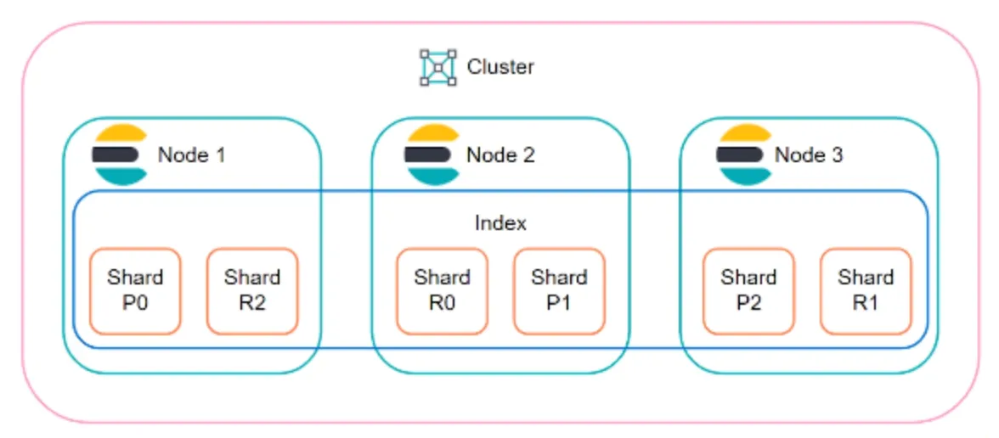
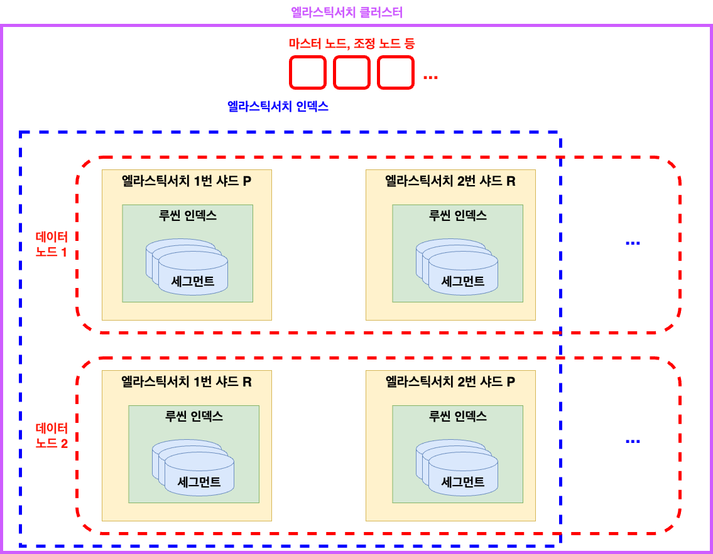

엘라스틱 서치는 아파치의 루씬 라이브러리를 기반으로 만든 **분산 검색 엔진** 이다  
특징으로는  
1. 분산 처리를 고려하여 설계됐기 때문에 데이터를 여러 노드에 분산 저장하며 검색이나 집계 작업 등을 수행할 때도 분산 처리를 지원한다.  
2. 클러스터를 구성하고 있는 일부 노드에 장애가 발생해도 복제본 데이터를 이용해 중단 없이 서비스를 지속할 수 있다.  
3. 요청 수나 데이터의 양이 증가함을 대비하여 수평적 확장을 지원한다. 새로운 노드에 ES를 설치하여 클러스터에 참여시키기만 하면 된다. 새 노드에 데이터를 복제하거나 옮기는 작업도 다종 수행한다.
4. **준실시간 검색** 을 지원한다. 데이터를 색인하자마자 조회하는 것은 가능하지만, 색인 직후의 검색 요청은 성공하지 못할 가능성이 높다.
   1. ES가 역색인을 구성하고 이 역색인으로부터 검색이 가능해지기까지 시간이 걸리기 때문이다. 기본 설정으로 최대 1초 정도 시간이 걸린다.
5. **트랜잭션을 지원하지 않는다.**
6. **사실상 조인을 지원하지 않는다.**
   1. 조인을 염두에 두고 설계되지 않았다
   2. `join`이라는 특별한 데이터 타입이 있지만 굉장히 제한적인 상황을 위한 기능이며 성능도 떨어진다.
   3. **RDBMS와는 다르게 데이터를 비정규화해야 한다** ⭐️


> 루씬은 데이터를 색인하고 검색하는 기능을 제공하는 검색 엔진의 코어 라이브러리이다.

1. 엘라스틱서치의 데이터를 손쉽게 시각화하는 **키바나**
2. 엘라스틱서치에 색인할 데이터를 수집하고 변환하는 **로그 스태시**
3. 경량 데이터 수집 플랫폼 **비츠**

ELK 스택을 이용하여 데이터의 수집부터 변환, 저장, 색인, 검색, 시각화까지 데이터 생명 주기 전체를 모두 엘라스틱의 솔루션으로 해결할 수 있어 큰 주목을 받았다.  

## 엘라스틱서치 구조


[출처](https://nidhig631.medium.com/primary-shards-replica-shards-in-elasticsearch-269343324f86)

- **문서** : ES가 저장하고 색인을 생성하는 JSON 문서를 뜻한다
- **인덱스** : **문서를 모아놓은 단위** 가 인덱스다. 클라이언트는 이 인덱스 단위로 ES에 검색을 요청하게 된다.
- **샤드** : 인덱스는 그 내용을 여러 샤드로 분리하여 분산 저장한다.
  - 또한 **고가용성을 제공하기 위해 샤드의 내용을 복제해둔다.**
  - 원본 역할을 담당하는 샤드를 primary shard, 복제본을 replication shard라고 한다.
- **_id** : 인덱스 내 문서에 부여되는 고유한 구분자다.
  - 인덱스의 이름과 _id의 조합은 ES 클러스터 내에서 고유하다.
- **타입** : 과거에 하나의 인덱스 안에 여러 문서를 묶어서 타입이라는 논리 단위로 나눴었지만, 이 개념은 폐기됐으며 논리적으로 구분해야 할 필요가 있다면 **별도의 인덱스로 독립** 시켜야 한다.
  - ES6 버전부터는 인덱스 하나에 타입 하나만 둘 수 있도록 제한됐다.
  - ES7 버전부터는 여러 API에서 타입을 명시하는 부분들이 지원 중단 됐다.
  - 타입 이름이 들어가야 할 자리에는 기본값인 `_doc`이 들어간 API를 사용해야 한다.
- **노드** : **ES 프로세스 하나가 노드 하나를 구성한다.**
  - ES 노드 하나는 여러 개의 샤드를 가진다.
  - 고가용성을 제공하기 위해 같은 종류의 샤드를 같은 노드에 배치하지 않는다.
  - 위의 그림을 보면 주 샤드와 복제 샤드 번호가 다른것을 확인할 수 있다.
- **클러스터** : 위의 ES 노드가 여러 개가 모여 하나의 클러스터를 구성한다.

> **노드의 역할**  
> - ES의 노드는 **데이터 노드** , **마스터 노드** , **조정 노드** 등 여러 역할 중 하나 이상의 역할을 맡아 수행한다.  
> - **데이터 노드** : 샤드를 보유하고 샤드에 실제 읽기와 쓰기 작업을 수행하는 노드
> - **마스터 노드** : 클러스터를 관리하는 중요한 역할을 수행하는 노드, 마스터 후보 노드 중에서 1대가 선출된다.
> - **조정 노드** : 클라이언트의 요청을 받아서 데이터 노트에 요청을 분배하고 클라이언트에게 응답을 돌려주는 노드

## 루씬 flush

문서 색인 요청이 들어오면 루씬은 문서를 분석해서 **역색인** 을 생성한다.  
최초 생성 자체는 메모리 버퍼에 들어간다. 문서 색인, 업데이트, 삭제 등의 작업이 수행되면 루씬은 이러한 변경들을 메모리에 들고 있다가 주기적으로 디스크에 flush 한다.  
  
**루씬은 색인한 정보를 파일로 저장** 하기 때문에 루씬에서 검색을 하려면 먼저 파일을 열어야 한다.  
파일을 연 시점에 색인이 완료된 문서만 검색할 수 있다.  
이후 색인에 변경사항이 발생했고, 그 내용을 검색 결과에 반영하고 싶다면 파일을 새로 열어야 한다.  

- [InternalEngine#createReaderManager](https://github.com/elastic/elasticsearch/blob/7e24080fb26a88d7b1a0b897ef425317251747d5/server/src/main/java/org/elasticsearch/index/engine/InternalEngine.java#L760)  
- [ElasticsearchReaderManager#refreshIfNeeded](https://github.com/elastic/elasticsearch/blob/7e24080fb26a88d7b1a0b897ef425317251747d5/server/src/main/java/org/elasticsearch/index/engine/ElasticsearchReaderManager.java#L47)  
- [DirectoryReader](https://lucene.apache.org/core/6_6_0/core/org/apache/lucene/index/DirectoryReader.html)  
  
```java
@Override
protected ElasticsearchDirectoryReader refreshIfNeeded(ElasticsearchDirectoryReader referenceToRefresh) throws IOException {
    return (ElasticsearchDirectoryReader) DirectoryReader.openIfChanged(referenceToRefresh);
}
```

1. ES는 내부적으로 루씬의 `DirectoryReader`라는 클래스를 이용해 파일을 연다
2. 루씬의 색인에 접근할 수 있는 `IndexReader` 객체를 얻는다.
3. ES는 변경 내용을 검색에 반영하기 위해 루씬의 `DirectoryReader#openIfChanged`를 호출해 변경 사항이 적용된 새 `IndexReader`를 열어 준 뒤 기존 IndexReader를 안전하게 닫는다.

위의 과정을 ES에서는 **refresh** 라고 하며, 이 단계까지 온 데이터가 검색 대상이 된다.  
이 작업은 비용이 있는 작업이기 때문에 적절한 간격마다 주기적으로 실행되며 또는 refersh API를 호출할 수 있다.  

## 루씬 commit

> 리눅스는 파일 I/O의 성능 향상을 위해 페이지 캐시라는 메모리 영역을 만들어서 사용한다.  
> 디스크로의 접근을 최소화하기 위해 한 번 읽은 파일의 내용을 페이지 캐시라는 영역에 저장시켜 놨다가 다시 한 번 동일한 파일 접근이 일어나면 디스크에서 읽지 않고 페이지 캐시에서 읽어서 제공해주는 방식이다.  
> [출처](https://brunch.co.kr/@alden/25)

루씬의 flush는 시스템의 페이지 캐시에 데이터를 넘겨주는 것까지만 보장할 뿐 디스크에 파일이 실제로 안전하게 기록되는 것까지 보장하지는 않는다.  
`fsync` 시스템 콜을 통해 주기적으로 커널 시스템의 페이지 캐시의 내용과 실제로 디스크에 기록된 내용의 싱크를 맞추는 작업을 수행하며 이를 루씬 commit이라고 한다.  
  
> 루씬의 flush와 엘라스틱 서치의 flush는 서로 다른 개념이며, 엘라스틱 서치의 flush 작업은 내부적으로 이 루씬 commit을 거친다.  

ES에 색인된 문서들은 루씬 commit까지 완료되어야 디스크에 안전하게 기록된다.  
commit은 비용이 많이 드는 작업이기 때문에 매번 할 수 없다. 그렇다고 변경사항을 모아서 commit한다면 장애 발생 시 데이터가 유실될 우려가 있다.  
**이런 문제를 해결하기 위해 엘라스틱서치 샤드는 모든 작업마다 translog라는 이름의 작업 로그를 남긴다.**  

## translog

색인 또는 삭제 작업이 루씬 인덱스 수행된 직후에 기록되며 translog에 기록이 끝난 이후에야 작업 요청이 성공으로 승인된다.  
ES 장애가 발생한 경우 샤드 복구 단계에서 translog를 읽으며, translog 기록은 성공했지만 루씬 commit에 포함되지 못했던 작업 내용이 있다면 샤드 복구 단계에서 복구된다.  
  
translog의 크기를 적절히 유지해줘야 하는데 **엘라스틱서치 flush는 루씬 commit을 수행하고 새로운 translog를 만드는 작업이다.**  
이 엘라스틱서치 flush가 주기적으로 수행되며 translog의 크기를 적절한 수준으로 유지한다.  
translog에는 디스크에 `fsync`된 데이터만 보존된다.  
  
클라이언트가 색인, 삭제, 업데이트 등의 요청을 보냈을 때 엘라스틱 서치는 translog에 성공적으로 `fsync`됐을 때에만 성공을 보고한다.  

## 세그먼트



위의 작업을 거쳐 디스크에 기록된 파일들이 모이면 **세그먼트** 라는 단위가 된다.  
이 **세그먼트가 루씬 검색의 대상** 이 되며, **루씬의 검색은 모든 세그먼트를 대상으로 수행된다.**  
세그먼트 자체는 불변으로 구성돼 있으며, 새로운 문서가 들어오면 새 세그먼트가 생성된다. 기존 문서를 삭제하는 경우 삭제 플래그만 표시해둔다.  
중간 중간 **병합 단계** 를 수행하여 삭제 플래그가 표시된 데이터를 실제로 삭제한다.  
병합 자체는 비싼 작업이지만 **검색 성능의 향상을 기대할 수 있다.**  
  
여러 세그먼트가 모이면 **하나의 루씬 인덱스가 된다.**  
**엘라스틱 서치 샤드는 이 루씬 인덱스 하나를 래핑한 단위다.** 그리고 **엘라스틱서치 샤드 여러 개가 모이면 엘라스틱서치 인덱스가 된다.**  
- `[ES 인덱스 1] : [N ES 샤드 1] : [1 루씬 인덱스]`
  
엘라스틱서치 레벨에서는 여러 샤드에 있는 문서를 모두 검색할 수 있다.  
**새 문서가 들어오면 해당 내용응 라우팅하여 여러 샤드에 분산시켜 저장, 색인한다.**  
이후 클라이언트가 엘라스틱서치에 검색 요청을 보내면 **엘라스틱서치는 해당하는 갹 사드를 대상으로 검색한 뒤 그 결과를 모아 병합하여 최종 응답을 만든다.**  
  
중요한 점은 **루씬 검색 대상으로는 루씬 인덱스 이며, 엘라스틱서치 검색 대상으로는 엘라스틱 서치 인덱스이다.**  

***

```
wget https://artifacts.elastic.co/downloads/elasticsearch/elasticsearch-8.4.2-darwin-x86_64.tar.gz
wget https://artifacts.elastic.co/downloads/kibana/kibana-8.4.2-darwin-x86_64.tar.gz
wget https://github.com/lmenezes/cerebro/releases/download/v0.9.4/cerebro-0.9.4.zip

bin/elasticsearch -d -p {pid}
kill -SIGTERM `cat {pid file}`

bin/kibana
bin/cerebro
```