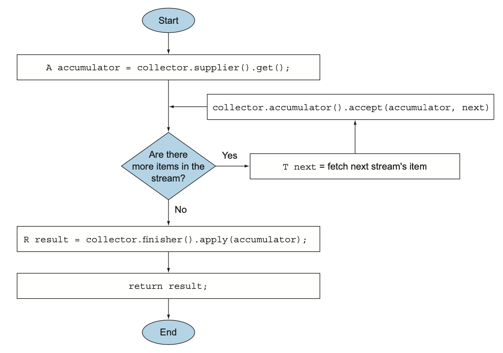
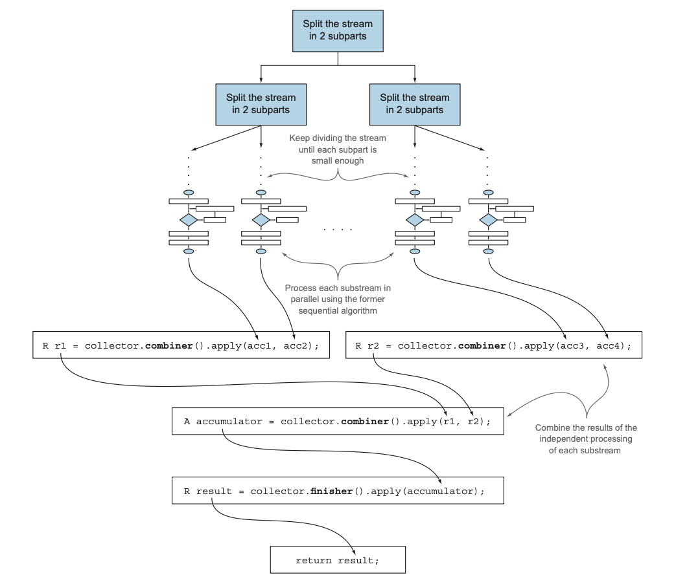

`Collector` 인터페이스는 **리듀싱 연산(즉, 컬렉터)을 어떻게 구현할지 제공하는 메서드 집합**으로 구성된다.  

```java
public interface Collector<T, A, R> {

    Supplier<A> supplier();                 // 새로운 결과 컨테이너 생성
    BiConsumer<A, T> accumulator();         // 새 데이터 요소를 결과 컨테이너에 통합
    BinaryOperator<A> combiner();           // 두 개의 결과 컨테이너를 하나로 통합
    Function<A, R> finisher();              // 컨테이너에서 선택적 최종 변환 수행
    Set<Characteristics> characteristics(); // Collector의 속성을 나타내는 특성

    ...
}
```

1. `T`는 수집될 스트림 항목의 제네릭 형식이다.
2. `A`는 누적자, 즉 수집 과정에서 중간 결과를 누적하는 객체의 형식이다.
3. `R`은 수집 연산 결과 객체의 형식 (대개 컬렉션 형식)이다.
  
# `Stream<T>`의 모든 요소를 `List<T>`로 수집하는 Collector 구현하기  

```java
public class ToListCollector<T> implements Collector<T, List<T>, List<T>>
```
  
## supplier : 새로운 결과 컨테이너 만들기

`supplier`는 수집 과정에서 빈 누적자 인스터스를 만드는 파라미터가 없는 함수다.  

```java
@FunctionalInterface
public interface Supplier<T> {
    T get();
}
```

`ToListCollector`에서 `supplier`는 아래와 같이 빈 리스트를 반환한다.

```java
@Override
public Supplier<List<T>> supplier() {
    return ArrayList::new;
}
```

## accumulator : 결과 컨테이너에 요소 추가하기

`accumulator`는 **리듀싱 연산** 을 수행하는 함수를 반환한다.  
스트림에서 n번째 요소를 탐색할 때 두 인수, 즉 누적자와 n번째 요소를 함수에 적용한다.  
**요소를 탐색하면서 적용하는 함수에 의해 누적자 내부 상태가 바뀌므로 누적자가 어떤 값일지 단정할 수 없다.**  
  
`ToListCollector`에서 `accumulator`가 반환하는 함수는 이미 탐색한 항목을 포함하는 리스트에 현재 항목을 추가하는 연산을 수행한다.  

```java
@Override
public BiConsumer<List<T>, T> accumulator() {
    return List::add;
}
```

## finisher : 최종 변환값을 결과 컨테이너로 적용하기

`finisher`는 스트림 탐색을 끝내고 누적자 객체를 최종 결과로 변환하면서 누적 과정을 끝낼 때 호출할 함수를 반환해야 한다.  
`ToListCollector`는 누적자 객체가 이미 최종 결과라서 변환 과정이 필요하지 않아 항등 함수를 반환한다.  

```java
@Override
public Function<List<T>, List<T>> finisher() {
    return Function.identity();
}
```

지금까지 살펴본 세 가지 메서드로도 순차적 스트림 리듀싱 기능을 수행할 수 있다.  
**실제로는 `collect`가 동작하기 전에 다른 중간 연산과 파이프라인을 구성할 수 있게 해주는 게으른 특성 그리고 병렬 실행 등도 고려해야 하므로 스트림 리듀싱 기능 구현은 생각보다 복잡하다.**  
  


## combiner : 두 결과 컨테이너 병합

마지막으로 리듀싱 연산에서 사용할 함수를 반환하는 역할을 한다.  
**`combiner`는 스트림의 서로 다른 서브파트를 병렬로 처리할 때 누적자가 이 결과를 어떻게 처리할지 정의한다.**  
`toList`의 `combiner`는 스트림의 두 번째 서브파트에서 수집한 항목 리스트를 첫 번째 서브파트 결과 리스트의 뒤에 추가하면 된다.  

```java
@Override
public BinaryOperator<List<T>> combiner() {
    return (list1, list2) -> {
        list1.addAll(list2);
        return list1;
    };
}
```



이 메서드를 이용하면 **스트림의 리듀싱을 병렬로 수행할 수 있다.**  
스트림의 리듀싱을 병렬로 수행할 때 **포크/조인 프레임워크** 와 **Spliterator** 를 사용한다.  

1. 스트림을 분할해야 하는지 정의하는 조건이 거짓으로 바뀌기 전까지 원래 스트림을 재귀적으로 분할한다.
   - 보통 분산된 작업의 크기가 너무 작아지면 병렬 수행의 속도는 순차 수행의 속도보다 느려진다.
   - 즉, **병렬 수행의 효과가 상쇄된다.**
   - 일반적으로 프로세싱 코어의 개수를 초과하는 병렬 작업은 효율적이지 않다.
2. 위의 이미자와 같이 모든 서브스트림의 각 요소에 리듀싱 연산을 순차적으로 적용해서 서브스트림을 병렬로 처리할 수 있다.
3. 마지막에는 컬렉터의 `combiner` 메서드가 반환하는 함수로 모든 부분결과를 쌍으로 결과를 합치며 연산이 완료된다.

## Characteristics

컬렉터의 연산을 정의하는 `Characteristics` 형식의 불변 집합을 반환한다.  
스트림을 병렬로 리듀스할 것인지 그리고 병렬로 리듀스한다면 어떤 최적화를 선택해야 할지 힌트를 제공한다.  

1. **UNORDERED** : 리듀싱 결과는 스트림 요소의 방문 순서나 누적 순서에 영향을 받지 않는다.
2. **CONCURRENT** : 다중 스레드에서 `accumulator` 함수를 동시에 호출할 수 있으며 이 컬렉터는 스트림의 병렬 리듀싱을 수행할 수 있다.
   - 컬렉터의 플래그에 UNORDERED를 함께 설정하지 않았다면 데이터 소스가 정렬되어 있지 않은 (집합처럼 요소의 순서가 무의미한) 상황에서만 병렬 리듀싱을 수행할 수 있다.
3. **IDENTITY_FINISH** : `finisher` 메서드가 반환하는 함수는 단순히 identity를 적용할 뿐이므로 이를 생략할 수 있다. 따라서 리듀싱 과정의 최종 결과로 누적자 객체를 바로 사용할 수 있다.
  
`ToListCollector`에서 스트림의 요소를 누적하는데 사용한 리스트가 최종 결과 형식이므로 추가 변환이 필요 없고, **IDENTITY_FINISH** 에 해당한다.  
그리고 리스트의 순서는 상관이 없으므로 **UNORDERED** 이고, **CONCURRENT** 다.  

# 소수를 구분하는 Collector 만들어보기

```java
public class PrimeNumbersCollector
        implements Collector<Integer, Map<Boolean, List<Integer>>, Map<Boolean, List<Integer>>> {

    public static boolean isPrime(List<Integer> primes, int candidate) {
        int candidateRoot = (int) Math.sqrt(candidate);
        return primes.stream()
                .takeWhile(e -> {
                    System.out.printf("e : %d, candidate : %d%n", e, candidate);
                    return e <= candidateRoot;
                })
                .noneMatch(e -> candidate % e == 0);
    }

    @Override
    public Supplier<Map<Boolean, List<Integer>>> supplier() {
        return () -> new HashMap<>() {{
            this.put(true, new ArrayList<>());
            this.put(false, new ArrayList<>());
        }};
    }

    @Override
    public BiConsumer<Map<Boolean, List<Integer>>, Integer> accumulator() {
        return (Map<Boolean, List<Integer>> acc, Integer candidate) ->
                acc.get(isPrime(acc.get(true), candidate))
                    .add(candidate);
    }

    @Override
    public BinaryOperator<Map<Boolean, List<Integer>>> combiner() {
        // 알고리즘 자체가 순차적이어서 컬렉터를 실제 병렬로 사용할 순 없다.
        // 구현을 하지 않거나 런타임 예외를 던지도록 작성해도 무방하다.
        return (Map<Boolean, List<Integer>> map1, Map<Boolean, List<Integer>> map2) -> {
            map1.get(true).addAll(map2.get(true));
            map1.get(false).addAll(map2.get(false));
            return map1;
        };
    }

    @Override
    public Function<Map<Boolean, List<Integer>>, Map<Boolean, List<Integer>>> finisher() {
        return Function.identity();
    }

    @Override
    public Set<Characteristics> characteristics() {
        return Collections.unmodifiableSet(EnumSet.of(Characteristics.IDENTITY_FINISH));
    }
}

...

@Test
void primeNumber() {
    final int number = 13;
    Map<Boolean, List<Integer>> collect = IntStream.rangeClosed(2, number)
            .boxed()
            .collect(new PrimeNumbersCollector());

    assertThat(collect.get(true)).isEqualTo(new ArrayList<>(){{
        this.add(2);
        this.add(3);
        this.add(5);
        this.add(7);
        this.add(11);
        this.add(13);
    }});
}
```