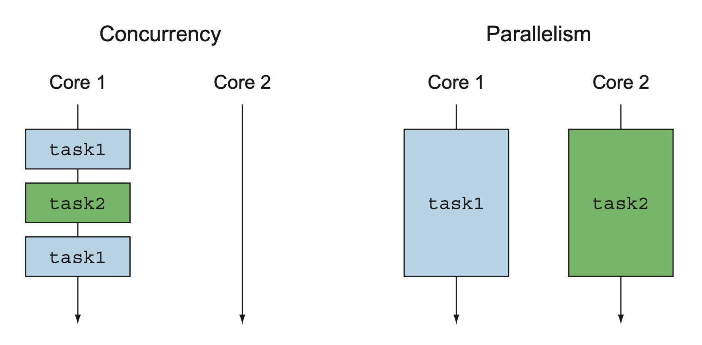
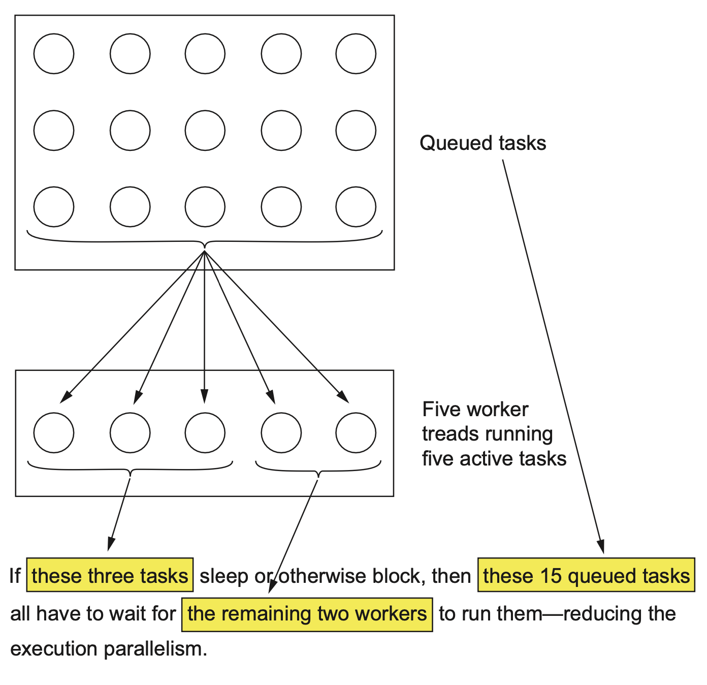
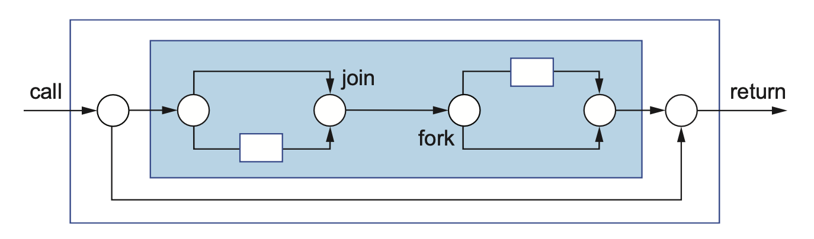
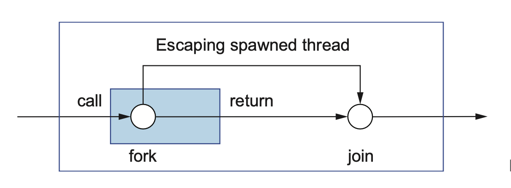
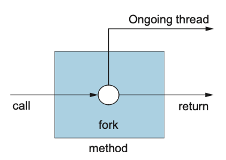
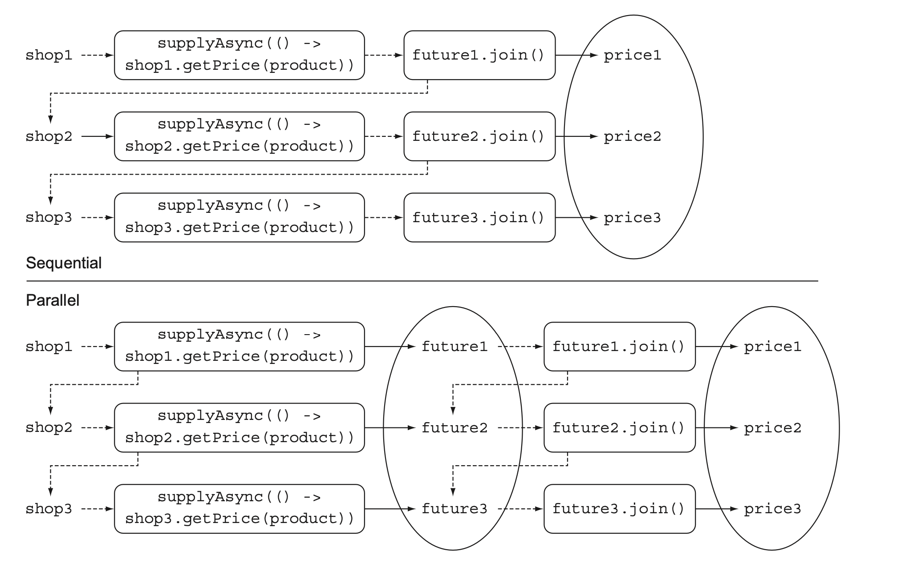
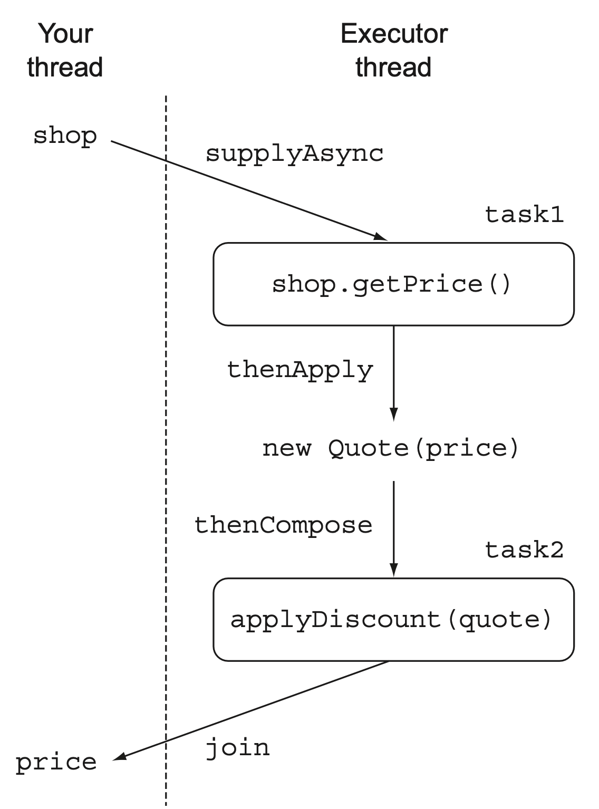

**포크/조인 프레임워크** 와 **병렬 스트림** 은 병렬성의 귀중한 도구다. 이들은 한 태스크를 여러 하위 태스크로 나누어 CPU의 다른 코어 또는 다른 머신에서 이들 하위 태스크를 병렬로 실행한다.  
반면 병렬성이 아니라 동시성을 필요로 하는 상황, 즉 조금씩 연관된 작업을 같은 CPU에서 동작하는 것 또는 애플리케이션을 생산성을 극대화할 수 있도록 코어를 바쁘게 유지하는 것이 목표라면, 원격 서비스나 데이터베이스 결과를 기다리는 스레드를 블록함으로 연산 자원을 낭비하는 일은 피해야 한다.  
  


**CompletableFuture와 java.util.concurrent.Flow의 궁극적인 목표는 가능한한 동시에 실행할 수 있는 독립적인 태스크를 가능하게 만들면서 멀티코어 또는 여러 기기를 통해 제공되는 병렬성을 쉽게 이용하는 것이다.**  

```java
sum = Arrays.stream(numbers).parallel().sum();
```

위와 같이 자바 스트림을 통해 병렬 스트림을 쉽게 활용할 수 있게 되었다.  
옛날과 같이 명시적으로 스레드를 사용하는 것에 비해 스트림을 이용해 **스레드 사용 패턴을 추상화하였다고 볼 수 있다.**  
스트림으로 추상화하는 것은 **쓸모 없는 코드가 라이브러리 내부로 구현되면서 복잡성도 줄어든다는 장점이 더 해진다.**  

# Executor와 스레드 풀

자바 5에서 Executor 프레임워크와 스레드 풀을 통해 자바 개발자가 직접 **태스크 제출과 실행을 분리할 수 있도록 제공했다.**  

<h3>스레드의 문제</h3>

자바 스레드는 직접 운영체제 스레드에 접근한다.  
운영체제 스레드를 만들고 종료하려면 비싼 비용(페이지 테이블과 관련한 상호작용)을 치러야 하며 더욱이 운영체제 스레드의 숫자는 제한되어 있는 것이 문제다.  
운영체제가 지원하는 스레드 수를 초과해 사용하면 자바 애플리케이션이 예상치 못한 방식으로 크래시 될 수 있으므로 기존 스레드가 실행되는 상태에서 계속 새로운 스레드를 만드는 상황이 일어나지 않도록 주의해야 한다.  
  
보통 운영체제와 자바의 스레드 개수가 하드웨어 스레드 개수보다 많으므로 일부 운영체제 스레드가 블록되거나 자고 있는 상황에서 모든 하드웨어 스레드가 코드를 실행하도록 할당된 상황에 놓을 수 있다.  
만약 8개의 코어를 가지며 각 코어는 두 개의 대칭 멀티프로세싱(symmetric multiprocessing) 하드웨어 스레드를 포함하므로 하드웨어 스레드를 총 16개 포함하는데 서버에는 프로세서를 여러 개 포함할 수 있으므로 하드웨어 스레드 64개를 보유할 수 있다.  
**프로그램에서 사용할 최적의 자바 스레드 개수는 사용할 수 있는 하드웨어의 코어 개수에 따라 달라진다.**  

<h3>스레드 풀 장점</h3>

자바 `ExecutorService`는 태스크를 제출하고 나중에 결과를 수집할 수 있는 인터페이스를 제공한다.  
`Executors.newFixedThreadPool` 같은 팩토리 메서드 중 하나를 이용해 스레드 풀을 만들어 사용할 수 있다.  
  
스레드 풀에서 사용하지 않은 스레드로 제출된 태스크를 먼저 온 순서대로 실행한다.  
이들 태스크 실행이 종료되면 이들 스레드를 풀로 반환한다.  
**하드웨어에 맞는 수의 태스크를 유지함과 동시에 수 천개의 태스크를 스레드 풀에 아무 오버헤드 없이 제출할 수 있다는 점이다.**  
프로그래머는 **태스크(Runnable이나 Callable)를 제공하면 스레드가 이를 실행한다.**  

<h3>스레드 풀 단점</h3>

스레드를 직접 사용하는 것보다 스레드 풀을 이용하는 것이 바람직하지만 **두 가지 사항을 주의해야 한다.**  



1. `k`스레드를 가진 스레드 풀은 오직 `k`만큼의 스레드를 동시에 실행할 수 있다. 초과로 제출된 태스크는 큐에 저장되며 이전에 태스크 중 하나가 종료되기 전까지는 스레드에 할당하지 않는다.  
   - 불필요하게 많은 스레드를 만드는 일을 피할 수 있으므로 보통 이 상황은 아무 문제가 되지 않지만 sleep 상태거나 I/O를 기다리거나 네트워크 연결을 기다리는 태스크가 있다면 주의해야 한다.
   - 스레드 블록 상황에서는 태스크가 워커 스레드에 할당된 상태를 유지하지만 아무 작업도 하지 않게 된다.
   - 위의 그림을 보면 `4개의 하드웨어 스레드`와 `5개의 스레드를 갖는 스레드 풀`에 `20개의 태스크`를 제출했다고 가정하자.
   - 모든 태스크가 병렬로 실행되면서 20개의 태스크를 실행할 것이라 예상할 수 있다. 처음 제출한 세 스레드가 잠을 자거나 I/O를 기다린다고 가정하자.
   - 그러면 나머지 15개의 태스크를 두 스레드가 실행해야 하므로 작업 효율성이 예상보다 절반으로 떨어진다.
   - 처음 제출한 태스크가 기존 실행 중인 태스크가 나중의 태스크 제출을 기다리느 상황(Future의 일반적인 패턴)이라면 데드락에 걸릴 수도 있다.
   - **핵심은 블록(자거나 이벤트를 기다리는)할 수 있는 태스크는 스레드 풀에 제출하지 말아야 한다는 것이지만 항상 이를 지킬 수 있는 것은 아니다.**
2. 중요한 코드를 실행하는 스레드가 죽는 일이 발생하지 않도록 보통 자바 프로그램은 `main`이 반환되기 전에 모든 스레드의 작업이 끝나길 기다린다.
   - 스레드 풀의 워커 스레드가 만들어진 다음 다른 태스크 제출을 기다리면서 종료되지 않은 상태일 수 있으므로 스레드 풀을 종료하는 습관을 갖는 것이 중요하다.
   - 보통 장기간 실행하는 인터넷 서비스를 관리하도록 오래 실행되는 `ExecutorService`를 갖는 것은 흔한 일이다.
   - 자바는 이런 상황을 다룰 수 있도록 `Thread.setDaemon`메서드를 제공한다.

# 엄격한 포크/조인

[포크/조인 프레임워크](https://github.com/jdalma/footprints/blob/main/%EC%9E%90%EB%B0%94/ForkJoin%20Framework.md)에서 말하는 동시성은 **한 개의 특별한 속성**  
즉, **태스크나 스레드가 메서드 호출 안에서 시작되면 그 메서드 호출은 반환하지 않고 작업이 끝나기를 기다렸다.**  
다시 말해 `스레드 생성`과 `join()`이 한 쌍처럼 중첩된 메서드 호출 내에 추가되었다.  
이름 **엄격한 포크/조인** 이라고 한다.  
  
> 엄격한 포크/조인, 화살표는 스레드, 원은 포크와 조인을, 사각형은 메서드 호출과 반환을 의미한다.


  
> 여유로운 포크/조인



엄격한과 여유로운의 차이는 메인 스레드가 어디에서 포크를 하는지의 차이인 것 같다.  
엄격한은 포크를 뜬 이후에 자식 스레드의 로직이 실행되도록 되어있고, 여유로운은 메서드 내부에서 메인 스레드가 포크를 뜨는 차이인 것으로 보인다.  

> 아래와 같이메서드 호출자에 기능을 제공하도록 메서드가 반환된 후에도 만들어진 태스크 실행이 계속되는 메서드를 비동기 메서드라 한다.



# 비동기 메서드를 사용할 때 위험성

1. 스레드 실행은 메서드를 호출한 다음의 코드와 동시에 실행되므로 데이터 경쟁 문제를 일으키지 않도록 주의해야 한다.
2. 기존 실행 중이던 스레드가 종료되지 않은 상황에서 자바의 `main()`메서드가 반환하면 어떻게 될까? 다음과 같은 두 가지 방법이 있긴하지만 어느 방법도 안전하지 않다.
   - 애플리케이션을 종료하지 못하고 모든 스레드가 실행을 끝낼 때까지 기다린다.
   - 애플리케이션 종료를 방해하는 스레드를 강제종료 시키고 애플리케이션을 종료한다.
   - **`main()`메서드는 모든 비데몬 스레드가 종료될 때 까지 프로그램을 종료하지 않고 기다린다.**

<h3>잠자기(그리고 기타 블로킹 동작)는 해로운 것으로 간주</h3>

스레드를 `sleep()`하여도 여전히 시스템 자원을 점유하고 있다.  
스레드 풀에서 잠을 자는 태스크는 다른 태스크가 시작되지 못하게 막으므로 자원을 소비하는 사실을 명심해야 한다.  
모든 블록 동작도 마찬가지다. 블록 동작은 다른 태스크가 어떤 동작을 완료하기를 기다리는 동작(예를 들어, Future에 get() 호출)과 외부 상호작용(예를 들어, 디비 작업이나 사용자 입력을 기다리는 등)을 기다리는 동작 두 가지로 구분할 수 있다.  

```java
// A코드
void scheduling() throws InterruptedException() {
    doSomething("first");
    Thread.sleep(5000);
    doSomething("second");
}

// B코드
void scheduling() {
    ScheduledExecutorService executorService = Executors.newScheduledThreadPool(1);

    doSomething("first");
    executorService.schedule(() -> doSomething("second"), 5, SECONDS);
    executorService.shutdown();
}
```

위의 코드는 스레드 풀 큐에 추가되며 나중에 차례가 되면 실행된다.  
하지만 코드가 실행되면 워커 스레드를 점유한 상태에서 아무것도 하지 않고 5초를 잔다.  
그리고 깨어나서 두 번째 작업을 실행한 다음 작업을 종료하고 워커 스레드를 해제한다.  

두 개의 코드는 똑같은 행동을 수행하지만 `B코드`가 더 좋은 이유는 **A가 자는 동안 스레드 자원을 점유하는 반면 B는 다른 작업이 실행될 수 있도록 허용한다는 점이다.**  
(스레드를 사용할 필요가 없이 메모리만 조금 더 사용했다.)  
  
태스크를 만들 때는 이런 특징을 잘 활용해야 한다.  
태스크가 실행되면 귀중한 자원을 점유하므로 태스크가 끝나서 자원을 해제하기 전까지 태스크를 계속 실행해야 한다.  
태스크를 블록하는 것보다는 다음 작업을 태스크로 제출하고 현재 태스크는 종료하는 것이 바람직하다.  
  
대표적으로 I/O 작업에 적용할 수 있다.  
고전적으로 **읽기 작업을 기다리는 것이 아니라 블록하지 않는 '읽기 시작' 메서드를 호출하고 읽기 작업이 끝나면 이를 처리할 다음 태스크를 런타임 라이브러리에 스케줄하도록 요청하고 종료한다.**  
  
스레드에는 제한이 있고 저렴하지 않으므로 잠을 자거나 블록해야 하는 여러 태스크가 있을 때 가능하면 `B코드`의 형식을 따르는 것이 좋다.  
`CompletableFuture` 인터페이스는 이전에 살펴본 `Future`에 `get()`을 이용해 명시적으로 블록하지 않고 콤비네이터를 사용함으로 이런 형식의 코드를 런타임 라이브러리 내에 추가한다.  

# 비동기 API에서 예외는 어떻게 처리할까?

`Future`나 리액티브 형식의 비동기 API에서 호출된 메서드의 실제 바디는 **별도의 스레드에서 호출되며 이때 발생하는 어떤 에러는 이미 호출자의 실행 범위와는 관계가 없는 상황이 된다.**  
`Future`를 구현한 `CompletableFuture`에서는 런타임 `get()`메서드에 예외를 처리할 수 있는 기능을 제공하며 예외에서 회복할 수 있도록 `exceptionally()`같은 메서드도 제공한다.  
  
리액티브 형식의 비동기 API에서는 `return` 대신 기존 콜백이 호출되므로 예외가 발생했을 때 아래와 같이 실행될 추가 콜백을 만들어 인터페이스를 바꿔야 한다.  
  
```java
void testFunc(int x, Consumer<Integer> dealWithResult, Consumer<Throwable> dealWithException);
```

`Flow API`에서는 여러 개의 콜백을 한 객체(네 개의 콜백을 각각 대표하는 네 메서드를 포함하는 `Subscriber<T>`)로 감싼다.  

```java
public static interface Subscriber<T> {
    public void onSubscribe(Subscription subscription);
    /**
     * 값이 있을 때
     */
    public void onNext(T item);
    /**
     * 도중에 에러가 발생했을 때
     */
    public void onError(Throwable throwable);
    /**
     * 값을 다 소진했거나 에러가 발생해서 더 이상 처리할 데이터가 없을 때
     */
    public void onComplete();
}
```

위와 같은 종류의 호출을 **메시지** 또는 **이벤트** 라 부른다.  

# CompletableFuture와 콤비네이터를 이용한 동시성

```java
int t = p(x);
Future<Integer> a1 = executorService.submit(() -> q1(t));
Future<Integer> a2 = executorService.submit(() -> q2(t));
Future<Integer> a3 = executorService.submit(() -> q3(t));
System.out.println( r(a1.get(),a2.get() + a3.get()));
```

위의 코드에서 병렬성을 극대화하려면 모든 함수를 `Future`로 감싸야 한다.  
이렇게 많은 태스크가 `get()` 메서드를 호출해 `Future`가 끝나기를 기다리는 상태에 놓이게 되면 **하드웨어의 병렬성을 제대로 활용하지 못하거나 심지어 데드락에 걸릴 수도 있다.**  
  
**CompletableFuture** 와 **콤비네이터** 를 활용해 태스크가 기다리게 만드는 일을 피할 수 있다.  
(마찬가지로 자바 8 스트림은 자료 구조를 반복해야 하는 코드를 내부적으로 작업을 처리하는 스트림 콤비네이터로 바꿔준다.)  
  
자바 8에서 Future 인터페이스의 구현인 `CompletableFuture`를 이용해 Future를 조합할 수 있는 기능이 추가됐다.  
그럼 `ComposableFuture`이 아니라 `CompletableFuture`라고 부르는 이유는 뭘까?  
일반적으로 Future는 실행해서 get()으로 결과를 얻을 수 있는 `Callable`로 만들어진다.  
하지만 **CompletableFuture는 실행할 코드 없이 Future를 만들 수 있도록 허용하며 complete() 메서드를 이용해 나중에 어떤 값을 이용해 다른 스레드가 이를 완료할 수 있고 get()으로 값을 얻을 수 있도록 허용하기 때문에 CompletableFuture라고 부른다.**  
  
```java
@Test
@DisplayName("CompletableFuture 적용")
void completableFutureCombine() throws ExecutionException, InterruptedException {
    ExecutorService executorService = Executors.newFixedThreadPool(2);
    Future<Integer> result1 = executorService.submit(() -> sum(100));
    Future<Integer> result2 = executorService.submit(() -> sum(1000));

    Integer sum = Integer.sum(result1.get(), result2.get());
    Assertions.assertThat(sum).isEqualTo(505550);

    CompletableFuture<Integer> completableFuture1 = new CompletableFuture<>();
    CompletableFuture<Integer> completableFuture2 = new CompletableFuture<>();
    CompletableFuture<Integer> completableFuture3 = completableFuture1.thenCombine(completableFuture2, Integer::sum);
    executorService.submit(() -> completableFuture1.complete(sum(100)));
    executorService.submit(() -> completableFuture2.complete(sum(1000)));

    Assertions.assertThat(completableFuture3.get()).isEqualTo(505550);
    executorService.shutdown();
}
```

`thenCombine()`을 통해 두 연산이 끝났을 때 스레드 풀에서 실행될 연산을 만든다.  
결과를 더 하는 연산은 앞의 두 작업이 끝나기 전까지는 실행되지 않아 **먼저 시작해서 블록되지 않는 것이 특징이다.**  
상황에 따라 메인 스레드가 `Future`의 `get()`을 기다리는 상황이 큰 문제가 되지 않을 때는 `Future`를 그대로 사용해도 괜찮다.  
하지만 **여러 개의 `Future`를 사용해야 하는 경우에는 병렬 실행의 효율성을 높이고 데드락은 피할 수 있는 콤비네이터를 활용하자.**  

# 발행-구독 그리고 리액티브 프로그래밍

자바 9에서는 `Flow`의 인터페이스에 **발행-구독 모델** 을 적용해 리액티브 프로그래밍을 제공한다.  

1. **구독자** 가 구독할 수 있는 **발행자**
2. 이 연결을 **구독** 이라 한다.
3. 이 연결을 이용해 **메시지** (또는 이벤트)를 전송한다.


여러 컴포넌트가 한 구독자로 구독할 수 있고 한 컴포넌트는 여러 개별 스트림을 발행할 수 있으며 한 컴포넌트는 여러 구독자에 가입할 수 있다.  
  
<h3>두 정보를 합치는 예제</h3>

두 정보 소스로 부터 발생하는 이벤트를 합쳐서 다른 구독자가 볼 수 있도록 발행하는 예를 통해 발행-구독의 특징을 확인할 수 있다.  
`=C1+C2`라는 공식을 포함하는 스프레드시트 셀 `C3`을 만든다고 가정하자.  
C1이나 C2 셀의 값이 변경됐을 때 C3에게 두 값을 더하도록 **C1과 C2에 이벤트가 발생했을 때 C3을 구독하도록 만들어보자.**  

```java
interface Publisher<T> {
    void subscribe(Subscriber<? super T> subscriber);
}

interface Subscriber<T> {
    void onNext(T t);
}
private class SimpleCell implements Publisher<Integer>, Subscriber<Integer> {
    private int value = 0;
    private String name;
    private List<Subscriber> subscribers = new ArrayList<>();

    public SimpleCell(String name) {
        this.name = name;
    }

    public int getValue() {
        return this.value;
    }

    private void notifyAllSubscribers() {
        this.subscribers.forEach(subscriber -> subscriber.onNext(this.value));
    }

    @Override
    public void subscribe(Subscriber<? super Integer> subscriber) {
        this.subscribers.add(subscriber);
    }

    @Override
    public void onNext(Integer integer) {
        this.value = integer;
        System.out.printf("%s : %d\n", this.name, this.value);
        notifyAllSubscribers();
    }
}

private class ArithmeticCell extends SimpleCell {
    private int left;
    private int right;

    public ArithmeticCell(String name) {
        super(name);
    }

    public void setLeft(int left) {
        this.left = left;
        super.onNext(left + this.right);
    }

    public void setRight(int right) {
        this.right = right;
        super.onNext(right + this.left);
    }
}

@Test
@DisplayName("셀 pub-sub")
void pubsub() {
    SimpleCell c1 = new SimpleCell("C1");
    SimpleCell c2 = new SimpleCell("C2");
    SimpleCell c3 = new SimpleCell("C3");

    c1.subscribe(c3);
    c2.subscribe(c3);
    c1.onNext(10);
    Assertions.assertThat(c3.value).isEqualTo(10);
    c2.onNext(20);
    Assertions.assertThat(c3.value).isEqualTo(20);

    ArithmeticCell c4 = new ArithmeticCell("C4");
    c1.subscribe(c4::setLeft);
    c2.subscribe(c4::setRight);

    c1.onNext(10);
    Assertions.assertThat(c4.getValue()).isEqualTo(10);
    c2.onNext(20);
    Assertions.assertThat(c4.getValue()).isEqualTo(30);

//        C1 : 10
//        C3 : 10
//        C2 : 20
//        C3 : 20
//        C1 : 10
//        C3 : 10
//        C4 : 10
//        C2 : 20
//        C3 : 20
//        C4 : 30
}
```

> 데이터가 발행자(생산자)에서 구독자(소비자)로 흐름에 착안해 개발자는 이를 **업스트림** 또는 **다운스트림** 이라 부른다.  
> 위 예제에서 데이터 `value`는 **업스트림 onNext()** 메서드로 전달되고, **notifyAllSubscribers()** 호출을 통해 **다운스트림 onNext()** 호출로 전달된다.  

여기에서는 설명하지 않았지만 `onError`와 `onComplete`이 Flow API의 Subscriber에서 지원되니 **해당 메서드들을 사용하여 데이터의 흐름을 더 자세하게 제어해야 한다.**  

## 압력과 역압력

위와 같은 발행-구독 패턴에서 엄청난 데이터가 onNext()로 전달된다면 어떻게 될까? 이런 상황을 **압력** 이라 부른다.  
수직 파이프에 많은 데이터의 압력이 들어온다고 생각했을 때 이 압력을 조절하는 **역압력** 기법이 필요하다.  
**발행자가 무한의 속도로 아이템을 방출하는 대신 요청했을 때만 다음 아이템을 보내도록하는 `request()` 메서드 (Subscription이라는 새 인터페이스에 포함)를 제공한다. (밀어내기 모델이 아니라 당김 모델)**  
  
`Publisher`는 여러 `Subscriber`를 가지고 있으므로 역압력 요청이 한 연결에만 영향을 미쳐야 한다는 것이 문제가 될 수 있다.  

```java
/**
 * 지정된 구독에 대해 다른 구독자 메서드를 호출하기 전에 호출되는 메서드입니다. 
 * 이 메서드에서 예외가 발생하면 결과 동작이 보장되지 않지만 구독이 설정되지 않거나 취소될 수 있습니다.
 * 일반적으로 이 메소드의 구현은 항목 수신을 활성화하기 위해 subscription.request 호출합니다.
 */
public void onSubscribe(Subscription subscription);
```

`Publisher`와 `Subscriber` 사이에 채널이 연결되면 첫 이벤트로 이 메서드가 호출된다.  
`Subscription` 객체는 다음처럼 `Subscriber`와 `Publisher`와 통신할 수 있는 메서드를 포함한다.  

```java
public static interface Subscription {
    public void request(long n);
    public void cancel();
}
```
  
`Publisher`는 `Subscription` 객체를 만들어 `Subscriber`로 전달하면 `Subscriber`는 이를 이용해 `Publisher`로 정보를 보낼 수 있다.  


# CompletableFuture 적용해보기

```java
public class Shop {
    public double getPrice(String product) {
        return calculatePrice(product);
    }

    public Future<Double> getPriceAsync(String product) {
        CompletableFuture<Double> futurePrice = new CompletableFuture<>();
        new Thread(() -> {
            double price = calculatePrice(product);
            futurePrice.complete(price);
        }).start();
        return futurePrice;
    }

    private double calculatePrice(String product) {
        delay();
        return new Random().nextDouble() * product.charAt(0) + product.charAt(1);
    }
}

@Test
void getPriceAsync() {
    Shop shop = new Shop();
    long start = System.nanoTime();
    Future<Double> myFavorite = shop.getPriceAsync("my favorite");
    long invocationTime = ((System.nanoTime() - start) / 1_000_000);
    System.out.println("invocation returned after " + invocationTime + " msecs");

    System.out.println("doSomethingElse");

    try {
        Double price = myFavorite.get();
        System.out.printf("Price is %.2f\n", price);
    } catch (InterruptedException | ExecutionException e) {
        throw new RuntimeException(e);
    }

    long retrievalTime = ((System.nanoTime() - start) / 1_000_000);
    System.out.println("Price returned after " + retrievalTime + " msecs");
}
```

위의 예제에서 **에러를 올바로 관리하는 방법을 살펴보자**  
가격을 계산하는 동안 에러가 발생하면 어떻게 될까? 예외가 발생하면 해당 스레드에만 영향을 미친다.  
즉 에러가 발생해도 가격 계산은 계속 진행되며 일의 순서가 꼬인다. 클라이언트는 `get()`이 반환될 때까지 영원히 기다리게 될 수도 있다.  
  
이런 상황에서는 **타임아웃을 활용하는 것이 좋다.** 그리고 에러가 왜 발생했는지 알 수 있도록 `completeExceptionally` 메서드를 이용해서 `CompletableFuture` 내부에서 발생한 예외를 클라이언트로 전달할 수 있다.  

```java
@Test
@DisplayName("여러 Shop의 가격을 계산할 때 비블록 코드로 작성하기")
void nonblock() {
    List<Shop> shops = List.of(
        new Shop("a"),
        new Shop("b"),
        new Shop("c"),
        new Shop("d"),
        new Shop("e")
    );
    long start = System.nanoTime();
    String product = "iPhone";
    List<String> single = shops.stream()
            .map(shop -> String.format("%s price is %.2f", shop.name, shop.getPrice(product)))
            .toList();

    long duration = ((System.nanoTime() - start) / 1_000_000);
    System.out.println("stream process duration " + duration + " msecs");
    // 위의 결과는 각 상점마다 1초씩 딜레이가 존재하여 최소 5초 이상이다.
    // stream process duration 5041 msecs


    long start1 = System.nanoTime();
    List<String> blockingParallel = shops.parallelStream()
            .map(shop -> String.format("%s price is %.2f", shop.name, shop.getPrice(product)))
            .toList();

    long duration1 = ((System.nanoTime() - start1) / 1_000_000);
    System.out.println("blockingParallel process duration1 " + duration1 + " msecs");
    // blockingParallel process duration1 1009 msecs

    // 리스트의 CompletableFuture는 각각 계산 결과가 끝난 상점의 이름 문자열을 포함한다.
    // 하지만 필요한 반환 타입은 List<String>이므로 모든 CompletableFuture의 동작이 완료되고 결과를 추출한 다음에 리스트를 반환해야 한다.
    // 즉, 리스트의 모든 CompletableFuture에 join을 호출해서 모든 동작이 끝나기를 기다린다.
    // CompletableFuture의 join메서드는 Future인터페이스의 get 메서드와 같은 의미를 갖는다.
    // 다만 join은 아무 예외도 발생시키지 않는다는 점이 다르다.
    // 따라서 map의 람다 표현식을 try/catch로 감쌀 필요가 없는 것이다.
    long start2 = System.nanoTime();
    List<CompletableFuture<String>> futures = shops.stream()
            .map(shop -> CompletableFuture.supplyAsync(() -> String.format("%s price is %.2f", shop.name, shop.getPrice(product))))
            .toList();
    List<String> strings = futures.stream()
            .map(CompletableFuture::join)
            .toList();
    long duration2 = ((System.nanoTime() - start2) / 1_000_000);
    System.out.println("futures process duration2 " + duration2 + " msecs");
    // futures process duration2 1010 msecs
}
```



윗부분은 순차적으로 평가를 진행하는 단일 파이프라인 스트림 처리 과정을 표현한 것이다. (점선으로 표시된 부분이 스트림 처리 과정을 표현한 것이다.)  
즉, 이전 요청의 처리가 완전히 끝난 다음에 새로 만든 `CompletableFuture`가 처리된다.  
반면 아래쪽은 우선 `CompletableFuture`를 리스트로 모은 다음에 다른 작업과는 독립적으로 각자의 작업을 수행하는 모습이다.  
결국 `CompletableFuture`를 리스트로 먼저 모아놓고 비동기로 태스크를 처리할 수 있는 시간을 벌어놓은 것으로 볼 수 있다.  
  
마지막 `futures`의 연산에서 하나의 스트림 파이프라인으로 처리하지 않고 두 개의 스트림 파이프라인으로 처리했다는 점에 주목해야 한다.  
**스트림 연산은 게으른 특성이 있으므로 하나의 파이프라인으로 연산을 처리했다면 모든 가격 정보 요청 동작이 동기적, 순차적으로 이루어지는 결과가 된다.**  
`CompletableFuture`로 각 상점의 정보를 요청할 때 기존 요청 작업이 완료되어야 `join`이 결과를 반환하면서 다음 상점으로 정보를 요청할 수 있기 때문이다.  
  
> **스트림 병렬화와 CompletableFuture 병렬화**  
> 병렬 스트림으로 변환해서 컬렉션을 처리하는 방법과 컬렉션을 반복하면서 CompletableFuture 내부의 연산으로 만드는 방법과 어떤 것을 선택해야 할까?  
> 1. CompletableFuture를 이용하면 전체적인 계산이 블록되지 않도록 스레드 풀의 크기를 조절할 수 있다.  
> 2. I/O가 포함되지 않은 계산 중심의 동작이라면 스트림 인터페이스가 가장 구현하기 간단하며 효율적일 수 있다.  
> 3. I/O를 기다리는 작업을 병렬로 실행할 때는 CompletableFuture가 더 많은 유연성을 제공하며 `W/C`의 비율에 적합한 스레드 수를 설정할 수 있다.
  
> **스레드 풀 크기 조절**  
> 자바 병렬 프로그래밍(책)에서 스레드 풀의 최적값을 찾는 방법을 제안한다.  
> 스레드 풀이 너무 크면 CPU와 메모리 자원을 서로 경쟁하느라 시간을 낭비할 수 있다.  
> 반면 스레드 풀이 너무 작으면 CPU의 일부 코어는 활용되지 않을 수 있다.  
> `threads = nCPU * uCPU * (1 + W/C)`  
> nCPU는 `Runtime.getRuntime().availableProcessors()`가 반환하는 코어의 수  
> uCPU는 0과 1사이의 값을 갖는 CPU 활용 비율  
> W/C는 대기시간과 계산시간의 비율  

위의 상점에서 상품을 찾는 시간은 99퍼센트의 시간을 기다리므로 W/C 비율을 100으로 간주하고, CPU 활용률을 100퍼센트, 사용할 수 있는 코어의 수는 4라면 **400개의 스레드** 를 갖는 스레드 풀을 만들어야 한다.  
하지만 상점 수 보다 많은 스레드를 가지고 있어 봐야 사용할 가능성이 전혀 없으므로 상점 수보다 많은 스레드를 갖는 것은 낭비일 뿐이다.  

# 비동기 작업 파이프라인 만들기

```java
@Test
void discount() {
    List<Shop> shops = List.of(
            new Shop("a"),
            new Shop("b"),
            new Shop("c"),
            new Shop("d"),
            new Shop("e"),
            new Shop("f"),
            new Shop("g"),
            new Shop("h")
    );
    final Executor executor = Executors.newFixedThreadPool(shops.size());
    final String product = "iPhone";

    List<String> collect = shops.stream()
            .map(shop -> shop.getPriceOfCode(product))
            .map(Quote::parse)
            .map(Discount::applyDiscount)
            .toList();

    List<CompletableFuture<String>> collect1 = shops.stream()
            .map(shop -> CompletableFuture.supplyAsync(
                    () -> shop.getPriceOfCode(product), executor))
            .map(future -> future.thenApply(Quote::parse))
            .map(future -> future.thenCompose(quote ->
                    CompletableFuture.supplyAsync(() -> Discount.applyDiscount(quote), executor)))
            .toList();

    for(CompletableFuture<String> future : collect1) {
        assertThat(future.isDone()).isEqualTo(false);
    }

    List<String> list = collect1.stream()
            .map(CompletableFuture::join)
            .toList();

    for (int i = 0; i < collect1.size(); i++) {
        CompletableFuture<String> future = collect1.get(i);
        assertThat(future.isDone()).isEqualTo(true);

        String e = list.get(i);
        assertThat(e).isNotEmpty();
    }
}
```



`List`에 담겨있는 `CompletableFuture<String>`은 (`join`이 호출되기 전에 언제 호출될지는 모르지만) 비동기적으로 상점에서 정보를 조회한다.  
`thenApply()`는 `CompletableFuture`가 끝날 때 까지 블록하지 않는다. 즉,  CompletableFuture가 동작을 완전히 완료한 다음에 `thenApply` 메서드로 전달된 람다 표현식을 적용할 수 있다.  
따라서 `CompletableFuture<String>`을 `CompletableFuture<Quote>`로 변환한다.  
  
위에서 조합한 `thenCompose()`는 Async 버전도 존재한다.

```java
public <U> CompletableFuture<U> thenComposeAsync(Function<? super T, ? extends CompletionStage<U>> fn) {
    return uniComposeStage(defaultExecutor(), fn);
}
```

**Aysnc로 끝나지 않는 메서드는 이전 작업을 수행한 스레드와 같은 스레드에서 작업을 실행함을 의미** 하며 **Async로 끝나는 메서드는 다음 작업이 다른 스레드에서 실행되도록 스레드 풀로 작업을 제출한다.**  
위의 예제에서는 스레드 전환 오버헤드를 적게 발생시키기 위해 `thenCompose`를 사용했다.  
  
## 독립적으로 실행된 두 개의 CompletableFuture 합치기

위에서는 `thenCompose`를 통해 첫 번째 CompletableFuture가 끝나면 그 결괏값을 가지고 다음 CompletableFuture를 실행시켜 보았다.  
하지만 **두 개의 CompletableFuture를 독립적으로 실행하고 합치고 싶다면 어떻게 해야할까?**  
  
예를 들어, 한 온라인 상점에서 고객에게 유로 가격을 보여줄 때 달러 가격과 환율을 외부 서비스를 통해 재공해줘야 한다고 생각해보자.  

```java
@Test
void futurePrice() {
    final Shop shop = new Shop("a");
    final String product = "iPhone";
    CompletableFuture<Double> doubleCompletableFuture = CompletableFuture
            .supplyAsync(() -> shop.getPrice(product))
            .thenCombine(
                CompletableFuture.supplyAsync(() -> getRate(Money.EUR, Money.USD)),
                (price, rate) -> price * rate
            );
    Double result = doubleCompletableFuture.join();
}

@Test
void java7_futurePrice() {
    final Shop shop = new Shop("a");
    final String product = "iPhone";
    ExecutorService executorService = Executors.newCachedThreadPool();
    Future<Double> futureRate = executorService.submit(new Callable<Double>() {
        @Override
        public Double call() throws Exception {
            return getRate(Money.EUR, Money.USD);
        }
    });
    Future<Double> futureResult = executorService.submit(new Callable<Double>() {
        @Override
        public Double call() throws Exception {
            double priceInUSD = shop.getPrice(product);
            return priceInUSD * futureRate.get();
        }
    });
}
```

`thenCombine`에도 Aysnc 동작을 지원하는 메서드 `thenCombineAsync`를 제공하며 두 번째 인수로 받는 `BiFunction` (CompletableFuture 결과를 어떻게 합칠지 정의)를 스레드 풀로 제출되면서 별도의 태스크에서 비동기적으로 수행된다.  
그리고 자바 7에서 사용한 방법과 비교하면 CompletableFuture를 통해 복잡한 연산 수행 방법을 효과적으로 쉽게 정의할 수 있는 것을 알 수 있다.  

## 타임아웃 사용하기

Future의 계산 결과를 기다릴때는 무한정 기다리는 상황이 발생할 수 있으므로 블록을 하지 않는 것이 좋다.  
자바 9에서 추가된 타임아웃을 사용할 수 있다.  

```java
@Test
void futurePrice() {
    final Shop shop = new Shop("a");
    final String product = "iPhone";
    CompletableFuture<Double> doubleCompletableFuture = CompletableFuture
            .supplyAsync(() -> shop.getPrice(product))
            .thenCombine(
                CompletableFuture.supplyAsync(() -> getRate(Money.EUR, Money.USD)),
                (price, rate) -> price * rate
            )
            .orTimeout(3, TimeUnit.SECONDS);
    Double result = doubleCompletableFuture.join();
}
```

`orTimeout`메서드는 지정된 시간이 지난 후에 CompletableFuture를 `TimeoutException`으로 완료하면서 또 다른 CompletableFuture를 반환할 수 있도록 내부적으로 **ScheduledThreadExecutor를 활용한다.**  
이 메서드를 이용하면 계산 파이프라인을 연결하고 여기서 `TimeoutException`이 발생했을 때 사용자가 쉽게 이해할 수 있는 메시지를 제공할 수 있다.  
  
그리고 `completeOnTimeout()` 메서드를 통해 **타임아웃 발생 시 기본값을 지정하여 다음 CompletableFuture에 대한 태스크도 계속 진행되도록 할 수 있다.**  

```java
@Test
void futurePrice() {
    final Shop shop = new Shop("a");
    final String product = "iPhone";
    CompletableFuture<Double> doubleCompletableFuture = CompletableFuture
            .supplyAsync(() -> shop.getPrice(product))
            .thenCombine(
                CompletableFuture.supplyAsync(() -> getRate(Money.EUR, Money.USD))
                                .completeOnTimeout(DEFAULT_RATE, 1, TimeUnit.SECONDS),
                (price, rate) -> price * rate
            )
            .orTimeout(3, TimeUnit.SECONDS);
    Double result = doubleCompletableFuture.join();
}
```

## CompletableFuture의 종료에 대응하는 방법

만약 여러 상점에서 가격을 조회할 때 일부 상점은 응답을 빠르게 줬다고 가정했을 때 **모든 상점에서 가격 조회가 끝났을 때 까지 가디리지 않고 가격 정보 응답이 끝날 때 마다 즉시 보여줄 수 있다면 사용자 경험이 더 좋아질 것이다.**  

```java
@Test
void findPricesStream() {
    List<Shop> shops = List.of(
            new Shop("a"),
            new Shop("b"),
            new Shop("c"),
            new Shop("d"),
            new Shop("e")
    );
    final String product = "iPhone";
    ExecutorService executorService = Executors.newCachedThreadPool();

    long start = System.nanoTime();
    CompletableFuture[] futures = shops.stream()
            .map(shop -> CompletableFuture.supplyAsync(() -> shop.getPriceOfCodeAndRandomDelay(product), executorService))
            .map(future -> future.thenApply(Quote::parse))
            .map(future -> future.thenCompose(futureQuote ->
                    CompletableFuture.supplyAsync(() -> Discount.applyDiscount(futureQuote), executorService))
            )
            .map(future -> future.thenAccept(it -> System.out.printf("%s (done in %s msecs)\n", it, (System.nanoTime() - start) / 1_000_000)))
            .toArray(CompletableFuture[]::new);

    CompletableFuture.allOf(futures).join();
//        첫 번쨰
//        d price is 68.425 (done in 2777 msecs)
//        a price is 81.605 (done in 2887 msecs)
//        e price is 118.61 (done in 2910 msecs)
//        b price is 73.967 (done in 3169 msecs)
//        c price is 154.60649999999998 (done in 3350 msecs)
//        두 번째
//        c price is 162.22 (done in 2558 msecs)
//        e price is 135.43200000000002 (done in 2588 msecs)
//        a price is 132.752 (done in 2762 msecs)
//        d price is 114.08800000000001 (done in 3188 msecs)
//        b price is 125.229 (done in 3345 msecs)
}
```

위의 결과를 보면 shop마다 반환되는 순서와 시간이 서로 다르고 먼저 응답하는 정보부터 출력되는 것을 확인할 수 있다.  
  
`thenAccept()`메서드를 통해 CompletableFuture의 계산이 끝나면 값을 소비하는 작업을 Consumer 인수를 통해 지정할 수 있다.  
다른 것과 마찬가지로 `thenAceeptAsync()`도 존재한다.  
  
추가적으로 `allOf`를 통해 `CompletableFuture<Void>` 타입의 모든 태스크가 실행 완료되기를 기다리게 할 수 있다.  
반대로 `anyOf`를 통해 처름으로 완료한 `CompletableFuture<Object>` 타입을 반환받을 수 있다.  

위의 모든 예제는 [여기서](https://github.com/jdalma/kotlin-playground/blob/main/src/test/java/reactive/AsyncShop.java) 확인할 수 있다.  

# 자바 8 인프런 강의 예제

- **runAsync()** - 리턴 값이 없는 경우
- **supplyAsync()** - 리턴 값이 있는 경우
   - `Supplier`를 인수로 받아 비동기로 실행해서 `CompletableFuture`를 반환한다.
   - ForkJoinPool의 Executor 중 하나가 `Supplier`를 실행할 것이다.
-  원하는 Executor(Thread Pool)를 사용해서 실행할 수도 있다.
-  기본은 ForkJoinPool.commonPool()
    -  ForkJoinPool - JAVA7

```java
public static void main(String[] args) throws ExecutionException, InterruptedException {
    CompletableFuture<String> completableFuture = new CompletableFuture<>();
    completableFuture.complete("test");
    // 위와 동일한 코드이다.
    CompletableFuture<String> completableFuture1 = CompletableFuture.completedFuture("test");

    // runAsync - 리턴 값이 없는 경우
    CompletableFuture<Void> completableFuture2 = CompletableFuture.runAsync(() -> {
        System.out.println("Hello " + Thread.currentThread().getName());
    });
    completableFuture2.get();
    // 출력
    // Hello ForkJoinPool.commonPool-worker-3

    // supplyAsync() - 리턴 값이 있는 경우
    CompletableFuture<String> completableFuture3 = CompletableFuture.supplyAsync(() -> {
        return "return Value!!!";
    });
    System.out.println(completableFuture3.get());
    // 출력
    // return Value!!!
}
```

## **콜백 제공하기**

### `thenApply(Function)`
- **리턴 값을 받아서 다른 값으로 바꾸는 콜백**

```java
public static void main(String[] args) throws ExecutionException, InterruptedException {

    CompletableFuture<String> completableFuture = CompletableFuture.supplyAsync(() -> {
        System.out.println("Return : " + Thread.currentThread().getName());
        return "return Value!!!";
    }).thenApply((s) -> {
        System.out.println("Then Apply : " + Thread.currentThread().getName());
        return s.toUpperCase();
    });

    // get을 호출하지 않으면 아무일도 일어나지 않는다.
    String s = completableFuture.get();
    System.out.println(s);
    // 출력
    // Return : ForkJoinPool.commonPool-worker-3
    // Then Apply : ForkJoinPool.commonPool-worker-3
    // RETURN VALUE!!!
}
```

### `thenAccept(Consumer)`
- **리턴 값으로 또 다른 작업을 처리하는 콜백 (리턴없이)**

```java
    public static void main(String[] args) throws ExecutionException, InterruptedException {

        CompletableFuture<Void> completableFuture = CompletableFuture.supplyAsync(() -> {
            System.out.println("Return : " + Thread.currentThread().getName());
            return "return Value!!!";
        }).thenAccept((s) -> {
            System.out.println("Then Accept : " + Thread.currentThread().getName());
            System.out.println("Then Accept To UpperCase : " + s.toUpperCase());
        });

        completableFuture.get();
        // 출력
        // Return : ForkJoinPool.commonPool-worker-3
        // Then Accept : ForkJoinPool.commonPool-worker-3
        // Then Accept To UpperCase : RETURN VALUE!!!
    }
```

### `thenRun(Runnable)`
- **다른 작업을 처리하는 콜백**

```java
    public static void main(String[] args) throws ExecutionException, InterruptedException {
        CompletableFuture<Void> completableFuture = CompletableFuture.supplyAsync(() -> {
            System.out.println("Return : " + Thread.currentThread().getName());
            return "return Value!!!";
        }).thenRun(() -> {
            // Runnable
            System.out.println("Then Run : " + Thread.currentThread().getName());
        });

        completableFuture.get();
        // 출력
        // Return : ForkJoinPool.commonPReturn : ForkJoinPool.commonPool-worker-3
        // Then Run : ForkJoinPool.commonPool-worker-3
    }
```

### 콜백 자체를 또 다른 Thread에서 실행할 수 있다.
-   ForkJoinPool을 사용하지 않고 개발자가 직접 만든 Thread를 제공할 수도 있다.
-   ExecutorService를 새로 생성하여 매개변수로 전달하면 된다.

```java
public static void main(String[] args) throws ExecutionException, InterruptedException {
    ExecutorService executorService = Executors.newFixedThreadPool(4);
    CompletableFuture<Void> completableFuture = CompletableFuture.supplyAsync(() -> {
        System.out.println("Return : " + Thread.currentThread().getName());
        return "return Value!!!";
    } , executorService).thenRun(() -> {
        // Runnable
        System.out.println("Then Run : " + Thread.currentThread().getName());
    });

    completableFuture.get();
    executorService.shutdown();
//        출력
//        Return : pool-1-thread-1
//        Then Run : pool-1-thread-1
}
```
***

## **조합하기**

### `thenCompose()`
- **두 작업이 서로 이어서 실행하도록 조합**
- 첫 번째 연산의 결과를 두 번째 연산으로 전달한다.

```java
public static void main(String[] args) throws ExecutionException, InterruptedException {

    CompletableFuture<String> hello = CompletableFuture.supplyAsync(() -> {
        System.out.println("Hello : " + Thread.currentThread().getName());
        return "Hello ";
    });

    // hello.thenCompose(s -> getWorld(s));
    CompletableFuture<String> helloWorld =
            hello.thenCompose(AppForCompletableFuture::getWorld);
    System.out.println(helloWorld.get());

    // 출력
    // Hello : ForkJoinPool.commonPool-worker-3
    // World : ForkJoinPool.commonPool-worker-5
    // Hello  World
}
private static CompletableFuture<String> getWorld(String message) {
    return CompletableFuture.supplyAsync(() -> {
        System.out.println("World : " + Thread.currentThread().getName());
        return message + " World";
    });
}
```

### `thenCombine()`
- **두 작업을 독립적으로 실행하고 둘 다 종료 했을 때 콜백 실행**

```java
public static void main(String[] args) throws ExecutionException, InterruptedException {

    CompletableFuture<String> hello = CompletableFuture.supplyAsync(() -> {
        System.out.println("Hello : " + Thread.currentThread().getName());
        return "Hello ";
    });

    CompletableFuture<String> world = CompletableFuture.supplyAsync(() -> {
        System.out.println("World : " + Thread.currentThread().getName());
        return "World";
    });

    CompletableFuture<String> result = hello.thenCombine(world, (h , w) -> h + " " + w);
    System.out.println(result.get());
    // 출력
    // Hello : ForkJoinPool.commonPool-worker-3
    // World : ForkJoinPool.commonPool-worker-5
    // Hello  World
}
```

### `allOf()`
- **여러 작업을 모두 실행하고 모든 작업 결과에 콜백 실행**  
- **allOf를 사용하여 작업의 결과를 List로 반환받기**

```java
public static void main(String[] args) throws ExecutionException, InterruptedException {

    CompletableFuture<String> hello = CompletableFuture.supplyAsync(() -> {
        System.out.println("Hello : " + Thread.currentThread().getName());
        return "Hello ";
    });

    CompletableFuture<String> world = CompletableFuture.supplyAsync(() -> {
        System.out.println("World : " + Thread.currentThread().getName());
        return "World";
    });

    List<CompletableFuture> futures = Arrays.asList(hello , world);

    CompletableFuture[] futuresArray
            = futures.toArray(new CompletableFuture[futures.size()]);

    // 결과 타입들이 모두 동일해야한다.
    CompletableFuture<List<Object>> listCompletableFuture =
            CompletableFuture.allOf(futuresArray).thenApply(v -> {
                return futures.stream()
                        .map(CompletableFuture::join)
                        .collect(Collectors.toList());
            });

    listCompletableFuture.get().forEach(System.out::println);

    // 출력
    // Hello : ForkJoinPool.commonPool-worker-3
    // World : ForkJoinPool.commonPool-worker-5
    // Hello
    // World
}
```

### `anyOf()`
- **여러 작업 중에 가장 빨리 끝난 하나의 결과에 콜백 실행**

```java
public static void main(String[] args) throws ExecutionException, InterruptedException {

    CompletableFuture<String> hello = CompletableFuture.supplyAsync(() -> {
        System.out.println("Hello : " + Thread.currentThread().getName());
        return "Hello ";
    });

    CompletableFuture<String> world = CompletableFuture.supplyAsync(() -> {
        System.out.println("World : " + Thread.currentThread().getName());
        return "World";
    });

    CompletableFuture<Void> future =
            CompletableFuture.anyOf(hello, world).thenAccept(System.out::println);
    future.get();

    // 출력
    // Hello : ForkJoinPool.commonPool-worker-3
    // World : ForkJoinPool.commonPool-worker-5
    // Hello
}
```

***

## **예외처리**

### `exceptionally(Function)`

```java
public static void main(String[] args) throws ExecutionException, InterruptedException {
    boolean throwError = true;

    CompletableFuture<String> hello = CompletableFuture.supplyAsync(() -> {
        if(throwError){
            throw new IllegalArgumentException();
        }
        System.out.println("Hello : " + Thread.currentThread().getName());
        return "Hello ";
    }).exceptionally(exceptionType -> {
        System.out.println("Exception Type : " + exceptionType);
        return "Error!";
    });

    System.out.println(hello.get());

    // 출력
    // Exception Type : java.util.concurrent.CompletionException: java.lang.IllegalArgumentException
    // Error!
}
```

### `handle(BiFunction)`

```java
public static void main(String[] args) throws ExecutionException, InterruptedException {
    boolean throwError = true;

    CompletableFuture<String> hello = CompletableFuture.supplyAsync(() -> {
        if(throwError){
            throw new IllegalArgumentException();
        }
        System.out.println("Hello : " + Thread.currentThread().getName());
        return "Hello ";
    }).handle((result , exceptionType) -> {
        // 첫번째 파라미터 - 정상적인 경우 반환되는 결과 값
        // 두번째 파라미터 - 예외 발생시 예외
        if(exceptionType != null){
            System.out.println("Exception Type : " + exceptionType);
            return "ERROR !!!";
        }
        return result;
    });

    System.out.println(hello.get());
    // 예외 발생 시 "ERROR !!!" 를 반환
    // 에외가 발생하지 않았을 시 "Hello" 반환
}
```
