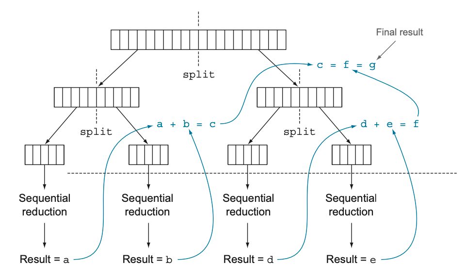
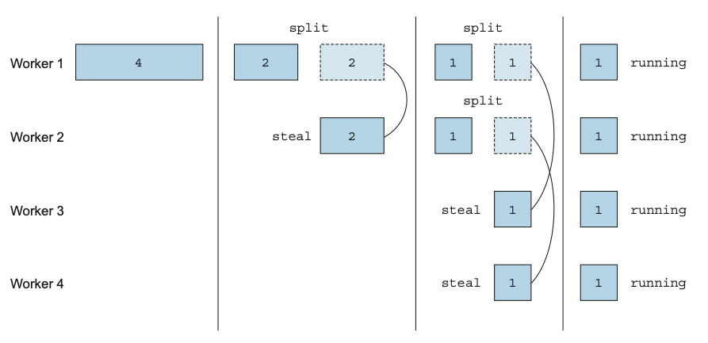
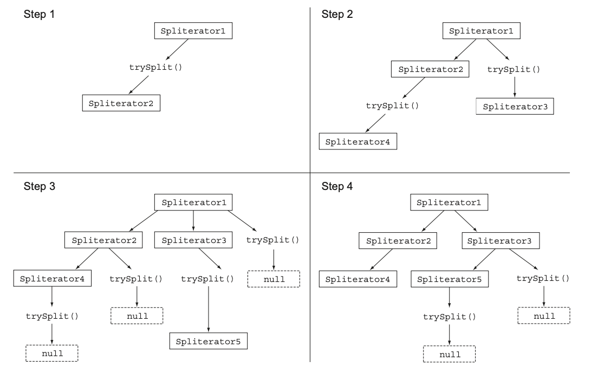

자바 7이 등장하기 전에는 데이터 컬렉션을 병렬로 처리하기가 어려웠다.  

1. 데이터를 서브 파트로 분할한다.
2. 분할된 서브 파트를 각각의 스레드로 할당한다.
3. 스레드로 할당한 다음에는 의도치 않은 레이스 컨디션이 발생하지 않도록 적절한 동기화를 추가해야 한다.
4. 결과를 합쳐야한다.

위의 과정을 쉽게 병렬화를 수행하면서 에러를 최소화할 수 있도록 **포크/조인 프레임워크** 기능을 제공한다.  
병렬 스트림이 내부적으로 어떻게 처리되는지, 여러 청크로 분할하는 방법을 알아보고 커스텀 Spliterator를 구현해보자.  

# 병렬 스트림

병렬 스트림이란 **각각의 스레드에서 처리할 수 있도록 스트림 요소를 여러 청크로 분할한 스트림이다.**  
`parallelStream`을 호출하면 **병렬 스트림** 이 생성된다. 따라서 병렬 스트림을 이용하면 모든 멀티코어 프로세서가 각각의 청크를 처리하도록 할당할 수 있다.  

```java
private long parallelSum(long n) {
    return Stream.iterate(1L, i -> i + 1)
            .limit(n)
            .parallel()
            .reduce(0L, Long::sum);
}
```

사실 순차 스트림에 `parallel`을 호출해도 스트림 자체에는 아무 변화도 일어나지 않는다.  
내부적으로는 연산이 병렬로 수행해야 함을 의미하는 불리언 플래그가 설정된다.  

```java
@Override
public final boolean isParallel() {
    return sourceStage.parallel;
}
```

어떤 연산을 병렬로 실행하고 어떤 연산은 순차로 실행할지 `순차 ↔︎ 병렬`을 제어할 수 있다.  

> **병렬 스트림에서 사용하는 스레드 풀 설정**  
> 스트림의 `parallel` 메서드에서 병렬로 작업을 수행하는 스레드는 어디서 생성되는 것이며, 몇개나 생성되는지 그리고 그 과정을 어떻게 커스터마이즈 할 수 있는지 궁금할 것이다.  
> 병렬 스트림은 내부적으로 **ForJoinPool** 을 사용한다.
> 기본적으로 **ForJoinPool** 은 프로세서 수, 즉 `Runtime.getRuntime().availableProcessors()`가 반환하는 값에 상응하는 스레드를 갖는다.  
> 
> `System.setProperty("java.util.concurrent.ForkJoinPool.common.parallelism", "12");`  
> 위의 설정 코드는 전역적으로 설정하는 방법이므로 모든 병렬 스트림 연산에 영향을 준다.  
> 하나의 병렬 스트림에 사용할 수 있는 특정한 값을 지정하긴 어렵고, 일반적으로 기기의 프로세서 수와 같으므로 특별한 이유가 없다면 기본값을 그대로 사용하는 것을 권장한다.

병렬 프로그래밍을 오용 (예를 들어 병렬과 거리가 먼 반복 작업)을 하면 오히려 스레드를 할당하는 오버헤드만 증가하게 되어 전체 프로그램의 성능이 더 나빠질 수도 있다.  
**마법같은 parallel을 호출하면 내부적으로 어떤 일이 일어나는지 꼭 이해해야 한다.**  
  
> **병렬화는 공짜가 아니라는 사실을 기억하라.**  
> 스트림을 재귀적으로 분할해야 하고, 각 서브스트림을 서로 다른 스레드의 리듀싱 연산으로 할당하고, 이들 결과를 하나의 값으로 합쳐야 한다.  
> 멀티코어 간의 데이터 이동은 생각보다 비싼 작업이다.  
> 따라서 코어 간에 데이터 전송 시간보다 훨씬 오래 걸리는 작업만 병렬로 다른 코어에서 수행하는 것이 바람직하다.  

<h3>병렬 스트림 사용 시 주의점</h3>
  

1. 병렬 스트림으로 바꾸는 것이 능사가 아니다. 꼭 직접 측정해야 한다. 
2. 박싱을 주의하라. 자동 박싱과 언박싱은 성능을 크게 저하시킬 수 있는 요소다. 기본형 특화 스트림을 확인하라.
3. 순차 스트림보다 병렬 스트림에서 성능이 떨어지는 연산이 있다. `limit`, `findFirst` 처럼 요소의 순서에 의존하는 연산을 병렬 스트림에서 수행하려면 비싼 비용을 치뤄야 한다.
4. 스트림에서 수행하는 전체 파이프라인 연산 비용을 고려하라.
5. 소량의 데이터에서는 병렬 스트림이 도움 되지 않는다.
6. 스트림을 구성하는 자료구조가 적절한지 확인하라.
7. 스트림의 특성과 파이프라인의 중간 연산이 스트림의 특성을 어떻게 바꾸는지에 따라 분해 과정의 성능이 달라질 수 있다. 필터 연산으로 인해 스트림의 길이를 예측할 수 없으면 스트림을 병렬 처리할 수 있을지 알 수 없게 된다.
8. 최종 연산의 병합 과정 (`combiner`) 비용을 살펴보라.
  

<h3>공유된 상태를 바꾸는 알고리즘을 사용</h3>

```java
public long sideEffectSum(long n) {
    Accumulator accumulator = new Accumulator();
    LongStream.rangeClosed(1, n).forEach(accumulator::add);
    return accumulator.total;
}

public class Accumulator {
    public long total = 0;
    public void add(long value) { total += value; }
}
```

위의 코드를 **다수의 스레드에서 동시에 실행하면 데이터 레이스 문제가 일어난다.**  
동기화로 문제를 해결하다보면 결국 병렬화라는 특성이 없어져 버리기 때문에 **병렬 스트림과 병렬 계산에서는 공유된 가변 상태를 피해야 한다는 사실을 명심해야 한다.**  

# 포크/조인 프레임워크

**포크/조인 프레임워크는 병렬화할 수 있는 작업을 `재귀적으로` 작은 작업으로 분할한 다음에 서브 태스크 각각의 결과를 합쳐서 전체 결과를 만들도록 설계되었다.**  
서브 태스크를 스레드 풀(`ForkJoinPool`)의 작업자 스레드에 분산 할당하는 `ExecutorService` 인터페이스를 구현한다.  

<h3>RecursiveTask 활용</h3>

스레드 풀을 이용하려면 `RecursiveTask<R>`의 서브클래스를 만들어야 한다.  
여기서 `R`은 **병렬화된 태스트가 생성하는 결과 형식 또는 결과가 없을 때는 `RecursiveAction` 형식이다.**  

```java
public abstract class RecursiveTask<V> extends ForkJoinTask<V> {
    /**
     * 계산 결과 
     */
    V result;

    /**
     * 이 작업으로 수행되는 주요 계산
     */
    protected abstract V compute();

    protected final boolean exec() {
        result = compute();
        return true;
    }
    ...
}
```

`RecursiveTask`를 정의하려면 추상 메서드인 `compute`를 구현해야 한다.  
대표적인 구현체로는 **[DualPivotQuicksort.RunMerger](https://github.com/openjdk/jdk/blob/acc4a828184bd2838a5c0b572f404aa1edaf59e2/src/java.base/share/classes/java/util/DualPivotQuicksort.java#L4383)** 가 있다.  
해당 `compute`메서드는 **태스크를 서브태스크로 분할하는 로직과 더 이상 분할할 수 없을 때 개별 서브태스크의 결과를 생산할 알고리즘을 정의한다.**  
분할 후 정복 알고리즘의 병렬화 버전이다.  

```
if (태스크가 충분히 작거나 더 이상 분할할 수 없으면) {
    순차적으로 태스트 계산
} else {
    태스크를 두 서브태스크로 분할
    태스크가 다시 서브태스크로 분할되도록 이 메서드를 재귀적으로 호출함
    모든 서브태스크의 연산이 완료될 때 까지 기다림
    각 서브태스크의 결과를 합침
}
```



```java
public class ForkJoinSumCalculator extends RecursiveTask<Long> {

    private final long[] numbers;
    private final int start;
    private final int end;
    public static final long THRESHOLD = 10_000;

    private ForkJoinSumCalculator(long[] numbers, int start, int end) {
        this.numbers = numbers;
        this.start = start;
        this.end = end;
    }

    public ForkJoinSumCalculator(long[] numbers) {
        this(numbers, 0, numbers.length);
    }

    @Override
    protected Long compute() {
        int length = end - start;
        if (length <= THRESHOLD) {
            return computeSequentially();
        }
        System.out.printf("%s start: %d, end: %d\n", Thread.currentThread().getName(), start, end);
        ForkJoinSumCalculator leftTask =
                new ForkJoinSumCalculator(numbers, start, start + length / 2);
        leftTask.fork();    // ForkJoinPool의 다른 스레드로 새로 생성한 태스크를 비동기로 실행한다.

        ForkJoinSumCalculator rightTask =
                new ForkJoinSumCalculator(numbers, start + length / 2, end);
        Long rightResult = rightTask.compute();     // 두 번째 서브태스크를 동기 실행한다. 이때 추가로 분할이 일어날 수 있다.
        Long leftResult = leftTask.join();          // 첫 번째 서브태스크의 결과를 읽거나 아직 결과가 없으면 기다린다.
        return leftResult + rightResult;
    }

    private Long computeSequentially() {
        long sum = 0;
        for (int i = start ; i < end ; i++) {
            sum += numbers[i];
        }
        return sum;
    }
}

@Test
void forkJoin() {
    long[] numbers = LongStream.rangeClosed(1, 100_000).toArray();
    ForkJoinTask<Long> task = new ForkJoinSumCalculator(numbers);
    Long result = new ForkJoinPool().invoke(task);
    Assertions.assertThat(result).isEqualTo(5000050000L);
}
//        ForkJoinPool-1-worker-1 start: 0, end: 100000
//        ForkJoinPool-1-worker-1 start: 50000, end: 100000
//        ForkJoinPool-1-worker-2 start: 0, end: 50000
//        ForkJoinPool-1-worker-1 start: 75000, end: 100000
//        ForkJoinPool-1-worker-1 start: 87500, end: 100000
//        ForkJoinPool-1-worker-2 start: 25000, end: 50000
//        ForkJoinPool-1-worker-1 start: 75000, end: 87500
//        ForkJoinPool-1-worker-3 start: 0, end: 25000
//        ForkJoinPool-1-worker-4 start: 50000, end: 75000
//        ForkJoinPool-1-worker-2 start: 37500, end: 50000
//        ForkJoinPool-1-worker-4 start: 62500, end: 75000
//        ForkJoinPool-1-worker-4 start: 50000, end: 62500
//        ForkJoinPool-1-worker-3 start: 12500, end: 25000
//        ForkJoinPool-1-worker-5 start: 25000, end: 37500
//        ForkJoinPool-1-worker-6 start: 0, end: 12500
```

생성한 태스크를 새로운 `ForkJoinPool`의 `invoke` 메서드로 전달하여 `ForkJoinSumCalculator`에서 정의한 태스크의 결과로 반환받는다.  
**일반적으로 애플리케이션에서는 둘 이상의 `ForkJoinPool`을 사용하지 않는다.**  
해당 스레드 풀을 한 번만 인스턴스화해서 정적 필드에 싱글톤으로 저장한다.  
  
> ForkJoinPool을 만들면서 인수가 없는 디폴트 생성자를 이용했는데, 이는 JVM에서 이용할 수 있는 모든 프로세서가 자유롭게 풀에 접근할 수 있음을 의미한다.  
> 더 정확하게는 Runtime.availableProcessors의 반환값으로 풀에 사용할 스레드 수를 결정한다.  
> '사용할 수 있는 프로세서'라는 이름과 달리 **실제 프로세서외에 하이퍼스레딩과 관련된 가상 프로세서도 개수에 포함된다.**

<h3>포크/조인 프레임워크를 제대로 사용하는 방법</h3>

1. `join` 메서드를 태스크에 호출하면 태스크가 생산하는 결과가 준비될 때까지 호출자를 블록시킨다.
   - 따라서 두 서브태스크가 모두 시작된 다음에 `join`을 호출해야 한다.
   - 그렇지 않으면 각각의 서브태스크가 다른 태스크가 끝나길 기라디는 최악의 상황이 발생한다.
2. `RecursiveTask` 내에서는 `ForkJoinPool`의 `invoke`메서드를 사용하지 말아야 한다.
   - 대신 `compute`나 `fork` 메서드를 직접 호출할 수 있다.
   - 순차 코드에서 병렬 계산을 시작할 때만 `invoke`를 사용한다.
3. 서브태스크에 `fork`메서드를 호출해서 `ForkJoinPool`의 일정을 조절할 수 있다.
   - 왼쪽 작업과 오른쪽 작업 모두에 `fork` 메서드를 호출하는 것이 자연스러울 것 같지만 한쪽 작업에는 `fork`를 호출하는 것 보다는 `compute`를 호출하는 것이 효율적이다.
   - 그러면 두 서브태스크의 한 태스크에는 같은 스레드를 재사용할 수 있으므로 풀에서 불필요한 태스크를 할당하는 오버헤드를 피할 수 있다.
4. 포크/조인 프레임워크를 이용하는 병렬 계산은 디버깅하기 어렵다.
5. 병렬 스트림에서 살펴본 것처럼 멀티코어에 포크/조인 프레임워크를 사용하는 것이 순차 처리보다 무조건 빠를 것이란 생각은 버려야 한다.
   - 병렬 처리로 성능을 개선하려면 태스크를 여러 독립적인 서브태스크로 분할할 수 있어야 한다.
   - 각 서브태스크의 실행 시간은 새로운 태스크를 포킹하는데 드는 시간보다 길어야 한다.
   - JIT 컴파일러에 의해 최적화되려면 웜업 또는 실행 과정을 거쳐야 하므로 프로그램을 여러 번 실행한 결과를 측정해야 한다.

# 작업 훔치기

위의 예제에서 숫자가 `10_000개` 이하이면 분할을 중단했는데, 만약 천만 개 항목을 포함하는 배열이였다면 `ForkJoinSumCalculator`는 천 개 이상의 서브 태스크를 포크할 것이다.  
코어의 개수에 비해 서브태스크가 천 개 이상으로 너무 많아 자원만 낭비하는 것 같아 보일 수 있다.  
**실제로는 코어 개수와 관계없이 적절한 크기로 분할된 많은 태스크를 포킹하는 것이 바람직하다.**  
  
**이론적으로는** 코어 개수만큼 병렬화된 태스크로 작업부하를 분할하면 모든 CPU 코어에서 태스크를 실행할 것이고 크기가 같은 각각의 태스크는 같은 시간에 종료될 것이라 생각할 수 있다.  
하지만 실무에서는 이 예제보다 복잡한 계산이 사용되기 때문에 각각의 서브태스크의 작업 완료 시간이 크게 달라질 수 있다.  
포크/조인 프레임워크에서는 **작업 훔치기** 라는 기법으로 이 문제를 해결한다.  
  
작업 훔치기 기법에서는 `ForkJoinPool`의 모든 스레드를 거의 공정하게 분할한다.  
**각각의 스레드는 자신에게 할당된 태스크를 포함하는 이중 연결 리스트를 참조하면서 작업이 끝날 때마다 큐의 헤드에서 `다른 태스크를 가져와서 작업을 처리`한다.**  
즉, 할일이 다 끝난 스레드는 유휴 상태로 바뀌는 것이 아니라 **다른 스레드 큐의 꼬리에서 작업을 훔쳐온다.**  
모든 태스크가 작업을 끝낼 때까지 (모든 큐가 빌 때까지) 이 과정을 반복한다.  
**따라서 태스크의 크기를 작게 나누어야 작업자 스레드 간의 작업부하를 비슷한 수준으로 유지할 수 있다.**  
  
풀에 있는 작업자 스레드의 태스크를 재분배하고 균형을 맞출 때 작업 훔치기 알고리즘을 사용한다.  
작업자의 큐에 있는 태스크를 두 개의 서브 태스크로 분할했을 때 둘 중 하나의 태스크를 다른 유휴 작업자가 훔쳐갈 수 있다.  

```java
public class ForkJoinWorkerThread extends Thread {
    /*
     * ForkJoinWorkerThreads는 ForkJoinPools에 의해 관리되고 ForkJoinTasks를 수행합니다.
     * 설명은 ForkJoinPool 클래스의 내부 문서를 참조하세요.
     * 이 클래스는 풀과 WorkQueue에 대한 링크만 유지 관리합니다.
     */
    final ForkJoinPool pool;                // the pool this thread works in
    final ForkJoinPool.WorkQueue workQueue; // work-stealing mechanics
    ...
}
```



# Spliterator 인터페이스

자바 8은 Spliterator **분할할 수 있는 반복자** 라는 새로운 인터페이스를 제공한다.  
Iterator와 같이 소스의 요소 탐색 기능을 제공하는 점은 같지만 **Spliterator는 병렬 작업에 특화되어 있다.**  

> 자바 8은 컬렉션 프레임워크에 포함된 모든 자료구조에 사용할 수 있는 디폴트 Spilterator 구현을 제공한다.

```java
public interface Spliterator<T> {
    boolean tryAdvance(Consumer<? super T> action);
    Spliterator<T> trySplit();
    long estimateSize();
    int characteristics();
}
```

- `T`는 Spilterator에서 탐색하는 요소의 형식을 가리킨다.
- `tryAdvance` 메서드는 Spliterator의 요소를 하나씬 순차적으로 소비하면서(즉, 일반적인 Iterator 동작과 같다.) 탐색해야 할 요소가 남아있으면 참을 반환한다.
- `trySplit` 메서드는 Spliterator의 일부 요소를 분할해서 두 번째 Spliterator를 생성하는 메서드다.
- `estimateSize`로 탐색해야 할 요소 수 정보를 제공할 수 있다. 특히 탐색해야 할 요소 수가 정확하진 않더라도 제공된 값을 이용해서 더 쉽고 공평하게 Spliterator를 분할할 수 있다.

## 분할 과정



위의 이미지와 같이 스트림을 여러 스트림으로 분할하는 과정은 **재귀적으로** 일어난다.  
`trySplit`의 결과가 null이 될 때까지(더 이상 자료구조를 분할할 수 없음) 이 과정을 반복한다.  
그리고 `characteristics`라는 추상 메서드를 정의하여 Spliterator의 특성 정보를 반환할 수 있다.  
  
## 커스텀 Spliterator 구현하기

```java
/**
 * 스트림에 리듀싱을 실행하면서 단어 수를 계산할 수 있다.
 * 지금까지 발견한 단어 수를 계산하는 counter와 마지막 문자가 공백이였는지 여부를 기억하는 lastSpace 변수가 있다.
 */
public class WordCounter {
    private final int counter;
    private final boolean lastSpace;
    public WordCounter(int counter, boolean lastSpace) {
        this.counter = counter;
        this.lastSpace = lastSpace;
    }

    /**
     * WordCounter 클래스를 어떤 상태로 생성할 것인지 정의
     * 파라미터가 공백이라면 lastSpace 의 값을 보고 어떤 상태로 전이할지 정의한 것이다.
     */
    public WordCounter accumulate(Character c) {
        if (Character.isWhitespace(c)) {
            return lastSpace ? this : new WordCounter(counter, true);
        } else {
            return lastSpace ? new WordCounter(counter + 1, false) : this;
        }
    }

    /**
     * 문자열 서브 스트림을 처리한 WordCounter의 결과를 합친다.
     * WordCounter의 내부 counter값을 서로 합친다.
     */
    public WordCounter combine(WordCounter wordCounter) {
        return new WordCounter(
            counter + wordCounter.counter,
            wordCounter.lastSpace
        );
    }

    public int getCounter() {
        return this.counter;
    }
}

public class WordCounterSpliterator implements Spliterator<Character> {
    private final String string;
    private int currentIndex = 0;

    public WordCounterSpliterator(String string) {
        this.string = string;
    }

    /**
     * 문자열에서 현재 인덱스에 해당하는 문자를 Consumer에 제공한 다음에 인덱스를 증가시킨다.
     * 인수로 전달된 Consumer는 스트림을 탐색하면서 적용해야 하는 함수 집합이 작업을 처리할 수 있도록 소비한 문자를 전달하는 자바 내부 클래스다.
     * 여기에서는 스트림을 탐색하면서 하나의 리듀싱 함수, 즉 WordCounter.accumulate 메서드만 적용한다.
     * 새로운 커서 위치가 전체 문자열 길이보다 작으면 참을 반환하며 반복 탐색해야 할 문자가 남아있음을 의미한다.
     */
    @Override
    public boolean tryAdvance(Consumer<? super Character> action) {
        action.accept(string.charAt(currentIndex++));    // 현재 문자를 소비
        return currentIndex < string.length();           // 소비할 문자가 남아있으면 true를 리턴
    }

    /**
     * 반복될 자료구조를 분할하는 로직을 포함하므로 가장 중요한 메서드다.
     * RecursiveTask.compute 메서드 에서 했던 것 처럼 우선 분할 동작을 중단할 한계를 설정해야 한다.
     * 여기서는 10개의 문자를 사용했지만 실전에서는 너무 많은 태스크를 만들지 않도록 더 높은 한계값을 사용해야 할 것이다.
     * 분할이 필요한 상황에서는 파싱해야 할 문자열 청크의 중간 위치를 기준으로 분할하도록 지시한다.
     * 이때 단어 중간을 분할하지 않도록 빈 문자가 나올때까지 분할 위치를 이동시킨다.
     * 분할할 위치를 찾았으면 새로운 Spliterator를 만든다.
     * 새로 만든 Spliterator는 현재 위치 currentIndex 부터 분할된 위치까지의 문자를 탐색한다.
     */
    @Override
    public Spliterator<Character> trySplit() {
        int currentSize = string.length() - currentIndex;
        if (currentSize < 10) {
            return null;    // 파싱할 문자열을 순차 처리할 수 있을 만큼 충분히 작아졌음을 알리는 null을 반환
        }
        for (int splitPos = currentSize / 2 + currentIndex;
             splitPos < string.length() ; splitPos++) {     // 분할 시작 위치를 중간으로 지정
            if (Character.isWhitespace(string.charAt(splitPos))) {      // 다음 공백이 나올때까지 분할 위치를 뒤로 이동
                // 처음부터 분할 위치까지 문자열을 파싱할 새로운 WordCountSpliterator 를 생성
                Spliterator<Character> spliterator =
                        new WordCounterSpliterator(string.substring(currentIndex, splitPos));

                currentIndex = splitPos; // 시작 위치를 분할 위치로 설정
                return spliterator;     // 공백을 찾았고 문자열을 분리했으므로 루프를 종료
            }
        }
        return null;
    }

    /**
     * Spliterator가 파싱할 문자열 전체 길이와 현재 반복 중인 위치의 차이다.
     */
    @Override
    public long estimateSize() {
        return string.length() - currentIndex;
    }

    @Override
    public int characteristics() {
        return ORDERED + SIZED + SUBSIZED + NONNULL + IMMUTABLE;
    }
}

@Test
void whiteSpaceCount() {
    // 1. 차례대로 탐색
    final String content = "Lorem Ipsum is    simply   dummy text of   the   printing and typesetting industry.";
    int count = this.countWordsIteratively(content);

    Assertions.assertThat(count).isEqualTo(12);

    // 2. Stream의 리듀스 연산
    Stream<Character> stream = IntStream.range(0, content.length()).mapToObj(content::charAt);
    WordCounter reduce = stream.reduce(
        new WordCounter(0, true),
        WordCounter::accumulate,
        WordCounter::combine
    );

    Assertions.assertThat(reduce.getCounter()).isEqualTo(12);

    // 3. 병렬로 연산
    WordCounterSpliterator wordCounterSpliterator = new WordCounterSpliterator(content);
    Stream<Character> stream2 = StreamSupport.stream(wordCounterSpliterator, true); // 병렬 스트림 생성 여부 true
    WordCounter reduce2 = stream2.reduce(
        new WordCounter(0, true),
        WordCounter::accumulate,
        WordCounter::combine
    );

    Assertions.assertThat(reduce2.getCounter()).isEqualTo(12);
}
```

**포크/조인 프레임워크** 에서는 병렬화할 수 있는 태스크를 작은 태스크로 분할한 다음에 분할된 태스크를 각각의 스레드로 실행하며 서브태스크 각각의 결과를 합쳐서 최종 결과를 생산한다.  
**Spliterator** 는 탐색하려는 데이터를 포함하는 스트림을 어떻게 병렬화할 것인지 정의한다.  