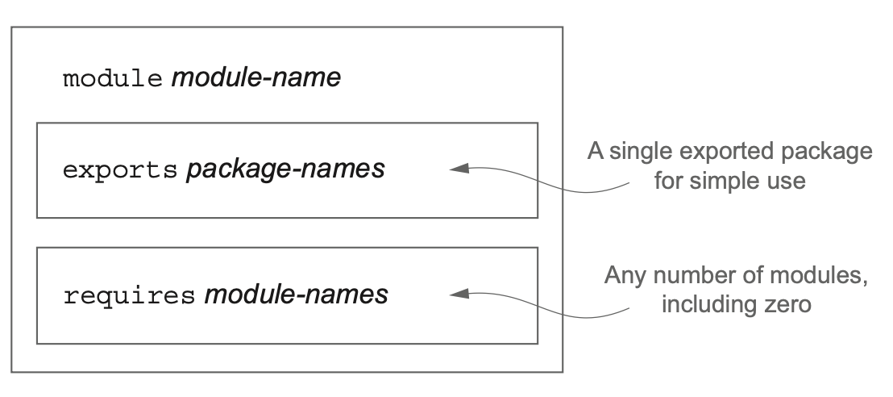
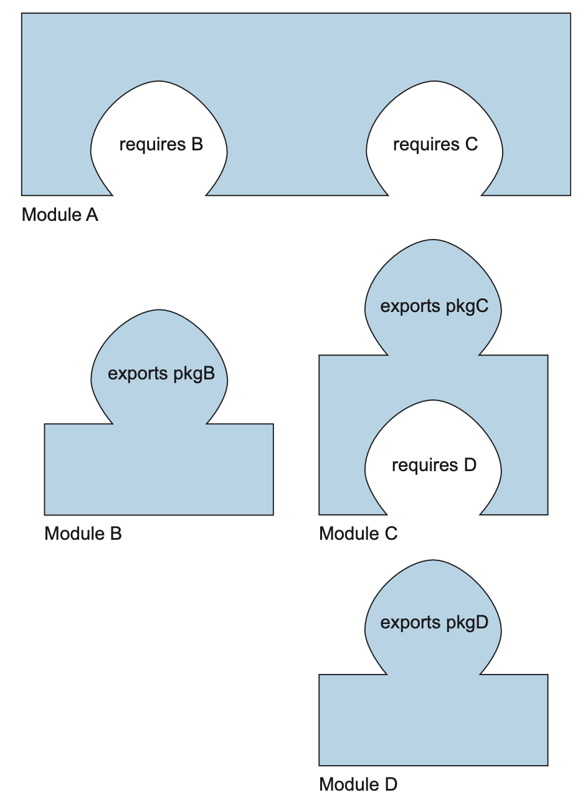

# **모듈화란 무엇이고, 어떤 문제를 해결할 수 있는가?**  

궁극적으로 소프트웨어 아키텍처같은 고수준에서는 기반 코드를 바꿔야 할 때 유추하기 쉬우므로 생산성을 높일 수 있는 소프트웨어 프로젝트가 필요하다.  

<h3>separation of concerns, 관심사 분리</h3>

컴퓨터 프로그램을 고유의 기능으로 나누는 동작을 권장하는 원칙이다.  
파싱, 분석, 레포트 기능을 개발할 때 **서로 거의 겹치지 않는 코드 그룹으로 분리할 수 있다.**  
다시 말해 **클래스를 그룹화한 모듈을 이용해 애플리케이션의 클래스 간의 관계를 시각적으로 보여줄 수 있다.**  
  
"이미 자바 패키지가 클래스를 그룹으로 만들지 않나요?"라고 할 수 있다. 맞는 말이지만 **자바 9 모듈은 클래스가 어떤 다른 클래스를 볼 수 있는지를 컴파일 시간에 정교하게 제어할 수 있다.**  
특히 자바 패키지는 모듈성을 지원하지 않는다.  
  
`SoC` 원칙은 모델, 뷰, 컨트롤러 같은 **아키텍처 관점** 그리고 **복구 기법을 비즈니스 로직과 분리** 하는 등의 하위 수준 접근 등의 상황에 유용하다.  
1. 개별 기능을 따로 작업할 수 있으므로 팀이 쉽게 협업할 수 있다.
2. 개별 부분을 재사용하기 쉽다.
3. 전체 시스템을 쉽게 유지보수할 수 있다.
  
<h3>information hiding, 정보 은닉</h3>

세부 구현을 숨기도록 장려하는 원칙이다.  
세부 구현을 숨김으로 프로그램의 어떤 부분을 바꿨을 때 다른 부분까지 영향을 미칠 가능성을 줄일 수 있다.  
  
자바에서는 클래스내의 컴포넌트에 적절하게 `private`키워드를 사용했는지를 기준으로 컴파일러를 이용해 캡슐화를 확인할 수 있다.  
하지만 자바 9 이전까지는 **클래스와 패키지가 의도된 대로 공개되었는지를 컴파일러로 확인할 수 있는 기능이 없었다.**  

# **자바 모듈 시스템을 설계한 이유**

안타깝게도, 자바9 이전까지는 모듈화된 소프트웨어 프로젝트를 만드는데 한계가 있었다.  
자바는 `클래스`, `패키지`, `JAR` 세 가지 수준의 코드 그룹화를 제공한다.  
클래스와 관련해 자바는 접근 제한자의 캡슐화를 지원했지만 **패키지와 JAR 수준에서는 캡슐화를 거의 지원하지 않았다.**  
  
<h3>패키지의 제한된 가시성 제어</h3>

한 패키지의 클래스와 인터페이스를 다른 패키지로 공개하려면 `public`으로 이들을 선언해야 한다.  
결과적으로 이들 클래스와 인터페이스는 모두에게 공개되기 때문에 **내부적으로 사용할 목적으로 만든 구현을 다른 프로그래머가 임시적으로 사용해서 정착해버릴 수 있으므로 결국 기존의 애플리케이션을 망가뜨리지 않고 라이브러리 코드를 바꾸기가 어려워진다.**  

<h3>클래스 경로</h3>

클래스를 모두 컴파일한 다음 보통 한 개의 평번한 JAR파일에 넣고 클래스 경로에 이 JAR파일을 추가해 사용한다.  
그러면 JVM이 동적으로 클래스 경로에 정의된 클래스를 필요할 때 읽는다.  
  
아래와 같은 약점이 있다.  
1. 클래스 경로에는 같은 클래스를 구분하는 버전 개념이 없다.
   - 예를 들어, 파싱 라이브러리의 `JSONParser` 클래스를 지정할 때 버전 1.0을 사용하는지 버전 2.0을 사용하는지 지정할 수가 없으므로 클래스 경로에 두 가지 버전의 같은 라이브러리가 존재할 때 어떤 일이 일어날지 예측할 수 없다.
2. 클래스 경로는 명시적읜 의존성을 지원하지 않는다.
   - 각각의 JAR안에 있는 모든 클래스는 `classes`라는 한 주머니로 합쳐진다.
   - 즉 **한 JAR가 다른 JAR에 포함된 클래스 집합을 사용하라고 명시적으로 의존성을 정의하는 기능을 제공하지 않는다.**

# **자바 모듈**

자바 8은 **모듈** 이라는 새로운 자바 프로그램 구조 단위를 제공하며 `module`이라는 새 키워드에 이름과 바디를 추가해서 정의한다.  
**모듈 디스크립터** 는 `module-info.java`라는 특별한 파일에 저장된다.  

```java
module java.compiler {
    exports javax.annotation.processing;
    exports javax.lang.model;
    exports javax.lang.model.element;
    exports javax.lang.model.type;
    exports javax.lang.model.util;
    exports javax.tools;

    uses javax.tools.DocumentationTool;
    uses javax.tools.JavaCompiler;
}
```

모듈 디스크립터는 보통 패키지와 같은 폴더에 위치하며 한 개 이상의 패키지를 서술하고 캡슐화할 수 있지만 단순한 상황에서는 이들 패키지 중 한 개만 외부로 노출시킨다.  



`exports`는 **돌출부** , `requires`는 **패인 부분** 으로 생각할 수 있다.  


