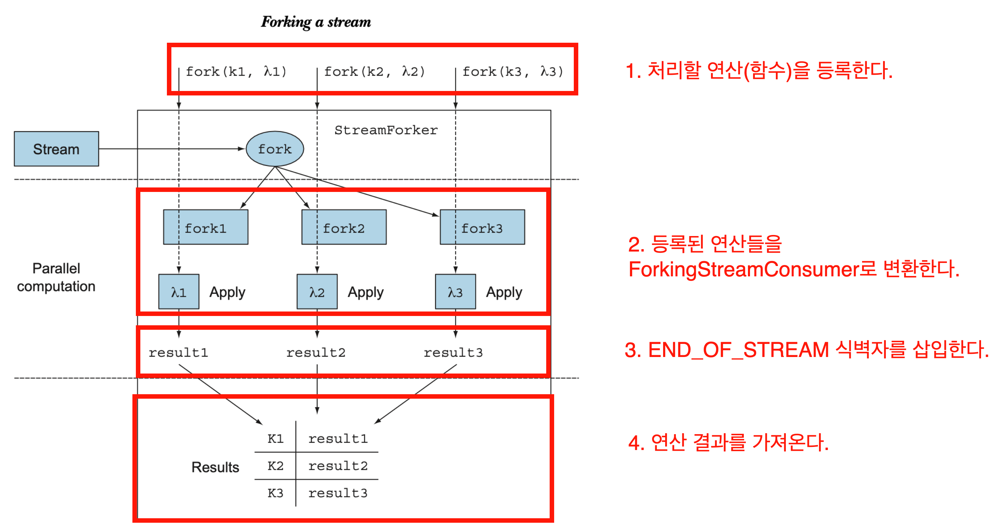
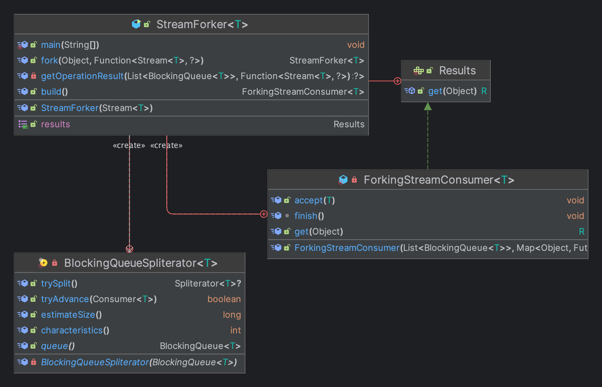
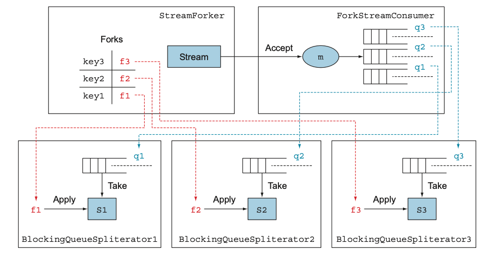

한 스트림에서 여러 결과를 얻어야 하는 상황이 있을 수 있다. 그러려면 한 번에 한 개 이상의 람다를 스트림으로 적용해야 한다.  
즉 **`fork`같은 메서드를 이용해서 스트림을 분기 시키고 포크된 스트림에 다양한 함수를 적용해야 한다.**  
  
Spliterator, BlockingQueue, Future를 이용해서 직접 편리한 API로 만들어보자.  
  
간단하게 보면 아래와 같다.  

1. **StreamForker** 는 처리할 Stream 데이터와 연산을 등록한다.
2. 연산 등록이 끝나면 **StreamForker.getResults()** 를 통해 **ForkingStreamConsumer를 생성한다.**
   - 등록된 연산들을 Future로 감싸면서 **BlockingQueueSpliterator** 를 주입한다.
     - **BlockingQueueSpliterator** 내부에는 데이터를 커낼 큐가 지정되어 있다. 각 연산들은 각각의 Spliterator와 Queue를 가지게 된다.
   - `Map<Object, Function<Stream<T>, ?>>` → `Map<Object, Future<?>>` 로 변환한다.
3. 처리할 Stream 데이터를 순회하면서 **ForkingStreamConsumer** 를 실행한다.
   - ForkingStreamConsumer는 Consumer를 구현하고 있다.
   - ForkingStreamConsumer 내부에는 각 연산이 사용하는 큐가 지정되어 있기 때문에 모든 요소를 모든 큐에 삽입한다.
4. 스트림의 끝을 표현하는 `END_OF_STREAM`을 삽입한다.

Results는 키에 해당하는 StreamForker의 연산 결과를 반환하는 기능을 정의한다.  
  
ForkingStreamConsumer는 Results 인터페이스와 Consumer 인터페이스를 구현하며 스트림의 모든 요소를 소비하기 위해 루프문에 전달한다. (Consumer를 구현하기 때문에 가능하다.)  
루프문에 전달된 연산 수 만큼의 BlockingQueue로 분산시키는 것이 ForkingStreamConsumer의 주요 역할이다.  
병렬 스트림으로 수행하면 큐에 삽입되는 요소의 순서가 흐트러질 수 있으므로 스트림을 순차로 처리한다.
  
`build()`는 BlockingQueue의 리스트를 만들고 스트림에서 실행할 다양한 동작을 식별할 수 있는 키와 대응하는 연산 결과를 포함하는 Future를 값으로 포함하는 맵을 만든다.  
  
`getOperationResult()`는 새로운 BlockingQueue를 생성하여 큐 리스트에 추가한다. 그리고 큐를 새로운 BlockingQueueSpliterator로 전달한다. (큐에서 탐색할 항목을 읽는 늦은 바인딩(late-binding) Spliterator다.)  
Spilterator를 탐색하는 순차 스트림을 만든 다음에 스트림에서 수행할 연산을 포함하는 함수를 적용한 결과를 계산할 Future를 만든다.  
  
ForkingStreamConsumer 클래스는 Consumer 인터페이스와 Results 인터페이스를 구현하며, BlockingQueue의 List 참조와 스트림에 다양한 연산을 수행하는 Future의 Map 참조를 유지한다.  
  
Consumer 인터페이스에 정의된 `aceept()`를 구현하여 스트림 요소를 받을 때마다 요소를 BlockingQueue로 추가한다. 그리고 기존 스트림의 모든 요소를 큐에 추가한다.  
Results 인터페이스에 정의된 `get()`을 구현하여 인수 키로 맵에서 Future를 가져온 다음에 값을 언랩하거나 값이 없으면 결과를 기다린다.  
  
BlockingQueueSpliterator는 스트림을 어떻게 분할할지는 정의하지 않고 늦은 바인딩 기능만 활용하도록 Spliterator를 정의했다. 따라서 trySplit은 구현하지 않았고 큐에서 몇 개의 요소를 가져올 수 있는지 미리 알 수 없으므로 estimatedSize값은 큰 의미가 없다.  
  
`tryAdvance()`는 ForkingStreamConsumer가 원래의 스트림에서 추가한 요소를 BlockingQueue에서 가져온다. 가져온 요소를 다음 스트림의 소스로 사용할 수 있도록 Consumer로 보낸다. `getOperationResult`에서 생성한 Spliterator에서 요소를 보낼 Consumer를 결정하며, fork 메서드로 전달된 함수를 새로 만든 스트림에 적용한다.  
ForkingStreamConsumer가 `END_OF_STREAM` 발견하기 전까지 true를 반환하며 소비할 다른 요소가 있음을 알린다.  
  
StreamForker의 getResults()를 호출해서 정의한 연산을 모두 수행하고 Results를 얻을 수 있다.  
단점은 여러 작업 중 한 개라도 블로킹 된다면 결과를 가져오는데 같은 시간을 소모한다.  

