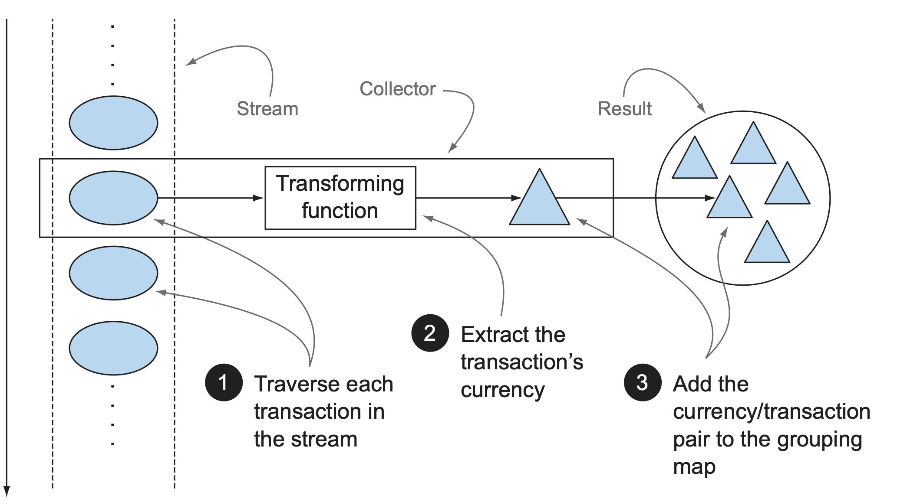
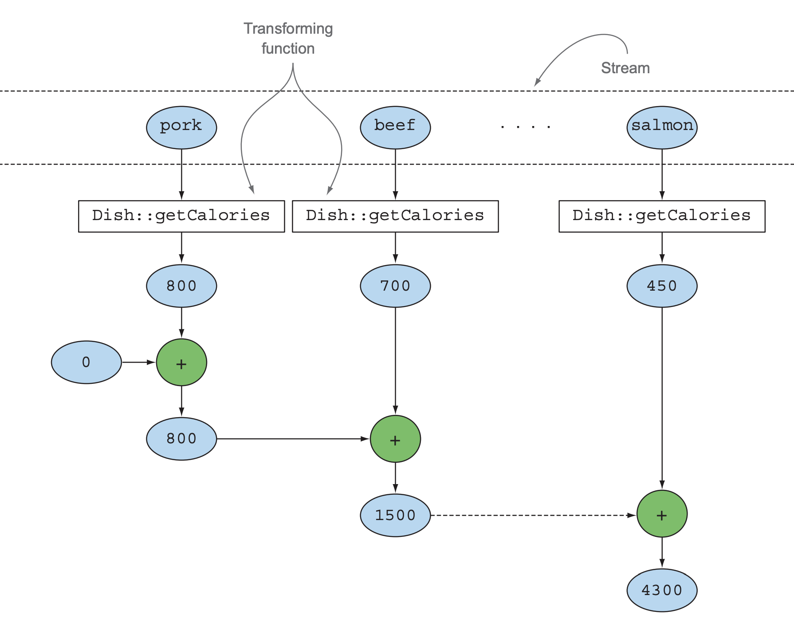

스트림의 연산은 filter 또는 map과 같은 **중간 연산** 과 count, findFirst, forEach, reduce 등의 **최종 연산** 으로 구성된다.  
**`collect` 역시 다양한 요소 누적 방식을 인수로 받아서 스트림을 최종 결과로 도출하는 리듀싱 연산을 수행할 수 있다.**  
다양한 요소 누적 방식은 [Collector 인터페이스](https://docs.oracle.com/javase/8/docs/api/java/util/stream/Collector.html)에 정의되어 있다.  

```java
class Main {
	public static class Transaction {
	    private final Currency currency;
	    private final double value;
        // getter, setter
	}

	public enum Currency {
	    EUR, USD, JPY, GBP, CHF
	}
	
    public static void main(String[] args) throws IOException {
    	List<Transaction> transactions = Arrays.asList(
    			new Transaction(Currency.EUR, 1500.0),
                new Transaction(Currency.USD, 2300.0),
                new Transaction(Currency.GBP, 9900.0),
                new Transaction(Currency.EUR, 1100.0),
                new Transaction(Currency.JPY, 7800.0),
                new Transaction(Currency.CHF, 6700.0),
                new Transaction(Currency.EUR, 5600.0),
                new Transaction(Currency.USD, 4500.0),
                new Transaction(Currency.CHF, 3400.0),
                new Transaction(Currency.GBP, 3200.0),
                new Transaction(Currency.USD, 4600.0),
                new Transaction(Currency.JPY, 5700.0),
                new Transaction(Currency.EUR, 6800.0));
    	
        Map<Currency , List<Transaction>> transactionsByCurrencies = new HashMap<>();
        for(Transaction transaction : transactions){
            Currency currency = transaction.getCurrency();
            List<Transaction> transactionsForCurrency = transactionsByCurrencies.get(currency);
            if(transactionsForCurrency == null){
                transactionsForCurrency = new ArrayList<>();
                transactionsByCurrencies.put(currency , transactionsForCurrency);
            }
            transactionsForCurrency.add(transaction);
        }
    	
        for(Currency key : transactionsByCurrencies.keySet()) {
        	System.out.println(key + " " + transactionsByCurrencies.get(key));
        }        
        
        System.out.println("--------------------------");

        Map<Currency , List<Transaction>> transactionsByCurrencies2 = 
                transactions.stream().collect(Collectors.groupingBy(Transaction::getCurrency));
        
        for(Currency key : transactionsByCurrencies2.keySet()) {
        	System.out.println(key + " " + transactionsByCurrencies2.get(key));
        }
    }
}
```

```
USD [USD 2300.0, USD 4500.0, USD 4600.0]
JPY [JPY 7800.0, JPY 5700.0]
EUR [EUR 1500.0, EUR 1100.0, EUR 5600.0, EUR 6800.0]
GBP [GBP 9900.0, GBP 3200.0]
CHF [CHF 6700.0, CHF 3400.0]
--------------------------
USD [USD 2300.0, USD 4500.0, USD 4600.0]
JPY [JPY 7800.0, JPY 5700.0]
GBP [GBP 9900.0, GBP 3200.0]
EUR [EUR 1500.0, EUR 1100.0, EUR 5600.0, EUR 6800.0]
CHF [CHF 6700.0, CHF 3400.0]
```

# 컬렉터란 무엇인가?

위의 **통화별로 트랜잭션을 그룹화한 코드** 를 보면 같은 결과를 도출하지만 스트림을 사용하여 더욱 간결하게 표현이 가능한것을 확인할 수 있다.  
명령형 프로그래밍에 비해 **함수형 프로그래밍이 얼마나 편리한지 명확하게 보여준다.**  
함수형 프로그래밍에서는 `무엇`을 원하는지 직접 명시할 수 있어서 어떤 방법으로 이를 얻을지는 신경 쓸 필요가 없다.  
그리고 ***높은 수준의 조합성과 재사용성 볼 수 있다.**  

```java
transactions.stream().collect(Collectors.groupingBy(Transaction::getCurrency));
```

위와 같이 `collect`에 [Collection 인터페이스 구현체](https://docs.oracle.com/javase/8/docs/api/java/util/stream/Collectors.html)를 전달했다.  
해당 구현체는 **스트림의 요소를 어떤 식으로 도출할지 지정한다.**  
스트림에서 `collect`를 호출하면 스트림의 요소에 (컬렉터로 파라미터화된) **리듀싱 연산**이 수행된다.  



**Collector 인터페이스의 메서드를 어떻게 구현하느냐에 따라 스트림에 어떤 리듀싱 연산을 수행할지 결정된다.**  
아래 `CollectorImpl`을 어떻게 구현하느냐에 달려있다.  

```java
static class CollectorImpl<T, A, R> implements Collector<T, A, R> {
    private final Supplier<A> supplier;
    private final BiConsumer<A, T> accumulator;
    private final BinaryOperator<A> combiner;
    private final Function<A, R> finisher;
    private final Set<Characteristics> characteristics;

    CollectorImpl(Supplier<A> supplier,
                    BiConsumer<A, T> accumulator,
                    BinaryOperator<A> combiner,
                    Function<A,R> finisher,
                    Set<Characteristics> characteristics) {
        this.supplier = supplier;
        this.accumulator = accumulator;
        this.combiner = combiner;
        this.finisher = finisher;
        this.characteristics = characteristics;
    }

    CollectorImpl(Supplier<A> supplier,
                    BiConsumer<A, T> accumulator,
                    BinaryOperator<A> combiner,
                    Set<Characteristics> characteristics) {
        this(supplier, accumulator, combiner, castingIdentity(), characteristics);
    }

    ...
}
```

<h3>Collectors에서 제공하는 메서드의 기능</h3>

1. 스트림 요소를 하나의 값으로 리듀스하고 요약
2. 요소 그룹화
3. 요소 분할

## 리듀싱과 요약

[예제를 작성한 테스트 코드](https://github.com/jdalma/kotlin-playground/blob/main/src/test/java/ReducingAndSummarizing.java)에서 확인할 수 있다.  
스트림에 있는 객체의 숫자 필드의 합계나 평균등을 반환하는 연산에도 리듀싱 기능이 사용되는데, 이러한 연산을 **요약** 연산이라 부른다.  



최소,최대,평균,합계,문자열 연산 같은 컬렉터는 **reducing 팩토리 메서드** 로 정의할 수 있다.  
즉 범용 `Collectors.reducing`으로도 구현할 수 있다.  

```java
public static <T, U> Collector<T, ?, U> reducing(
            U identity,
            Function<? super T, ? extends U> mapper,
            BinaryOperator<U> op
) {
    return new CollectorImpl<>(
            boxSupplier(identity),
            (a, t) -> { a[0] = op.apply(a[0], mapper.apply(t)); },
            (a, b) -> { a[0] = op.apply(a[0], b[0]); return a; },
            a -> a[0], CH_NOID);
}
```

1. 첫 번째 인수는 **리듀싱 연산의 시작 값이거나 스트림에 인수가 없을 때 반환값이다.**
2. 두 번째 인수는 **사용할 데이터** 이다. 칼로리 합계를 누적할 때 `Dish::calories`와 같은 데이터
3. 세 번째 인수는 **같은 종류의 두 항목을 하나의 값으로 더하는 `BinaryOperator`이다.**

