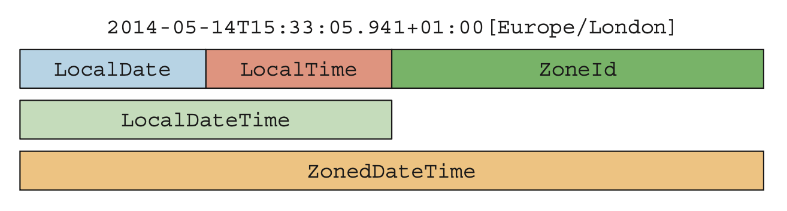

# **JAVA8에 새로운 날짜와 시간 API가 생긴 이유**

자바 1.0 부터 지원하는 `java.util.Date` 클래스는 날짜라는 클래스의 이름과 달리 특정 시점을 날짜가 아닌 밀리초 단위로 표현한다.  
게다가 1900년을 기준으로 하는 오프셋, 0에서 시작하는 달 인덱스 등 모호한 설계로 유용성이 떨어졌다.  
그리고 Date의 출력 결과로는 JVM 기본시간대인 CET (중앙 유럽 시간대)를 사용했다.  
  
대안으로 `java.util.Calendar`라는 클래스가 추가되었지만 쉽게 에러를 일으키는 설계 문제를 갖고 있었다.  
날짜와 시간의 형식을 조절하고 파싱할 때 사용하는 `DateFormat`도 스레드에 안전하지 않은 문제도 있었다.  
Date와 Calendar는 모두 가변 클래스다.  
- [java.util.Date 클래스를 피해야하는 이유](https://codeblog.jonskeet.uk/2017/04/23/all-about-java-util-date/)

  

- **기계용 시간**
  - 유닉스 EPOCK(1970년 1월 1일 0시 0분 0초 UTC 기준)을 기준으로 특정 지점까지의 시간을 초로 표현한다.
- **인류용 시간은 우리가 흔히 사용하는 연,월,일,시,분,초 등을 표현한다.**
- **타임스탬프는 Instant를 사용한다.**
-   **특정 날짜(LocalDate) , 시간(LocalTime) , 일시(LocalDateTime)를 사용할 수 있다.**
-   **기간을 표현할 때는 Duration(시간 기반)과 Period(날짜 기반)을 사용할 수 있다.**
-   **DateTimeFormatter를 사용해서 일시를 특정한 문자열로 포매팅할 수 있다.**
-   <span style="color:red; font-weight:bold">Immutable하고 새로운 인스턴스가 만들어진다.</span>

<h3>기계 시간으로 표현 하는 방법</h3>

```java
Instant instant = Instant.now();
System.out.println(instant);
// 현재 시간은 2021-01-14 22:08분
// 출력 - 2021-01-14T13:08:28.794934700Z
// 기준 시간이 UTC , GMT 이기 때문에 시간이 다르다.

ZoneId zone = ZoneId.systemDefault();
System.out.println(zone);
// 출력 - Asia/Seoul

ZonedDateTime zonedDateTime = instant.atZone(zone);
System.out.println(zonedDateTime);
// 출력 - 2021-01-14T22:11:49.055336800+09:00[Asia/Seoul]
```

<h3>인류용 일시를 표현하는 방법</h3>

```java
LocalDateTime now = LocalDateTime.now();
System.out.println(now);
// 현재 시간은 20210-01-14 22:16
// 출력 - 2021-01-14T22:16:06.431744200

LocalDateTime birth =
        LocalDateTime.of(1993 , Month.APRIL , 30 , 0 , 0 , 0);
System.out.println(birth);
// 출력 - 1993-04-30T00:00

ZonedDateTime nowInKorea = ZonedDateTime.now(ZoneId.of("Asia/Seoul"));
System.out.println(nowInKorea);
// 출력 - 2021-01-14T22:18:52.191717500+09:00[Asia/Seoul]

Instant beforeInstant = Instant.now();
ZonedDateTime zonedDateTime1 = beforeInstant.atZone(ZoneId.of("Asia/Seoul"));
Instant afterInstant = zonedDateTime1.toInstant();
// ZonedDateTime 과 Instant는 서로 변환이 가능하다.
```

<h3>기간을 표현하는 방법</h3>

```java
LocalDate today = LocalDate.now(); // 2021-01-14
LocalDate dateOfBirth = LocalDate.of(1993 , Month.APRIL , 30);
Period period = Period.between(dateOfBirth , today);
System.out.println(period.getYears());  // 27
System.out.println(period.getMonths()); // 8
System.out.println(period.getDays());   // 15

Period period1 = dateOfBirth.until(today);
System.out.println(period1.get(ChronoUnit.DAYS));   // 15


Instant now2 = Instant.now();
Instant plus = now2.plus(10, ChronoUnit.DAYS);
Duration diff = Duration.between(now2 , plus);
System.out.println(diff);   // PT240H
```

<h3>포맷팅</h3>

```java
LocalDateTime dateTime = LocalDateTime.now();
DateTimeFormatter formatter = DateTimeFormatter.ofPattern("yyyy-MM-dd");
System.out.println(now.format(formatter)); // 2021-01-14
```

<h3>파싱</h3>

```java
DateTimeFormatter parseFormatter = DateTimeFormatter.ofPattern("yyyy/MM/dd");
LocalDate localDate = LocalDate.parse("2021/01/14", parseFormatter);
System.out.println(localDate);
```

<h3>기존 Date , GregorianCalendar 변환 가능</h3>


```java
Date date = new Date();
// Instant <- Date
Instant instant1 = date.toInstant();
// Date <- Instant
Date newDate = Date.from(instant1);

GregorianCalendar gregorianCalendar = new GregorianCalendar();

// Instant <- GregorianCalendar
Instant toInstant = gregorianCalendar.toInstant();

// ZonedDateTime <- GregorianCalendar
ZonedDateTime toZonedDateTime = gregorianCalendar.toInstant()
        .atZone(ZoneId.systemDefault());

// LocalDateTime <- GregorianCalendar
LocalDateTime toLocalDateTime = gregorianCalendar.toInstant()
        .atZone(ZoneId.systemDefault()).toLocalDateTime();

// GregorianCalendar <- toZonedDateTime
GregorianCalendar from = GregorianCalendar.from(toZonedDateTime);
```

<h3>ZoneId</h3>

표준 시간이 같은 지역을 묶어서 시간대 규칙 집합을 정의한다.  
`ZoneRules` 클래스에는 약 40개 정도의 시간대가 있다.  
`[지역]/[도시]` 형식으로 이루어지며 IANA Time Zone Database에서 제공하는 지역 집합 정보를 사용한다.




# 커스텀 TemporalAdjuster 구현하기

날짜를 하루 증가시키는데 토요일과 일요일은 건너뛰도록 해보자.


```java
private static class NextWorkingDay implements TemporalAdjuster {
	@Override
	public Temporal adjustInto(Temporal temporal) {
		DayOfWeek dow = DayOfWeek.of(temporal.get(ChronoField.DAY_OF_WEEK));
		int dayToAdd = 1;
		if (dow == FRIDAY) dayToAdd = 3;
		else if (dow == SATURDAY) dayToAdd = 2;
		return temporal.plus(dayToAdd, ChronoUnit.DAYS);
	}
}

@Test
void customTemporalAdjusters() {
	LocalDate date = LocalDate.of(2023, 10, 6); // 금요일
	LocalDate with = date.with(new NextWorkingDay());

	assertThat(with.getDayOfMonth()).isEqualTo(9);
}
```

# **참고**

- [https://docs.oracle.com/javase/tutorial/datetime/overview/index.html](https://docs.oracle.com/javase/tutorial/datetime/overview/index.html)
- [https://docs.oracle.com/javase/tutorial/datetime/iso/overview.html](https://docs.oracle.com/javase/tutorial/datetime/iso/overview.html)
- 모던 자바 인 액션