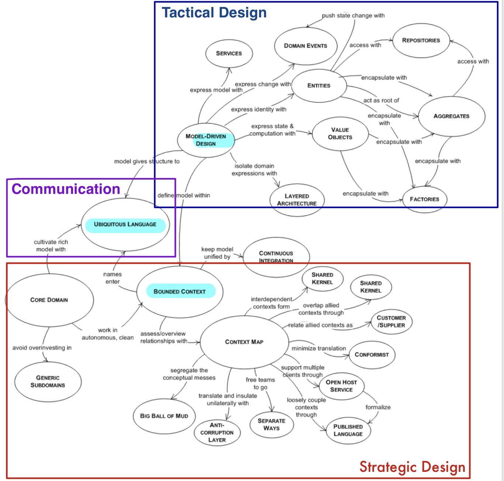

- [`johngrib.github.io` Factory](https://johngrib.github.io/wiki/pattern/factory/)
- [`johngrib.github.io` Static Factory Method](https://johngrib.github.io/wiki/pattern/static-factory-method/)
- [`sumini.dev` Factory Pattern 개념부터 적용까지](https://sumini.dev/til/014-factory/)
- [`culttt.com` What are `Factories` in Domain Driven Design?](https://www.culttt.com/2014/12/24/factories-domain-driven-design/)
- [`culttt.com` What are `Aggregates` in Domain Driven Design?](https://www.culttt.com/2014/12/17/aggregates-domain-driven-design)
- [`martinfowler` DDD_Aggregate](https://martinfowler.com/bliki/DDD_Aggregate.html)
  

- [출처](https://velog.io/@cks8483/DDDDomain-Driven-Design)


# DDD란?

DDD는 **OOP + 애자일** 이며, 기술적 방법론이라기 보다는 **디자인 패턴, 언어 패턴** 이라고 볼 수 있다.  
도메인 전문가와 개발자는 유비쿼터스 언어를 정의하고 그 언어를 기반으로 도메인 모델을 창조하며 개발자는 그 도메인 모델을 코드로 옮긴다.  
이 한 프로세스를 기민하게 짧은 주기로 반복하여 흐릿하고 변경되는 요구사항을 빠르게 적용하고 리팩토링을 통하여 도메인 모델을 진화시키는 것이다.  
  
이 DDD를 사용하려하는 본질적인 이유는 뭘까?  
**핵심은 변경에 용이하도록 코드를 잘 짜는 것이다.**  
DDD를 사용하면 어떤 복잡성이 낮춰지고 뭐가 단순해지는건지를 이해해야 한다. 왜, 어떤 경우에 사용하는지 고민해라.  
단순히 이런 DDD를 적용하고 싶다라는 접근이 아니라 어떤 문제를 해결하는지, 사용자 또는 사업에 어떤 순영향을 끼치는지를 알아야 한다.  
  
1. DDD는 MSA와 무관하다. MSA를 설명할 때 애그리게이트와 바운디드 컨텍스트를 차용해서 설명하기에 편해서 DDD가 자주 등장하는 것이다. MSA를 한다고해서 DDD를 사용하는 것은 아니다.
2. DDD는 애자일을 기반으로 하기에 변경을 수용하라, 변경을 수용하기 위한 피드백과 반복이 애자일의 핵심이다.
3. 도메인 모델을 하나로 만들지 말고 여러 개로 쪼개야 하며, 섣부른 일반화는 망하는 지름길이다.
4. DDD란 도메인 로직을 제외한 모든 부분을 제거하고 비즈니스적 내용만 존재하도록 격리시키는 것이다.

# **유비쿼터스 언어**

도메인 전문가, 도메인 분석가 또는 설계자, 개발자가 도메인과 관련된 공통의 언어를 사용하여 한 단어에 대한 생각을 모두 일치시키는 것이다.  
**도메인 용어에 맞지 않는 단어를 사용하면 코드는 도메인과 점점 멀어지게 된다**  


```java
public enum OrderState{
  STEP1,STEP2,STEP3,STEP4,STEP5,STEP6;
}

public enum OrderState{
  PAYMENT_WAITING,PREPARING,SHIPPED,DELIVERING,DELIVERY_COMPLETED;
}
```

유비쿼터스 언어를 코드베이스까지 사용하고 목표 시스템을 더 깊게 이해하면서 언어를 더 명확하게 정의하고 코드베이스와 끊임없이 일치시켜야 한다.  

- 도메인 지식이 코드에 잘 전달되었는지를 확인할 방법은 제품을 도메인 측에서 사용해보는 수 밖에 없고 도메인 전문가가 해야할 핵심 업무임
- 유비쿼터스 그로서리를 가장 많이 사용하는 곳은 기획, QA임
- 따라서 실질적인 그로서리는 피그마 내부에서 정의되는 경우가 대부분

# **모델**

모델이란 **대상 도메인에 대한 내부적 표현으로서 설계와 개발 프로세스 내내 반드시 필요하다.**  
모델은 해결해야 하는 문제를 바라보는 다양한 관심사 중 하나를 선택해서 문제를 설명하는데 꼭 필요한 것만 표현해야 한다.  
그렇기에 관심사별로 분리하여 잡음을 제거해야 한다.  
  
업무 담당자의 관심사에 따라 모델을 바라보는 시각이 서로 다르기 때문에 관심사의 분리는 꼭 행해져야 한다.  

## 도메인 모델이란?

도메인 자체를 표현하는 개념적인 모델을 의미하지만, 도메인 계층을 구현할 때 사용하는 객체 모델을 언급할 때에도 사용한다.  
이에 대한 정의는 바라보는 사람마다 다 다르지만, **사용자가 프로그램을 사용하는 주제 영역**이다.  
  
**도메인 모델에서 getter/setter는 도메인의 핵심 개념이나 의도를 코드에서 사라지게 한다**  
도메인 객체가 불완전한 상태로 사용되는 것을 막으려면 `생성 시점에 필요한 것을 전달해 주어야 한다`  
도출한 모델은 크게 **엔티티**와 **값 객체로**로 구분할 수 있다  

> **대상의 단순화**가 모델링이다.  
> 사용자가 프로그램을 사용하는 주제 영역 안에서 당면한 문제를 해결하는 것과 관련된 측면을 추상화하고 중요하지 않은 세부사항은 생략  
> **도메인 모델 = 코드**, 도메인 모델 그대로 코드를 작성해야 하는 것이 중요하다. 도메인 모델 없이도 코드를 보고 도메인 모델을 만들 수 있을 정도로 해야한다.

이 도메인 모델을 만들기 위한 방법이나 형식,형태가 정해져있지 않다.  
**목적이 중요하다.**  
`도메인 모델 = 설계 = 코드`를 계속 애자일을 통해 개선(리팩토링)해 나가는 것이다.  
  
**도메인 로직** : 기술적인 부분이 모두 제거된 부분, 도메인으로만 설명할 수 있는 부분  
**어플리케이션 로직** : 유즈케이스나 도메인 로직에 대한 워크플로우를 설명하는 부분, 도메인 로직보다 큰 개념이다.  

## 도메인 로직 패턴

> "소프트웨어에서 도메인 로직을 어디에 두는 것이 좋은가?"

[엔터프라이즈 애플리케이션 아키텍처 패턴](https://m.yes24.com/Goods/Detail/22384677)를 참고하면 좋다.  

1. **트랜잭션 스크립트 패턴**
   - 클라이언트가 요청한 비즈니스 로직을 하나의 프로시저가 모두 처리한다.
   - 이 패턴은 애플리케이션이 제공하는 기능 대부분을 반복적인 CRUD로 처리할 수 있는 경우에 적합하다.
   - 서블릿과 JSP가 대표적인 사례다.
2. **테이블 모듈 패턴**
   - 데이터베이스 테이블 또는 뷰 단위로 비즈니스 로직을 처리하는 클래스를 분리한다.
   - JSP가 테이블 기준으로 분리된 모듈을 직접 호출하는 것으로 생각하면 된다.
3. **서비스 레이어 패턴**
   - 서비스 레이어로 부르는 독립된 클래스에 시스템 통합과 전체 흐름을 조정하는 책임을 부여한다.
   - 서비스 경계를 통해 클라이언트에 영향을 주지 않으면서 변화나 개선이 가능하다.
4. **도메인 모델 패턴**
   - 모든 비즈니스 로직을 서비스 레이어에 구현하면 시간이 지나면서 점점 더 복잡해지고 유지보수가 어려워진다.
   - 위의 세 가지 패턴과 달리 **데이터와 행위를 하나의 객체로 설계하여 다양한 규칙과 논리의 복잡한 관계를 여러 도메인 객체에 분산시키고 객체한 협력으로 구현하는 것이다.**

# **엔티티와 값 객체**

이 두 개를 따로 이해하는 것은 큰 의미는 없지만 이 두 개가 합쳐져서 애그리게이트가 구성된다.  
포커스는 코드를 쉽게 작성하는 것을 명심하라.  
  
핵심은 **식별성**의 차이다.  
엔티티는 특정 식별자로 구분할 수 있어야하며, 값 객체는 구분할 수 없는 것이다. (속성만으로 구분할 것이다.)  
예를 들어, 서로 다른 시스템(시스템1, 시스템2, 메시지 큐 등등)에서 여러 속성을 가진 한 개의 객체가 추적이 필요하다면 엔티티로 구현해야 한다.  
실무자가 이것들의 범위를 결정한다.  

> **엔티티 = 식별자 동일성**  
> **값 객체 = 속성 동등성**

값 객체는 엔티티를 수식하므로 클라이언트가 값 객체에 직접 접근해서 속성을 변경하지 않고 엔티티 객체를 통해서만 변경해야 한다.  
책임을 서로 나누는 것은 값 객체가 비즈니스 로직이나 규칙을 가질 때 큰 가치가 있음을 알 수 있다.  
엔티티를 통해 속성을 변경할 때 값 객체는 불변이기에 새로운 인스턴스를 생성하는 방법을 사용한다.   
  
값 객체가 원칙적으로 불변이기는 하지만 특별한 상황에서는 setter를 허용하기도 한다.  

1. 값이 자주 변경돼 메모리를 효율적으로 사용하지 못하는 경우
2. 객체 생성이나 삭제에 많은 비용이 드는 경우
3. 교체로 인해 클러스터링이 제한되는 경우
4. 값을 공유할 일이 많지 않거나 클러스터링을 향상시키기 위해 또는 다른 기술적인 이유로 공유가 보류된 경우

## 엔티티

엔티티는 도메인 모델에서 매우 중요한 객체들이고, 모델링 작업을 시작할 때부터 깊이 고민해야 할 부분이다.  
  
소프트웨어가 여러 상태를 거치는 동안에도 동일한 값을 유지하는 **식별자** 를 지니는 유형의 객체이다.  
**식별자가 같은 두 객체는 같다고 간주한다.**  
  
추상화를 정의하는 것처럼 엔티티를 기준으로 개발하다보면 값 객체로 정의해야 할 속성들이 드러난다.

## 값 객체

하나의 객체가 도메인의 어떠한 측면을 표현하는 데 사용되지만 식별자가 없는 경우에 이것을 **값 객체** 라고 부른다.  
식별자가 없는 값 객체는 쉽게 생성되고 폐기할 수 있다.  
값 객체는 엔티티를 단순화하기 위해 사용하며, 속성은 모두 불변이어야 한다.  
이러한 이유로 값 객체를 많이 사용하라고 조언한다.  
  
행위 중심이 값 객체이며, 값 객체는 DTO가 아님을 명심해야 한다.  
값 객체는 데이터베이스에서 테이블 매핑이 되는 개념과 애플리케이션에서 사용되는 개념이 다르다.  
예를 들어, 테이블에는 ID 값이 있어도 애플리케이션에서는 그 ID값으로 식별하지 않는 것처럼 말이다.  
  
ORM(JPA) Entity와 DDD의 Entity는 완전히 다르다.  
JPA의 Entity는 영속성 메커니즘일 뿐이며 DDD의 Entity는 비즈니스 로직을 가지고 있는 것이다.  
  
결국 **엔티티에 복잡한 행위들을 특정 속성과 함께 추출하여 복잡성을 낮추는 것이 핵심이다.**  

# **도메인**
소프트웨어로 해결하고자 하는 **문제 영역**  
한 도메인은 다시 하위 도메인으로 나눌 수 있다  
한 하위 도메인은 다른 하위 도메인과 연동하여 완전한 기능을 제공  
  
**도메인 계층은 엔티티와 값 객체에 적용될 비즈니스 규칙을 담고 있다.**  
  
- **도메인 모델 패턴**
  1. `Presentation`**표현** *또는 사용자 인터페이스*
     - 클라이언트의 요청을 처리 또는 응답
  2. `Application` **응용**
     - 요청한 기능을 실행
     - `업무로직을 직접 구현하지 않고` **도메인 계층을 조합해서 기능을 실행**
  3. `Domain` **도메인**
     - 도메인 모델의 핵심 로직을 구현
  4. `Infrastructure` **인프라스트럭처**
     - DB나 메시징 시스템과 같은 외부 시스템과의 연동
     - *[Drools](http://www.opennaru.com/jboss/dynamically-create-rules-using-drools/)*

- 도메인의 복잡도에 따라 **응용**계층이 **인프라스트럭처**계층에 의존하기도 한다
  - 이런 의존은 `테스트 어려움` , `기능 확장의 어려움` 두 가지 문제가 발생한다


# **계층형 아키텍처**

```
사용자 인터페이스 | 애플리케이션 | 도메인 | 인프라스트럭처
```
- **애플리케이션 레이어** 는 업무 로직을 포함하지 않는 얇은 레이어다. 비즈니스 객체의 상태를 보관하지 않지만, **애플리케이션 작업의 처리 상태는 보관한다.**
- **도메인 레이어** 는 업무 소프트웨어의 심장에 해당한다. 비즈니스 객체의 상태를 포함한다.
- **인프라스트럭처** 는 다른 레이어 모두를 지원하는 라이브러리로 동작한다. 레이어 간의 통신을 제공하고 비즈니스 객체의 영속성을 구현한다.
  
복잡한 프로그램을 **레이어** 로 분할해야 한다.  
각 레이어 내부에서 설계를 수행하여 응집도 높고 **자기 하위 레이어에만 의존하도록 만들어야 한다.**  
예를 들어, 하나의 레이어에 도메인과 관련된 모든 코드를 집중시켜서, 사용자 인터페이스, 애플리케이션, 인프라스터럭처 코드로부터 독립적으로 만들어야 한다.  
  
**도메인 객체들은 스스로 정보를 보여주고 저장하고 애플리케이션 작업을 관리하는 등의 부가적인 책임에서 자유롭게 두고, 대신 도메인 모델 자체를 표현하는 것에만 집중할 수 있도록 한다.**  

# **서비스**

우리가 도메인을 분석하여 모델을 구성하는 주요 객체를 정의하려고 할 때 도메인의 어떤 부분들은 객체로 쉽게 매핑될 수 없다는 것을 알게된다.  
객체는 속성과 객체가 관리하는 내부 상태 정보와 밖으로 드러나는 행위를 가지고 있다.  
  
서비스는 도메인 레이어에서 사용되기도 하며, 서비스는 서비스를 수행하는 객체 자신이 아니라 **오퍼레이션이 수행되는 대상이나, 목적이 되는 객체와 관련이 있다.**  
서비스는 이러한 방식으로 많은 객체가 관계를 맺는 지점이 된다.  
  
1. **서비스에 의해 수행되는 오퍼레이션은 일반적으로 엔티티 또는 값 객체에 속할 수 없는 도메인의 개념을 나타낸다.**
2. **수행되는 오퍼레이션은 도메인의 다른 객체를 참조한다.**
3. **오퍼레이션은 상태를 저장하지 않는다.**

도메인에서 주요 처리나 변경을 수행하는 작업을 발견헀는데, 엔티티나 값 객체의 책임은 아니라면, 이를 서비스로서 독립적인 인터페이스의 오퍼레이션으로 추가한다.  
**서비스를 사용할 때 도메인 레이어를 분리시켜야 한다는 점은 매우 중요하다.**  
  
즉, 객체처럼 상태를 가지고 행위를 정의하는 경우가 아니라 행위만 정의해야 할 경우 이 책임을 맡아줄 서비스 추가를 고려해야한다.  
서비스는 컨텍스트에 따라 다양하게 해석되기에 에릭 에반스는 세 가지로 분류했다.  

1. **인프라스트럭처 서비스**
   - 이 서비스는 헥사고날 아키텍처에서 정의한 어댑터이다.
   - 이 서비스를 다른 서비스와 분리하지 못하면 기술과 관련있는 다양한 이슈가 도메인 모델까지 전파되어 온전한 도메인 모델을 유지하기 힘들고 독립적인 테스팅도 어렵게 한다.
2. **애플리케이션 서비스**
   - 대표적으로 두 개의 책임을 가진다.
   - 첫 번쨰. 클라이언트 요청부터 응답까지를 하나의 트랜잭션으로 처리하여 에러를 반환하거나 예외 처리, 트랜잭션 실패 처리, 로깅, 메트릭, 모니터링 관련 기능 담당
   - 두 번쨰. 인프라스트럭처와 상호 작용을 포함한 비즈니스 유즈케이스의 흐름을 조정하는 책임이 있다.
   - 예를 들어, 도메인 객체가 사용하는 정보가 다른 서비스에 있는 경우 이를 획득하기 위해 어댑터를 사용해야 하므로 인프라스트럭처 서비스가 제공하는 메소드를 호출해 결과를 얻어 도메인 객체에 전달하기도 한다.
   - 또는 도메인 객체가 처리를 완료하면 최종 상태를 데이터베이스에 다시 기록하고 필요시 외부 시스템에게 알리기 위해 이벤트를 발행하기도 한다.
3. **도메인 서비스**
   - 말 그대로 도메인을 위해 존재하는 객체이므로 기술에 의존성이 없는 POJO로 구현해야 한다.
   - 특정 도메인 객체를 사용하기 위해 다른 도메인 객체나 데이터 전송 객체로 변환하거나 반대로 전송 객체를 도메인 객체로 변환하는데 사용한다.
   - 도메인 객체에 전달할 목저으로 무엇인가를 계산할 때도 사용한다.
   - 전달받은 파라미터만 사용해 비즈니스 로직을 수행하고 그 결과를 반환하며, 상태를 가져서는 안된다.
   - 즉, **도메인과 밀접하게 관련된 기능이면서 엔티티나 값 객체에 어울리지 않는 책임을 도메인 서비스에 부여한다.**
   - `"엔티티에 부여하기 적합하지 않은 책임을 도메인 서비스에 부여하라."` - 에릭 에반스


중요한 점은 서비스가 **어떤 성격을 띄고 어떤 책임을 가지는지** 잘 구분해야 한다.  

# **모듈**

규모가 큰 애플리케이션인 경우 모델은 점점 더 커지게 된다.  
이때 모델은 모듈로 나누어 구조화할 필요가 있다.  
**모듈화란, 관련된 개념과 작업을 조직화하여 복잡도를 감소시키는 기법이다.**  
설계에서 모듈을 사용할 때는 응집도는 높이고 결합도는 낮추는 방향으로 적용해야 한다.  
  
> **통신 응집도** 는 모듈의 일부가 같은 데이터를 다룰 때 얻을 수 있다. 관계가 견고하기 때문에 그룹핑하는 것이 당연하다.  
> **기능 응집도** 는 모듈의 모든 부분이 잘 정의된 임무를 함께 수행하고 있을 때 얻어지며, 이것은 최고의 응집도라 할 수 있다.

# **불변식**

기본적인 구현 관점에서는 기능 요구 사항으로 설계하지만 DDD에서는 “불변식”을 섞어서 전체 코드의 구조를 설계해야 한다.  
이 구조를 애그리게이트 단위로 설계하는 것이다.  
  
불변식은 기능 요구 사항을 지키기 위한 특정 조건들이다.

# **집합**

**도메인 객체의 생명주기를 다루는 것으로, 이것은 모델링의 또 다른 면에 속한 도전과제라 할 수 있다.**  
도메인 객체는 생명주기 동안 여러 가지 상태를 거치게 되는데 이 생명주기 관리라는 과제를 잘 다루기 위하여 세 가지 패턴을 소개한다.  

## **Aggregate 집합**

애그리게이트는 도메인 객체들의 연관 관계에서 불변식을 보장해야 하는 단위이다.  
이 애그리게이트 단위로 리포지토리를 추가하라고하는 이유가 트랜잭션의 단위가 애그리게이트의 단위와 같아야 하기 때문이다.  
애그리게이트안에는 조회를 다 빼야하고 수정에 대한 고려만 해야 한다. 조회가 포함된다면 복잡해진다.  
그래서 조회와 명령을 분리한 **CQRS** 가 등장한다.  
  
각 애그리게이트간에 참조가 필요하다면 참조하는 연관관계를 끊고 식별자(ID)값으로 결합도를 서로 낮추어야 한다.  
루트 애그리게이트는 가능한 심플해야 하며, 애그리게이트는 개발 범위이기 때문에 JPA에서 레이지 로딩을 통하여 모든 엔티티들을 엮어서 개발하는 것이 아니라 애그리게이트 경계를 정하고 식별자 값으로 복잡도와 결합도를 낮춰야 한다.  
다수의 엔티티로 애그리게이트를 구성할 때 애그리게이트 루트를 제외한 다른 엔티티는 애그리게이트 내에서 식별할 수 있는 식별자를 가진다.  
예를 들어, Cart안에 Item이 담겨있을 때 다른 Cart에도 같은 Item이 있을 수 있지만 불변식의 범위인 같은 Cart에는 같은 Item이 중복될 수 없다.  
  
애그리게이트를 잘 정의하기 위해서는 비즈니스 제약 조건인 불변식을 먼저 잘 정의해야 한다.  
기능 + 불변식을 섞어서 애그리게이트 경계를 정해야 한다. 이 애그리게이트 내부는 책임 주도 설계라고 생각해라.  
  
최종적인 데이터 일관성을 애그리게이트 안에서 해결하려는 강박관념을 버리고, 도메인 이벤트 또는 이벤트 소싱을 고려해라.  
  
1. 설계를 하게되면 수많은 객체들이 복잡하게 연관되어 관계망이 형성된다.
2. 양방향 관계는 단방향 관계로 대체될 수 있으니 객체들간의 관계는 단순화를 유지해야한다.
3. 불변식을 따르도록 강제해야 한다.
4. **집합은 데이터를 변경할 때 하나의 단위로 간주되는 관련된 객체들의 집합이다.**
5. **집합은 하나의 객체의 외부와 내부를 가르는 경계를 정해 구분한다.**
6. 각 집합은 하나의 `root`를 가지고, `root`는 엔티티이고 외부에서 접근할 수 있는 창구다.
7. `root`는 집합된 다른 객체들에 대한 참조를 담고 있으며, 다른 객체들은 서로 관계를 맺고 있다.
8. **객체의 외부에서는 `root` 객체를 통해서만 참조할 수 있다.**

> 즉, **불변식을 만족하는 객체들을 그룹으로 묶어서 처리하는 일관성, 트랜잭션의 단위이다.**


## Aggregate 설계 규칙

1. **비즈니스 불변식을 애그리게이트로 한정**
   - 애그리게이트는 불변식의 범위를 결정하는 것이 가장 중요하다.
   - 불변식은 애그리게이트가 제공하는 기능을 호출하고 처리가 완료됐을 때 애그리게이트 내에 존재하는 엔티티와 값 객체가 준수해야하는 조건이다.
   - 불변식은 다른 식별자를 가진 애그리게이트와 독립적으로 유지되고 데이터베이스에 저장돼야 하기 때문에 트랜잭션 범위나 일관성의 범위라 부르기도 한다.
2. **작은 애그리게이트로 설계**
   - 애그리게이트가 크고 복잡하게 얽혀있으면 수정이나 삭제가 필요할 때 불변식을 유지하기가 힘들다.
3. **다른 애그리게이트는 식별자로 참조**
4. **애그리게이트간 변화는 결과적 일관성을 이용**
   - Cart 안에 있는 Item의 가격이 변경되면 Cart의 전체 금액이 수정되어야 한다. 이떼 수량 변경 이벤트를 발행할 수 있다.
   - 이처럼 이벤트를 활용한 결과적 일관성은 비즈니스 프로세스를 시스템 전체가 아닌 애그리게이트로 한정하는 효과가 있어 애플리케이션 서비스를 훨씬 단순하게 구현할 수 있다.

## **Factory 팩토리**

애그리게이트를 생성하는 방법이 복잡하거나 애그리게이트의 내부를 너무 많이 드러내는 경우 팩토리를 이용해 캡슐화할 수 있다.  
이렇게 객체 조립 과정을 캡슐화하는 동시에 클라이언트가 인스턴스화 되는 개체의 구체 클래스를 참조할 필요가 없는 인터페이스를 제공해야 한다.  

1. 실제 도메인에서는 **사물이 외부의 다른 사물에 의해 생성된다.** (자신의 생성자를 통해 스스로를 생성하려는 시도는 마치 프린터가 자기 자신을 생성하려고 하는 것과도 같다.)
2. 하나의 객체를 생성하는 것은 그 자체로 **주요 오퍼레이션**에 해당하지만, 복잡하게 조합된 오퍼레이션을 이미 생성된 객체가 부담하게 하는 것은 적절하지 않다.
3. 이러한 책임들을 생성된 객체와 결합시키는 것은 이해하기 어려운 조악한 설계를 낳는다.
4. 따라서 **복잡한 객체 생성의 절차를 캡슐화 할 수 있는 팩토리가 도입될 필요가 있다.**
5. 중요한 것은, 생성 절차를 **쪼갤 수 없는 원자적인 상태로 작성해야 한다.**
6. 복잡한 객체와 집합 객체를 생성하는 책무를 별도의 객체에 맡겨야 한다. 그 자신은 도메인 모델 내에 어떠한 책임을 지지 않으면서도 여전히 도메인 설계의 일부인, 그런 객체 말이다.
7. **모든 복잡한 조합을 캡슐화하고, 클라이언트가 인스턴스화된 객체들의 구체적인 클래스를 참조할 필요가 없는 인터페이스를 제공해야 한다.**
8.  **전체 집합을 한 단위로 생성하고 불변식을 보장할 수 있어야 한다.**
9.  다만 팩토리를 생성할 때는, 객체의 캡슐화를 깨뜨리기 때문에 매우 주의해서 작업해야 한다.
10. **엔티티 팩토리와 값 객체 팩토리는 다르다. 엔티티는 변경될 수 있지만 값은 불변이기 때문이다.**
11. 아래와 같은 경우에는 팩토리 대신 생성자를 사용할 수 있다.
    1.  생성 작업이 복잡하지 않다
    2.  객체의 생성이 다른 객체의 생성과 연관되어 있지 않으며 모든 속성이 생성자를 통해 전달되어야 한다.
    3.  클라이언트가 구현에 관심이 있어서, 사용할 전략 패턴을 선택하려고 한다.
    4.  클래스가 바로 해당 타입이다. 관련된 계층 구조가 없어서 concrete 구현 목록에서 선택할 필요가 없다.

## **Repository 리포지토리**

객체지향 언어에서는 하나의 객체를 사용하기 위해서 반드시 다른 객체가 해당 객체의 참조 주소를 가지고 있어야만 한다.  
이러한 참조를 얻고자 클라이언트는 객체를 직접 생성하거나 다른 객체에 존재하는 연관 관계를 추적한다.  
예를 들어, 집합의 값 객체를 얻기 위해 클라이언트는 집합의 `root`를 얻어야만 한다.  
이때 클라이언트는 `root`에 대한 참조를 어떻게 얻을 것인가?  
  
**객체의 참조를 얻는 로직을 캡슐화하기 위해 리파지토리를 사용한다.** 이렇게 하면 도메인 객체가 도메인의 다른 객체의 참조를 얻고자 인프라스트럭처를 참조할 필요가 없어진다.  
즉, 리포지토리는 마이바티스나 자바 영속성 API같은 라이브러리 또는 프레임워크를 이용할 때 애그리게이트 단위로 일관성을 보장하는 CRUD 오퍼레이션을 제공해야 한다.  
이 리포지토리는 애그리게이트 단위로 기능을 제공해야 하며 하나의 트랜잭션으로 처리돼야 한다.  
그렇지 않으면 비즈니스 규칙을 적용하는 코드가 누락되거나 여러 곳에 분산돼 오류가 발생할 수 있다.  
  
> 기술적으로는 리포지토리를 호출해 애그리게이트를 조회할 때 새로운 인스턴스를 생성하므로 리포지토리를 앞서 설명한 팩토리로 생각할 수 있다.  
> 하지만 팩토리는 애그리게이트의 라이프사이클에서 최초 생성을 담당하고 리포지토리는 라이프사이클의 중간 단계인 애그리게이트를 재구성하므로 구분할 필요가 있다.

1. **도메인 모델이 객체의 저장이나 참조와 연관을 없애고 하부의 영속성을 보장하는 인프라스트럭처에 접근할 필요가 없도록 하는 것이 리파지토리의 전반적인 효과다.**
2. **직접 접근할 필요가 있는 집합 `root`에 대해서만 리파지토리를 제공한다.**
  1. 클라이언트는 모델에만 집중하도록 하고 객체의 저장이나 접근과 관련된 내용은 리파지토리에 위임한다.
3. 리파지토리는 인프라스트럭처의 구현과 매우 유사해지지만, 리파지토리 인터페이스 자체는 순수하게 도메인 모델이다.
4. 팩토리와 리포지토리 둘은 모두 모델 중심 설계의 패턴이고, 도메인 객체의 생명주기를 관리하는 역할을 한다.
  1.  팩토리는 객체의 생성과 관여하는 반면에, 리포지토리는 이미 존재하는 객체들을 관리한다.


# 도메인주도설계 첫걸음 메모

- 회사의 핵심 비지니스는 높은 진입장벽이 있어야 한다.
- **비지니스 도메인** : 기업의 주요 활동 영역, 고객에게 제공하는 서비스
- **하위 도메인** : 고객에게 제공하는 서비스 단위
  - **핵심 하위 도메인 (핵심 도메인)**
    - 회사가 경쟁업체와 다르게 수행하고 있는 것
    - 하지만 반드시 기술이 들어가야 하는 것은 아님을 알아야 한다.
  - **일반 하위 도메인**
    - 모든 회사가 같은 방식으로 수행하는 비지니스 활동
    - 여전히 구현하기 복잡하고 어렵지만 회사에 경쟁력을 제공하지 않는다.
  - **지원 하위 도메인**
    - 어떠한 경쟁 우위도 제공하지 않으며, 비지니스 로직의 복잡성이 간단하다.
- 온라인에서 보석을 판매하는 제조업체라면, 보석 디자인은 핵심 하위 도메인이지만 온라인 쇼핑몰은 일반 하위 도메인이다.

## 전략 패턴, 전술 패턴, 아키텍처

- **전략 패턴** : 디스틸레이션 (핵심, 일반, 지원), 컨텍스트 맵, 바운디드 컨텍스트
- **전술 패턴**
  - 표현 : association, entity, vo, service, module
  - 생명주기 : aggregate, repository, factory
- **아키텍처**
  - MSA가 뜨면서 헥사고날도 뜨고 DDD가 뜸
  - 이벤트소싱, CQRS
- **문제 공간과 솔루션 공간의 분리**
  - 문제공간 : 도메인을 분할할 것
  - 솔루션공간 : 바운디드 컨텍스트
  - 문제 공간을 솔루션 공간에 매핑함

## 바운디드 컨텍스트

- 이 코드를 두 팀이 관리하면 싸운다.
- 도메인이 같을지라도 심지어 하나의 애그리게이트로 파악되는 불변식이 있어도 일단 안싸우게 쪼개야 한다.
- 쪼개게 되면 중복이 발생하거나 도메인로직 상의 불일치나 정합성 위험이 생길 수 있다.
- 그렇다면 쪼개서 동기화 비용을 치루거나 수준을 낮춘 정합성을 사용하더라도 안싸우는게 더 득이되냐를 고민해야하나?

이 바운디드 컨텍스트를 어떻게 정의하느냐에 따라 애그리게이트의 범위가 정해진다.  


## 이벤트 소싱

- 실제 구현은 동기, 비동기 상황에 따라 매우 복잡함
- DDIA 이벤트 소싱편 참고
- **이벤트 소싱은 기본적으로 이벤트와 명령을 구분함**
  - 이벤트는 불변이고 이벤트 수신자는 거부할 수 없음
  - 이벤트는 생성 시점에 정합, 유효, 사실이어야 함
  - 수신자는 비동기 처리 가능, 생성자는 동기적 검증
  - 에를 들어, 예약 이벤트 발생 전 동기적인 좌석상태 검증이 필요하다. 이때 변경이나 취소는 또 다른 이벤트이다.

## 이벤트 스토어

- 이벤트 스토어의 운영을 CQRS의 다중 조회 모델에 맞출 수 있음
- 원본 이벤트 쓰기 전용 스토어
- 목적별 이벤트 뷰 스토어
- 문제는 2,3번 간의 동기화 시점임
  - 디비수준의 트랜잭션 보장레벨
  - 비동기 레벨
- 일반적으로 트랜잭션 레벨과 비동기 레벨을 둘 다 뷰목적에 맞춰 이용
- 이벤트는 불변이고 삭제되지 않기 때문에 여러 조회용 스토러를 만들어도 관리비용이 들지 않음

## CQRS

- 읽기 중심으로 사고할 것!
  - 단일 원본 쓰기가 다양한 읽기로 프로젝션됨
  - 읽기는 여러 원본으로부터 쉐이핑되고 프로젝션됨

## DDD 일관성

- **트랜잭션 일관성** : 애그리게이트 안쪽 - DB 트랜잭션 등 원자적 장치를 이용
- **이벤트 일관성** : 애그리게이트 외부 - 도메인 이벤트를 이용
- **사가 패턴** : 이벤트 일관성을 이용하며 이벤트를 로그로 쌓아서 처리
  - 결국 커맨드 패턴을 이용한 언두와 마찬가지 원리
  - 사가에 참가하는 애그리게이트는 사가용 이벤트를 발급할 때 상응하는 취소 처리를 정의할 수 있어야한다
  - 각 사가 이벤트 로그에 참가하는 애그리게이트가 자신의 이벤트 만큼 책임을 가져감
- **프로세스 관리자** : 관리자가 통제하고 취소처리는 각 애그리게이트가 한다.
- 몽고, 카산드라, 카프카 등 브로드캐스팅 방식으로 데이터 정합성을 지켜주는 솔루션이 있음

# 아키텍처

**아키텍처란?** 어떤 비즈니스를 문제를 해결하기 위해 준수해야하는 제약을 넣는 과정
아키텍처를 지키려하면 오히려 더 불편해진다. 사람들이 왜 많이 배우려할까? 꼭 써야하는 이유가 있기 때문이다.  
꼭 써야 하는 이유를 먼저 파악하고 구성원 모두가 공감을 해야 한다.  
  
아키텍처는 종착지가 아니라 여정에 더 가까우며, 고정된 산출물이 아니라 계속된 탐구 과정에 더 가까움을 이해해야 좋은 아키텍처가 만들어진다.  
목표는 인적 자원 절감과 정책을 만들고 세부사항을 미루는 시스템을 개발하는 것이다.  
세부사항인 데이터베이스, 웹 서버, REST, 의존성 주임 프레임워크와 같은 기술적 사항들을 먼저 고려할 것이 아니라 **도메인을 먼저 고려해야 한다.**

> 인적 자원 절감 → 동시 작업이 가능해야 한다. → 관심사를 분리한다. → 의존성 역전과 같은 방법들을 적용한다.

핵심은 본질인 도메인과 스프링과 같은 웹 프레임워크, 영속성 프레임워크와 결합되지 않도록 분리시키는 것이다.  

## **레이어드 아키텍처의 단점**

1.  DB 주도 설계를 유도한다.
2.  영속성 계층부터 먼저 고민하기에 의존성에 대한 고민을 유도하지 않고 도메인이 죽으며 동시 작업이 불가하다.
3.  규모가 커질수록 확장성이 떨어진다.
4.  상향식, 하향식 모두 프레임워크를 먼저 생각하게 된다.
5.  **즉, 절차지향적 사고를 유도하기에 낮은 Testability & Bad SOLID 에 이르게 된다.**

## **헥사고날 아키텍처**  

[Hexagonal Architecture with Java and Spring](https://reflectoring.io/spring-hexagonal/)  

> 외부(기술) 환경에 영향을 받지 않고 소프트웨어는 오직 도메인에 충실하게 된다.  
> **기술과 관계없는 비즈니스 로직과 기술에 의존하는 구성 요소인 어댑터 간 분리를 강조한다.**  
> 기술에 의존하는 요소인 어댑터는 외부 요청을 수신해 비즈니스 로직을 시작시키는 `인바운드 어댑터`와 비즈니스 로직을 실행하면서 영구 저장소에 데이터를 저장하거나 다른 시스템과 협력하는 `아웃바운드 어댑터`로 구분한다.
  
Domain 계층은 순수 비즈니스 로직만 존재하며 계층간 연결된 의존성이 없는 OOP로 이루어진 테스트하기 쉬운 계층이다.  
Persistence 계층은 현재 Repository만 고려하지만 만약 JavaMailSender나 외부 네트워크 통신도 포함되게 되는 경우 infrastructure 레이어라고 부른다.  
infrastructure 계층은 DB와 JPA에 강결합되어 있기에 의존성 역전을 이용하여 Application(Service) 계층에 우리가 포트(추상화한 인터페이스)를 적용하여 Fake를 쓸 수 있어 테스트하기 쉽도록 개선할 수 있다.  
Controller 계층은 Application, Domain, infrastructure 계층에 의존한다.  
테스트를 위해 이 3개를 모두 준비하는 것은 테스트가 비대해질 확률이 높다. 그리하여 이 부분도 Application 계층의 의존성 역전을 통해 테스트하기 쉽도록 개선할 수 있다.

`Businsess layer = Application layer + Domain layer`  

1.  헥사고날의 접근법은 상향식일 때 자연스럽다. input port, output port  
2.  헥사고날이 클린 아키텍처의 실천법으로 나온 내용이다. 다만 클린 아키텍처는 input port를 Use case라고, output port를 Gateway 라고, adapter를 Humble이라고 부른다.
3.  의존성 역전 (포트-어댑터 패턴) → 인터페이스라는 포트(input port)에다가 필요한 input adapter(클라이언트)를 꽂아주는 느낌이기 때문이다. 즉, 실행 객체(구현체)는 포트를 통해 연결된 어댑터를 사용할 뿐이다.
4.  계층형 아키텍처 스타일과 달리 구성 요소간의 종속성이 도메인 객체를 향해 안쪽으로 향한다는 장점이 있기에 도메인은 고립되고 순수해진다.
6.  추상화와 의존성 역전을 통해 테스트에 유리하다.


## **모델은 어디까지 분리해야 하는가?**

1.  일반적으로 요청/응답 전용 모델과 도메인 모델, 엔티티 모델 이렇게 3단 분류를 많이 사용한다.
2.  하지만 시스템이 점점 커지면 input adapter가 input port를 호출할 때 파라미터를 나열하기 힘들어진다. 그렇다고 요청 전용 모델 (RequestDTO)를 전달하는 것은 하위 모듈이 상위 모듈에 의존하게 되므로 순환 참조가 발생한다.
3.  그렇기에 input port와 service만을 위한 입력을 받아주는 모델이 또 필요로 하게 된다.
4.  **웹 모델 / in port 모델 / 도메인 모델 / out port 모델 / 엔티티 모델** 이렇게 7개의 모델이 만들어질 수 있다.
5.  이 모델들의 상위 인터페이스를 둬서 단방향 매핑 전략을 사용할 수도 있다.
6.  이렇게 구성이 점점 과해지게 되면서 어떤 전략을 사용할지 정답은 없다. 원칙은 모두 지키는 것지 좋지만 `이게 정말로 필요한가?`를 고민해야 한다.

## **Repository를 다루는 방식**

1.  서비스 구현체가 JpaRepository에 의존하는 방식
    1.  JpaRepository는 이미 인터페이스이기 때문에 엄청 잘못된 방식은 아니다.
    2.  하지만 Fake가 불필요한 인터페이스에 모두 알게되며, ServiceImpl에서 사용하는 Domain entity가 Persistence entity에 종속되며 ServiceImpl도 Jpa에 의존된다.
2.  Repository 인터페이스는 JpaRepository와 격리하여 사용하고 RepositoryImpl을 interface로 생성하여 JpaRepository를 구현하는 방식
    1.  Repository가 필요한 인터페이스만 사용하도록 하므로, Service는 JpaRepository의 모든 기능을 알고 있을 필요가 없다.
    2.  하지만 이 방법 역시 JpaRepository의 entity 타입이 Service까지 전파되기 때문에 Domain entity와 Persistence entity를 분리할 수 없다. 
3.  Repository 인터페이스는 JpaRepository와 격리하여 사용하고 RepositoryImpl을 콘크리트 클래스로 생성하여 JpaRepository를 구현하는 방식
    1.  이 방법을 사용하면 콘크리트 클래스가 JpaRepository를 주입받아 엔티티를 도메인 모델로 변경하여 반환하기에 모두 해결할 수 있다.

## **Use Case(input port)는 추상화 되어야 하는가?**

1.  input Adapter(Controller)의 Testability를 높이기 위해선 추상화가 되어야 한다.
2.  하지만 input Adapter는 유스케이스를 호출하는 책임밖에 없기에 테스트가 꼭 필요한 계층은 아니다.
3.  Use case 자체가 특정 응용 프로그램의 특정한 사용 사례(application service)를 나타내기 때문에 사용 사례가 바뀌면 서비스 자체도 바뀌어야 하므로 인터페이스를 지니지 않아도 된다.
4.  이러니 저러니 해도 결국 트레이드 오프다.