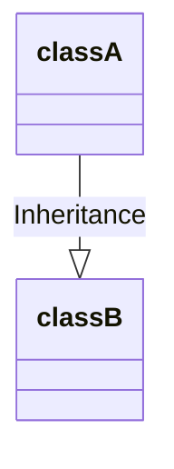
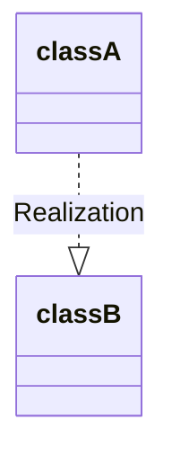
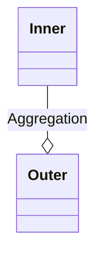
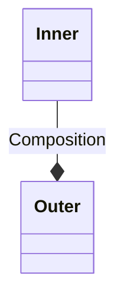
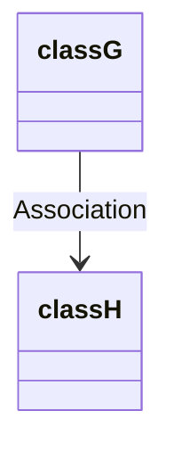
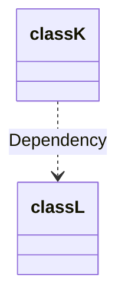

# 클래스 간의 상호 작용 정의

UML에 정의되어 있는 클래스 간의 여섯 가지 관계는 사실 불필요할 정도로 세부적이기 때문에 모두 사용할 필요는 없다.  
- **일반화**, **실체화**, **합성**, **의존** 네 가지만 사용해도 될 것이다.
- **합성**은 집합과 연관을 통합하는 관계로 정의하자

## 일반화

상속 관계를 나타낸다.  


```java
public class A { ... }
public class B extends A { ... }
```

## 실제화

일반적으로 인터페이스와 구현 클래스 간의 관계를 나타낸다.  




```java
public interface B { ... }
public class A implements B { ... }
```

## 집합

집합은 포함 관계이며, 클래스 Inner의 객체 생명 주기는 클래스 Outer 객체의 생명 주기에 종속되지 않을수도 있다.  
즉, 클래스 Outer의 객체는 클래스 Inner의 객체에 영향을 주지 않고 독립적으로 파괴될 수 있다.  


```java
public class Outer {
    private Inner inner;
    public Outer(Inner inner) {
        this.inner = inner;
    }
}
```

## 합성

합성도 포괄적인 관계이며, 클래스 Outer의 객체는 Inner 클래스를 포함하지만, 클래스 Inner의 객체 생명 주기가 클래스 Outer의 생명 주기에 따라 달라진다.  
클래스 Outer의 객체는 새와 날개의 관계와 같이 단독으로 존재할 수 없다.  

> Aggregation보다 강한 집합이다.


```java
public class Outer {
    private Inner inner;
    public Outer() {
        this.inner = new Inner();
    }
}
```

## 연관

집합과 합성의 두 가지 속성을 모두 가지는 매우 약한 관계다.  

> Association과 Aggregation은 집합이라는 개념적인 차이는 있지만 코드에서는 이 차이를 구분하기 힘들다.  
> Aggregation은 집합이라는 개념 외에 명확한 정의를 제공하지 않는다.  
> 그래서 여러 프로그래머나 분석가, 설계사가 Aggregation 관계에 대해 자기 나름의 정의를 내렸기 때문에 혼란이 생겼고 Aggregation은 사용하지 않는 것이 좋다고 한다.  


```java
public class Outer {
    private Inner inner;
    public Outer(Inner inner) {
        this.inner = inner;
    }
}

public class Outer {
    private Inner inner;
    public Outer() {
        this.inner = new Inner();
    }
}
```

## 의존

연관 관계보다도 더 약한 관계이다.  
클래스 Inner의 객체가 클래스 Outer 객체의 멤버 변수인지,  
클래스 Outer의 메서드가 클래스 Inner의 객체를 매개변수로 취하는지에 관계없이 클래스 Inner의 객체가 클래스 Outer의 객체와 어떤 관계가 있을 경우, 이를 의존 관계라 한다.  


```java
public class Outer {
    private Inner inner;
    public Outer(Inner inner) {
        this.inner = inner;
    }
}

public class Outer {
    private Inner inner;
    public Outer() {
        this.inner = new Inner();
    }
}
```