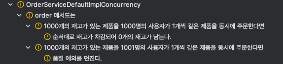
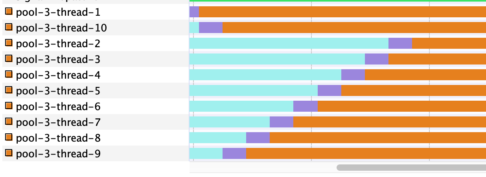
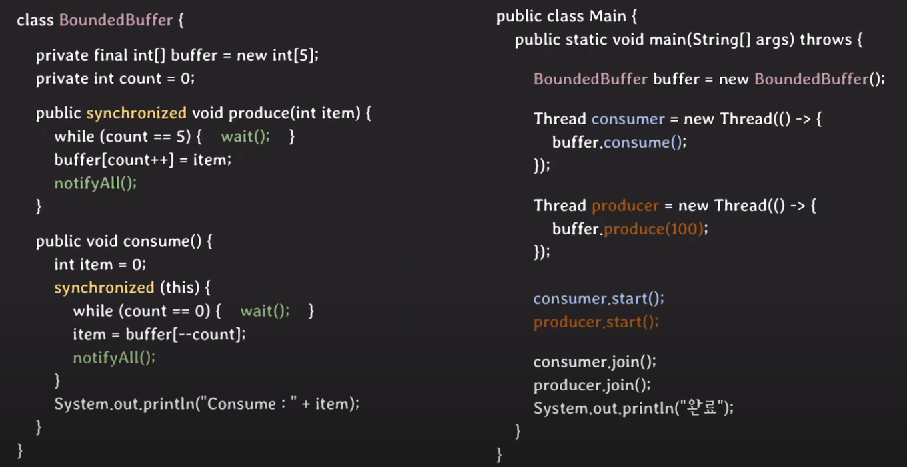

# 29cm 세미나 영상 요약

비즈니스 도메인을 중심으로 모델링된 독립적으로 배포 가능한 서비스  
**마이크로 서비스 도입 이렇게 한다 책 추천하심**  
- 장점
  - 증가하는 트래픽 처리가 쉽고 새로운 기능 추가를 빠르게 적용이 가능
  - 조직 성장에 맞는 아키텍처 적용 가능
  - 마이크로 서비스를 통해서 도메인이 분리되었기 때문에 해당 도메인에 조금 더 집중 가능
- 단점 : 복잡함 상승
   - 개발,운영,모니터링
   - 트랜잭션 관리, 디버깅 (보상 트랜잭션? 트랜잭션 사가?) 📌
   - 적정하게 도메인 나누기의 어려움 (너무 세세하게 분리하거나, 너무 크게 분리하거나) 📌
     - 결제와 주문 도메인을 분리할 때 커머스라는 팀으로 분리했다. 
     - 고려해야 할 사항이 많은 것 같다. 개발자의 수도 영향을 주는 것 같다.

20여개의 주요 도메인마다 독립된 서비스를 운영 중  
쿠버네티스와 istio의 조합, 수백개의 컨테이너를 관리 중  
  
우선 서버와 클라이언트 간의 **API 표준**부터 정의해야함  
`/api/{version}/{도메인명}` 패턴을 사용  
  
> 기술은 고객과 회사의 가치를 만들기 위해 존재한다.  
> 완벽한 계획보다는 빠른 실행을 추구하고, 목표 달성을 위해 구성원들간의 지속적인 소통 **목적 조직**
  
## 장애 케이스

1. **타임딜 오픈 직후 데드 락 발생**
   1. 상품을 관리하는 도메인 item + option
   2. option 재고를 모두 합치면 item의 재고이다. 1 (item) : N (option)
   3. 그래서 두 번의 UPDATE를 실행
   4. A 사용자가 230과 240을 주문, B 사용자가 240을 주문
   5. A 사용자가 230 option의 row lock 획득 -> update 230 option -> B 사용자가 240 option의 row lock 획득 -> update 240 option -> A 사용자가 item의 row lock 획득 -> update item -> A 사용자가 240 option의 row lock 획득 **실패** (B 사용자가 lock을 해제하길 기다림) -> B 사용자가 240 item의 row lock 획득 **실패** (A 사용자가 lock을 해제하길 기다림)
   6. A 사용자는 B 사용자의 option row lock을 해제하길 기다리고 B 사용자는 A 사용자의 item row lock을 해제하길 기다린다.
   7. 그래서 **유저별로 상품 구매 가능 수량을 1개로 제한**
   8. 임시 방편일 뿐, 기술이 비즈니스를 발목 잡는 상황
   9. 동일 상품 당 여러 option을 구매 시, option들을 먼저 차감하고, 일괄로 item 차감으로 개선
   10. 동일한 option 구매 유저가 존재하더라도, 기존 유저가 모든 option에 대한 재고 차감을 완료하여 row lock을 해제하기 전까지 다른 프로세스는 대기하게 된다. **row lock 획득 시점에 대한 언급은 없지만 아마 해당 트랜잭션이 시작될 때 option과 item에 대한 lock획득을 바로 하는 것 같다.** 📌
2. **라이브커머스 푸시 발송 이후 장애**
   1. 밤 8시에 대량의 푸시 발송
   2. 8시 20분쯤에 전면 장애
   3. 대용량의 트래픽이 순간적으로 유입되면서 발생
   4. 기존 레거시 모놀리틱 서비스 (파이썬, 장고) 와 신규 마이크로 서비스 (스프링, 자바, 코틀린)을 같이 운영하고 있었음
      1. 파이썬 인증 로직과 게이트웨이 때문
   5. 대량 유저가 파이썬 장고 서비스를 대량 호출하여 서비스 자체가 다운된 상황
   6. 쿠버네티스의 팟의 리스타트가 무한정으로 도는 상황
   7. 파이썬, 장고에 유입되는 트래픽을 줄이기 위해 장애 호출 API top10 리스트업하여 마이크로서비스를 직접 호출하도록 수정
      1. 추천 계열 API, 리뷰 계열 API
      2. API 호출을 하는 사용자가 누구인지 알아야하는 인증 로직이 필요한 API이다
   8. 기존 모놀리틱 서비스와 마이크로 서비스의 응답을 동일하게 해야하고, 엔드포인트를 마이크로 서비스로 직접 변경했을 떄 장애가 발생할 수 있으니 방향을 바로 변경할 수 있는 **피처플래그**도 개발해야했다. ❓
3. **3rd-party 결제 서비스 장애**
   1. 주문 결제 전면 장애 - 20년 12월, 21년 5월
   2. 한달 반이 지난 시점에 SPOF를 극복
   3. 두 개 이상의 결제 서비스와 계약하여 **결제 트래픽 분배기**를 위치시킴
   4. 특정 결제 서비스의 장애가 발생하더라도 다른 결제 서비스로 결제가 가능해짐

## 코드 품질 이슈

1. 멀쩡한 파이썬 프로젝트를 신규 프로젝트로 새로 구현한다는 것
   1. 기업 관점에서는 투자와 비용이다.
   2. 고로 처음부터 잘 만들어야한다.
   3. **구엔이일 책을 추천해주심**
2. 가독성 vs 성능 , 가독성 vs 추상화 레벨  
   1. 가독성을 중시하고 변경에 유연해야 한다.  
   2. 코드를 새로 작성하는 시간보다, 그 작성된 코드를 이해해야할 경우가 더 많기 때문이다.  
   3. 내부에 **표준 구현 방식**을 문서로 관리하고 있다.  
   4. **장애 회고 문서**, **개발 디자인 문서(서비스 초기 개발 방향과 컨셉)**, **아키텍처 결정 기록 문서(개발 과정에서 발생하는 아키텍처 의사결정 기록)** 작성도 함  
3. 목적에 맞으면서 높은 품질의 코드 구현을 위해 치열하게 고민한다.

# 단단한 성장을 위한 목표 기술 과제

## 도메인 다이어그램 / 데이터베이스 그룹핑

**단방향 호출**을 지향하고 **순환 참조**가 발생되면 책임 범위나 역할 정의가 잘 못되었다고 판단할 수 있다.  
  
```
user > item > commerce > activation > search,reivew,content,extenral...
```
  
주문,주문취소,교환,반품,정산,배송들의 액션은 결제가 일어나야 하는 것 처럼 방향이 존재한다  
shared DB 패턴을 사용하고 있다.  
2023년 안에는 몇몇 그룹핑 도메인을 중심으로 DB를 쪼개고 싶어한다.  

## Materialized view 서버 구축

마이크로 서비스 환경에서는 클라이언트가 여러 Web API 응답들을 모아서 aggregation하거나, aggregation하는 서버를 따로 두거나 해야한다.  
  
다양한 도메인의 데이터를 사전에 별도로 모아서 반정규화된 디비에 미리 저장한다.  
외부에서 데이터를 요청했을 때 상품, 가격, 재고, 할인, 리뷰 데이터가 한 번에 모아진 구조로 반환하는 기능  
  
주기적인 배치를 통해 도메인 데이터를 가져오거나, 비동기 메시징 기반으로 이벤트를 공급하여 데이터를 가져오거나  
  
> 캐시 서버 같은 느낌인데, 데이터를 가공하고 캐시하는 느낌?  
> 성능 측면에서는 장점  

## 이벤트 주도 아키텍처 (EDA)

**비동기 메시징**  
1. 메시지 발행 서버와 수신 서버 간의 의존성 제거 가능
   - 발행 서버는 수신 서버의 호스트 정보나 포트를 알 필요가 없다.
   - 메시지 브로커를 중심으로 퍼블리싱만 하면되고 그 메시지에 관심이있는 컨슈머들이 메시지를 소비하면 된다.
2. 메시지 브로커에 메시지가 전달되기만 하면 컨슈머 서버가 죽었거나 문제가 생기더라도 상관없다.
   - 컨슈머가 메시지를 여러 번 가져갈 수 있는 시간적 여유가 있다고 한다.??
3. 메시지 브로커가 대량의 트래픽을 커버하는 버퍼로 동작한다.
  
**고려해야할 것들**  
1. 발행 메시지 순서 보장 (주문 시도 -> 결제 완료 -> 주문 취소)
   1. 메시지에 키 값을 포함해서 보냄, 키를 해싱하여 특정 토픽의 파티션에만 들어가게끔
2. 컨슈밍할 때 중복 메시징 처리
   1. 메시지가 중복될 수 밖에 없는 구조이다.
   2. 컨슈머가 스스로 메시지를 읽었는지 구분하여야 한다.
3. 트랜잭셔널 메시징 구현
   1. 특정 서비스의 DB 트랜잭션 안에서 메시지도 같이 커밋되거나 롤백되어야 한다. 직접 구현해야 한다. (아웃박스 패턴)
   2. DB log를 tailing하는 프레임워크를 통해 (Debezium)


# 커피챗 준비

> **열린 질문을 하자.**

1. 난 커피도 챙겨옴
2. 가능하면 간단한 소개를 할까?
4. 개발 프로세스와 일정 산정 가이드가 나와 굉장히 비슷하다
   1. 보기로는 담당 개발자가 개발을 진행하는 문서를 작성하면서 리뷰를 통해 조언을 받거나 방향성을 잡는 것 같던데 어떤가요?
   2. 개발 프로세스를 간단하게 설명해주실 수 있을까요?
   3. 저희는 분석 -> 설계 -> 개발 순으로 진행되는데 분석,설계 일정은 대략적으로 산출하고, 개발 일정을 확실하게 산출하는 것 같다.
   4. 개발에서 분석이나 설계 단계에서 놓친 사항들이 발견되곤 하는데, 혹시 팁같은 것이 있을까요? 문서 작성 툴이라던지, 작성 방법이라던지?
5. 세미나 영상에서 팀원들끼리 패키지 구조적 책임을 협의한 화이트보드 사진이 인상 깊었다.
6. 개발 과정에서 발생하는 의사결정 기록을하는 ADR(아키텍처 의사결정 기록) 문서가 신기하다
   1. 히스토리를 몰라서 의도를 알 수 없는 처리를 보았었다. 예를 들어, 실제 처리에 필요하지 않는 로직이 존재하는 것?
   2. 이 외로 문서를 더 관리하는 것 같은데 문서 관리가 잘 되고있을지 궁금하다.
   3. 동기화가 잘 되는지, 실제로 다른 일을 작업하던 개발자가 새로운 프로젝트를 받았을 때 해당 문서가 실질적으로 도움이 되었었는지
   4. 표준 구현 방식 문서도 신기했다. 세세한 코딩 컨벤션까지 포함되어 있는걸까?
   5. 프로젝트를 진행할 때 마다 산출물은 나오는데 저희 회사는 관리가 잘 안돼서 문서를 믿을 수가 없다.
7. Materialized view 서버는 캐시 서버로 보이던데 개발이 진행되고 있는건가요?
   1. [BFF](https://fe-developers.kakaoent.com/2022/220310-kakaopage-bff/)로 볼 수 있을까요?
   2. 가공만 담당하는 것이 아니라 데이터를 저장하고 반환한다면 캐싱이라고 볼 수 있을까요?
      1. 캐싱이라면 캐시 교체는 어떻게 될까요?
   3. 데이터 동기화는 주기적인 배치나 이벤트를 발행하여 동기화한다고 하시던데 어떻게 동기화를 하시나요?
8. 요즘 따로 공부하시는거나 관심가지시는 기술이 있나?
9. 이벤트 주도 아키텍처를 구축하는 것이 목표라고 알고있는데, 현재는 서비스간에 통신은 동기로 이루어지고 있는건지?
   1.  동기로 통신하면서 문제가 많이 발생하는 것 같다.
10. 이벤트 주도 아키텍처를 적용이 진행 중인가요?
   1. 진행 중이라면 어떤 작업을 하고 계신가요?
   2. 카프카를 써보시니 어떠셨나요?
   3. 비동기 프로그래밍 어렵기도 하겠지만 재밌을 것 같다.

# 전략패턴 vs SOLID의 DIP vs 스프링의 DI

SOLID의 DIP를 설명할 때 전략 패턴과 스프링의 DI를 예로 들 수 있겠다.  
전략 패턴과 스프링의 DI는 클라이언트 코드가 특정 처리에 대한 내부 구현을 캡슐화하여 결합도를 낮추고 유연성을 놓이는 행위이다.  
  
전략 패턴을 적용하게 되면 클라이언트 코드에서 내부 구현체는 다르지만 다형성과 동적 디스패치를 통해 호출할 기능을 동적으로 변경할 수 있다.  
스프링의 DI는 빈을 로딩할 떄 의존된 빈을 확인하여 필요한 빈을 주입해주는 것이다. 이런 식으로 의존성을 관리하게 되면 결합도를 감소시킬 수 있고, 테스트 시에도 주입을 달리하여 테스트 환경에 용이하고, 재사용이 가능하다.  
  
위에서 말헀던 전략 패턴과 스프링의 DI를 적용할 때 **의존 역전 원칙**을 지켜야한다.  
이 원칙은 **상위 인터페이스의 타입으로 통신하라**는 원칛이다.  
하위 모듈의 인스턴스에 직접 의존하게 되면 하위 모듈 변화가 있을 때마다 클라이언트나 상위 모듈을 자주 수정해야 하기 때문이다.  
쉽게 생각하면 추상화 지점을 찾아 추상화를 하게 되었다면 클라이언트 코드는 추상화의 구현체를 직접 의존하는 것이 아니라 추상화 타입에 대해 의존하는 것이다.  
  
생각해보면 전략 패턴은 이 유연성이 생명인데, 구현 타입에 직접 의존하는 것은 전략 패턴이라고 생각되지 않는다.  

# gRPC vs Message Queue vs HTTP API

# HTTPS 적용과정

# JPA와 MyBatis 차이(성능면에서)

# 인터페이스와 추상클래스 차이

# TCP/UDP 에 대해

# RDBMS Lock에 대해

# ConcurrentHashMap

이때까지 `ConcurrentHashMap`이 동시성 문제를 다 해결해주는 줄 알고 있었지만 아래의 테스트 코드는 실패한다.  

```kotlin
describe("ConcurrentHashMap<String,Item>") {
   context("Item의 재고를 동시에 감소시키면") {
      it("동시성 문제가 생긴다.") {
            data class Item (
               val itemId: String,
               val quantity: Int
            )

            val itemKey = "인형"
            val items = ConcurrentHashMap<String, Item>().apply {
               this[itemKey] = Item(itemKey, 1000)
            }
            val threadCount = 1000
            val executor = Executors.newFixedThreadPool(threadCount)
            val latch = CountDownLatch(threadCount)

            for (i in 1..threadCount) {
               executor.submit {
                  try {
                        val findItem = items[itemKey]!!
                        items[itemKey] = findItem.copy(quantity = findItem.quantity - 1)
                  } catch (e: Exception) {
                        e.printStackTrace()
                  } finally {
                        latch.countDown()
                  }
               }
            }
            latch.await()
            items[itemKey]!!.quantity shouldBe 0
      }
   }
}
```

`"인형"`이라는 Item은 재고가 1000개가 있다고 가정하고, 1000개의 스레드가 동시에 ConcurrentHashMap에서 Item을 찾고, 찾은 Item의 재고 수 기준으로 1씩 차감하는 테스트 코드다.  
Map 내부에서 동기화를 해주는 줄 알겠지만 테스트가 끝난 후에는 재고가 0개이길 기대하지만, 동시성 문제가 해결되지 않아 재고가 순차적으로 차감되지 않는다.  
  
[`javase 17` ConcurrentHashMap](https://docs.oracle.com/en/java/javase/17/docs/api/java.base/java/util/concurrent/ConcurrentHashMap.html)을 살펴보면 

> 모든 작업이 스레드로부터 안전하더라도 검색 작업에는 잠금이 수반되지 않으며 모든 액세스를 방지하는 방식으로 전체 테이블을 잠그는 기능이 지원되지 않습니다 .  
> 검색 작업( get 포함)은 일반적으로 차단되지 않으므로 업데이트 작업( put 및 remove 포함)과 겹칠 수 있습니다.  
> 검색은 가장 최근에 완료된 업데이트 작업의 결과를 반영합니다.  
> ...


# Synchronized

상품들의 재고를 관리하는 과제를 진행하면서, `ConcurrentHashMap`을 사용했다.  
- `ConcurrentHashMap`이 동시성 문제를 다 해결해주는 줄 알고 있었지만 아니였다.
키는 상품의 식별자이고 값은 상품이다.  
특정 상품의 재고를 감소할 때 내가 원했던 것은 재고 감소할 상품에 대해 락을 거는 것이였다. (디비의 로우 락 처럼)  

```kotlin
private val items = ConcurrentHashMap<String, ItemEntity>()

// 기존에는 items 통째로 동기화를 걸었다.
fun decreaseQuantity(item: ItemEntity) : ItemEntity? {
    synchronized(items) {
        this.items[item.id]?.let {
            return this.updateOne(it.decreaseQuantity(item.quantity))
        } ?: throw ItemNotExistException(String.format(CustomExceptionMessage.PRODUCT_NOT_FOUND.description, item.id))
    }
}

// 하지만 items 통째로 동기화를 거는 것은 비효율적이여, items의 id 기준으로 동기화를 걸었다.
fun decreaseQuantity(item: ItemEntity) : ItemEntity? {
    synchronized(item.id) {
        val findItem = this.items[item.id]
            ?: throw ItemNotExistException(String.format(CustomExceptionMessage.PRODUCT_NOT_FOUND.description, item.id))
        return this.updateOne(findItem.decreaseQuantity(item.quantity))
    }
}
```



`synchronized`에 대해 알아보자

> The Java programming language provides multiple mechanisms for **communicating between threads**.  
> The most basic of these methods is **synchronization**, which is implemented using **monitors**.  
> Each object in Java is associated with a **monitor**, which a **thread can lock or unlock.**  
> Only one thread at a time may hold a lock on a monitor.  
> Any other threads attempting to lock that monitor are **blocked until they can obtain a lock on that monitor**  
  
자바는 스레드간 통신할 수 있는 여러가지 메커니즘을 제공한다. 가장 기본적인 방법은 monitor를 사용하는 synchronization이다.  
자바에서는 각 객체가 모니터와 연관되며, 스레드는 해당 모니터를 잠그거나 잠금을 해제할 수 있다.  
한 번에 하나의 스레드만 모니터의 잠금을 보유할 수 있고, 다른 스레드가 잠금을 획득하려 한다면 차단된다.  
  
## monitor



`synchronized`를 사용해보면 위와 같이 다른 스레드들은 `monitor` 상태로 기다리게 된다.  
- 푸른색이 `monitor`상태다.
  
**모니터의 구성요소**  
1. **mutex**
   1. 임계 영역 진입을 기다리는 entry queue를 가진다. 
   2. critical section에서 상호 배제를 지키기 위한 방법
   3. mutex lock을 취득하지 못한 스레드는 **큐에 들어간 후 대기 상태로 전환**
2. **condition variable**
   1. **자바의 monitor는 한 개의 condition variable을 가진다.**  
   2. 조건이 충족되길 기다리는 waiting queue를 가진다.
   3. 조건이 충족되길 기다리는 스레드들이 대기 상태로 머무는 곳
   4. 주요 동작
      1. `wait` : 스레드를 큐에 넣고 대기 상태로 전환
      2. `signal`, `notify` : waiting queue에서 대기중인 한 개의 스레드를 깨움
      3. `broadcast`, `notifyAll` : waiting queue의 모든 스레드를 꺠움
  


> 결론은 한 개의 객체에 한 개의 monitor를 가지고, monitor안에는 mutex lock과 condition variable이 있다.  
> 객체의 mutex lock을 한 스레드가 가지고 있을 때 다른 스레드들은 해당 mutex lock에서 관리하는 entry queue에서 대기 상태로 기다리고 있는다.  
> - entry queue의 구현은 선입선출이 아니라 우선순위 큐일 수도 있다.  
> mutex lock을 얻고 임계 영역에 진입했다고 하여도, 내부 조건이 맞지 않으면 condition variable의 waiting queue에서 대기 상태로 기다린다.  
> **critical section 내에서 waiting 하는 기능은 뮤텍스나 세마포는 제공하지 않는 기능**  
> 자바의 모니터는 **한 개의 condition variable을 가지고 있기 때문에**  
> `wait()`을 통해서 mutex lock을 반납하여 entry queue에서 대기하던 스레드를 깨울 수 있고,  
> `notify()`또는 `notifyAll()`로 waiting queue에서 대기하던 스레드를 깨울 수 있다.  