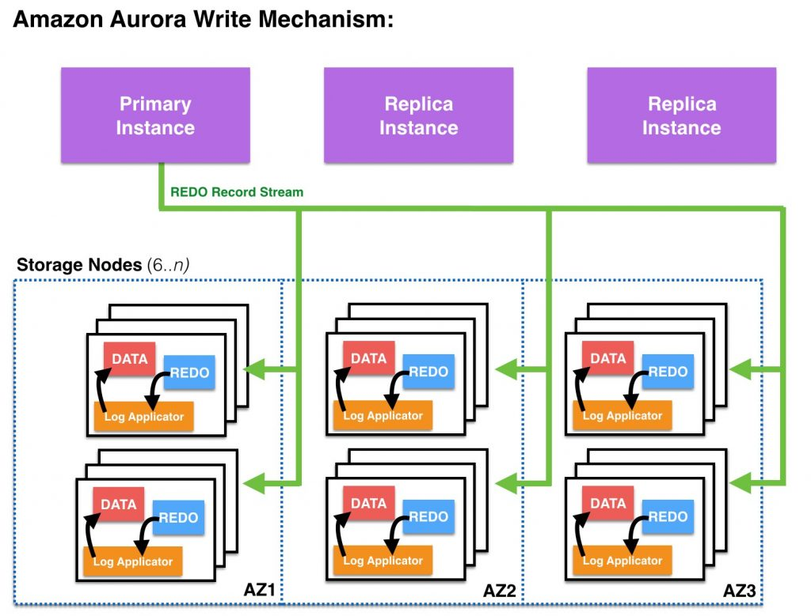

단일 데이터베이스 환경에서 AWS Aurora 클러스터로 마이그레이션하면서 고민했었던 부분들 그리고 MySQL 5.7에서 8.0으로 버전업하면서 신경써야 했던 부분들을 정리해보려한다.  

# 직접 클러스터 구성하기

읽기 전용 DB(Secondary)들을 Primary DB의 Replication DB로 구성하여 **[ProxySQL](https://proxysql.com/)을 사용하여 RW를 분리**하고 **[Orchestrator](https://github.com/openark/orchestrator)를 통하여 페일백/페일오버**를 직접 구성하여 클러스터를 직접 구축하는 것을 고민했다.  

하지만 큰 단점이 있었다.  

1. Proxy SQL에 문제가 생긴다면 모든 DB를 사용할 수 없게 되는 **단일 장애 지점** 이 생긴다.
2. 애플리케이션 외부에서 사용될 DB가 결정되기 때문에 작업 단위(트랜잭션)에 대한 문제가 생긴다.

위의 두 문제가 있어 AWS Aurora 클러스터를 분석하여 사용해보기로 하였다.  
혹시 이 구성에 대해 더 자세히 알고 싶다면 [`인프런` 따라하며 배우는 MySQL on Docker](https://www.inflearn.com/course/mysql-docker/dashboard) 강의를 참고하길 바란다.

# AWS Aurora 클러스터 분석

Aurora 클러스터를 사용하기 위해서는 확인해야 할 부분들이 있었다.

<h3>Aurora 클러스터의 페일오버와 페일백은 어떻게 진행되는가?</h3>

기본 인스턴스에 문제가 발생하는 경우 읽기 인스턴스 중 하나가 기본 인스턴스 역할을 인수한다.  
Aurora는 데이터베이스 문제를 감지하고 필요한 경우 장애 조치 메커니즘을 자동으로 활성화하여 장애 조치 중에 쓰기 작업을 처리하지 못하는 시간이 최소화된다.  
Aurora는 다음 두 가지 방법 중 하나를 사용하여 자동으로 새 기본 인스턴스로 장애 조치한다.  

1. 우선순위가 높은 기존 Aurora 복제본을 새 기본 인스턴스로 승격시킴
2. 새로운 기본 인스턴스 만들기

DB 클러스터에 Aurora 복제본이 하나 이상인 경우에는 장애가 발생하더라도 Aurora 복제본이 기본 인스턴스로 승격되며 **이 실패 이벤트로 인해 예외적으로 실패하는 읽기 및 쓰기 작업 동안 짧은 중단이 발생한다.**  
하지만, **일반적인 서비스 복구 시간은 60초 미만이지만 대부분 30초 미만에 복원된다.** (read only connection 예외 발생)  
최소 하나 이상의 Aurora 복제본을 둘 이상의 다른 가용 영역에 생성하는 것이 바람직하다.  
  
DB 클러스터에 Aurora 복제본이 포함되어 있지 않으면 기본 인스턴스가 동일한 AZ에 다시 생성되기 때문에 보통 10분 미만의 시간이 걸리며 그 동안 예외적으로 실패하는 읽기 및 쓰기 작업 동안 중단이 발생한다.  
Aurora 복제본을 기본 인스턴스로 승격시키는 것이 기본 인스턴스를 새로 생성하는 것보다 훨씬 빠르다.  

[출처 : [Amazon Aurora의 고가용성](https://docs.aws.amazon.com/ko_kr/AmazonRDS/latest/AuroraUserGuide/Concepts.AuroraHighAvailability.html)]  
  
운영 중에 DB 스케일 업에 대한 트러블 슈팅 글도 읽어보면 도움이 될 것이다. [29CM 의 이굿위크 장애대응 기록](https://medium.com/29cm/29cm-%EC%9D%98-%EC%9D%B4%EA%B5%BF%EC%9C%84%ED%81%AC-%EC%9E%A5%EC%95%A0%EB%8C%80%EC%9D%91-%EA%B8%B0%EB%A1%9D-177b6b2f07a0)

<h3>Secondary의 동기화 지연율은 어느정도인가?</h3>

먼저 쓰기 연산은 Primary에서 관리하며 Aurora 복제본(Secondary)은 클러스터 볼륨의 읽기 연산에 사용되므로 읽기 조정에 유용하다.  
데이터들은 단일 AWS 리전에서 다중 가용 영역에 걸쳐 DB 클러스터에 데이터 복사본을 저장하며, DB 클러스터의 인스턴스가 여러 가용성 영역에 걸쳐 있는지 여부에 관계없이 복사본을 저장한다.  

DB 클러스터 볼륨은 DB 클러스터의 여러 데이터 사본으로 구성되어 있지만, DB 클러스터의 Primary 및 Aurora 복제본(Secondary)에는 클러스터 볼륨 데이터가 단 하나의 볼륨으로 표시된다.  
신규 인스턴스가 추가되어도 기존 데이터를 새로 복사하지 않고 DB 클러스터 볼륨에 연결만하기 때문에 인스턴스를 추가하기 용이하다.  
전통적인(기존 MySQL) 방식으로 읽기 인스턴스를 스케일링 하기 위해서는 인스턴스들은 볼륨을 각각 소유하며 binlog를 이용해 SQL문을 복제본으로 전달하여 Primary에서는 멀티 스레드로 수행하던 쿼리를 Secondary에서는 싱글 스레드로 처리하기 때문에 동기화 지연율이 존재할 수 밖에 없다.  
  

> 동기식 복제에서는 하나의 쓰기가 내구성을 갖추려면, 모든 복사본을 확인해야 합니다. 이 방법에서 속도는 디스크, 노드 또는 네트워크 경로에 중 가장 느린 요소에서 얼마나 느린가에 의해 결정됩니다.  
> 반면, 비동기식 복제는 지연 시간을 낮출 수 있지만 데이터를 복제하고 데이터 내구성을 확인하기 전에 장애가 발생하면 데이터가 손실될 수 있습니다.  
> 사실 두 방식 모두 완벽하지 않습니다. 또한, 장애가 발생하면 복제 구성원 집합에 변경이 발생하게 되므로 쉽지 않습니다.  
  
대신 Amazon Aurora는 **쿼럼 모델**을 사용하여 3개의 가용 영역(AZ)에 걸쳐 4개의 쓰기 세트와 3개의 읽기 세트가 있는 6개 복사본 쿼럼을 사용하며, Pirmary에서 쓰기가 발생하면 6개의 스토리지 노드에 REDO 로그 레코드가 작성되며 **이중 4개의 노드가 쓰기 완료 응답(ACK)을 전송하면 해당 쓰기가 완료된 것으로 확인한다.**  
3개의 AZ에 걸쳐 노드를 분산하기 때문에, 하나의 AZ에 문제가 발생허다러도 내결함성을 유지할 수 있으며, 느린 노드가 존재하더라도 다른 노드가 신속하게 응답하기 때문에 가용성이 떨어지지 않는다.  
  
즉, **Aurora의 읽기 전용 복제본은 마스터 데이터베이스 노드와 동일한 스토리지 볼륨을 공유하며, 마스터의 실행 로그를 비동기로 전달받아 캐시내 데이터 페이지를 갱신한다.**  
그렇기 때문에 읽기 복제본의 데이터 유실이나 마스터 노드로 승격 시키는 비용도 줄어든다.  

마스터(쓰기) 노드에서 커밋된 모든 변경사항이 복제본으로 미처 전파되지 않았더라도 영구적으로 저장되며 복제 노드들은 독자적으로 읽기를 수행할 때 읽어야 할 데이터의 쓰기 및 쓰기 완료 응답 등의 현황에 대해 알 수 없다.  
그렇기에 마스터에서 복제본으로 실행 레코드들을 전달할 때 읽기 뷰와 개념적으로 동일한 기능을 함께 제공한다.  
이러한 뷰는 **커밋 LSN** 과 **어떤 세그먼트들이 어떤 LSN로 영구 저장 되었는지** 의 정보를 보유하고 있으며, 일반적으로 커밋 LSN는 `10 밀리초`마다 반영될 수 있기에 **복제본들은 최소한의 조정으로 마스터 노드와 거의 동일한 정보를 제공할 수 있다.**  
  
> **읽기 뷰**  
> 읽기 뷰는 SQL문 수행 시 커밋된 모든 변경사항은 볼 수 있고, 아직 커밋되지 않은 변경사항은 보지 못하게 하기 위한 논리적인 시점을 설정합니다.  
> MySQL은 가장 최근 커밋의 로그시퀀스번호(LSN)을 설정하여 이를 구현하며, 이러한 방식을 통해 이미 커밋된 모든 변경사항들은 조회 가능하게 하고, 조회되지 말아야 할 변경사항들은 활성 트랜잭션 리스트를 사용하여 확인합니다.  
> 특정 읽기 뷰를 가진 SQL문이 데이터 페이지를 조회할 때, 읽기 뷰 생성 당시 활성화된 트랜잭션들의 변경 사항은 조회되지 말아야 합니다.  
> 이는 변경 사항이 현재 커밋되었거나 읽기 시점 커밋 LSN 이후에 시작된 어떠한 트랜잭션들에 대해서도 동일하게 적용됩니다.  
> 트랜잭션이 읽기 뷰를 생성하면, 시스템 내 발생한 모든 다른 변경 사항들로부터 격리될 수 있습니다. —일관된 특정 시점을 참조할 수 있습니다.
  
**출처**  

1. [Amazon Aurora MySQL을 사용한 복제](https://docs.aws.amazon.com/ko_kr/AmazonRDS/latest/AuroraUserGuide/AuroraMySQL.Replication.html)
2. [Amazon Aurora 내부 들여다보기 (1) – 쿼럼 및 상관 오류 해결 방법](https://aws.amazon.com/ko/blogs/korea/amazon-aurora-under-the-hood-quorum-and-correlated-failure/)
3. [Amazon Aurora 내부 들여다보기(2) – 쿼럼 읽기 및 상태 변경](https://aws.amazon.com/ko/blogs/korea/amazon-aurora-under-the-hood-quorum-reads-and-mutating-state/)
4. [AWS Aurora 아키텍처](https://medium.com/garimoo/aws-aurora-%EC%95%84%ED%82%A4%ED%85%8D%EC%B2%98-6ff87b0d48c5)]

<h3>Aurora 클러스터 스토리지는 어느것을 사용하나?</h3>

Aurora 클러스터 스토리지에는 **Aurora Standard** 와 **Aurora I/O-Optimized** 가 존재한다.  
  
**Aurora Standard**는 I/O 사용량이 낮거나 보편적인 대부분의 환경에서 효율적인 요금으로 사용할 수 있는 구성이기에 많이 선택되는 것 같다.    
**Aurora I/O-Optimized**는 I/O를 많이 사용하는 애플리케이션(결제 처리 시스템, 전자상거래 시스템, 금융 애플리케이션 등)에 우수한 가격 대비 성능을 제공하는 데이터베이스 클러스터 구성이다.  
또한 I/O 지출이 총 Aurora 데이터베이스 지출의 25%를 초과하는 경우 Aurora I/O-Optimized를 이용하면 I/O 집약적 워크로드의 비용을 최대 40% 절감할 수 있다.  
따라서 I/O 변동성이 큰 워크로드에 적합한 구성이다.  
  
클러스터 구성에서 스토리지 구성 수정이 가능하기 때문에 현재는 Standard로 설정했으며, 운영 반영 후에 CloudWatch를 사용하여 비용을 추정해보려 한다.  
[Amazon CloudWatch를 이용한 Amazon Aurora I/O Optimized 기능에 대한 비용 절감 예상하기](https://aws.amazon.com/ko/blogs/tech/estimate-cost-savings-for-the-amazon-aurora-i-o-optimized-feature-using-amazon-cloudwatch/)
  
**출처**  
1. [Aurora FAQ](https://aws.amazon.com/ko/rds/aurora/faqs/)
2. [Aurora 클러스터 스토리지 구성](https://docs.aws.amazon.com/ko_kr/AmazonRDS/latest/AuroraUserGuide/Aurora.Overview.StorageReliability.html)
3. [Aurora 클러스터 스토리지 요금](https://aws.amazon.com/ko/rds/aurora/pricing/)

<h3>정리</h3>

## Aurora 인스턴스 스펙 선정을 위한 부하 테스트

1. mysqlslap
2. sysbench

# 스프링에서 읽기/쓰기 작업 분리

1. 스프링에서 RW 커넥션을 분리

# AWS DMS를 이용한 데이터 이관

4. AWS DMS를 사용하면서 주의해야 할점
   1. 엔드포인트, 복제 인스턴스, 마이그레이션 태스크
   2. 적재 모드 선택
   3. 지속적인 복제를 사용하려면 binary logging이 활성화되어 있어야함
   4. 마이그레이션 대상 DB에 파티션된 테이블이 있다면 해당 테이블은 대상 DB에 미리 생성 해놓아야하며, 대상 테이블 준비 모드는 "아무 작업 안함" 또는 "자르기"를 선택해야 한다.
   5. 동기화가 끝나면 대상 테이블의 AUTO_INCREMENT 값을 수동으로 동기화 시켜줘야 한다.
   6. 테이블에 LOB 형식의 컬럼이 Not null 제약 조건이 있다면 해당 제약 조건을 제거하고 마이그레이션이 끝난 후 제약 조건을 추가해야 한다.
5. AWS DMS
   1. 동시에 8개의 테이블을 10000 레코드를 복제함. 변경 감지 트랜잭션 활성화 시간은 기본값인 10분이지만 변경도 가능하긴 함

# MySQL 버전업을 진행하면서 고려해야할 점

1. [예약어](https://dev.mysql.com/doc/refman/8.0/en/keywords.html#keywords-8-0-detailed-C)
1. SSL에 대한 암호화 알고리즘 호환 확인
   1. 기존에는 useSSL=false로 사용하고 있었음
2. utf8mb3 -> utf8mb4
   1. utf8mb3을 utf8mb4로 변경하면서 컬럼 사이즈(VARCHAR는 최대 65535자를 저장)와 인덱스 사이즈(The DYNAMIC row format supports index key prefixes up to 3072 bytes.) 확인
      1. [DYNAMIC Row Format](https://dev.mysql.com/doc/refman/8.0/en/innodb-row-format.html#innodb-row-format-dynamic)
   2. MySQL 8.0.17부터 숫자 데이터 유형에 대한 ZEROFILL 속성과 정수 데이터 유형에 대한 표시 너비 속성은 더 이상 사용되지 않습니다. 향후 MySQL 버전에서는 정수 데이터 유형에 대한 ZEROFILL 및 표시 너비 지원이 제거될 것으로 예상해야 합니다. [참고](https://dev.mysql.com/doc/refman/8.0/en/numeric-type-attributes.html)
3. 기존에 사용중이던 DB의 환경변수 (max-allow-packet, max-connections)
