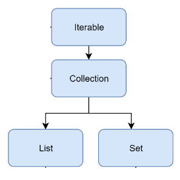

# 들어가기전에

> "소스 코드를 읽으면서 종종 그것이 어떤 의미인지 이해하지 못하는 경우가 있다. 사실 이런 문제의 원인은 매우 간단하다."  
> "코드를 완벽하게 이해하기 위해 **필요한 기본적인 기술적 소양과 능력이 부족하기 때문이다.**  
> - 디자인 패턴의 아름다움 1장
  
위와 같은 말에 공감하여 디자인 패턴의 아름다움 1장과 2장을 정리해보려 한다.  
작성되어 있는 코드를 분석하다보면 나에게 생소한 디자인 패턴이 적용되어 있거나, 연속된 추상화 등등 이해가 힘들 때 `"내가 이런 복잡한 비즈니스를 많이 접해보지 못하고 기술적인 소양이 낮아서 그런건가?"`라는 생각을 한적이 있다.  
**좋은 코드를 보고 그 원리를 분석하여 내 것으로 만들고 싶어도 기술의 이해가 없다면 본질을 이해하지 못해 작성작의 의도를 파악할 수 없을 것이다.**  
  
하지만 내가 좋은 코드를 보고 좋은 코드라고 판단할 수 있을까?  
내가 좋은 코드를 좋은 코드라고 판단하지 못하고, 좋은 코드를 작성하지 못하는 이유는 **어떤 코드가 고품질의 코드인지 알지 못하기 때문이다.**  
아래와 같은 질문을 어느정도로 생각하나?  
  
1. 계층화와 하위 모듈화 방법은 무엇인가?
2. 클래스를 어떻게 나누는 것이 좋은가?
3. 각 클래스에는 어떤 책임과 역할이 있는가?
4. 클래스 간의 상호 작용을 설계하는 방법, 메시지는 무엇인가?
5. 상속을 사용하는 것이 옳은가?
6. 인터페이스나 추상 클래스를 사용하는 것이 옳은가?
7. 결합도가 높은 코드와 낮은 코드는 무엇인가?
8. 디커플링을 달성하는 방법은 무엇인가?
9. 싱글턴 패턴이나 정적 메서드를 사용하는 것이 옳은가?
10. 객체를 생성할 때 팩터리 패턴을 사용하는 것이 옳은가?
11. 가독성을 유지하면서 확장성을 향상하기 위해 디자인 패턴을 도입하는 방법은 무엇인가?
12. 어떤 종류의 코드가 확장과 유지관리에 용이한가?
  
> "컴퓨터가 이해할 수 있는 코드는 바보라도 작성할 수 있다. 훌륭한 프로그래머는 사람이 이해할 수 있는 코드를 작성한다." - 마틴 파울러

위에서 말하는 좋은 코드, 고품질 코드를 작성하기 위해서는 **객체지향 프로그래밍**에 대해 충분히 이해해야 한다.  
  
# **객체지향 프로그래밍**

> 객체지향 프로그래밍의 프로그래밍 단위는 **클래스**또는 **객체**이고,  
> 절차지향 프로그래밍의 프로그래밍 단위는 **함수**이며,  
> 함수형 프로그래밍의 프로그래밍 단위는 **스테이트리스 함수**이다.
  
객체지향 프로그래밍은 `클래스의 관점`에서 생각해야 한다.  
처음부터 복잡한 프로세스를 메서드로 분해하는 대신 **어떻게 비즈니스 모델링을 할지 먼저 생각한 후 요구 사항을 클래스로 구성하고 클래스 간의 상호 작용을 설정**한다.  
객체지향 프로그래밍을 이해하기 위해서는 **캡슐화**, **추상화**, **상속**, **다형성**을 이해해야 한다.  
  
<h3>캡슐화</h3>

정보 은닉 또는 데이터 접근 보호라고도 하는데, **접근 가능한 인터페이스를 제한하여 클래스가 제공하는 메서드를 통해서만 내부 정보나 데이터에 대한 외부 접근을 허가하는 것을 뜻 한다.**  
예를 들어, 객체 생성 시 값이 결정되며 그 이후로 재할당되어서는 안되는 속성을 지키거나 속성을 수정하는 비즈니스 세부 정보를 지킬 수 있다.  
  
클래스의 속성에 대한 접근을 제한하지 않으면 모든 코드가 클래스의 속성에 접근하고 값을 변경할 수 있게 된다.  
얼핏 이것이 더 유연하게 느껴지지만, **과도한 유연성은 제어할 수 없음을 의미하고 수정 로직이 코드의 모든 곳에 흩어져 가독성과 유지 관리 용이성에 문제를 끼친다.**  
그리고 클래스는 필요한 작업만 노출하는 제한된 메서드를 제공하여 클래스의 사용성을 향상 시킬 수 있다.  
  
<h3>추상화</h3>  

**메서드의 내부 구현을 숨기는 것을 의미한다.** `함수` 그 자체가 구현을 숨기는 추상화에 해당한다.  
따라서 클래스를 사용할 때 기능의 구현 방식에 대해 고민하지 않고, **메서드가 제공하는 기능에만 집중할 수 있다.**  
`함수`라는 문법을 통해 구현되기 때문에 **실제로 코드의 구현 내용은 그 자체로 추상화되는 함수의 내부에 포함된다.**  
**규칙과 구현의 분리**를 실현하여 코드의 결합 정도를 줄이고 코드의 확장성을 향상 시킬 수 있다.  
  
<h3>상속</h3>  

`고양이는 포유류의 일종이다.`처럼 클래스 사이의 `is-a`관계를 나타내는 데 사용된다.  
상속은 이해하기도 쉬우며 동일한 코드의 중복을 막아낼 수 있다.  
하지만 과도하게 사용할 경우, 상속 계층 구조가 너무 깊고 복잡하면 코드의 가독성과 유지 관리성이 급격하게 떨어지므로 유의해야 한다.  
  
<h3>다형성</h3>

특정한 함수 구현을 수정해야 하는 경우 새 하위 클래스를 구현하여 기존 함수를 재정의할 수 있으며, 상위 클래스를 하위 클래스로 대체할 수 있다.  
`수정에 대해 폐쇄적이고 확장에 대해 개방적`이라는 설계 원칙을 준수할 수 있으며, **동일한 논리(같은 타입)를 재사용할 수 있어 코드의 재사용성을 향상 시킬 수 있다.**  
  
다형성의 특성을 구현하기 위해
1. 상속과 메서드 재정의를 하는 방식
2. 인터페이스를 사용하여 합성하는 방식

Collection Framework의 `Iterable`을 통해 인터페이스를 사용하여 합성하는 방식을 확인해보자.  



```java
public static void main(String[] args) {
    List<String> list = new ArrayList<>();
    Set<String> set = new HashSet<>();

    System.out.println(list);
    System.out.println(set);
}
```

이렇게 Collection 하위 타입을 출력하게 되면 아래 코드의 구현체에 구현되어 있는 `Iterable`을 반환받아 출력받게 된다.  

```java
public abstract class AbstractCollection<E> implements Collection<E> {
    public String toString() {
        Iterator<E> it = iterator();
        // ...
    }
}

public class ArrayList<E> extends AbstractList<E>
        implements List<E>, RandomAccess, Cloneable, java.io.Serializable
{
    public Iterator<E> iterator() {
        return new Itr();
    }
    // ...
}

public class HashSet<E> extends AbstractSet<E>
    implements Set<E>, Cloneable, java.io.Serializable
{
    public Iterator<E> iterator() {
        return map.keySet().iterator();
    }
    // ...
}
```

# **추상 클래스와 인터페이스**

개발하면서 추상화를 고민할 때 추상 클래스를 쓸지, 인터페이스를 쓸지 잠깐 고민하게 된다.  
하지만 항상 인터페이스를 쓰게 되는데 그 이유는 
1. 인터페이스도 구현 메서드를 가질 수 있다.
2. 다중 상속이 안되니 정말 강한 관계라고 의도를 표현하고 싶은 것이 아니기 때문이다.
3. 인터페이스에서는 속성을 (`static final`로 선언할 수 있긴 하지만) 선언할 수 없다.
4. 부모 클래스를 같이 초기화해야 한다.
  
항상 추상 클래스를 배제하였지만, 디자인 패턴의 아름다움을 읽고 생각이 조금 바뀌게 된 것 같아 정리하려 한다.  
  
클래스 상속의 관점에서 **추상 클래스는 상향식 설계 방식**이며, 먼저 하위 클래스의 코드를 반복한 다음 상위 클래스를 추상화한 것이 추상 클래스다.  
**인터페이스는 반대로 하향식 설계 방식**이며, 프로토콜 또는 규약의 집합으로 사용자에게 제공되는 **기능의 목록**이다.  
    
> `is-a` 관계를 나타내고자 하고 코드 재사용 문제를 해결하려면 **추상 클래스**  
> `has-a`(또는 `can-do`, `behave like`) 관계를 나타내고, 코드 재사용 문제가 아닌 추상화 문제를 해결하려면 **인터페이스**를 사용하면 된다.

<h3>추상 클래스</h3>  
1. 인스턴스화할 수 없다.
2. 속성과 메서드를 포함할 수 있다.
3. 하위 클래스는 추상 클래스의 모든 추상 메서드를 구현해야 한다.
  


# **결론**

객체지향 프로그래밍 언어를 사용하여 모든 코드를 클래스에 넣기만 하면 그것이 바로 객체지향 프로그래밍이라고 생각하지만 절차지향 프로그래밍 스타일로 작성한 경우가 대부분일 것이다.  
예를 들어, 많은 비즈니스 로직을 `Service` 계층에 몰아넣고 객체지향이다 라고 말하는 것과 같이 말이다.  
대부분의 백엔드 개발자들은 표현 계층, 논리 계층, 데이터 계층 MVC 아키텍처에 익숙하여 **빈약한 도메인 모델**을 의식하지 못하며 개발한다.  

> 💡 **풍성한 도메인 모델**  
> 1. Service 클래스는 저장소 계층과 통신하여 도메인 모델을 만들어낸다.
> 2. Service 클래스는 여러 도메인 모델의 비즈니스 논리를 결합한다.  
> 3. Service 클래스는 기능과 무관한 타 시스템과의 상호 작용을 담당한다.
  
개발하는 시스템의 비즈니스가 비교적 단순할때는 굳이 복잡한 풍성한 도메인 모델을 설계하기 보다는 빈약한 도메인 모델이 더 적합하다.  
하지만 복잡한 시스템일때 많은 개발자들이 풍성한 도메인 모델을 잘 설계하고 있진 않을 것이다.  
**풍성한 도메인 모델은 설계하기가 훨씬 까다롭고, 빈약한 도메인 모델을 기반으로 하는 전통적인 개발 방식은 수년 동안 사용되어 왔고 대부분의 개발자에게 단단하게 박혀 있기 때문에 쉽게 적용하기에는 힘들 것이다.**  
  
시스템이 복잡할수록 코드 재사용성과 유지 관리 용이성에 대한 요구 사항은 점점 높아지기 때문에 초기 설계에 더 많은 시간과 에너지를 투자하여 **풍성한 도메인 모델에 기반한 DDD 개발 방식에 익숙해져야 할 것이다.**  
